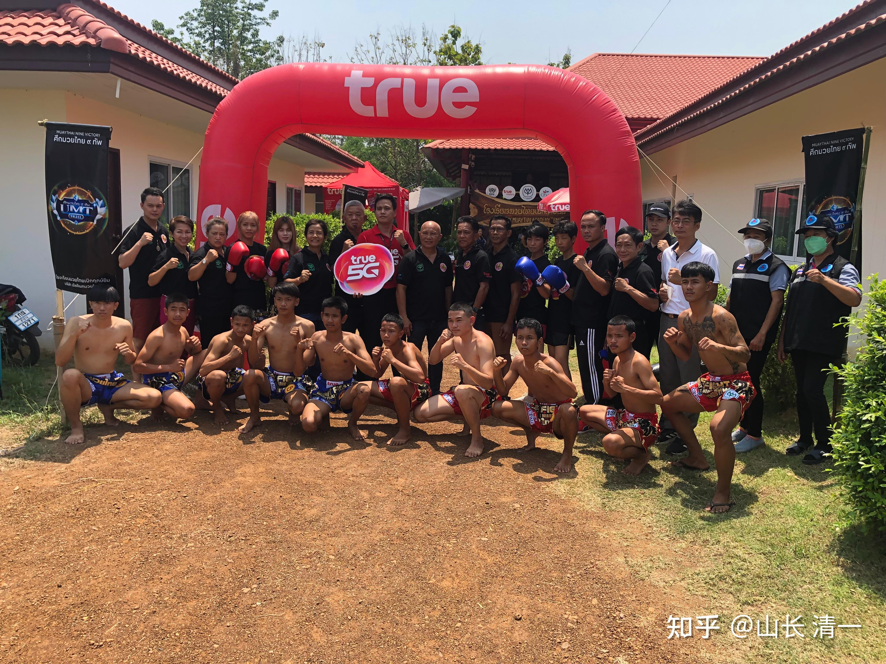
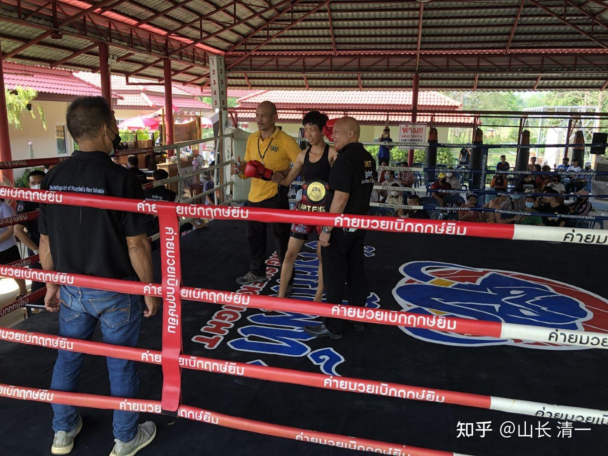
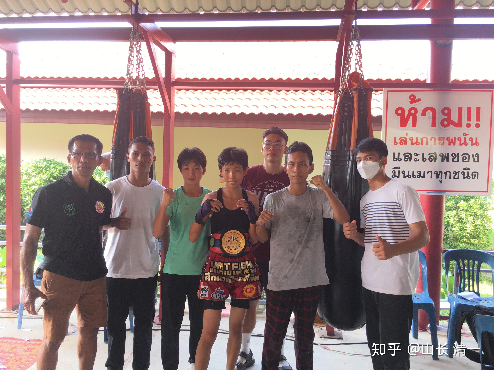
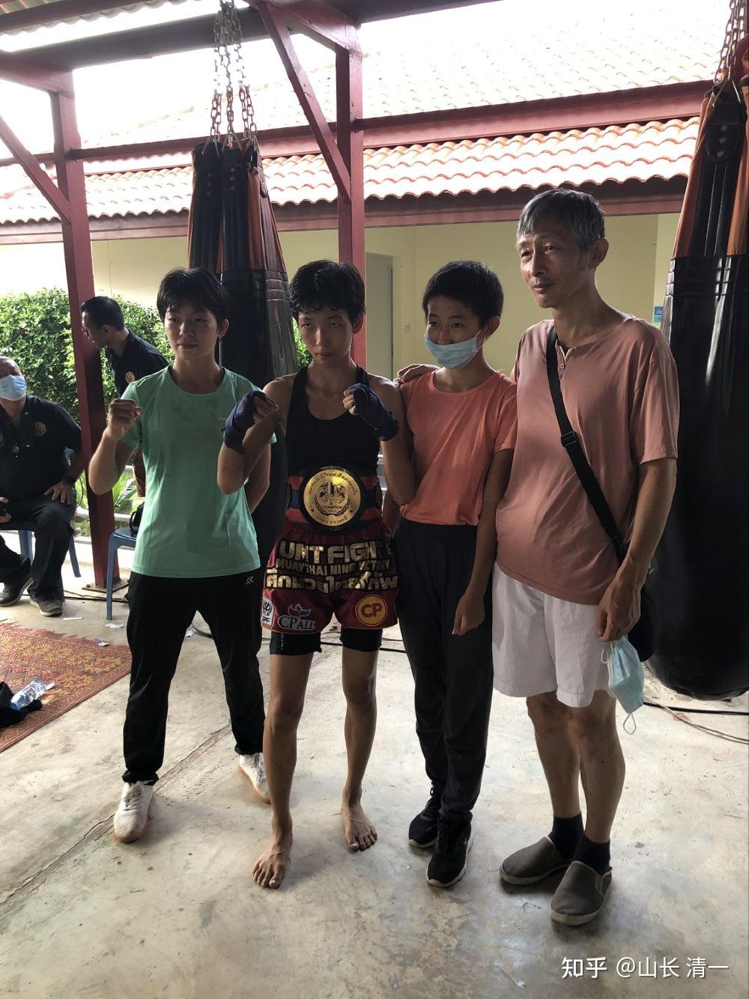
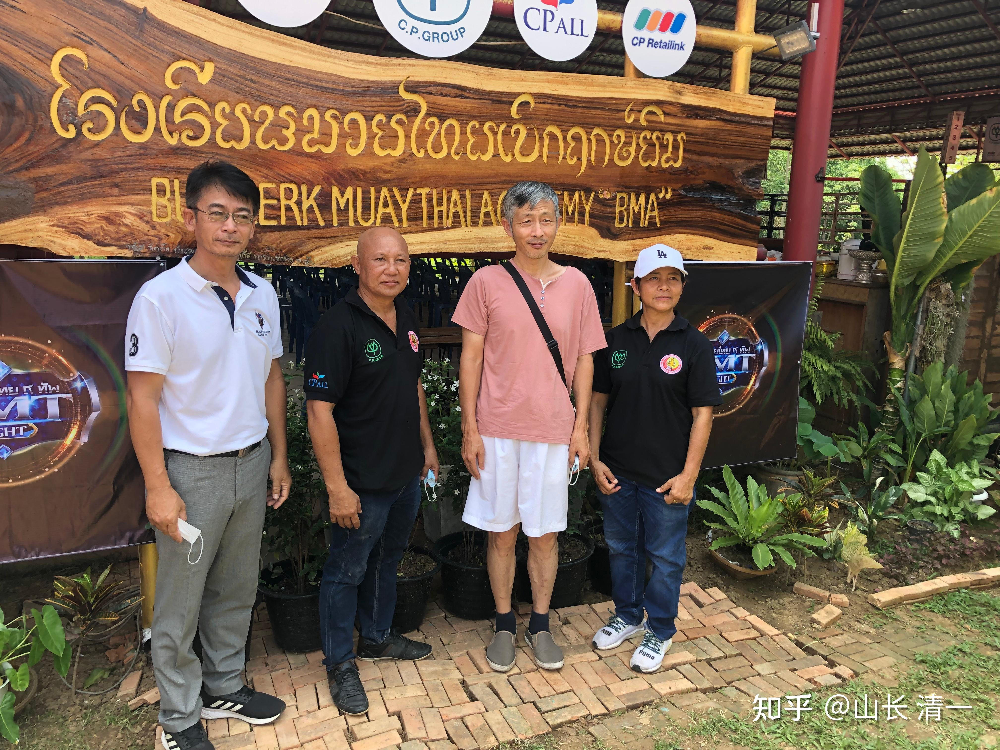

*赛前拳手们的合影。这是一场TRUE公司赞助的商业拳赛。打得很激烈，两个金腰带来参加了比赛*

有两个冠军拳手参赛，对手就是我们的两个小木兰。也就是有金腰带两条，不过我们第一场，是木兰佳惠对从小学拳的泰拳馆长的冠军女儿。我比较中国化思维，觉得KO了对方不好看，就让佳惠尽量打满五局，多锻炼一下。难得与冠军拳手交锋，就不浪费机会了。所以尽量不用我们的绝招，来快速的KO对手，结果，一路赢下来，最终泰国方判我们输了比赛。蓝方赢了。好吧，你们自己看实况录像，视频上来让你们看一个从第一局开始，就是每局都被追着打的泰国金腰带（蓝方），是如何最终赢的最终比赛的。我无法决定裁判怎么判结果，我只能决定我们每场比赛怎么打。当然，我们会接受裁判的最终裁决，也没觉得裁判有啥不公的，只是觉得：如果裁判认为，泰国人自己，看了这场比赛，都肯定不会不好意思的话，我认为我把红方（佳惠）输掉的比赛，拿出来展览给大家看，我也不会不好意思的。我说佳惠打得并不差，恐怕不会被人嘲笑的。

只是，面对判决方式完全不同于我们常识的泰拳，我们下次比赛的话，肯定应该换用一个泰国裁判肯定能懂的方式，才能展现我们的实力了。比如KO掉对手。大约应该没啥争议吧？不太可能再度违背常识，判断被击倒的一方是胜利者吧？所以要反省我们自己：也许：裁判觉得太极出拳，就是轻飘飘的没力量，所以只能算输。也许2：泰国人跟我们一样，不喜欢外国人当他们的面主场击败泰国人，中国人不也拿一些外国的不入流的留学生，号称外国拳王，来中国的拳台上大秀吗？起码泰国人，愿意让我们不知名的新拳手，上去跟他们的金腰带打，也算很给面子了。输了，就认。没啥的。

今天的拳赛消息：今天比赛是TRUE公司赞助的商业比赛。一家泰国电视台还来人转播录像。还有泰文，中文和英文的解说员。是庆祝一家当地知名拳馆的新馆开设举办的拳赛。佳惠是第五个上场的。前面四场，三场是KO结束。后面的拳赛，大多数的对抗，都是KO结束的。泰拳的确非常的残酷，根本就不留情面。印象中有三个人，是刚上场，对方一脚泰扫踢过来，只是踢到腿部，甚至是小腿，看起来也不重，对手就直接倒地，再也站不起来了。有可能是骨折了。大家可以知道泰扫的厉害了。你不会防守泰扫，或者你的抗击打力不行，技术再好都没用。我方拳手面对泰拳手，居然毫发无伤的下来，实在是技术运用和场上面对都很不错，不然就算赢了。也是一身的伤。中国的拳手，原来来泰国打泰拳，打上几下就扛不住，一个重扫腿，就算没有扫到要害，也是一腿就倒下了。现在看，一点都不奇怪。这些天天练泰拳的泰国拳手，自己都扛不住。他们的小腿被扫到，都会被击倒，爬不起来。我今天算是第一次见识见识这么激烈的比赛了。比上次的对抗更狠。而且我是坐在第一排，很清晰地看到这种对抗的结果残酷：一个扫腿过去，只是击中小腿，但拳手就倒下，起不来了。虽然没有昏迷。我这才了解到，很多人并不需要击中脑袋，就会被KO的，直接就结束比赛。泰拳使劲练扫腿，并不求击中要害，而是任何部位被击中，都要造成伤害。是一种最老实，也最难对付的技术。果然不虚。今天的十几场比赛，节奏跑得很快，最短的大约十秒钟，就结束了一场比赛。

佳惠的这场，是少有的打满五局的比赛。对手是一个知名拳馆馆长的女儿。金腰带选手（不知道是哪一级的金腰带，反正看排场是实力不俗的）。我最惊讶的是：她们两是女生第一场。按道理女生比赛，泰国并不重视的。但她们两上场的时候，突然嘉宾们，一堆警察，政府官员，馆长等，有体面的人，全都上了场，还给佳惠和对手，都披上了鲜花项链。同时捧出了金腰带给观众展示，这肯定表示她们两这一场比赛，是今天最重大的“重头戏”。我认为今天披花带彩，佳惠是沾了这个对手泰国女拳手的光。一般拳手根本没这个资格。不过她也受了害，被泰国人“潜规则”了。由于我认为：今天的比赛，是拳馆馆长的大喜之日，你把别人的女儿打KO了很杀风景。所以我就交代佳惠：尽量打满五局，优势获胜就完了。

事实上，小姑娘还是很乖的，对手很快就领教了她的拳力量超人，结果就不断退让躲闪，她整场都在追着对手打。但为了不KO她，就不能连续出腿攻击（正常情况下，如果胸腹部被腿有效击中三次以上，就会被KO）。所以她打完一腿之后，因为对方的回击很快（毕竟是金腰带），所以就采取了冲上去抱摔的方式，压制对方的反攻击。对手一直被动挨打，每局都这样。最终打完五局。对手的脸都被打红肿了。对手的体力也耗尽，打完后狼狈不堪。佳惠比赛完，也认为自己肯定赢了，还提前跑去表示抱歉，把对手打成这样。我和泰国的伙伴，也认为佳惠赢定了。结果，裁判员最终举起的，居然是蓝方---泰拳手的手。泰国人今天收获了一个被输家满场赶着跑的泰拳冠军。是不是有点像一龙播求的二番战，被打得满场跑的一龙，居然最终赢了比赛？我看这个场面，比播求打一龙的场面，差距更明显呀？也许是我偏心？你们就自己看视频去判断吧，看到底谁赢谁输。

[清一木兰VS金腰带选手（佳惠: Alina Sumurai Mulan VS เพชรดารา อ.ยุทธชัย）_哔哩哔哩_bilibili](http://link.zhihu.com/?target=https%3A//www.bilibili.com/video/BV1DL4y1F7Ly%3Fshare_medium%3Diphone%26share_plat%3Dios%26share_session_id%3D5AD88968-0440-4369-B185-6E8D32D3D4FE%26share_source%3DQQ%26share_tag%3Ds_i%26timestamp%3D1650947191%26unique_k%3DqU5i6jL)

不过，也许太极的发力，对方裁判就是看不见吧。对手脸上都被打的变色了。我方拳手虽然看起来对方拳套擦过去，但根本就没有落实。但不能认为我们的出拳，就没力量呀？不过，算了，据说外国人在泰国打泰拳，只要不KO对方，肯定判泰国人胜，看样子这种传说，是有道理的。双方这一场，打满五局，相持不下，只能说明双方水平差不低，判谁胜，都很正常。泰国人，自然应该判泰国人胜了，这没毛病。

明晓是第10场上的。对手也是一个冠军拳手，也是金腰带。我怕出现佳惠一样的局面，被泰国人再次公开“阳谋”了。我就跟明晓说：你就不要再跟对方打内围战了，内围战很难见胜负。容易被潜规则。你赢了，也可以说你输了，因为观众也看不出来，到底内围战，到底谁占优势。第一局，你可以给一点点面子，也适应一下这个选手的节奏，尽量不KO对方。打掉对方的气焰，让她怕你就够了。第二局，你就开始KO模式。用我们的优势攻击方式去攻击对方。只需要多给她几个重腿打击就行了。用连击法。结果：她完美地执行了任务。不到二局，就打倒对方四次。第二局刚开始，就KO了对手。我们不跟对方玩五局友谊赛了，这一局，终于如愿拿到了金腰带。

佳惠下场不服气，哭了一阵，也觉得自己没打好，这么好的机会丢失了。我说：好的标准多了， 你要打得所有人都服气，又不KO对方，你现在实力还达不到。以后我找机会，再安排你与这个金腰带拳手再来一次复仇战吧。不服气，你就重新打回来。现在打完了， 两小拳手就和拳馆的战友们一起吃饭去了，让她们两个请客，跟泰国拳手们好好庆祝一下——也庆祝佳慧虽然输了，但输得就像播求输给一龙一样。这种输，不丢人。打的的确不够好，还可以更好，但这场比赛，起码不丢人。而且是这一天所有比赛里面最精彩的比赛，全场印象都很深刻。不像别的泰拳手，准备这么久的比赛，上场十秒钟，一腿就直接躺倒了，比雷雷保国还不行。不过泰国人善良， 不会对他们瞧不起，会鼓励他们下次再战。站起来就是英雄。站不起来，也别说别人了。不值得说。

今天泰国朋友（副教练）告诉我们，昨天的两个对手，他是知道的，都是身经百战的拳手。昨天两小木兰请我们拳馆的拳手们，一起去吃烧烤自助餐，都特别开心。见我们的小木兰居然只吃西瓜和米饭，觉得她们两特别傻。这种情况下，泰国人吃自助餐，是不吃饭的。都是大盘吃肉。虽然“很划算”。但拳手们这样吃，其实对身体很不好，降低身体的灵敏度和力量的。不过---也不妨碍泰拳手让中国人畏惧。从小一路被KO过来的人，自然与输不起的中国人不一样。看淡了比赛，每天踏踏实实的过日常，这就是泰国人的日常。

泰拳手们，都不相信两个小木兰，居然昨天只是人生的第二场实战。问她们：是不是在中国，就已经打过不少实战了?不然怎么可能第二战，就敢跟泰国冠军拳手打？而且还打得还这么激烈，一点也不输给身经百战的冠军对手？甚至还KO了对方？其实这就是中国功夫的荣誉——-我相信，亲眼看到了眼前案例的泰国拳手们，一定会告诉自己的其他朋友：中国人是很厉害的，只打了一场实战的人，就敢来打泰国的“百战冠军拳手”，也不怕被对手KO，结果是相反KO了对手。证明学了中国功夫的人，的确厉害，中国人学泰拳，也比泰国人打的更好，冠军拳手都拼不过新学拳的中国人。这样，我们就慢慢就树立起了中国人，中国武术的尊严，以及荣誉。荣誉是打出来的，踏踏实实一步一步做出来的。可惜，像我们这样来泰国，跟泰国拳手一起打比赛，一路打上去的案例，国内似乎还没有过。

要想弘扬中国功夫，用包装的手法，用一龙这样的欺骗，耍滑，面对质疑，也不敢来继续打三番战证实自己，就直接丢掉了荣誉。因为他就是假的，怎么可能真打。骗人总有一天，骗不下去的。所以，诚实很重要。我们就是要用一场一场诚实的比赛，来帮孩子们安排跟冠军决战，买通了关系，来找优秀的拳手来参赛。不然孩子们，也跟其他的泰国拳手一样，需要慢慢的打上去，花费很多的时间打低级比赛，真不值得。但现在她们第二场，就跟冠军打，以后的名气就出来了，以后的机会，就更多了。将来要进入泰拳的最高赛场---仑披尼赛场，也就更容易了。所以：一个拳手，有平台支持，与只是靠自我努力，最终的结果差别会很大的。没有人单打独斗会成功的。

以下是明晓获取金腰带之后，与主办方和相关人员的合影。

*木兰明晓拿下了另一条金腰带。场上是举办方的拳馆馆长（黑衣者）和我方拳馆的副教练（场上指导。黄衣者）*

佳惠是昨天的第五场比赛。输掉之后，我马上总结了经验教训：泰国是以KO来看实力的。前四场比赛，三场是KO结束了，很少有打满五场的（后面的比赛也不断KO人）。如果打满了比赛，相持不下，就说明双方差不多，判谁胜都很正常。泰国人，当然更喜欢判泰国人赢了。就算是满场被追着打，但说明别人至少善于保护自己。所以，太极要想赢，就必须KO。后来，我就交代了明晓，让她上场不用像佳惠一样，打满五局了。第一局可以悠着一点打，不KO对方。先适应对方的节奏，看看冠军拳手的水平。第二局开始，就拿出KO对手的节奏来打。不给对方机会，特别不给缠抱内围消耗时间的机会。

[清一木兰VS金腰带选手 （明晓：Jasmine Sumurai Mulan VS Raveeman Panya）_哔哩哔哩_bilibili](http://link.zhihu.com/?target=https%3A//www.bilibili.com/video/BV1X44y1g7Di%3Fshare_medium%3Diphone%26share_plat%3Dios%26share_session_id%3D8437E1D0-9863-43BC-80AA-90C68504C61C%26share_source%3DQQ%26share_tag%3Ds_i%26timestamp%3D1650947214%26unique_k%3DDBSpzgU)

结果，安排的本是五局的比赛， 但第二局刚开始没多久，对手就被打到站不起来了。KO获胜，拿到了另外一条金腰带。（象征性的，商业赛不是拳击组织，只是代表你跟拥有金腰带的拳手打了，获胜的纪念，但是不能拿走别人的这条金腰带）。

*明晓拳馆的伙伴，教练和日常对练的人对手，在获胜后与两个小木兰的合影。*

*小女明年要上场比赛，现在才13岁多一点。让她合影，跟姐姐们占一点金腰带的光。*

明晓打赢金腰带拳手后，拿到暂时给她的金腰带。她所在泰拳馆的拳手们都很兴奋，昨天他们一车装了8个人一起来比赛现场观战，算是很重视了。全拳手们纷纷跟她合影，也希望自己将来去拿一个金腰带。泰国的主教练，看到我，就拉我去跟弟子合影。我就把小女也拉上去，一起合影。也学泰国拳手，沾沾金腰带的光。

不过，这个照片让很多人笑话：我怎么看，都是一个邻家老头。丢人堆里面，就找不出来了。怎么看都不像一个武林高手。看看【一代宗师】里面的宗师级人物，一个个都牛气十足，我比谁，都比不过。不过，也有人安慰我：这样子，像“扫地僧”。其实，我觉得很像个文弱书生。武人文相，是一种境界。两个击败冠军金腰带的小木兰，都知道跟我动手一点机会都没有。她们一出手打我，就会被控而倒下。不是被“打倒”的，还是被“控”倒的。这样才能不受伤，比打倒更难。打倒，只要0.几秒。出手看不见就中招了。太极真的很快，可惜孩子们还没练出来。不过，你们就当这是吹牛的，我也只能打弟子。这说法也不假，我就是只打弟子，不跟别人打的。宁肯认输算了。当文人就别去跟人比武争胜了。

一个问题，有人问，现在我来释疑：**练习传武的人可不可以也学现代搏击？她们为什么只学传武？其实，我猜这话的原因，是有人认为：你吹啥太极格斗？明明去泰拳馆学了泰拳，打起来我看跟泰拳也差不多。没发现你用啥太极拳。但你非说你们就是太极，就是不承认你们其实是学了泰拳来打的。是不是有点欺心？呵呵，我就点明出来这意思得了，我不要面子的。**

昨天的比赛，有电视台来人转播，解说。还有中英文解说。当我们两个木兰表现出众，特别是佳惠的这场打满五局的比赛，双方都很拼的。毕竟对方是冠军拳手，从小跟随父亲拳，一路打过来的。所以这场比赛是昨天的高潮。所有的泰国人都很激动，投入度很高，对方教练也一直大喊大叫的。最终，虽然佳惠判负。但明晓击败金腰带拳手后，泰方的解说员，是这样介绍我们的：她们是学中国功夫的中国拳手。现在来泰国，又学习了泰拳。所以她们会两种拳法，所以比较厉害。由于泰国拳手只会一种拳法，所以跟她们比有点吃亏，输掉也正常。

是真的吗？其实不是。一般人会这样想，解说员也这样说。他是为了给泰拳的金腰带拳手失败找借口，但真正的内行，是不会这样认为的。普通人可以拿这个当理由。以为学会两种拳的优点，就能胜过只学一种拳的人。这是一种书呆子思维模式。本质上，同类型的拳，比如泰拳和散打，日本踢拳，互相借鉴是没问题的。但太极与泰拳，是没法“互相成就”的。只能是“互相了解”。互相借鉴使用对方的规则。我们的拳手，去泰拳馆挂名，入“拳籍”是必须的。不然就没办法安排与泰国人的真实泰拳比赛（可能只有少数提供给外国人的，旅游区的很温柔的表演赛）。场上报名，每个拳手的拳名，都有自己拳馆的名字。另外，我们去拳馆，是为了充分地了解泰拳的规则，优点。同时也有机会跟泰拳冠军拳手们同场训练，做到知己知彼。但我们并不学泰拳的技术，也不用泰拳的方式来练拳。我们去拳馆，只是“假装学拳”，跟着比划一下。太极无招，表面招数可以学外形，内在，真正实战，还是用太极来打。所以，拳馆的教练，总批评我的小拳手：动作不标准，不正规。不像泰拳，不漂亮。

为啥两个拳，不能同时学？因为两个拳种的发力体系是不一样的。怎么同时学？泰拳手，我们就算肯教他们，也学不了我们的拳。只能了解我们的拳，与他们不同。勉强跟学，就会邯郸学步，最终啥都练不成。

不过，发力体系，一般人看不出来。说了白说。内行才知道。

还有：现在没有多少人学真正的传武。有人练拳一辈子，练的是套路招数，根本就不知道发力体系的问题。只学了一些传武的招数动作。这种人，是不会实战的。这种人去学外家拳，没问题。基本是从零开始学格斗，这样不存在两种拳的冲突了。

*昨天主办方跟我合影：知名的过去的仑披尼拿过冠军的馆长，以及他的妻子（黑衣者）。*

白衣服的是一个泰国学校的校长，博士。他母亲也是留日的博士，很有才华的女子。嫁给了日本人。所以这个校长是日裔泰国人。我就是请他帮忙安排与冠军金腰带的“决战”，不然泰国拳界，是不可能让只打过一次的拳手，直接跟金腰带拳手对拼的。

现在我希望他安排佳惠失败之后双方拳手的“二番战”。不知道对手会不会答应，双方正在谈比赛的条件。我需要给出一些对方不能拒绝的吸引力条件，才能有机会安排了。你们就等后续的消息吧。现在的佳惠急于复仇。很不错，有点像【摔跤吧，爸爸】里面的女跤手。喜欢专挑最厉害的对手，而且失败了总想打回来。像个拳手的样子。