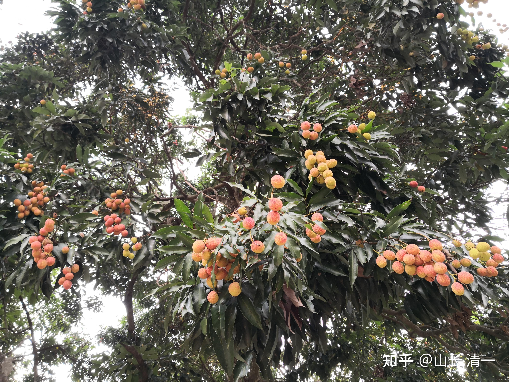

我向泰方经纪人提出要求：请下一场，给我们安排【一对二】的比赛。而且，泰国拳手如果打赢了我们，我同意支付高额奖金给对方。我清晰地记得，泰国安排拳赛的人，对于我的这个要求，表情是非常的古怪。一副“是不是我们要找死”的模样。他说：泰国人从来没有这样打过，会出事的。特别这一次，我们“输”了一场比赛，他看到是打得难解难分，打满五局。最终判我们输了。他相信裁判的公正的，也认为我们实力也差不多，没想到我居然提出连续打10局，而且表示中间不休息，连续作战。他认为？这不是一场公平的比赛。主办方恐怕不会安排。我就说：如果我们认为是公平的的，并不是你们强迫我们必须打的，而且小拳手也是自愿的，就没有问题。我表示不会强迫我的小拳手去打的。实际上，两木兰都很兴奋。她们认为可以一次打两个，太爽了。可以快速积累实战记录经验。免得总被人当新拳手看。

当然，要安排她们在赛场上快速成熟起来，就必须用金钱开道。如果没有吸引力，泰国人是不可能照顾我们，给小木兰安排这种特别比赛的。如果不给奖金，就不可能有高级拳手来打。这样影响力就不会快速扩大。所以，我不得不提供特别条件来促使赛事加快举行。

为让泰方愿意安排这样的一次特别的比赛，我提供的总奖金，算起来相当于主办方可以拿给80个普通泰拳手发出场费了。这对于泰方拳赛主办者来说，是相当有吸引力的条件。当然，真要拿到，也不轻松，起码泰方必须去找来足够厉害的泰拳手对战，不然也拿不到我的钱。当然，我认为他们万一打不赢，只要没有KO泰拳手，他们还照样可以用“潜规则”。来强行判定我们输了。强行拿走我们的奖金。所以，我认为：泰方是非常积极安排的。本来还问我们：本月30号的比赛是否可以安排上场？很急切希望我们赶快就打。本来刚打完比赛，正常情况需要休战一个月的。如果被KO，似乎是三个月不准再次上场。但我们的小木兰，连轻伤都没有。所以我答应可以安排周末来打。可惜泰方找不到够级别的拳手。普通拳手来了也白来，根本就拿不走这钱的。所以就只能安排晚一点的时间了。

今天正式回复了消息：安排了5月15日正式比赛。他们邀请的人，是泰国体育大学的职业拳手。现在大学有比赛任务，所以要等5月15日才有空参加。

【Now I have the confirmation, because most of Thai female boxers are students of College of Physical Education, it has many branches over the country and the begining of May will be the sports of The College that why it hard to get female boxer. So we can't make it on April 30.

And there is another big event of the province coming, The event will take place on May 15 and will be held in the center of Mueang Lampang. If you still want to fight on your condition (one-on-two match) they can arrange it for you.

How do you think sir?】

当然，我们没意见。泰方需要多花一点时间，去找到强有力的拳手来挑战我们的二比一实战。我们也正好有多一点时间，来备战未来更激烈的挑战。下次可以去打出更有威胁力的攻击。我相信16天之后，我们的小木兰实战水平，会比现在的两场更高级一点的。

目前，正在开始教她们练【提高版的太极穿心腿】。主要是我发现：上次木兰明晓攻击对方的正蹬腿，居然几次被对方躲过了。说明泰拳高手，还是可以防住我们这一腿的（低手的样子，就是你们看到的昨天文章链接中的泰国大学生职业泰拳战。这种一看就只是普通的拳手，对于泰式的慢速正蹬都没反应。如果跟我们的木兰对战，第一局就KO了。但上回与明晓对战的金腰带，显然可以对付过来我们的正蹬。明晓其实是换招了，才击中她的。下一次，泰方请来的人，肯定要比这一次的拳手更强悍。所以，我们必须根据高手的可能反应来练拳。要练到让这一次金腰带也躲不过去的水平，才有足够的把握来拿下【一对二】的对抗赛。还必须节省体能，快速结束战斗，可选的战术其实很少。二打一，他们可以选的对策很多，场上就是光跑步，避让，也能都把你累死了。

现在练的正蹬技术提高版，就不直接打正蹬，而是打“变线踢打”，难度更高，但效果更好。先向对手的左右两侧上步，同时快速抬后腿，做一个扫腿的预备动作。等落地腿站稳之后，马上轻轻的跳一下，同时已经出击的后腿开始变线，改为正蹬弹踢出去。目标是绕开对手的双臂防线，踢击对方的胸腹部。今天试验了一下实战对战，这种左右变幻的打法，足够让移动技术不够好的泰拳手们防不胜防的。两个木兰将作为下一场的主攻手段，现在每天连续练习上千次“变线踢”。预计15天后，应该就可以在实战中打出来了。

另外一个技术，就是我们也一直“秘藏”的高级太极格斗技术。在以前的比赛中，一直都没有施展过的“太极滚肘”。这个技术，一旦小木兰们练出来了，男拳手都不是对手（我指的是男子泰拳金腰带，同重量级的，如果用滚肘，就不再有优势。还可以越级挑战重量不超过她们20公斤的普通男泰拳手）。由于下个月15日，很有可能会遇到两个比现在的金腰带更优秀的拳手，所以，为了不被对方KO，我们要有备而战，这一次必须拿出我们的【杀手锏】来了。16天之后，我相信你们会看到太极滚肘的“魅力”。可能是带血的魅力。肘过如刀，如果打到对手的头上，马上就会开出一道伤口，喷血是不可避免的。播求有一次称为“血莲花”之战，就是被肘击头面的结果。

太极滚肘，与泰拳的八臂技术的肘击方式，有何不同？区别大极了。各位应该也发现了，泰拳格斗中，很少拳手使用肘法KO对手的。实战中，肘击不是太常见。为啥：其实泰拳的发力方式，是很难用出有威胁力的肘击的。因为必须有足够的空间来给他们发力。我们小木兰，为了不被KO，跟泰国人内围战是紧紧逼住对方的。让她无法出肘。泰国人也一样，为了防止被肘膝击打，也是紧紧的抱住我们，不让甩开，不然就会被打。佳惠本来有几次非常好的用肘的机会，但不敢用。因为赛前对方要求不能用肘。虽然事后知道是泰方自我保护的手段。我也没让她们用。因为我过于自信，认为不用肘法，也可以战胜对方，不希望出这种伤害力很强大的肘法。但下次，一对二，对手有可能都是更高级别的金腰带。所以我就不能太托大了。必须拿出杀手锏来了。

泰拳的肘击，主要是运用肩部关节来打人的。发力非常的不容易。而且方向上，就是直肘，以及横肘。需要有空间，用转腰技术才能用出来。

太极滚肘，是用背上的劲发力，用手臂前后左右上下的转动，来发肘的。所以说“滚肘运背”。这就是太极腰的奥秘了----用身子的抖弹劲来发力，并不需要太多的空间。太极肘法，相反对身体的柔软和协调要求很高，对于弹抖发力的运用要求也很高。不然你身子僵硬，说你要发滚肘来制人，就是一个笑话了。我跟孩子们对练的时候，一旦用上肘法来跟她们玩，她们就傻眼了：觉得处处都是肘，明明看着无法发力的位置，都可以发出攻击力，四面八方都可以发出来，而且根本不知道如何防守。所以，一旦学会了太极滚肘，这种人，你根本就不敢碰他，一碰就要挨打，而且是重击。

太极滚肘的另外一个特点，就是并不直接打你。你看起来，像是先出了一个不算太快的直拳，摆拳。你出手截住了她们的拳，对方突然就贴身，转换为挑肘，从下，或者从外，摆肘突袭你没有设防的胸部，或者头部。手是先缠住你的手臂，再发肘，击打你的空门。比如先用三节的梢节，把你的防守格挡的手臂带偏。然后一个挑肘，就直接打心窝或者腋下。接下来一个平肘追击，外加一个转身肘重击，总共一秒钟就完成三个动作。基本上你就被彻底KO了。

练的时候，孩子们都会练。但打的时候，就不知道了。毕竟没有实战过。而且平时对练也很少，因为容易伤人。不过：由于对手强大，而且我们不KO就算输的话，还是把这技术练出来好了。我建议她们上场的时候，可以先比划几个肘击的动作，但故意距离远一点，打空掉，但让对手知道我们肘击的厉害。逼他们不敢近身搏击，消耗我们的体能。如果她们依然要采用比较无赖的缠抱技术，来消耗我们木兰的体能，并且让我们没有清晰的击打，用吃暗亏的方式，来换取对她们有利的判决的话，我们就必须拿出决胜的肘法，来击破泰拳手的这种妄想了。

肘，的确是大杀器。女子要对付男子，必须用肘，才能获取一些优势。直接拼拳，比腿，很难胜过男生。咏春拳，其实核心是肘法。不过，有意思的是：现在练咏春的，似乎不重视肘法。天天练日字冲拳。我看未得咏春的真髓。当然， 我因为知道，咏春的肘法要用出来，身法就必须改。现在的咏春拳练习者，连二字钳羊马要练什么功夫？都不知道的话，怎么可能练出咏春的肘法？肘法的基础是身法，身法不行，不是真咏春。

历史上，有五枚师太和严咏春的故事，是公认能够击败男子的拳术。但其他拳派，基本上就没有女子战胜男拳手的记录了。太极门派。历史上也没有记录有啥武功过人的女子（指实战记录的优胜者，不是指国家套路冠军，不算孙剑云这种“名门之后”，她肯定不是她哥哥的对手）。现在，就从清一太极开始，证明女子是可以击败男子的。柔软胜刚强，不是传说。我们可以在现实中做出来。

BTW 我看知乎上，居然有人留言，向我挑战。说孩子们的实战是乱打的，不正宗云云。还要跟我比试一番。这种人，实在是不知天高地厚。首先：中国人不打中国人，我不把打中国人，当做我的目标。其次：如果你想讨打，我不反对，求锤得锤。你先跟我们的女生过招好了。打赢女生，你再打她们的师兄。目前在国内没过来，所以没有实战成绩，但水平上，泰国的这两个女孩，只是第二梯队的水平罢了。如果你居然还没躺下的话，可以有资格我陪你玩几招了。但我相信：你躺着下去的概率很高。先说好，按照泰国的擂台规矩，擂台伤残了，医疗费自负，别来赖人。我们不在中国打比赛， 就是这种无赖很多，打不是，不打也不是。你们如果连小女生都打不赢的人，就别在我面前叫嚣了。我最讨厌嘴炮了，特别在武术上。谁是真的，谁是假的，用的着拿嘴巴出来说吗？上场来干就是了！

*我们自己院子里面的荔枝熟了，孩子们准备去采择了。一颗大约30年的老树*