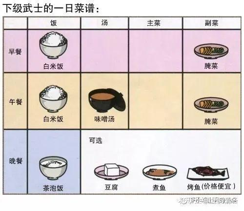
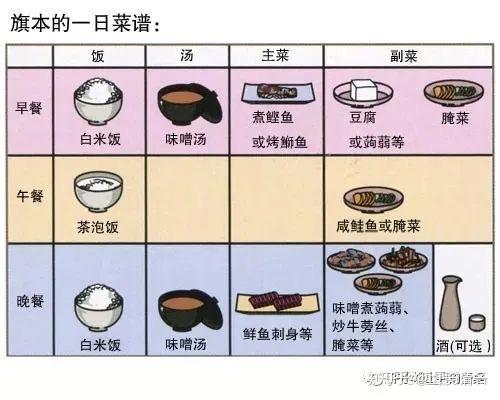

作为一个格斗运动员，身体的健康是第一位的，所以：吃什么？吃多少？都是很有讲究的。但绝对不是像有人想象的一样，你需要一个西方式的营养师团队，来规划你的饮食的方方面面。这是有钱烧包显耀的表现，不是真实的需要。了解身体需要什么，就吃什么。身体不需要的东西，不需要的量，就不吃。其实吃东西并不复杂。是我们人自己，把“吃”这件很简单的事情，弄得太复杂了。

中国人跟日本人相比，我们吃的很多。不仅仅是品种很多，而且量很大。中国人似乎都有吃到快撑死的地步，才算吃饱了。这个，并不是我夸张。我们的学校里面：经常有学生吃太多，而导致呕吐等情况发生。老师们都很惊讶：一些学生吃饭的时候，会拼命吃下远远超过成人的量。把自己的肚子撑得圆圆的。这种学生的身体其实也不健康。估计就是家里从小教出来的。对于食物的贪婪，量和种类的贪婪，似乎已经成了我们国家的“食文化”。这对我们的身体，造成了巨大的负担，不仅仅导致精气神都很差，还导致各种疾病的发生。因为：我们吃下去的食物，从量上来说，以及种类上来说，大约有70%的食物是身体不需要的。但身体为了处理他们，又要耗费额外的能量。所以导致国人的体力不足，总是觉得累。其实，是你自己把自己吃累的。

另外：食物的品种，也是导致身体疲累的根源。现在的食物，肉蛋奶有很多激素。本身也不是人体非要不可的营养。所以吃肉类对身体没啥实质性的好处。吃这些食物，只是满足嘴巴的欲望，但对身体的损害却是真实的。就算是蔬菜，素食，也不合适吃太多。其实我们的武道馆，不吃肉类，也不太吃叶菜，主要吃根茎类，果实类的食物。土豆红薯瓜果等。比如在泰国，我们会用青芒果，青木瓜切成丝，略微拌一点调味品做菜吃。这种菜，比中国煎炒烹炸，色味俱佳，以及丰富多样的餐桌文化，对身体的价值更高，更有营养。中国丰富的餐饮文化，本质上，并不是为了身体的需要，而是为了满足自己的“五色”，“五味”的内心欲望而创造的。过去老时代，匮乏时代，是节日庆典的需要，放纵的需要，大家一起大吃一餐。但由于日常都是很平淡的生活饮食，所以这种节日的放纵，带来的损害不大。我相信大家都会发现春节期间人很累，不仅仅应酬累，其实吃都吃累了，基本不吃饭，一堆肉食等，导致身体没有营养，当然累了。现在生活条件好了，人们“天天都过节”，或者天天吃的都像过节一样，不把自己吃坏才怪。现在的富裕生活方式，自然会带来花钱越多，做饭花的时间越多，身体就越差，疾病就越多的毛病。我认为：大多数的国人的毛病，都是吃出来的。花钱把自己弄出病来，再花更多的钱去治病。

练武，就是身体的健康第一，要做有限考虑体能第一，恢复力第一的情况下，来考虑吃什么食物。所以：只有傻瓜，才乱吃东西，把自己的身体吃垮掉。为了拿冠军，就不要为了口腹之欲，牺牲掉自己的身体技能和灵敏度。因此：肉食，奶制品，这些导致骨质疏松，身体酸化的食物，练武之人，绝对是禁止食用的。各种味道丰富的菜肴，也是不适合食用的。另外：食物的量，也是要控制的。吃的时候，到不饿就行了。一天之中“腹中常感饥饿”，就是正常的。千万不要使劲吃大堆的食物，弄到成天都“没有饥饿感”，这是身体机能下降的标志，也是未来得糖尿病的前奏。吃素，少食，是取得武功优胜的重要手段。虽然中国的武术界人士，是最喜欢吃肉的。用“酒肉穿肠过，佛祖心中留”这样自欺欺人的语言，来让身体为自己的生活不检点而买单，这是最愚蠢的人。

各位了解一下：日本过去的“中产阶级”---武士阶层的“传统食物”。这些战斗力很强的人，吃多少好东西？马家军的甲鱼吗？

高级武士和下级武士，其实都差不多，主要就是一饭，一个酱油汤，一点咸菜。没啥丰盛的菜肴的。日本人的量也很少，就是一碗饭，基本只是到“不饿”的水平就够了。日本人在食物上的节制，导致了这个国家是世界上最长寿的国家。我在泰国，这里泰国人正常的一餐的饭量，也是很少的。比较下来，还是中国人最贪吃。

日本底层的农民等吃饭就更简单了，就是一个饭团解决问题，连饭碗都不需要的，更谈不上有啥菜肴了。所以，现在到处风行的美食风气，其实不是身体真正需要的，反而是带来我们身体不健康的根源。清一武道馆，正在恢复古人简单的饮食风格。尤其清迈的小武士们。简单清淡的饮食，谷物为主，让她们的体质更好，而且从训练受伤中，身体恢复的速度更快。这些是泰拳拳手无法跟我们拼体力的重要原因。现代泰国人的饮食，已经西化了。冰和糖，以及大量的肉蛋奶，正在让泰国拳手的体能下降。现在只有少数的泰拳手，保持了古代泰国人的生活方式，早起早睡，简单饮食。这些人的竞争力是很强的。据说播求认为糯米饭才是他力量的源泉， 不喜欢吃丰富多样的饭菜，这和另外的一些泰拳手，有钱就乱吃很不一样。让播求40岁，都可以保持良好竞技状况的原因。另外，你们从实战赛场上，已经看到了我们的小拳手和泰国拳手的体能差异。佳惠打满五场却没事，恢复更是良好，第二天继续常规训练。而泰国拳手打完一场比赛，需要恢复好几天，大致上是一个星期，才能恢复进行常规的训练。差异就是身体的恢复速度不如我们。还有：泰国拳手会在赛后，特别是赢了比赛得到奖金之后，去吃肉食的大餐。这对身体是一种额外的负担，估计也是造成他们恢复速度很慢的原因。

观察日本武士的食物，比中国的绿林英雄们“大块吃肉，大碗喝酒”要科学得多。但是与道家的饮食方式，还是有很大的区别。日本人吃鱼为菜，没啥问题。因为日本是海岛国，海产品作为食物很正常。我们没必要模仿日本人吃鱼。在泰国，可以用丰富的水果来当调味品。

日本武士的食物，主要是晚餐依然有“丰富”的倾向。其实晚饭不宜多吃，量和品种都不适合太多。主要是对健康不利。道家的观点：晚上带着肠胃中的食物睡觉，是对身体有毒害的。所以睡觉的时候，最好是空腹状态。为了实现这一点，就必须两件事情:早一点吃晚餐，天黑之后就不吃东西了。另外：只能吃清淡的，容易消化的饮食。晚餐吃肉，肯定就是大忌了。一定想要吃肉，可以在中午吃一点不多的肉类，这样问题不大，睡觉前基本消化完毕，没必要带着很强毒性的肉类食物过夜。但国人习惯的晚上“大鱼大肉”，对身体的伤害是很大的。还会导致晚上休息不好，第二天的精力很难恢复。我相信大家吃过晚上大餐的第二天，都会觉得累累的样子，早上起来，都身体发软。这就是身体告诉你，你吃的方法和内容都吃错了。古人说的“晚餐轻食”，是保健的大智慧！