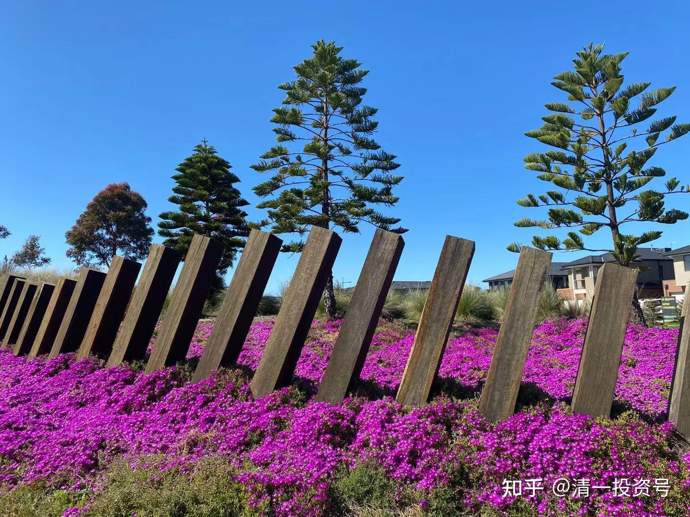
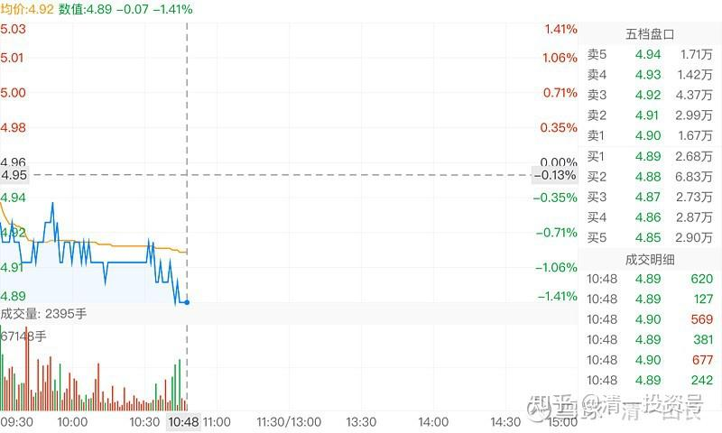
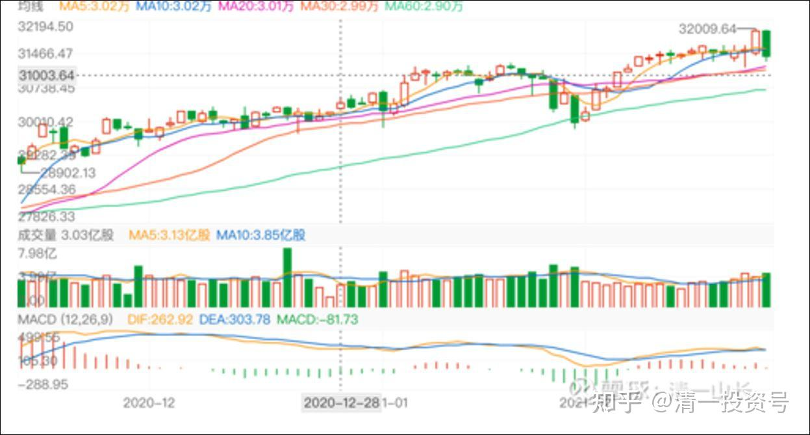
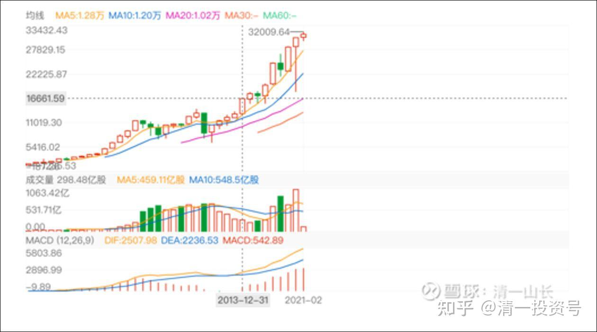
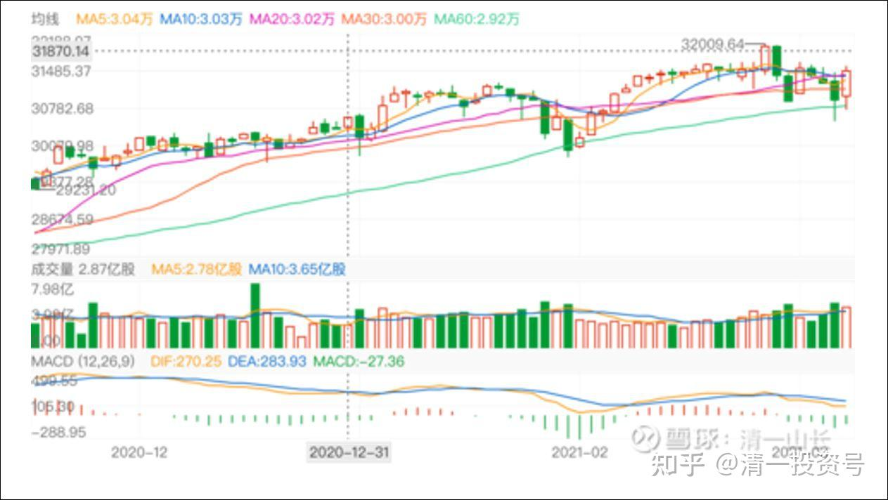
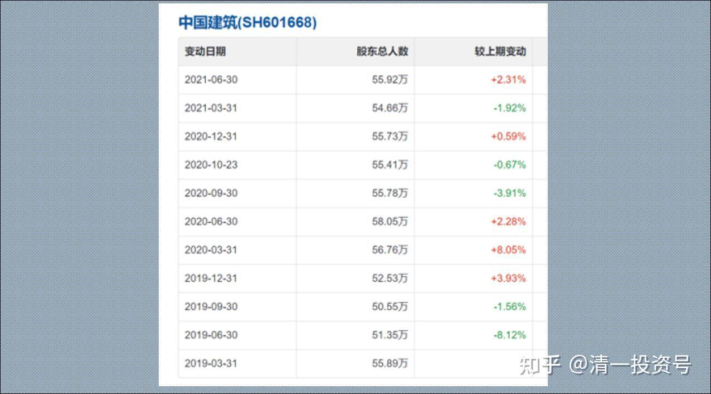
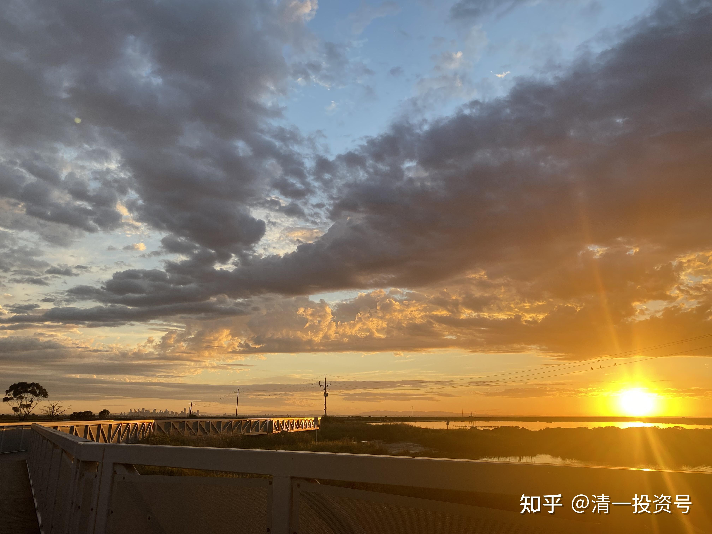

清一山长 2021年1月-10月
清一山长雪球非专栏帖子整理文章第 36篇 《A股与美股的微妙关系》

**题记：**雪球专组的伙伴整理了2021年1月以来山长关于A股与美股的微妙关系的分析，现在已接近关键时刻，绝对是实实在在的财富价值，无限的价值。唯有敬师信师者得。

[清一山长](http://link.zhihu.com/?target=https%3A//xueqiu.com/9310099567) 2021-[01-07 08:56](http://link.zhihu.com/?target=https%3A//xueqiu.com/9310099567/167867529)
[$道琼斯指数(.DJI)$](http://link.zhihu.com/?target=http%3A//xueqiu.com/S/.DJI) 美股真牛！加油冲顶！A股，特别是国字头的股，我们还是继续趴着睡觉吧。暂时没戏。

[清一山长](http://link.zhihu.com/?target=https%3A//xueqiu.com/9310099567) 2021-[01-08 17:50](http://link.zhihu.com/?target=https%3A//xueqiu.com/9310099567/168098959)
我是同意这篇文章的逻辑的。美股史诗级的巨大泡沫就要爆裂。等它爆裂的时候，该是多么的惊心动魄，全世界都带来巨大的冲击。而且，我相信这一次，美国会从此失去世界霸主的地位。比1930年的还要影响巨大。我甚至担心会引起世界大战。所以。真的是史诗级的泡沫。从2018开始，我一直很担心美股的冲击波到来。所以我一直在防御中。导致这两年的投资业绩不咋的。

不过，我没有文中的这样乐观。

我认为：可能美股还可以支撑一年。等疫情彻底过去了，全世界松一口气。美国一松劲，就崩了。我认为大致上还有一年吧！

所以，我们还要拿三傻，再过一年的苦日子！熬吧。还有一年，最多两年了。快一点？半年也行。

[华尔街见闻](http://link.zhihu.com/?target=https%3A//xueqiu.com/1107854878)来自雪球[发布于2021-01-06 17:24](http://link.zhihu.com/?target=https%3A//xueqiu.com/1107854878/167819652)
《小心！巨大警告：美股史诗级泡沫即将破灭，现在是最后的疯狂》

[清一山长](http://link.zhihu.com/?target=https%3A//xueqiu.com/9310099567) [修改于2021-01-11 11:02](http://link.zhihu.com/?target=https%3A//xueqiu.com/9310099567/168297523)
[$中国建筑(SH601668)$](http://link.zhihu.com/?target=http%3A//xueqiu.com/S/SH601668) 跌成这样子，真是疯狂。难道美股收盘创新高，中建就要这样子用吐血来表达吗？各位：有钱就买吧，没钱就看戏。死拿五年，看你还趴在地下玩

[清一山长](http://link.zhihu.com/?target=https%3A//xueqiu.com/9310099567) [修改于2021-02-03 16:21](http://link.zhihu.com/?target=https%3A//xueqiu.com/9310099567/170871957)
[$道琼斯指数(.DJI)$](http://link.zhihu.com/?target=http%3A//xueqiu.com/S/.DJI) 我说中国建筑今天怎么没道理乱跌呢？原来你这老兄涨了。中字头，怎么也得给美国人一点脸面吧？对美国股市的欣欣向荣表示敬意，鞠躬！

我还是慢慢的等美股什么时候崩不住了再说吧。这个奇葩的国家。

印钱谁不会？印钱等于慢性自杀。印产品，才是硬道理。印钱也要印出来，流向做实体去，才是正道！

目前看来，我认为我国领导在做正确的事情。而美国人？在玩虚的！

[清一山长](http://link.zhihu.com/?target=https%3A//xueqiu.com/9310099567) 2021-[02-26 09:20 · 来自雪球](http://link.zhihu.com/?target=https%3A//xueqiu.com/9310099567/172826831)
[$道琼斯指数(.DJI)$](http://link.zhihu.com/?target=http%3A//xueqiu.com/S/.DJI) 前一天涨400多点，创新高。第二天就跌500多点。像是神经病一样。高位这样子走，是危险信号，说明美股快出问题了。全球金融崩溃，就要开启了吗？

[清一山长](http://link.zhihu.com/?target=https%3A//xueqiu.com/9310099567) 2021-[02-26 09:23](http://link.zhihu.com/?target=https%3A//xueqiu.com/9310099567/172827308)
[$道琼斯指数(.DJI)$](http://link.zhihu.com/?target=http%3A//xueqiu.com/S/.DJI) 瞧这年线图？其实很恐怖。去年美股就出了问题，大幅震荡，成交创新高，说明是拼命挽救回来的，今年，还撑得住吗？

[清一山长](http://link.zhihu.com/?target=https%3A//xueqiu.com/9310099567) 2021-[03-06 23:41](http://link.zhihu.com/?target=https%3A//xueqiu.com/9310099567/173682579)
[$道琼斯指数(.DJI)$](http://link.zhihu.com/?target=http%3A//xueqiu.com/S/.DJI) 最近一段时间，隔日走势大起大落的，不是好事。看懂图的人，别恋了。高位有啥不好想的。退走最安全。当然，别做空。天知道会不会疯狂。只是安全起见，干嘛要赚最后的铜板。

[清一山长](http://link.zhihu.com/?target=https%3A//xueqiu.com/9310099567) [2021-05-13 08:56](http://link.zhihu.com/?target=https%3A//xueqiu.com/9310099567/179685483)
[$道琼斯指数(.DJI)$](http://link.zhihu.com/?target=http%3A//xueqiu.com/S/.DJI)美股已经连跌两日，超过千点。中国建筑，中国银行等股票，一向是美股涨就跌的。这一回，会有帮助吗？可能要看美股是假摔还是真摔吧？

//[爱学习的井底之蛙](http://link.zhihu.com/?target=http%3A//xueqiu.com/n/%25E7%2588%25B1%25E5%25AD%25A6%25E4%25B9%25A0%25E7%259A%2584%25E4%25BA%2595%25E5%25BA%2595%25E4%25B9%258B%25E8%259B%2599):回复[清一山长](http://link.zhihu.com/?target=http%3A//xueqiu.com/n/%25E6%25B8%2585%25E4%25B8%2580%25E5%25B1%25B1%25E9%2595%25BF):美国的货币手段是无法替代需求和生产力的，拜登说完大搞基建，那么铁矿石的价格最近大涨，结果会导致他们的输入性通胀！

[清一山长](http://link.zhihu.com/?target=https%3A//xueqiu.com/9310099567) [2021-05-13 09:45](http://link.zhihu.com/?target=https%3A//xueqiu.com/9310099567/179692919) 回复[爱学习的井底之蛙](http://link.zhihu.com/?target=http%3A//xueqiu.com/n/%25E7%2588%25B1%25E5%25AD%25A6%25E4%25B9%25A0%25E7%259A%2584%25E4%25BA%2595%25E5%25BA%2595%25E4%25B9%258B%25E8%259B%2599):
对哦。

中国突然出台政策，严格限制钢铁产能，主动降低发展速度，其实是让老美去背锅涨价的负担。

中国不帮澳洲输血了。宁肯降低国内的基建发展速度。会影响一些房产和基建的速度的。大量基础材料其实中国有余，产能限制下去了，物价上去了。干活少了，赚钱还多了。享受国际升值福利。所以，手上有资源的企业，要赶快拿好了。

//[我心彷徨](http://link.zhihu.com/?target=http%3A//xueqiu.com/n/%25E6%2588%2591%25E5%25BF%2583%25E5%25BD%25B7%25E5%25BE%25A8):回复[清一山长](http://link.zhihu.com/?target=http%3A//xueqiu.com/n/%25E6%25B8%2585%25E4%25B8%2580%25E5%25B1%25B1%25E9%2595%25BF):
银行业不能这么比，银行业最关键的是信用，不会倒闭的信用，不会坑客户的信用。信用坏了，你弄再多的美女来伺候客户也没用！

[清一山长](http://link.zhihu.com/?target=https%3A//xueqiu.com/9310099567) [2021-06-16 17:09](http://link.zhihu.com/?target=https%3A//xueqiu.com/9310099567/183208198) 回复[@我心彷徨](http://link.zhihu.com/?target=http%3A//xueqiu.com/n/%25E6%2588%2591%25E5%25BF%2583%25E5%25BD%25B7%25E5%25BE%25A8):
不同意您的说法。

银行如果不赚钱的话，信用再好，也会垮掉的。欧美的银行赚钱能力如何？您自己去看看市场行情吧！欧洲的银行，有很多不正在垮掉吗？

就单说信用而言，不倒闭的信用才是最靠得住的。从这个角度来说，中国银行的基础信用（不倒闭的信用），其实高于西方银行的信用。因为中国国家对银行的监管以及担保承担，大于海外的银行。

如果您是炒股的，研究过投资的核心和历史，就知道：巴菲特的父亲，就是因为所存款的银行倒闭，家庭一夜之间陷入贫困的。当时美国大批的银行倒闭，让很多普通人家一辈子的财富灰飞烟灭！您认为西方银行的信用很好吗？
银行业的关键，绝对不是您说的信用，而是她服务的国家的国运、财运。过去多年，美国银行创造了巨额的利润，是因为美国的国运很好。

未来几十年，如果您相信中国的国运正在上升，您就可以买中国的银行。否则，您买美国的银行吧！

对我来说，我更相信中国的国运，未来会超过美国，所以我不买美银，甚至连美股都不买。

[清一山长](http://link.zhihu.com/?target=https%3A//xueqiu.com/9310099567) [2021-7-05 17:29](http://link.zhihu.com/?target=https%3A//xueqiu.com/9310099567/188935293)
罗杰斯：世界各国普遍存在的债务问题也是一个危险的信号。特别是美国，正陷入债务飙升、经济混乱的泥淖中无法自拔，一旦美国金融业发生危机，剧烈的冲击波必会在短期内传遍全世界，把所有国家都拖下水。[网页链接](http://link.zhihu.com/?target=https%3A//www.163.com/dy/article/GE33FCEQ0524A4QN.html)
[https://www.163.com/dy/article/GE33FCEQ0524A4QN.html](http://link.zhihu.com/?target=https%3A//www.163.com/dy/article/GE33FCEQ0524A4QN.html)

罗杰斯：30年最严重金融海啸即将来袭，欧美、中国全都会遭殃！

[晕娜](http://link.zhihu.com/?target=https%3A//xueqiu.com/1845773477) [$中国建筑(SH601668)$](http://link.zhihu.com/?target=http%3A//xueqiu.com/S/SH601668)
安邦出清60.53亿股，股东户数基本没变化。看不懂了。

[清一山长](http://link.zhihu.com/?target=https%3A//xueqiu.com/9310099567)[2021-09-06 17:11](http://link.zhihu.com/?target=https%3A//xueqiu.com/9310099567/196485070)回复晕娜：
AB神秘倒下，对手盘是谁[为什么]。谁拿走了ab的资产？遗产？

我也一直很好奇，可惜永远不会知道答案。别相信我等小散积极加仓，补上这缺口了。散户从来没这实力的。300亿不够用的。不能用现价算的。相反，散户这两年离开的不少。

感觉，背后有国家意志，三傻现在不能涨。等美股崩了，才能动用三傻来救市。

如果都高高在上的，出来救市，就被人割韭菜。2015，是有过教训的。[俏皮]

[清一山长](http://link.zhihu.com/?target=https%3A//xueqiu.com/9310099567) [2021-09-10 09:44](http://link.zhihu.com/?target=https%3A//xueqiu.com/9310099567/197304967)
[$中国建筑(SH601668)$](http://link.zhihu.com/?target=http%3A//xueqiu.com/S/SH601668) 冲到5.48了？账面市值天天涨，弄得像是牛市来了的样子[为什么]。
我认为：现在就开启牛市，好像不合时宜，美股还没崩呢[哭泣]。

//[@NeoKJ](http://link.zhihu.com/?target=http%3A//xueqiu.com/n/NeoKJ):回复[清一山长](http://link.zhihu.com/?target=http%3A//xueqiu.com/n/%25E6%25B8%2585%25E4%25B8%2580%25E5%25B1%25B1%25E9%2595%25BF):
美股崩了，A股能不崩？

[清一山长](http://link.zhihu.com/?target=https%3A//xueqiu.com/9310099567) [2021-09-10 10:19](http://link.zhihu.com/?target=https%3A//xueqiu.com/9310099567/197314828) 回复[NeoKJ](http://link.zhihu.com/?target=http%3A//xueqiu.com/n/NeoKJ):
【美股崩了，A股能不崩？】
当然A股也要崩了，全世界都要崩，谁说A股就不崩[哭泣]。

正因为要崩，所以政府才要救市。当然要救就救中国，不可能去救美国吧（我发现美股大跌也有人救市的，跌700多点，第二天就拉上去了）。

正因为A股要救市，就要救中国的面子。

您认为：换了您，去救贵州茅台呢？救赛道股呢？还是来救趴在地上的中国建筑？中国银行？前段时间，证金卖掉了很多股，干啥？准备资金救市呢！我就是为了躲股灾，才躲在中国建筑，中国中铁后面的。

早知道现在才涨，我应该两周前，再进货的，原来进早了！[大笑][大笑][大笑]

[清一山长](http://link.zhihu.com/?target=https%3A//xueqiu.com/9310099567) [2021-09-11 16:54](http://link.zhihu.com/?target=https%3A//xueqiu.com/9310099567/197439596)
[$中国建筑(SH601668)$](http://link.zhihu.com/?target=http%3A//xueqiu.com/S/SH601668) 美股这一周，连跌五天。大建这一周，都是羞答答的往上涨，是不是就因为这个？周五，担心美股晚上会反弹，所以获利客就赶快走了。结果美股晚上跌最多一天，看样子周一大建，该有理由恢复上涨了。[大笑]

就怕周一美股真的反弹了，大建又该跌了。似乎跷跷板就这样玩的。

[清一山长](http://link.zhihu.com/?target=https%3A//xueqiu.com/9310099567) [2021-09-21 13:36](http://link.zhihu.com/?target=https%3A//xueqiu.com/9310099567/198335048)
[$道琼斯指数(.DJI)$](http://link.zhihu.com/?target=http%3A//xueqiu.com/S/.DJI) 昨日晚上最低跌了966点。收盘拉回到614点。看上去像极了7月19日的大跌拉回，然后第二天就收复失地。今天的盘子算是基本稳住，大家都在观望。

真的稳住了吗？我不知道。

美股一旦狂跌的话，全世界都收不住的，都要跟随一起狂跌的。

你们还是做好充分准备好了。这几天，A股就已经表演过了提前大跌。我们要准备应对未来的苦日子。
//[@木成来了](http://link.zhihu.com/?target=http%3A//xueqiu.com/n/%25E6%259C%25A8%25E6%2588%2590%25E6%259D%25A5%25E4%25BA%2586):回复[@清一山长](http://link.zhihu.com/?target=http%3A//xueqiu.com/n/%25E6%25B8%2585%25E4%25B8%2580%25E5%25B1%25B1%25E9%2595%25BF):

胜读10年的投资书。就这段话，读上100遍，不行就1000遍，我看以后赔钱的概率就低了。

[清一山长](http://link.zhihu.com/?target=https%3A//xueqiu.com/9310099567) [2021-09-22 17:56](http://link.zhihu.com/?target=https%3A//xueqiu.com/9310099567/198449414) 回复[@木成来了](http://link.zhihu.com/?target=http%3A//xueqiu.com/n/%25E6%259C%25A8%25E6%2588%2590%25E6%259D%25A5%25E4%25BA%2586):
谢谢，你是有心人。有福之人。再给一点彩头：

今天A股的银行跌，但建筑类涨，有点护盘的意思。美股一崩，全球金融股都跟着玩崩的，所以，银行类现在没人敢碰。2015年，GJD（国家队）在股灾是，护盘是拉银行股。

今年如果全球闹股灾的话，会不会拉几大建？

这个是全球中国独一无二的优势企业。而且，这几年一直有无形之手压着打，压得都太过分了。

因此，选择低位的埋伏，总没错。涨了的就别碰了。

[清一山长](http://link.zhihu.com/?target=https%3A//xueqiu.com/9310099567) [2021-10-01 16:53](http://link.zhihu.com/?target=https%3A//xueqiu.com/9310099567/199319320)
[$道琼斯指数(.DJI)$](http://link.zhihu.com/?target=http%3A//xueqiu.com/S/.DJI) 昨天大跌500多点，似乎跟前几次的走法都不一样了。今天会继续来个黑色星期五吗？如果美股今天继续大跌，算不是送给A股的一个国庆大礼包[大笑] [大笑] [大笑]。

我持有中建，等美股跌已经等很久了。

[清一山长](http://link.zhihu.com/?target=https%3A//xueqiu.com/9310099567) [2021-10-02 12:39](http://link.zhihu.com/?target=https%3A//xueqiu.com/9310099567/199346878)
[$道琼斯指数(.DJI)$](http://link.zhihu.com/?target=http%3A//xueqiu.com/S/.DJI) 技术分析：
1. 9月20日的大跌，最高跌幅接近千点，收盘跌幅600多点。

2. 上一次大跌，是7月19日，也是跌一千点，收盘跌幅700点，但第二天就基本收复原地。

3. 这一次却没有收复上一交易日的跌幅。第二天阴跌，之后用两天时间，收回全部跌幅，但未创新高，9月28日又跌了500多点。

4. 周四又跌了600多点，累计跌幅已经超过一千点。

5. 昨天涨480点，阳线并未覆盖上一天的阴线，成交却大过昨天。显然抛压不轻。现在，美股依然是处于弱势。技术上没有反转。

其实，从基本面来看，美国现在，除了印钞票之外，似乎也没有啥有效的提高美国经济竞争力的手段。没有真实的创造价值，只是一味的拉高股市。发钞票。傻瓜都知道迟早要完。

中国股指虽然处于低位，但现在果断压产能，限制经济过热，显得特别的有底气。脑子正常一点，都知道未来的投资是中国更靠谱。

美国经济的未来，几乎注定只有下跌的一条路。股市不知道，华尔街可以操纵市场。但中国的大量减产，万一导致全球商品价格暴涨的话，美国绝对是冲击最大的地区。年底消费旺季到来。货架空空的美国，会对老白姓的心理打击很大的。因为他的产业空心化太严重了。大多数日用品都靠国外输入。自己做的话，不仅仅是成本高，其实配套的企业跟不上，单独的厂家基本无法完成任何简单商品的制造。偏偏自己的底子不够，还要找他日常生活最依赖的中国下手。中国当然不愿意配合，看你现在有啥好日子过。

中国其实不缺煤炭，缺石油。要放开电力供应并不难，只是中国放开产能和能源，大力廉价生产了，对中国真没好处。

高科技可以卡脖子，低科技也可以卡身子。看谁卡的到位[大笑]

[清一山长](http://link.zhihu.com/?target=https%3A//xueqiu.com/9310099567) [2021-10-02 13:43](http://link.zhihu.com/?target=https%3A//xueqiu.com/9310099567/199348309)
原来是中国储量多的东西，就低价；中国缺乏的资源，就高价；现在中国降产量，结果全世界高价。

这种电力能源倒推的产业政策， 会把中国的优势发挥得更好，国外在高能源限制下，想要与中国的产品竞争，难度也很高。世界围剿中国的计划就只能落荒了。

中国未来将成为制造业的利润中心，而不是原来一样：只是产量中心。原来，利润都被欧美拿走了，自己过好日子；我们却过极其辛苦而低利润的地方打工仔。以后，降低干活的产量，提高价格，让价值留在国内。好对策！这是美国逼出来的结果，好事！

[华尔街见闻](http://link.zhihu.com/?target=https%3A//xueqiu.com/1107854878) [再涨6% 澳煤价格突破2008年的历史高点](http://link.zhihu.com/?target=https%3A//xueqiu.com/1107854878/199344097)

[清一山长](http://link.zhihu.com/?target=https%3A//xueqiu.com/9310099567) [2021-10-05 07:54](http://link.zhihu.com/?target=https%3A//xueqiu.com/9310099567/199430841)
周一把上周五的跌幅又跌回来了。

说明我上周六看的还是很准的——不是反转的技术动向，只是下跌中继。昨天这样走才基本正常。

美股十年长牛，都走到天上了。总不能在天上过一辈子吧？

中国的金融人也真的很厉害——就是卡住A股不让涨。

所以机构们只能去炒炒赛道。炒到天下，再下来。

美股真的下来了， A股就有牛的理由了。当然，先得往下趴一下！

[清一山长](http://link.zhihu.com/?target=https%3A//xueqiu.com/9310099567) 2021-[10-07 08:47](http://link.zhihu.com/?target=https%3A//xueqiu.com/9310099567/199509341)
日本被扼杀的东西还多，比如高铁技术，几十年前就发展的很完善了。美国这方面是毫无优势的，是欧洲和日本的优势。但美国用各种潜规则， 扼杀了日本高铁走向世界的可能性，只有中国敢全世界推销高铁。还有新能源汽车，技术日本突破最早，但因为受到的潜规则限制很严厉，日本现在已经落后了。

皮耶鲁齐，也曾说：“不管是民主党人还是共和党人当总统，美国为维护经济领先地位都会利用同样的手段。它会用尽一切手段来捍卫这一地位。”

美国优先，美国利益第一。这种立场，肯定是美国人内心深处的优越感。**想要希望美国牺牲自己的利益来公平对待他国，只是妄想。**

自立自强是要点。
[杨天南财务健康谈](http://link.zhihu.com/?target=https%3A//xueqiu.com/1175857472) [美国老大当年如何干掉老二日本](http://link.zhihu.com/?target=https%3A//xueqiu.com/1175857472/199493732)

[清一山长](http://link.zhihu.com/?target=https%3A//xueqiu.com/9310099567) [2021-10-16 23:16](http://link.zhihu.com/?target=https%3A//xueqiu.com/9310099567/200312893)
[$道琼斯指数(.DJI)$](http://link.zhihu.com/?target=http%3A//xueqiu.com/S/.DJI) 我说中国建筑等，咋跌得这么难看？跌的很怪异。原来是您大爷涨的这么好看[很赞]。实在弄不清楚美国到底强在何处？难道是印票子的功夫厉害吗？[为什么]

