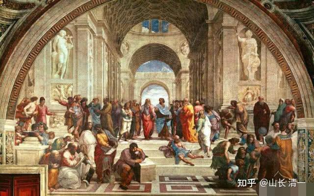

读书，总要有目标的。你们读书是要干啥？你心中有数吗？

古代读书，就是读文科，没有啥理工科的。那么，为啥读书？王阳明12岁的时候，自己看兵法书，玩打仗游戏。被长辈说他不务正业，让他要好好用功读书。他就跟私塾的老师，发生了一次对话。他问老师：读书做学问的目的是什么？私塾老师很正经的回答：这还用问？好好读书，就要为了做官呀？这个，就是当时大多数读书人的理想吧？学成文武艺，货与帝王家。读书，就是去官府谋取一个好职位的必经之途。

王阳明却大不以为然。私塾先生就说：那么，你认为，为啥要读书？王阳明回答：读书，是要学做圣贤。闻者举座皆惊！

其实，私塾老师说的并不错。大多数人，只是一个庸庸碌碌的人。不就是谋取多赚钱，过点比农民工更好的日子吗？这种目的，可以通过读书得到。所以，为了实现目标，当然要认真读书了。

拿到现代来说：“谋职”就是学生和家长的核心追求。如果你同意这一点，你读书的目的就是要获取一个好工作，你该读什么书？你肯定不能读“经史子集”，这样，你最多只能谋取一个“教书先生”的职位。现在读经教育的人，已经发现了：这条路，根本就找不到工作，只能继续当私塾先生。因为现在的世界，根本就不吃你这一套。你无法帮别人赚钱价值，你就拿不到工资，这是基本的常识。

现在社会，想要拿高薪，当然必须跟现代社会接轨。你就必须去读“职业教育”才行，高薪的职位才会给你，社会急需的专业教育，才会让你得到职位。而现在，显然社会急需的绝大多数职位，都是理工科专业。我从来没有发现，一个企业去大学里面，是要“招聘老板”的，要招聘“领导人”的，都是招收懂专业的，会干技术活的人。由于现代经济活动的繁荣，社会需要大量的工程技术人员。因此，为了谋取一个“好职位”的需要，你就必须考上名校的好专业。至于什么是好专业？看录取分数线就知道了。考去越难的，录取率越低的专业，就是好专业。为了一个“美好的职业前程”，大多数家庭，都必须从幼儿园时代就开始内卷。从学位房开始未来职场地位的拼杀。

西方其实也一样，我看过一所西方top大学的SAT录取分数线。这所大学，好专业的录取分数大约要1470分以上入门线。但是这所大学的“普通专业”，文科专业，居然只要1200分就可以上了。这简直就是傻瓜都能上了。因此，我很简单的就得出结论：虽然你们上的是同一个大学，但毕业后，这两个不同专业的人，绝对不会是同一个层次的人。而且注定后者，会被前者鄙视。事实上也是：据我所知，西方有不少博士，居然是靠开出租车过日子。我还看过报道，一个牛津大学的博士，在德国居然靠送外卖为生。显然，这些都是“文科博士”。工学博士，都是每个工业化国家的瑰宝。还没毕业，就被大企业抢着预定走了。至于批量生产出来的文科博士，最幸运的就是找到一个大学职位，继续哄下一代。但这种职位其实很少，很难留出来给普通没关系的学生。所以，大多数学生，都是需要“自谋职业”的。可惜很多文科大学毕业生，都没有真实的技能。所以，往往学了文科博士，跟不读博士，在职场上也没有啥优势。所以，可以说：现代的社会，读文科的目的，如果是谋取一个饭碗的话，你就算了，别自己骗自己。白花一大笔学费。

当然，如果你读文科的原因，就是：考不上理工科。这个原因就太过分了。考不上理工科，你可以考职校呀？没必要读啥文科大学。职校，比如护士学校， 将来肯定比文科大学生更走俏的。真心没骗你。反正：为了找个工作，真的不要学文科。

现代教育体制，本来就是为了工业化的职业需要而建立的。农业时代的老牌大学，是为了培养社区牧师和官员，管理者。所以社会上大多数人是文盲没关系，农民不需要有知识，有文化。所以，只要极少数人上大学就够了。但工业化之后，工人就必须学习基本的科学常识，必要的数理化基础知识，才有可能去当一个合格的知识工人。所以，政府部门举办K12教育，以及举办各种大学的真实目的，就是服务于工业化社会的职业需要。不是为了教你做圣人的，政府才不关心这个问题，他只关心劳动力来源和素质的问题。

当然，大学也有很多的骗子，其实大多数大学，本身就是骗子。他们善于把自己包装起来，弄出各种高大上的样子，哄骗一些傻瓜，为了“大学文凭”去交钱上学，养活一群“管理者”，“教授”，“学者”。这些人，如果直接丢到社会上，根本就找不到合适的工作。对了，这就是文科大学的真面目。他们其实根本就没有“职业价值”，只有哄骗的价值。现在文凭贬值，恐怕连哄骗的价值都没有了。很多人根本就不上学了。直接打工更划算。

那么，大学的专业，除了极其有限的“职业价值”之外，文科难道就真的就没有任何存在的意义吗？其实也是有的，就是：如果为了找工作，你当然必须去考理工科大学。但如果为了学王阳明一样----想要提升自己，想做更高级的人，比如做圣人，你还真的只能去学真正的文科。因为理工科的所有的专业，都只能帮你做“工具人”，没有人关心你“做圣人”的目标。你做圣人，你自己的提高，并没有为社会创造价值。所以没有任何教育机构来帮助你提升自我。如果你学文科，居然目标不是做圣人，也浪费了去做工具人的机会。结果就很惨了，你可能就只能“做废人”了---因为你连做工具人的基本知识和技能都没学，学了一个糊弄人的文科名词概念，有啥人才会为你买单呢？

西方知名大学的文科专业，教你“怎样做圣人”没有？据我这个在985大学教过书的老讲师所知：我没发现任何中外大学，在教学生“如何提高自己，如何才能做圣人”。就以我熟悉的大学哲学专业来说，我始终不知道设置这个专业的目的是什么。勉强要说目的，大约是培养一个可以将来站在教室里，像他们一样满嘴概念，“讲哲学课”的未来教师。而且，我也不认为大学里面教的是真正的哲学课程，我宁肯相信他们教的课程是---“哲学名词课程”，“哲学考古专业”。“哲学词汇尸体解剖专业”（文字考据学）。但肯定不是真正的哲学和思考。我认为大学的文科教授，恐怕都不知道“思考”这个词汇的真实含义。他们不允许思考，不然他们的人生就太痛苦了。只能玩弄概念。

不信：我拿耶鲁大学的哲学专业课程的设置给各位看看，你就明白：从本科阶段开始，一直到博士毕业，耶鲁大学设计的差不多要十年才能毕业的哲学课程专业，这么长时间，到底在教你学啥？你看看这些课程设置，繁复至极。到底是为了帮助你“提升智慧，做圣人”呢？还是为了让大学里面的哲学教授，有一个体面的方式来把人弄晕？用这些概念来忽悠别人，获取薪水？写论文自我满足？你认为真的学完了耶鲁的哲学课程，你毕业之后，会成为更有智慧，更有能力的人吗？会成为圣人吗？我看，应该是会培养出一个满嘴哲学名词的老学究出来更靠谱。如果把你直接丢到社会上去谋生，我很怀疑，你能否竞争力超过一个高中生。也许还不如农民工更会赚钱。

所以，这些人，文科博士们，也知道自己真实的生存本领几乎就是没有。就只能终身以“学术”之名，困在学校这样的“象牙塔”里面，不敢离开一步。设法弄到个终身教授的头衔，终身拿着一份活不好，也死不了的可怜工资，就这样凄凄凉凉的过一生。但这个工作“很体面”，对外称呼是“大学教授”，可以装的自己“获得很深沉，很光彩”，很有地位的样子，骗过自己的一生。内心深处全是寂寞。

[许云枫：哲学——耶鲁大学哲学系简介（附2019-2020本科课程清单）](https://zhuanlan.zhihu.com/p/86125431)

当年，我研究生毕业，在思考要不要继续读博士的时候，我想通了：按照这帮体制学术权威指导的路径走下去，我就成为“学术僵尸”了。我的最终人生结局就是这样的，至于名字叫什么博导，教授之类，都不重要，肯定是没有灵魂的僵尸，古人说的“尸位素餐”就是这样子。我身边的老教授们，已经示范了他们的一生，这样的结果给我看。我对此结果是不寒而栗，我不愿意复制他们的人生。我不敢想象我这一生，就这样在无聊的，毫无价值的书堆中，在各种没人看的论文写作中，在各种体制内的“学术报告”中，各种报表中，度过了悲惨的“文人一生”，真实的目的，是拿稳一个饭碗。而不是追求人生理想。

所以：我放弃了“做学问”的追求，放弃了“读博士”的努力，放弃了大学里面的“职称评选”追求。甚至，我把“大学教师”的脸面就直接丢了，直接下海，从小商贩开始，兼职经商去了。起码立足于生活，解决我经济窘困的问题----我就算毕业留校，当了大学教师。当年我要回家的路费，还要家里寄给我才够。这实在太羞辱人了。所以：我先求自立。先自己养活自己和自己的小家，不玩虚文。这就是我当年的觉悟。

我大学的本科专业，是电力系统自动化。我硕士毕业，当大学老师的时候，我教的学生，刚毕业的签约工资，每个月就是我这个大学老师的5-10倍。这种反差和对比，够大的吧？如果我不是自己有自己的“小金库”，自己做生意赚钱，还被大学的同事们称为“大学首富”，我在自己的学生面前，哪有一点“教授”的光荣和体面。的确，我的学生们都很奇怪我：张老师，干嘛你研究生要去学哲学？一副误入歧途，回头无望的样子。

为啥我学哲学？其实真心不是谋取金钱和职位。我大学毕业分配工作在电厂，是当地的“高收入阶层”，社会地位很高的。当地的领导，家有女儿的，对我们这些大学生，都礼遇有加。各种宴请。我还被排到了后备干部的位置上。我留下来，可以在电厂过上“人上人”的生活，将来当上总工，厂长，几乎就是必然。但我依然考研走了，离开了生活稳定，待遇良好的电厂，去拿一份卑微的哲学教师的工资。因为：我不甘心一辈子做“工具人”。在工厂，我可以看到我退休的样子，除了生活无忧。别无所得。在企业里面，我就不得一直做一个“工具人”，我不的不每天的重复自己。所以，我想通过“学哲学”，去看到更大的，更广阔的世界。去过我喜欢的生活---不是“穷”的生活，而是思想的自由。我以为留在大学当老师，会给我这种生活（后来发现不是，领导不许我自由教学。让我当一个“传声筒”，依然是工具人----文人就只能做“吹鼓手”的工具了。这当然违背了我的自尊心，我当然就辞职离开了。我可不想当一个“无行文人”。郭沫若就是我最瞧不起的这种文人， 虽然他用当政要的吹鼓手，丢掉良心，战战兢兢的跟随领袖，换来了一辈子的荣华富贵。但这样的“生活”，我认为还不如傅雷老舍，知识分子不得其人，不得其时，违背自己的生命愿望，不如死了更好。

当然，上研究生后，我就对知名的大学哲学专业很失望了。工科的确很无聊，但文科课程更无聊。一点实在的东西都没有。既然大学课程和教师，没法教给我想学的真正哲学，我心中认为“睿智之学”，只能自己去学习。我喜欢泡图书馆，我喜欢自学，不喜欢听老师的课。我自己读了很多中西方哲人的书籍和思想，然后：我觉得我自己学的哲学专业很值。因为我永远会比别人多想一点东西。这就是我学的哲学，带给我的东西。但不是【大学哲学课程】，带给我的东西。事实上，我跟我的老师，思想观念很不一样。我无法认同“唯物主义”这种怪物逻辑，像个机器一样可笑。我反而发现：历史上总是“唯心主义”大师们，散发着迷人的思想和智慧之光，人性的光彩。他们对世界的思考，启发我思考世界的真相和本源。

所以，我认为：哲学的确是个好东西，但现代大学的哲学课程，什么都不是。勉强可以说：是昂贵的垃圾。

清一大学，将来会开设【哲学专业】的。教什么呢？我会花三到四年的时间，教学生三句话，只学三门课程，我认为就够了。时间还不够用。我的课程，肯定没有耶鲁大学哲学课这么多。我认为，三门课程中，学生只要学会任何一门课程，这一生就够用了，就不会遗憾了。这就是我开设的哲学课程的价值。

** 我要教的哲学，第一门课程：就是“见自己”。**用西方的话，比如苏格拉底说，就是“认识你自己”。 用康德的话来说，就是“我是谁”？可笑的是：全世界的大学，没有一所大学在教学生“认识你自己”。哲学教授们，只会教你：历史上康德说过这句话，苏格拉底说过这句话。而这句话的源头，是希腊德尔斐神庙刻在一块石头上的铭言。它反映了苏格拉底受到了早期自然哲学家和智者运动两方面的背景。现在的某西方知名大学，把这句话的拉丁文，刻在自己的校园里，作为该大学的校训。尼采哲学中「成为你自己」的格言，也是源于【认识你自己】这句话的古希腊思辨传统的发展和深化。

您觉得：你来上哲学专业，就是想学这样的东西吗？这样“教哲学”的学者，知识很渊博，词汇很丰富，可以让你去吹牛的时候多一点谈资，但似乎也不会有人会对你的言论感兴趣。还不如你讲个黄色笑话更引人注目。但你觉得自己学了哲学，就高大上了，高在何处？高在别人都不想理你吗？你懂了这句话的意思吗？你认识了自己没有？

当哲学教授们，在课堂上洋洋得意的展示这些词汇，说明这些词汇来源的时候，你说，这是“哲学课”呢？还是“哲学尸体解剖课”？教授们把古人的词汇，拿来显耀自己的博学？甚至连古人为啥这样说，古人的思考和逻辑，他们都不去研究。学生们只是把这些词汇和垃圾塞进自己的脑袋，然后装出一副法官的样子，审视和点评一下亚里士多德和康德的思想深度，得失，就以为自己完成任务了。我想问：上这种哲学课程，有啥意义？教授们，你知道你自己是谁吗？是一群玩弄学术词汇来换工资的文人骗子吗？

我来上这个哲学课，我如果要追问学生“你是谁”，我绝对会让学生大惊失色，痛苦莫名，满脸泪水。然后又无比轻松。因为我会让他看见“真正的自己”。也会知道他“假装的自己”。当我教人去看清真实的自己，这价值有多高？这几天，我就在帮一个家长，看清“她自己是谁？她女儿是谁？”。帮助她解决了心中最大的困惑。这就是哲学的价值----智慧之学。据我所知，中国还没有第二个教这种课程的。 这就是我的课程非常吸引学生的原因。

** 我要教的第二门课程，是“见众生”**。用现在俗语来说，就是：了解他人。了解他人的苦难和快乐，也了解他人的追求和目标。道家修行，高人做事，都讲求“顺人逆己”。你如果不知人，不知己，你谈顺逆？做梦吧。现在的大学文科，有人教这门课吗？

**我要教的第三门课，是“见天地”。**用现在的学术词汇来说，就是“了解世界的运行规律”。这个就难了。你了解一点点“见天地”的东西，都可以在俗世生活中大获成功。比如：如果你了解一点股市运作的真正规律？你会怎样？肯定你不会缺钱。就像我一样。

这三门课程，入门学习三四年，勉强就算大学毕业了。但要掌握，需要用一生来学习和深化。一旦你真正的学会了这三句话，你就是王阳明说的“圣贤”了。超凡入圣----你已经超过了平庸的，庸庸碌碌的凡人，不再是普通人了。自然是圣贤。

这就是我说的：文科的学习价值。我很早就说过：清一大学，是超过耶鲁哈佛的大学。凭啥---就凭这种学问。老祖宗传下来千年的真学问，真本事。跟现代大学，不是一个级别的。就像太极武学，跟现代格斗就不是一个级别的一样。西方人，对于这种高度的学问，都只有仰望的份。哈佛耶鲁的文课课程，在我看来都是对人生社会无用的垃圾。这种西方名牌大学的真正价值，在于学生----因为他们的学生，都是第一流的年轻人。但很遗憾，哈佛耶鲁，没有善待自己的优秀学生，没有教他们真正人生最需要的东西。这些真正的文科，真正的哲学，虽然不是职业培训，而是超越了现在工业化培养工具人之后的，职业培训之上的东西。这是所有人都着迷的东西。

*雅典学院 油画*

上面这张图，是我认为真正的大学该有的样子。这些人，不是为了职业，生活，地位高低贵贱。他们争吵，讨论，思考，研究的唯一目标，就说在回答我说的上面的三个问题。这就是超越凡俗的人生，这就是我们为啥要学哲学的原因---让我们成为一个更加高大的人，而不是一个只会“活着”的可怜的动物。因为我们每一个人，骨子里面，内心深处，都在渴望解答这三个问题，都在设法解决这三个问题。因为我们是人，不是动物。我们不仅仅需要“活着”。我们还需要知道活着的意义和目的，这样的问题，只有真正的哲学课程，哲学导师，才能解决。人类需要真正的导师，来帮助自己解决这三个问题，来完成人对于人生的意义设定----即使是人生没意义，你也需要用哲学思考来证明人生的无意义。而动物----他们永远不需要思考和处理这样的难题。假如你从来没有思考这三个问题，其实很遗憾，你的生存质量，其实也和努力活着的各种动物差不多。你还不是一个真正的，大写的人！

清一大学少年班的学生，都很希望能够留校，继续学习这些深度的内容。但为了让学生学会踏实的生活，我把他们赶走，去上世界名校去。我不能让学生们不离校，就直接学这些专业。我要求学生们：真想继续上这些课程，就等他们上完西方大学，拿到打工证，上世界500强企业上几年的班，确定自己可以自立生存了。如果他们还想解决这三个重要的人生问题，还想继续来清一大学上学，将来就可以考回来，上清一大学的哲学研究生课程。

作为读者：你如果想学文科专业，想学真正的哲学，你会选谁的课程上呢？清一大学？还是耶鲁大学的哲学专业？

不过：为了谋职方便，建议您还是去耶鲁吧。它拥有的优势，并不是学科的内容，而是包装。这显然是清一大学不能比的。也许100年之后会反过来。