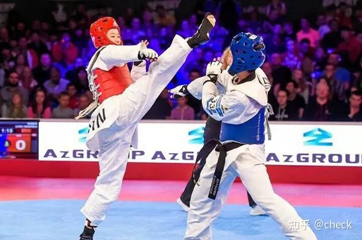

跆拳道？能打吗？好像能。其实不能真打。它只是一种体育比赛的技术，不是一种格斗技术。

*花拳绣腿 跆拳道 *

我看了跆拳道的专业比赛视频。以一个格斗手的眼光来看，我觉得：啥跆拳道？体育表演呀?根本就不是一种真能实战的格斗技术。 你们自己看实战比赛---号称专业队。应该是全国的体育大学专业的比赛。 这样子想能打的样子吗？

[全国大学生跆拳道比赛（竞技专业组）2021_哔哩哔哩_bilibili](http://link.zhihu.com/?target=https%3A//www.bilibili.com/video/BV1sX4y1A7i9%3Fspm_id_from%3D333.337.search-card.all.click)

我来告诉你：为啥跆拳道不配称为武术;

首先，格斗居然不护头？难道是极真空手道？不许打头吗？其实可以击打头部，但由于不能用手击打头部，所以，就养成了跆拳道拳手不用手护头的习惯。这个习惯是害死人的。如果实战的话，很快就被人干掉了。其实，我看跆拳道就没有啥防守技术。就是两个人互踢。看谁更快。

第二个缺点：跆拳道没有发力技术。啥叫拳？能打才叫拳呀？一个不强调发力技术的拳，你打啥？玩儿罢了。比如太极拳，国人练的太极，其实不能打的原因，就是没人知道太极的发力技术。而没有发力技术的太极，就是体操。没有发力技术的跆拳道，也就是体操而已。教拳不是教招数，而是教发力。发不出力量，打什么招数都是骗人的。我估计，这和跆拳道的规则有关：只要碰到你有效部位就计得分。而且由于带着护具，你击重腿也不会造成对方的伤害，当然去练重腿发力的就是傻瓜了。不如轻快的擦你一下，就得分了。

第三个缺点：跆拳道没有步法。没有闪展腾挪的移动技术。我看起来就是两个人面对面站着拼腿。跟拳击和其他格斗技术比，实在难看。关键是：不实用。

第四个缺点：没有拳法，没有手法。跆拳道虽然允许用拳攻击，但拳只能用来打身体各部位，不能打头脸。但在允许腿击头部的情况下，用拳去击打对方的身体，简直就是自杀行为。所以导致跆拳道的运动员，基本放弃拳法的练习。所以，看起来跆拳道的运动员，就是只会用腿了。而且还站不稳的样子。因为不需要用力。

第五个缺点：没有内围战。就是没有贴身近战。因为规则不允许。既然如此，真实实战中，经常出现的互相抱摔，贴身近战的情况，跆拳道绝对就无法应对。这一点，站立格斗中，应该是泰拳手应对的最好。就不说专攻贴身近战的巴柔了---其实巴柔基本上是地面战专家，站立贴身格斗的技术，未必就超过泰拳。

各位不是专业练武人，你们看比赛，就是看热闹，应该看不懂啥是发力技术的。所以，估计也不知道我在讲什么。你们就看下面这场比赛好了，看他击中对方，是否给对方造成了伤害。就知道有没有发力了。这是一场跆拳道参加踢拳比赛的实战格斗。讲求发力技术的踢拳，虽然拳手我认为级别并不高，比播求之类差很多的。但他几乎就KO了跆拳道的“国手”。这位跆拳道的拳手，第一局其实击中对方关键处多次，甚至多次击中头部。说明技术还是的确不错的。可惜就是：由于缺乏发力技术，根本对对手没有伤害。所以，踢拳对手反而越战越勇，最终几乎KO跆拳道手。只是这踢拳手技术也不精良，个人认为防守技术和进攻技术还不如小木兰们。所以才没有当场KO对手。但充分显示了跆拳道的“非武术”特点。

[江畑秀范vs佐野勇海 – 日本跆拳道国手RIZIN踢拳首战_哔哩哔哩_bilibili](http://link.zhihu.com/?target=https%3A//www.bilibili.com/video/av627897504)

再看一个跆拳道打泰拳的视频。泰拳手完全就像是坦克车一样，完全打不动。跆拳道的攻击，对他来说毫无影响。这就是泰拳的优势：稳。可惜，遇到真太极的攻击，泰拳就稳不住了。

[泰拳vs跆拳道_哔哩哔哩_bilibili](http://link.zhihu.com/?target=https%3A//www.bilibili.com/video/BV1bv41177BT/%3Fspm_id_from%3D333.788.recommend_more_video.3)

看了跆拳道，你们现在应该知道：上一次木兰明晓与泰国金腰带的比赛，小木兰们的攻击力有多强了？第二局的对手，只是身体的非要害部位，中了三脚就站不起来倒地，是啥原因了？如果是被这种力道的腿法击中头部，只要一下就会被KO了。不会如同上一视频中的比赛，多次击中，对对方居然没有影响。太极的发力技术，练出来之后极为威猛，胜过泰拳的威猛。泰拳的威猛，是你们看得见的。太极是骨子里面的强悍，看上去轻描淡写，当事人如雷霆轰击，难以承受。这是用全身的弹抖来发力的，完全不同于用肢体转动发力的外家拳。泰拳手在第二局，被击中的第二腿结果，你就充分看出来：一个看起来轻松快速的穿心腿，居然把对手打得双脚离地后，连退几步倒在场边，这是她第二次被击中躯体，也是第一次真正的有效击中。她很勉强地爬起来继续迎战，但由于已经受伤，反应速度明显变慢，就注定被KO了。她很快腹部又被踢中一腿后，就直接站不起来了。可见太极腿法的发力技术之猛。拳手事后的总结，是今天打拳没有力气。导致失败。其实她一直不明白。为啥简单的一击正蹬就打垮了她。认为是自己腹部抗击打不行，后来我们看她在脸书上，常有狂练腹肌的分享。其实练腹肌没用的，挡不住这种打击。必须练怎样避免被踢中。

你们对比看跆拳道的视频，踢拳对手，第一局就被跆拳道国手击中十几次，头部也被多次击中，居然毫发无伤。踢拳手有效击中跆拳道对手的数量也并不多，但每次打击肯定都有伤害力。所以跆拳道对手的体能肉眼可见的快速耗尽，赛场上摇摇晃晃的站不稳，也无法像第一局一样，发出快速的拳腿攻击了。看客们以为是他只是体力不佳。其实我认为也有他不适应重腿重拳攻击，可能身体有一些受伤导致的。就像木兰佳蕙的对手，体力不佳的样子，但靠技术躲避，勉强撑了下来。因为她也受了伤。不是简单的体能不足。看了视频，你说这跆拳道---有啥发力技术？就想玩摸摸游戏一样吧？配称为一种真正的武术吗？ 你真看懂了跆拳道，家长们就别指望送孩子去练了跆拳道，能够让你在日常生活中“护身”了。真心不成的，想防身，不如练拳击更靠谱。健身好玩吗？当做一种体育运动，练练也无妨。

怪不得，前段时间新闻报道说：一个练了十年的跆拳道女子冠军，居然被两个未成年人杀害了。这种不能打的武术，真心害死人。赛场上可以拿冠军，是因为有规则来的。现实中打架，是没有规则的。但没有规则，泰拳手和踢拳手都不会吃亏，因为他们有发力技术，只要击中你一下，你就会倒下。跆拳道？我相信这女子冠军，肯定也像前面的“跆拳道国手”一样，反抗的时候肯定多次击中对手。但由于她根本就没学过发力技术，她的击中只能拿分，但不能击退对手。无法给对手造成伤害，但这种打击，可能反而激怒了对手，所以被杀害了。还不如不会跆拳道，会跑步，逃走就比相信自己的冠军技术更靠谱。

我相信:如果有人去练过跆拳道，就可以证明：一定没有教练，专门教她练发力技术的。但泰拳，第一天开始，师父就在教他发力，拿了冠军也继续练发力。我们的小拳手，被泰拳师父骂，都是骂我们的发力技术不对。身体没有挺直，按泰拳规则是无法发力的。泰拳手们每天必练的三至五局的打靶师的项目，最重头的，最吸引人的，就是练发力。泰拳手的对抗练习，是练技术，不许发力的。赛前最重要的备战，就是练发力，据说备战期间每天拳手们要练8局全力打靶。所以，极为重视发力技术的泰拳手，才会轻易击败世界各国拳手，打得中国人都患上恐泰症。泰拳是一种极其迷信力量的拳种，甚至因此放弃了古泰拳很多花式的动作，只保留了最简单，最能发力的少数攻防动作，每天狂练力量。甚至牺牲速度都在所不惜。扫腿就是他们最核心的“核心技术”，扛不住泰拳的扫腿，你就别打了，你有什么技术都是失败的。这就是泰拳的牛气，甚至有人，如泰拳手省过，就练一个左腿扫腿成名天下。诀窍就是每天数千下扫腿。其他如泰拳的拳击，肘膝技术，也是强调发力的技术。根本无视花拳绣腿（正因为如此，泰拳馆长教练，看我们的小木兰特别不顺眼，因为完全违背了他们心中的泰拳原则，看起来就是花拳绣腿，赢了他认为是运气好的缘故）。所以，当喜欢花法的跆拳道，遇到强调实在力量泰拳，打起来一定很可笑。比打踢拳可能更惨。

我也理解了:为啥张伟丽每次赛前备战，都是来找泰国教练训练了。她的打法，的确有很多泰拳的因素。我见过她跟善猜的练习视频。善猜也在清迈，因为泰拳的力量感，真心是很实用呀。（我原以为张伟丽应该找练拳击练的，她的腿法实在不怎么地，不太像泰拳的风格。但拳击水平真心很好，欧式泰拳的打法，她找的泰拳馆训练是善猜的，比较欧式一些，变化比一般泰拳馆更多）。

我教的太极实战，也一样首重视发力，不然没法和泰拳对抗的。当然，我们练的是所谓的整体力，弹抖力，没有这个发力技术，我根本就不敢送孩子们上泰拳台去实战打泰，我觉得就是让她们拿着机枪，去拼泰国人的坦克，几乎就是去送死的。去打打没功夫的业余选手还差不多。没有发力技术的拳种，无论技术多么的好看，都只是花拳绣腿。而一旦有了发力技术，你用什么动作打人都可以，效果惊人。实际上，孩子们已经会太极发力之后，我才送去泰拳馆“知己知彼”的。但造成的问题就是：小木兰们此时已经很难接受“正规泰拳”的发力训练了。只能跟着划水。因为正规泰拳的发力技术，与我教的正好相反，她们练起来特别别扭。但如果没有学过太极的发力，提前去泰拳馆的话，任何人都一定会被泰拳的威力所震慑，会对自己的武术体系失去信心，就会乖乖的学泰拳了。所以，这就是小木兰在泰国已经三年了，却一直没有去泰拳馆看。根本就忘记了泰拳的存在一样。她们基本练成了太极发力的入门，两三个月前，才第一次去泰拳馆开始“正式训练”，其实是去自己了解泰拳，并验证太极的实战武学，是否适用打泰的问题。当然，结果是小女孩们都大喜过望---发现我们练的功夫，正好处处克制泰拳手，对打起来很好用。当然，这样她们就不会自卑，不会趴在泰拳面前就直不起腰来了。可惜，中国的格斗界拳手，过去一百多年来，在泰拳面前，腰一直是直不起来的。可以理解：自己学和练的拳种，没有对手的比较优势，你就是打不赢泰拳，当然要臣服于泰拳的霸气。除非你能打垮他。。

太极与泰拳的不同，就是：太极无招。她几乎可以用任何其他拳派的动作，都能发出力量来伤害对手。但泰拳只有满足特定的条件的几个动作，才能给对手造成最大的伤害。因此，泰拳的动作其实不多，但每一下都很实在，都可以打得你KO。我们对付泰拳的方式很简单：就是通过我们灵活的位置移动技术，设法站到泰拳手们无法发力的这个位置去，让他们的重扫技术无法发挥。而我们的攻击技术可以发挥出来。这样来跟泰拳手打，自然的结果就是：他们像是不会打拳了一样，还遭受重创。但我们的小拳手打完下来几乎就是无事。因为对手都没机会打出有攻击力的打击，我们自然不存在受伤可能的问题。

练好了太极发力的人，可以采用任何拳派的招数动作去打实战的。所以可以说太极就是变化万千的拳。没有啥固定的动作可以称为“太极，勉强有，就是看起来缓慢的动作。因为太极可以从四面八方来发出攻击的力量。所以，任何拳派的技术都可以采用。假如太极去模仿跆拳道的动作，就可以发力了。实际上，小木兰们， 现在正在发展不同的踢击技术，不仅仅是只有穿心腿。甚至会对练的时候，一个外摆腿直击泰拳手的面部。泰拳手们就问:你们的腿法，怎么有点像跆拳道？孩子们也搞不清啥是是跆拳道，只知道我们练的是中国传统武术，跟韩国没关系的。我们的腿部动作，比跆拳道还是简单多了，跆拳道很多动作是不适用的花法，就是可以足部打到对方，却无法发力，看起来很漂亮的高腿“变线踢”动作，很有技巧，实战根本就无用。学了这些花拳绣腿，打泰拳会吃亏很大的。我们的腿法，相对跆拳道，肯定要简单得多。因为每一腿，都要放在能够发力的位置。必须出腿就能够破坏对方的平衡，否则不要发腿。但肯定比泰拳要复杂多了。孩子们的腿法，现在几乎可以往对手的任何部位进行攻击了，从脚到头----关键是还有力量。这就是不同。如果没有力量的足击，攻击对方脸部，就很容易被抓住，然后你就倒霉了。赛场上没关系，裁判会拉开。但真实的世界，被抓住腿之后，你就攻守易势了。

我很自信地说：小混混们遇到小木兰，会吃大亏的。她们甚至不用踢打你的要害部位，只要随意击打你身体的任何地方，都可以让你痛得跳起来。或者痛到直接倒下去。如果击打要害，几下就能KO掉你，甚至只要一下。因为她们每天都在练发力。每天的目标，就是怎样一击就把人打倒。而不是只摸你一下玩儿。泰拳的厉害，就在这里：他不是动作有多漂亮，多技巧，而是“太实在”了。你碰到就受伤。练不出这种对抗的功力，来打泰拳就是找抽的。你们看比赛，会发现泰拳手们第一场跟木兰们“碰过腿”之后，就会开始退缩。因为双方的腿一碰，就知道高下了。明晓的第二局最明显。对方上来左右大力扫腿，想要示威。但明晓左右迎击了两腿，泰拳手马上退几步，缩到拳台边上去了。此时她痛死了。后来就不断躲，不敢拼了。原因：我们用了中国古人教的强腿功，胫骨的硬度。实话说，是超过一般泰拳手的。男生都碰不赢的。泰拳手崇尚力量，你比他强，她就不敢拼了。不然一旦试出你弱，你怕扫腿，就会劲头十足的不断狂扫你，直到把你扫倒下为止。你强，她自然就弱了。

我们也要防止出腿被抓住。所以：太极的内围技术，是非常厉害的。一旦对手进入内围，你就等着被KO好了。如果小混混们，敢靠力量大，被远距离击伤之后，就冲过来抱住小木兰们，试图用力量来取胜，他们受伤会更重的，太极肘膝功夫更厉害。这就是很好的防身技术。而跆拳道，根本就没有这个技术。

跆拳道远攻无力，无法阻止对手近身。偏偏又放弃了内围战。所以，跆拳道的技术缺点，不但没有被规则弥补，反而越来越“缺乏真实格斗技术”了。所以，在我看来，跆拳道就是一个笑话！格斗性远远不如拳击。更不如泰拳。

据说：跆拳道之父[崔泓熙](https://www.zhihu.com/search?q=%E5%B4%94%E6%B3%93%E7%86%99&search_source=Entity&hybrid_search_source=Entity&hybrid_search_extra=%7B%22sourceType%22%3A%22answer%22%2C%22sourceId%22%3A2453727808%7D)曾痛心地说：**WTF跆拳道进入了奥运会，我非常心痛，就像把我残疾的孩子展现在了世界上。**

** 原始的跆拳道，肯定是能打的。但现在到处推广的跆拳道？其实已经基本失去了实战能力，只能成为赛场的运动项目了。**

** 我想问：奥运会，是提升了技术水准，还是制造了技术无能？**

就像是国家武术总局，你们的存在，是提升了中国武术的水准，还是降低了中华武术的档次？