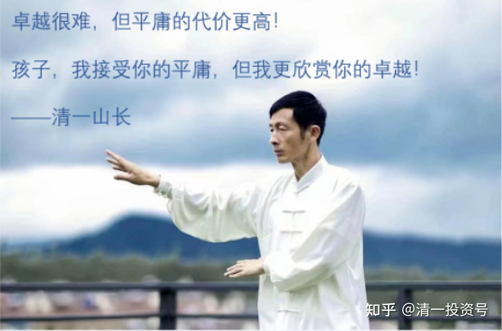

2篇.信息时代如何出奇制胜

清一山长 2021年3月12日

此文为山长专栏文章《未来世界需要跨国，跨文化，跨专业的综合人才》的跟帖评论[https://xueqiu.com/9310099567/174170445](http://link.zhihu.com/?target=https%3A//xueqiu.com/9310099567/174170445)

[清一山长](http://link.zhihu.com/?target=https%3A//xueqiu.com/9310099567) [2021-03-12 12:47](http://link.zhihu.com/?target=https%3A//xueqiu.com/9310099567/174248373)

这里有一个视频，是五大常任理事国的地位变迁历史。[网页链接](https://www.zhihu.com/zvideo/1339950743848153088)

这个变迁，很能说明托夫勒的观点：掌握了新力量的国家，就上升。故步自封的国家，就下降，走上不断衰落的道路。

法国两百年前，是世界第一强国。它取得这一位置，靠的是暴力，击败了前霸主——西班牙的无敌舰队。

1805年特拉法加海战中，英国彻底击败西班牙和法国的联合舰队，确立了英国海上霸主的地位，此后延续了一个多世纪。英国成为日不落帝国，坐享全世界的红利。

这个时代，暴力机器就是代表国家的权力和地位，代表国家的利益。这是暴力优胜的时代。

此后，工业时代开启。资本家力量时代开始到来，新的工业化教育也开始形成。美国人借助成功的工业化，特别是利用“欧洲互相打仗，一战、二战都打烂了，无法正常生产”的机会。美国就成为了当时全世界的制造商，向全世界输出产品。从而掌握了金融力量，成为新时代的霸主。当然，与此同时，美国作为欧洲的避难地，很多知识分子、教育家，都跑到了美国——特别是德国的优秀科学家、工程技术人员，都被美国搜罗了，让美国快速地成为超过英国的世界大国。没有依靠自己的暴力，而是借助**“别人互相使用暴力，无暇发展经济实力”**的机会，美国就成为了新的世界霸主。

前苏联在50年前是世界第二，超级强国，跟美国差不多。但美国利用前苏联脑子不够用——不知道最强大的力量是经济，是教育，是输出产品获利——就用了一个虚假的**“星球大战计划”**诱惑前苏联把资本集中地投向毫无收益的“暴力机器”的竞争——武器竞赛；而美国大量投资教育、实业，特别是新式的工业化教育——以斯坦福、MIT为代表的新大学名校，取代了哈佛、耶鲁的地位，创造了工业化时代的圣地——硅谷文化，占尽了竞争的上风；利用美元来收割全世界，强化资本力量。最终，只懂暴力机器的苏联被拖垮，国际地位快速下降。

这50年里面，最突出表现的是中国。为了抑制前苏联，50年前，美国拉中国一起干，把制造权力——也就是换美元的权利——让给中国人去干苦活，美国人赚更多的利润。中国人接下了美国人不愿意做的脏活、累活、苦活，低端、低利润、低技术，但生产制造了大量的产品，最终成为新的制造工厂。美国产业空心化，但资本家收益累累。

美国也开始犯前苏联的错误，卷入了几场战争：阿富汗、伊拉克战争等，导致竞争的实力大大降低。

但中国人有钱之后，开始进入“创新知识”领域，开始跟美国人抢高端的钱。美国人就急了。

任正非说“中国的教育没有跟上，很可惜”。要跟美国竞争，中国就必须有自己的斯坦福、MIT、加州理工等。可惜，中国目前一所这样的大学都没有。深圳科技大学，以及西湖大学，想走这条路。但——被中国的传统体制习惯制约得很严重，不知道能不能走出来。

未来，中国想要超过美国，我个人认为：不能靠跟随美国去建MIT、斯坦福大学等。这条路，我们再追50年、100年，恐怕也没希望超过美国。

就像马云做零售业，去模仿沃尔玛的销售模式，他再聪明，资本实力再雄厚，得到的国家支持再多，我看再追100年，都追不上沃尔玛的。
幸亏马云没这么笨，没有去模仿沃尔玛，而是创造了“新零售”的概念。市值现在远远超过沃尔玛，甚至成为沃尔玛学习却总也学不来的对象。相反，现在阿里巴巴开始降维打击，开始收购传统零售业，布局实体终端。这样反过来操作，全面地形成了对传统零售业的压倒性优势。

教育上，国家权力上，我们要和世界强国竞争，也必须用这样的思维才能取胜——出奇兵。

我们恐怕只能换赛道，用新教育来拼知识权力。利用知识和信息时代，对教育的需要，把传统时代的大学全部换装，才能赢得未来。最终，英美都得乖乖的跟我们学习。

[爱玛生活笔记](http://link.zhihu.com/?target=http%3A//xueqiu.com/n/%25E7%2588%25B1%25E7%258E%259B%25E7%2594%259F%25E6%25B4%25BB%25E7%25AC%2594%25E8%25AE%25B0)回复[清一山长](http://link.zhihu.com/?target=http%3A//xueqiu.com/n/%25E6%25B8%2585%25E4%25B8%2580%25E5%25B1%25B1%25E9%2595%25BF):

我是非常幸运的，我的孩子在体制内学校比较成功，一路走来都是阳光又轻松，非常快乐的（在省级重点高中的重点实验班）、对于学习一点都不觉得苦。去年高考考了她水平的下限，但还是已经进入了一所比较好的大学。但我竟然忧虑我的孩子会不会还如此幸运，拥有超级省心的下一代。昨天看了山长学校的宣传视频，感到很震撼，如果我有足够的钱，不需要子女为了工作获取文凭，也会把孩子送到那样的学校。

[清一山长](http://link.zhihu.com/?target=https%3A//xueqiu.com/9310099567)[2021-03-12 12:57](http://link.zhihu.com/?target=https%3A//xueqiu.com/9310099567/174249210)回复[爱玛生活笔记](http://link.zhihu.com/?target=http%3A//xueqiu.com/n/%25E7%2588%25B1%25E7%258E%259B%25E7%2594%259F%25E6%25B4%25BB%25E7%25AC%2594%25E8%25AE%25B0):

“如果我有足够的钱，不需要子女为了工作获取文凭，也会把孩子送到那样的学校”

您好像完全搞错了核心逻辑，全搞反了。是你——如果孩子根本就不需要将来去打工，你就可以养孩子一辈子，就可以放心送到“已经明显缺乏职场竞争力的体制学校”上学去。**如果你是穷人，你就必须学新教育，未来社会才有更多的职场机会。而不是去跟同质化的数千万人抢饭碗**，**如果家长没关系，毕业还找不到工作。**

**越穷，越想赚钱，越要学新教育。越不在乎钱，就可以读北大、复旦混圈子。**

而且，新教育门槛已经很低了，比体制更低。我可以一个人办一所大学，你们家长每个人都可以当一个人的校长。你的教师可以全部来源于网上，您可以使用今日学堂的高价师资，但你还不用付一分钱给他们。你只要能管好自己的学生就够了。你的家庭学校，教学质量可以拥有比任何名校都高级的教学资源。你们如有小孩子，跟示范班，现在的中国任何国际学校、名校，教学成绩、实力、学生状态，这些省会名校，有谁可以比得上？能比，就来拿一千万元。

[qff94a](http://link.zhihu.com/?target=http%3A//xueqiu.com/n/qff94a)回复[清一山长](http://link.zhihu.com/?target=http%3A//xueqiu.com/n/%25E6%25B8%2585%25E4%25B8%2580%25E5%25B1%25B1%25E9%2595%25BF):

山长您好！

我是清一塾挑战班6号刘书铭的家长齐芳芳。

读了李小虎老师在武道班的学习分享，有很大触动。他的近距离观察让我对什么是示范，什么是自律，什么是尊重，什么是影响有了一点体会。原来是知道家长要做示范，要自律，要学习尊重孩子，其实是怀着目的对自我的逼迫——老妈都这样了，你还不努力？本质上是更精致的利己。如果对自己的孩子都不能发自内心的“利他”，对其他人更免谈。

从李老师的描述中感受到武道班的小老师们每个人都真正与自己的内心共振时的安静，谦虚以及专注的力量。让我的内心产生了很大的向往和想学习的力量。

同时也看到李老师在这短短二、三周的学习后所产生的巨变以及带给国际今日的能量。

其实，如果没有李老师的亲身经历以及文字的详细描述，并不能真正理解武道馆的好，不能理解武道之武才是在培养真正的文人贵族。通过李老师的文字读到的是武道馆师生身上的贵气静气。

作为清一塾的家长，虽然看到了与武道班巨大的差距，值得高兴的是看到了真实的未来应该有的样子。

作为第一界清一塾人，我们也有自己的使命和示范性，尤其现在大战当前，家长们也在努力改变也在示范，但似乎有种力不从心的感觉，能否请山长对清一塾家长指点下迷津。或者如果清一塾家长做到什么，可以获得一个去武道馆学习几天的机会？

另外还有一个个人的问题就是，为什么想的很好，文字表达却是两样。怎么训练自己的文字表达能力？

[清一山长](http://link.zhihu.com/?target=https%3A//xueqiu.com/9310099567) [2021-3-13 11:14](http://link.zhihu.com/?target=https%3A//xueqiu.com/9310099567/174322502)回复[qff94a](http://link.zhihu.com/?target=http%3A//xueqiu.com/n/qff94a):

武道馆是个很单调的地方。只有最细致的心，才能知道它的复杂。李总原来不时会去庙里面住一段时间修心。广东的企业家，学稻盛和夫的很多。有修行，济世之心，我知道他有这种背景，才告诉他：中国的庙里面，可能很少有修心提升的课程，静静心差不多。加上李总一直有武侠梦。才让他来武道馆“代训”的。武道馆是培养未来职业武术冠军的地方，也是中国国学的专修之地（**真国学，必须文武合一**）。偶尔一些商界人士去，是会有帮助和提高的。一般家长不需要去，去了也是受罪的。

你们清一塾，孩子考上高中，如果不想去国外，不要海外文凭只想学国学的话，可以选**武道馆**作为“出路”，它也**是未来的国学师资班。**

[124篇 未来世界需要跨国、跨文化、跨专业的综合人才](http://link.zhihu.com/?target=https%3A//www.ximalaya.com/sound/485887432)（音频）