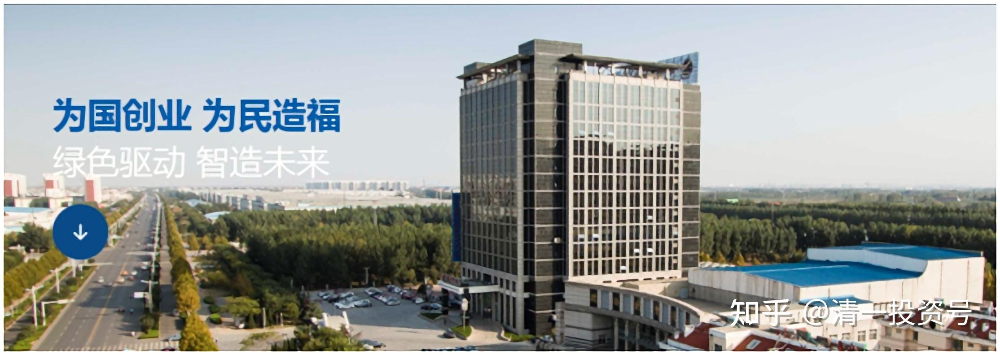

6篇.中国宏桥系列之六：宏桥复牌后的基本面分析及盘面动态

清一山长 2017年11月01日～2017年11月14日

导读

**一、 铝业上行，外资做空不可思议**

**二、** **等着宏桥进一步的价值回归**

**三、** **张世平增持轻松击败外资大举做空，四天上涨70%**

**四、** **宏桥增持减少，耐心持有**

正文

**一、** **铝业上行，外资做空不可思议**

清一山长 2017-11-01 10:33 $中国宏桥(01378)$

这几天在泰国到处跑，没空上网。今天偶然见到高海君的信息，才知道宏桥昨天已经复牌了，果然不出所料，高开30%多。外资做空，不是损失惨重吗？

这一次外资居然选择做空宏桥，我也觉得他们疯了。对全球第一铝业做空，在铝业上行的基本面情况下做空，不是找死吗？这个时候，就算是垃圾铝业股，也可以卖出高价的。如果行业低迷，倒是可以趁乱杀入，害的一些绩优股也被错杀的。

另外，外资专门选择中国的龙头股（如恒大、宏桥）做空，有点不可思议：除了脑子进水之外，是不是还有别的企图呀？祝福外资做空者，获得与我们做多宏桥的投资者相反的收入！[大笑]

**二、** **等着宏桥进一步的价值回归**

[高处看海](http://link.zhihu.com/?target=https%3A//xueqiu.com/4532094386)[@清一山长](http://link.zhihu.com/?target=http%3A//xueqiu.com/n/%25E6%25B8%2585%25E4%25B8%2580%25E5%25B1%25B1%25E9%2595%25BF)

《携手迎接中国宏桥的大时代》

（[https://xueqiu.com/4532094386/94643403](http://link.zhihu.com/?target=https%3A//xueqiu.com/4532094386/94643403)

清一山长 2017-11-01 10:40 评论上贴：

如果不是看到高君的@，我还不知道宏桥复牌了。

停牌期间，别人种种猜疑，问我的“第一重仓股”被关了，担不担心？我说：关上十年也不担心的，反正我不用这笔钱来谋生。张世平会比我更操心，我又啥事干不了，操着心干嘛？所以根本不看宏桥。现在关了这么久，宏桥已经从“第一重仓股”的位置上退下来，只是依然是重仓股之一。但我并没有减持（也没有机会减持）。而是其他股涨了以后，有些股持仓，已经超过宏桥的仓位了。

我知道一个信息：深圳和香港的几个企业家，是张总原来做纺织的朋友圈好友。几年前听张总的建议，铝业很有前途，上一轮（2015年二季度）就大量买入宏桥，据说正好买了个高点，7～8元买入的成本。后来跌到3元多，亏惨了。问张总咋办？张世平说：没关系的，拿好股票，低点继续买入就行。未来前途无量，8元也不是高点的。今天的事实，证明了张世平早就心中有数。而且2016年，张总还给了一个低价（4元多一点点）配股，增持股权的机会。我利用这个机会，放弃了配股，却拿了不少比配股价还低的股票。因为香港人基本上都视线不良，一看见配股就说是老千股[大笑]！所以把正股价打到比配股价还低，我就把配股机会给张家了，自己拿了市场上更多的低价股。低于4元就出手，才把宏桥买成了重仓股。

张世平现在走棋，绝对是高手，看得很远。不急不躁的。他利用让宏桥停牌，关起来这么长的时间的“势”头，自动地消减空方的种种不利言论和攻击，增加空方的资金成本。他用全球铝业的复苏的事实，来对付空方的愚蠢攻击，也避免了打口水仗。实际上，关这几个月，原来打算跑掉的骑墙派，一看其他全球铝业股票都在狂涨，复牌之后也不肯走，空方拿不到筹码，只能束手就擒的。

宏桥的下一步的棋，我的判断是：如果国内的管理部门，依然不给宏桥200多万吨被砍掉的产能“合规指标”，不让这些生产线复产。宏桥会被迫向国外发展产能，成为国际性的企业。而山东的政府部门，面对这种国家不给条路的情况下，面对宏桥最先进的产能（国际领先的600PA生产线）也不能在国内生产，也不得不支持宏桥走向国际化的发展之路，反正宏桥的产品是拥有国际竞争力的。估计宏桥新增产能去东南亚国家发展的机会很大，应该也会走全产业链的发展之路，配套厂也会跟随出去一批的。宏桥的先进产能也被砍，只是国家目前为了保中铝这样的“自家亲儿子”的政策，但对宏桥的确造成了天花板。唯一的办法，正好借助一带一路的发展机会走出去。这样做，是中国的损失。不过，我认为利益集团，是不会站在国家的利益上考虑的，他们只会为了“小集体利益”，不惜牺牲国家利益。

从现在和未来来说，我认为宏桥都是值得拥有的好企业。我们等着宏桥进一步走向价值回归和实现之路吧！相信我们国家的优秀企业家的能力和勇气，与他们一起跟随发展，是我们小股民最正确的投资选择！

风险提醒：本言论并不是支持各位现价买入宏桥，因为本人持有宏桥已经两年，原始买入成本价不足港币四元（还不算分红）。您愿意现价买入的话，为我抬轿非常感谢[大笑]。

**三、张世平增持轻松击败外资大举做空，四天上涨70%**

清一山长 2017-11-01 11:03

呵呵，是前天复牌的，今天第三天了。量缩很明显。空方无计可施了

清一山长 2017-11-01 11:26

研究了一下：昨天外资卖出的股份中，有40%左右的股份，落入了张世平的手中（10月31日，控股股东兼主席张士平透过全资拥有的宏桥控股，从公开市场购买合共1865万股公司股份，每股平均价9.29港元。总成交5400万股），前天成交最多，但老张买的并不多，只有1400万股（总成交1.2亿股）。今天到现在才1000万股，显然外资抛盘已经抛不动了。老张仅用了3个多亿，就轻松击败了外资的大举做空，也是一个笑话。

外资跑掉很正常，他们实行的是：宁可不赚，不要有风险。所以，在目前被外资研究机构连续沽空的背景下面，先走掉是最安全的。但现在走也没货了。多头似乎很稳健，并不拉升。只是吃掉空头的抛空筹码。

清一山长 2017-11-01 11:57

我刚发完上面这段分析，股价就涨了10%，大幅拉升突然开始了？看来前三天，用两天半来给空头机会（平仓），让滑头跑掉（投机见好就收）。后面，才是只给信任和尊重宏桥的投资者“分红”的好机会的。

疯狂的小二爷 2017-11-01 14:31

《我所经历的黑天鹅——中国宏桥惊魂记》

链接：[https://xueqiu.com/8111782369/94759372](http://link.zhihu.com/?target=https%3A//xueqiu.com/8111782369/94759372)

清一山长 2017-11-01 14:53 评论上贴：

我刚打赏了这篇帖子（[https://xueqiu.com/8111782369/94759372](http://link.zhihu.com/?target=https%3A//xueqiu.com/8111782369/94759372)） ¥33.33，也推荐给你。看到自己持仓的股票大跌，的确心态容易不稳，卖出一部分也很正常。我没卖出的原因，无非是觉得宏桥还是过于低估。我就是“跟国王散步”，老板持有我也持有。总想比大佬们更赚钱，自己一点亏都不吃，把所有赚钱的事情都轮到自己，这是很不现实的。[大笑]

清一山长 2017-11-02 21:55

$中国宏桥(01378)$ 2017年11月2日，张士平以均价每股约11.76港元增持合共1756.15万股公司股份。吃掉今天接近三分之一的抛盘。斥资两个亿！！老张这一次，真的是铁了心要取空头的命呀！支持民族企业家重新夺回和捍卫中国金融市场的定价权。不再让外国鬼子们继续糊弄我们。

我只是有点小纳闷：干嘛当初低价不拿货，现在高价出来拿货？如果老张半年前在7.05附近，不要求停牌，而是借低位使劲拿货，不是低位就可以完成换手，直接把空头拉爆仓了吗？

（也许半年前的低位也拿了货，现在换仓也正常的）。

本来宏桥已经跌出了我的第一重仓股，结果四天涨了70%，又重新夺回第一重仓股的位置了。感谢张士平！我在泰国，就可以多拿一点地来建国际今日社区了。我替学生们感谢张总的厚爱，感谢金融市场的慷慨！

高处看海 [修改于2017-11-06 01:03](http://link.zhihu.com/?target=https%3A//xueqiu.com/4532094386/94874523)

《于中国宏桥与仁兄清一山长“围炉夜话”》

链接：[https://xueqiu.com/4532094386/94874523](http://link.zhihu.com/?target=https%3A//xueqiu.com/4532094386/94874523)

清一山长 2017-11-03 09:15 评论上贴

我刚打赏了这篇帖子¥99.99，也推荐给你。佩服高君用70%的仓位持有宏桥[很赞]。宏桥是我最看好的标的，现在涨了这么多，都远远不到70%仓位。如果昨日还可以重来，我也希望像你一样持有70%的宏桥[赞成]！

**不追高，是我的投资纪律。宁可错过，也不做错。做人就要有信用。**

**四、宏桥增持减少，耐心持有**

清一山长 2017-11-04 09:20

$中国宏桥(01378)$ 今日成交只有昨天成交的一半还不到，控股股东只增持了200多万股。如果像昨天一样增持接近2000万股，恐怕又是要涨20%的节奏了。控股股东估计是最后20分钟拉升，吃掉了盘面上的浮码。今天的盘面波澜不惊，属于大涨后的高位平台整理，价格一直保持在昨天的高位价格波动。股民的持筹心态非常良好。或者街货本来就不多吧！想跌也跌不到哪里去。当心下周张士平的心情好，又买入几千万股，宏桥就会突破15元了。

清一山长 2017-11-07 15：23

$中国宏桥(01378)$ 今天上午卖了一点点的宏桥，买进了少量的魏桥（12.66元卖出，4.12元买进魏桥）。这是我第一次买魏桥。没有什么特别的理由，反正都是老张的企业，也不能过于厚待宏桥呀！魏桥的品质产量，据说已经是国内第一。既然是龙头，干嘛不持有一些？特别是宏桥涨了三倍多的情况下，换一点魏桥进来，表示对老张办企业的支持和信任。

大家千万别误会，我没有做空宏桥呀！本人依然强烈看好宏桥，底仓会坚持到底的。但不排除中间做点小差价，腾点资金出来买入我想要的股。今天的成交量很低，所以还是比较安全的。趋势看涨。涨多少似乎就是老张说了算了。

清一山长 2017-11-08 09:28

$中国宏桥(01378)$ 昨天老张没有增持，但盘面依然维持很好。结论可能是一：盘面已经稳住了，多空力量平衡，空头已经无力。散户们自己的力量已经达到平衡，可以维持住现在的价格，不需要护盘了。可能二：另外老张有“同盟军”悄悄地增持和护盘。不过从昨天的量能明显缩减来看，这种可能性似乎不大。从技术指标来看，最近七天的量价配合良好，高位横盘，但量能越来越少。面临突破方向的选择，大概率是往上走。

清一山长 2017-11-08 09:40

$中国宏桥(01378)$ 与市值相同的中国铝业相比，宏桥的业绩惊人的好。中铝今年9个月“同比增长近十倍”的净盈利，才十几亿元，每股才9分钱。宏桥今年分红就达0.47元，如果用我的买入价来算收益，每股就是12%的分红率了。中铝怎么比？不过投资中铝也不错，一样的涨了三倍，从最低的两元，涨到6，7元了。可见资本市场不够理性。宏桥“民企”的帽子不受追捧。（看看中国铝业的经营情况吧，真是惨淡：中铝旗下优质资产：中铝山东公司去年净利润为3.85亿元，中铝中州公司净利润为1555.5万元，包头铝业净利润为7.95亿元，中铝矿业有限公司净利润为272万元）。一句话，做实业真心不容易！

清一山长 2017-11-09 11:03

$中国宏桥(01378)$ 老张原来炒股也是专家。前天盘面稳定，尾盘悄悄吸纳了不多的一些股份（345万股），成交价12.53元，也说明是尾盘拉的价格。昨天有人以为老张不护盘了，原来坐轿子上，等老张拉升的投机客，一看情况不对，就慌忙逃出。老张12.19元买进1026万股。说明老张出手是很稳健的，不是盲目拉升。在12元左右高位盘整，可以降低自己的持股成本。同时也给空头高位平仓（巨亏）的机会，也给观望者进入的机会。如果一直拉升，最终会让筹码全部集中在老张手上，就不好玩了。这个点，估计会成为一个多空力量的平衡点——更有利于老张的平衡点。相当于重要关口，守住了，空头就不行了。失手了，以后维护股价就难了。

后续猜想：如果以后有行业的好消息出来，宏桥股价借机上行，这样空头是最无奈的。最大的令空头爆仓的消息，无过于政府出于“巩固铝业的中国制造”的地位。支持宏桥停产的200多万吨产能“合规”纳入计划，或者宏桥自己把领先全世界的生产线，转移到国外去扩张，就巩固了宏桥的世界第一产能的地位，而且是全世界最先进的技术。这样，技术和产能均远远超过第二名，也许这样中国制造的名气就完全的出来了。

如果一旦实现，未来宏桥股价狂涨，就一点也不奇怪了。（政府以后不支持先进产能，难道还去支持淘汰产能吗？今年的去产能，无非是借机洗盘罢了，以后龙头还是龙头的，赢家通吃）我相信宏桥如果把最先进的生产线走出去建厂，国外的财团融资支持的问题不大。东南亚地区无论产品还是原材料都是未来的大市场，假如真走成了这个战略，宏桥未来无可限量。不管怎么说，老张这种有实力的企业家，应该用行动支持龙头企业。在意短期涨跌的人，还是远离算了。

清一山长 2017-11-14 11:10

$中国宏桥(01378)$ 这几天的走势非常的奇怪：一路下跌，但成交量不大。张总意外地不增持了。虽然这点量，老张随便拿点钱出来就跑上去了。我想他们应该在等什么才对。弄得我都有想把12.66元减掉的一点量买回来了，可惜大仓并未卖出。只是投机卖掉了一点小仓位。我本应该在老张大买的时候先卖掉的，就是港股通的持仓只卖不买，弄得我不敢做T了。理论上，老张如果愿意护盘，不会是这种价格。只有一个可能，他想看看市场怎么走，再考虑下一步的走法。如果这家企业营运没问题，价格的事情就不用担心。耐心持有就是。

参考链接：

[清一投资号：1篇.中国宏桥系列之一：建仓原则](https://zhuanlan.zhihu.com/p/493191191)（整理文）

[清一投资号：2篇.中国宏桥系列之二：安全边际及基本面分析](https://zhuanlan.zhihu.com/p/500915231)（整理文）

[清一投资号：3篇.中国宏桥系列之三：上涨过程中的技术分析与心态把握](https://zhuanlan.zhihu.com/p/505157634)（整理文）

[清一投资号：4篇.中国宏桥系列之四：股价走好，不放松对基本面的分析判断](https://zhuanlan.zhihu.com/p/508644489)（整理文）

[清一投资号：5篇.中国宏桥系列之五：遭遇机构做空消息后的理性分析](https://zhuanlan.zhihu.com/p/511924857)（整理文）

