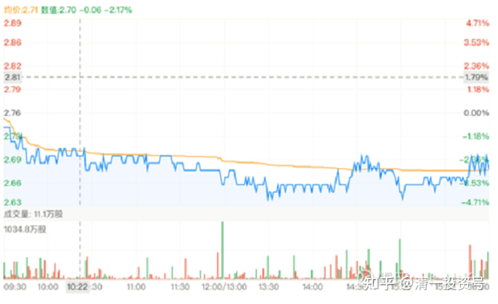

35篇. 评论几个关于中车的观点

清一山长 2020年12月~2021年9月

**1.小散户不要在股市上杀来杀去**

[陈振杰1](http://link.zhihu.com/?target=http%3A//xueqiu.com/n/%25C3%25A9%25C2%2599%25C2%2588%25C3%25A6%25C2%258C%25C2%25AF%25C3%25A6%25C2%259D%25C2%25B01):回复[清一山长](http://link.zhihu.com/?target=http%3A//xueqiu.com/n/%25C3%25A6%25C2%25B8%25C2%2585%25C3%25A4%25C2%25B8%25C2%2580%25C3%25A5%25C2%25B1%25C2%25B1%25C3%25A9%25C2%2595%25C2%25BF):

对拿着零成本的山兄提示风险还领走奖金，啤酒喝多了吧！哈哈[俏皮]

**[清一山长](http://link.zhihu.com/?target=https%3A//xueqiu.com/9310099567)** [2020-12-22 17:19](http://link.zhihu.com/?target=https%3A//xueqiu.com/9310099567/166414276)回复[陈振杰1](http://link.zhihu.com/?target=http%3A//xueqiu.com/n/%25C3%25A9%25C2%2599%25C2%2588%25C3%25A6%25C2%258C%25C2%25AF%25C3%25A6%25C2%259D%25C2%25B01):

别人才不是来提示我的。他才懒得管我怎么玩。他是来提示跟风者，小心风险的。现在跟风酒股，风险已经大于收益。所以我才说他好心！不是因为他提醒我。

对我来说，就是如何兑现收益的问题，兑现多、兑现少的问题。超过10元我不说话，也是怕误导人看我赚钱了来跟风我买。假如我以后11元也敢买珠江，是因为我12元多卖掉了珠江。新赌徒拿钱跟风，赚了算运气，赔了算必然。更别提看到涨停价来跟风的。

从我今天卖出的成交单看，很多是散户的单，不是大户的整单。连我都担心：这些人冲进来，是赚是赔难说。我看了我的珠江卖出单子，有一笔是十万股涨停价卖出的单子，有43个成交是百股的单子。对应应该是资金很少的43个散户。其他千股的单子也有不少，万股以上买入的，才4个单，最高的单17300股。我认为全是小散户。这些人愿意12元多追高，4元的珠江不要。难以理解！**这种人，应该去买2.76元的中国中车睡觉去，干活去，读书去。不应该在股市上杀来杀去的。**

**2.价格下跌，不是要卖的理由，而是要不要买的理由**

**[清一山长](http://link.zhihu.com/?target=https%3A//xueqiu.com/9310099567)** **2020-12-30 23:33**

[$中国中车(01766)$](http://link.zhihu.com/?target=http%3A//xueqiu.com/S/01766) 美国人真能干[点赞]，把中车都打回2008年刚上市价格了！中国高铁，难道白干了这十几年吗？美国人加油喔！虽然我也套牢了，愿意与我的国一起有难同当！[加油]

[晴朗得添](http://link.zhihu.com/?target=http%3A//xueqiu.com/n/%25E6%2599%25B4%25E6%259C%2597%25E5%25BE%2597%25E6%25B7%25BB)回复[清一山长](http://link.zhihu.com/?target=http%3A//xueqiu.com/n/%25E6%25B8%2585%25E4%25B8%2580%25E5%25B1%25B1%25E9%2595%25BF):

心里踏实了，不是因为山长被套，而是也认可它现在便宜了。我被套5年，601766，希望老师有空多分析它。让我等有信心！

[清一山长](http://link.zhihu.com/?target=http%3A//xueqiu.com/n/%25E6%25B8%2585%25E4%25B8%2580%25E5%25B1%25B1%25E9%2595%25BF) 2020-12-31 14:07回复[晴朗得添](http://link.zhihu.com/?target=http%3A//xueqiu.com/n/%25E6%2599%25B4%25E6%259C%2597%25E5%25BE%2597%25E6%25B7%25BB):

别伤心。港股上市2012年以来，所有买入的人全都套牢了。你才套五年，别人持有了2012年的咋想？（您居然2015年买？我2015年是卖出的[吐血]）

不过呢！反过来想：**一家具有世界竞争力的公司，市场给出上市以来的最低价，也不用担心。拿着就是了。如果您高价都看好它，现在低价，应该更加看好才对！也许还会继续跌，价格下跌，肯定不是要不要卖的理由，而是要不要买的理由**。关键：您的理由是什么？

[晴朗得添](http://link.zhihu.com/?target=http%3A//xueqiu.com/n/%25C3%25A6%25C2%2599%25C2%25B4%25C3%25A6%25C2%259C%25C2%2597%25C3%25A5%25C2%25BE%25C2%2597%25C3%25A6%25C2%25B7):回复[清一山长](http://link.zhihu.com/?target=http%3A//xueqiu.com/n/%25C3%25A6%25C2%25B8%25C2%2585%25C3%25A4%25C2%25B8%25C2%2580%25C3%25A5%25C2%25B1%25C2%25B1%25C3%25A9%25C2%2595%25C2%25BF):

谢谢山长的及时回复[握手]。我是将近10元的成本，而且第一重仓（越跌越买导致的，本来17元成本）。我当时稀里糊涂，感觉大国重器名片。这几年通过学习感觉如下几点：1、规模全球第一，超过“阿尔斯通、庞巴迪、川崎重工”，技术能力数一数二；2.、护城河深，且10年内国内企业不可能超过它，因为投资回报周期长，属于重资产行业；3、国内高铁和地铁建设没有进入大规模减少阶段，地铁还在稳步推进。随着点到面的铺开，车辆多，维保费用将稳步提升；4.其他产业逐步扩张，如风能，新能源汽车等。

不足之处：1、下游买家单一，国内占主要销售额，国际市场拓展受国际政治环境影响。2、中国铁路总公司，开始逐步进入维保市场，前期已与中国中车联合成立维保公司，意味着毛利率将逐步下降；3、是好企业，但不是好行业！因为每年大部分利润要用来研发投入，与白酒、广告等行业相去远（研发投入少）；4、高铁建设高速期不再，感觉高铁建设中，不一定有中国铁建和中国中铁收益多，只是卖车辆。疑问：堂堂国之重器，不如茅台酒算了，甚至不如卖酱油（海天酱油）的，情何以堪[流泪]！

**[清一山长](http://link.zhihu.com/?target=https%3A//xueqiu.com/9310099567)** [2020-12-31 15:55](http://link.zhihu.com/?target=https%3A//xueqiu.com/9310099567/167269910) 回复[晴朗得添](http://link.zhihu.com/?target=http%3A//xueqiu.com/n/%25C3%25A6%25C2%2599%25C2%25B4%25C3%25A6%25C2%259C%25C2%2597%25C3%25A5%25C2%25BE%25C2%2597%25C3%25A6%25C2%25B7):

**涨了，什么都是利好；跌了，什么都是利空**。别去跟白酒比，没有可以比的逻辑。只能认自己倒霉，拿了不涨。所以，**我对付这种无奈的方法，是算股息。中车现在股息率6～7%了，港股利息低，这家公司不会垮，所以肯定是划算的。但高价，我就不敢买了。因为看不清**。

要说价值多少，这就看你的价值观了。我敢担保：如果让特朗普拿一万亿可以随便买一家中国的公司，他会买华为，不会要茅台。他会拿一千亿来买下中车，绝对不会拿一千亿来买优惠只要2折就送给他的**“廉价的金龙鱼”**。我也一样，金龙鱼跌掉80%，我都不会买的，除非它的股息率，达到了6%我再考虑[大笑]。

**3.股价随便跌，只求分红别跌**

[全美电视台执行台长](http://link.zhihu.com/?target=http%3A//xueqiu.com/n/%25C3%25A5%25C2%2585%25C2%25A8%25C3%25A7%25C2%25BE%25C2%258E%25C3%25A7%25C2%2594%25C2%25B5%25C3%25A8%25C2%25A7%25C2%2586%25C3%25A5%25C2%258F%25C2%25B0%25C3%25A6%25C2%2589%25C2%25A7%25C3%25A8%25C2%25A1%25C2%258C%25C3%25A5%25C2%258F%25C2%25B0%25C3%25A9%25C2%2595%25C2%25BF):回复[清一山长](http://link.zhihu.com/?target=http%3A//xueqiu.com/n/%25C3%25A6%25C2%25B8%25C2%2585%25C3%25A4%25C2%25B8%25C2%2580%25C3%25A5%25C2%25B1%25C2%25B1%25C3%25A9%25C2%2595%25C2%25BF):

冒昧问一下山长的中车成本价几何？我的在3.09，要求不高，明年7月之前到5块就好。

**[清一山长](http://link.zhihu.com/?target=https%3A//xueqiu.com/9310099567)** [2020-12-31 19:51](http://link.zhihu.com/?target=https%3A//xueqiu.com/9310099567/167297313) 回复[全美电视台执行台长](http://link.zhihu.com/?target=http%3A//xueqiu.com/n/%25C3%25A5%25C2%2585%25C2%25A8%25C3%25A7%25C2%25BE%25C2%258E%25C3%25A7%25C2%2594%25C2%25B5%25C3%25A8%25C2%25A7%25C2%2586%25C3%25A5%25C2%258F%25C2%25B0%25C3%25A6%25C2%2589%25C2%25A7%25C3%25A8%25C2%25A1%25C2%258C%25C3%25A5%25C2%258F%25C2%25B0%25C3%25A9%25C2%2595%25C2%25BF):

您这要求太高了[疑问]。我的要求，就是跌破2元我也认了。唯一想求中车的：就是**股价可以随便跌，分红就别跟跌了**！

**4.风险自负，只分享几乎不会亏的股**

[欲速则不达--](http://link.zhihu.com/?target=http%3A//xueqiu.com/n/%25C3%25A6%25C2%25AC%25C2%25B2%25C3%25A9%25C2%2580%25C2%259F%25C3%25A5%25C2%2588%25C2%2599%25C3%25A4%25C2%25B8%25C2%258D%25C3%25A8%25C2%25BE%25C2%25BE--):回复[清一山长](http://link.zhihu.com/?target=http%3A//xueqiu.com/n/%25C3%25A6%25C2%25B8%25C2%2585%25C3%25A4%25C2%25B8%25C2%2580%25C3%25A5%25C2%25B1%25C2%25B1%25C3%25A9%25C2%2595%25C2%25BF):

山长啥时候建仓新股，记得知会下，亏了后果自负。

[清一山长](http://link.zhihu.com/?target=https%3A//xueqiu.com/9310099567) [2021-09-08 15:14](http://link.zhihu.com/?target=https%3A//xueqiu.com/9310099567/196485070)回复[欲速则不达--](http://link.zhihu.com/?target=http%3A//xueqiu.com/n/%25C3%25A6%25C2%25AC%25C2%25B2%25C3%25A9%25C2%2580%25C2%259F%25C3%25A5%25C2%2588%25C2%2599%25C3%25A4%25C2%25B8%25C2%258D%25C3%25A8%25C2%25BE%25C2%25BE--):

真知道风险自负，就不会找我要标的了[大笑]。

**我只把自己认为非常有把握，几乎不会亏的股，买进时候，才告诉大家。如果判断会亏的，我就自己买，不分享出来。我原来底部，不断分享我买入中国中铁，3.60元前后**，你们买了吗？**跌破3元的中国中车，我一直买，你们买了吗？**现在，涨了不少的，我就不分享了。就算我自己会悄悄买一些涨了的股，我也不说。怕跌了一下就有人骂我。高位，我只分享我的卖出。不分享买进。怕误导人——**你们大多数都亏不起，只赢得起**。我盈亏都可以，都自己负责。

**5.卖出之后上涨的心态**

[你的小野猫](http://link.zhihu.com/?target=http%3A//xueqiu.com/n/%25C3%25A4%25C2%25BD%2520%25C3%25A7%25C2%259A%25C2%2584%25C3%25A5%25C2%25B0%25C2%258F%25C3%25A9%25C2%2587%25C2%258E%25C3%25A7%25C2%258C):回复[清一山长](http://link.zhihu.com/?target=http%3A//xueqiu.com/n/%25C3%25A6%25C2%25B8%25C2%2585%25C3%25A4%25C2%25B8%25C2%2580%25C3%25A5%25C2%25B1%25C2%25B1%25C3%25A9%25C2%2595%25C2%25BF):

拿了一段时间中车，没赚钱就一直拿，昨天涨一点点就跑了，本想等着它下跌再买回来，结果只有含泪看它一路飙升了……啥也不说了，调整好心态把中国建筑拿稳了，别再犯同样的错 [流泪]

**[清一山长](http://link.zhihu.com/?target=https%3A//xueqiu.com/9310099567)** 2021-[01-06 18:06](http://link.zhihu.com/?target=https%3A//xueqiu.com/9310099567/167823957) 回复[你的小野猫](http://link.zhihu.com/?target=http%3A//xueqiu.com/n/%25C3%25A4%25C2%25BD%2520%25C3%25A7%25C2%259A%25C2%2584%25C3%25A5%25C2%25B0%25C2%258F%25C3%25A9%25C2%2587%25C2%258E%25C3%25A7%25C2%258C):

含泪看它一路飙升[疑问]

难道看中车一路下跌，您就会含笑歌舞吗？

这个心态可不好，赚不到钱的[大笑]

**6.投资没有“如果”**

[水滴石穿Kong](http://link.zhihu.com/?target=http%3A//xueqiu.com/n/%25C3%25A6%25C2%25B0%25C2%25B4%25C3%25A6):回复[清一山长](http://link.zhihu.com/?target=http%3A//xueqiu.com/n/%25C3%25A6%25C2%25B8%25C2%2585%25C3%25A4%25C2%25B8%25C2%2580%25C3%25A5%25C2%25B1%25C2%25B1%25C3%25A9%25C2%2595%25C2%25BF):

如果没有港股，A股中车现在的价格山长会买吗（一个买不了港股，但又看好中车的小散弱弱的问）

**[清一山长](http://link.zhihu.com/?target=https%3A//xueqiu.com/9310099567)** 2021-01-06 18:08 回复[水滴石穿Kong](http://link.zhihu.com/?target=http%3A//xueqiu.com/n/%25C3%25A6%25C2%25B0%25C2%25B4%25C3%25A6):

**对于真正的投资人来说，是没有“如果”这个词汇的！**

**7.全面观察历史涨跌**

[部长Q](http://link.zhihu.com/?target=http%3A//xueqiu.com/n/%25C3%25A9%25C2%2583%25C2%25A8%25C3%25A9%25C2%2595%25C2%25BFQ):回复[清一山长](http://link.zhihu.com/?target=http%3A//xueqiu.com/n/%25C3%25A6%25C2%25B8%25C2%2585%25C3%25A4%25C2%25B8%25C2%2580%25C3%25A5%25C2%25B1%25C2%25B1%25C3%25A9%25C2%2595%25C2%25BF):

既然（中车的）护城河那么深，是茅台，也不是刚刚才发现新有的护城河，那为什么这么多年，跌了这么多还一直跌？之前卖的都是傻子吗[大笑]？

**[清一山长](http://link.zhihu.com/?target=https%3A//xueqiu.com/9310099567)** 2021-01-06 17:25 回复[部长Q](http://link.zhihu.com/?target=http%3A//xueqiu.com/n/%25C3%25A9%25C2%2583%25C2%25A8%25C3%25A9%25C2%2595%25C2%25BFQ):

您的脑子，看来也是喝酒都喝坏了[ 大笑]！

**你只看到中车这几年跌，你没看到2015年它怎样疯长的？**

你只看到现在茅台涨，你没看到2012年到2015年，茅台一直跌吗？跌得董宝珍都裸奔了。

都说：**只会看后视镜开车的，是笨人。**你这连后视镜都不看，只会看PPT吗？只会听专家宣讲吗？[俏皮]

（标题为编者所加）

参考链接：

[清一投资号：16篇.中国中车与中国中铁](https://zhuanlan.zhihu.com/p/501574841)（山长新作）

[清一投资号：30篇.投资中国中车的理由（一）](https://zhuanlan.zhihu.com/p/562828027)（整理文）

[清一投资号：31篇.投资中国中车的理由（二）](https://zhuanlan.zhihu.com/p/504483885)（整理文）

[清一投资号：32篇.中国中车：敢于融资持有](https://zhuanlan.zhihu.com/p/508326510)（整理文）

[清一投资号：33篇.关于中车的换股操作](https://zhuanlan.zhihu.com/p/514998133)（整理文）

[清一投资号：34篇.中国中车的技术分析](https://zhuanlan.zhihu.com/p/521835261)（整理文）

[清一投资号：37篇.在美国制裁之前关于中车的操作](https://zhuanlan.zhihu.com/p/527206511)（整理文）

