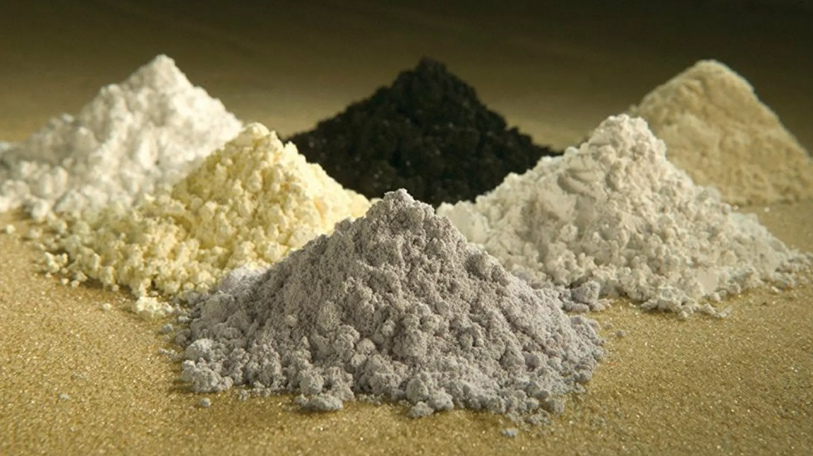

**

**

22篇.未来什么东西最有价值——资源

清一山长 2022年5月29日

**山长 清一**

这篇文章（注：评论文章《“12万亿救市计划”正式落地》，链接已失效）很垃圾，水平低下。什么要大基建、房地产刺激？面对一个人口下行的国家，到处搞基建，盖房子，就是犯罪。50年后，中国人口可能只有现在的一半，6亿多人口。盖这么多房子给谁住？

中国政府救市，怎么救，我不知道。我只是认为：真要投资，就要投到将来有回报的一些东西上去。

过去40年，投资于基建，房地产，对我们国家是有回报的。

未来40年，继续投资下去，就是没有回报的，就是完全的浪费，就是钱往水里丢。**未来什么东西最有价值？不再是外汇，不再是美元，甚至不再是货币，而是资源。**

普京说：如西方解除限制，俄罗斯准备出口粮食和化肥以克服粮食危机。啥意思？就是用手上掌握的资源，来跟掌握了资金和技术的美国和西方世界叫板。

美国可以卡世界的脖子

俄罗斯可以卡世界的肚子

中国也可以卡世界的脊梁——卡金属资源

要打赢未来的世界经济战？中国会怎么做？肯定也一样，要用自己手上的资源。但中国不可能用粮食，化肥倒是有可能。能源也没太大可能，这不是中国的优势，而是中东和俄罗斯的优势。

但**中国最强的，其实是“有色资源”的制造力。**如果中国政府想通了这一点，将来就一定会加大有色金属的储备，把这些金属当做货币的锚定物，中国目前，已经掌控了很多有色金属的资源，这些产品，中国就拉高价格，设定“国家收购保护价格”，尽量地收储、备用几十年的战略物资。

比如钼金属，稀土金属，中国产量世界第一的，就大量收储，拉高供应价格，让中国可以更容易赚外国人的钱。原来出口十吨才能赚的钱，涨价一倍之后，一吨就赚回来了。低价出口换汇，才是最愚蠢的。

还有铝金属，中国也是世界第一的。

钢铁产量，中国也是世界第一的。

我们国家把用来“刺激市场”的资金，投资在对各种金属的收储、保价、保值、增值，还可以让世界通货膨胀更加严重。让老美、老西的日子更难过，让他们的货币失去价值。这样，人民币反而越来越稳定。

而且这些金属，也是战争金属，万一发生战事，大量的钢铁储备，以及铝、钼金属的储备，就是我们的战争资源。对未来世界的经济、军事、政治，均有极其重大的意义。

这就是我认为的国家面对未来要走的道路。如果政府真的傻到把钱用来盖一大堆将来没有人住的房子，没有车跑的高速公路，以及没有使用的场馆，对未来的经济无法变现，全部沉淀在这些无效资产上，我认为可能就完了。我们XXXX应该没有傻到这份上。

我们不仅仅自己刺激收储，还要把存在M国的M元拿出来，全世界买这些物质，这才是真正的“硬通货”。纸币算什么？一个命令就可以让你的纸币归零。所以**中国直接拥有战略物资，不要纸币，才是最聪明的做法。**我的判断正确和错误？你们等几年再看吧！

转：【有色金属方面，美联储加息将会拖累经济、抑制需求，从需求端拖累有色金属，对有色金属形成利空影响。然而，能源危机和供应链危机等因素继续影响有色金属供给端，供给趋紧的现状未发生实质性转变，对有色金属形成有效支撑】。

———什么才是资源，这句话说得很明白了。

（注：该段转发文字相关文章及链接《美联储“前紧后松”政策逐步明朗》

[https://www.hongtaqh.com/research/new/detail?detailId=f820fab5a43a47c8a45e9477b3131bf4](http://link.zhihu.com/?target=https%3A//www.hongtaqh.com/research/new/detail%3FdetailId%3Df820fab5a43a47c8a45e9477b3131bf4)

***伟**2022/5/291 3:03:24

这波货币宽松，基本确定不会从银行的口子放水，也不会流向房地产。

我知道的是从三峡集团这样的央企放水，承担给地方政府融资及建设新能源基础设施，以此拉动GDP，同时完成国家能源战略。对于已经揭不开锅的地方政府，只要出地方就行了，以电费和未来的发电收入作为分期偿还款。

光伏发电、蓄水储能、沼气发电、风电、电转氢等。

山长 清一2022/5/29 13:06:19

@*伟 [很赞]新能源、新基建，是可以投的。未来是有回报的。但这些东西，都需要很大的金属资源。比如太阳能、风电，跟钢、铝的关系就很大。

英国《每日电讯报》报道，欧洲实际上依赖中国各种战略原材料的出口，否则无法开发先进技术。

该报指出：据国际原子能机构的数据，中国控制着世界上近一半锂的提炼产能，并生产全部锂离子电池的四分之三。中国控制着开发新技术所需的三种稀土元素储量，这些稀土元素不仅生态和人工智能领域需要，而且也是制造军事激光器、导弹和卫星所必需的。北京近乎控制着世界上钴和石墨的供应。中国生产超过98%的永久磁体，而永久磁体的生产则需要钕。

（注：该内容相关文章《英媒：欧洲依赖中国的战略原材料出口》链接

[https://sputniknews.cn/20220525/1041580257.html](http://link.zhihu.com/?target=https%3A//sputniknews.cn/20220525/1041580257.html)）

