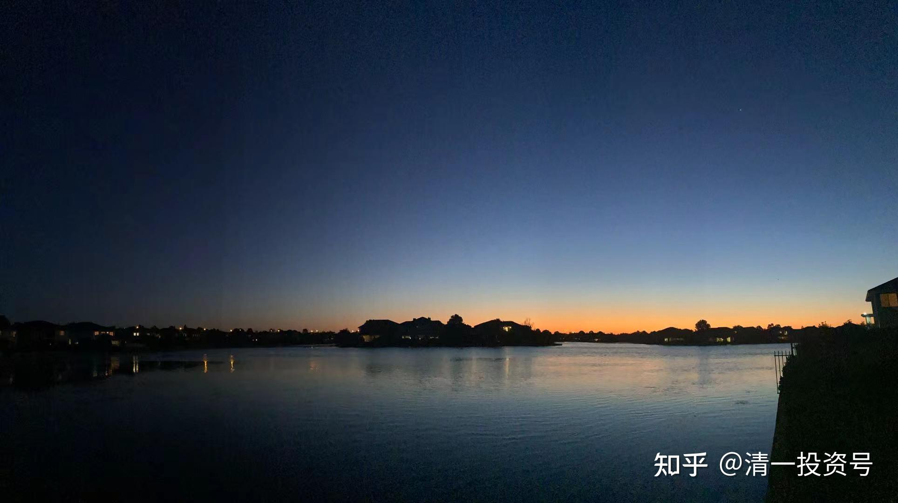

26篇.解答大家对真太极的误解

清一山长 2021年7月12日

清一山长雪球非专栏帖子整理文章，第29篇《解答大家对真太极的误解》

此文整理自山长专栏文章《清一太极实战与现代职业拳击的第一次碰撞！》的评论跟帖[https://xueqiu.com/9310099567/190206246](http://link.zhihu.com/?target=https%3A//xueqiu.com/9310099567/190206246)

[20210705明骐老师对战拳击手01知乎视频](https://video.zhihu.com/video/1398044975184011264)

[20210705明骐老师对战拳击手01_哔哩哔哩_bilibili](http://link.zhihu.com/?target=https%3A//www.bilibili.com/video/BV1JQ4y1B731)

//[@复利一生小伍哥](http://link.zhihu.com/?target=http%3A//xueqiu.com/n/%25E5%25A4%258D%25E5%2588%25A9%25E4%25B8%2580%25E7%2594%259F%25E5%25B0%258F%25E4%25BC%258D%25E5%2593%25A5):回复[@清一山长](http://link.zhihu.com/?target=http%3A//xueqiu.com/n/%25E6%25B8%2585%25E4%25B8%2580%25E5%25B1%25B1%25E9%2595%25BF):

白衣服是明骐吧？两者没有出现激烈对抗，打得比较文雅，重拳和抗击打能力都没体现出来。如果考虑这两点，我觉得传统武术可能还是要吃点亏的。

**[清一山长](http://link.zhihu.com/?target=https%3A//xueqiu.com/9310099567)**[2021-07-12 23:59](http://link.zhihu.com/?target=https%3A//xueqiu.com/9310099567/190207803)回复[@复利一生小伍哥](http://link.zhihu.com/?target=http%3A//xueqiu.com/n/%25E5%25A4%258D%25E5%2588%25A9%25E4%25B8%2580%25E7%2594%259F%25E5%25B0%258F%25E4%25BC%258D%25E5%2593%25A5):

你在说笑话了。你怎么知道传统太极不会发力？不会发力怎么实现“犯者立扑，一击必杀”的实战力？告你吧，**比现代格斗能够发出的拳力重多了**。一旦发出，直接就可以KO对手。

//[@森林怪兽](http://link.zhihu.com/?target=http%3A//xueqiu.com/n/%25E6%25A3%25AE%25E6%259E%2597%25E6%2580%25AA%25E5%2585%25BD):回复[@清一山长](http://link.zhihu.com/?target=http%3A//xueqiu.com/n/%25E6%25B8%2585%25E4%25B8%2580%25E5%25B1%25B1%25E9%2595%25BF):

这个打法破坏对手平衡，黑衣拳手下蹲闪躲没有重拳侧打肋骨。白衣的步伐比黑衣的好。这种打法对泰拳散打的扫踢膝盖重击就吃亏了。

**[清一山长](http://link.zhihu.com/?target=https%3A//xueqiu.com/9310099567)**[2021-07-13 09:00](http://link.zhihu.com/?target=https%3A//xueqiu.com/9310099567/190222147)回复[@森林怪兽](http://link.zhihu.com/?target=http%3A//xueqiu.com/n/%25E6%25A3%25AE%25E6%259E%2597%25E6%2580%25AA%25E5%2585%25BD):

**您知道真太极最强的是啥？肘击术。**

**太极是身拳**，**肘击技术，以身运肘，**比泰拳的转身扭胯用肘，高了一个层次。快得多，也重得多。还有**真太极的腿击、膝盖击打技术，特别快重，而且是在手的配合上进行的**。您以为就泰拳会这些？对付泰拳，我们就用泰拳规则。一年后，您会看到我的拳手与泰拳手的格斗的。别迷信泰拳。

你只会用招数来看拳，这个是看电影看出来的毛病，这是不懂拳。泰拳真正的实力，是硬度，不是啥招数。招式上来看泰拳，泰拳其实很笨的。但泰拳最强的是硬度，以及超强的抗击打能力，别人几岁就开始狂练，不到十岁的孩子就上台打比赛，抗击打能力世界一流。你打不垮他，他就打垮你。我看到的是：一个侧扫鞭腿，可以把钢管击弯，这种硬度和速度，一般人哪里是对手。所以，技术再强，但没有练习硬度，没有抗击打能力的传统武术，真不是别人泰拳的对手。

一龙跟泰拳手播求打，都要事先商量，不准KO他，不然就不给出场费。所以一龙的技术可以发挥一些。真放开打，一龙早被KO了。这场假打之后判播求负，泰拳手都不服气，后来播求的师兄弟出来挑战一龙，一龙就被KO了。这才是泰拳的厉害之处。

不过看起来，**柔软的太极正好克制泰拳的刚强。**但必须练出柔中最大的刚。所以，清一太极要打泰拳，还需要打完拳击手之后，再用一两年时间来强化对付泰拳的技术。练好基本功，学会挨打（拳击的直拳、刺拳，其实没啥力道，伤不了人。摆拳厉害，但太慢，容易防住和躲过）。泰拳的腿击，太狠！往往一击就KO。

//[@价值投资渣渣辉](http://link.zhihu.com/?target=http%3A//xueqiu.com/n/%25E4%25BB%25B7%25E5%2580%25BC%25E6%258A%2595%25E8%25B5%2584%25E6%25B8%25A3%25E6%25B8%25A3%25E8%25BE%2589):回复[@清一山长](http://link.zhihu.com/?target=http%3A//xueqiu.com/n/%25E6%25B8%2585%25E4%25B8%2580%25E5%25B1%25B1%25E9%2595%25BF):

山长有做太极教学视频吗？想跟着学习学习。

**[清一山长](http://link.zhihu.com/?target=https%3A//xueqiu.com/9310099567)**[2021-07-13 09:05](http://link.zhihu.com/?target=https%3A//xueqiu.com/9310099567/190222588)回复[@价值投资渣渣辉](http://link.zhihu.com/?target=http%3A//xueqiu.com/n/%25E4%25BB%25B7%25E5%2580%25BC%25E6%258A%2595%25E8%25B5%2584%25E6%25B8%25A3%25E6%25B8%25A3%25E8%25BE%2589):

想看视频比动作就学会太极吗？您就是闹笑话了。

**真太极是“无招”的，外形上可以与任何拳派相似。只是用劲的方式不一样。**这是看视频是学不会的。

**[清一山长](http://link.zhihu.com/?target=https%3A//xueqiu.com/9310099567)**[2021-07-13 16:22](http://link.zhihu.com/?target=https%3A//xueqiu.com/9310099567/190292961)

我很惊讶地发现。绰号嘴炮的UFC最强格斗手，居然在练习蜥蜴爬？这是我让武道馆的学员必须练习的一个基本功，让他们练**“地上的太极野马分鬃”**。腾讯视频网页链接：

[https://v.qq.com/x/page/c05158pwhh5.html](http://link.zhihu.com/?target=https%3A//v.qq.com/x/page/c05158pwhh5.html)

当然练法跟他不一样，但目标是一样的，练身体的支撑力。

我还发现他的老师是形意、太极、八卦的练习者。他跟这老师学习受益良多。

“他不止一次的在博客中讲述，中国武术的移动方式是最完美的，可以爆发出人体最协调的力量。而他恰巧也是UFC嘴炮的移动、步伐教练。将中国形意拳的武学精髓，教授给麦克勒戈，在世界最高竞技舞台上展现，他可以说是目前来说传武擂台的最高手了。”

我猜想，将来清一太极打出来了，别人会不会说是跟嘴炮学的招。

**中国人，总是自己的东西不好好学，只拿来骗人。**外国人倒是认真学了，去用了。**我无非是用外国人的思维方式来训练太极拳手，就轻松击败了职业拳击手。**虽然离冠军尚有距离（男选手大约还要三年时间才有机会）。但已经实现了零的突破（如果你们翻阅原来我的发言，徐冬瓜大闹传武的时候，两三年前，我公开说过，看不得中国武术被人这样侮辱。说真太极不是雷雷这样的，等两年我带弟子出来，你们看视频。当时很多人出来黑我，骂我骗子。今天这些人在何处？

难道外国人学了，我们才去追捧外国人吗？真没出息！我为中国武术界上千万人，这些拿着国家钱粮却不干活，或者在民间到处骗人的民间武师们，这些丢人现眼的**“中华武术代表”**感到羞耻：你们真的是丢祖宗的脸。白吃饭不干活的一群混蛋！

//[@国学中医黎天焕](http://link.zhihu.com/?target=http%3A//xueqiu.com/n/%25E5%259B%25BD%25E5%25AD%25A6%25E4%25B8%25AD%25E5%258C%25BB%25E9%25BB%258E%25E5%25A4%25A9%25E7%2584%2595):回复[@清一山长](http://link.zhihu.com/?target=http%3A//xueqiu.com/n/%25E6%25B8%2585%25E4%25B8%2580%25E5%25B1%25B1%25E9%2595%25BF):

终于见到真功夫了，我反复看了6次太极与拳击手以及2次职业拳击手的对抗。第二场是完全相同的技术在场上拼体力和反应能力，躲闪技术也是很典型的职业拳击手风格，说明拳馆的实力和水平是很强的。

我对第一场的对抗看到几点情况：

1.双方开始都很紧张，但白衣拳手很快调整过来，慢慢掌握节奏，而黑衣者未能发挥自己的技术，越到后面越被动。

2.白衣拳手进退都能自如，看步法明显比职业拳击或其它现代格斗更灵活，看赛事第一次见到直插中线的进攻，如果是真搏斗，黑衣拳手应在开场之后不久的一个对抗时被插入中线的进攻中倒下。

3.能看到白衣拳手进攻途中可改变方向，出拳方式上发力伸手时没有像职业拳击的直拳完全伸尽，没有多余的左右晃动身体。

4.黑衣职业拳手消耗体力很大，所有的进攻在刚出手时即被截住，所以不停的在改变进攻意图，越到后面越被压制，所以普通人看到会认为是初学者，其实能不断改变战术的拳手就是有沙场经验的，只不过他的所有意图都被对手识破。

5.能看到太极拳手发力速度很快，动作很小，但有些出手的力量来自腰以下，所以一旦全力击中，对手会受伤，明显在后半段时间白衣拳手是没有尽全力。

谢谢山长！

**[清一山长](http://link.zhihu.com/?target=https%3A//xueqiu.com/9310099567)**[2021-07-13 17:05](http://link.zhihu.com/?target=https%3A//xueqiu.com/9310099567/190298190)回复[@国学中医黎天焕](http://link.zhihu.com/?target=http%3A//xueqiu.com/n/%25E5%259B%25BD%25E5%25AD%25A6%25E4%25B8%25AD%25E5%258C%25BB%25E9%25BB%258E%25E5%25A4%25A9%25E7%2584%2595):

你看的蛮细致的。刚开始，的确明骐很紧张。但对手刚开始并不紧张（因为他们是老拳手，不是新来的）。只是他越来越焦躁，因为他实在不适应这种奇怪的打法，老莫名其妙的挨打，还手都不知道怎么还。后来打急了，有几个拼命出手重击的摆拳，还导致自己失去了重心。明显有点生气！可还是没有打上。

“如果是真搏斗，黑衣拳手应在开场之后不久的一个对抗时被插入中线的进攻中倒下。”

全力相博，就是这种局面。这是后手拳的重击技术，是孩子们正在重点强化练习的攻击方式。女生也正在练。我要求她们练成后手重击技术后，才能出去跟专业拳手实战。女生大约三个月后会出山。

现在你看到的，只是练习赛，犯不着出狠手。我们的拳手只是点到为止，不许他们KO人。明琪在我们馆内练习对抗的时候，两次有不小心把对手击晕的历史。外面看起来只是轻轻一击。所以，我才让他外出，去面对职业选手的。有这种实力才能出山。

**[明心z7q](http://link.zhihu.com/?target=https%3A//xueqiu.com/3217767145)**[2021-07-12 12:45](http://link.zhihu.com/?target=https%3A//xueqiu.com/3217767145/190132643)[@清一山长\[¥200.00\]](http://link.zhihu.com/?target=http%3A//xueqiu.com/n/%25E6%25B8%2585%25E4%25B8%2580%25E5%25B1%25B1%25E9%2595%25BF%3Fpaid_mention%3D1)

山长好，请教两个问题。

1.关于武术

您的武术老师是否还招收学员？如果招收，学费多少？如何联系报名？是否有学员要求？我在北京，41岁女想学，儿子17岁想学(考武道馆难)，都无基础。

2.关于音乐

听音乐耳机很重要，可否推荐品牌，普通家庭几千元可接受。

明年准备买一套音响，可否推荐品牌，5万～8万资金。

**[清一山长](http://link.zhihu.com/?target=https%3A//xueqiu.com/9310099567)**[2021-07-12 15:30](http://link.zhihu.com/?target=https%3A//xueqiu.com/9310099567/190158207)

**一：清一武道馆，只招收想当冠军的人**

用职业队员方式培养，不收学费，生活费我供养，没有回报的条件。全职练武。但如果表现偷懒、不职业，或者技术学不会，出不来成绩，就劝退。

**清一武道馆不要学费**，**入职条件**是什么？**是年龄15岁，能够考上清一大学的人，SAT1400分**。因为清一武道馆是唯一一家要求文武双全的武馆，所以，要文合格了，才能进来学武。所以，**我们未来的太极冠军，显然是有文化的冠军，也只有这种人，才能学会真太极。太极号称“哲拳”，只会用肌肉思考的人，是学不会的。**

您41岁，我们不认为您有当冠军的身体条件。您花钱也进不来的。您儿子如果想考，已经超龄了，但条件好，真心想当冠军，也许也能入职。比如，如果您儿子18岁以前，能够拿到SAT1400分以上成绩，可以找我特批入武馆免费训练。

**二：关于耳机**

我自己喜欢的牌子是德国的拜亚动力，我有几种型号，T1是我用的最好的型号。其他的2～3千元就很好了，相对价格并不高，T1也不超过万元。很多品种，音质很纯正，喜欢什么新型号就自己买。K701就已经很不错了。刚开始入手，建议选低阻抗耳机，不需要使用耳机放大器。高等级玩家，再玩高阻耳机。

另外，更多人喜欢森海塞尔（Sennheiser），也是德国的品牌，价格大致上也是两千元左右就可以买到好耳机了。

顺便点评一下你的信息收集能力：虽然我是早期的发烧友，这些东西都玩过。你没玩过，并不意味着你不知道如何选择。只要你百度输入“世界著名耳机品牌”，这些信息都会跳出来。您就不需要为找耳机去打赏了。

至于音响：国内可以用珠海的惠威音响，价格高的，当然音质就好一点，虽然不一定越贵越好。国外的，现在很多好的品牌都消失了。普通消费级的音响，美国的哈曼卡顿是我原来喜欢的品牌。现在就不知道用什么了，改变太多了，比耳机的变化大。很多国外品牌这20年下来，都被中国的厂商干掉了，甚至品牌都被中国人买下来了。大家千万别买杂牌，我见过一个老板，买了一个20万的杂牌，还不如我用一万元配出来的音响好。

/[@明心z7q](http://link.zhihu.com/?target=http%3A//xueqiu.com/n/%25E6%2598%258E%25E5%25BF%2583z7q):回复[@清一山长](http://link.zhihu.com/?target=http%3A//xueqiu.com/n/%25E6%25B8%2585%25E4%25B8%2580%25E5%25B1%25B1%25E9%2595%25BF):

感谢山长的回答，我肯定是不行了，我只想获得健康的同时提高思维能力。我儿子不爱学习，也考不了1400分。但是我俩都特别想学武术，今天读您的文章里（可能有点久远了）看到您说您师傅也在教学所以我才问您，您的师傅能不能联系的上，或者推荐几个老师。我儿子目标是道，想从武进入，不想走偏。

**[清一山长](http://link.zhihu.com/?target=https%3A//xueqiu.com/9310099567)**[2021-07-12 17:13](http://link.zhihu.com/?target=https%3A//xueqiu.com/9310099567/190171524)回复[@明心z7q](http://link.zhihu.com/?target=http%3A//xueqiu.com/n/%25E6%2598%258E%25E5%25BF%2583z7q):

别瞎说【我师父也在教学】。

如果说是我认识，交流过的武林师傅倒是很多人。但**我真正的师父，是老子、庄子、张三丰，还有本派的历代祖师高手们，传人们**。不是你认为的某个出来摆摊卖艺混饭吃的什么教拳的师傅。

本派门规

【**不许看家护院**】（当保镖）

【**不许跑江湖卖艺**】（教拳为生）

就明白告诉你了：**凡是出来收学费练武术、练太极、瞎混江湖的人，都是忽悠你的人，不是真正的太极传人。**所以你别找我推荐人教拳。你以为拿一点钱，就能换真功夫？弘扬中华武术？中国的传统武术，就是被你们这种想法的人毁掉的，跑马卖艺，都变成了马保国一流的江湖混混、骗子。还说得多高大上的，假装以武入道。

**真功夫，是要用真心来换的。**你儿子不爱读书，我劝你让儿子去学个真手艺，好好干活，养活自己是正路。跑出来学什么道？还入什么道？先入人道吧！别先骗自己，以后再来骗别人吗？不会读书，不想读书，就去学做事，学做人去。别去找骗子，也别去当骗子！你顶着天大的**“道”**字，依然还是自欺欺人！

**[清一山长](http://link.zhihu.com/?target=https%3A//xueqiu.com/9310099567)**[2021-07-12 17:28](http://link.zhihu.com/?target=https%3A//xueqiu.com/9310099567/190173415)回复[@明心z7q](http://link.zhihu.com/?target=http%3A//xueqiu.com/n/%25E6%2598%258E%25E5%25BF%2583z7q):

想靠学武术来谋生的人，我劝你们还是另选其他道路，不要自误误人。

**首先，学武术的核心逻辑，就是学真武术，根本就不赚钱。**我知道的几个世界冠军，也只是教拳为生。也拿不到多少收入，勉强能过日子罢了。一些拿过洲际冠军的人，也只能跑外卖。因此，真武术、真格斗界，是不赚钱的。你们看到的梅威瑟这种赚几个亿的人，是少数。泰国的世界冠军，也开个小店度日呢！

在中国，其实是**玩假武术的号称传武的人，才最赚钱。混得好的，百万、千万的赚钱**。陈家沟的人最会赚钱。但据说，被徐冬瓜打得没脸，现在也不赚钱了。没人去学这些假武术了。

**清一武道馆，来学习的人全是学霸级的人物**。学会了是文武双全的冠军，拿到冠军的，也是强身健体有余。将来这些人外出当个教练、教师，甚至去企业当管理者，是完全没问题的，传武、现代格斗啥都能玩。他们还要学管理学、心理学、哲学等等课程。

我的**武道馆，是正经的国学院**。不是培养张飞、李逵这样的打手的地方。因为这些人的起点本来就很高。这些人，跟外面拳馆那些找不到正经工作的人不一样。他们才敢说来学“以武入道”。你们连书都不会读的人，别去吹什么以武入道。这叫笑话，忽悠人。

真心想学武，你们北京的，可以去MMA拳馆学习。至于同伴的档次，肯定是下层的阶级，不可能是上层的子弟。思维、价值观都是下层的模式，谈不上什么文化，什么道的。看冬瓜说话就知道了，但他真心爱武，是条汉子！精明、会算计，也有功夫！真功夫。想去就去。他的地盘，不要你会读书，只要会交钱就能训练。

//[@明心z7q](http://link.zhihu.com/?target=http%3A//xueqiu.com/n/%25E6%2598%258E%25E5%25BF%2583z7q):回复[@清一山长](http://link.zhihu.com/?target=http%3A//xueqiu.com/n/%25E6%25B8%2585%25E4%25B8%2580%25E5%25B1%25B1%25E9%2595%25BF):

山长，我很尊敬您，我问的问题很简单，您的回答联想力好像有点儿丰富。

1.我儿子绝对不会靠武术来谋生，他现在的学校毕业实习生就可以拿到1.5万的工资，一年二三十万生存是没问题的，但是他不想走挣钱的路。

2.我们虽然是普通家庭，思维层次没有那么高，我生存要求比较低，现在40岁了可以做我想做的事儿，不需要挣太多的钱。我知道财富带不走，只能带走智慧，所以我想要的就是智慧。

3.想要获得智慧，就得跟高人学习，跟经典学习，练武是学习的好方式之一，但是我们怕别的老师教不好，所以才请教您。

4.今天看到了您写的文章燃起了一丝希望(见照片)，普通人也可以像高手学习，名师才能出高徒，所以才给您发了问题。

**[清一山长](http://link.zhihu.com/?target=https%3A//xueqiu.com/9310099567)**[2012-07-12 21:03](http://link.zhihu.com/?target=https%3A//xueqiu.com/9310099567/190192993)回复[@明心z7q](http://link.zhihu.com/?target=http%3A//xueqiu.com/n/%25E6%2598%258E%25E5%25BF%2583z7q):

看来语言的确容易引起误会。你们喜欢武，不想靠武术为生，这就好！就怕你们栽到中国武术这大大的坑中出不来。就祝福你们能找到你们心中的道吧！不多说了。

至于说武术师傅，已经给你说过了：我一生接触过的武术师傅很多，礼貌上，对这些师傅都很可以称为师傅，就像是见谁都可以叫老师。但真正的师父，是本门师父，我唯一拜过师的一位老人，是从来不出来教拳的，终身务农为生。我在武术上，得益最多的一个师傅，跟我是兄弟相称，他连一个学会他武功的真徒弟都没有，也不以教拳为生。有正当的职业——林艺师。

个人以为：真懂传统武术的人，中国现在还剩下几个不多的人。但真懂中华武道的人，中国武术界应该没有了。如果真有的话，这几十年，也早就培养出能够拿格斗冠军的太极实战选手了，也不会被徐某东怼得如此狼狈了。更犯不着我半路出山，来玩啥武道馆。

当然，我的最终结果如何，尚不知道，还等一两年再看结果。因为我的弟子刚刚出山，两周前，他才第一次跟职业拳手对战了一场。目前看结果是完胜，对手完全无法适应我们的打法。但由于还没有遇到顶尖高手，现在还不能说啥的。过几天，我把视频发上来，你们看看玩。女拳手现在没找到合适的职业拳手对战，再等半年看看情况。

一句话：**真武，比真文更难。**培养一个传统武术的冠军，培养一个太极格斗的冠军，要比考上常春藤的名校，更难很多倍。从民国时代开始，传武就已经失落，中国就没有这种人才了。百年来的中国武术历史上，我还没有看过真正的传武能够对抗现代格斗的记录，只在电影上看过。

奉劝各位别把武术当职业，当做一种爱好就好。至于入道——中国的武术界，哪有道？我都不知道。你们爱咋求道，就自己去找吧！

参考链接：

[山长 清一：实战太极与现代格斗之谜1：发力技术！](https://zhuanlan.zhihu.com/p/362455647)（专栏文）

[清一武道馆：传武杀人技？太极不出门？](https://zhuanlan.zhihu.com/p/354643954)（专栏文）

[清一武道馆：真被“武术界，国术界”给恶心到了！](https://zhuanlan.zhihu.com/p/357918131)（专栏文）

[清一武道馆：实战太极与传武高级黑！是实话，可真相是这样吗？](https://zhuanlan.zhihu.com/p/355026610)（专栏文）

[清一投资号：第18篇.武道论之六：武功无秘密唯有苦练](https://zhuanlan.zhihu.com/p/522789501)（整理文）

[138篇 实战太极与现代格斗之谜1：发力技术!](http://link.zhihu.com/?target=https%3A//www.ximalaya.com/sound/488865125)（音频）

[哔哩哔哩：实战太极与现代格斗之谜1：发力技术!](http://link.zhihu.com/?target=https%3A//www.bilibili.com/audio/au2820089)（音频）