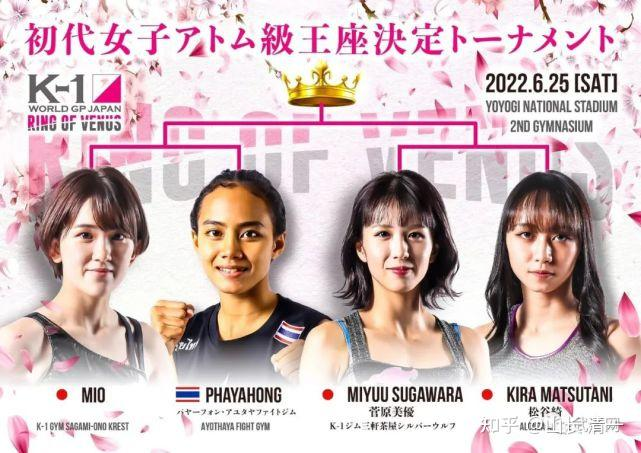

现在，太极“迎门三脚”的功夫，小木兰们已经可以使用出来了，已经可以用这一招鲜，轻松KO泰拳手了。目前重点强化的功夫，就是拳法。你们已经看到上次拳馆练习的时候，小木兰们主要是用拳法来进行的攻防训练。

所谓的现代格斗拳法，基本就是直拳，勾拳，摆拳的各种组合应用。泰拳手腿上很强，但拳的技术相对简单粗燥。因此，为了强化上肢的攻防能力，往往泰拳手也用加练拳击来强化。的确，以拳为唯一攻击手段的拳击运动，可以说基本上已经完善了“手上功夫”，成为绝大多数想要完善手上功夫的格斗手们都必须了解和学习的技术。

不过：对于太极格斗手来说，拳击只是我们需要对付的一个对手，但不是我们学习的对象。太极拳法，与拳击的拳法有很大的差异。这一点，连泰拳馆的拳手都看出来了。认为小木兰的出拳，不像是直拳，也不像勾拳摆拳，总觉得动作有点怪怪的，似似而非得到样子。他们认为---可能是我们的小木兰练拳没练好，没找到老师，乱打的。但奇怪是打出来的力量还蛮大，他们难以对付。因此，泰拳手们总结出来的结论是：两个木兰力气大，乱打也有力。（因为他们如果模仿木兰的动作，就是无法发力的）。

其实，太极出拳，与现代格斗的重大区别，就是只有“圈手拳”，没有“直线拳”的。看上去，虽然很像是直拳的太极拳，其实仔细观察，是有弧线的。往往是“太极摔掌”---外摆圈拳。这种拳的动作，其实是大家很熟悉的“云手”的动作，在实战中用出来的样子。只是实战中，变得很快速，比较小动作的出击，走的也像是直线，看起来很像直拳，但发劲的方式完全不一样。而且---一旦真的练好了，攻击的速度比直拳快。而且是看不见出拳轨迹的。我跟小木兰们示范这种拳的攻击方式的时候，让她们摆好防守势，接我的外圈摔掌拳，要等我打到头面部，收回手的时候，才会有防守动作。真的比直拳快。

这种拳发的劲，也和直拳用腰部扭转发力不一样。太极拳叫“开劲”。这种拳，自然就是“开劲拳”了。可能有点像刺拳的样子。

有“开劲拳”，当然有“合劲拳”。或者叫做内圈手拳。出拳的方向和路径，与开劲拳完全相反。这个拳的劲路，就是太极招式中的“倒卷竑”。这一招和云手是姐妹阴阳招。你可以理解为----是反着转的云手就行了。有些太极门派叫“倒撵猴”，不知道为啥要倒追猴子。很多太极门人以为是一个防守格挡的动作，你这样想就完全不懂格斗了：现代格斗，等你看清对方招式，然后去格挡？你根本反应不过来的。这是练合劲的方式。这种方式，如果用来出拳，有点像形意的“钻拳”。

太极练拳的时候，慢悠悠的样子。并不是要求实战就这样打。其实是用这种看上去慢悠悠的动作，去找到身上的卡点，并改掉卡点。最终要用全身最和谐轻松的动作，走出太极的“劲路”，然后就算用最快的速度出手，也要把这个“劲路”走完。所以，太极打人，不是一下子，而是一个连棉的过程。对于中招者来说，是有点迷糊：好像一个浪潮一样的打来，也就是古书说的“一片打去，不回手”。而外家拳，是“一条线打去，收回来”。因此是有明显差别的。

另外，与现代格斗的“直勾摆”，都是用拳面打人不同。太极格斗的出手的攻击面，是整个的手臂，一起都打上的。打拳击，我们不得不改变这种设定，不然就犯规了。但打泰拳，就不用担心犯规：可以用手臂的四面，用于打击对手的头面部和对方的肢体。将来你会看到对手被我们的木兰用手臂打头打开花的镜头的，由于手臂上没有拳套来保护和缓冲，对手一旦被手臂骨直接的打上头面部，会很容易被打伤流血的。所以，一般人其实很怕这种打击。只是现代格斗技术中，没有这种打击方式的训练。但这种格斗方式，在近战中是非常有效的。

如果你理解了这一点，就知道太极为啥出手是弧形而不是直线了？只有弧形的整片攻击，这样才有最大的攻击面，也有最大的防守效果。现代格斗是没有这种打法的。当然，古人们为了练出这种打法，也有相应的练功手段---就是手臂要练“排打功”，要提高手臂的硬度，要像铁棍一样强，才能使用这种“横扫拳法”。不然你去打别人的脑袋，说不定造成手骨骨折的。

其实这种圈拳，也不是横着的拳法，而是用身体带着向前方，向侧方都有击打力量的拳法。而且“力不过中”，超出自己的中线，劲就收掉，换劲反过来再打。开劲拳就变合劲拳。因此不会出现像外家拳的“大摆拳”一样。击空后容易失衡的场面。

更高级的太极拳，一拳出去，要出“六面劲”，不同的六个方向，都要求有“劲”。真练出这种拳，就算是高手都没法接了，只能挨打。但练出来“六面劲”极难。这种劲，就是古传的所谓“浑圆劲”。据马保国说：他就练出来了。当然，上场去看实战，他连太极最基本的“两面劲”都没有，甚至连外家拳的“一条线劲”都没有，只知道这种劲厉害，就拿出来吹，结果把好东西，闹成了大笑话。 就像现代人，把古人好好的大户人家的“小姐”，生生就变成了“妓女”的代称。实在是世道的堕落吧。

太极拳，在练拳的时候，要求是“一击两响”：出拳就是一阴一阳，一内一外。一合一开的两拳，不断的螺旋循环发力。木兰们每天的拳靶练习，听到的声音就是拍拍两下，加上“哼哈”的发劲的声音。我相信：这样练出来的太极拳，会让泰拳手们吃大亏的。根本就接不住，也挡不住。特别是进入内围之后，很可能遭遇我们的手臂直击头面。造成巨大损伤，也许以后泰拳为因为要限制我们的技术，更改规则，不许用手臂来打击了。但目前推崇肘法的泰拳，不可能限制这种打法。可惜是：泰国人没有把肘法的精粹真正掌握。 这种用整个手臂来打拳的格斗技术，就是天然的“肘拳”，甚至全身都是拳。处处都可以打人。这就是太极拳最可怕的地方：无处不发人，无处不打人。当然，要练出这种高级的功夫，就必须先要练出整身劲，还有浑圆力，外加全身柔软放松。就算没有六面力，先练出两面劲来。目前，木兰们只是在练“两面劲”而已，离太极的六面劲合力，还早呢。很多人练了一辈子太极，都不知道“六面劲”是啥。甚至太极的两面劲（阴阳开合劲），都很少有人练出来。当然这世界上，就没有真太极实战了。所谓的太极不能打，是后人不争气，把老祖宗的东西丢了。小木兰们只要练出“两面劲”，算是“太极入门”，就可以轻松地把现代格斗收拾了，谁还敢说太极不能打？试试就知道了。

太极拳最实用的功夫，招式，其实是“野马分鬃”。也就是“不断向前移动的云手”。要求出一掌，脚步变三次重心。左右手分别轮换着出击，威力十足。如果练出来的人，用此手法进行攻击的话，是“挡者立飞”的。至少全力来接，也会倒退几步。出招如果没有这个功力，就别说自己练的是太极的“野马分鬃”。很多太极大师，练此招的样子，哪里有“野马”的样子？只要见招势头一出，就知道怎么也挡不住的，必须跑路，这才是“野马”呀？一旦太极的“野马分鬃”打来了，只有躲开，谁敢接？这才是实战太极拳的威风。

目前，小木兰们每天都在练这些“太极手上功夫”，加上“太极连环肘”。大约两个月后，应该就可以熟练使用了。希望到时候，能够跟世界冠军有一战的机会。最近发生了一个怪事：4月份的金腰带，当时靠裁判胜了。我们都不服气，要求泰方来一个二番战，我愿意加倍赌拳。对方馆长父亲倒是答应了，但没几天，就告诉我们取消了约战。找理由说她刚比赛玩，需要调整身体，还不能打。现在，我们的泰国联络人突然表示：对方来信息了，主动问我们是否愿意打二番战？我们当然愿意了，马上就毫不犹豫的答应了。但对方提出要求，要9月份才能跟我们打比赛。我很奇怪：为啥过了两个月，才提出二番战？为啥要提前三个月约战？想半天，才明白了：她应该是通过不断研究实战视频，自以为找到了我方的弱点，才敢约战的。但由于她的技术需要针对性的训练来补强，才能来打。所以需要三个月的专项训练备战。所以要去找专门的教师和团队，针对性地训练和提高自己的技术。这个拳手是泰国东部的人，最优秀的泰拳手，包括播求，都来自于这个地方。据说东部的拳手技术比较全面，很善于用肘，实力超群。这个拳手，肯定也看出上次实战中，我方内围战没有啥杀招，没有用肘技术，因此应该是我们的弱点。另外在拳法上也没啥威胁，缺乏训练的样子，就是腿法厉害。因此，我肯定这次备战，她应该是专门找人去练肘法拳法了。希望在拳法和内围战中，战胜我们的小木兰，也提高和完善自己的水平。她父亲是知名拳馆的馆长，找资源补强很容易的。也有这个能力。不过这女拳手这么要强，我认为也值得一赞。在泰国，女拳手大多不善于用肘。男拳手也只有很优秀的，得到很好培训的拳手，才善用肘，能用肘的全都是高手。因为肘拳进攻，是很难学的技术。一般人真用不上。防守肘拳，相对更好学一些---紧紧的抱住对方不给对方机会和空间就行了。

虽然小木兰们，好不容易有了【约战】，但前面已经有几次约战，泰方都临时放弃，后来再无音讯。因此，9月份这二番战，能否真正的打响，我们并不抱希望。我计划的是----直接找泰拳公认的【女子最强手】---世界冠军来打。即使要我们支付更高的出场费，赌更多的金额，我们也在所不惜。最近我就找了泰方人员，再度加码了请“双冠军”出场的奖金，许诺只要打赢我们，有更多的奖金和出场费。请泰方安排我们的小拳手，与目前泰拳和踢拳的“双冠王”----女版的播求，打一场“世纪之战”。这个人目前处于巅峰期，打法不是纯泰的打法，节奏更快，打法更凶猛，而且技术很全面，腿法，拳法都很强。不像一般的女泰拳手，拳法很软。她的拳法又快又有力，我们如果不去补强拳法的话，上场会吃亏的。她的腿法虽然也很强，明显比日本冠军拳手更厉害。但我们完全有信心克制她的腿法。她擅长的连续扫腿，看得出硬度和速度都很强。但用来对付我们是无效的，虽然她可以把日本踢拳冠军都打得没脾气。

泰方联系人说：由于这个世界冠军，主要在国外打拳，所以要找她的空档期才能安排比赛。我们就等机会吧。看看8月前后有无机会。

下图海报中的这四个人，都是站立格斗的“国家冠军”----日本的踢拳冠军，将在月底举行比赛，看谁是“最强者”。唯一的泰国选手，同时是泰拳，踢拳的双冠军。她征战日本踢拳界，据说是目前第一个冲到冠军地位的女泰拳手，相当于女版的播求。我看过三年前，她第一次打K1，冲冠失败的比赛，场面上打完三局，她其实三局都是赢的。但没有KO对方，结果跟播求当年打魔裟斗一样，日方居然判“平局”，要求她们打第四局来决战。当场她就不服气，气哭了。毕竟年轻，心理控制能力有点脆弱，导致她打第四局的时候，状态就不够好。最后这一局决战，打得就有点失常，判她输了。她对此一直耿耿于怀，表示她根本没输，是输给了裁判。显然她三年前，就相当于世界冠军水平了。不过此后她也不断提升实力，攻击力现在已经很强了。上次看她几个月前打日本冠军的视频，她居然打到日本冠军对手一点没脾气，差距已经非常明显，对手完全没脾气，裁判都没法判她输了。这一次她参加的比赛，好像是一个总冠军比赛。所有参加比赛的选手，都是各种级别的冠军。从中选出“冠军的冠军”，相当于选出最强手的世界冠军。我认为她有相当大的把握获得成功。当然，如果不KO对手的话，恐怕日本人还是有可能判她输的。就看月底的具体比赛结果了。之后再谈与木兰们的比赛。

