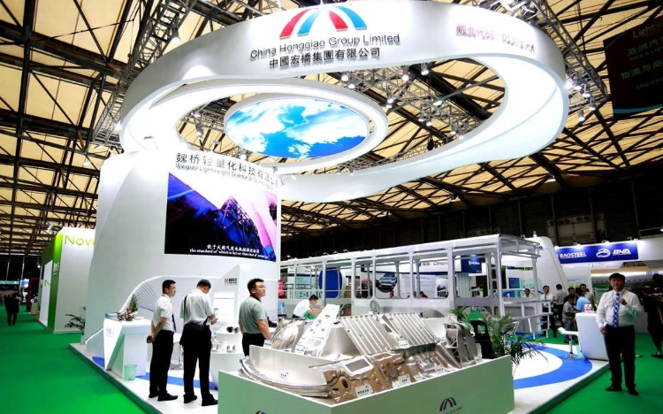
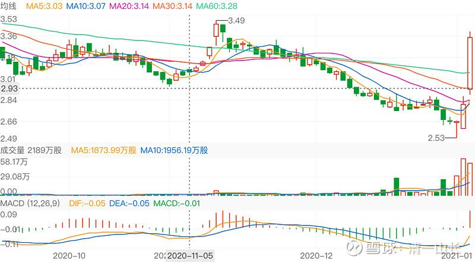

9篇.中国宏桥系列之九：宏桥反转后的估值对话及操作策略

导读：

一、与中国第一的铝业股一起进退，每年坐等分红；

二、涨多了，也会出掉一些，去买还在底部没动的股；

三、宏桥部分止盈换10年新低准现金股中国电信；

四、卖掉部分宏桥换全球竞争力最强公司中车；

五、卖掉小部分宏桥换股价处于8年来低位的白云山；

六、卖出中国宏桥后，放弃绿地香港，继续等待别的机会。

正文：

**一、与中国第一的铝业股一起进退，每年坐等分红；**

清一山长 2020-08-26 10:32

$宏创控股(SZ002379)$ 中国宏桥2016年以19.95亿的价格，取得了该公司28%的股权，现在市值只有28亿。宏桥“亏”了十几个亿。看来做实业投资，也颇有难度。宏桥这个布局，到底在想买什么呢？似乎啥也没做。

清一山长 2020-08-28 15:12

我的票，拿上两年以上的不少，我没有赚急钱的习惯。我的啤酒就拿了两年多，现在还没到退出的时候，估计还要等几年。还拿有跟你一样的“长线股”，就是我的港股第一重仓股，中国宏桥，拿了五年。3元多开始买入，拿到12元没走，又跌回3元多。现在5元多，自然也不想走。历年就是拿分红坐等，做了一小点T，成本两元多，与中国第一的铝业股一起进退，心中没多的想法。连盘都不想看，反正涨了也不想卖的股，看行情，每天的涨跌，干啥呢[笑]！

**二、涨多了，也会出掉一些，去买还在底部没动的股。**

润哥 2020-11-11 10：59

原文链接：[https://xueqiu.com/6451611049/163003699](http://link.zhihu.com/?target=https%3A//xueqiu.com/6451611049/163003699)

[中国铝业](http://link.zhihu.com/?target=https%3A//xueqiu.com/S/02600%3Ffrom%3Dstatus_stock_match)，[$中国铝业(02600)$](http://link.zhihu.com/?target=http%3A//xueqiu.com/S/02600) 营收1900亿，市值300亿。主要还是中国铝业是亏损王，公众给了亏损王的估值。目前股价跟2014年亏损100亿的时候股价相当。再烂的公司，到了行业景气时候，也会有利润增长，目前公司有利润。还有经营现金100亿。拥有[$云铝股份(SZ000807)$](http://link.zhihu.com/?target=http%3A//xueqiu.com/S/SZ000807) 10%的股权。目前股价位于历史最低附近，具有烟蒂股特征，也有反转的可能，进可攻，退可守！最多亏到历史最低1.5港元，最多能涨到一年营业额附近，不过我没有钱了，买的不多。

润哥@清一山长：

都说中国宏桥好，可以请教[@清一山长](http://link.zhihu.com/?target=http%3A//xueqiu.com/n/%25E6%25B8%2585%25E4%25B8%2580%25E5%25B1%25B1%25E9%2595%25BF)是这方面专家。

清一山长 2020-11-20 16:22回复@润哥：

不好意思，我对铝业，还不如对啤酒业熟悉。绝对谈不上什么专家。我长期持有中国宏桥，也赚了8位数的钱。但实话实说，我对铝业的研究很少。我只是知道中国宏桥是电解铝行业的世界第一名，而且这个家族的家风不错，经营上大概率不会出大问题。当然，最关键是股价低。我买入的成本3元多。持仓成本才2元多。这么低的股价，每年分红都不少。所以怎么跌我都不怕。

中国铝业，我虽然也关注，但却一直弄不懂：一家公司，怎么可能一年就会亏损一百多亿？它赚钱的时候也没赚这么多的。至于中铝时不时再报个几十亿亏损，常年不分红。所以尽管它股价很低，我也不敢碰。前段时间4元多，准备买云南铝业的，正在犹豫，结果飞了，就算了。我觉得云铝，我看得懂一些。中铝太复杂了。

中铝，大约遇到有色牛市，表现肯定也差不了。电解铝价，年底应该破1.6万元/吨。这个价格，电解铝行业的钱就很好赚。这也是这段时间铝业股价上涨的原因。但能坚持多久？我看不清。所以，更愿意持仓不动。涨多了，也会出掉一些，去买还在底部没动的股。

美元滥发情况下，有色股、资源股可能会有一波大行情。机构似乎正在布局。我忙于“喝酒”，关注过少。以后有空可以研究下。润兄既然看中有色，可以多分享[干杯]。

清一山长 2020-12-03 16:48

$中信股份(00267)$ 港股“长期投资'可能真的是谎言。这个中信股份，价格是27年来的最低价位置。就是说：27年前买它的人，没人能赚钱。只有中间投机，买低卖高的人，才赚了钱。现价折扣很厉害，净资产0.28.股息率接近7%了，我认为现价买入，长期看风险不大。也许我该卖掉涨了两倍的中国宏桥，换一点中信进来？我的港股，就是这样换换换的。越换股票越多，但都不涨[吐血]。死熬，拿股息过日子。

清一山长2020-12-03 17:26

不知道了，它想上就能上，我们也挡不住的。不想上我们想上，也没用的。我也不会都卖掉宏桥的。低价买回来的部分，涨了卖出一部分，给别人赚钱的机会，是美德。[笑]

**三、宏桥部分止盈换10年新低准现金股中国电信；**

[清一山长](http://link.zhihu.com/?target=https%3A//xueqiu.com/9310099567) [2021-01-04 16:11](http://link.zhihu.com/?target=https%3A//xueqiu.com/9310099567/167552707)

[$中国电信(00728)$](http://link.zhihu.com/?target=http%3A//xueqiu.com/S/00728)买入了差不多一百万股中国电信，价格是2.10元。看差不多是10年的最低价。还买入了不少仓位的中国中车，2.56元。我以为：电信这种股，就跟公用事业股一样，稳稳地赚钱，稳稳地分红的股。没啥成长的空间，不能指望它急涨，但也没啥潜在的危险，几乎是垄断经营。居然会出现十年多的最低价，我就买入，当准现金股来用吧！

资金是卖了几十万股中国宏桥腾出来的。去年两个股都是3元多4元的样子，我在3元多还补仓了宏桥的。现在宏桥涨到了7.20元，以后估计还会继续涨，我现在只剩460万股了[捂脸]。以后宏桥可能继续涨，我也认了。但万一别的股跌惨了，我可以卖出中国电信来加仓（就算不涨价，我这样也赚了[大笑]，这就是准现金股的意思，宏桥止盈一部分。总得让别人也有机会赚钱（铝和金属高价时刻来临）

我算是为国接盘吗？还是在帮美帝亏钱？（我认为被迫卖出的美国人，肯定没人能赚钱。十几年的最底部位置，赚个毛线？）

**四、卖掉部分宏桥换全球竞争力最强公司中车；**

[清一山长](http://link.zhihu.com/?target=https%3A//xueqiu.com/9310099567) 2021-01-06 19:42

[$中国中车(01766)$](http://link.zhihu.com/?target=http%3A//xueqiu.com/S/01766) 从跌破3元我就开始买中车，一直买到2.56元。这些买入动作，都在雪球上留下了记录，一路打脸过来。总共买了3M多不到4M的货。其实也没多少钱。因为股价实在是太便宜了，总值也才一千万左右。昨天就涨了超过5%，今天居然一天就大涨20%，涨得不可思议。恐怕是我买入后涨最快的股了，我还真的不太适应。

我赚的钱其实不太多。最低2.56元买入的货，是7.20元卖掉宏桥买的，今天中国宏桥也涨到7.70元了。买入中车的逻辑，是：中车是全球竞争力最强的公司。中车的世界推销员，是中华人民共和国的总理！这种股，是独一无二的概念股，也是垄断股。比茅台的概念，垄断价值都高。茅台还有一众的跟随者捣乱，还有难辨真假的茅台镇酒。但中车，是全中国独此一家的公司，行业第一，也是行业唯一。护城河高极了，没有谁能够替代它的。这一点，连世界第一名的中国宏桥都没有这么宽的护城河，因此准备逐步换入更多的，甚至超过中国宏桥的持仓数量。如果将来遇到个啥风口，天知道会怎样表现。所以，我一看股息率已经达到了6-7%的超级击球点，就开始卖掉别的公司买入了。特别是卖掉赚了钱的中国宏桥买入，心理障碍不大。2.99元买入中车，2.80元也在买入中车，2.56元，自然更多地买入。一路上我的买入都是打脸买入，一路买，一路套。没钱了，就到处卖股筹钱来换中车，没赚钱的股也卖掉换中车。只要中车跌了，就等于别的股涨了。

今天我要卖股吗？我还不想卖。虽然很短时间就赚了25%，但真没到我想卖的点。

会不会还跌回去？很可能会，甚至跌得更低，跌破2.50，也不是没可能。中美两国竞争，不会这么简单就反转的，中车的日子，也不会过了新年就大发红利的。

为啥不现在趁涨的时候卖掉，等跌了再买回来？这才是聪明人呀！

很简单：如果我确定会跌，我当然现在就卖。但我不能确定会跌呀？我知道我的脾气，是卖掉后如果涨了，我绝对不会追涨买入的。但中车，我买入的时候的算计，是没有想到它会涨，只想它不涨我拿十年行不行？我真的想拿它放十年的。涨了几毛钱我就走了，也太对不起初衷了。所以——我决定继续坐电梯！今天一股没卖！

还有：你们发现我这次中车操作的特点了？典型的左侧买入者。一路跌，一路买。你们说：干嘛不等跌到底部买。这又是聪明人的想法。

我是笨人，我哪里知道什么是底部？我真知道了，三天前我卖掉所有的股，全仓买入中车算了。啤酒也不喝了。

我知道我笨，我不知道底部，也不知道顶部。所以，我只好一路跌，就一路买，我还想会不会跌破2元呢！特别是港股，涨跌都不可思议。有时候，一天就把你一个月的跌幅给修复了。天天计较几分钱的赔赚，都是呆子！

未来的银行股，中国建筑股，我怀疑就会这样。天天计较几分钱涨跌幅的人，很可能一天之内，就丢了筹码，再也接不回来了。我相信在3元以下买入的人，很多已经在3元以后跑掉了。今天中车成交16个亿，您以为是美国人抛出的吗？我认为是最近一段时间接手的散户，跑得最多！

所以，散户的命真惨：跌起来，动不动就腰斩，再腰斩！看看中车，一路跌下来，散户一路死拿，都砍到脚脖子上了。80%的跌幅。

好不容易到了赚钱的时候，你拿了几毛钱就跑掉了！这就是散户：概率上，你买入赚钱和赔钱的机会一半一半。但你对赚钱股和赔钱股处理的方式不同，就导致了你今天赚和赔的结果不同！

中国宏桥，涨涨跌跌，涨了我卖一点，跌了我买一点。涨涨跌跌我都可以接受。今年跌到三元多，我又买了不少，总共增加了一百多万股。现在慢慢又把这一百万股减掉，换了中车、中国电信等。就算是账户不升值，我的持股，也是越来越多了。**熊市赚股！下跌赚股。**

现在的港股，依然熊气弥漫。我们就手上尽量多一点股吧！将来涨了，就少一点股，多一点钱！祝福大家新年大吉大利！

为国接盘，好心有好报！为中国加油！

**五、卖掉小部分宏桥换股价处于8年来低位的白云山；**

[清一山长](http://link.zhihu.com/?target=https%3A//xueqiu.com/9310099567) 2021-02-05 15:56

[$白云山(00874)$](http://link.zhihu.com/?target=http%3A//xueqiu.com/S/00874) 今天买入了一些白云山。买入价19.34元。买入原因，是股价处于8年来的低位。资金是7.98元卖掉了小部分中国宏桥腾出来的资金。这个股应该还会涨，目前已经是上市以来的次高位，仅次于五年来大涨的那一次了。这是我的长期持股。白云山买入后，计划也是长持股，计划持有五年。

@[xd173](http://link.zhihu.com/?target=http%3A//xueqiu.com/n/xd173) 2021-02-05 回复 [清一山长](http://link.zhihu.com/?target=http%3A//xueqiu.com/n/%25E6%25B8%2585%25E4%25B8%2580%25E5%25B1%25B1%25E9%2595%25BF):

好几年了，山长还有宏桥？

[清一山长](http://link.zhihu.com/?target=https%3A//xueqiu.com/9310099567) 2021-02-05 16：21 回复 xd173:

谁让中国宏桥一直不涨呢？去年还玩惨跌。我也只好不断加仓买回来。如果早涨了，大涨了，我早就卖光了。现在只卖掉了两成仓，离清仓还早呢！

@[柳随风77](http://link.zhihu.com/?target=http%3A//xueqiu.com/n/%25E6%259F%25B3%25E9%259A%258F%25E9%25A3%258E77) 2021-02-05 回复 [清一山长](http://link.zhihu.com/?target=http%3A//xueqiu.com/n/%25E6%25B8%2585%25E4%25B8%2580%25E5%25B1%25B1%25E9%2595%25BF)：

老哥，为啥我觉得宏桥还是你的第一大重仓股呢？

[清一山长](http://link.zhihu.com/?target=https%3A//xueqiu.com/9310099567) [2021-02-05 17:15](http://link.zhihu.com/?target=https%3A//xueqiu.com/9310099567/171146783)回复 柳随风77：

现在还是港股第一重仓。但继续涨的话，以后就不是了。现在港股很多趴地下的股票，正好换股。

**六、卖出中国宏桥后，放弃绿地香港，继续等待别的机会。**

[清一山长](http://link.zhihu.com/?target=https%3A//xueqiu.com/9310099567) 2020-[02-08 14:15](http://link.zhihu.com/?target=https%3A//xueqiu.com/9310099567/171332776)

[$绿地香港(00337)$](http://link.zhihu.com/?target=http%3A//xueqiu.com/S/00337)今天卖出了十几万股中国宏桥，挂单价8.66元。看样子这个价格卖得还不错，算是今天的高价范围了。目前持仓已经不足4M了，成本正在接近零元。

今天的资金回来后，继续找新的标的准备买入。原来一直在买的中国建材和白云山都涨了一些，有些犹豫要不要追涨。绿地香港看起来很诱人，价格很低，股息率都超过10%了。市盈率才两三倍。但研究了一下，放弃了绿地。原因是：这家公司连员工的工资都不发，销售的奖金都要扣，一家连自己的员工都刻薄克扣的企业，我认为恐怕不靠谱，诚信恐怕有问题。它家的报表是真是假不清楚，别为了贪图10%的股息，丢了90%的本金。（华夏的股息原来也很高，说没就没了）。我看地产股，还是中国海外宏洋更靠谱一些！

当代置业价格也不错，9毛多了一些。但我担忧的是：它的贷款利息太高了，不敢过于重仓。

最后1.17元，买入了一些花样年控股，PE才一倍多一点。剩下的钱，继续等待别的机会。

（标题为编者所加）

参考链接：

[清一投资号：1篇.中国宏桥系列之一：建仓原则](https://zhuanlan.zhihu.com/p/493191191)（整理文）

[清一投资号：2篇.中国宏桥系列之二：安全边际及基本面分析](https://zhuanlan.zhihu.com/p/500915231)（整理文）

[清一投资号：3篇.中国宏桥系列之三：上涨过程中的技术分析与心态把握](https://zhuanlan.zhihu.com/p/505157634)（整理文）

[清一投资号：4篇.中国宏桥系列之四：股价走好，不放松对基本面的分析判断](https://zhuanlan.zhihu.com/p/508644489)（整理文）

[清一投资号：5篇.中国宏桥系列之五：遭遇机构做空消息后的理性分析](https://zhuanlan.zhihu.com/p/511924857)（整理文）

[清一投资号：6篇.中国宏桥系列之六：宏桥复牌后的基本面分析及盘面动态](https://zhuanlan.zhihu.com/p/518969047)（整理文）

[清一投资号：7篇.中国宏桥系列之七：坐过山车的正确姿势](https://zhuanlan.zhihu.com/p/522245519)（整理文）

[清一投资号：8篇.中国宏桥系列之八：最黑暗阶段基于理性判断下的信心](https://zhuanlan.zhihu.com/p/525208172)（整理文）

