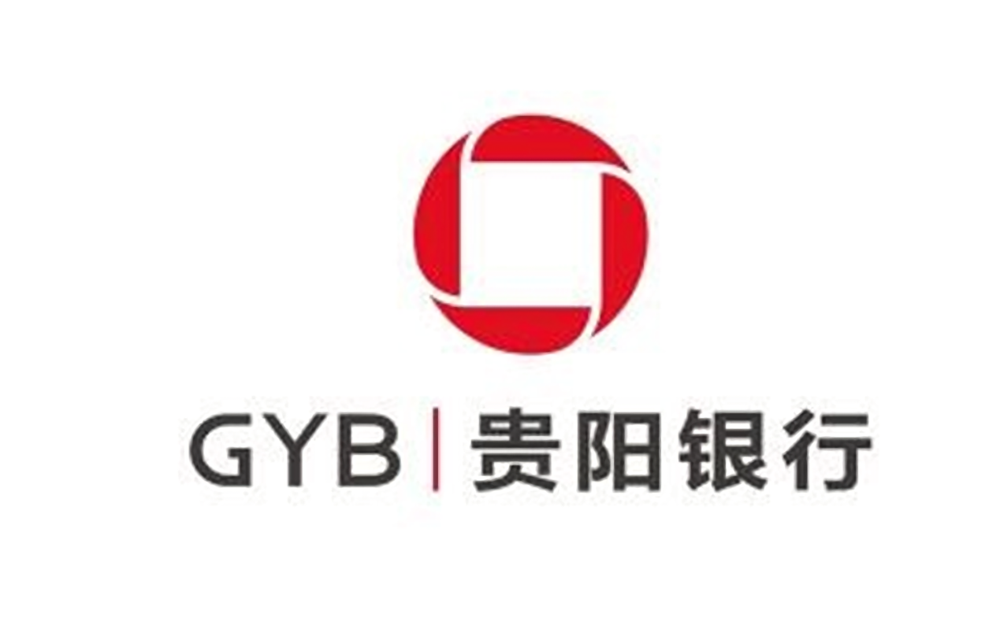
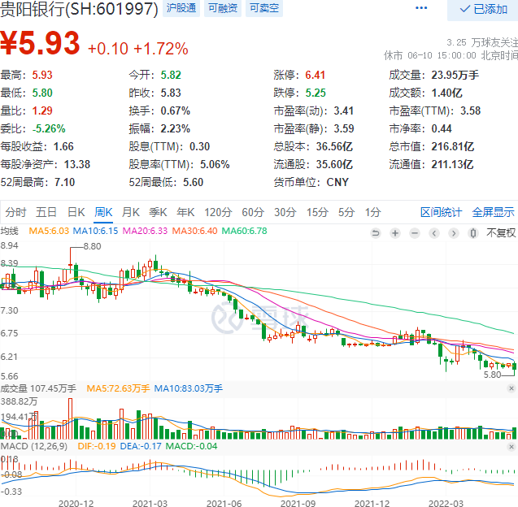
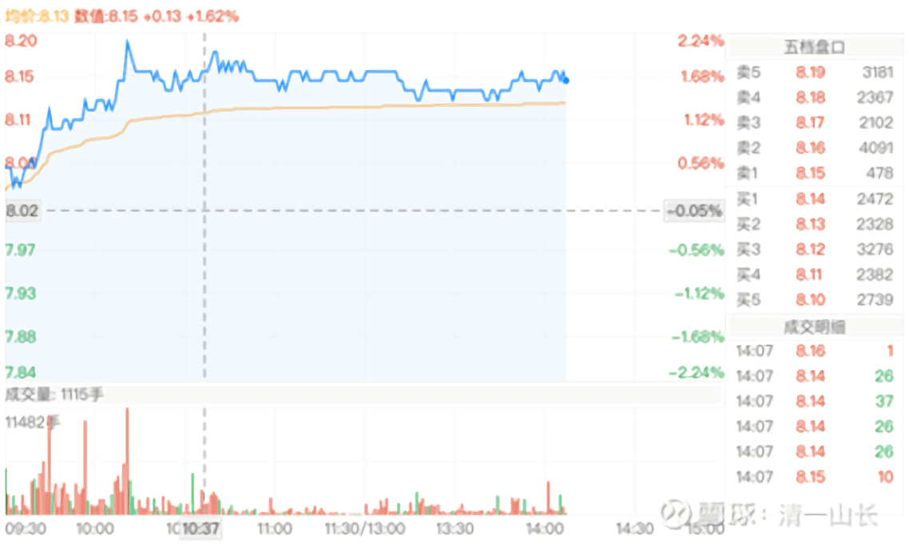

**

**

8篇. 建仓、持有贵阳银行的投资逻辑

清一山长 2021年4月29日～8月29日

*（2020年12月～2022年6月周线图）*

**一、敢于在相对低位买入负面评价的优质标的**

[清一山长](http://link.zhihu.com/?target=https%3A//xueqiu.com/9310099567) [2021-04-29 14:2](http://link.zhihu.com/?target=https%3A//xueqiu.com/9310099567/197395936)1

[$贵阳银行(SH601997)$](http://link.zhihu.com/?target=http%3A//xueqiu.com/S/SH601997) **今天首次买入贵阳银行。是用卖了一多半的江苏银行的钱来换的。**为何这样做呢？我就是赌一把玩[大笑]。我赌江苏银行是一日游。今天涨这么多，是给我面子了。查看我的持仓成本是5.41元，基本上是底部拿到手的。说明上次的持仓逻辑没问题。今年最高6.90元卖出，我很满意了。虽然钱不多，才27%。不过比中国建筑要强多了。虽然我看年报，还不如中国建筑呢！就一季报强一点。

贵阳银行其实最近的负面评价很多，啥玩定向增发，摊薄老股东利润了。昨天还是4字头的PE，今天就变5字头了，还要分享老股东的红利，导致分红也减少了。还有——居然它的十大大股东，还公报减持！证明大股东都不看好。这种股怎么能要呢？还有就是要暴雷了等等，看的人怕怕的。我也怕，所以就是赌一把，不敢推荐各位跟买，你们买破五的中国建筑就好了——安全度高。我买入，是要赌贵阳银行的年报，明天不暴雷。万一它还报个喜，像今天的江苏银行一样，我就赚了。

如果真爆了雷，我就——卧倒装死算了。我心里，还可以美美地想：其实被套住没啥的。现在一批贵阳的老股东，大股东增发，他们拿的批发价，还是10.27元。把钱都给贵阳银行充实资本公积金了。我一个小股东，拿到手的零售价，才8.13元。我赚了！贵阳银行以后不能让他们赔钱吧？**等他们高价拿的都赚钱了，我也赚了！我就这样想的。于是，就算暴雷了，我也不担心，就抱着亏损的贵阳银行，继续好好的睡觉算了！**

明天，是吃大饼，还是吃大雷呢？不知道了。你们就静静地等看我的笑话吧！**反正死不了人。最近很多朋友都掉坑，我也主动找个坑来掉！**跟朋友同甘共苦[加油]！

*（贵阳银行 2021年4月29日分时线）*

@凯宝歌回复@清一山长:

山哥哥，真厉害，记得有个人跟他争论江苏银行，那时候还不知道山哥哥的能力圈，以为山哥哥不擅长银行股，就没有买，事实上是马上打了我的脸，且翻看山哥哥的历史帖子，十几年前就开始买银行股了。

[清一山长](http://link.zhihu.com/?target=https%3A//xueqiu.com/9310099567) 2021-[04-29 16:46](http://link.zhihu.com/?target=https%3A//xueqiu.com/9310099567/178642119)回复[@凯宝歌](http://link.zhihu.com/?target=http%3A//xueqiu.com/n/%25E5%2587%25AF%25E5%25AE%259D%25E6%25AD%258C):

我买银行股的时候，你们很多人，还不知道在干什么呢？

2011年，我是5元买的民生银行，2013年，10元多走掉。这是我第一次在一个股上，赚到数百万资产。

2013～2014年，满仓满融银行股，以及中国建筑，轮动操作，除了农业银行赚得最少外，只赚了500多万（因为我2015股灾前才进入，别的银行赚够了买它避险的），其他银行股，招商、浦发、兴业、华夏等。全都是每只股都赚了超过千万才走的。从此我买股票，起步就千万了[大笑]。

买江苏银行，跟我杠精的人很多，我不愿多说罢了！

这几年不太碰银行，是因为经济下行，有全球金融危机可能，所以为了避险，我买消费股——酒类。已经赚到了比2015年的银行更多的钱。

**现在，该慢慢回银行了——因为银行的坏账快要出清了！**

我是价值投机，不会死守银行。不会因为银行赚了钱，就以为除了银行都不能买。不过，按照银行人的观点，我买的酒，都是不符合要求的。中国建筑勉强算合格吧？如果这样想，这几年就赚不到钱的。

**因时而动，学会变通，才是真正的懂投资，做投资！克服自己的思维惯性，很难，也很好玩！**

江苏银行买的理由，就是很简单：江苏银行将是最快出清坏账的地区。当时它低价，底部位置，不买它买谁？

**贵阳银行也一样：因为贵阳发展良好，它的资产质量没啥问题。看它的坏账覆盖率，300%多。民生现在核销巨大，也才有100%多一点。所以民生还在坑中出不来。**

**买银行，一定要了解这一点：地雷多不多。如果多，就躲着一点，比如东北！**（编者注：投资不过山海关）

教各位一点银行投资经！老银粉的十几年的经验！[大笑]

**二、下跌后仍安心持有贵阳银行的理由**

[清一山长](http://link.zhihu.com/?target=https%3A//xueqiu.com/9310099567) [2021-04-29 18:4](http://link.zhihu.com/?target=https%3A//xueqiu.com/9310099567/197395936)0

好像中雷了。一季报发出来，营业收入居然负数，还负的不少，14%。

贵阳银行明天会大跌吗？我还有钱抄底的。不慌！但大饼看样子没得吃了。套牢，大约不可避免了。

但看看一季报的数字，还是安心一点：

每股净资产12.26元；基本每股收益0.49元；加权平均净资产收益率（年化）16.24%；

**就是：我用8元钱，买了12元的资产。每年可以帮我赚2元钱。净资产收益率比中建还高！**

**那就——继续拿着呗！也许是个黄金套子！**

[清一山长](http://link.zhihu.com/?target=https%3A//xueqiu.com/9310099567) [2021-04-30 10:2](http://link.zhihu.com/?target=https%3A//xueqiu.com/9310099567/197395936)5

我刚打赏了这篇帖子 ¥66.00，也推荐给你。感谢贴主的认真写作，收集资料。

一季度下降：另一主要原因是投资收益及公允价值变动损益比上年减少6亿，贡献了绝大多数负增长。如果这个原因，贵阳银行的这个数据，就不算啥严重。如果是失去市场，就严重了。

去年一季度，是高增长。17%多的增长。今年差不多回到2019年的位置。股价也回到2019，没啥毛病。**依然可以放心持有贵阳。如果继续跌，我就再买一点！**

[@诚意正心9](http://link.zhihu.com/?target=http%3A//xueqiu.com/n/%25E8%25AF%259A%25E6%2584%258F%25E6%25AD%25A3%25E5%25BF%25839)回复[@玲玲qcp](http://link.zhihu.com/?target=http%3A//xueqiu.com/n/%25E7%258E%25B2%25E7%258E%25B2qcp):

你很可能没有看懂山长的话。山长慈悲又提醒你买回了。实在害怕同时买中建和燕京。

[清一山长](http://link.zhihu.com/?target=https%3A//xueqiu.com/9310099567) [2021-04-30 13:4](http://link.zhihu.com/?target=https%3A//xueqiu.com/9310099567/197395936)4回复[诚意正心9](http://link.zhihu.com/?target=http%3A//xueqiu.com/n/%25E8%25AF%259A%25E6%2584%258F%25E6%25AD%25A3%25E5%25BF%25839):

我不是告诉她去买回来。我根本不在意她买不买燕京。我只是告诉各位: 燕京跌破6元，以及涨破10元的可能，都同时存在！爱买不买，你自己想去。[俏皮]我昨天买入贵阳银行，大家都笑话我傻。以为我会想不开，才不是呢！

**我买入之时，就准备了两个可能，昨天就已经明说了：跌或者涨，都能接受。我没啥不好的心情。被打脸也不怕，脸皮厚！**

**我依然会安心拿着贵阳银行的，再跌再买。我没发现它出问题了。**

@真的第八大奇迹:

大哥你好牛逼,几乎每次都做对了。

[清一山长](http://link.zhihu.com/?target=https%3A//xueqiu.com/9310099567) [2021-08-29 14:1](http://link.zhihu.com/?target=https%3A//xueqiu.com/9310099567/197395936)7回复真的第八大奇迹:

**谁说的我没错？只是我犯的错杀不死我。**

**因为我永远不重仓一个股，一个行业。**错过了大赚的机会，也错过了归零的可能。比如，我买了民生银行H，把民生银行A赚的几百万快一千万亏光了。

*春丽 2022/1/7 12:11:51@山长 清一

山长，您为了筹钱买燕京，把北京银行卖了，可否说说贵阳银行？

山长 清一2022/1/7 12:16:57

贵阳银行我被套住了，没有卖。原因是它的活性强，西部大开发对它很有利。贵阳的经济上的很猛。另外，现在看底部有收集迹象，底部平台阶段。所以没有卖了换股，我在赌它拿了配股充实资金后业绩反转的。安全性以及长期的发展，可能不如兴业。

*春丽2022/1/7 12:38:59@山长 清一

感恩山长解答。我且拿着，跟随山长进退。

（标题为编者所加）

参考链接：

[清一投资号：1篇.银行股的投资逻辑](https://zhuanlan.zhihu.com/p/489850963)（整理文）

[清一投资号：3篇.2015年银行股投资回顾——“价值投机法”之示范（上）](https://zhuanlan.zhihu.com/p/502367347)（整理文）

[清一投资号：4篇.2015年银行股投资回顾——“价值投机法”之示范（下）](https://zhuanlan.zhihu.com/p/506271066)（整理文）

[清一投资号：5篇.价值投机派的投资思路与心态——兴业银行的实操分析](https://zhuanlan.zhihu.com/p/509443218)（整理文）

