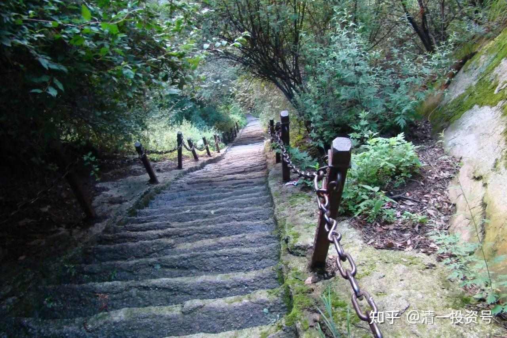

28篇.孩子并非只有华山一条路

清一山长 2021年6月27日

清一山长雪球非专栏帖子整理文章，第29篇《孩子并非只有华山一条路》

此文整理自山长专栏文章《全面禁止补习班，会带来什么样的教育后果？》[https://xueqiu.com/9310099567/187366468](http://link.zhihu.com/?target=https%3A//xueqiu.com/9310099567/187366468)的跟帖评论

[清一山长](http://link.zhihu.com/?target=https%3A//xueqiu.com/9310099567)[2021-06-27 09:09](http://link.zhihu.com/?target=https%3A//xueqiu.com/9310099567/187367200)

“至于那些全家年收入还不到12万的90％以上的中国人，他们听说补课班不让办了，赶紧看有没有网课，发现网课也被禁止了，顿时觉得浑身发冷。他们很清楚：自己的孩子要考上名校的机会已经接近于零”

我认为这个接近事实——

除非少数上衡水高中这样的重点学校的，不用去操心补习的问题了。

其他**放羊的家庭，将来考大学，跟985、211基本就没关系。如果只能上个普通大学，将来想找个像样的工作基本没戏。**所以，新教育的网上示范班，可以拯救这些无助的家庭。

可惜的是：**穷人其实最需要今日学堂，又最看不起今日学堂**。因为只有今日学堂提供了穷人逆袭的机会，可是，偏偏是穷人最看不起今日学堂。年年的免费班，学生素质，一直比不过有钱人的收费班水平。很多人给了名额还不来上学。所以，看起来今日学堂就像是富人追捧的学堂，其实是因为穷人太没眼光了！

随你们吧！爱跟就跟，想学就学。我们连富人申请者都招不完，你不想学关我啥事，别以为我们缺学生。**有心人自己跟学示范班，学到15岁，通过考试标准后，直接找我申请免费入读今日国际高中，我出钱给你上今日高中。如果通不过SAT1400分，就自己奔前程去**。又不给钱，自己还不努力，要我背着你孩子走，谁理睬你！就别私信给我唧唧歪歪了。这些求学私信，我一概不回复。

[星辰大吉](http://link.zhihu.com/?target=http%3A//xueqiu.com/n/%25E6%2598%259F%25E8%25BE%25B0%25E5%25A4%25A7%25E5%2590%2589)回复[清一山长](http://link.zhihu.com/?target=http%3A//xueqiu.com/n/%25E6%25B8%2585%25E4%25B8%2580%25E5%25B1%25B1%25E9%2595%25BF):

格局小了，国家禁止补习班，是在为广大家长减负，减少家长负担，鼓励多生育，让中国未来后续有人。

[清一山长](http://link.zhihu.com/?target=https%3A//xueqiu.com/9310099567)[2021-06-27 09:25](http://link.zhihu.com/?target=https%3A//xueqiu.com/9310099567/187367780)回复[星辰大吉](http://link.zhihu.com/?target=http%3A//xueqiu.com/n/%25E6%2598%259F%25E8%25BE%25B0%25E5%25A4%25A7%25E5%2590%2589):

您的格局才不够呢！**未来国家比较缺的人才，主要是低端的劳动力，中高层位置有限，抢都抢不过来。**所以，这个政策，就是“大家别闹了，乖乖地当工人去，别都去抢中高管的饭碗，我们将来没这么多位置的，发展红利已经结束了。”

[清一山长](http://link.zhihu.com/?target=https%3A//xueqiu.com/9310099567)[2021-06-28 08:02](http://link.zhihu.com/?target=https%3A//xueqiu.com/9310099567/187567087)

“更糟糕的是：一旦他们的孩子某个知识点不懂，可能就跟不上进度，步步落后，过早被淘汰出局，连后机会都没有。中产阶级或者因为请家教耗费大量余钱，或者为了在家辅导孩子而放弃事业，阶层会下降一大截，有些会很快沦为底层”

最近我和刘老师，都连续接到专门给13岁～15岁的孩子一对一辅导的单子。我们的辅导费都是一万元一小时。本来我们的规划，都是给成人辅导的，哪里想到会有家长专门为孩子定咨询时间？辅导完，家长还感恩不尽。

比如一个本来想要退学的学生，经过我辅导后班级上积极进取了，老师和同学反馈像是换了一个人一样。因为这种孩子就是卡在一个点上了，你要帮她度过这个卡点，这孩子到了青春期，家长不懂怎样处理，孩子状态步步下滑。我出手帮助后，孩子就恢复正常了，家长当然觉得很值。

甚至刘老师这边，还有家长因为孩子胆小，就预定她咨询的，弄得她哭笑不得。当然她也帮忙处理了，说明现在富裕的家长，对孩子花钱真的很大方。不过，我这种辅导一小时，孩子就完全改变，孩子算是理解力还比较强的，也因此，我不接受年龄更小的孩子的咨询。我在想：我是不是以后培养两个助手，以后对孩子推出1+10的辅导计划。我辅导一小时，我的助教跟进10周，每周一小时辅导。这种孩子，就算是理解力差一点，也可以在助教的后续辅导下，成长得很健康。

现在的家长和学校的教师，都太不懂孩子的心了，导致种种弊端，孩子一卡住，甚至十年，几十年转不过弯来的。

[球友甲](http://link.zhihu.com/?target=http%3A//xueqiu.com/n/%25E4%25BD%259B%25E5%258D%25B0%25E8%258B%258F%25E8%25BD%25BC)回复[清一山长](http://link.zhihu.com/?target=http%3A//xueqiu.com/n/%25E6%25B8%2585%25E4%25B8%2580%25E5%25B1%25B1%25E9%2595%25BF):

“中小学这点知识性东西实在是太简单了”，课本内容确实不能说难，但是如果说考试，我建议你做中考试卷再评论。

[清一山长](http://link.zhihu.com/?target=https%3A//xueqiu.com/9310099567)[2021-06-28 08:32](http://link.zhihu.com/?target=https%3A//xueqiu.com/9310099567/187569039)回复球友甲:

你先看过我们学生的考试成绩，再来评论。

[一弯银河一湾水](http://link.zhihu.com/?target=http%3A//xueqiu.com/n/%25E4%25B8%2580%25E5%25BC%25AF%25E9%2593%25B6%25E6%25B2%25B3%25E4%25B8%2580%25E6%25B9%25BE%25E6%25B0%25B4):回复[清一山长](http://link.zhihu.com/?target=http%3A//xueqiu.com/n/%25E6%25B8%2585%25E4%25B8%2580%25E5%25B1%25B1%25E9%2595%25BF):

太好了!期待山长的1+10计划！我家这个理解力就很差，幸好刘老师的话他是听进去了的。经刘老师辅导后，能静下心了，小动作也少了，我们跟他之间的情绪对抗也少了很多，就是孩子每天花太多时间做手工，不务正业，一说读字多的书就头痛。11岁了，福尔摩斯探案集还看不下去。

[清一山长](http://link.zhihu.com/?target=https%3A//xueqiu.com/9310099567)[2021-06-28 08:37](http://link.zhihu.com/?target=https%3A//xueqiu.com/9310099567/187569395)回复[一弯银河一湾水](http://link.zhihu.com/?target=http%3A//xueqiu.com/n/%25E4%25B8%2580%25E5%25BC%25AF%25E9%2593%25B6%25E6%25B2%25B3%25E4%25B8%2580%25E6%25B9%25BE%25E6%25B0%25B4)：

你对孩子要求太高了。他不玩游戏已经够不错的了。有些孩子，天生不是走学术的料。你家孩子，我看有可能是动手型，适合走匠人之路。**不要逼孩子去走华山一条路，读书读成废物了，还不如拥有一技之长，更容易获得幸福人生。**您让“寿司之神”去读福尔摩斯、去上大学，不是浪费人才吗？

以后如果认为有必要，可以让我跟孩子交流一次，就知道孩子是什么学习类型了。12岁以后。

[球友乙](http://link.zhihu.com/?target=http%3A//xueqiu.com/n/%25E5%25A4%25A9%25E6%25B6%25AF%25E5%2580%25A6%25E5%25AE%25A2%25E4%25B9%258B%25E9%2580%258D%25E9%2581%25A5%25E9%2583%258E)回复[影子one](http://link.zhihu.com/?target=http%3A//xueqiu.com/n/%25E5%25BD%25B1%25E5%25AD%2590one):

口嗨罢了，为了自己的利益与国家政策唱反调，屁股决定脑袋！

[清一山长](http://link.zhihu.com/?target=https%3A//xueqiu.com/9310099567)[2021-06-28 08:45](http://link.zhihu.com/?target=https%3A//xueqiu.com/9310099567/187570397)回复[球友乙](http://link.zhihu.com/?target=http%3A//xueqiu.com/n/%25E5%25A4%25A9%25E6%25B6%25AF%25E5%2580%25A6%25E5%25AE%25A2%25E4%25B9%258B%25E9%2580%258D%25E9%2581%25A5%25E9%2583%258E):

原来您的脑袋是长在屁股上的，怪不得说话如此不对劲。这种天生怪物，很不适合呆在我这里。走你。

刘老师的咨询，排队都排到8～9月份了。因为远程疗愈，特别耗费能量，不能多做。需求的家长太多。

我和刘老师收的咨询费，一分钱都不入我们的账户，刘老师的咨询费，是全部捐给基金会账户建校用；我的咨询费，是捐给我支持的、想打世界冠军的年轻人的**清一武道馆**，日常运行使用。**我们花富人的钱，支持一批年轻人来追求人生理想，我们一点都没有不好意思的。**

至于你们认为我们可以收到的金额，如此不可思议，大多数中国人，一个月都挣不到这笔钱，我们怎么可以一小时就能赚到？我只能说：就是因为贫穷，限制了您的想象力！

[驰骋马147](http://link.zhihu.com/?target=http%3A//xueqiu.com/n/%25E9%25A9%25B0%25E9%25AA%258B%25E9%25A9%25AC147)回复[清一山长](http://link.zhihu.com/?target=http%3A//xueqiu.com/n/%25E6%25B8%2585%25E4%25B8%2580%25E5%25B1%25B1%25E9%2595%25BF):

山长您好。我们想报今年的夏令营，没有推荐人怎么办呀？

[清一山长](http://link.zhihu.com/?target=https%3A//xueqiu.com/9310099567)[2021-06-28 08:50](http://link.zhihu.com/?target=https%3A//xueqiu.com/9310099567/187570808)回复[驰骋马147](http://link.zhihu.com/?target=http%3A//xueqiu.com/n/%25E9%25A9%25B0%25E9%25AA%258B%25E9%25A9%25AC147):

没推荐人，自然就不用来了，有啥好纠结的。这证明你不是圈内人。我们这是小众教育圈，只接待内部的清粉，不接待外人。

[驰骋马147](http://link.zhihu.com/?target=http%3A//xueqiu.com/n/%25E9%25A9%25B0%25E9%25AA%258B%25E9%25A9%25AC147)回复[清一山长](http://link.zhihu.com/?target=http%3A//xueqiu.com/n/%25E6%25B8%2585%25E4%25B8%2580%25E5%25B1%25B1%25E9%2595%25BF):

谢谢山长回复。我们接触新教育比较晚一些。这半年通过雪球和清一书院公众号了解了很多，也通过哔哩哔哩看了很多示范课，学习了很多东西。

我是一名体制内的老师，我非常认可您的理念和新教育的做法，所以想参与进来，如果进不了新教育的小圈子，那是我们的机缘不够，那我们就多多学习示范班吧！也非常感谢您的分享。

[清一山长](http://link.zhihu.com/?target=https%3A//xueqiu.com/9310099567)[2021-06-28 12:29](http://link.zhihu.com/?target=https%3A//xueqiu.com/9310099567/187607553)回复[驰骋马147](http://link.zhihu.com/?target=http%3A//xueqiu.com/n/%25E9%25A9%25B0%25E9%25AA%258B%25E9%25A9%25AC147):

既然是当老师的，跟随示范班的课程来辅导孩子，就做一辅导员，应该不难吧？干嘛到处送呢？也许别人看你教得好，反而还送孩子给你带呢！

[悠游天地间](http://link.zhihu.com/?target=http%3A//xueqiu.com/n/%25E6%2582%25A0%25E6%25B8%25B8%25E5%25A4%25A9%25E5%259C%25B0%25E9%2597%25B4)回复[清一山长](http://link.zhihu.com/?target=http%3A//xueqiu.com/n/%25E6%25B8%2585%25E4%25B8%2580%25E5%25B1%25B1%25E9%2595%25BF):

山长先生，能不能请您讲讲这种卡壳一般是卡在了哪些地方呢？是知识方面还是人生观价值观方面？作为一个家长该怎么从细微处发现孩子的卡壳状态呢？

[清一山长](http://link.zhihu.com/?target=https%3A//xueqiu.com/9310099567)[2021-06-28 08:53](http://link.zhihu.com/?target=https%3A//xueqiu.com/9310099567/187571090)回复[悠游天地间](http://link.zhihu.com/?target=http%3A//xueqiu.com/n/%25E6%2582%25A0%25E6%25B8%25B8%25E5%25A4%25A9%25E5%259C%25B0%25E9%2597%25B4):

如果我能用文字简单告诉你，家长也不会傻到非要花钱找我一对一咨询了。你的这个问题，就是真的认为找我咨询的家长们都很傻，而你很聪明，看几个字就懂了。

[不明真相的百姓](http://link.zhihu.com/?target=http%3A//xueqiu.com/n/%25E4%25B8%258D%25E6%2598%258E%25E7%259C%259F%25E7%259B%25B8%25E7%259A%2584%25E7%2599%25BE%25E5%25A7%2593)回复[清一山长](http://link.zhihu.com/?target=http%3A//xueqiu.com/n/%25E6%25B8%2585%25E4%25B8%2580%25E5%25B1%25B1%25E9%2595%25BF):

山长真有耐心，连这个也去解释。说实话，能意识到国家禁止补习班对广大普通老百姓是特大利空的家长，一般家里的孩子学习也不差，学习习惯也会比较好。反而是那些认为是绝大利好的家长，孩子学习都是一般般，习惯也是不太好的。

[清一山长](http://link.zhihu.com/?target=https%3A//xueqiu.com/9310099567)[2021-06-28 12:22](http://link.zhihu.com/?target=https%3A//xueqiu.com/9310099567/187607000)回复[不明真相的百姓](http://link.zhihu.com/?target=http%3A//xueqiu.com/n/%25E4%25B8%258D%25E6%2598%258E%25E7%259C%259F%25E7%259B%25B8%25E7%259A%2584%25E7%2599%25BE%25E5%25A7%2593):

这个解释就对了——这就是屁股决定脑袋。因为这些普通家庭的孩子很平庸，就希望别人也一样没有机会去补习，最好所有的学校都一样。以为一刀切，自己就不会差了，其实差距更大了。**因为上进的人，不管如何，总能找到办法进取；而平庸的人，总会找到各种方法来娱乐。**

[巴韭特在中国](http://link.zhihu.com/?target=http%3A//xueqiu.com/n/%25E5%25B7%25B4%25E9%259F%25AD%25E7%2589%25B9%25E5%259C%25A8%25E4%25B8%25AD%25E5%259B%25BD)回复[清一山长](http://link.zhihu.com/?target=http%3A//xueqiu.com/n/%25E6%25B8%2585%25E4%25B8%2580%25E5%25B1%25B1%25E9%2595%25BF):

人口红利等于廉价劳动力，中国这种被廉价劳动力给惯坏了的企业市场应该要早点有觉悟，未来的市场就是一个劳动力资源越来越稀缺，越来越尊重人的市场，我倒乐于看到人力资源短缺，然后充分尊重人的市场，让那些垃圾企业，无良老板趁早滚蛋。还有很多人担心人口红利，我就呵呵了。人口红利换个说法就是人力内卷。早点结束不好吗？屁民就少来点格局吧！这些不是屁民能解决的，把自己的日子过好打工多挣一点，自己的劳动权益多有点保障，过上更好的生活，比什么多重要。

[清一山长](http://link.zhihu.com/?target=https%3A//xueqiu.com/9310099567)[2021-06-28 15:04](http://link.zhihu.com/?target=https%3A//xueqiu.com/9310099567/187630239)回复[巴韭特在中国](http://link.zhihu.com/?target=http%3A//xueqiu.com/n/%25E5%25B7%25B4%25E9%259F%25AD%25E7%2589%25B9%25E5%259C%25A8%25E4%25B8%25AD%25E5%259B%25BD)：

同意您的观点：原来读了一点书，就可以过得比农民工好得多。**未来只会读书的傻子，会比不过民工的生活的**。**未来社会，只有两种人能够活得好。一种是真正的精英，管理阶层；一种是体力劳动者，技术工人，都很体面。**但废物们，就不再有机会，家里自己养吧！

所以，**新教育重点是培养两种人**。**一种是素质全面的领导者，学习力强，自控力好，脑子好用。一种是书呆子，就只鼓励去读理工科，当技术员了。那些不善于读书的，就锻炼身体，养好脾气，将来做技术工人也不错。**这都是社会的人才。

至于身体不好，心理情绪都有问题，只会读书，还读不好，厌学的孩子咋办？家长自个人养着，别指望国家会替您养人。

可我担忧的是：**似乎体制学校，正在批量培养这种废物，厌学还自大。国家已经意识到了，正在改进“快乐教育”,起码让孩子身体、心灵正常一点。**

参考链接：

[你家孩子，是第几等人？要用几等的教育适配？](http://link.zhihu.com/?target=http%3A//www.360doc.com/content/21/0413/13/55056124_972102215.shtml)

[清一投资号：23篇.那些被定义为多动症、有问题的正常孩子](https://zhuanlan.zhihu.com/p/525864064)（整理文）

[这就是今日学堂：把普通人培养成天才的中国第一学校！（海外版）](http://link.zhihu.com/?target=https%3A//www.bilibili.com/video/BV19K411g7tp)（视频）

[喜马拉雅：清一山长雪球专栏](http://link.zhihu.com/?target=https%3A//www.ximalaya.com/album/52603303)（音频）

[哔哩哔哩：清一山长雪球专栏](http://link.zhihu.com/?target=https%3A//www.bilibili.com/audio/am32848405)（音频）

[\[转\]香港外资高管：花6000万培养失败的儿女的反思](http://link.zhihu.com/?target=https%3A//www.bilibili.com/read/cv28583557)