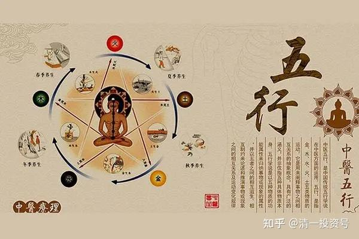

30篇.中医与健康

清一山长 2021年6月6日

清一山长雪球非专栏帖子整理文章，第31篇《中医与健康》

本文整理自山长专栏文章《[不懂医学，就用生命来支付无知的代价](https://link.zhihu.com/?target=http%3A//www.360doc.com/content/21/0606/22/45981010_980775089.shtml)

》[https://xueqiu.com/9310099567/181954415](https://link.zhihu.com/?target=https%3A//xueqiu.com/9310099567/181954415)的跟帖评论

[燕子学习投资和中医](https://link.zhihu.com/?target=https%3A//xueqiu.com/3263527455)[清一山长\[¥200.00\]](https://link.zhihu.com/?target=http%3A//xueqiu.com/n/%25E6%25B8%2585%25E4%25B8%2580%25E5%25B1%25B1%25E9%2595%25BF%3Fpaid_mention%3D1)

山长您好！我是想请您点评一下我的作业的。我知道我的问题付一万块的咨询费都不够，请您有空的时候再点评吧！我想向山长请教，我这样的是否能做一个中医师，现在是否能接诊癌症病人？如果我想在中医的路上有所提升的话，最缺少的是什么？可以提升的是什么？如何去做？感恩山长。因为字数的限制，我作业单独做好发了一篇长文章，请山长点评，谢谢山长！

**[清一山长](https://link.zhihu.com/?target=https%3A//xueqiu.com/9310099567)**[2021-06-01 07:51](https://link.zhihu.com/?target=https%3A//xueqiu.com/9310099567/181420176)[燕子学习投资和中医](https://link.zhihu.com/?target=https%3A//xueqiu.com/3263527455)

**“如何学做一个中医师，现在是否能接诊癌症病人？”**

这个目标很容易实现：只要好好学习倪海厦的人纪，好好读通《伤寒论》、《千金方》、《黄帝内经》，两三年后，你就可以开始开方治病了，一些医院都治不好的病，你也可以对付了。要治疗癌症，也不在话下。癌症其实也不难治——真懂了癌症的源头的话。我身边一些癌症患者的恢复案例，说明不是绝症。

只是有两个问题:

**第一个是合规问题，**医疗资格问题。非法行医，在国内是受到严格监管的，特别是你影响了利益集团的利益，你受到法律打击是必然的。如果你在海外自由飞地行医，或者找个拥有职业资格的人来顶缸，也可以解决。毕竟有本事才是第一位的。

**第二个影响，是负能量的反噬问题。**倪海厦本人，医术高明，也治好了很多癌症患者。但他受到了阴性能量的反噬，所以早早去世。**要避免这个伤害，你就必须学道，提升自己的能量场，才能护身**。这个就难了——您十年能否学会都不知道。

简单说：**选对了道路，做个医食医很容易，做个道医就很难**。看你的悟性和缘分了。

[燕子学习投资和中医](https://link.zhihu.com/?target=http%3A//xueqiu.com/n/%25E7%2587%2595%25E5%25AD%2590%25E5%25AD%25A6%25E4%25B9%25A0%25E6%258A%2595%25E8%25B5%2584%25E5%2592%258C%25E4%25B8%25AD%25E5%258C%25BB)回复[清一山长](https://link.zhihu.com/?target=http%3A//xueqiu.com/n/%25E6%25B8%2585%25E4%25B8%2580%25E5%25B1%25B1%25E9%2595%25BF):

感谢山长回复，我想我有方向了，不管做不做医生，不管接不接癌症病人，修心和修道都是我们人生的必修课。我阿姨有资质，也有技术，我有信心和方法，所以合作应该没有问题。而且我们也没有开很大的诊所，就是在家里，靠口碑做的。我们其实并不想赚癌症病人的钱，就是一个缘分的分享，针对不想放疗、化疗的家庭，相信的话，就尽力而为，不相信就随缘。谢谢山长！

**[清一山长](https://link.zhihu.com/?target=https%3A//xueqiu.com/9310099567)**[2021-06-01 13:32](https://link.zhihu.com/?target=https%3A//xueqiu.com/9310099567/181466413)回复[燕子学习投资和中医](https://link.zhihu.com/?target=http%3A//xueqiu.com/n/%25E7%2587%2595%25E5%25AD%2590%25E5%25AD%25A6%25E4%25B9%25A0%25E6%258A%2595%25E8%25B5%2584%25E5%2592%258C%25E4%25B8%25AD%25E5%258C%25BB):

提醒您一下**：癌症病人的核心原因，是心有死结。**只要能找到这个死结，并解除掉，就有治愈的可能。否则就不行，就算治好了（消除了机体的癌细胞），也会不断反复发作、转移等。

西医们都不懂这个，他们根本不学道，他们就只会傻傻的用药，只会针对肢体来做事，完全不懂“心有死结”这种事情。所以，他们的治疗，只是针对癌细胞，有时有用，往往没用。他们就是找不到一个固定的，有效的解决方法——心结怎么可能是固定呢？所以西医宣称癌症是绝症，其实是自己无知。

**处理癌症，先要解除死结，这非得有高明的学道之人才能做到。**然后如果没有到晚期，身体还可以治疗恢复。如果身体已经坏了，失去了恢复功能，**最终只能解决心有死结的问题**。病人依然还是会死，但死后的命运已经不一样，死前的心理状况也不一样，这也是做好事。

我处理过两个乳腺癌的患者，知道她们的死结在何处。有一个人跟她谈过话后，当天晚上回去后痛哭不己。第二天跑来告诉我：她的胸部开始发热、疼痛等。问是咋回事。这就是气冲病灶了，说明心结找到了，机体正在处理。只要合适的运动，加上正确的营养，别乱吃东西，导气疏通，慢慢就会好的。只是这个人是大学教授，有点不信我的这一套“非科学”，未必会完全照做。应该回去又找了别的医生、大师们去治疗，那就会耽误病情。如果她真的完全照做，大约一年之后，就会完全好了。后来没联系，不知道结果了。她是在大理开会偶然遇到的，听人说我有多神神叨叨的，死马当活马医，找到我住的宾馆，跟她聊了一两个小时，我指出了她的心结所在！

有一些人自己跟我说：用我的方法治好了癌症，我也没有去核实。因为我又不是医生，我不管这些事情。很多事情说不清的。

如果我想赚大钱，倒是可以开个专治癌症的诊所，收一百万，包治好，治不好不收钱。比西医又要钱，又要命强得多。肯定生意兴隆。不过我真不敢做这种事情**。**

**第一是非法行医，救了人也犯法**（国内有个中医，用古法治好了一百多个癌症病人，但全家都被抓进监狱去了，罪名就是非法行医，非法牟利。就因为触犯了利益集团，影响了当地医院的前途和面子）。

**第二是：治疗癌症病人，担的因果很重，拿来换点钱，太亏了，自己会找死的。**所以**只有学道之人，只能不违因果的救人时，还不能保障100%有效。道医学要修武医合一，就是要修正气起来，才能行医**。倪海厦就是不懂后面这一点，他也不练武，所以挡不住病气。他在美国开诊所，倒是解决了“非法”问题。这些信息，供您参考！

好了，说了一些玄乎的东西，大家不信就算了。就当我编故事好了！

[明宇-0805](https://link.zhihu.com/?target=http%3A//xueqiu.com/n/%25E6%2598%258E%25E5%25AE%2587-0805)回复[清一山长](https://link.zhihu.com/?target=http%3A//xueqiu.com/n/%25E6%25B8%2585%25E4%25B8%2580%25E5%25B1%25B1%25E9%2595%25BF):

山长说的是这个人吗？[网页链接](https://link.zhihu.com/?target=http%3A//fj.sohu.com/20130813/n384040532.shtml)（王学贵非法行医被查号称“能治愈95%晚期癌症）媒体如此报道，无论这人是不是真的会，都很难让人相信他会治疗癌症。对于有心用古法治疗癌症的大哥也是提个醒，黑手太黑，治疗别人也要懂得保护自己。

**[清一山长](https://link.zhihu.com/?target=https%3A//xueqiu.com/9310099567)**[2021-06-01 16:09](https://link.zhihu.com/?target=https%3A//xueqiu.com/9310099567/181490752)回复[明宇-0805](https://link.zhihu.com/?target=http%3A//xueqiu.com/n/%25E6%2598%258E%25E5%25AE%2587-0805):

不是这人，这人显然是个骗子，**到处拿证书证明自己的，其实都是骗子**。我说的是一家人自己的家庭诊所，做了很多年的，由于默默地治好了很多人，病人自己互相转介绍，找上门来，他们收费也不高，以很少的钱就治好了病。因为越来越有名，来的人越来越多，严重影响了当地医院的收入。后来才导致被抓的。当年治好的病人，还上门找执法部门论理，说医院治不好的他们被治好了，为何还要抓人？而且没有出过医疗事故，没有治死过人，救活了不少人（**其实真正的医生，上门可以看到病人是否能救的，真要死的人，中医是不能接的。**但西医有保护，活人被治死都没脾气，我弟弟我认为就是医院治死的，47岁好好的就突然走了，但你没证据告医院的）。衙门不是讲理的地方，只能尽量躲他们远点。我躲到泰国来了。

[国学中医黎天焕](https://link.zhihu.com/?target=https%3A//xueqiu.com/3055265319)2021-06-01 20:00回复山长

山长对中医现状真是了如指掌。

我个人经验，中医治疗癌症其实没什么稀奇，十年前帮一个六十多岁的食道癌患者看病，病人对疾病看的很平淡，我按伤寒论之法开方，病人有5年的生活质量是非常高的，没用过西药，在自家的中药店干活，外人看不出有病。但问题是后来因为咳嗽去了大医院请省医院专家看了一次，然后听了专家指导用上了化疗，再然后就不到5个月就没然后了。后来一看医院的报告，食道癌一直没有转移，在这期间，没人关注中医把病人控制的好处，只相信那些所谓的专家，做个化疗花了几十万，还认为他们专家都治不好弄得人财两空很正常，真弄不懂是什么思维。

我从医所见癌症的原因确实是山长说的心有死结，总结一下这些病人：**心志不坚的，怕死的，不懂中医之道乱搞的，文化太高只相信西医的，这些病人都已经不在了。心态平淡的，内心能对抗负面信息的，饮食起居有节的，相信中医的很多还在。**其实这部分人就是暗合《内经》上古之人的生活状态：**恬惔虚无，真气从之，精神内守，病安从来。**

[价值投资19581回复清一山长：](https://link.zhihu.com/?target=https%3A//xueqiu.com/8160097236)

山长有看好的中药股吗？

[清一山长](https://link.zhihu.com/?target=https%3A//xueqiu.com/9310099567)[2021-06-05 14:59](https://link.zhihu.com/?target=https%3A//xueqiu.com/9310099567/181905900)回复[价值1981](https://link.zhihu.com/?target=http%3A//xueqiu.com/n/%25E4%25BB%25B7%25E5%2580%25BC1981):

我看好中医，不等于看好中药，更不等于看好中药上市公司。这是两码子事情。别混在一起。

你们想赚钱，最好买西药公司。就因为有大批的黄大V这样的死忠一定只吃西药，而且西药价格更高，利润更好。我也买过新华医疗，健康元，还赚了大几百万呢。我如果去买国货阿胶，今天就成了清一卫南了

至于中医，中药，现在这局面，能不死就不错了。别想啥赚大钱。清一医学院将来的宗旨，就是不想赚钱的学生可以来学。

[周倩姣静心](https://link.zhihu.com/?target=http%3A//xueqiu.com/n/%25E5%2591%25A8%25E5%2580%25A9%25E5%25A7%25A3%25E9%259D%2599%25E5%25BF%2583)回复[清一山长](https://link.zhihu.com/?target=http%3A//xueqiu.com/n/%25E6%25B8%2585%25E4%25B8%2580%25E5%25B1%25B1%25E9%2595%25BF):

在新教育，对中西医，可能一般都有这样的认知：就是西医擅长外科检查急救等，而中医是整体的生命学科，擅长内科，无论轻的伤寒感冒还是重的疑难杂症，都可以靠中医来调和达到身体阴阳平衡。所以按道理应该以中医为主而西医为辅，而如果让西医治内科的东西，很可能就钱财两空。身边越来越多的事实表明是这样的，如我好多年之前的三姑，子宫癌，开始还没什么的，但通过几次化疗身体就迅速恶化，没多久就痛苦的走了，那会自己还在上学，去看了她，还给她按摩双腿，至今还记忆犹新，就是两条腿就像柱子一样的硬和凉，按都按不进去，阴阳已经严重失衡。

另外跟我很好的一个邻居奶奶-心理学李老师，六十多快七十岁的老人家，看了几个专家都说是阿兹海默症，顶多几个月就可能瘫痪的，让她做好心理准备。但老人家不认命，坚信自己不可能这样，一定可以恢复，于是通过各种中医，养生疗法，自我心理整合，练功等，现在就基本正常了，去检查各项指标都可以了，这让我看到人心的力量和老人家心态的转变，老人家从事心理学二十多年，估计也是正如山长所说，被太多的阴气所袭，后来才通过筛选和减少个案，去年甚至专心调整了一年左右，身体才好转。

老人家有个朋友，现在相当于她请的一个护法，每周都会彼此沟通心理疏导一次。这个朋友告诉她自己的经历，很是类似。这个朋友是有名医院的西医内科医生，亲口告诉她：自己工作十年，看了八万病人，却没看好一个病人。自己大腿锥心刺骨的痛，但西医查都查不出病因，至此才放弃西医转而研究中医和心理学，自我疗愈，最后也是把自己的病治好了。

所以这给我们的启发就是：求西医不如求中医，求中医不如求自己，通过学习，自己找到症结和心结，进行调整，然后再通过必要的中医和养生手段，不管什么病还是可以疗愈的。祝天下无疾苦病痛，吉祥安乐。

**[清一山长](https://link.zhihu.com/?target=https%3A//xueqiu.com/9310099567)**[2021-06-06 07:15](https://link.zhihu.com/?target=https%3A//xueqiu.com/9310099567/181929156)回复[周倩姣静心](https://link.zhihu.com/?target=http%3A//xueqiu.com/n/%25E5%2591%25A8%25E5%2580%25A9%25E5%25A7%25A3%25E9%259D%2599%25E5%25BF%2583):

挺客观的。**西医有他的优势——看得见的病，外界环境影响的病（细菌病毒等），西医有效。至于内科，七情致病等，西医完全就不懂。**

【这个朋友是有名医院的西医内科医生，亲口告诉她：自己工作十年，看了八万病人，确没看好一个病人】，这医生算是很诚实：西医对内科，连病因都不知道，咋治？都在装治病骗人。医生拿钱装治病，病人花钱装消费者。大家都不承担疾病的责任。可笑至极。

疫情西医会治疗吗?不会！只会上呼吸机，帮助机体恢复。这一点是有效的。其他治疗都在胡扯。疫苗是刺激人体的免疫反应，不是治疗。其他的治疗手段，打针吃药，都是装治病。真治好了，是人体的恢复功劳，正气未枯竭。治不好是人体恢复不力。但西医不认这点，就喜欢贪天之功：认为病人治好了，是他们西医的本事大，药物好。没治好，就是病人该死（你说的治疗子宫癌的案例，就是西医自己治死人的，却说是病人该死。推锅的本事，医疗世界第一高手）。世界上，对病人最虚伪的医学系统，就是西医了。

**真中医都说：药医不死病，病治有缘人。**就是很客观的立场！

**治好了，是病人本不该死。能治病，是医患有能够治疗之缘。不会贪天之功的！**

[初始之光](https://link.zhihu.com/?target=http%3A//xueqiu.com/n/%25E5%2588%259D%25E5%25A7%258B%25E4%25B9%258B%25E5%2585%2589)回复[清一山长](https://link.zhihu.com/?target=http%3A//xueqiu.com/n/%25E6%25B8%2585%25E4%25B8%2580%25E5%25B1%25B1%25E9%2595%25BF):

中医医药不分家，应该是看好中医不代表看好中成药吧？

**[清一山长](https://link.zhihu.com/?target=https%3A//xueqiu.com/9310099567)**[2021-06-06 17:53](https://link.zhihu.com/?target=https%3A//xueqiu.com/9310099567/181952410)回复[初始之光](https://link.zhihu.com/?target=http%3A//xueqiu.com/n/%25E5%2588%259D%25E5%25A7%258B%25E4%25B9%258B%25E5%2585%2589):

“中医医药不分家”。瞎说八道。以为只要用中药的，甚至用植物药的，就是中医？这就是黄某骂的骗子中医了。全世界用自然药物的派别多了，现代医学也有用植物药物的。但不是中医，甚至跟中医根本就没关系。

**真中医，药物治疗，只是很低阶的部分，甚至不是主要的手段。《黄帝内经》有啥药物方剂？只有李时珍时代，中医已经堕落了，才出现把中药方剂当做中医的近现代庸医！**

[快乐熊友](https://link.zhihu.com/?target=http%3A//xueqiu.com/n/%25E5%25BF%25AB%25E4%25B9%2590%25E7%2586%258A%25E5%258F%258B)回复[清一山长](https://link.zhihu.com/?target=http%3A//xueqiu.com/n/%25E6%25B8%2585%25E4%25B8%2580%25E5%25B1%25B1%25E9%2595%25BF):

中医的门槛太高，诊断手段落后，导致真正能治病救人的中医太少了，医院里净是披着中医外套的假中医。

**[清一山长](https://link.zhihu.com/?target=https%3A//xueqiu.com/9310099567)**[2021-06-06 18:05](https://link.zhihu.com/?target=https%3A//xueqiu.com/9310099567/181952859)回复[快乐熊友](https://link.zhihu.com/?target=http%3A//xueqiu.com/n/%25E5%25BF%25AB%25E4%25B9%2590%25E7%2586%258A%25E5%258F%258B):

您又在瞎说一气了，啥中医门槛高。中医的高级黑！

谁的门槛高？**全世界的西医，都招收最顶尖的学生去学习。8年本硕连读出来，根本就不会看病、治病，连个最基本的感冒都治不好。只会当医疗流水线的工人混饭吃。**

**只要智力正常的普通人，有点文化基础的，中医认真学两年以上的经方派，不仅仅可以轻松治好西医根本就治不好的感冒，还可以独立开方治疗很多内科疾病。**

您说谁的门槛高？西医是学到死都不懂治内科疾病（不说外科的医生）。中医历史上，是落第秀才就可以自学成才，成为一代名医。

至于您看到的学了一辈子中医专业不会治病的所谓中医，就是我说的假中医。90%的比例是因为他们的中国中医大学编中医教材的祖师爷是大学刚毕业的西医，临时抱佛脚上了一个中医短训班，匆匆忙忙编写出来的（因为真正的老中医无法按照西医的思维模式编写中医教材，拒绝编写这种害人的教材）。当然教出来的全是不会治病的庸医。我此说的真假，请你们自己去查看中国中医大学的成立和教材编写历史。

[sunny11123](https://link.zhihu.com/?target=http%3A//xueqiu.com/n/sunny11123)回复[snow轩](https://link.zhihu.com/?target=http%3A//xueqiu.com/n/snow%25E8%25BD%25A9):

虽然我也被黄大V拉黑了，但老实讲，中医也确实是有很大问题，比如对癌症吧！西医虽然也没办法根治，但什么免疫疗法，靶向药……各种疗法层出不穷，取得了实实在在的进展。再比如对新冠吧，也是没特效药，但半年多时间就拿出了各种各样的疫苗，进展神速。

**[清一山长](https://link.zhihu.com/?target=https%3A//xueqiu.com/9310099567)**[2021-06-06 18:08](https://link.zhihu.com/?target=https%3A//xueqiu.com/9310099567/181952982)回复[sunny11123](https://link.zhihu.com/?target=http%3A//xueqiu.com/n/sunny11123):

西医虽然从来打不中靶子，但别人不断造枪换枪再打，至少精神可嘉。反正钱是你们出的，命是你们拿来垫的。这么多的小白鼠，不用白不用。

[王淑兰](https://link.zhihu.com/?target=http%3A//xueqiu.com/n/%25E7%258E%258B%25E6%25B7%2591%25E5%2585%25B0)回复[清一山长](https://link.zhihu.com/?target=http%3A//xueqiu.com/n/%25E6%25B8%2585%25E4%25B8%2580%25E5%25B1%25B1%25E9%2595%25BF):

山长，什么时候还有这样的课程？

**[清一山长](https://link.zhihu.com/?target=https%3A//xueqiu.com/9310099567)**[2021-06-07 08:36](https://link.zhihu.com/?target=https%3A//xueqiu.com/9310099567/181958654)[王淑兰](https://link.zhihu.com/?target=https%3A//xueqiu.com/n/%25E7%258E%258B%25E6%25B7%2591%25E5%2585%25B0)：

这个课程多年没开了。虽然很多人都不断要求我再开新课。我就是不开，只开教育系列的课程。

**原因一：授课的内容，会得罪相关的医疗利益集团。**这种课程开多了，大家都不去医院看病了，有人就没钱赚了，包括这里的黄大仙及其粉丝们抢买的医药股，恐怕就不会涨了，这不拉仇恨吗？这样下去，我恐怕迟早连命都没了。

**原因二：中国人身体健康的其实很多，思想健康的很少。**我还是集中精力做做教育，让一部分人先聪明起来。我的学生告诉我：**一头猪，身体再健康，也依然是猪，摆脱不了猪的命运**。所以她不想去给猪看病治疗。这是一个原本励志要做大医的学生，在2016年发生“清黑”事件后的感悟。我虽然觉悟没有学生这么高，我也没有办法把猪变成人。但有些傻人，表示很愿意学习，想变成聪明人，我还是有点办法教他们的。所以，现在就主要关心教育，只开放教育培训了。

**原因三：如果你们真想学医学健康的常识，也不难。看懂《黄帝内经》就行了。或者孙思邈的《千金方》**。我讲的东西，里面全有（除了西医研究的部分）。**老祖宗给我们留下来太多的宝贝，关键你们要珍惜才行。**

[蔡文登0520](https://link.zhihu.com/?target=http%3A//xueqiu.com/n/%25E8%2594%25A1%25E6%2596%2587%25E7%2599%25BB0520)回复[清一山长](https://link.zhihu.com/?target=http%3A//xueqiu.com/n/%25E6%25B8%2585%25E4%25B8%2580%25E5%25B1%25B1%25E9%2595%25BF):

感谢山长。当时能够参加大医课，对我来说真的是非常幸运，因为山长可以说是“救了我一命”。去上课之前，我已经连续一个多星期失眠，原因是脖子和腰部一直发紧，无法放松，不管是站着、坐着还是躺着，都是如此，那种感觉只有经历过的人才有体会，真的非常痛苦。

当时厚着脸皮问山长怎么办，建议是回去练飞鹰功。于是课程结束后，我就听话练了下来。从课上的站5分钟胳膊就不听使唤直往下掉（因为关节处酸痛的不行），到后来的能够坚持更长时间，期间能明显感受到体内气机的运行，以及关节部位（肩肘腕）不断被打通。随着每天的坚持练习，不知不觉中，脖子和腰部发紧的现象就慢慢消失了，我终于可以正常睡眠了。

不过很可惜，现在大医课这种结缘课不开了，其中原因“清粉”们都应该知道。不过有心人还是能够学到的，毕竟博客上都公开了。当然，身、心、灵三方面，身也可以说是最“不重要的”，我认为最高价值的还是山长讲解的《六祖坛经》和《道德经》，那才是皇冠上的明珠。是的，后面是我的清粉号，其实我是10年的老清粉了。

**[清一山长](https://link.zhihu.com/?target=https%3A//xueqiu.com/9310099567)**[2021-06-06 20:56](https://link.zhihu.com/?target=https%3A//xueqiu.com/9310099567/181959364)回复[蔡文登0520](https://link.zhihu.com/?target=http%3A//xueqiu.com/n/%25E8%2594%25A1%25E6%2596%2587%25E7%2599%25BB0520):

呵呵。你就是那篇8年前文章中写了课程日记的蔡文登吗？现在你身体好了，很棒！真的中医，信者有福。不信中医者，也有福——有吃药住院的福。8年后你们还继续当清粉，老清粉了。

您说得对：**《道德经》和《六祖坛经》，才是最高价值的课程，**而且我还全免费赠送。清一财富课，是我最低价值的课程，可别人就是爱上（我现在也对外停了财富课了，原因——真没时间上课。我上教育课先，教育课没忙完，就不上财富课。没事了，再考虑上财富课）

[先揉个雪团](https://link.zhihu.com/?target=http%3A//xueqiu.com/n/%25E5%2585%2588%25E6%258F%2589%25E4%25B8%25AA%25E9%259B%25AA%25E5%259B%25A2)回复[清一山长](https://link.zhihu.com/?target=http%3A//xueqiu.com/n/%25E6%25B8%2585%25E4%25B8%2580%25E5%25B1%25B1%25E9%2595%25BF):

请问山长老师，《黄帝内经》和《千金方》在哪可以买到正宗的白话文呢？文言文我看不懂多少啊？谢谢老师！

**[清一山长](https://link.zhihu.com/?target=https%3A//xueqiu.com/9310099567)**[2021-06-06 21:01](https://link.zhihu.com/?target=https%3A//xueqiu.com/9310099567/181959553)回复[先揉个雪团](https://link.zhihu.com/?target=http%3A//xueqiu.com/n/%25E5%2585%2588%25E6%258F%2589%25E4%25B8%25AA%25E9%259B%25AA%25E5%259B%25A2):

文言文看不懂的就别看了。如果要翻译成白话？就更不懂了——连我都看不懂。

[逍遥生111](https://link.zhihu.com/?target=http%3A//xueqiu.com/n/%25E9%2580%258D%25E9%2581%25A5%25E7%2594%259F111)回复[清一山长](https://link.zhihu.com/?target=http%3A//xueqiu.com/n/%25E6%25B8%2585%25E4%25B8%2580%25E5%25B1%25B1%25E9%2595%25BF):

山长，古代人平均寿命比现代人低，除了战争原因外还有其他原因吗？但是按照《黄帝内经》来看应该比现代人高，还有就是古代的一些皇子也经常夭折又是为什么？求山长解惑！！！

**[清一山长](https://link.zhihu.com/?target=https%3A//xueqiu.com/9310099567)**[2021-06-0621:17](https://link.zhihu.com/?target=https%3A//xueqiu.com/9310099567/181960373)回复[逍遥生111](https://link.zhihu.com/?target=http%3A//xueqiu.com/n/%25E9%2580%258D%25E9%2581%25A5%25E7%2594%259F111)：

古代的一些皇子也经常夭折又是为什么？的确皇家高官，孩子的死亡率超高。原因，我还真的知道，可惜估计没有人相信我的研究结论。**大多数的皇子、皇孙们，其实死于缺氧，或者一氧化碳中毒。**因为大内秋冬季取暖，用的都是很高级的无烟木炭，中国古人不知道一氧化碳这回事，没看到烟雾，就以为没问题，造成长期的慢性中毒。宫女们觉得胸闷，可以去外面透透气。可皇子、皇孙，谁敢抱出去透气？只好莫名其妙的闷死在“皇家高级专供木炭”上了。连太医都查不出来啥病。

穷人，烧不起炭火，用明火取暖。北方室外烧烧炕，土归土，但免了缺氧和一氧化碳中毒。

西方的皇家情况好一些：他们没高级木炭用，只能烧柴火。为了避免烟气，只能用壁炉和烟囱，室内空气良好循环。

各位去故宫看看：皇家居所，有一个烟囱没有？穷人家才有呢！所以——**富贵病，就是钱多了烧包出来的。就像现在富裕人家的子弟，各种病比穷人更多！跟他们得到的医学资源关系不大。**

[新医疗](https://link.zhihu.com/?target=http%3A//xueqiu.com/n/%25E6%2596%25B0%25E5%258C%25BB%25E7%2596%2597)回复[清一山长](https://link.zhihu.com/?target=http%3A//xueqiu.com/n/%25E6%25B8%2585%25E4%25B8%2580%25E5%25B1%25B1%25E9%2595%25BF):

请问山长！您是怎样理解黄老之术？学生愚昧，理解为《黄帝内经》和老子《道德经》。

**[清一山长](https://link.zhihu.com/?target=https%3A//xueqiu.com/9310099567)**[2021-06-06 21:46](https://link.zhihu.com/?target=https%3A//xueqiu.com/9310099567/181961794)回复[新医疗](https://link.zhihu.com/?target=http%3A//xueqiu.com/n/%25E6%2596%25B0%25E5%258C%25BB%25E7%2596%2597)：

黄帝之术，不仅仅是医学而已。你们只知道有《黄帝内经》，其实还有《黄帝外经》。外经——医家以为是“外科经典”，其实是瞎猜的。**我认为是经世致用之法（内经专讲修身养性，外经教修齐治平的功夫）。黄帝推崇的社会治理模式，跟老子是一脉的。他们都是道家的得道高人，圣人！学他们，就是学道家的思想和文化，生活方式，以及社会环境。汉唐更强调学习黄老之术，所以成为当时的世界强国和文化教育中心。**

现在，真懂黄老之术的人很稀有了，所以，国家就这样了。也许未来文化复兴，会有一点希望。

参考链接：

[171篇 不懂医学，就用生命来支付无知的代价](https://link.zhihu.com/?target=https%3A//www.ximalaya.com/sound/450944439)

[不懂医学，就用生命来支付无知的代价](https://link.zhihu.com/?target=https%3A//www.bilibili.com/audio/au2526624)

[喜马拉雅：清一山长雪球专栏](https://link.zhihu.com/?target=https%3A//www.ximalaya.com/album/52603303)（音频）

[哔哩哔哩：清一山长雪球专栏](https://link.zhihu.com/?target=https%3A//www.bilibili.com/audio/am32848405)（音频）

[清一大学武医学院：当亿万企业家走进清一武道馆（1）](https://zhuanlan.zhihu.com/p/354387957)

[清一大学武医学院：走进武道馆（9）：成为世界冠军，是笑话还是神话？](https://zhuanlan.zhihu.com/p/367585242)

[山长 清一：日本武士的传统食物是什么？](https://zhuanlan.zhihu.com/p/510535004)

[第89篇.吃肉才是科学，吃谷物就是不科学吗？20220516](https://zhuanlan.zhihu.com/p/514940531)

[第183篇.简单生活，让自己和世界更健康20221020](https://zhuanlan.zhihu.com/p/575677198)

[第204篇.吃素的清一武士今晚首秀VS美国可不是吃素的！](https://zhuanlan.zhihu.com/p/583925499)

[第223篇.张伟丽：碳水化合物是永远的敌人？20221206](https://zhuanlan.zhihu.com/p/586465443)

[33篇.家长为啥每天都要给孩子吃避孕药、抗生素？](https://zhuanlan.zhihu.com/p/543096364)

[83篇.为何东亚文化圈为以白为美？以胖为福？以懒为贵？以无能为尊？](https://zhuanlan.zhihu.com/p/563607298)

[118篇.不懂医学，就用生命来支付无知的代价](https://zhuanlan.zhihu.com/p/577040263)

[171篇.中医西医？谁是骗子？江湖水深，敢不谨慎？](https://zhuanlan.zhihu.com/p/595570991)

[1篇.身体健康的三个因素：心态、运动、食物](https://zhuanlan.zhihu.com/p/513184686)

[3篇.素食与肉食，养生与医疗，古人与今人](https://zhuanlan.zhihu.com/p/518352472)

[29篇.食物还是毒物](https://zhuanlan.zhihu.com/p/529676979)

[30篇.中医与健康](https://zhuanlan.zhihu.com/p/529688759)