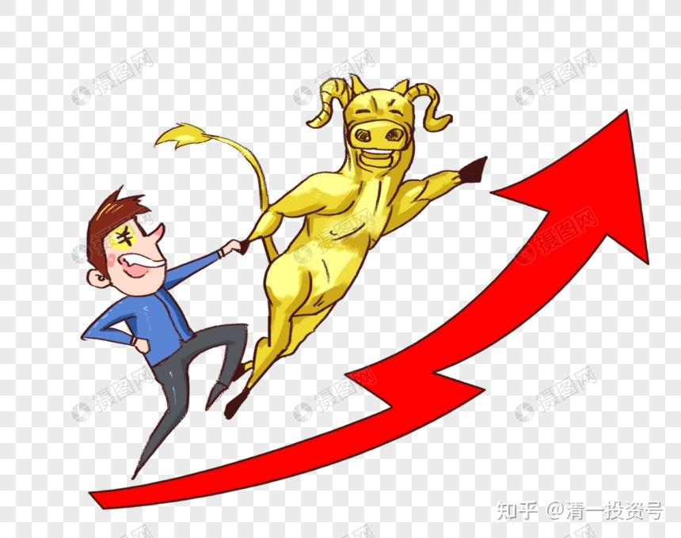
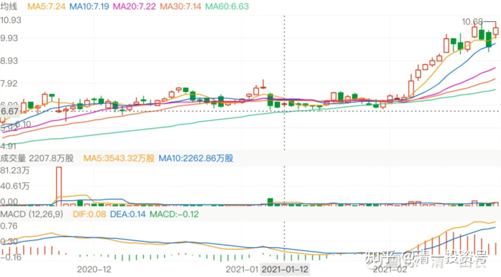
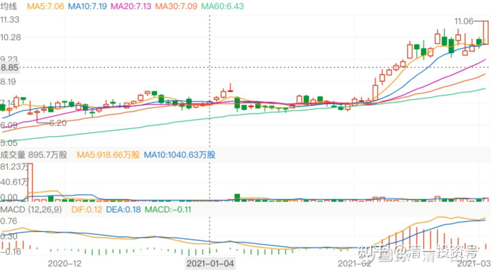
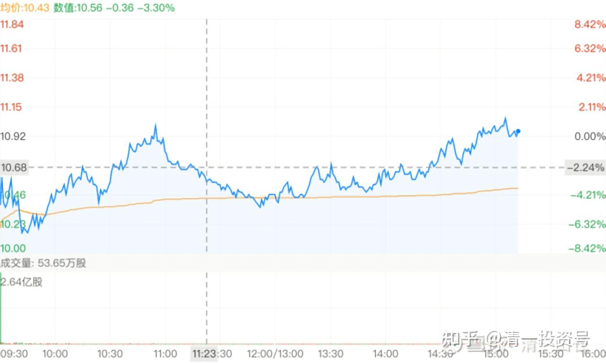
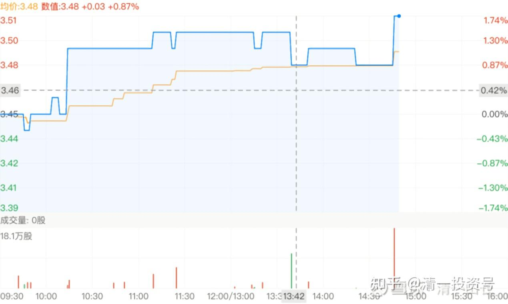
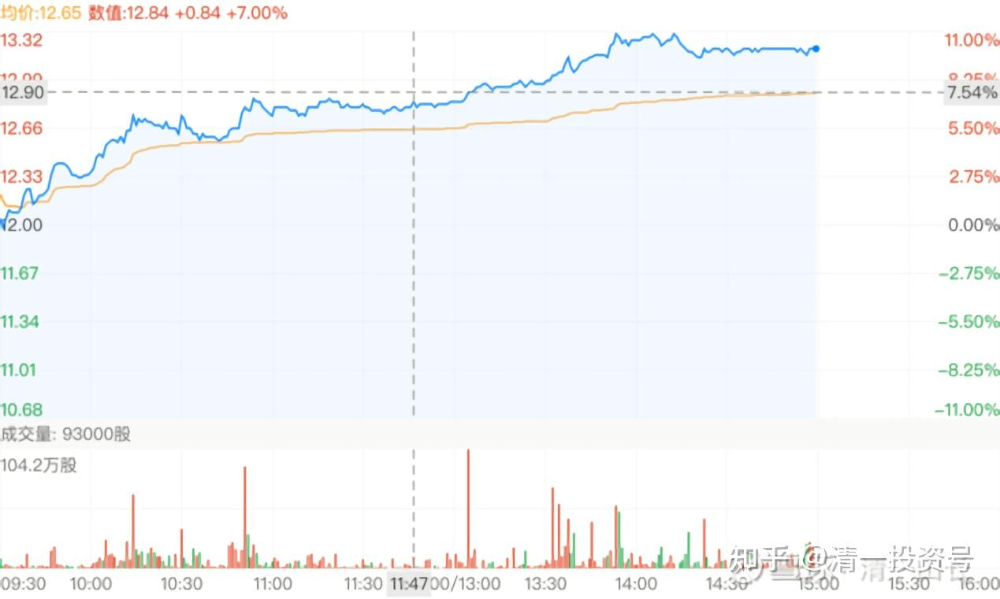
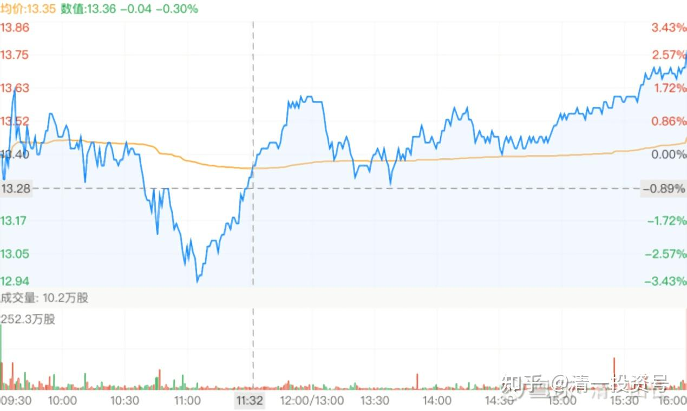
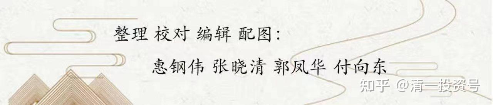

**

**

10篇.中国宏桥系列之十：宏桥不断创新高的盘面动态及操作策略

清一山长2021年02月～2021年05月

导读：

1. 中国宏桥也玩高位洗盘？

2. “押宝”中国宏桥分享新能源汽车的盛宴

3. 不推荐现价买入中国宏桥的逻辑

4. 港股“认死理”的投资策略

正文：

**一、中国宏桥也玩高位洗盘？**

[清一山长](http://link.zhihu.com/?target=https%3A//xueqiu.com/9310099567%2522%2520%255Ct%2520%2522https%3A/xueqiu.com/u/_blank)[2021-02-16 10:43](http://link.zhihu.com/?target=https%3A//xueqiu.com/9310099567/171855677%2522%2520%255Ct%2520%2522https%3A/xueqiu.com/u/_blank)

[$中国宏桥(01378)$](http://link.zhihu.com/?target=http%3A//xueqiu.com/S/01378%2522%2520%255Ct%2520%2522https%3A/xueqiu.com/u/_blank)宏桥也“抱团”了？已经接近2017年的新高了。前段时间放掉的1M多的股份，让我现在少赚了1M多大洋[笑]。恭喜拿走了我分享出去的股票的朋友，这钱就是你们该赚的。因为我一向是反向指标，卖了就涨，买了就跌。宏桥守了很多年了。不过现在手上我还有接近4M的货，继续涨，我就继续慢慢地卖。跌了就慢慢买。长期持有，去年宏桥还买过3元多的呢！我真替卖给我股的人喊冤。3元多，怎么能卖呢？忍住就行了。只要公司靠谱，这种行业第一的公司，长期持有，就不担心踏空，也不担心T飞。资金高价卖掉，回来去买其他没涨的股，没觉得亏了啥。

中国建筑未来也一样，我的长持股，跌了就慢慢买，涨了慢慢卖。

[清一山长](http://link.zhihu.com/?target=https%3A//xueqiu.com/9310099567%2522%2520%255Ct%2520%2522https%3A/xueqiu.com/9310099567/_blank)[2021-02-26 00:12](http://link.zhihu.com/?target=https%3A//xueqiu.com/9310099567/172789195%2522%2520%255Ct%2520%2522https%3A/xueqiu.com/u/_blank)

[$中国宏桥(01378)$](http://link.zhihu.com/?target=http%3A//xueqiu.com/S/01378%2522%2520%255Ct%2520%2522https%3A/xueqiu.com/u/_blank)这个走势很有意思——像是在洗盘一样。港股也玩洗盘游戏吗？

这种洗盘手法，往往意味着有新的较大的资金进入，未来预期会有较大涨幅。所以，我就先不动了，继续看看再说。

[清一山长](http://link.zhihu.com/?target=https%3A//xueqiu.com/9310099567%2522%2520%255Ct%2520%2522https%3A/xueqiu.com/u/_blank)[2021-03-03 15:25](http://link.zhihu.com/?target=https%3A//xueqiu.com/9310099567/173346864%2522%2520%255Ct%2520%2522https%3A/xueqiu.com/u/_blank)

[$中国宏桥(01378)$](http://link.zhihu.com/?target=http%3A//xueqiu.com/S/01378%2522%2520%255Ct%2520%2522https%3A/xueqiu.com/u/_blank)前几天看K线图，就感觉是高位洗盘、换手，下一步应该还有新高。所以就没有继续卖货，等待看走势确认。今天果然创新高了。恭喜长期持有宏桥的战友们。也恭喜拿到我放出去1M的伙伴们。大家同喜！

[清一山长](http://link.zhihu.com/?target=https%3A//xueqiu.com/9310099567%2522%2520%255Ct%2520%2522https%3A/xueqiu.com/u/_blank)[2021-03-11 15:17](http://link.zhihu.com/?target=https%3A//xueqiu.com/9310099567/174157030%2522%2520%255Ct%2520%2522https%3A/xueqiu.com/u/_blank)

[$中国宏桥(01378)$](http://link.zhihu.com/?target=http%3A//xueqiu.com/S/01378%2522%2520%255Ct%2520%2522https%3A/xueqiu.com/u/_blank)今天是多空大交战。开盘两分钟，就有超过30亿元的换手。低开5%不到。后面算是正常吧！

看样子，宏桥已经到了多空分歧较大的关口了，显然今天是多方获胜，股价上行了。所以，后市应该表现更好。计划是继续观望，等待机会。

[清一山长](http://link.zhihu.com/?target=https%3A//xueqiu.com/9310099567%2522%2520%255Ct%2520%2522https%3A/xueqiu.com/u/_blank)[2021-03-12 14:36](http://link.zhihu.com/?target=https%3A//xueqiu.com/9310099567/174263125%2522%2520%255Ct%2520%2522https%3A/xueqiu.com/u/_blank)

[$中国建筑(SH601668)$](http://link.zhihu.com/?target=http%3A//xueqiu.com/S/SH601668%2522%2520%255Ct%2520%2522https%3A/xueqiu.com/u/_blank)今天的量好大，一直在坐电梯[捂脸]。准备继续坐下去。冷板凳坐十年。港股第一重仓的中国宏桥，我这冷板凳已经牢牢地坐了五年，现在取得了超过中国建筑的收益，成为现在的个股收益之王。我认为未来的王位，还是中国建筑的。

[清一山长](http://link.zhihu.com/?target=https%3A//xueqiu.com/9310099567%2522%2520%255Ct%2520%2522https%3A/xueqiu.com/u/_blank)[2021-03-13 06:24](http://link.zhihu.com/?target=https%3A//xueqiu.com/9310099567/174265956%2522%2520%255Ct%2520%2522https%3A/xueqiu.com/u/_blank)

[$彩生活(01778)$](http://link.zhihu.com/?target=http%3A//xueqiu.com/S/01778%2522%2520%255Ct%2520%2522https%3A/xueqiu.com/u/_blank)今天3.50买入的这根今天最长的成交线，就是我买的。也没啥逻辑，主要是今天12.30～12.40元区间，卖出了几十万股中国宏桥，账上有钱发烧，就总想找点东西买买看。看中了彩生活，是因为2018年，彩生活8元的时候，中国宏桥才3～4元。现在中国宏桥涨了三四倍了，彩生活却跌了一多半。差价6～7倍了。感觉也许可以买了。但研究不多，只挂了47万股的单子。成交回报是287000股。我看雪球上这个线是19.1万股，不知咋回事。我是主买。

**

**

**二、“押宝”中国宏桥分享新能源汽车的盛宴**

[柳随风77](http://link.zhihu.com/?target=http%3A//xueqiu.com/n/%25E6%259F%25B3%25E9%259A%258F%25E9%25A3%258E77%2522%2520%255Ct%2520%2522https%3A/xueqiu.com/u/_blank) 2021-03-12回复[清一山长](http://link.zhihu.com/?target=http%3A//xueqiu.com/n/%25E6%25B8%2585%25E4%25B8%2580%25E5%25B1%25B1%25E9%2595%25BF%2522%2520%255Ct%2520%2522https%3A/xueqiu.com/u/_blank)：

涨多了就卖，去买没怎么涨的，窃以为这个思路不见得正确。现在宏桥的股价差不多接近2017年的历史最高位不假，但基本面情况和2017已经判若云泥。2017那会负债高企，盈利也就60多亿；现在流动性完全缓解了，产业链的海外布局也初步完成，铝价波动不大的话，今年200亿利润肉眼可见。这时抛出，殊为山长兄可惜。

清一山长[2021-03-12 19:09](http://link.zhihu.com/?target=https%3A//xueqiu.com/9310099567/174290359%2522%2520%255Ct%2520%2522https%3A/xueqiu.com/u/_blank)回复柳随凤77

我还有很多，不会抛完的。既然是第一重仓股，怎么可能卖几十万股就没了[大笑]。有多的，给想要的人吧！ 有人9元多就做空，这些人咋不听您的这逻辑？可惜都亏死了。[笑]

[蛰伏2020](http://link.zhihu.com/?target=http%3A//xueqiu.com/n/%25E8%259B%25B0%25E4%25BC%258F2020%2522%2520%255Ct%2520%2522_blank) 2021-04-19回复[清一山长](http://link.zhihu.com/?target=http%3A//xueqiu.com/n/%25E6%25B8%2585%25E4%25B8%2580%25E5%25B1%25B1%25E9%2595%25BF%2522%2520%255Ct%2520%2522_blank)：

有幸在2018年国庆财富课上听到山长当时还带着些许“疑惑”给我们分析着新能源车的未来，让我印象深刻。山长当时指出“新能源汽车胜出者不会是传统汽车厂商，有可能是一个从不造车的入局者，判断大概率会是华为，可惜华为没上市，所以不知道谁会赢，华为买不了，只能大买特买给车提供更轻更好材质的中国宏桥，因为不管谁赢，都需要铝板来造车，中国宏桥都是最大的收益者，传统汽车股一个都不敢买。”三年过去了，一切迷雾都在慢慢地一层层解开，答案也快出现了。感恩山长再次对新能源汽车的分享。

[清一山长](http://link.zhihu.com/?target=https%3A//xueqiu.com/9310099567%2522%2520%255Ct%2520%2522_blank)[2021-04-19 11:59](http://link.zhihu.com/?target=https%3A//xueqiu.com/9310099567/177507691%2522%2520%255Ct%2520%2522_blank)回复[@蛰伏2020](http://link.zhihu.com/?target=http%3A//xueqiu.com/n/%25E8%259B%25B0%25E4%25BC%258F2020%2522%2520%255Ct%2520%2522_blank)：

[献花花]你们都记得这么清楚。我都忘了，当年我如此精准的预测华为会造车，而且会成为赢家。当年，华为还没有要造车的任何消息出来呢！押宝中国宏桥，的确帮我赚了很多钱，实现了超过原来的A股第一重仓股中国建筑的利润冠军记录。所以，看样子眼光还是很重要的。看不清，赚钱赚小钱，赔钱赔大钱。看得清，未必不会赔钱，起码赔钱赔小钱，赚钱赚大钱[献花花]。

**三、不推荐现价买入中国宏桥的逻辑**

[柳随风77](http://link.zhihu.com/?target=http%3A//xueqiu.com/n/%25E6%259F%25B3%25E9%259A%258F%25E9%25A3%258E77%2522%2520%255Ct%2520%2522_blank) 2021-04-19回复[清一山长](http://link.zhihu.com/?target=http%3A//xueqiu.com/n/%25E6%25B8%2585%25E4%25B8%2580%25E5%25B1%25B1%25E9%2595%25BF%2522%2520%255Ct%2520%2522_blank):

哈哈，原来如此。不过对于宏桥，我可能比你更乐观一点，我觉得宏桥的合理估值在25以上，当然，能不能到这个价格另说。中国建筑么，估值肯定是低的，成长性可疑。所以，除非宏桥基本面或者铝行业有重大变化，我在可预见的今后还将继续持仓宏桥。

[清一山长](http://link.zhihu.com/?target=https%3A//xueqiu.com/9310099567%2522%2520%255Ct%2520%2522_blank)[2021-04-19 13:16](http://link.zhihu.com/?target=https%3A//xueqiu.com/9310099567/177514282%2522%2520%255Ct%2520%2522_blank)回复[柳随风77](http://link.zhihu.com/?target=http%3A//xueqiu.com/n/%25E6%259F%25B3%25E9%259A%258F%25E9%25A3%258E77%2522%2520%255Ct%2520%2522_blank)：

我还认为：中国建筑的合理估值15元以上呢[大笑]！起码不会低于10元。但市场就给5元，你有啥脾气？

中国宏桥，我已经卖掉了上百万股。虽然现在依然持有几百万股。我会慢慢卖的。但我不推荐现价买入中国宏桥了。不是不会涨，而是这个价，上下都有可能。真喜欢它，就应该去年3元多买入的（去年3-4元区域，我就在不断买入宏桥，当然，这些买入的现在都卖掉了，算是投机做T的，赚了就走了）。

[清一山长](http://link.zhihu.com/?target=https%3A//xueqiu.com/9310099567%2522%2520%255Ct%2520%2522_blank)[2021-04-19 15:13](http://link.zhihu.com/?target=https%3A//xueqiu.com/9310099567/177530665%2522%2520%255Ct%2520%2522_blank)

[$中国宏桥(01378)$](http://link.zhihu.com/?target=http%3A//xueqiu.com/S/01378%2522%2520%255Ct%2520%2522_blank)末期每股股息0.5元，加上中期起码会有0.15元，今年说不定有0.20元股息，每股一年的股息就拿了0.70元。可去年才卖3元多的。股息率20%，你们还不敢买。是不是傻掉了[大笑]。A股哪里有这种好条件！

**四、港股“认死理”的投资策略**

[清一山长](http://link.zhihu.com/?target=https%3A//xueqiu.com/9310099567%2522%2520%255Ct%2520%2522_blank)[2021-04-21 13:51](http://link.zhihu.com/?target=https%3A//xueqiu.com/9310099567/177749992%2522%2520%255Ct%2520%2522_blank)

没想到就这样涨了，中信股份，一个我看不懂的股。

买入的时候，骂李如成的人很多。因为他10元多买了很多M，被套多年。不得不做资产减值。我想：就当腰斩了的价格，买入李如成看中的企业，应该亏不了太多，看他一路下跌，真不知为啥跌。股息率也不错，就5元多闭眼买了。没想到，还赚了。就是太少，才20W股[笑]。

港股赚钱，真心不易。我在A股玩的一套根本就不管用，价投的思维不管用，照样夹头。技术的看盘技术也不管用，全失灵，只好认死理：**公司靠得住，便宜就买，跌了死拿！涨了就卖。这样才勉强活在港股市场上。**交了不少学费，江南集团、中国华融、民生。但由于分散投资，没有吃大亏。单押港股，再看好都不敢拿。可能亏死你没商量。比如中国宏桥，五六年前我4元买入的，没多久涨到了12元，给机构的配股都在10元以上，美铝也入资了。我怎么会想到去年跌到3元多？大大地坐了一回过山车，白白丢了两千多万的浮盈。当然我的成本已经降到了2元多（分红加高位卖出一些）。只能死拿不放，然后继续再多买一些进来，总不能认输走掉吧？好在股息还可以。但我想，前几年12元高位买入中国宏桥的人，爆仓至少两次了吧？好股，也咬人！还会咬死人。幸亏港股通不能融资。[捂脸]

[清一山长](http://link.zhihu.com/?target=https%3A//xueqiu.com/9310099567%2522%2520%255Ct%2520%2522_blank)[2021-04-22 11:59](http://link.zhihu.com/?target=https%3A//xueqiu.com/9310099567/177855070%2522%2520%255Ct%2520%2522_blank)

中国海外宏洋，我6元卖出的时候，不是认为不会涨了。而是说：还有其他不涨的股可以买，干嘛不去救救跌惨了的股？你去看看去年的中国宏桥，当时多惨？才3元多，4元左右。所以，愿意大方地卖出宏洋，买入没涨的中国宏桥等等。今年反过来，我10元也卖出了中国宏桥，不是认为它不会涨到20元，而是觉得：你看宏洋又跌回当初的买点了，跌破4元，买点回来吧！总是这样当好人，都去救落难王子，放掉光彩万丈的白马。结果账户也越来越好了。

**一句话：涨了要舍得卖。跌了要敢于买。套住了也敢买，要跟优秀的企业共度难关。**这样，当你抱不贪的心来操作，进出，就能得到最好的回报了，市场送给你的好心态的利润！[笑]

不过，我知道：说起来容易，做起来难。因为你们涨价，就要抢。更别说分点给人了。一跌你们先跑，生怕跑慢了吃亏。不像我，**不怕吃亏，愿意吃亏，才能赚到钱！**

[清一山长](http://link.zhihu.com/?target=https%3A//xueqiu.com/9310099567%2522%2520%255Ct%2520%2522_blank)[2021-05-04 15:07](http://link.zhihu.com/?target=https%3A//xueqiu.com/9310099567/178943830%2522%2520%255Ct%2520%2522_blank)

[$中国宏桥(01378)$](http://link.zhihu.com/?target=http%3A//xueqiu.com/S/01378%2522%2520%255Ct%2520%2522_blank)真不好意思[滴汗]，上个交易日（4月30日）。看到宏桥12元多了，觉得很满意这个价格，想卖掉几十万股宏桥，去换别的一个相当低估的股票。没想到系统却无法交易。因为我用的港股通。而这天，港股不通[滴汗]。没想今天就涨了10%。差一点又变成我的笑话——卖了就涨！一直知道我是反向指标，这反向指标真灵！大家小心，千万别跟投。宏桥这个价格以上，我只卖不买。我胆小，我去买其他没涨的去。祝福所有进来持有宏桥的人。我还有3M左右，我会一路慢慢减持的。像马化腾减持腾讯一样，闹笑话给大家开心。我认为宏桥涨到20都没毛病，我只是心疼一些没涨的股，比宏桥3元的时候还低的股。这段时间的宏桥特别奇怪，常常涨一天，跌一天的，没啥道理好讲。用国内的操盘手法来看，就是洗盘，这个价格洗盘，应该会涨到更高吧？

[清一山长](http://link.zhihu.com/?target=https%3A//xueqiu.com/9310099567%2522%2520%255Ct%2520%2522_blank)[2021-05-06 17:06](http://link.zhihu.com/?target=https%3A//xueqiu.com/9310099567/179088312%2522%2520%255Ct%2520%2522_blank)

[$中国宏桥(01378)$](http://link.zhihu.com/?target=http%3A//xueqiu.com/S/01378%2522%2520%255Ct%2520%2522_blank)买气很强劲。铝价高涨。带来的股价上升。

柳随风77 2021-05-06回复清一山长：

我现在就怕铝价涨得太快会崩了，最好横盘不动的就维持现价，这个利好就够宏桥消化一年了，今年利润妥妥的250亿+真心希望铝价稳住不动了。

[清一山长](http://link.zhihu.com/?target=https%3A//xueqiu.com/9310099567%2522%2520%255Ct%2520%2522_blank)[2021-05-06 18:01](http://link.zhihu.com/?target=https%3A//xueqiu.com/9310099567/179094016%2522%2520%255Ct%2520%2522_blank)回复柳随风77：

今年就算真赚到了250亿，而且宏桥每年都有250亿，都成高峰。宏桥也就5PE。也许能涨到10PE吧？但是，铝价一跌，分分钟10PE。所以，现在一些前瞻三年才3PE的股，也许比宏桥更值得购买吧？我在考虑是不要加快换股了。

我命不好，恐高！

（标题为编者所加）

参考链接：

[清一投资号：1篇.中国宏桥系列之一：建仓原则](https://zhuanlan.zhihu.com/p/493191191)（整理文）

[清一投资号：2篇.中国宏桥系列之二：安全边际及基本面分析](https://zhuanlan.zhihu.com/p/500915231)（整理文）

[清一投资号：3篇.中国宏桥系列之三：上涨过程中的技术分析与心态把握](https://zhuanlan.zhihu.com/p/505157634)（整理文）

[清一投资号：4篇.中国宏桥系列之四：股价走好，不放松对基本面的分析判断](https://zhuanlan.zhihu.com/p/508644489)（整理文）

[清一投资号：5篇.中国宏桥系列之五：遭遇机构做空消息后的理性分析](https://zhuanlan.zhihu.com/p/511924857)（整理文）

[清一投资号：6篇.中国宏桥系列之六：宏桥复牌后的基本面分析及盘面动态](https://zhuanlan.zhihu.com/p/518969047)（整理文）

[清一投资号：7篇.中国宏桥系列之七：坐过山车的正确姿势](https://zhuanlan.zhihu.com/p/522245519)（整理文）

[清一投资号：8篇.中国宏桥系列之八：最黑暗阶段基于理性判断下的信心](https://zhuanlan.zhihu.com/p/525208172)（整理文）

[清一投资号：9篇.中国宏桥系列之九：宏桥反转后的估值对话及操作策略](https://zhuanlan.zhihu.com/p/528290334)（整理文）

