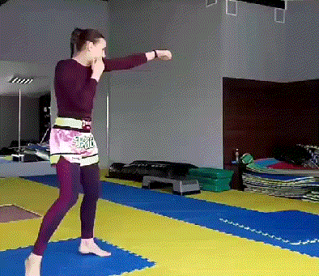

以拳击为代表的“现代格斗”，采用的是“弱侧置前”，把不太能够发出力量的手，一般是左手，作为“前手”，而把最重要的打击手，往往是右手，作为后备队，放在后面。拳击把这个姿势，称为“正架”。意思就是这才是正常的标准动作。

从意图上来看，你就可以清晰地知道：前手拳，由于无法发出外家拳需要的力量，因此是不太重要的拳。主要用途是干扰，掩护更有威胁力的右手拳的出击。因此，一般前手拳，就是“刺拳”，很快，但是没啥力量。主要目的，是在吸引对方的防守注意力之后，趁机用后手击出强有力的后摆拳，后直拳，给对方造成较大伤害。记得一次看一龙和播求的实战。一龙被打摇摇摆摆的时候，下面可能是他的教练，队友，一直在大叫“前刺后摆”。你听了就知道：摆样子的时候，一龙可以秀秀少林功夫，真打实战，一龙练的真不是啥中国传武，就是现代格斗。我真没看出他在擂台上，有啥“传武的格斗思维”和格斗模式。他就是一个现代格斗手，包装成中国功夫罢了。他就是一个“流量明星”，利用中国人对传武的热情，为各方牟取好处的。可惜现在自媒体太发达了，他的表演穿帮了，所以这个前明星，现在就谢幕了。跟播求这种实力派相比，真心不是一个级别的。

泰拳的前手拳，也一样是干扰性质。甚至是防守性质的。会更多用于测试距离，或者控制双方的距离使用。我们的小拳手，居然会用前手拳来击中他们，让他们有些发蒙。可能就没有想到前手拳，也可以直接打人吧？

太极的前手拳，担负着比后手拳更重要的任务。因为要负责防御（用里圈手，外圈手画圈防卫）和进攻的双重任务。如果双手都处于防卫状态的时候，特别用里圈手防卫的时候，有点像猫洗脸的动作。这是用两个前后距离不同的圆圈，防止了对方对于头部的袭击，基本上不太可能漏手进来。所以，太极的防御，相比外家拳，是很严密的。

另外，前手也负责有机会就实施攻击的任务。就是“弹手”出去，发力方式不像刺拳。是用全身一抖，就可以发出的“弹手拳”。如果被击中，还是比较难受的。这种发力的速度极快，超过刺拳的速度。作为打乱对手防御的技术，还是很有效的。

不过，前手拳，更重要的任务，是要用灵活的“控手”技术，为后手拳打开攻击的通道，直击对手的核心要害。一般有两个方法，一个是用“挑手技术”，把对方的防守拳挑开后，后手拳进击中线的要害部位。另一个是用“压手”法，从外侧压制住对方的防御手。然后用后手实施重力攻击。之后前手也顺势反弹，跟进攻击一波。这就是太极的“化打合一”技术。为了很好的实施这个技术，需要快速的“贴身进步”。因此，太极对于步法的要求，要比泰拳高得多。如果我们要对付“强调硬度”的泰拳，自然要用“更加灵活”的身法步法，让对方的硬度和力量都无法发挥。不然就会被泰拳狂殴。因此是否练出了“身步合一”的前手拳，就是一个太极格斗手是否合格的标志。但要练出这一点，比练出“迎门三脚”要难多了。毕竟---“打人容易控人难”，这种技术要用的是控人技术，当然难度更高了。一些所谓传武人，连打人都不会，就别谈“控手”了，他们的所谓控手，就是师徒之间的玩。慢悠悠的当然可以控住。但如果是格斗场上，极其快速的攻防中，你能控住对方的身形，这才是真功夫。难度真不是一般人能做出来的，小木兰们，现在也做的不好。特别是技术良好，反应快的拳手，是非常难控住对方的。这几个月，其实都在练手上的空手攻击技术。因为前几次实战，技术储备不够，只能用迎门三脚来取得胜利。希望以后，用手也能够制服泰拳手，就证明木兰们的水平提高了。

好了，既然前手拳，要担负的任务如此艰难，自然必须派出人体上最强的队伍上去。所以，中国传统武术，与现代格斗的核心区别之处，就是“强侧置前”。把我们人体上，攻击力，灵活性等表现最强的手，放在前面，作为先锋官。负责给对方造成最大的困扰。这就是由于“格斗哲学”的不同，导致防卫式都很不同的原因。并不是因为我们的小拳手都是左撇子。（现代格斗手，采用右侧置前的姿势的人，大多数是左撇子）。

另外，由于发力方式不同，我们不是如同现代格斗一样，用身体支撑，左右换手分别轮换发力的方式。我们是身子弹抖发力的姿势。所以，我们的前手控手，和后手直拳的攻击，是可以在同一时刻完成的，不需要分先后，甚至不需要相同方向。我们控手可以发出横力，或者向后的勾力，但攻击手发出向前的直力。让对方的系统判断失灵，不知道如何去应对两种完全不同方向的力量。大多数人面对这种相反方向的劲道攻击时，都是瞬间傻掉的。所以泰拳女子冠军，非常不愿意和小木兰们对练攻防。她一般对练一会儿，就赶快去叫男拳手过来顶住，说她们都用双手拳，太难对付了。所以就交给男拳手来对付。你们在上一篇文章里面的视频中，看到了男拳手与木兰的对练结果了？男拳手们，其实也是不知道咋对付这种怪拳的。只能是不断的退让，躲闪，完全失去了积极进攻的欲望，还不断的被攻击到头部，表现很无奈的样子。

传武的这种发力方式，可以让身体的不同肢体，同时发出向前，向后，向上，向下四个方向的力量。传武古语把这叫做“浑圆力”，它像是一个球体向外膨胀伸缩的发力方式，就像爆竹一样。古拳经说这种力量，是如【巨炮摧薄壁】。 现在很多人以为是俄罗斯的超级大炮，就叫巨炮。认为是古人的想象和文学词汇。其实这个炮，是“炮竹”的炮，不是现代大炮的炮。这个炮竹有多大？-----你这个人有多大，它就有多大，所以叫“巨炮”。你练拳发力，就要把自己变成一个“超级大炮竹”，才能发出这种力量，“劲发四梢”。所以，也称爆炸力。这种力的源头，爆炸力的中心点，是丹田。所以也称“丹田发力”。张三丰拳经说的【刻刻留意在腰隙】，指的就是这种力量的发力中心，必须随时关注。必须在腰部松软的状态下，才能发力。如果身子僵硬，紧张，是不可能发出这种力量的。马保国，雷雷，上擂台比赛，身子都超级僵硬，一打就直挺挺的倒下。他们怎么可能懂得这种力量？只是搬了一些名词来，根本就没有修到身上。

简单地说：外家拳的攻击，有点像是子弹，是一条线的。如果你站到这条线上，就是找死。至少得找个盾牌来防住。而内家拳的攻击，有点像是一个炸弹，攻击的距离虽然不远。大约就是几公分的样子。但你只要站到炸弹的距离里面，就会被击中，而且让你不知道如何防守，因为攻击点太多了。这就是两种拳的差别。

当我们小拳手这样玩手部的拳攻击对练时候，泰拳手就觉得很搞笑：因为他们认为我们的小木兰是外行一样，居然用“双手同时出击”。就纠正她们说：这样用双拳同时打出来，是没有力量的，只有很不专业的初学者，才会用这样的想当然的技术。泰拳手这样说，其实是对的。因为外家拳的发力方式，是要用扭转腰胯，用腿蹬地的协调发力，才能打出强大的攻击力量。专业拳手与普通人的差别，就是普通人只会挥拳，不会发力。打上去也没有啥伤害性。双拳同时出击，就不能扭腰转胯，当然不可能发出像样的力量来，跟普通人的拳力就差不多了。小木兰见他们说这种拳不能发力，就比较调皮，要同冠军哥哥比一比拳力，看谁的力量更大。就先让冠军哥哥用“正宗拳法”，去单手大力击打拳馆的沙袋。然后小木兰用双拳去全力击打。结果很明显木兰的打沙袋力量，比泰拳手单拳的撞击力量更大（别忘了小木兰使用全身发力打出来的力量，即使单拳也不会比男拳手差很多，双拳自然力量更强了）。结果泰拳手看了傻眼----只能强行来解释---你用两只手打的，当然力量比我一只手打的力量更大了。不再说她们双拳无法发力了。只是他很纳闷：怎么自己用双手，就打不出这种力量？还不如单拳好用力？

另外，外家拳的前手，格斗式的时候，是缩起来的。因为要随时准备出拳和防守，因此保持曲臂收缩防守的姿势，才是“正确的标准动作”。如果伸手出去，就是无力的，也不可能发力。因此是拳手的忌讳。

但实战太极的前手拳，正常情况下是伸出去的，并不收起来。只是不伸直，而是曲臂竖起来在面前，前手也不固定动作。而是不断的划小圆圈。配合身子的动态，进行开合的变化。后手在靠近身体的距离里面，也是用肩膀来画圈的，手部动作并不多。正好与前手的圈子阴阳对应。前手拳，和后手拳，这样画圈的结果，加上用侧身面对攻击的对手，自然就形成了“两道封锁线”。对方的拳脚，要想钻进来攻击头面部，就必须越过这两道防线。显然这种防守方式，比现代格斗术的防卫要严密得多。张伟丽如果采用这种方式来进行格斗准备，肯定就不会被罗斯KO了。可她是先进的“现代格斗式”，准确地说，是“很厉害的”泰拳格斗防卫式。难道她不知道侧身防卫，正面暴露的面积更小， 她更安全吗？她当然知道---但由于现代格斗的发力模式，如果采用类似太极的“侧身防卫”的话，她们的双手出拳动作，技术手段，就必须全面改掉。技战术会受到严重的影响，可能都不会打拳了。因此，她只能冒险，留下中间的漏洞，设法用技术和反应来弥补了。

太极为啥可以前手远远伸出去作为防守动作？这样虽然可以形成一道防守线，但同时不是丢失了前手的攻击力吗？对于格斗手来说，这样不是巨大的战力浪费吗？其实不是的。由于太极不是用手臂的伸展来发力的，不同与外家拳。太极拳的前手，就算是伸直的状态，只要身子一抖动，手上就会发出不小的力量。因此：太极伸出去的手，别以为不能发力，是可以一动就把人打趴下的。不过----如果你没有学会这种发力技术，你摆出这个姿势，就是雷雷了。只能吓人用，实战就不行了。还不如用王八拳更方便。王八拳，其实就是没有受过训练的人，为了发出手上的打击力量，面对格斗需要的时候，本能会采用的腰胯扭转带动拳头来发力的方式。因此，无论平时是练什么拳的，只要没有练出真功夫，一上擂台，就只剩王八拳才可以用了。只有日积月累，学会了特别的格斗要领的格斗高手，才会采用不是本能的，本派核心的技术动作来打架。怎样体现本派的核心动作，随心应手地发出力量，这一点是所有拳派的人，都要刻苦钻研的，不是日常比几个招式动作就行了。因此，看着简单，做起来难。

OK，这就是太极格斗的前手拳，与现代格斗的不同。你可以自由选一种你喜欢的方式来练拳，不可能投机取巧，你想两种拳技术都用。就是四不像了。内不内，外不外的。内家拳和外家拳，没谁更厉害，都可以打死人的。并不一定练内家拳的就会赢，你没练好，上场一样会输掉。但在相同的训练强度下，显然掌握了内家拳技术的人，会更有优势一点。因为格斗哲学不同，打击点增加了一倍，同样训练程度下，当然内家拳更有优势了。只是:要学会内家拳，你必须找到懂拳的好师父。而不是只懂比划动作的假把式。

*现代格斗的前手拳出击方式*