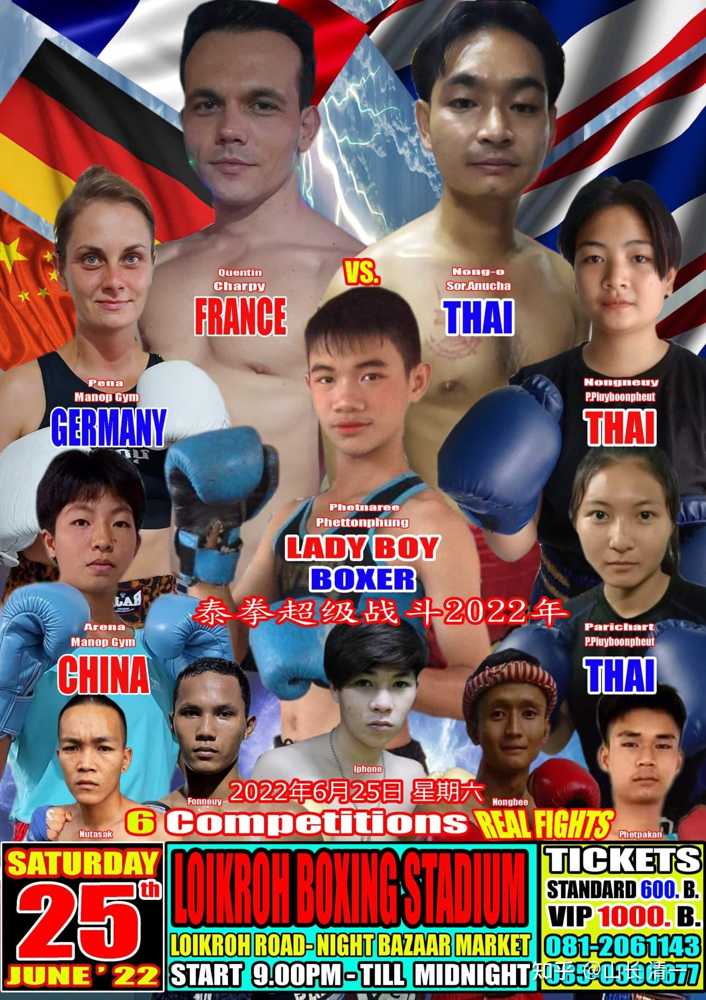
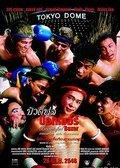
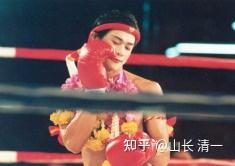

下图是本周末安排的泰拳赛的海报。看了海报，我不知道是有六场比赛要打（似乎对于泰拳比赛来说，只打6场实在少了一点）。还是有六个冠军要参加这次比赛。票价是600-1000B。 佳惠木兰是其中的一个参赛者（英文名ARENA)，这是她的职业第三战。第一战是稀里糊涂地KO了泰拳手，为此还哭了一场，觉得自己太狠心了。第二战就是直接挑战泰拳的金腰带，五局比赛，都是一路追打对方，正常人都知道她赢麻了。但由于没有KO对手，结果裁判最终居然判她输了（我的文章中有这次实战的视频）。她认为裁判太不公平，又哭了一场。女孩就是麻烦。输赢都有理由哭一场。但后来约战泰拳手的几次比赛，对手都突然赛前放弃比赛，所以这两个月，就没有打实战，都在自己在训练提高。这次拳馆安排了这场商业比赛。也没当回事，也没特别备战，每天照样练拳就完了。

*木兰佳惠的周末拳赛海报*

海报上面，排在佳惠上面的这个德国女拳手，她们是同一个拳馆的。昨天晚上，小木兰们与她试了一下模拟实战。小木兰们说：她太软了，想怎么打都很容易。比泰国的冠军女拳手，实力硬度都要差一些。也就是普通拳手的水平。所以，昨天双方试手的时候，得尽量的收着打。速度反应，都比我们的小木兰差一个级别，真出手都怕打坏了。当然了，每次去拳馆，都是跟泰拳的男冠军打模拟实战的小木兰，连女拳冠军都不当回事的人，要来打女生，当然觉得不过瘾了。

木兰明晓没有排进名单里面。因为她体重太轻了，很难找匹配的对象。所以没有安排她的比赛。她就去找馆长说：我不在意体重级别，重10公斤的对手都可以安排。因此，教练让她周末也一起去赛场，可以考虑“临时配对”比赛。

佳惠的对手是谁？什么级别？泰方没有告诉我们这些信息。我们也不在意到底打谁。谁来都一样打吧。也许是泰拳的冠军女拳手，也许不是。如果真有六个泰拳冠军出场的话，估计对手实力也不俗。由于我为了安排比赛，跟泰拳馆长约定，木兰们每次输了比赛，我就要给他钱的。因此---难说泰国人会安排很强劲的对手来打。不过，我认为泰国还没有能够打赢我们木兰的女生，因此我并不担心。

不过，对这次拳赛，我们最好奇的是：居然看到海报中宣传的拳手，是一个LADY BOY，站在海报的核心位置。这就是所谓的“人妖”。不知道给他安排的比赛，是女子比赛?还是男子比赛？从原来的惯例来说，他应该参加的是男子比赛。

泰国怪事多。有一个泰国的电影【美丽拳王】，就是根据泰国的真实故事拍的电影。一个泰拳男拳手，自认为自己是女生。上场就是不肯脱光上衣，觉得女孩子怎么能像男生一样不穿上衣的。每次比赛，一定要像女生一样穿背心来打，还化妆。男拳手们都觉得：跟一个伪娘打，实在太掉底子了。偏偏她功夫还很厉害，经常把男拳手们都打翻了，KO了，拿了男子比赛的冠军。“她”最让对手无语的动作，就是KO打翻对手之后，她再去深情地亲吻一下这些失败者，实在是气人。后来赚到足够的钱，就拿来做了变性手续，去圆自己的女人梦。2004年她在曼谷开了一间[泰拳](http://link.zhihu.com/?target=https%3A//baike.baidu.com/item/%25E6%25B3%25B0%25E6%258B%25B3/76765)训练营。她参加过多次选美比赛，也赢得过美后头衔，她做过演员，当过模特。因此成为泰国的一个热点故事。据说当年他拿到泰国仑披尼轻量级全国冠军的时候，正好是中泰散打比赛开打，她要求也参加。但被中方拒绝了。理由就是找不到合适“她”打的对手。的确，一个假女人，连男人都打不赢的正宗泰拳仑披尼冠军，如果来跟中国的拳手打。女生肯定是打不赢的。男生就算打赢了，也是一个笑话，假如输了，就更丢人的了。因此被中国武协拒绝她参赛，也一点也不奇怪。

这一回，泰拳比赛上，海报又出现了LADY BOY，显然是一个新的泰国的“美丽拳王”。这一次，“她”的对手是谁呢？看样子，是照片下面的这个突出的白皮男生。他的比赛水平怎么样？我们可以周末去看看结果。

我倒是有一个新的创意：要不这次去比赛的时候，我们就跟主办方说：下次可以安排我们的小木兰，与这个泰国伪娘打一场实战比赛，真女人打假女人，肯定会很卖座的。我们也拿这个新版的【美丽拳王】来试试招，看木兰们和男拳手擂台实战，有无机会。输赢也不放在心上。Real Lady VS Lady BOY，看是中华真女子厉害呢？还是泰国的伪娘更有本事。说不定，以后木兰们就可以参加男子泰拳比赛了。

下面传两个小木兰们，在拳馆与职业男拳手的模拟实战视频，你们看看我们的小木兰，跟男生打，是不是一点希望也没有。不仅体重明显超过她们很多，而且对手都是职业拳手，特别是第二个视频，对练的对象是泰国现任泰拳冠军，仑披尼赛场打出来的明星级选手。由于我交代：木兰的腿法已经很厉害了，去拳馆就不要用自己的长处，与泰国拳手们比。跟他们拼木兰们“相对较弱”的拳法好了，提高一下赛场反应。所以，这两场模拟实战比赛，都是纯拳对练，不使用腿法。你可以当“拳击比赛”看。前面两篇文章，分析了太极的拳法，与现代格斗的拳法区别。你们可以从视频中直观地看到两种不同格斗技术之间的实际表现和差别是什么。男拳手的表现，就是典型的拳击攻防模式，一板一拍的。木兰们看样子很不正规，双手撒开，步法更灵活。看上去潇洒多了。更重要的是：体重比她们重十几公斤的男拳手，赛场上是被她们逼得步步倒退的。你没有理由怀疑，本周末赛场上的比赛，一定也是我们的木兰，会逼得泰拳手步步倒退的。赛场上，使用中华武术的我们，才是主导一方。

[!\[image\](images/img_004.jpg)

与超体重十几公斤的男拳手对练 https://www.zhihu.com/video/1522939334604484608](http://link.zhihu.com/?target=https%3A//www.zhihu.com/video/1522939334604484608)

第二个视频：与泰拳男子冠军的对练

[!\[image\](images/img_005.jpg)

明晓与泰拳男子冠军的拳对练 https://www.zhihu.com/video/1522940206063321090](http://link.zhihu.com/?target=https%3A//www.zhihu.com/video/1522940206063321090)

通过这些视频，你大致上知道：木兰们如果真的安排了与【美丽拳王】的比赛，未必会是一边倒的比赛。很可能是势均力敌的战斗。甚至是有可能取胜的。

不过，没上战场之前，一切都是猜测。清一派是实战派，不是嘴炮派。我们用实战结果来捍卫中华武术的荣誉。我们会耐心地慢慢打出来的。 一切用结果来说话。