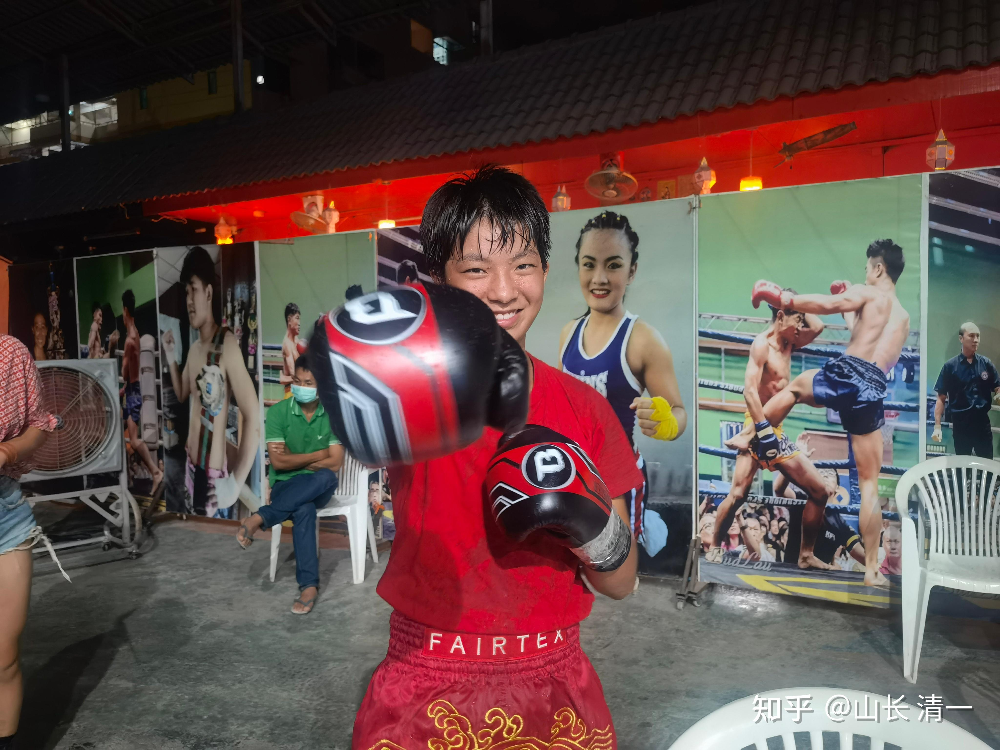

*比赛后木兰佳惠在拳场的留影*

昨晚在清迈塔佩门附近泰拳馆比赛现场，木兰佳惠轻松击败了泰国对手，取得了清一太极征泰第五场比赛的胜利。本次比赛，展现了更多的太极格斗特色。为了做一个对比，我把泰拳的纯泰比赛视频，也放了一个出来供你们比较。你们可以比较一下两者的不同。如果有人就是眼盲，认为我们的木兰打的太极格斗，跟泰拳没啥区别。根本就不是传武，不是太极，下面我写的内容，就不用看了。继续坚守你心中的梦幻吧。昨天我没有去现场“观敌料阵”，而是放孩子们单飞，让孩子们自己跟拳馆的教练和同伴们一起去。我认为我不根本就需要现场指导。如果她已经做好了准备，不需要的随时监控。如果她没准备好，我现场叫破喉咙也没用。道家是先胜而后战。因此，我只是让不上场的三个小公主去陪佳惠，发现她场上有不注意的地方，就及时提醒。出发前，我交代了这一场比赛的打法和战术要求。让伙伴们提醒她：不要偏离比赛的目标----打赢不是目的，赢得漂亮，才是我们这一场比赛目标。实力过人，赢没有悬念，就做一点“观赏性”的内容。

[!\[image\](images/img_002.jpg)

纯泰比赛：泰拳女子冠军争夺战 https://www.zhihu.com/video/1524289025988362240](http://link.zhihu.com/?target=https%3A//www.zhihu.com/video/1524289025988362240)

这个视频中，蓝衣拳手是泰拳的国家队队员，前泰拳女子全国冠军，也是木兰们同拳馆的拳友，刚打完国际比赛回馆。红衣的女子，是现任的仑披尼冠军，实力很雄厚。这场比赛，相当于泰拳女子比赛的一流代表水平。双方实力都不俗。这是去年的仑披尼实战比赛视频。

对比太极对泰拳---木兰佳惠的第三场比赛，两者非常不一样。我们打破了泰拳的固有节奏。场面“以我为主”。小木兰完全主导了赛场节奏。她打的是登记为50公斤级的比赛。超过她正常体重2公斤。意思就是她的对手级别是50公斤，真实体重大于等于50公斤。虽然场上看起来，身高似乎不比佳惠高。估计是身上肉多一些。她在上一周的塔佩门的泰拳比赛中，刚刚KO了对手，是个“狠角色”。虽然下面的视频中，看不出她的狠劲所在。但有一记高扫爆头，差点把木兰KO了。可以看出她的实力还是不差的，可惜面对木兰，她似乎就像不会拳的一样。

[!\[image\](images/img_003.jpg)

木兰佳惠的第三场比赛 https://www.zhihu.com/video/1524372415848763392](http://link.zhihu.com/?target=https%3A//www.zhihu.com/video/1524372415848763392)

宋老师是我们清迈建设团队的成员，带着一批建筑工人正在建校区宿舍。佳惠的照片就是她拍的。她昨天是第一次去看现场的实战比赛。前面两次都在外府比赛，她坚守工地，就没有去看。她是首次去现场观战。看到纯泰比赛，她的感受， 更能说明区别吧？【第一次现场看泰拳，冲击力比看视频更强。看别的选手打拳，有点“惊心动魄”的感受，你打我一拳，我踢你一腿，看着都痛。但看佳惠打拳，佳惠占尽上风，几乎不会被对方打到，我看着一点也不揪心，只有“胜券在握”的自在感。

佳惠很棒，山长的教学更是厉害，培养出一批世界冠军的目标已经实现，只等给孩子们更大的舞台，让他们展示平常的实力就够了。山长设定的目标，一开始总是让人不可思议，但最后都能一一实现，实在很令人振奋。虽然此生没有机会成为世界冠军，但能为冠军们提供服务，同样很有福报，也很荣耀 】

以下详细说说泰拳与太极的差别。传武与现代格斗的差别。虽然是相同规则下的比赛，但传武显然使用了完全不同于泰拳的技术来完成规则之内的攻防格斗。

**一：泰拳很少有连续的进攻，更像是阵地战。**往往是双方互攻一腿，一拳进行交换打击，看谁的攻击力更强，或者更耐打，弱的一点就输掉比赛。因此，泰拳手打一场比赛，无论输赢，都是伤痕累累。就算播求这个级别的人，打完比赛，也常常瘸着腿去休息室，甚至坐轮椅走（因为下肢受伤，行动不便）。泰拳就算有一些组合，也是事先练好的“组合套装”，一次输出。因此泰拳的攻防节奏，其实很慢，有点像坦克车慢慢的推进。特别拼体力。只在一方失去防守和攻击能力的时候，才能见到另一方疯狂输出拳脚交加的进攻。

而太极格斗的原则，就是完全相反---我们不跟对方硬拼体力，不正面对抗，不打阵地战，而是打运动战---在运动中消灭敌人。攻击的目标，专门选择打击对手的防守弱点部分。另外--太极如水，就是一旦开始了进攻，就是连续不断的进攻，可能是连续十拳，可能是20拳打出去，把对手打倒才会停下来。这一战，是打五局制的。我要求木兰前三局都尽量放水，压制自己的攻击力，控制自己的进攻节奏，跟对方玩轻接触游戏即可。不真打，也尽量不发力，尽量打平即可。第四局，再开启自由攻击模式。因此，你在前三局，看起来有点像泰拳的打法，节奏相对慢。不同之处，就是泰拳手似乎总是被打的对象。我方后发先至，泰方每次出手都会被反击。所以导致泰拳手缩手缩脚的，都不敢出手攻击。但小木兰也“似乎没有比赛经验”。在明显场面占优情况下，居然不强攻，甚至在对手明显暴露弱点的时候，还突然放弃进攻退走。场上只要对方不出招，我们会尽量憋住自己出招的冲动。弄得前三局，看起来双方似乎差别不太大，泰方也有机会赢的样子。只是到了第四局，我让佳惠可以“自由发挥”的时候，你就会看到典型的太极打法了-----出手不回，连续进攻，极其凶猛，直到把你打垮为止。

木兰佳惠第四局开局没多久，就KO了对手。而且对手连一次还手的机会都没有，你们就知道太极真打起来是啥样的了。以实力而论，木兰可以第一局就直接KO对手。但我不想让泰国人太害怕我们，所以前三局尽量的“装温柔”，从第四局开始，他们会认为我们摸清了拳手的底细，或者对方体力不够了而导致失败的。其实是我们尽量控制节奏，导致的“看起来差别不是太大”的比赛。但裁判显然瞒不住他的眼力，马上判定双方差距巨大。第四局看泰拳手完全没有招架之力，就赶快结束了比赛，以TKO获胜。说明泰拳裁判对拳手的保护还是很周到的。

不过我方拳馆的泰国教练，赛后批评佳惠：出拳的力量不够，回去要加强练习出拳的力量，不然早就可以KO对手了。还要教她下次用重肘来KO对手，说这些女拳手内围不太好。她也乖乖的听着，表示下次再努力。其实也说明了泰拳狠劲的来源------全体的拳馆的教练队友，都在等你KO对手，有机会就毫不容情。对方拳馆的全体伙伴，也是鼓励自己上场伙伴，快速KO掉佳惠的。这种崇拜KO的文化存在，造就的就是强者文化。你可以同情弱者，安慰弱者，但没人去特别的关爱和保护弱者。作为拳手，就必须自强。因此泰拳手上场后王很拼的。

** 二：太极打法的第二个特点，是“目中无人”----面前有人若无人。太极拳手，**不去跟随别人的攻击节奏，相反，要打乱别人的攻防节奏，让别人不得不跟随自己，自己成为场上的主宰。因此，往往是你打你的，我打我的。太极要求是完全压制对手的攻击，让对手无法发挥自己的技术（而不是等你发挥技术，然后我想办法防守你的攻击)。太极的进攻，将造成对手无法出招的局面，无论对方是高手还是低手，最终就都是一样的结果了。也许你们认为昨天的对手不够强。 其实，就算是泰拳的金腰带拳手出场，结果也差不多一样的。泰国拳手平时训练的对象，方法，都是按照某种设定的套路模式来进行的，所谓的“纯泰风格”。他们自己玩的互相很适应，世界各国也学习泰国的模式，已经形成了一套固定格斗模式。但我完全不认同泰拳的格斗逻辑，我认为是“死打，傻打”。是“内卷”。太极采用灵活如水，没有固定套路和模式，我们完全回避泰拳的打靶训练，避免拳手落入【泰拳模式节奏】。因此，太极格斗，是全新的格斗理念的展现。泰拳手们，虽然从小打到大，比赛经验扶丰富，但他们也从来没见过我们这种打法。因此一旦上场，突然面对我们的拳手攻击时，就像“不会出拳”了一样。因为我们的各种太极格斗技术，会让泰拳的进攻技术，几乎完全失效。就自然让泰拳手蒙掉，不知道怎样才能对付我们的拳手。你看视频中的泰国拳手，几乎无法有效击中我们的小拳手，就知道这套太极格斗哲学多管用了。

** 三：太极的抱架很特别，就会让很多的泰拳手不知如何应对。太**极抱架，是两手划圈，护住自己，而且划圈会让对手迷惑，不知道你会从什么方向和角度来攻击。但太极是可以从圆圈的任何一条切线开始攻击（这就是拳馆笑话木兰们“小猫洗脸拳”的实用价值）。更特别的是：太极抱架是“反架”，反架拳手往往是左利者。前手往往没啥威胁力。比如泰拳知名选手省过，就是反架，号称“左腿王”，他的左腿KO过无数的拳手。而太极拳手是右利，右架。放置在体前的前手和前脚，反而是最主要的攻击手。不仅速度快，而且有较强的攻击力。泰拳的后手拳脚，要有效攻击这种反架拳手，攻击速度一定配合不上来。一旦出手试图攻击，就会遭遇一波快速的前手反击。你们看到了木兰们反击的速度有多快。因此，这种结果，就会造成泰拳手对于发动攻击，有点束手束脚的样子，不知道该如何出招。因此往往犯傻像是不会出拳了一样。或者说：泰拳就像老虎，虽然很厉害，但你让它找不到下口的地方，就跟不会咬人一样的结果。这也是老子说的：入山不遇BI虎的意思。把自己放置到对手无法攻击的位置，当然是最安全的。擂台上的最安全位置，就是对方最不舒服的出拳位置。对手为了找到自己舒服的攻击位置，会不断的调整身体去移动，退后等等。我们就是跟随调整位置，步步逼近，让对方永远找不到出击时机。仅仅一个站位，就让对手彻底懵圈了。剩下来的，就是我们的拳手想怎么打，就怎么打了。

** 第四：内围战优势---太极一向提倡近身，贴身作战，因此太极才是内围战的真正专家。**中国人闻之色变的泰拳内围战，肘膝交加，让国人最敬畏泰拳的地方，除了铁腿扫腿，就是内围战了。由于我交代木兰前三局，尽量不进内围作战，不跟对手消耗时间，只是用腿和拳，拒止对方的进攻。一比一慢慢“交换攻防”。但第一局过后，可能对方教练发现远距离根本不是对手，就让拳手进入内围作战，以为中国人不擅长内围。上一次，打金腰带，对方就是见到远距离作战不是木兰的对手，就用内围战来消耗时间的。也造成观众分不清胜负，裁判判谁赢都有可能。吃过亏的木兰，肯定不愿意在内围战跟对方纠缠，就会用太极内围技术，很快的制服对方。你们看视频，就知道泰拳手一冲进内围试图外围战，就会被木兰快速的摔倒，就像一个布娃娃一样，根本没有抵抗的机会。由于用了太极的化力技术，看起来是我们的小拳手力量超大，可以随意摆布对方比自己体重更重的拳手。到了第四局，干脆就一顿连续密集的拳攻。前三局不用快速拳连续展开火力，也没有补上肘膝攻击的大杀器，这是因为我不许前三局就KO对手，因此木兰只是摔倒对方拳手就算了。太极拳，其实摔倒你，是最慈悲的动作。最恐怖的是只摔个半倒，然后用肘膝夹击来KO你。可以很轻易就打断人的骨头。古人就是用着法子“杀人”的。只到了第四局，木兰才发出真正的攻击。前面几局，就算用膝，也是轻轻的没发力。因为不想KO对手。其实到了第三局尾，泰拳手就毫无战意了，完全无望的支撑。第四局才发现：连支撑的可能性都没有，只有退场。

下面做一点场上讲解：

上场之前，我交代木兰：来泰国打拳，要尊重泰国的文化。泰拳手比赛前，要跳拳舞，或者称拜师舞，这是来自于古代将军出征的拜将仪式。泰国人认为很神圣，很尊重泰拳手跳舞。是他们很专业，很敬业的表现。对外国人不跳拜师舞，泰国人会有天然的反感。你为了赢得泰国人的心，让他们接受你，喜欢你，就要入乡随俗。另外，泰拳舞，还有很强的心理稳定的价值，可以让拳手在场上获得更加稳定的心理状态，也可以在赛前放松身体，让竞技状态更好。因此，就算我们中国人不学泰国人的泰舞，你也要在对手跳舞的时候，自己也跳自己的太极拳舞。结果，昨天比赛完，传回视频来，我居然发现：泰拳手拜完拳台四方后，居然没有跳舞。木兰佳惠独自跳了一段太极舞。泰拳手百无聊赖的站在拳台边上看。像是反过来了一样---我们更像泰国拳手一点。我觉得好搞笑。但我想：泰国人肯定会比较喜欢这个“愿意跳拳舞的中国女孩”，也会原谅她“跳得不正宗”的。

拳场上，可以明显看出小木兰出工不出力的样子。有点犹疑不决的，出手出脚也软软的。给人感觉是技术不够好，不太会发力，攻击也不果断。但3分30秒的时候，佳惠抬腿做了一个有力的快速攻击动作，对方吓得快退。其实我看出，她只是故意吓对方的，没打算真出腿攻击。这种速度和力量，才是真实的实力，软软的打，就是放水。对方的阵营（另外一个拳馆的人），是很希望自己的拳手，赢下这个外国人的。特别是中国人，在泰拳手看来，是一个最应该被KO的弱者。因此对方的啦啦队，叫得很厉害，都在叫KO她，打垮她。特别是抱在一起内围战的时候，就叫得更凶了。可能是觉得这是泰拳手KO我们好机会吧？不知道这是太极最好的攻击机会。只是我们没有利用这个机会，装温柔。

第二局开局的时候，看得出对方得到了教练的“面授机宜”，想采用连续腿击来进攻。一开场就两个左右正蹬，外加一个中高扫腿攻击。对方拳馆的拳友看到大力进攻，非常兴奋的大叫起来，为她的攻击鼓气。但善于用腿的木兰，防腿自然不是问题，被轻易破解，还不客气的重重摔了攻击方一跤。泰拳手爬起来后有点不忿，继续来一个扫腿，尚未成型就被木兰一个【上步野马分鬃】给打回去。缠抱中还给了她几个膝击，虽然没有发力，但让泰拳手锐气尽失。但此次内围战，似乎裁判有点消极，因为看到木兰似乎不会发重肘膝，裁判就迟迟不拉开。估计是裁判见泰国选手，并没有吃亏的迹象，就消极对待。因为内围战，中国选手一般不是泰国人的对手。佳惠看对方纠缠不休，就只好锁死对方，准备开打。裁判突然来拉开了（视频6:23秒）。后来佳惠说：好像场上裁判有点偏心这个对方拳馆的样子，不仅仅对她这样。每次我方拳馆的上场拳手，在内围战占上风的时候，他就来赶快拉开。对方占上风，就不管。不过这样也没有帮对方的忙，我方的拳馆派出上场的三个拳手，最后都KO了对方的拳手（你们就知道泰拳实战的KO率有多高了）。后来泰拳手继续想内围抱缠的时候，你们可以看到佳惠是用力推开了对方（6分32秒）。我的赛前要求：即使你想脱离缠抱，只有一：等裁判拉开。二：用力推动对手，破坏其重心，自己快速退开距离。不然你不想伤害对方，想正常退开，但对手一定会趁机袭击，你就要倒霉的。实际上这个拳手，很擅长这一点。第一局尾巴的时候，佳惠退开，她快速抬腿一脚。只是距离不够，没有打中，但泰拳手的速度反应还是很不错的。6.42分，对方一个扫腿，佳惠退开之后快速冲向前，打退对手。正常情况下，这是全方位袭击对方的好时机。但佳惠只是推了对方一下就离开了， 明显不想出重手攻击。

你看第四局她的真正实力的打法：一旦上身贴紧之后，就是一顿密集的连续拳，彻底砸晕你。6:51的一次抬膝，非常明显只是象征性的抬起来，没有砸向对方的腹部，怕伤到对方。今天早上，我遇到佳惠，她说当时就是有意克制了自己的攻击力量。她抬膝攻击，是内围战的习惯。但又觉这种攻击太容易KO人，就强行停下来。好几次都是这样的。造成外行以为她【内围技术不行】的感觉，对方也没有感到压力。这样也不错，可以迷惑对手。不然我们在泰国表现太厉害了，会导致打不下去的。6：55秒，木兰见到裁判迟迟不拉开，佳惠干脆一旋身，泰拳手毫无反应的被脆快地摔翻。这次她起身后，开始意识到：她面对的，是一个无法战胜的对手，攻防技术都很全面。她的动作，就开始犹豫不决了。身体上明显可以观察出来。

7:19，佳惠有一个没站稳的动作，几乎滑到的样子。对方拳迷特别兴奋的大叫起来。但泰拳手斗志已消，并没有抓住时机攻击，佳慧快速恢复抱架。后来我问她咋回事?她说看对手不行了，就想玩一下“转身翻背拳”。但步法没有配合上，所以滑到。我说可能你不太放松，步子太大，转身的平衡没做好。

7：29，佳惠差点被这个“看上去快不行”的泰拳手KO。对手退后中突然打出一个快速猛烈的高扫上头，非常的危险。当时佳惠的后手并没有抬起护头。如果被这一脚高扫到头部，就被当场KO了。不过木兰们平时的训练，是遇到攻击的时候，就立即上步攻击。因此面对这次高扫上头，由于上步的原因，对方的脚只来得及攻到肩部，就被她卡住了腿。如果站立原地，就正好击中了。木兰上步攻击的结果，反而是让对方高扫后站不稳而摔倒，被围圈护住勉强没有跌倒下。裁判马上来拉开，避免佳惠继续攻击。虽然佳慧并不想乘人之危。广播里的叫声，是说这一防守反击很漂亮。我提醒佳惠：要小心一些拳手，会用一副“生无可恋”的消极表情和动作，来让对手消除戒心。以为自己处在“绝对优势地位”，然后突施冷手袭击。比如刚才这个镜头，如果她以为对手不行了，防范松一点，反应慢一点，就着了她的道儿。因此，你可以放泰拳手一马，但别被她们的"软弱表演"所迷惑，不然很可能吃亏。张伟丽对罗斯一战，就是面对高扫，她原地站立防守，导致不小心被罗斯钻过两手的空隙高扫上头，而被一下子KO。她觉得冤极了。但谁让她原地站立呢？木兰们的江湖经验太少， 场上经验很缺乏，我需要多提醒一下。

回合间休息的时候，我见对方教练对泰拳手了交代了什么，她连连点头。我猜是教练让她用组合扫腿来攻击，然后用缠抱，发挥泰拳的硬度打击优势。（对方的教练，原来真的没看出她们面对的，是无法战胜的对手吗？无论反应，速度都明显优越很多的，不知道我方是收着打的？你现场指挥用啥计策都没用，他们师父都不知道如何对付这种拳法的）。我这样猜，是因为开场之后，她就开始用这种方式来攻击，快速打了两个用力的扫腿，一次正蹬，都被木兰轻松消除。然后还以颜色，把她快摔倒地。爬起来接着拼腿，这一次有明显的双方腿部攻防互击。这是双方比拼小腿胫骨的硬度。她大约马上就感到：中国拳手的小腿硬度绝对不亚于泰拳手，甚至是强于泰拳手的。估计她的腿上也很痛。但她没有放弃，接下来又连续用了三次扫腿攻击，但力度明显减轻了。估计是怕疼? 面对这三次扫腿，木兰没有用提膝和反扫腿来应对，都是用野马分鬃来消除对方的进攻。看对方依然用扫腿来攻击，第三次用了野马分鬃防守反击后，加上了连续拳攻击，接着一个正蹬，这一下出手有点重。让对手彻底明白了自己失败的命运。因为她多次积极攻击的结果，连一次有效的攻击，都没有成功过。反而每次攻击，都被快速的反击，甚至连击回来，损失惨重。此后，她的表情，就真的是“生无可恋”了。9：19分的一次扫腿，更像是玩一样，勉强抬起来，慢悠悠的像是慢动作。我估计是身体有受伤，力量体能消失的原因。佳惠接下来的一次连续拳攻击，但出工不出力，看起来满猛的。但没有发力，未造成实际身体伤害，主要造成“心理伤害”，和观赏效果。但对拳手的压力是很大的。对方教练，如果真懂事的话，这时候绝对应该丢白毛巾了。因为KO随时会发生。不过，本局结束的铃声拯救了她。我看她走到蓝角的样子，特别的失落。对方教练进来，知道她情绪受到了打击，把她抱起来鼓励一下。团队合作，伙伴精神倒是蛮好的，可惜她需要的不是安慰，而是如何维持下去---显然没有啥希望。

三回合结束后的休息，上场服务的木兰明晓告诉我：她去看见佳惠的样子，就觉得没必要帮她按摩。因为虽然连续她打了三局，却连气都不喘，根本没事。对方的三个教练，围着拳手，使劲的按摩鼓励，不知道木兰留给他们拳手的【最后时刻】已经来临。我说了：第四回合开始，开启【全火力放送】模式。我相信拳手的抵抗力再强，也敌不过小木兰两个回合的发力KO冲击。我认为凭实力的话，一局就可以KO了。但视频中，我看对方女拳手的架势，打完第三回合，就已经快撑不住了。如果我在现场的话，会让木兰第四局继续放水，继续消耗她，看她的耐力如何。但因为我不在现场，木兰依照前一天我给的约定，在第四局就“火力全开”展开真正的攻击，结果对方拳手开场没多久，木兰就连续输出了三轮攻击，接下来就被ko了。木兰下场之后，我方的泰拳馆教练还说---你的拳力量太差，不然早就可以KO对手了，不至于还要打到现在。我估计泰国老教练也看出来前面几局，木兰打得太拉胯了，看起来水平不高的样子。总结原因是“没有好好拳，打拳有形没有力量”。估计也没想到-----我们会一直“放水”放到第四局吧？泰国拳赛。都是争分夺秒的，一点机会都不浪费。每一秒都要努力把对手KO。哪有这样像我们，放着大把的KO机会不用的？还努力克制KO对手的冲动？不是特别有自信，没人敢这样玩拳。实力必须远超对手，才可能实现我这样安排的目标。“放水”也要有实力才放的---**打人容易控人难。控制赛场节奏，比直接打垮对方更难。**

第四局一开场，对方拳手还以为跟上次一样，双方只是慢慢的消磨时间。没想到刚打照面，还没准备好进攻，佳惠一个攻防合一的野马分鬃就快速跃进，突破对方的防守，然后双拳连续攻击，对方像是风中之烛一样，头部被不断的双拳连续攻击弄到左摇右摆，根本就没有反应能力。身子也站不稳，退不走。依靠围栏撑住，勉强没有倒下。但估计这个习惯泰拳慢节奏的泰拳手也吓了一跳：这一局的画风，完全不一样。这一轮火力输出，被裁判拉开后，泰拳手刚刚镇定下来，试探着还了一个扫腿，就马上遭到第二轮连续拳的密集袭击，我数了一下，是十六拳上了脸。比第一次的攻击更凶猛。最后还被佳惠跳起来，打了泰拳手头部一巴掌----劈挂掌的招式。之后泰拳手就满脸恐怖的样子，不知道还有这种拳法，也完全不知道该如何应对。此后不再有主动攻击的意图，面对木兰拼命想要躲起来，身体很诚实的贴紧在围栏上，显然害怕极了。随后再一次，佳惠输出最后一轮攻击后，泰拳裁判看到佳惠在内围战中，已经开始用连膝发力了，就马上介入进来，快速终止了比赛。不然泰拳手就只能躺下了。这样的裁判其实很不错，很保护选手。

后面就没啥可说了。合影是裁判要求的，粉丝们与获胜者合影后退下。拍摄的人应该是组织者的摄影师 。先上去的男生，是拳馆的全国冠军拳手，小木兰们的陪练和教练，他在泰国的名气很大的。现场不少人认出他来。

赛后，主办方主动地安排了两周后木兰佳惠的新一场比赛，还把配对的泰国拳手，叫来双方认识了一回。双方拍了一个合影。这个泰方拳手很聪明，直接问佳惠：我看你场上打的拳，样子不像泰拳？是什么功夫?就告诉她原来是练习中国功夫的，现在正在清迈的一家泰拳馆“学泰拳”，学了四个月，不过学的还不好，所以动作的确不太像泰拳。呵呵----泰国人不认我们的拳是泰拳，你上场打泰拳，她们一看都知道是假货。可是泰拳手输了，也不得不服。但相反的是：有些中国人，非咬住我们说：我们就在泰国练的就是泰拳，打的也是泰拳，根本不算啥中国功夫。不知道这些嘴炮，是不是比泰国人更懂泰拳。今天佳惠有意的打了几个扫腿攻击，当时她代表的泰拳馆所有人都很兴奋----她终于会用泰扫腿了。 其实这是我特别强调的---如果场上自己明显的占优势，就故意打一些效率不够高的泰式扫腿，让拳馆的教练和拳手们都开心。虽然----她们的扫腿也不是真正的泰扫。依然是腰胯中心发力的太极发力技术打的扫腿动作。但：我们不点破内涵，让大家都开心一点不好吗？我们需要披上一张【泰拳外国学习者】的皮，才能在泰国参加正常的泰拳比赛，逐步击败泰拳的垄断地位。直接挑战，就是与泰国为敌。我们民间人小力微，惹不起这个乱子。

不过泰国的好处，就是比较商业化。你来学泰拳，让他们可以赚钱，他们就不会保守，不会对外国人“封锁技术”。还特别怕你没学会（实话实说，我也没发现有啥泰拳秘密技术）。你如果用自己的特有技术，能赢比赛，他们也高兴，也能接受。只要我们尊重到他们就行了。因此，我让木兰们统一口径：对泰国人，就宣称自己学的中国功夫，灵活性很好，但攻击的力量不足够。泰国拳的力量很好，我们来泰国又在拳馆学了泰拳，强化了自己的弱点，提高了力量，硬度。因此她们现在拥有中国功夫和泰国拳的双重优势，因此才可以轻松赢下只会一种泰国拳的泰拳手。这样----是为了让对方不失面子。泰国的教练，一直在总结，并告诉别的馆长们：这两个木兰拳手的核心本事，是“力气大”。不承认她们的“技术强”。有点“粗人笨功夫”的意思。我笑坏了。不过。他们真心认为我们的木兰：出拳很不正宗，拳打不直，腿也踢不直，腰也不挺，完全不符合拳理要求，可以说技术很粗燥，看不得，扎眼睛。按道理，这种出拳方式，是根本不可能打出有力量的攻击的。但也不得不承认：虽然动作不规范，但两个小木兰天生神力，就算动作不正确，居然也可以KO动作正宗的泰拳手，因此----一力降十会。不能苛求外国人泰拳技术好。这就是泰国的思维模式。因此-----就让他们这样认为去吧。对我们是一种良好的保护，没必要表现自己多强的。也说明：人要跳出原有的框架，要承认自己的局限，要看到真实的世界有多难。即使是武术这种高下立判的东西，泰国人就是死不承认中国功夫的技术，比泰拳更高，实战更有效。把木兰们胜利的结论，归因于“力气大”，泰拳手们心理上都好接受。爹妈给的资本，没法去比的。因此比不过木兰，也心甘情愿了。【不过，内家拳就是内，很多东西，估计也是从外形看不出来的吧？】

解说就到这里。下周六，同样的地方，明晓也有一次比赛。在她“升级10公斤”参加比赛后，她的对手就容易配对了。明晓计划下周也一样执行策略，前三局打技术战，消耗战。第四局开始打歼灭战。不过，我让她打得更漂亮一点，更吸引人一点，更好玩一点。另外：最好上场学会吓死对方。如果她能够吓得对方主动投降，就不用费力来KO了。

100多年来，泰拳手打中国武士，就是想KO就KO的，打断了很多肋骨，KO了武术的名家大师，甚至一些挑战泰拳的武林人士打死在拳台上。泰国拳手们，把中国武术界都打出“心理阴影”来了。国内武术圈普遍神话泰拳，学格斗的都以来泰国“留学泰拳”为荣。我们国家，原来也组织了几次中泰擂台比赛，【集全国精英拳手之力】来打泰拳，结果也是不太好，只KO了一次泰国人。其他都是泰国拳手大量KO中国最顶尖拳手的记录。我方就算赢了一些场次，也是争议较多的“数点赢”的。后来不得不草草收场，不再打中泰对抗赛了。现在，由小木兰们开启的“太极征泰”行动，是我们这些无权无势，心存捍卫传武理想的民间人士，位卑未敢忘忧国。我们用自己的血汗投入，前途和命运，不计回报的金钱投资，来完成一项新时代的世界武学对抗检验。我们将用一场一场的胜利，一场一场的KO对手，打出泰国人的心理阴影来---要让泰国拳手们，只要听说自己的对手是SAMURAI MULAN，是中国拳手，就知道毫无胜算，吓得直接弃战。这就是我们的未来目标---扬我国威！