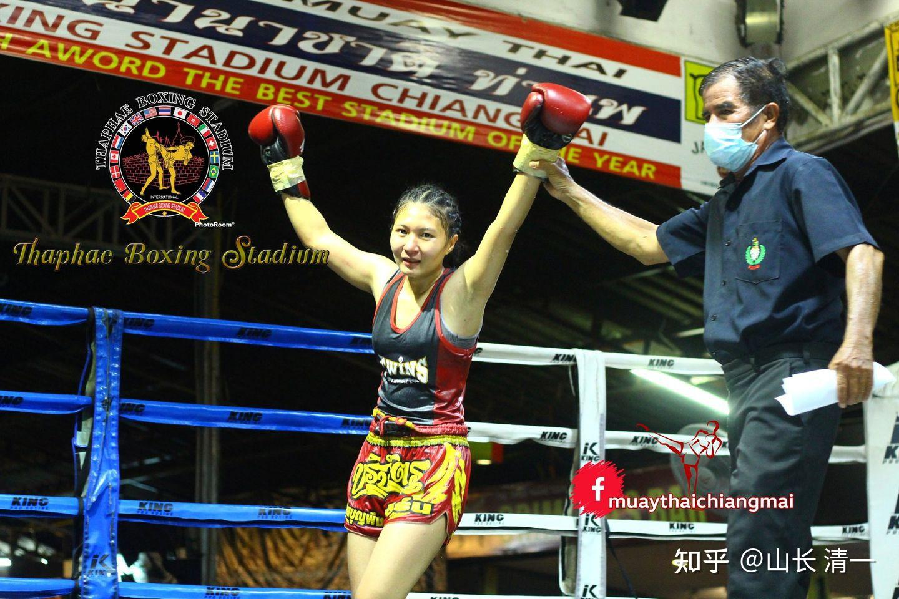

上一文章中，提供了木兰佳惠的第三场实战视频。你们看到的泰拳对手，似乎是软弱不堪的，面对木兰，她根本就无法发出像样的攻击。特别是拳上的功夫，完全不堪一击的样子，几乎没看过她出拳。还多次被木兰摔倒，像个大洋娃娃。那么，你们想知道这个泰国的拳手，跟别的“正常拳手”打，是什么样的画风吗？

[https://www.zhihu.com/zvideo/1524771801679261696](https://www.zhihu.com/zvideo/1524771801679261696)

小木兰们今天拿到了她两周前比赛的视频，她是比赛中的红方，本场比赛的赢家。我看她的出拳满猛的，多次重拳，击中黑裤的对手。还把对手摔倒N多次。踢打的力量也很猛。跟她和佳惠打的时候相比，凶猛多了。

所以，别以为小木兰的对手很羊，是她遇到了老虎，不得不“羊相十足”。我看她第四局被木兰潮水拳淹没的时候，也很难想象两周前的比赛，她完全掌握了场上的主导地位。

对比两个比赛的视频。我相信你们一定知道太极的神奇之处了----就是不经意之间，就封杀了对方的攻击手段。会让久经沙场的老手，看起来像是一个不会拳的新手一样。因为太极格斗，将完全破坏对手的格斗思路，迫使对手在自己完全不熟悉的系统中作战，因此当然就失去了胜利的可能。假如一只鸡，被迫在水里和鸭子打架，我看就是最凶猛的斗鸡，都无法作战吧？光顾学游泳去了。

其实也不神奇，这里把秘密告诉大家：

太极格斗的核心，就是尽可能破坏现代格斗的“稳定性支撑”。设法让对方拳手站不稳，立不住脚。这样现代格斗拳手，在双足无法站稳的情况下，是无法发力的。这是用太极的“沾化”本领来实现的。你们可以看到泰国拳手跟我们的小木兰接触上之后，就一直站不稳，摇摇晃晃的（说明一直在找平衡），只能被动挨打。就是用了太极沾化劲的表现。不过，泰国人会认为：原因是我们的小木兰力量太大了，然后又很疯狂的在场上没目的的乱扯她们，导致她们站不稳。然后我们拳手还疯狂的出拳乱打。一点章法也没有，完全不正常。泰拳手，可没听过啥“沾化缠带”的。

就算太极格斗手没有接触对方的身体情况下，也可以让泰拳手“无法出招”。方式就是站位和迫使对方不断的移动，让对方无法调整好攻击位置。我们只跟泰拳手打运动战。因为现代格斗（外家拳）在移动中，是无法发力攻击的。但太极拳手不一样，每天练习就是“单重发力”，因此我们完全自由地在运动中发力攻击。完全可以控制比赛的节奏。把比赛带入泰拳手们无法发挥的场景，就变成了你们看到的场面：明明是很优秀的拳手，看上去完全不会打拳了一样。

另外，我们还找到这次泰国拳手与木兰比赛中一些“怪异之处”的原因了：刚开场，双方一照面，这个拳手居然就不断退步，好像有所畏惧一样。佳惠当时在场上，也觉得场面很不正常。因为绝大多数的泰拳选手，跟她们过招，都是很有自信的。因为泰拳手一般瞧不起外国人，特别是中国人。因此一开场，都是主动进攻，往往喜欢踢扫腿。试探你的硬度和反应。这一次，这拳手还没有接触到她，见到木兰，就不断的退让，不主动进攻。这让木兰有点意外，觉得这拳手胆子太小？水平太差？躲藏战术？

今天才终于知道原因了----木兰们发现，她原来是木兰们海外脸书账号的好友，早就关注了她们。她显然上场前，就知道她本次比赛的对手是谁了。水平怎样也知道。脸书上有木兰们比赛的视频。她知道木兰们虽然只有两战的历史，但已经打了她们的金腰带拳手。知道木兰们实力不俗。因此，上场的时候，她不像其他拳手开局就拼实力。而是采取了尽量回避和躲闪的方式，计划抓冷不防的机会来打。很不幸佳惠没有给她这个机会。虽然她差一点就高扫上头成功了。看样子，她是一个很有经验的拳手了。她还是木兰们拳馆里冠军姐姐的好友，彼此是互相认识的。可惜木兰们上场前根本不知道对手的水平和业绩，不知道什么级别的。泰拳的圈子其实不大，我猜这样的名声传下去，木兰们很快就可以做到泰国的太拳界“全国有名”了。因为跟木兰们过招的女拳手，将毫无例外的全部“折”在她们手上，估计以后上场，一开场就不断的退让，很谦虚的样子。直到没有人愿意上场面对他们为止。我估计：拳馆的教练会跟裁判商量好。如果发现有危险，马上快速停止比赛。这一次，我看裁判停止的很及时。

另外，还有一个笑话：木兰佳惠赛前说，如果她的对手，在比赛前会去研究她的比赛视频的话，去看她原来的两场比赛录像，一定认为这个中国拳手是一个疯子，上场喜欢乱冲乱打的。 她自己都觉得：当时打得实在太疯狂了，一点节奏都没有。泰拳手肯定看不懂她是在干啥，以为她疯了，乱打，偏偏又没有办法对付。【因为我木兰们交代的擂台原则是：只要跟泰拳手接触在一起之后，就不能停下来，不能给他们机会反击】。当然：她也说，对手研究她的比赛视频根本没用。因为她每一场都会不一样。她相信两周后的第四场比赛，也会不一样的。她希望打出更精彩的场面来。起码---跳舞还可以跳的更好看一点。