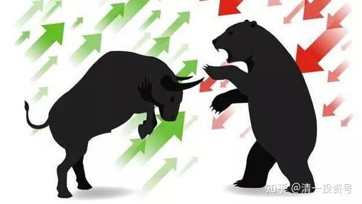
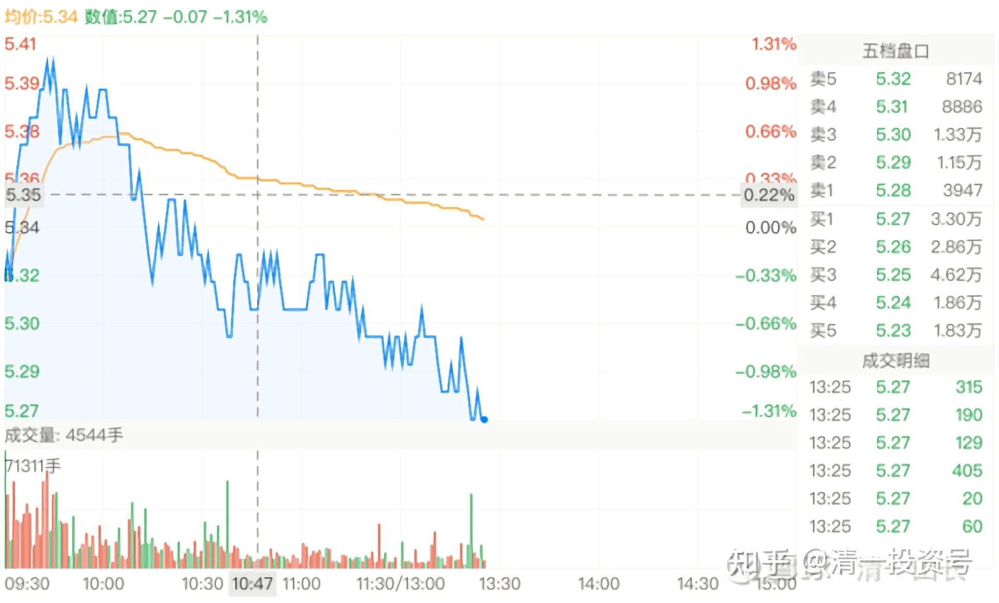
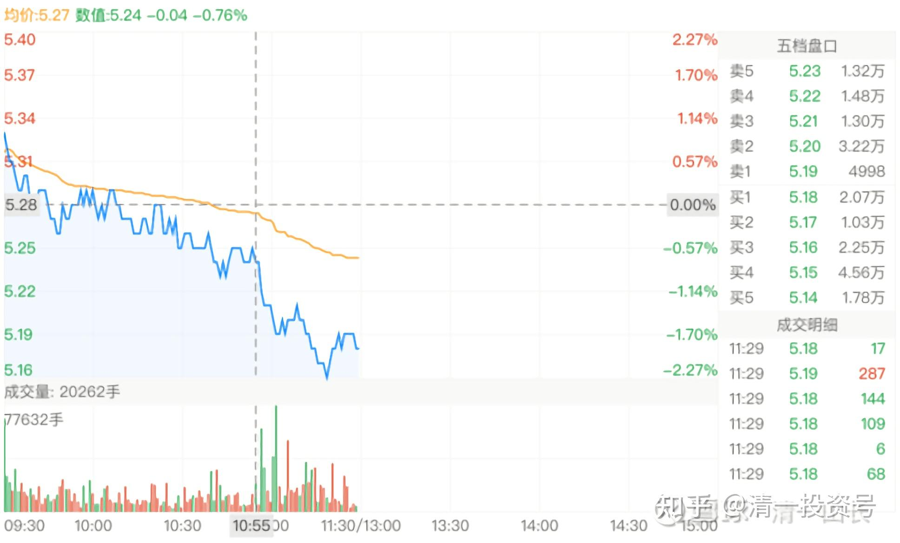

8篇.中国建筑系列之六：熊市布局，牛市收获

清一山长2020年7月13日～7月15日

**一、投资好公司，涨与不涨都是好事**

**虎先生和牛小姐**发布于[2020-07-12 20:00](http://link.zhihu.com/?target=https%3A//xueqiu.com/1545903998/153766740)

《中国建筑一文不值？》[https://xueqiu.com/1545903998/153766740](http://link.zhihu.com/?target=https%3A//xueqiu.com/1545903998/153766740)

**[清一山长](http://link.zhihu.com/?target=https%3A//xueqiu.com/9310099567)**[2020-07-13 12:59](http://link.zhihu.com/?target=https%3A//xueqiu.com/9310099567/153823062)评论上贴

这种帖子实在没啥内容，根本就没有分析，只有感叹。拿中建跟万喜比价格，然后就抱怨一通，似乎遇人不淑之类的。问题是：中建如果达到了万喜的估值，贴主会依然持有还是卖出？依然持有的话，涨不涨你账上不都一样吗？一股不多？你如果要卖出，不就是你认为中建低估才吸引买入，然后你在内心就认为自己是聪明人，你在等一个傻瓜，给你一个万喜的价格，你就赶快卖给他，跑掉数钱去吗？可是，你等的这个傻瓜一直没来，于是就哀怨自己生不逢时，没遇到傻瓜。这个逻辑好搞笑[俏皮]。

中建没卖到万喜的价格就叹气。毕竟企业不同，国家不同。但是，AH股，同一家公司，同股同权。但价差几倍，又咋讲理去？还有，香港一碗牛肉面50元，内地一碗相同的面10元。内地卖面的，要不要天天骂顾客太不够意思，只给了香港价格的20%？占了自己的便宜？摊主但凡这样骂人，我看非但得不到同情，反而会被世人嘲笑的。可为啥在股市上，做类似的事情，反而有人会跟着起哄呢？

注：本人持有中建，应该比各位持有的更多。但中建不涨，我也没意见。要我来定价，我还愿意给中建定一个十年都0.8倍PB交易的价格呢！这样，我就能够把每年分红都再投入买中建好了。我相信价格将来涨了，它的分红也不会因此提高的。涨得越多，分红率就越差。

所以，如果真相信中建是一家好公司——**不涨有不涨的好处，可以自己有钱就多买。涨了有涨了的好处——可以卖给有钱的傻瓜**。所以，涨不涨都可以很高兴。干嘛天天盼涨价，望穿双眼。

**二、买入中建的理由**

**[晕娜](http://link.zhihu.com/?target=https%3A//xueqiu.com/1845773477)**[发布于2020-07-13 13:01](http://link.zhihu.com/?target=https%3A//xueqiu.com/1845773477/153815697)

善意建议[https://xueqiu.com/1845773477/153815697](http://link.zhihu.com/?target=https%3A//xueqiu.com/1845773477/153815697)

**[清一山长](http://link.zhihu.com/?target=https%3A//xueqiu.com/9310099567)**[2020-07-13 21:13](http://link.zhihu.com/?target=https%3A//xueqiu.com/9310099567/153879011)回复上贴：

我很老实地承认：我不太懂中建。特别是PPP，我一头雾水。建筑业务、地产业务，也很复杂，我承认我看不懂。我大学是学的电力工程师，不是建筑师。

所以，我敢买中建的唯一理由，只有它跌到我觉得安全的位置，才敢买入。比如市盈率五倍，PB0.8倍，我认为至少比银行股靠谱。也正因为如此，所以涨了一倍我一般就会跑掉了[哭泣]。

**现在敢大量买入，也是因为它便宜**。虽然银行比它更便宜，但我认为疫情对银行会有影响的，所以算不清是否真便宜。中建如果报表不是假的，就比银行靠谱。

至于未来？真看不清。先拿在手里，慢慢看吧！我觉得中建的成长逻辑，要比啤酒难懂得多[滴汗]，报表显示出来的情况，以及过去10年的信用记录，的确很好，很让人安心，这已经够了。如有您说的，更好的结果，就是算超出预期了[献花花]。

不过，我会慢慢学习的，特别持仓这么多（这段时间，每天我账上中建给我造成的“盈亏”，都到7位数了）。所以，以后学习了解中建的时间，会更多的。我算是先结婚，再谈恋爱的老派人士[笑]。

**[晕娜](http://link.zhihu.com/?target=https%3A//xueqiu.com/1845773477)**[发布于2020-07-13 15:31](http://link.zhihu.com/?target=https%3A//xueqiu.com/1845773477/153846110)

[https://xueqiu.com/1845773477/153846110](http://link.zhihu.com/?target=https%3A//xueqiu.com/1845773477/153846110)

**[清一山长](http://link.zhihu.com/?target=https%3A//xueqiu.com/9310099567)**[2020-07-13 21:37](http://link.zhihu.com/?target=https%3A//xueqiu.com/9310099567/153882221)回复上贴

**从净利润增速上，中建是可以对标格力和万科的**，远超招商银行，甚至离茅台的增速也不远。未来十年，估计茅台无法维持过去十年的增速了。中建如果能维持，长跑就超过茅台了。现在两者的净利润总额是差不多的（中建418，茅台412）。市值却差了十倍还多。中建赚的假钱吗？

十年后悬念——茅台会超过中建的总利润吗？超多少？差多少？两公司市值会接轨吗？怎样接轨？[微笑]

**三、熊市布局，牛市收获**

**[清一山长](http://link.zhihu.com/?target=https%3A//xueqiu.com/9310099567)**[2020-07-14 13:31](http://link.zhihu.com/?target=https%3A//xueqiu.com/9310099567/153950850)

*（中国建筑2020年7月14日）*

典型的出货走势[滴汗]。开盘拉高一波，吸引跟风盘，然后抛盘出货，连个盘中反弹都懒得着。一路向下。一上午已经成交过十个亿了。

不过我依然安坐如山，不想投机了。了不起就是跌回原地，10%的浮盈化为乌有。富贵如浮云，追不上的，就不追了。如果失去了卖出机会，我不会放过买入的机会。跌破五元，就继续买[大笑]。

**[清一山长](http://link.zhihu.com/?target=https%3A//xueqiu.com/9310099567)**[2020-07-15 12:06](http://link.zhihu.com/?target=https%3A//xueqiu.com/9310099567/154063701)

[$中国建筑(SH601668)$](http://link.zhihu.com/?target=http%3A//xueqiu.com/S/SH601668)昨天果然被我言中：中建真的在出货。

*（中国建筑2020年7月15日）*

但我看空不做空，中建一股也没有卖出。这几天我中建上的账面浮盈快速下降，“损失了”几百万。但心态淡然，反正一股未少。我准备它跌破五元后，再继续加仓。不跌破，就维持好了。谁创新低纪录了，我去买点做纪念品。赔赚都不管！

今天拉黑了一个同时@我，以及[@晕娜](http://link.zhihu.com/?target=http%3A//xueqiu.com/n/%25E6%2599%2595%25E5%25A8%259C)嚷嚷“中建还我钱来”的傻瓜。我最后买入是4.81元，晕娜的最后买入价格是4.77元。现在都还是赚的。你跟我们，几元跟的？你要嚷嚷，自己嚷嚷。把垃圾信息推送给我的，绝对拉黑无赦。我不喜欢垃圾制造者！

我就算是4.81元买的中建，但绝对没说这个价格就不会跌。买入后，已经公示：我准备中建可能跌到3.5元的可能性。晕娜的观点，大致上认为，按照历史上最低记录也跌不破4.5元（0.67倍PB）。我认为，可能历史就是用来打破记录的，不排除破四的可能。但我不会恐惧。我要做的是：打破记录之时我依然在场，还不损分毫（指股份数量不会被平仓，不指金额涨跌）甚至还增仓。

这个策略，使得我在珠江啤酒上越战越勇，最终创下酒类股利润最高记录。想要打破这个记录，恐怕只能靠燕京了[笑]。因为燕京我也是越跌越买，最终仓位超过了珠江最高的时候。

**熊市，是布局的时候，有啥好慌的。**

**牛市是收获的时候，可以喜悦，但别疯狂！**

熊和牛。都是我们的朋友。

**球友甲**:回复**[@清一山长](http://link.zhihu.com/?target=http%3A//xueqiu.com/n/%25E6%25B8%2585%25E4%25B8%2580%25E5%25B1%25B1%25E9%2595%25BF)**:

就是跌得太惨了，好久之前的6块多，好久没见了[哭泣]，浮盈都回去了好多，什么时候回升回本[哭泣]？

**[清一山长](http://link.zhihu.com/?target=https%3A//xueqiu.com/9310099567)[2020-07-15 12:58](http://link.zhihu.com/?target=https%3A//xueqiu.com/9310099567/154067434)**回复**球友甲**:

晕娜从3元开买，到了11元就坐电梯，直到现在，别人一句话的抱怨都没有。你6元下来就嚷嚷，好意思吗？[吐血]

**[清一山长](http://link.zhihu.com/?target=https%3A//xueqiu.com/9310099567)[2020-07-15 15:09](http://link.zhihu.com/?target=https%3A//xueqiu.com/9310099567/154086362)**

[$民生银行(01988)$](http://link.zhihu.com/?target=http%3A//xueqiu.com/S/01988)民生今天破五了4.96元[大笑]。民生如果破五，博弈的赢率很高。这几年走势，跟中建差不多。中建最高价7.8元，民生H最高价7.5（复权）。另外一个相同点，就是破五之后的时间都不长。大多数时间维持在5以上，6元以上抛掉，大概率赢率也比较高。因为维持在6以上的时间也不长。但是，历史就是用来改写的，将来如何就不知道了。

申明：今天我没有买[俏皮]。有持仓。

**[晕娜](http://link.zhihu.com/?target=http%3A//xueqiu.com/n/%25E6%2599%2595%25E5%25A8%259C)**回复**[@归隐林地](http://link.zhihu.com/?target=http%3A//xueqiu.com/n/%25E5%25BD%2592%25E9%259A%2590%25E6%259E%2597%25E5%259C%25B0):**

林兄：我刚计算了一下，最近这波行情，从最高点算起，兴业极限回撤幅度，比中建多4%，您分红再投，不投兴业，投中建，为什么……我有点晕……

**[清一山长](http://link.zhihu.com/?target=https%3A//xueqiu.com/9310099567)**[2020-07-15 14:18](http://link.zhihu.com/?target=https%3A//xueqiu.com/9310099567/154078181)回复**[@晕娜](http://link.zhihu.com/?target=http%3A//xueqiu.com/n/%25E6%2599%2595%25E5%25A8%259C)**:

从交易原则来看：**抗跌的股，有抗跌的道理，涨的可能性也更大**。

市场原则来看：政府明确表态不希望银行涨，还希望银行让利。没说中建不能涨！中建还是国家的对外名片!

从起涨点看，兴业还有8%的涨幅。跟中建的涨幅基本也差不多。并没有多跌多少。

当然还有其他理由——反正跟这一轮的跌幅多几个点，没有关系，至少这个指标不是买入判断的指标。[大笑]

**[@归隐林地](http://link.zhihu.com/?target=http%3A//xueqiu.com/n/%25E5%25BD%2592%25E9%259A%2590%25E6%259E%2597%25E5%259C%25B0)**回复**[@晕娜](http://link.zhihu.com/?target=http%3A//xueqiu.com/n/%25E6%2599%2595%25E5%25A8%259C)**：

在晕兄的提醒下，我刚刚去统计了一下从3月23日指数收盘低点以来的反弹，中国建筑上涨5.08%，排在沪深300指数成分股的倒数第25位，而兴业银行上涨13.17%，排在倒数第65位，从这个角度，我也算歪打正着，补了相对更低位的[滴汗]。不过人比人气死人，不到4个月时间，300指数中涨得最好的前20家基本上都翻番了，我们是切切实实浪费了一个牛市啊。（全市场涨得最好的王府井没在300指数中，它居然用不到80个交易日从11.74元涨到最高79.19元！）

**[清一山长](http://link.zhihu.com/?target=https%3A//xueqiu.com/9310099567)**[2020-07-15 16:45](http://link.zhihu.com/?target=https%3A//xueqiu.com/9310099567/154096957)回复**[@归隐林地](http://link.zhihu.com/?target=http%3A//xueqiu.com/n/%25E5%25BD%2592%25E9%259A%2590%25E6%259E%2597%25E5%259C%25B0)**:

这样比，会气死的。任何一个季度的时段拿出来，比前20名，都有涨翻倍的股。

不过，任何时段，拿出来比最后十名。都有腰斩的股。去跟这样的人比，就可以找到快乐。

元位南，就是能够让很多小股民在比较中，获得很多心灵安慰的比惨大使，功德无量[大笑]。

所以，**凡人喜欢比，就有N多快乐和N多沮丧的理由。**

**至人，胜无喜，败无忧。因此更容易常胜。**

**四、融资的原则和策略**

**[@晕娜](http://link.zhihu.com/?target=http%3A//xueqiu.com/n/%25E6%2599%2595%25E5%25A8%259C)**:回复**[@清一山长](http://link.zhihu.com/?target=http%3A//xueqiu.com/n/%25E6%25B8%2585%25E4%25B8%2580%25E5%25B1%25B1%25E9%2595%25BF):**

**（跟帖于山长**[2020-07-15 12:06](http://link.zhihu.com/?target=https%3A//xueqiu.com/9310099567/154063701)帖子底下**）**

山兄：

您这是成心要让雪球请我去喝咖啡呀……不厚道呀……

在雪球，能谈融资的事吗？我可是职业赌徒……

好了，前两句是开玩笑。哈哈……已经满融中建了……以后还是不谈这类事吧！即便雪球不请去喝咖啡，忽悠了您的粉丝，也是罪过呀……

**[清一山长](http://link.zhihu.com/?target=https%3A//xueqiu.com/9310099567)**[2020-07-15 20:23](http://link.zhihu.com/?target=https%3A//xueqiu.com/9310099567/154114368)回复**[@晕娜](http://link.zhihu.com/?target=http%3A//xueqiu.com/n/%25E6%2599%2595%25E5%25A8%259C)**:

雪球咖啡厅门槛比你想象的高。没这么容易请你去喝的[大笑]。

满融中建，应该符合你的投资逻辑。每年增长10%的企业，最低估值的时候，拿不到6%的融资利率，覆盖成本是有余的。换了我2014年的操作思维模式，我也会满上了。

但现在我却比2014更胆小了，我就是不敢多动融资。有时候上了一点，过几天，就会找机会，把涨的股卖掉平掉还融资。我的主账户，融资才有1.5%，可以忽略不计。我不,2014年这么乐观，总有顾虑——疫情后遗症吧！虽然没有得冠状病，但得了心理病。**我宁肯错过行情，也不敢投入融资大买自己喜欢的股**。上周一，看大盘涨的这么坚决的样子，我还以为这一次错过了行情，融资额度白留了。没想到还会回来[滴汗]。就等最坏的时刻出现吧！敢死队才出击。

**[@晕娜](http://link.zhihu.com/?target=http%3A//xueqiu.com/n/%25E6%2599%2595%25E5%25A8%259C)**:回复**[@清一山长](http://link.zhihu.com/?target=http%3A//xueqiu.com/n/%25E6%25B8%2585%25E4%25B8%2580%25E5%25B1%25B1%25E9%2595%25BF)**:

雪球毕竟是公开场合，融资的事，最好还是不谈为好。

雪球绝大部分人，都不是职业投资人，对风险的认知，承受能力，都较弱。误人子弟的事，尽量避免吧！交流的口径，还是要掌握尺度，拿捏分寸。

回归主题，谈中建吧！以我对中建6年的投资，6年的认知。现今的中建，已经不是2014年的中建了，羽翼丰满，丑小鸭已经成长为白天鹅。公司要振翅高飞了，至于股价飞不飞，这是市场的事，我无能为力。市场有共识，股价就飞天。市场没有共识，股价就趴着吧！

山兄：有关中建的资料，我手里很多，您要是有兴趣，尽管问吧！我知道的，都尽量给您提供。我不知道的，您提出来，我去重点收集、分析研究。

**[清一山长](http://link.zhihu.com/?target=https%3A//xueqiu.com/9310099567)**[2020-07-15 22:26](http://link.zhihu.com/?target=https%3A//xueqiu.com/9310099567/154127393)回复**[@晕娜](http://link.zhihu.com/?target=http%3A//xueqiu.com/n/%25E6%2599%2595%25E5%25A8%259C)**:

[献花花]融资的确不是一般人能够驾驭的，一般人要学会远离。

谢谢你的分享支持。要重新学一门建筑经营学，把中建的经营模式和优缺点都弄清楚，难度不亚于考个博士。我有些知难而——不想进。我更喜欢研究你回答问题的方式，如果看到你的思维一直是很清晰的，研究是深入的，评价是客观的，我就假装已经任命你做我的"中建投资项目经理“了，有问题直接问你算了，很会偷懒吧[大笑]！

比如：你的2030年悬念，我计算过几个数字，营业额、利润总额等，从现在和过去十年的经营记录来看，都是偏保守的。我认为实现你的悬念没问题。说明你不是一个哗众取宠的人。不会只看对自己逻辑有利的数据，甚至假想一些数据出来。如果你是这样来研究中建的，相信你2030年万亿市值的推论，也不是没可能。这就是我的研究方式——简化难题[加油]。

附：参考文章

[清一投资号：1篇.中建背后的神秘大手](https://zhuanlan.zhihu.com/p/481078141)（整理文）

[清一投资号：3篇.中国建筑系列之一：就算是好股，也别谈恋爱](https://zhuanlan.zhihu.com/p/512602669)（整理文）

[清一投资号：4篇.中国建筑系列之二：大A股的稳定器](https://zhuanlan.zhihu.com/p/519506160)（整理文）

[清一投资号：5篇.中国建筑系列之三：发现投资机会的方法](https://zhuanlan.zhihu.com/p/522851722)（整理文）

[清一投资号：6篇.中国建筑系列之四：只有少数人才知道正确的通道](https://zhuanlan.zhihu.com/p/522882446)（整理文）

[清一投资号：7篇.中国建筑系列之五：投资中建的核心逻辑和理由](https://zhuanlan.zhihu.com/p/528942534)（整理文）

[清一投资号：8篇．建筑的股性正在激活中](https://zhuanlan.zhihu.com/p/476832159)（整理文）

[清一投资号：13篇.中国建筑对话录：不养独子](https://zhuanlan.zhihu.com/p/463971765) （整理文）

[清一投资号：17篇.中建股东数历史新低](https://zhuanlan.zhihu.com/p/505901339)（整理文）

