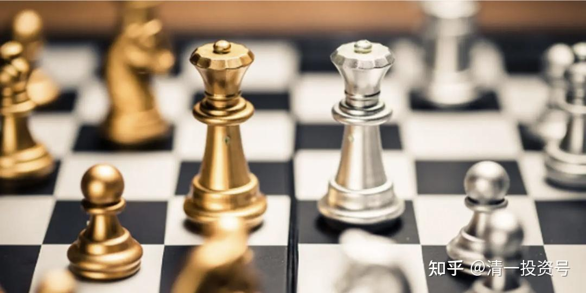

2篇.基金系列之二：博弈学：与傻子和疯子作战其实也不容易

清一山长 2014年2月6日

最近几个月，我为了让资金找到最合适的投资渠道，研究了中国的市场，发现了很多不可思议的事情，都不敢相信这真的会发生在身边。2005年股市1000点的时候，我不仅把自己所有能动用的资金投入股市，而且还借了一大笔钱入市，买入低估的汽车、煤炭和钢铁股。我当时告诉朋友们：这可能是我这一生中都不再能够遇到的机会了。然而，却没有人相信我，周围朋友们觉得我买进这些被市场抛弃的股票是疯了。而我却认为，这些仅仅靠分红都比资金存银行利率还高的股票价格，怎么可能会有风险？果然，这些投资为我在后面的一两年，赚到了接近十倍的收益。

没想到，这些我认为不再可能会有的好事，居然今天又再现了：沪深股市居然有比2005年更好、更安全的机会——在中国，你需要理解很多超越常识的“不正常”是正常的。你真的需要有超凡的想象力和理解力。

比如：你来做下面的算数题，看看哪一种才是“正常的”思维：

假如你有一万元，请问如何才能获取更合理的回报？

方案一：买一种票据，该票据为国家保证级别，只要国家不倒闭，就最终是无风险的，可以兑现的。持有该票据的人，一年可以分1000元现金给你，另外还有一千元分红作为账目记在你的账上。也就是说：一年后你可以分到1000元的现金，另外你的资产投资记录为现金11000元。这是你在最差的预期下能够获得的好处（收益是每年10%的现金和10%的权益）。额外的好处是：两三年内，应该有很大的概率，某一天别人会拿两万甚至三万元买你的票据。如果愿意，你可以卖出，获益高达300%。（该公司出售一种你每天都需要的产品，每天重复购买，比巴菲特的可口可乐销量更可靠和更受欢迎）

方案二：买一种票据，也是国家保障型的，除非国家完蛋了，否则你的钱不会消失。不过现金购入后的分红收益比较少，只有7%。另外的15%非现金收入帮你存在银行里面。也就是说：您投资的一万元，每年可以得到700元的现金分红，另外还有1500元的账帮你存在银行，你的总资产一年后就变成了12500元。还有机会获得额外的收益：概率上两三年内，应该会有一次让你以两万元或者三万元收回本金的可能。但没有人为您保证这一点的实现日期，您只能等待“市场先生”发意外的红包。

方案三：你可以获得6%的年化收益率，而且不保证你的今后长期收益。一年后你可以拥有10600元，但是其他收益或增值可能性统统没有。

如果你是正常人，你会选哪一种？

我认为选第三种的人一定是傻瓜。这种人应该不会存在的，特别是在我们这个特别爱钱的国家，大家算账都很精明的。

你认为还会有比这种人更傻的人吗？当然有。就是把自己本来已经持有的第一和第二类资产，低价赔本卖掉，然后去买第三种资产的人。

不幸的是：这种人还很多——成千上万的。我实在弄不懂：中国人脑子要有多笨，才会干出这种笨事情？

不过，说老实话：如果不是有大量这种笨人存在，也就不可能出现上面第一或第二类的机会。这种不可思议的市场机会，就是由这些不可思议的傻子提供的。恐怕只能出现在中国。

不知道各位知不知道我在说什么？因为，过年前，我一直在持续买入第一和第二类资产，我很奇怪：怎么有人这么怪，会把这些很值钱的资产如此低价卖给我？

春节的时候，我与一个大型基金公司的老总交流，我问：你们发行的这么多基金，是不是年底遭遇了很多赎回？基金份额缩水不少吧？老总回答：今年股票基金遭遇的赎回压力的确很大，不过货币基金增加了不少。

货币基金是什么？就是大家刚刚熟悉的什么宝，比如“余额宝”等等。

余额宝唯一的好处就是：每天都在“增长”，而且每天都在报告你账上增加的钱，即使只有几角钱。

虽然目前看来，投资货币基金还是很“稳定且不错的收益”的（虽然在我看来连通胀都跑不过的6%收益，根本就谈不上好处），但基民们千万不要认为这就是与银行存款一样的“可靠”，实际上它从来就没有保证过一年的稳定收益，只是“目前的年化收益率”，与“定期一年利率”不是一回事的。它可能每天都在变，既然可能变高，也可能变低，甚至消失掉。

长期来看，货币基金并不比股票更稳定。更何况投资货币基金基本上算不上是一种“投资”，你根本就无法分享企业成长和经济上升所带来的好处。

如果不相信这一点，就自己去搜索“美国 货币基金清盘”，我相信你会看到很多案例的。目前信托大量出问题，今年会是一个高峰，也许很多人吃了亏以后，人群就会离开“宝宝”们。再来抢购第一、二类资产却发现比现在贵了很多。

第一、二类资产的缺陷就是：你看不到你账户金额的增加，只看到账户每天不停地上下波动。另外，虽然你很可能未来每一天会获得额外的大笔收益，但是你可能需要耐心等待一两年时间才能遇到机会，而且没有任何人会保证你一定有这笔收益。因此你很担心会没有这种机会。不过，考虑到能够保证的每年分红，远远比“宝”们要高，你没有什么好担心的。只是因为每年才分一次红，也不会天天把这些分红的365分之一给你看，可能让心急的人无法忍耐。

我总算理解了为什么一些质地很好的大盘蓝筹股会跌破最起码的支撑位了（比如跌破6-8%的“息率支撑位”），总算理解为什么这么低的价格，还有人在不停地“卖出”的原因了：就是过去的一年，特别是下半年，中国很多人，把原来投资在股票基金上的钱抽回，去买“收益更稳定”的各种各样“宝们”了。因为这是“今年的市场热门”，虽然收益仅仅6%左右。考虑到仅仅余额宝就超过了2500亿，加上基金公司发行的“货币基金”，以及银行的理财产品等等，总额肯定上万亿元，其中有不少来自于股市的存量资金。因此股市的资金自然越抽越少了，自然不可思议的廉价货，就不断地出现在市场上了。

当然，我也看到了一些颇有眼力的资金，正在低位进入接盘……包括外资。

您认为这种市场正常吗？

其实，这就是博弈：懂得基本算数的人，与基本不懂算数的人的博弈。这种博弈，基本上不需要你有什么超常能力，只需要有正常的小学数学水平就够了。而且赢的最终的结果似乎是没有悬念的。将来涨价以后，以数倍的价格买回这些东西的，也是现在这群正在“买宝”的人——这才是其中最滑稽的故事。

**“博弈学”是什么呢？并不是赌博，而是在“不确定”的市场上，力求获得“确定性结果”的一种方式。**

简单一点，就是假如有16只球队参与世界杯比赛，你想事前就确定谁是冠军队，基本是不可能的（是不确定性的）。怎样才能保证你投票的队100%地获得冠军呢？

方法很简单：每个队都投一票，你就保证最后的赢家，一定被你“锁定”。

看起来这似乎是笑话，但的确有效。而且博弈的原则可以用到任何地方。

春秋时期的管仲和鲍叔牙，就是这样为自己的前途和命运“投资”的。首先，他们选了很好的“入场时机”，就是在齐国未来的君主，现在的王子落难的时候去协助他们，这样才能保证未来自己的地位（跟现在低位进入市场一样，收益才会超高）。另外，当时有一个难题：落难的王子有两位。谁才是未来君主呢？不知道。他们只能根据各种复杂的情势判断出：未来齐国的君主，应该就是这两位之一了。至于是谁，真说不定。国王人选又不是让他们投票的。

于是这哥俩就商量了——两人分开，分别协助一位公子。将来总有一位跟对了人，这时候就要帮助另外一位落难兄弟上位。果然，他们的策略成功了——后来齐国基本上就在他们两位的手下，成为春秋时代的霸主——因为他们二人精通博弈学，愿意合作和分享，因此在不确定的市场上，取得了确定性的成功。

实际上，现代证券市场的兴起，也是“风险博弈”的结果。当年的荷兰人对于投资的商船到底哪一艘能够带回商品，哪一艘会遇到风暴沉没，实在是“算不出来答案”。面对这种彻底的不确定性，他们采取了“股份制”的方式来锁定风险，保证自己有稳定的利润回报。避免了大赢大输。实在是一种智慧——博弈的智慧。**可叹的是：这种世界第一流的“风险避免”手段，到了中国，居然变味成为大众的赌博工具。**到底是缺乏西方文化和西方思维的缘故。

现在我面临的一个中国最大的“不确定性”，就是人民币的走向了。说到底，现在人民币超发很严重，实际价值远远不是对外汇率反映出来的这样“值钱”。想想看就知道：为什么中国人到国外觉得“什么都便宜”？甚至连国外的房子都很便宜？国人到了国外都变成“土豪”了？就是因为人民币“泡沫”严重的原因。中国现在就像是（二十世纪）80年代的日本一样，当年的日本国民，也是感觉自己超有钱，可以买下全世界，冲到国外大量的花钱。因为当时日元兑换美元汇率，是现在价格的三倍以上——直到后来发现日元并没有想象的那么值钱。现在好穷......

一旦这个泡沫被刺破，就会发生1998年的亚洲金融危机一样的事情——本币狂跌。当年的泰国、韩国、印尼等等，本币跌幅一半甚至90%的，很多人破产。经济陷入低谷。

不过，如果你以为现在马上就把人民币换成美元存起来，就是“最佳对付手段”，就大错特错了。因为：人民币后面还有一只神秘的推手在推动它缓慢的升值。尽管这种升值对我们国家是很不利的。近十年来人民币不断的升值，已经严重地影响了国家的经济发展，造成现在出口竞争力日趋减弱的局面。但是我们国家，依然让人民币缓慢地升值。

这就是大国博弈：与陷入当年的印尼、韩国等一样的严重经济危机相比，我们国家更愿意选择在人民币升值的泡沫温水中慢慢煮青蛙。因为我们期待有一天，会有意外的冷水注入挽救市场。就算是经济要崩溃，也至少可以晚一点崩溃。

这两种力量（政府调控力量与市场的回归力量），到底哪一种更强呢？还真说不清楚。反正当年索罗斯在香港打了一仗，是市场输了，中央政府获胜。

双方输赢无所谓。可是我等小民看不清双方博弈的结果就很麻烦：我们真不知道谁会赢，也不知道何种时候分胜负。我们只是知道：总有一天会有结果的。

如果我们一直在等待“达摩克利斯之剑”下落中，每天提心吊胆地生活，未免太影响生活质量了。最佳的手法，就是**主动加入这场博弈——学当年的管仲和鲍叔牙一样，谁赢我们都行。因为我们两边都下了注**（您可别误会是把资产用来买一半美元，留一半人民币，持有货币，在我看来根本谈不上是一种投资）。

这种“两边都下注”的方法，就是“博弈学”，也许我会在“财富课专业班”上讲讲这种课程的。我觉得很有趣——这不仅是讲课的需要，而是我对于自己资产的保值需要。这种需要，在目前“中国已经提前进入拐点”以后就更加需要了。因为我认为我们政府干预金融的力量相比1998年来说已经弱了很多，能够拿出的手段也很有限。也许索罗斯再来一次就会赢了。而我显然不愿意被动地等待“破产”。

怎样做呢？还是让我慢慢地想一个“万全之策”吧！

请不要怪我不提供标的名字，因为按照国家法律，我不能公开推荐介绍任何标的。因为我不是证券从业人员，没有金融行业资格证。

另外，懂的人一看就知道我在说什么。不懂的人，我告诉你也没用的。别指望看了博客就会投资。

[清一投资号：43篇.基金系列之一：从博弈学 看金融市场上专家比不过大猩猩的逻辑](https://zhuanlan.zhihu.com/p/535572286)（整理文）

[清一投资号：45篇.基金系列之三：彼得·林奇 谈沃顿商学院的教育价值](https://zhuanlan.zhihu.com/p/535585835)（整理文）

