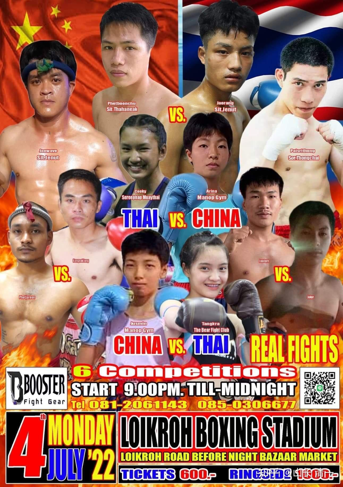

本场在美国国庆日举办的泰拳比赛，木兰们是唯一的“外国人”。民间身份的木兰们，将代表中国而出战，在海外孤独地守护着中华武士的尊严。征战的对象，是号称“世界最强站立格斗”的泰拳，木兰们要用中华武术打破“泰拳五百年不败”的传说。我们冒着客场作战的种种不利，打平就等于输掉。还冒着裁判的偏心和各种不公正的小动作，甚至不KO对手就会被判输的泰拳潜规则，顽强地用裁判无解的胜利，捍卫中国武者的荣誉。今天的泰国赛场上，因为有我们，国旗正在升起！

这是木兰们的最新比赛安排，时间是7月4日，好像是美国国庆日？

这一次，两个木兰都有比赛。不过明晓的对手，从照片上看上，是很小白的样子，我都怕把她打坏了。不知道实战上场会不会很猛。

拳馆馆长说：泰国的女生都怕膝肘。善于用膝的拳手，一定会赢的。让木兰们尽量用膝攻击。

我说：用腿，她们根本就不是对手，加上用肘膝就更厉害了。这都是我们的长项和优势。但为了温温柔一点，你们前三局，尽量用你们最差的“拳”来打吧，就当练习赛了。而且，要求她们主要在泰拳手，尽量身上试用我们太极拳的经典招式---【野马分鬃】来打，不用急于KO对方，有无力量都无所谓的。练习赛，友谊第一。别把泰国人打的太寒心了。只要木兰们小心一点，不要被泰国人KO就行了，也尽量不要受伤。跟上次一样，到了第四局，再开始你们的猛烈攻击。由于抱在一起，泰国裁判的干预总是不利于木兰。（上次佳惠的比赛，说她内围中仪占优势，刚要打和摔，就被泰国裁判捏着脖子拉开，还很用力，弄得她脖子很疼。给她造成身体不舒服的，居然不是对方拳手的打击，而是泰国裁判的“大力鹰爪功”。我在视频上都没看出来，所以真够阴的。我就让她们这一次，尽量不跟对手打内围，一旦沾上，就尽快摔倒对方，不恋战。尽量用远距离的攻击来消耗对方。因此，让她们7月4日主要用野马分鬃一招来制敌。你们到时候，看她们用出来没有。如果用好了，可以把对手像皮球一样发出去。用不好，就只能“乱打”了。不太好看，但也不会输的。

古拳师的说法：**打人容易发人难。发人容易控人难。**小木兰们现在如果只是简单地要“打”泰拳手，已经很容易了。现在计划用发人的方式来打泰拳比赛----就是把你打出去，还不让你受伤的方式，来打她们的泰拳，放泰拳一马。不需要像原来一样，打得很激烈，很紧张。这种打法，看上去会更好看，场面更精彩。但是难度也更高。能不能实现这个目标？能不能让她们的技术充分展现出来？就看7月4日了。我照例不去现场，提前安排好就行了。如果实现了这一步，就可以练习下一步“控人”了，会像跳舞一样，轻盈的，毫无力量的晃动，但让对手东倒西歪，完全无法战斗，却有不伤人。看上去是玩过家家游戏一样。这就达到了“控人”的地步，说明自己的功力远远超过对手，否则是做不到的。

另外，我让两女孩比赛期间，另外两个小公主，去找赛事承办人，告诉他们比赛可以更赚钱的新法门：就是举办男拳手打女拳手的比赛。一定会吸引很多观众，说不定场地会爆满，甚至会让很多外省人都要跑来看热闹的。拳场多多赚钱有啥不好的? 这种“不公平的赛事”，泰国只是在10来岁的小拳手身上会举办过，的确很吸引观众。因为小男孩，在10来岁的时候，其实是打不过小女孩的。但发育成熟之后，女生肯定不是男生的对手----除非她学了以软弱生刚强的太极。我记忆中，只看到过一次是女拳手（女子成年冠军）发现所有的女生已经没有对手了，就试图挑战男拳手。结果第一战只是一个普通的男拳手，并不是冠军，就把她狂略了一遍，根本没机会。后来不得不承认“男女有别”，女人再厉害，也只能打女人，或者普通女人。打不过同样训练的男拳手。世界赛事上，基本上很少有男女对战。因此，如果主办方愿意安排这种比赛的话，你们可以看到真正的当代木兰出世了-----击败同级别男拳手的女子。一旦实现这个目标，就是创造了新的世界记录。必定引起轰动的。所以：我们会尽量促成这个比赛安排的。目前为了吸引外国游客，相信赛事方还是愿意尽量促成的。看7月4日的沟通结果了。

当然，也很可能会输掉的。原来我们是想等跟世界冠军打过之后再考虑打男生的。但最新的世界冠军的比赛视频传回来，两个木兰都很失望：原来世界冠军就这样呀？两人都不够她们打的。因此，对挑战世界冠军，已经没啥兴趣了。她们更想做的事情，就是挑战男拳手。打入男拳的世界。

[https://www.zhihu.com/zvideo/1525841644024369152](https://www.zhihu.com/zvideo/1525841644024369152)

这是日本踢拳冠军和泰国泰拳冠军的金腰带决赛。最终泰拳冠军帕亚洪，打满了加时赛后，获得了金腰带。这相当于女子站立格斗的世界拳王了。她是第一个获得K1冠军的泰国拳手，相当于女版的播求。 本场比赛，第一第二局，是日本冠军占有优势。技术上明显胜过帕亚洪。但战斗意志，显然是泰拳王更凶猛。第三局帕亚洪打得不错，因此算是打平手了。有了第四局的加赛，日本冠军明显体力不行，无法输出有效技术。被压制着打，最终输掉比赛。因为日本拳基本只打三局，泰国拳是打五局的。泰拳手的体能更能适应加赛。上一次播求打魔裟斗，也是加时赛体能严重下降导致失败的。

各位看热闹的，不妨看看门道：

1：日本踢拳冠军，她也喜欢出正蹬腿，她的正蹬，和木兰的正蹬有何区别？

2：双方都采用木兰的提膝防守来防止对方的扫腿袭击。她们的提膝，与木兰的提膝防守有何差别？

3：在拳法进攻上，木兰与她们有何区别？ 步法，身法上，有何不同？ 体能谁优？

你能够回答这些问题，就知道谁会赢了。木兰们显然会比较这些优劣的。只是没有机会去打。如果开打，日本冠军，泰国冠军，都不够她们打的。当然：没打过，你们不相信。慢慢等机会吧。

上次她们跟馆长提过，想跟伪娘拳手打一架。这个人妖上场看他的实力很差，第二局就被对手KO了。第一局还是别人让拳的，没有认真打“她”。当木兰们说：想跟这个假女人打一架，希望馆长去安排的时候，结果馆长说：你们忍心这样做吗？没见他好可怜的。的确，他比女人还娘，打拳也一样娘。完全没有力量。估计激素打多了。

两木兰见馆长这样说，就没话可说了。心说：的确打赢这人毫不费力。自己是可以轻易击败他的。也觉得自己有点欺负人。我就笑说：你们应该告诉馆长，你们去打他，起码比男拳手去打他，会更好吧？男拳手不是更厉害吗？他加入女人的行列，跟女人打比赛，会更开心的。

要不：你们两个，干脆说可以找KO了这个伪娘的男拳手去挑战。说上次他愿意打伪娘，这次打一次“真娘”会怎么样?

好了，不多说了。三天后见分晓。

我们作为传武武术爱好者，正在用自己的力量，不要国家一分钱，开创我们的“太极实战征泰”事业。我们将用一场一场的擂台实战，用真实的比赛，去打出中华武术的威风，打出泰国拳手的“恐中症”。