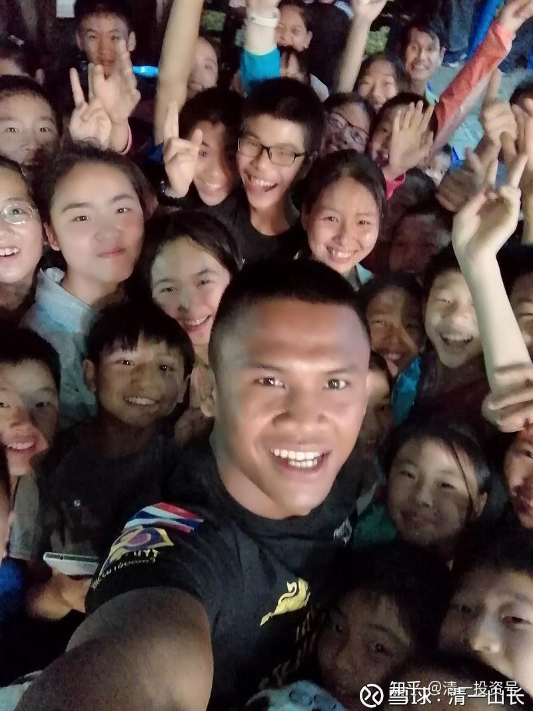
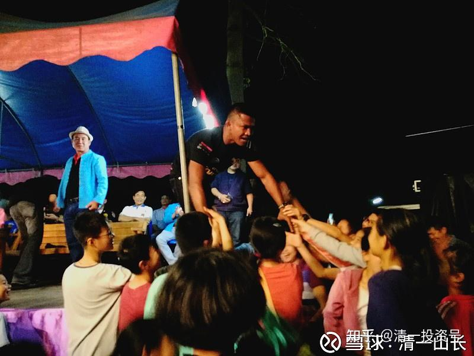
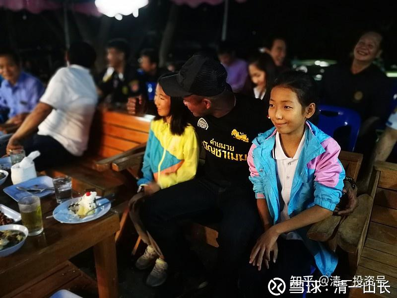
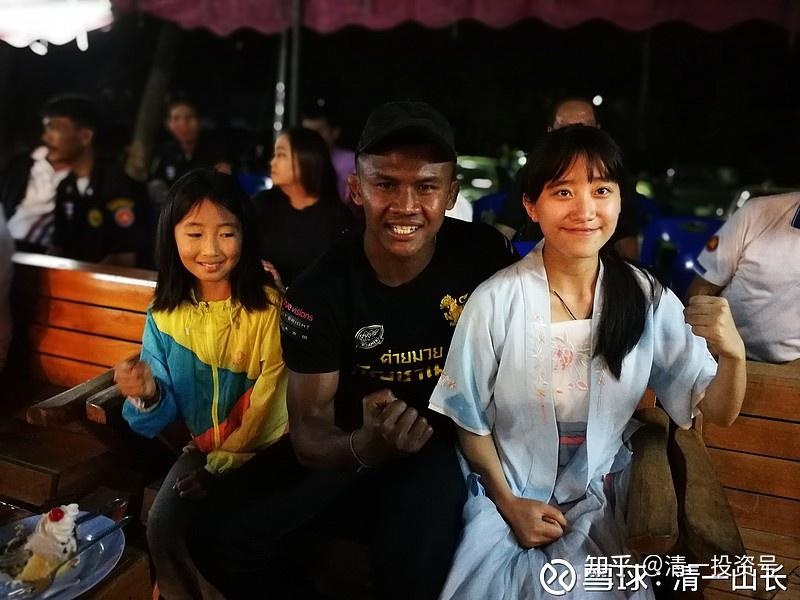
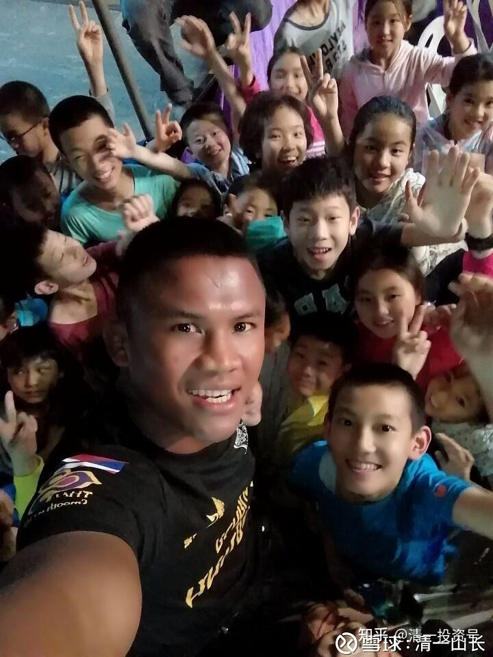

原雪球专栏28篇.泰拳王播求与今日学堂学生零距离交流

清一山长 2018年2月25日

*第一张*

今年寒假，我邀请了今日学堂的学生们免费参加我的冬令营。其中一项节目就是：去看播求带队的泰拳比赛。不是旅游区给游客表演的那种泰拳，是泰国人在自己的社区，自己看的泰拳比赛。比普通的旅游区的拳馆竞争水平要高多了，有被KO的，还有被打骨折的，满面流血的就更多了。播求，因为他的老师就是我居住的区的区长，应区长的要求来带队参赛，给地区带来娱乐的。上一次区长来我的房子看，告诉了我这个消息，邀请我和朋友参加观看比赛。他儿子现在是播求的代理人。播求很高兴在这里见到喜欢他的中国朋友，高高兴兴的跟他们合影。

小女与播求的合照：由于两个孩子都会说泰语，播求对这两个“小中国人”，表现出更加特别的兴趣！

*合影一*

*合影二*

*合影三*