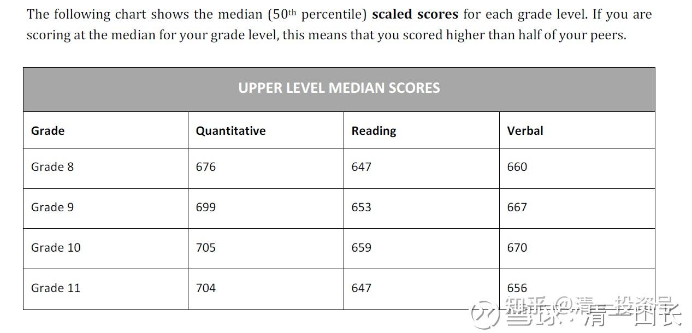
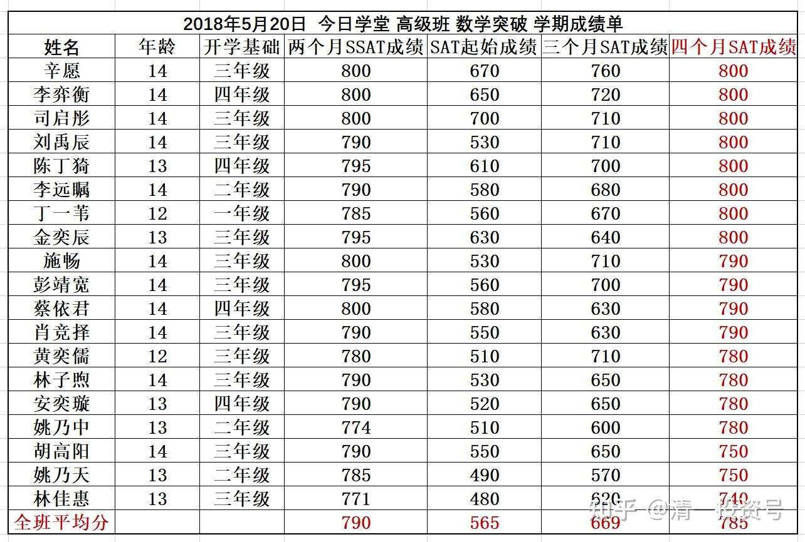
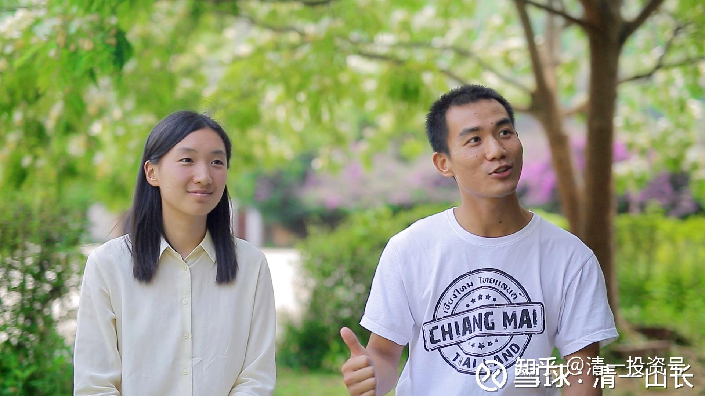

[原雪球专栏](https://zhuanlan.zhihu.com/p/537417420/edit)[35篇.只学了两个月数学去考SSAT可以拿多少分？](http://link.zhihu.com/?target=https%3A//xueqiu.com/9310099567/107140197)

清一山长 2018年5月20日

千元有奖竞猜，等你来拿：

请问只学了两个月数学的学生，参加SSAT数学真题考试的分数是多少？

今日学堂数学突破班本学期的任务，是用四个月时间来学习和突破美国9年的数学课程，并用美国高中入学考试SSAT的真题考试成绩，来检验是否成功突破。这批13～14岁的学生，不少人以前完全没有学过数学。他们必须听美国教师进行全英语的数学课程讲解，学习全英文的数学教材，做全英文的数学题。他们从3月18日才开始学习数学课程。让人意外的是：**仅仅两个月，这批学生就已经完成了9年的初中数学突破任务**。这样的尝试，目前还没有任何学校和教学单位做过。我们是一个新的突破。

目前，学堂正在安排和组织考试。为了防止欺骗、作弊等情况，学堂把考试权交给了这个班的学生家长，让这些自己的孩子正在参加试验性学习的家长们自行来组织考试、出题、监考的任务，原来的带班教师，只做配合考试的工作。我相信正常一点的脑子都知道：学生家长是最关心自己的孩子学习成绩如何、是不是被忽悠了。他们绝对不能容忍学堂教师为了虚假的成绩来欺骗他们这些家长的。这些家长中，还有从美国留学回来的家长，亲自来现场监督，并出卷和监考。由于自己的孩子也在学堂，家长们深刻知道美国数学考试的方法，他们一定会认真地检验：自己的孩子是不是真的具备了初中毕业的数学能力。

当然，我们的教师，事先已经让学生做过了SSAT数学考试的内测，知道学生们的确已经完成了9年数学的突破任务，成绩肯定是超过美国学生平均成绩的。所以，才敢放心宣布提前完成教学任务，邀请家长前来检验。如果没有完成任务，我们会等到学期末的，四个月能够学完9年已经很不错了，何必没弄完却玩提前两个月呢？还不如用剩下的时间，来干点别的有意义的事情（其实也说明了：我原来对外公布的你们认为“吹牛”的消息，其实是很保守的指标）。

各位球友，可以来有奖猜一猜我们的学生考试平均成绩是多少。这一次参加数学突破的班级是两个，一个是正式班，我们称为高级突破班；一个是旁听生班，属于没有正式录取，但得到可以跟随正式生一起学习数学的差一点学生的班级。每个班都是不到20人的小班。参与考试的学生，年龄都是13～14岁。他们学了两年的突破英语，从3月18日开始学数学，目前快满两个月了。计划是本月20日正式举行由家长举办的SSAT真题考试。

你们猜猜看

一：正式生班的学生考试平均分是多少？

二：旁听生班的学生考试平均分是多少？

各位球友中，如果事先留帖猜出的答案，最接近这两个班真实成绩的，我将选出8个人来，每人给予100元的奖金，共800元。其他200元，随机给予参与的人员。请大家留帖为证。本帖只限有奖竞猜留贴，猜完后帖子可以说一些理由之类的。不参加竞猜，留其他无关废话的帖子，将被删除掉。

参考和比较说明：

美国SSAT数学的总分是800分。SSAT的美国学生总平均成绩是多少，我还没查出来。不过每年SAT的美国学生总平均成绩，数学是515分左右，阅读和作文还不到500分。

不过我们查到了美国排行前100名的优质高中入学学生的SSAT总分要求，是必须达到1800分以上，平均每科600分左右。美国排名前20名的最炙手可热的优质高中名校，SSAT的入学分数要求是2200分，也就是单科平均分733分。

请你猜猜看：我们学了两个月美国数学的“外国学生”，之前并没有什么数学基础的学生，考美国的中考，可以拿到多少分？如果你猜735分，显然就是你认为我们的学生，学习两个月就可以考上美国顶尖的高中了。如果猜600分以上，就是你认为我们的学生，花两个月就可以考上美国排名前100名的高中。到底是多少呢？请你自己决定吧！本月20日考完，21日公布正式的考试成绩。

一：正式生班的平均分：###分

二：旁听生班的平均分：###分

注：本次考试，家长将自行邀请媒体来现场监督，全程追踪考试过程，现场采访学生和教师团队。这是一次中国新教育全面叫板世界先进国家——美国西方式传统教育的“教育大对决”，事关重大。**如果成功了，就意味着未来数学教育乃至所有课程教育模式的重新改写。如果是我们中国人进行的成功的突破教育，我们就建立了“中国教育新标准”。**这是很有意义的事情，邀请你们也一起参与玩一下。

**附录：**

最新消息：监考的家长们明天（5月18日）到校区，还带了四家媒体的报道任务来（包括今日头条在内），要现场采访学生和教师，同时观察考前考后的情况。家长们为了郑重起见，联系了专业人士参加考察：专门负责中国地区SSAT考试和培训的专业教学培训机构负责人（校长），一起来校区共同参与正式的测试。目前考试题目，是从美国教育局题库直接拿到的，会直接从美国发给某SSAT培训学校的校长，由校长带到校区，会作为第三方说明题目的来源，确保考试前，我们的老师、家长和学生，均未看过考题。共拿到四套题目：两套有答案，两套没有答案。目前计划提前给一套没有答案的题目給到学校，作为这一两天学生们平时了解和练习用；周五晚上由家长代表们组织一场模拟考试，用另一份没有答案的题目；周六开始，正式考试，周日列出全部参加考试的学生的成绩。

看见了没？过程多严密？一点机会都不给。你敢瞎吹牛，家长们就敢一路“权威验证”到底，毫不含糊。我们学堂的家长能量值都很高的，可不是随便说谎言就可以骗的小韭菜。如果我们没有实力，想靠拉关系，搞潜规则来吹牛，分分钟吹爆，只能大爆其丑！

大家就等着本周日看最终成绩吧！学习两个月，我们到底能够做出什么样的教学结果来？美国金光闪闪的“全球教育范例”的背后，到底有多少含金量？会不会让我们不经意之间，就掀开了美国教育的底裤？

**评论回复：**

[一代天骄成吉思汗](http://link.zhihu.com/?target=http%3A//xueqiu.com/n/%25E4%25B8%2580%25E4%25BB%25A3%25E5%25A4%25A9%25E9%25AA%2584%25E6%2588%2590%25E5%2590%2589%25E6%2580%259D%25E6%25B1%2597)回复[清一山长](http://link.zhihu.com/?target=http%3A//xueqiu.com/n/%25E6%25B8%2585%25E4%25B8%2580%25E5%25B1%25B1%25E9%2595%25BF)：

清一山长您好：您又不招生，又不在国内，那您发这样的信息是：炫耀自己？还是想什么？

[清一山长](http://link.zhihu.com/?target=http%3A//xueqiu.com/n/%25E6%25B8%2585%25E4%25B8%2580%25E5%25B1%25B1%25E9%2595%25BF)[2018-05-17 12:06](http://link.zhihu.com/?target=https%3A//xueqiu.com/9310099567/107298260)回复[一代天骄成吉思汗](http://link.zhihu.com/?target=http%3A//xueqiu.com/n/%25E4%25B8%2580%25E4%25BB%25A3%25E5%25A4%25A9%25E9%25AA%2584%25E6%2588%2590%25E5%2590%2589%25E6%2580%259D%25E6%25B1%2597)：

您的意思，就是我发布什么消息，一定要为自己捞点什么实实在在的利益和好处。对您说话，就一定是要打您的算盘，看中您的某种资源，比如您的钱袋子，这才是正常的交往模式吗？人的脑子，一定要长在屁股上才符合要求？[大笑][大笑][大笑]。的确，商人无利不起早。古人早知道这个道理了。可惜我就不是个商人，算账没有你们精。看来您的确是君子之腹，不懂小人之心呀，见笑了。[大笑]

[Dior2013](http://link.zhihu.com/?target=http%3A//xueqiu.com/n/Dior2013)回复[清一山长](http://link.zhihu.com/?target=http%3A//xueqiu.com/n/%25E6%25B8%2585%25E4%25B8%2580%25E5%25B1%25B1%25E9%2595%25BF)：

孩子们要做心理辅导不？我都紧张了！

[清一山长](http://link.zhihu.com/?target=http%3A//xueqiu.com/n/%25E6%25B8%2585%25E4%25B8%2580%25E5%25B1%25B1%25E9%2595%25BF)[2018-05-17 15:43](http://link.zhihu.com/?target=https%3A//xueqiu.com/9310099567/107313897)回复[Dior2013](http://link.zhihu.com/?target=http%3A//xueqiu.com/n/Dior2013)：

做呀。这两天，老师的任务，不是考前突击啥的，就是全用来给学生们做心理辅导了：一再地告诉他们，就当平时考试一样。考不好也没关系，反正山长说了，只要大家考600分，能够考上美国排行前100名的高中，就算过关了。彻底释放他们的压力[大笑]

[雨中之森林](http://link.zhihu.com/?target=http%3A//xueqiu.com/n/%25E9%259B%25A8%25E4%25B8%25AD%25E4%25B9%258B%25E6%25A3%25AE%25E6%259E%2597)回复[清一山长](http://link.zhihu.com/?target=http%3A//xueqiu.com/n/%25E6%25B8%2585%25E4%25B8%2580%25E5%25B1%25B1%25E9%2595%25BF)：

太厉害了，恭喜学院学生取得这么好的成绩，山长之前太谦虚了[大笑]

[清一山长](http://link.zhihu.com/?target=http%3A//xueqiu.com/n/%25E6%25B8%2585%25E4%25B8%2580%25E5%25B1%25B1%25E9%2595%25BF)[2018-05-20 08:58](http://link.zhihu.com/?target=https%3A//xueqiu.com/9310099567/107451788)回复[雨中之森林](http://link.zhihu.com/?target=http%3A//xueqiu.com/n/%25E9%259B%25A8%25E4%25B8%25AD%25E4%25B9%258B%25E6%25A3%25AE%25E6%259E%2597)：

万一正式考试的家长，摆出来的阵势太吓人，把孩子们吓得直接跌停了怎么办？我在投资上和说话上，都喜欢留有余地[大笑]

[清一山长](http://link.zhihu.com/?target=http%3A//xueqiu.com/n/%25E6%25B8%2585%25E4%25B8%2580%25E5%25B1%25B1%25E9%2595%25BF)[2018-05-20 09:05](http://link.zhihu.com/?target=https%3A//xueqiu.com/9310099567/107451958)悬赏奖金￥1000.00已分给56位回答者。我还在没有发现一个人的答案是全对的，如果严格起来，几乎没人能够拿奖金了。但我还是把奖金给了相对最接近的几个人。另外，只要回答是两个班的成绩，都超过700分的，就都给了奖金，但人多，就每人只给了10元，后来10元也不够用了，没钱了，就少给一点，五元、三元。后来发到15日给出答案的朋友后，后面回答的人，就没钱发了[哭泣]。下次你们要早一点回答才有钱。我按回答问题的时间来排序的，从最早的一天算起的。

[大-局](http://link.zhihu.com/?target=http%3A//xueqiu.com/n/%25E5%25A4%25A7-%25E5%25B1%2580)回复[清一山长](http://link.zhihu.com/?target=http%3A//xueqiu.com/n/%25E6%25B8%2585%25E4%25B8%2580%25E5%25B1%25B1%25E9%2595%25BF)：

山长老师有没有学堂的一个展示平台让我们可以观摩一下，很像把宝宝送过去学习。

[清一山长](http://link.zhihu.com/?target=http%3A//xueqiu.com/n/%25E6%25B8%2585%25E4%25B8%2580%25E5%25B1%25B1%25E9%2595%25BF)[2018-05-20 10:14](http://link.zhihu.com/?target=https%3A//xueqiu.com/9310099567/107453806)回复[大-局](http://link.zhihu.com/?target=http%3A//xueqiu.com/n/%25E5%25A4%25A7-%25E5%25B1%2580)：

我们不用对外展示，学位一向供不应求[大笑]。学堂不对外招生，也不需要对外展示参观什么的。只是分享教学方式和成果，你们可以自己去学，不要钱。这些SAT啥的，英语、数学，都是很低端的，很简单容易模仿的，照搬就可以了。高级的课程，思维行为课等等，你们就算了。反正也没人想学的，也卖不出价钱。

[不疾而速H](http://link.zhihu.com/?target=http%3A//xueqiu.com/n/%25E4%25B8%258D%25E7%2596%25BE%25E8%2580%258C%25E9%2580%259FH)回复[清一山长](http://link.zhihu.com/?target=http%3A//xueqiu.com/n/%25E6%25B8%2585%25E4%25B8%2580%25E5%25B1%25B1%25E9%2595%25BF)：

SAT数学中国学生现在几乎都是考800分满分的，而且他本身就有很大的容错率，所以7百多分就根本不值得什么可以炫耀的。

[清一山长](http://link.zhihu.com/?target=http%3A//xueqiu.com/n/%25E6%25B8%2585%25E4%25B8%2580%25E5%25B1%25B1%25E9%2595%25BF)[2018-05-20 10:22](http://link.zhihu.com/?target=https%3A//xueqiu.com/9310099567/107454024)回复[不疾而速H](http://link.zhihu.com/?target=http%3A//xueqiu.com/n/%25E4%25B8%258D%25E7%2596%25BE%25E8%2580%258C%25E9%2580%259FH)：

屁话连篇！几乎都是满分[大笑]。让你的孩子去考考看？下面传一个美国中考成绩表上面，是美国人8-11年级的SSAT成绩中位数表。你看得懂吗？看完就滚吧！离我远点。我这里不欢迎唧唧歪歪,说话不负责的人。你就是典型的清黑思维。[查看图片](http://link.zhihu.com/?target=https%3A//xqimg.imedao.com/1637b58cdb4324923fed56c5.png)

[2018-05-23 22:24](http://link.zhihu.com/?target=https%3A//xueqiu.com/9310099567/107664861)

新浪网、腾讯网、搜狐等媒体都已经公开报道了今日学堂【2个月学完9年数学】的教育案例。教育变革正在到来。
腾讯网：[数学平均基础只有二三年级的学生 却在两个月里学完美国9年级数学](http://link.zhihu.com/?target=https%3A//new.qq.com/cmsn/20180523/20180523019437.html%3Fpc)

[网页链接](http://link.zhihu.com/?target=https%3A//new.qq.com/cmsn/20180523/20180523019437.html%3Fpc)
新浪网：[数学平均基础二三年级学生在两个月里学完美国9年级数学](http://link.zhihu.com/?target=http%3A//edu.sina.com.cn/l/2018-05-22/doc-ihawmauc0097648.shtml)

[网页链接](http://link.zhihu.com/?target=https%3A//edu.sina.cn/2018-05-22/detail-ihawmauc0097648.d.html%3Ffrom%3Dsinglemessage)
搜狐网：[这所学校里数学平均基础只有二三年级的学生，却在两个月里学完美国9年级数学](http://link.zhihu.com/?target=http%3A//3g.k.sohu.com/t/n274507486%3FshowType)[http://3g.k.sohu.com/t/n274507486？showType=](http://link.zhihu.com/?target=http%3A//3g.k.sohu.com/t/n274507486%3FshowType)

带班教师的采访照[查看图片](http://link.zhihu.com/?target=https%3A//xqimg.imedao.com/1638bc2c501389f33fe03317.jpg)

[风吹过来幸福](http://link.zhihu.com/?target=http%3A//xueqiu.com/n/%25E9%25A3%258E%25E5%2590%25B9%25E8%25BF%2587%25E6%259D%25A5%25E5%25B9%25B8%25E7%25A6%258F)回复[清一山长](http://link.zhihu.com/?target=http%3A//xueqiu.com/n/%25E6%25B8%2585%25E4%25B8%2580%25E5%25B1%25B1%25E9%2595%25BF)：

你好，我家小孩上初二，英语很差，暑假能去你学校学习二个月吗？

[清一山长](http://link.zhihu.com/?target=http%3A//xueqiu.com/n/%25E6%25B8%2585%25E4%25B8%2580%25E5%25B1%25B1%25E9%2595%25BF)[2018-05-24 21:17](http://link.zhihu.com/?target=https%3A//xueqiu.com/9310099567/107755462)回复[风吹过来幸福](http://link.zhihu.com/?target=http%3A//xueqiu.com/n/%25E9%25A3%258E%25E5%2590%25B9%25E8%25BF%2587%25E6%259D%25A5%25E5%25B9%25B8%25E7%25A6%258F)：

您孩子超龄了。我们只接受11岁的孩子学习英语，方便他们两年学完后，用四个月时间学美国数学[大笑]。建议您联系一下衡水中学去补习课程，他们最擅长了。

[当断AKT](http://link.zhihu.com/?target=http%3A//xueqiu.com/n/%25E5%25BD%2593%25E6%2596%25ADAKT)回复[清一山长](http://link.zhihu.com/?target=http%3A//xueqiu.com/n/%25E6%25B8%2585%25E4%25B8%2580%25E5%25B1%25B1%25E9%2595%25BF)：

那这不是说明你们的教学，就算得到承认了。也不可能推广啊！这首要的条件就卡死了啊！这就好像武侠小说里，欲练此功必先自宫的道理一样啊！得特殊体质的人才能学。对于大多数人来说不就是鸡肋？？？

[清一山长](http://link.zhihu.com/?target=http%3A//xueqiu.com/n/%25E6%25B8%2585%25E4%25B8%2580%25E5%25B1%25B1%25E9%2595%25BF)[2018-05-24 22:14](http://link.zhihu.com/?target=https%3A//xueqiu.com/9310099567/107758176)回复[当断AKT](http://link.zhihu.com/?target=http%3A//xueqiu.com/n/%25E5%25BD%2593%25E6%2596%25ADAKT)：

谁想去推广呀？我们这种教学模式，本来就不适合大多数人。你们既然承认是大多数人，就去上“义务教育”好了。国家出钱办的，官方的，正式的，一切都替您操心，管得好好的，这就是最适合大众的教育模式了。**我们只是小众教育，不对外推广，不对外招生。我们小圈子自弹自唱玩的小游戏罢了**，您可别当真[大笑]！

[huhu028](http://link.zhihu.com/?target=http%3A//xueqiu.com/n/huhu028)回复[清一山长](http://link.zhihu.com/?target=http%3A//xueqiu.com/n/%25E6%25B8%2585%25E4%25B8%2580%25E5%25B1%25B1%25E9%2595%25BF)：

我觉得探索的很有价值，有些学科太早了学没实际意义的，也许12岁确实是数学突击学习的好时候。倒是12岁之前不学习，做什么呢？你们不是在泰国么？报道的是云南呀！

[清一山长](http://link.zhihu.com/?target=http%3A//xueqiu.com/n/%25E6%25B8%2585%25E4%25B8%2580%25E5%25B1%25B1%25E9%2595%25BF)[2018-05-25 09:21](http://link.zhihu.com/?target=https%3A//xueqiu.com/9310099567/107771802)回复[huhu028](http://link.zhihu.com/?target=http%3A//xueqiu.com/n/huhu028)：

因为云南离泰国最近[大笑]，我在泰国，只教已经把美国人干翻掉的有志气的中国学生，无法证明自己是这种人的，就继续留在国内“好好学习，天天向上”。这批学生过几个月，就要来泰国学习深度阅读了。美国的阅读突破，比数学难突破多了。当然，对我们来说也不难，无非就是多花一点时间，四个月不够，给12个月就行了。然后明年，学生们要负责去挑战SAT全科考试。之后来泰国学中国的古文。

51nxp回复清一山长：

厉害了，山长！——教育家，武学大师，投资高人。

[清一山长](http://link.zhihu.com/?target=http%3A//xueqiu.com/n/%25E6%25B8%2585%25E4%25B8%2580%25E5%25B1%25B1%25E9%2595%25BF)[2018-05-25 15:54](http://link.zhihu.com/?target=https%3A//xueqiu.com/9310099567/107805663)回复[51nxp](http://link.zhihu.com/?target=http%3A//xueqiu.com/n/51nxp)：

[滴汗]。啥大师不大师的，小师都谈不上。我的武学水平，只能算是“刚入门”的级别罢了，比我高明的人还不少。至于教育、投资等，都是因为做的人不懂，懂的人不做。我只是去做了，做出来了罢了。以后大家知道了，**我现在做的“教育奇迹”、“投资奇迹”，就是大家都知道的常识罢了，没啥稀奇的**[赞成]。