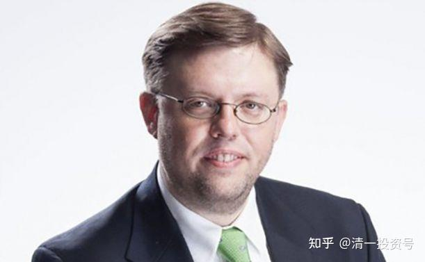

原雪球专栏45篇.美国教授被北大解聘，原因就是喜欢说真话！

清一山长 2018年10月16日

我们的国民不喜欢说真话的人。所以，你如果说了，就要被赶走。这不是北大的事情，我认为是整个国民的问题。比如，测试一下：您喜欢听下面这句话吗？还是想骂人？

“我最大的感受就是，**在中国，人与人之间缺乏最基本的尊重。**”这个就是美国教授的话，偏偏他说的就是真的。不过，**大多数中国人由于不懂“尊重”是什么，只懂“给个面子”**，所以看不懂这句话也很正常。这就是中西方文化的冲突。

“作为一个经济学教授，我觉得我都不能自由地发表对中国经济的看法了”。这个内容很滑稽，如果在中国，谈经济都有禁区，你还能谈什么呢？

“他说他后来简直惊呆了，**大部分人都认为挣钱才是人生的意义所在**。”可是，**在中国，如果你不谈钱，去谈什么理想和追求，才是令人“惊呆”的事情呢！**谈挣钱，才是人生“最合理的追求”了。

“为什么最近在报纸上发言的‘专家教授’的言论都那么奇葩。不是因为他们没有常识，而是那些睿智的学者已经不敢出来讲话了，搞不好会被扣各种帽子，会被水军攻击，学者的形象毁于一旦。”

我最近在电脑上看了几部最近几年新出的中国电影，其中一部还是孙红雷主演的，我看了都要吐了。完全就是幼儿园级别的胡闹，都是一些恶心和搞笑的内容。儿童如果这样玩过家家，觉得很有趣。但是这些成人，却在一本正经地胡说八道，真的觉得很恶心，根本就看不下去。西方娱乐片，比如007，施瓦辛格的一些动作片等，也没啥思想，但真的是娱乐，看了比较快乐的，并不恶俗。这些中国名人拍出来的电影，要么装模作样的讲道理。如《孔子》。要么就是过家家胡闹。我想：中国的电影人怎么会变得这么的弱智？

真正的问题，恐怕就是：**中国人不尊重思想，不尊重文化，也不懂“什么是尊重”吧！**

于是，问题出来了：**有原则的人，在中国，是没办法成功并且快乐的**。这个问题，你们怎么处理呢？难道逃去外国生活和工作，就真的好了吗？

**转发文章：美国教授遭北大解聘，临行之言，字字扎心！**

**[https://mp.weixin.qq.com/s/vbl3h3Gvf9ClL3IWUQbD7A](http://link.zhihu.com/?target=https%3A//mp.weixin.qq.com/s/vbl3h3Gvf9ClL3IWUQbD7A)**

近日，《糖堆儿实验室》发表的一篇文章，引发了很多华人网友的关注。

文章描述，在北大汇丰商学院的深圳校区，有一位教了9年经济商科的美国教授，叫克里斯托弗·保丁（Christopher Balding）。因为**经常愤而不公，言辞激烈，最后落得了被北大解聘的下场。**

作者表示，自己看了美国教授克里斯托弗·保丁的博客，认为他所表达的观点都是比较客观的。文章较长，部分翻译内容如下：

“我要走了，在北大汇丰商学院工作了整整9年，我要离开中国了。其实从去年年底的时候，北大教务处就告诉我不会和我续约了。而到了今年4月他们告诉我，说要和我斩断一切的关系。

我对于这几年在深圳的生活心存感激，能认识到这么多聪慧的学生我倍感荣幸。我当初接受这个教授的职位的时候，我就知道会有什么风险了。但是至少现在，我觉得我没有愧对我的良心。

在这9年里，我把一切都看在眼里。国外一些经济媒体，比如彭博社也会邀请我去做访谈，通过我在中国的视角传达给外国人。我真的是无比荣幸。

我3个孩子里面有2个孩子是在中国出生的。刚来中国的时候，对这个国家一无所知。我和我夫人当时觉得可能呆个两三年，我们就会走了。但是没想到，一呆就是9年。我现在最自豪的事情，就是我的孩子能说中文，而且能和中国的小朋友毫无文化隔阂地玩在一起。现在要离开了，还是有种说不上来的苦涩。

其实我有考虑过是否应该去中国其他的城市，或者去香港，或者去亚洲其它的国家。但是和一些同事聊过之后，我发现，现在已经不适合呆在中国了。现在，作为一个经济学教授，我觉得我都不能自由地发表对中国经济的看法了。与其被驱逐出境，还不如自己知趣地离开。

我想要说的是，我所有的抱怨都是针对某些体制的，而非个人。我很喜欢我的中国同事，即使是激辩，我们也是学术交流的目的。中国的友人也很友好，我的孩子也都得到了友好的对待。

但是住在中国，有时真的会让你哭笑不得。大家会觉得插队是常态，有些人也会不经过我们允许随意拍我们孩子的照片。中国每天发生的一切，都让我们觉得倍感新奇。

最有趣的事情，就是我以前是个五谷不识只会搞学术的教授，但是现在，我觉得我特别接地气。文化领域等等，我都开始了有了自己的见解。我**最大的感受就是，在中国，人与人之间缺乏最基本的尊重。**

所以，**人们对于法律、道德和规范同样的不尊重和漠视。**比如插队这回事，看似简单，其实就是代表人们对于公平这个概念的忽视。但是在中国，插队成了一种正常现象……

对于执法者来说，只要坏蛋不要太过分，也不会惩处他们。这就样“和谐”地生活着。就因为人们对于法律、法规本身创造的过程，有异议，所以大部分选择抗议的方式就是漠视。

而在任何一个其他的国家，你有问题你可以大胆提出来，这样才能改进。

来中国之前，我一直以为中国的国民还是比较拘谨的。但是后来我才发现，**中国是一个根本没有法律、法规约束的丛林。人们漠视法律，并把自己的意志强加给别人，最后制造出巨大的混乱。**

我有个律师朋友和我说，抓贪官的时候，他们最后的结论都是那个贪官“很倒霉”。人们难道没有任何正义感吗？这和倒霉有什么关系？坏人得到惩罚难道不应该吗？

中国现在整天都是围绕着这些东西转。比如突然，谁被车撞了，司机逃逸了，视频发到网上疯狂转载，大家热评谩骂。最后呢？一个星期之后，风口下去了，就开始讨论别的事情了。**对于人的生命，没有基本的尊重和珍视。**

我另外一个朋友是一个基督教传教士。他说有一次，一个英语角的活动邀请他去参加，讲一讲人生的意义。他说他后来简直惊呆了，**大部分人都认为挣钱才是人生的意义所在。**

最关键的是，挣钱可以，但是没人讨论，什么样的钱可以挣，什么样的钱不可以挣。

当上帝就是钱的时候，这就是你的信仰……

我最尊重的人，那是些可以奉行自己的信念的人。有太多的人，面对自身利益的时候放弃了自己的信念。很多人都没有原则，也不喜欢原则。因为有时，有原则会成为你前行的“障碍”。

很多人都忘记了，美国从头到尾不过也是一场实验。从诞生开始，就有移民不断地涌入。到今天为止，很多最高学府和硅谷中创业的人们中，都有这些移民的身影。但是在中国，这种可能性为0。

美国就是在不断犯错中，又不断改进中行进的……

在中国我最怕的就是被拘留。我也渐渐地感受到了最近对于学者言行范围的收紧。

我要离开中国了。说实话，我深深地吐了一口气。”

对法律漠视，却对异己变得狭隘且谩骂

《糖堆儿实验室》文章作者透露，他自己身边也有部分人表示不想在国内呆了。他认为，有原则的人，在中国，是没办法成功并且快乐的。最近很多北大、人大的泰斗教授离职，移民远去香港和美国。

前几年还有不少海归回国，但最近又出现很多“返海”倾向。很多已经回国后的人，抱着失望，准备回到国外去了。虽然移民很常见，但是已经回国的海归，又决定离开，那确实是说明了一些问题。

一个在国内受到尊重的学者，愿意抛下一切去另外一个国度生活，那需要多大的勇气。

虽然说现在的知识分子也开始沦丧了。但是真要说，在中国，还有点道德底线的人可能也只能从知识分子里面的一小撮里面去找了。毕竟，现在这个社会，想当赚大把钞票的人，都需要些许的道德沦丧。那么没有沦丧的人，就要从没加入漩涡内的人里面找。

可是，就算是不想陷入利益的漩涡，现在的学者也很难靠自己的思想过活。稍微不慎，就会被一拥而上，扒得体无完肤。

大家有没有想过，为什么最近在报纸上发言的“专家教授”的言论都那么奇葩。不是因为他们没有常识，而是那些睿智的学者已经不敢出来讲话了，搞不好会被扣各种帽子，会被水军攻击，学者的形象毁于一旦。

所以，别说这个美国教授害怕，哪个在中国的教授不害怕？

不可否认，现在大胆讲话的人越来越少了。不仅害怕被扣帽子，另外一方面，还有一堆网络愚民对你谩骂……

走后门，托关系，作弊、抄袭、造假，炒高房价，不把消费者的命当命。在这样的环境中，你能开心地活着吗？

作者最后直言，“当道德和成功变成一个二选一的选择题时，我们也离彻底沦丧不远了。”