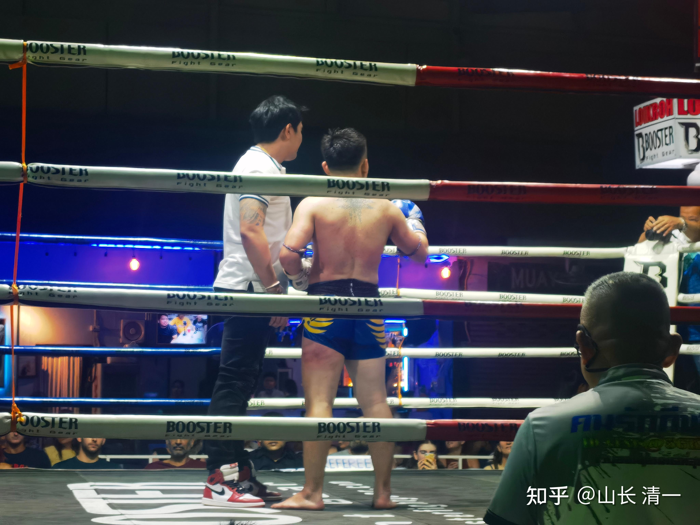
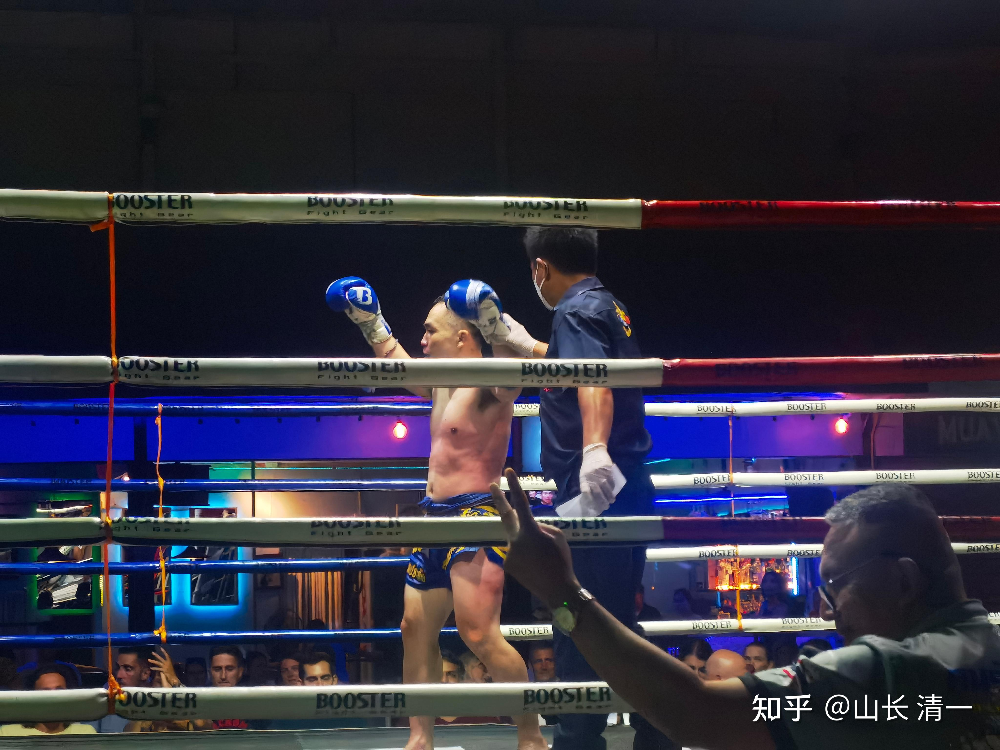
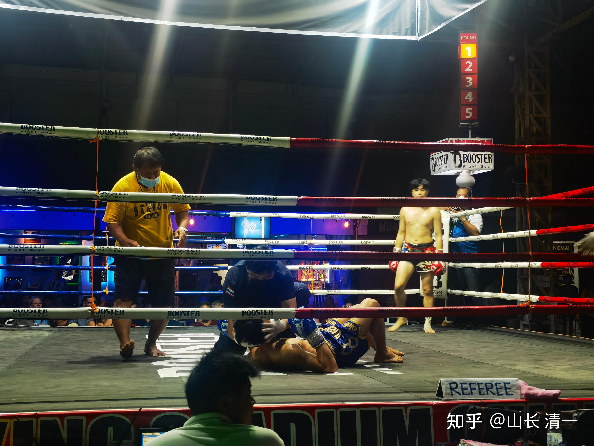

昨晚的征泰比赛打了三场，一胜（KO获胜），一负（点数负），一平局。有点好玩的结局。虽然按照我的预判，是应该收获三场胜利的。但这个结局，说明木兰们的控场能力还比较弱，还需要更多的历练。我们还有很大的提升空间。

第六场比赛，是明晓上场，这是她的征泰第三场比赛。对手是13岁开打，已经收获了50战的老资格泰拳选手，结果是第二局就轻松地KO对手。由于我知道她们的实力应该是远超对手的，我就交代的是：前三局打了玩，不要出重手。第四局再KO对手。KO不了，第五局再接着KO，留个保险系数。但由于明晓已经两个多月没上场了，控制节奏有点控制不了，加上对手很顽强，反击出腿，都快速而有力，不小心会被反KO的。因此，明晓面对顽强抵抗的泰拳手，不自主加大了攻击力，于是搞笑的局面就出现了：刚到第二局，明晓就KO了对手。当对手面对她的飞膝，吓得抱头弯腰来自我保护的时候（其实飞膝也是故意吓她的），她马上控死了对方的身形，故意缓慢地，高高地抬起肘部，假装要砸下去。裁判此时赶快过来拦住她，宣布她获胜，结束了比赛。场下看她这的样子，哄笑成一团。只是，收获了这个KO的局面，让她郁闷极了----还没打过瘾呢，这么快就结束了？赛后她就找主办方：今天能不能再打一场？主办方居然答应了，就把预备下周与佳惠配对的拳手，拿来与她再打第二场。由于体重是按照佳惠的体重来排的，所以更重一些，明晓比佳惠轻7公斤。而且主办方说：第二场是没有出场费的。她还要把第一场得到的出场费，让给对方。因为泰方组织者，肯定不愿意额外拿钱出来做临时安排选手的出场费。小木兰也不在意打比赛有没有钱，就高高兴兴的答应了。于是，就有了昨天的【一对二】比赛，很难得这种机会。一天打了三场。

[https://www.zhihu.com/zvideo/1527610544953864192](https://www.zhihu.com/zvideo/1527610544953864192)

这个第六场比赛比较好看，虽然明晓是尽量“收着打”的，但也充分展现了古传武术“遇敌好似虎扑羊”的特点。对手反应很快，扫腿很有力量，速度也快。但耐不住木兰更加变幻莫测的打法，在明晓面前完全是一副羔羊的样子，看上去完全没有抵抗力。她在场上的实战中，已经打出了太极野马分鬃的威力。对方在此招面前，是毫无办法的，一接手就要连退几步。尽管明晓其实没有充分发力攻击。不知道你们有没有看出来这一招的应用场景。细节我就不多点评了。反正是目前8场里面，最有含金量的一场比赛， 看起来也最好看。就是结束太快了。

太极征泰第七场比赛，是木兰佳惠的第四战。不过很遗憾：上场前两三天，她就得了感冒。这两天下雨降温，加上她们运动出汗多，导致着凉。上场前嗓子都是哑的，赛后还因为头晕，加上比赛中体力透支严重，还吐了。而且她下场后，人都麻木了。昨晚小女夜深回来，我说佳惠这次打输了，是不是又哭了一场？小女说她打完之后没有哭，只是不开心很累的样子。我说：不错喔，现在长大了，已经学会不哭了，知道面对一切结果了。但是，今天一早，我去看孩子们，得到的消息是：今天早上起来，佳惠就开始哭了----可能昨天脑子真的打麻木了，连哭都不知道。今天睡一夜，休息好了，情绪才反应过来，开始会哭了。有点搞笑。

昨天我说：如果身体感觉不好，就别上场了。但她一再表示没问题，很有信心轻松击败对手。我想就算是体能差一些，但她的技术能力远超泰拳手，如果集中力量攻击，也没几个女拳手挡得住她的。就交代她别玩明晓一样的游戏，蓄力不发，慢慢控场等。她体能可能不足，可以开场就开足火力，尽快KO对手，避免过多消耗体能。结果谁也没想到：她上场后，居然不用自己的长项：她很有优势的远攻火力。甚至打内围，近战火力也不用了，她本来擅长的肘膝技术，内围战中用的很少。我看很多时间就是毫无目标的拼力气乱摔，胡乱缠抱。连上一次第三场比赛中，她的转身泄力，漂亮地摔对手的技术，都没用出来。她居然忘记"转身技术"了，“技术失能”很明显。中间几个小公主，在场外不断的提示她---打野马分鬃，用膝盖顶，等等，居然也没用。最终她辛苦地打满了五局，把双方都累得够呛，双方体能都透支严重，她自己也弄到连哭都没有力气了。我认为可能是她生病后，脑子发晕，忘记了作战要求，上场也比较紧张，最终就是凭本能作战了。平常教的技术战术，此时完全没有用出来。导致这场比赛的失利。也说明内家拳的格斗要领，还没有进入她们的本能深处，一紧张就忘了发力技术。所以，未来的路还长。不能看她们平时能够用出来，就以为掌握了。真正的内家拳，可以在病中也爆发巨大的力量，一击就伤人。虽然自己也会因此受损严重。但本能的爆发是很强的。木兰佳惠此战的表现，说明她“炼心不够”，心在遇到外缘干扰（如疾病，心理紧张等），就容易失去控制。将来遇到很懂心理的高级拳手，故意在赛前刺激她，也会导致她失去理性，情绪上来后场上乱拼杀，大量消耗体力，就有机会击败她了。这是高级拳手的“场外技能”之一。因此，为了防止情绪控制不良，今天我给她的任务，就是练功同时“炼心神”，以后，她每天都要认真念十遍【太上老君清静经】，让心神宁静。才能发挥出平常训练的技战术水平。

虽然我没有料到木兰会失败，但昨晚意外得知她比赛失利后，我也没啥感觉。我告诉大家：只要她没被泰国人KO就好。起码保住了自己，也算不错了。泰拳是很残酷的比赛，上场都以KO对方为目标。打得特别狠。

下面是昨天的现场情况的播报：“第一场比赛打得好激烈，打满五局，其中一人以微弱优势赢得比赛，但结束后前胸后背和大腿侧面都受伤了。第二场比赛，一开始其中一方就被KO了。明晓的第三场，也KO了对手。「点评：大家可以知道泰拳的狠辣了！一点也不客气。就算打赢，也伤痕累累的下来。”

*看赢家大腿，被击的红肿没有？*

*看他的身体，他被击中了多少个扫腿？绝对受伤的。*

*第二场开场就被KO的男拳手*

上图，是昨晚第一场，和第二场比赛的结果：前两张，是第一场的赢家。赢也很惨惨：他的肋骨部位，大腿部位，都红肿了，要休息很久的。我们的木兰虽然输了，但身上没伤，今早照样练拳。这就是太极的价值。泰拳，赢家就是抵抗力最强的。不是“能躲过攻击的人”，这就是格斗原则不同。这个泰拳手遭遇的这种打击，对于大多数中国没有练过抗打击力的传武人来说，很容易就打断肋骨，以及导致大腿受伤，KO倒地，无法再战。不少格斗技术好的欧美拳手，就是这样被“看起来技术很单调"的泰拳反杀的。所以，泰拳真的很残酷。

第三张图，就是被KO的男拳手照片。因为人体的头部是扛不住重击的。如果运气不好，所以只能躺在地上了。泰扫的威力真的很大，就算是女子拳手，我在拳馆看她们打沙袋的样子，威力也不亚于男拳手，力量很大的。木兰们说：差别主要是硬度上不如男拳手。但场上被女拳手扫中头部，也很容易被KO的。

昨晚就小木兰们汇报：佳惠面对的泰国拳手，腿法很厉害。而且对方似乎对输赢看得很重。昨天晚上前方传回的现场消息【看到明晓打赢了，准备跟佳惠打的女孩有点紧张，一堆人过来给她支招鼓励，还有一个穿运动套装，看似教练的人，现场给这位女选手钱(远看像1000泰铢)，女孩不好意思接，最后还是收下了】。我怀疑是赌拳了。今早我看视频，不仅仅这女孩的拳腿很厉害。三个跟木兰们对阵的泰拳手，腿法都很强。速度力量，反击时机都不错。的确是老手。当然，她们遇到了正常发挥的明晓，就没有问题，看起来也不厉害。但遇到状态不太正常的佳惠，头晕导致反应速度下降。因此泰拳手们更容易发挥实力一些。估计佳惠面对强悍的泰拳手她有点紧张，导致缺乏技巧的有点乱打。这个教训来得很及时。同时，我们的失败，也让泰方不会太在意我们。不认为我们是不可战胜的，更不认为我们有技术。小女偷听泰方主办人议论，说这两个中国人可惜了，技术不行。不过力量很大。学了泰拳技术就更厉害了。但看样子没学好。这样瞧不起的话，未来也会有更多的自信技术学得不错的泰拳高手，会愿意跟她们这种“只有力气的外国粗人”打，可以继续刷战绩。

昨天我们的泰国工人们有几个喜欢拳赛的，也去看了比赛。宋老师的报道【小木兰们昨天的勇武精神给工人们留下了深刻的印象，他们很喜欢看孩子们的战斗，说她们是拥有强大身体和心理的战士[注意到没---不提她们的技术好，就是敢于斗争，身体强壮，没有“善于”斗争的]。虽然回去的路上已经很晚了，我都困得想睡了，他们依然兴奋的讨论着。Jams说，下次他要带他的姐姐姐夫来看孩子们比赛，他的姐夫就是最早提出可以给孩子们做陪练的邻居。阿伦回家后在网上找了一个如何防范被踢的教学视频，请我转给孩子们学习。】

[https://www.zhihu.com/zvideo/1527614593275203584](https://www.zhihu.com/zvideo/1527614593275203584)

太极征泰第八场比赛，是一场被意外终止了的比赛。本来比赛是五局制。但第三局结束后，双方都在准备第四局比赛的时候，主办方突然终止了比赛，宣布双方是平局。对方团队大喜，现场都跳起来了在欢呼。估计他们前三局都看出来不是木兰对手，也很担心她第4局会被KO吧？场面上，对手是节节败退，毫无抵抗之力的。只是明晓明显的攻击，一直竭力控制发力，尽量“点到即止”，看上去是似乎没有攻击力，像个菜鸟。其实是她不想发力，以免提前KO对手。她准备第四战才出力KO，打出太极的威风来。结果被提前终止，还被判了平局，她下来后郁闷极了。说应该第三局就KO对手的。各位有兴趣就看看。看你们能够看出啥门道不？

[https://www.zhihu.com/zvideo/1527615263645777921](https://www.zhihu.com/zvideo/1527615263645777921)

1172王一苹杭州 12:05:11

佳慧不是一直占上风吗？最后怎么输了[表情]看不懂

0638张长培上海 12:09:34

因为对方人多吗？

0760王文敏玉林 12:10:34

佳慧是一直占上风，但他没有战胜裁判！

山长 清一 12:12:45

@1172王一苹杭州 在泰国主场作战，如果不KO对方，基本上不会判外国人获胜的。佳惠没有压倒性的胜利，当然输了。就算是明晓的第四场比赛，场面是完全压制住泰拳手的，优势非常的明显——场上的泰拳手，一次都没有能够击中明晓。所有的攻击，全部被化解。而且泰拳手的攻击明显要比明晓的弱得多。明晓非常明显的多次击中对方。就算没发力，也应该算分的，应该是判压倒性优势胜利。但最终，居然还是判了一个平局，黑木兰黑的很没脸面了。如果明晓不小心，在场上有几次被泰拳手击中有效部位的话，肯定就是要判她输了。跟点数无关的。佳惠第四战，由于状态不好，有几次是有被对手击中的场面。虽然泰方并没有真正伤害到她。她也击中了对手，而且有点重。对方头部受伤，中间都在用冰覆的。但由于她没有场上成功KO对手，这些击中就不算得分了。至少在我看来，泰国裁判是这样对待我们的，击倒才算有效发力，击中不算。

而且更令人惊讶的是———明晓的第二场，场上的裁判，居然一直在给明晓的对手递招，教她怎么打，不断提醒对方。估计裁判认为外国人不懂泰语吧？只是裁判忘了：明晓虽然是外国人，但她是懂泰语的。这是明显的拉偏架，场上裁判和场下裁判一起算计我们。但——我们在泰国客场，一切潜规则，也只能认了。我们服从裁判的结果，不去争议。泰国人说我们输了，我们就认输好了。以后有机会，我们再打回来就行了。【虽然比赛输了，按照约定，我是要出钱给泰方馆长的。今晚我就会去交钱的。但我们不会计较结果，你说我输了，我就给钱好了。我们就大气一点好了】。对泰方，这种不公平，其实对泰拳手是有坏处的：木兰们将来肯定是要在赛场上竭力，去KO对手的。场下训练，也会把KO作为重点来练习。因此，我方只能让泰方的裁判，唯一的作用， 就是在KO之前，拉住木兰下手，改成TKO。这是他们能够做的对泰拳手的最大保护了。我们也愿意，并故意配合对方的偏心裁判，去达成这种局面。真打伤了人，木兰们也会不忍心的。虽然知道对手对于打伤她们会很快乐的。泰拳手以KO对手为最大快乐，特别是KO外国拳手。我相信：泰国裁判会很乐意看到我们的小木兰被KO的。假如我们处于弱势，裁判该拉住对手停止攻击的时候，裁判一定装傻，绝对会放纵对方肆意攻击我们。因此---木兰当自强！