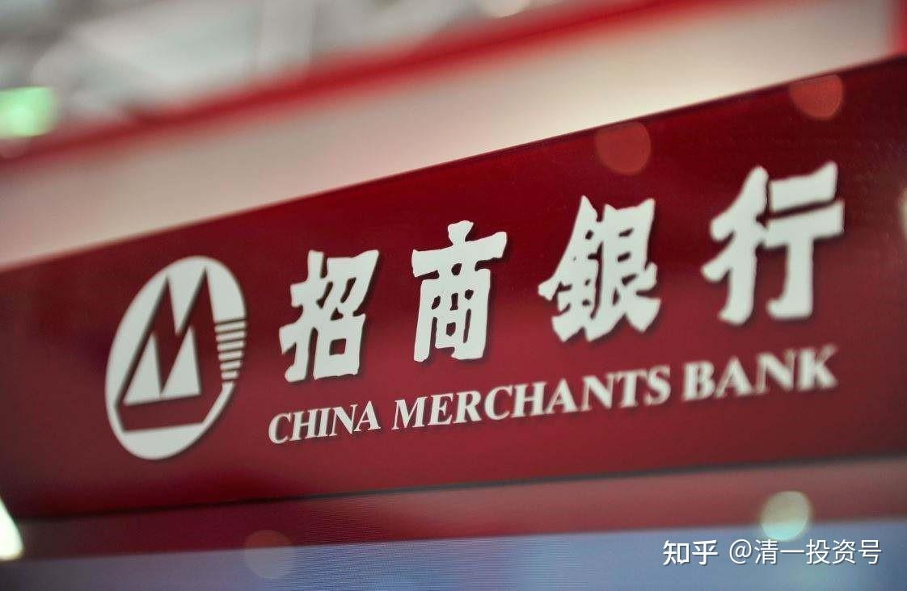

**

**

43篇.小商人投资法”之运用——2016年“招商银行”的买入与卖出

清一山长2016年1月5日～2016年3月4日

一、持仓原则：不和股票谈恋爱，只与低估值做朋友

二、分仓投资并同时买入“江南集团”的投资逻辑

三、投资就是要买便宜的货，并以较高的价格卖出

四、买入低估的“好企业”，而不是低估的资质平庸的企业

五、重要的是坚持按交易原则操作，而不是一时的盈亏

**一、持仓原则：不和股票谈恋爱，只与低估值做朋友**

清一山长2016-01-05 14:57

$招商银行(03968)$今天17元买入五万股招商，逐步补回我比较缺乏的“招浦兴”仓位。另外买入十万股交通银行（03328）。5.21元。**理由：实在是太便宜了。从K线上看，是五年来的底部，招行H则还有两元的差价。**中信仓位已经较大，就再等更好的机会。

**不过，从博弈的角度上看，今天不是买入的时机。**因为银行股新利空（坏账增加）刚开始发酵，还有下跌的空间。但忍不住，先买一点，主动入套好了。

清一山长2016-01-07 12:43

前两天刚开始买招商银行，今天就跌了。跟风学我的一定吃套。**我一向股命不好，往往一买就套。要不是靠“忍住不卖”这一救命大绝招，早死了多少次了。**今天继续加仓，买入招商，15.94元港币买入，感觉很便宜。特别是这笔钱，其实是前期19.98元的浦发换出来的（我是属蜗牛，换股很慢的，看到低了慢慢买，不急的。就是卖的时候，会相对急一点。因为我知道牛短熊长），这样怎么算也不会亏（心理安慰法）。要等招商跌到8元港币后，才接近我买入浦发的成本价（9.1元）。但这种可能性应该几乎没有。今天交通银行不够意思，怎么不跌个5%以上？不过也可以继续买入部分仓位拿分红。

清一山长2016-02-12 16:28

今天忙于买股，招商银行12.80元HK（下同），民生银行6.17元，重庆农商3.51元。青岛港2.66元，秦港股份3.16元。江南集团0.99元。中联重科2.00元。**大多数都是收息股。多数小票，比惠理的增持价都腰斩了（我：跟国王散步，高安全边际）。看你还能跌到哪里去？**

中联重科今天看很危险，没想到会跌到这个价。我去年3.6元买进了10万股，幸亏后来涨到五元多，某一天记得涨了20%左右，觉得一天赚了两个涨停板，一高兴就卖掉了，不然拿到今天可危险了。目前觉得已经到了买入周期，特别是这么便宜的价格。目前这样跌，实在没天理，就当回到2014年年初，11元左右买招商银行A的时候了。**当时买后A股继续下跌，最低时候账面浮亏数百万，但只要不卖，就能成为最后的赢家。**

下周开始，可以用港股通继续买招商等了。以后再狂跌，就只能启动融资了（不到最后关头不用融资）。**当然，最重要的是：去年在冲20元上方的时候把招商浦发等全卖掉了，不然哪里有钱今天来买。因此，我认一个死理：跌了就买，没钱了就装死，连账户都不看。涨了就卖，涨过估值超过某个位置就全出手换低估的票：不和股票谈恋爱，只与低估值做朋友！**

**二、分仓投资并同时买入“江南集团”的投资逻辑**

清一山长2016-01-07 13:40

今天15.94港元买入$招商银行(03968)$（相当于不到14元RMB了）。另外1.33元买了$江南集团(01366)$，股息5%。基本面？没有太多研究，只知道是中国第二的电缆制作商，而且得到了国家电力公司的订单。技术面？胡乱猜是不是主力挖坑。俺是“乱”派投资者，不按牌理出牌。

主要买入江南的理由就是：香港号称很会理财的投资公司【惠理】花了1.94港元买入该股，花了一亿元。我猜他们的财务人员和调查人员都不是吃干饭的，假如是老千公司逃的话，早就发现了。还有就是本公司员工持股，是采用回购股份的办法，价格是1.67元。**我觉得这些知情人和“国王”的行动，给了我足够的投资安全空间（比他们低20-40%的安全边际），就大胆买入了。**

次要理由就是：老是买银行股的话，连大妈都会。因此玩点有技术含量的，比如：中国企业基本生存需要概念股之类的。丰富我的投资经验。

**第三个理由就是：我的港股账户还是要开融资的（我看1.5%的利率也眼馋），我的基本仓，就不能单一持股了。因此，我需要配置不同行业来回避爆仓的风险。**然后用红利来覆盖融资的利率，外加每年多的分红来过生活……靠借外国人的钱，再生钱来过日子，比打工有成就多了，而且很“爱国”——呵呵。

**三、投资就是要买便宜的货，并以较高的价格卖出**

清一山长2016-03-04 15:24

刚才以16.48元，卖出招商银行H股最后的持仓头寸，共12万股。理由：相对其他银行股，它已经太贵了。我把资金腾出来，买更便宜的股。**投资就像是做生意，只有买便宜的货，并以较高的价格卖出，才能赚钱。存在仓库里贬值，生意就要破产。这是我的小商人投资法。目前看来很有效。**

清一山长2016-03-04 15:44回复@hsxuan:

呵呵，本人就是小本生意，投资做做小生意而已，格局是不大。比不过安邦这些土豪大人。不过俺去年7月8日把库存了的一年的招商A以20.78元，一单30万就卖给安邦们了。招商是帮我赚钱最多的银行之一，这也是本人很自豪的投资行为，因此我对招商银行很有感情，一直想拿回来。近期终于如愿后，没想到有土豪想要，就让给他们了。**只有土豪们大人大气，才会高价买，谁让他们低价不要的。**我喜欢大格局的人，也包括你。

**四、买入低估的“好企业”，而不是低估的资质平庸的企业**

hsxuan:回复清一山长:

您这和做短差有啥区别？最终就不怕劣币驱逐良币，把宝贵的筹码全集中在所谓低估的，资质平庸的企业上？我认为大格局至少看十年以上，届时总结功过得失，看最终结果，您可能就会后悔今天的策略！真正的大格局是通过判断企业价值的高低来决定是否持有或抛出股份，而不是受市场价格的牵制与诱惑，短期的价格波动确是应该忽略的！我所认为的大格局仅是指这个，没有任何贬低您个人的意思。只是针对投资策略，跟本金大小也无关。

清一山长2016-03-04 16:02回复hsxuan:

我很同意您的观点。我认为我正是这样做的。**我喜欢买入的是低估的好企业，而不是低估的资质平庸的企业。**A股我还有不少，卖掉招商后低价换的兴业，还不想卖掉，因为还没找到比它还低估很多的好股。比如，目前我三元多重仓的中国宏桥，就是低估的好股票，不是低估的烂股，就是计划拿十年的。虽然涨了20%多了，我也没有卖。我想持有20年，除非土豪来抢就让他们。

今天招商卖出的部分，我也计划下周买入一个低估的十年股。**其实我一直不喜欢买名牌，因为名牌贵，但我喜欢名牌打折的时候买一点。**招商前段时间跌到12.80元时，我就很淡定的买进了。但当时周围很多人警告我市场还要下跌。N多的理由。今天也有N多的理由要我不要卖。但我看到还有更便宜的可以买，当然要出手了。

hsxuan:回复清一山长:

虽然中国人的中庸之道催生了您这样看似投资与投机相结合的完美策略，但我还是坚持认为投机与投资在价值投资领域是不能融合的，正如左侧交易与右侧交易是水火不容的一样。如此搬砖或配对交易，真的是投资的真谛吗？！历史上没有一个投资大师采用的是这个策略成功的，您确定这样操作能超过那些大师的水平？原谅我就是认死理，觉得只有执着的坚持某一方向才能最终获得大的成功，始终认为“中庸之道的确不适合于投资”！

清一山长2016-03-04 17:17回复hsxuan:

我就是典型的左侧交易者。我没有觉得我的操作违背了左侧呀？左侧买入，左侧卖出，很正常的。您好好研究下左侧吧！我也觉得我没有违背价投原则，只是更灵活罢了。

随便说说，我23年来的投资收益率水平，虽然比不上很多牛人，但是远远地超过了巴菲特年复合20%多的收益率。当然不是说我比他牛，我想是中国提供了巴菲特没有的机会，因为中国人更疯，造成了更低的谷，更高的山。我干嘛不利用这点？

**五、重要的是坚持按交易原则操作，而不是一时的盈亏**

@云蒙回复清一山长:

清一老师，您这个节奏把握得好啊！招商银行H股一个月的时间涨了30%，而建设银行等H股只涨了11%。快报前我给予与中信银行H价值中枢比值在3.2-3.3倍，我当时陆陆续续也换了48万股，快报一出吓得我赶紧下调价值中枢，将刚刚换回来的招商银行换成建设银行、工商银行了，这一换少涨10%，50多万的利润我要薅多少盈透证券羊毛啊！咳......

清一山长2016-03-04 17:10回复云蒙:

其实我很佩服你的配对交易原则。**今天看你中信换建行的操作，不说未来亏盈结果，起码这种投资思路，我是很赞同的（只是我可能更喜欢换重庆农商行，纯粹是估值角度更低一些）**，但你要为杠杠提供流动性，显然建行最合适。我未来要上杠杆的话，也会买入建行和工商做配比的。

**招商你出早了也不必遗憾。因为你的原则就是这样的人。**我上一批也出早了。只是我的资金比你多一些，执行力比你差一些，办事拖拉带来的赢利，不是什么本事。谁也不知道招商会这样涨，也许下周回来看今天，我的“精准操作”就是个犯傻的冷笑话。

我今天为出掉招商，一直纠结了很久，到底是出掉手上的兴业呢，还是招商H。估值差不多。**最终出掉招商，原因就是你说的招商涨多了，另外港股估值比它低得太多了，就下了决心。**我总认为今天的大盘，不是你说的风格转换，而是主力有意的抬轿子，倒像是为了创业板出货拉抬蓝筹指数一样。下周如何走，就不知道了，现在似乎不是大幅上涨的时候。因此拿一些资金在手上安全些。

另外，我的资金投放，目前主要用在“非银行”上。主要标的，是中国有竞争力的，被严重低估的制造业企业。我觉得如果中国经济企稳，这些企业是获利最大的。这些思考供你参考。

祝福你和家人！

