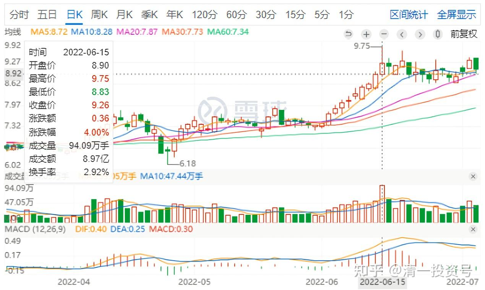
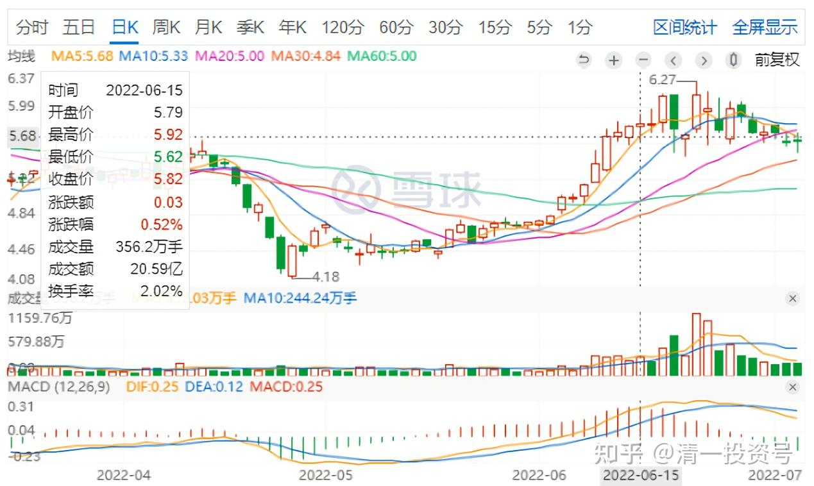
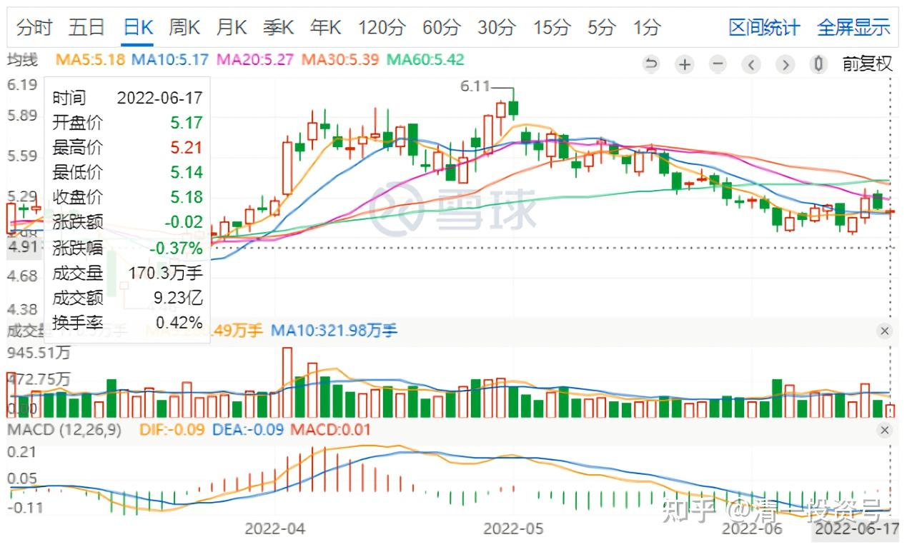
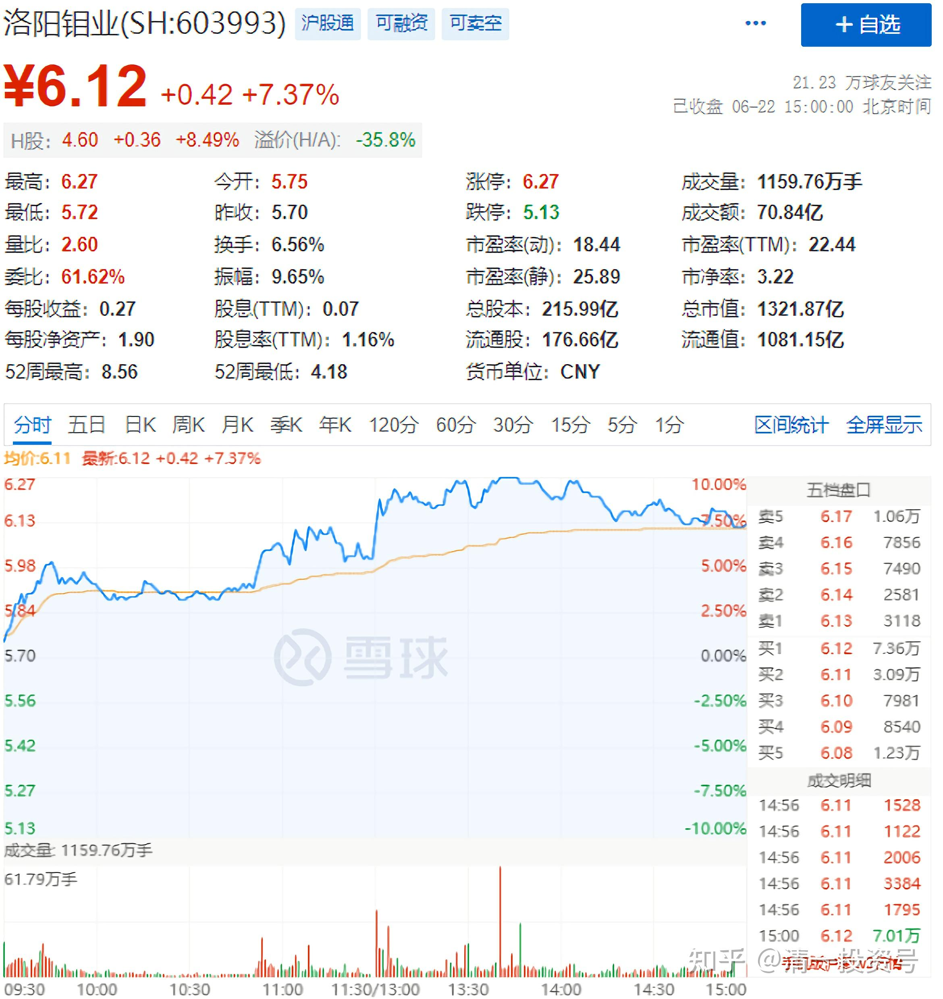
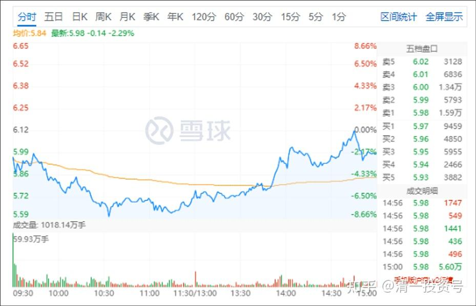

27篇.洛阳钼业有成为妖股的潜能

山长 清一2022/6/17 18:18:51

三天前，我在群里公布给了大家我的操盘消息：卖掉了一部分金钼股份，最高成交价是9.79元。因为涨太快了，6元多买的。我一般有涨快了就卖一点的习惯，涨停了就多给一点。但内心，我很可惜放弃了有色的股份，我的股变少了并不开心。虽然钱变多了。所以，我当时就去买了没咋涨甚至还跌了一点点的洛阳钼业，补上仓位。

当天其实就涨了。这两天涨不多。刚才，我去看了一下盘面，突然发现洛阳钼业今天一天就涨了不少（白天开市时间，我都只关注燕京走势了，没打开账户看）。我卖掉金钼的思维，就是想：**如果钼业强势，洛阳钼也不差呀？**上次我记得是5元买洛阳，涨了50%之后，就卖掉了。然后舍不得丢筹码，就去买了7元的金钼股份。结果很快金钼就冲高了，又涨了50%，我就全跑了。所以，**这两个股切换，去年就玩得很开心**。

今年反过来切换，因为金钼意外先涨了。洛阳最近一直死跌。害得我只能多买一点。三年前的这次操作，今天来看，金钼今天最低跌了超过10个点，洛阳涨了至少7个点（相对于我的买卖点来看），差价还是不少了。主要是多赚了一些股票。假如洛阳明天再涨，我想是不是就卖掉洛阳，重新买回来跌了不少的金钼呢？不断吃这种换股的差价？

家里老人的养老账户，我就是吃差价玩，现在市值几乎就是盈利值了，全是赚的。前段时间，主要仓位是中国建筑，冲过6元多的时候，正好是燕京啤酒跌破7元的时候。今天我看燕京大涨，我的主仓位不想动，想等它涨停再动，不涨停就不动。反正不涨停我也卖不掉多少货。我就打开老人的老人养老账户玩一玩，**9.20元卖掉了几十万股燕京，买回了同等金额的中国建筑股票，买入价5.43元。**算是补回了上次卖出的货（上次我居然几乎卖光了这个账户的中国建筑，原来持有三百多万股的）。这个跷跷板坐得很好玩，明天谁涨谁跌我都不在乎了。反正我的股票多了不少。

数了一下老人养老账户中的盈利，居然有700多万元是四只酒股票赚的。目前燕京是主仓位，总共买了200多万股，今天卖掉四分之一多一点。说明中国人对酒的感情，真的很深。不能自己不喝酒，就不买酒股票了。损失的多好的赚钱机会。下次我看要不要买点肉股票了[大笑]，等到周期底再说。**现在我看，是有色的周期底部位置，多买点金属吧！**

**

*金钼股份日K图*

**

*洛阳钼业日K图*

*中国建筑日K图*

山长 清一 2022/6/22 17:36:27

洛阳钼业今天70个亿的成交，惊着我了。相比之下，中国建筑才9个多亿的成交额。不知道何方圣神，太有钱了。前几天砸盘几个亿。今天就把金钼股份涨超过9.6元的时候，卖出去换进来的5元多的几十万股洛阳钼业A股，部分头寸卖出去了，成交价6.19元。**因为我的主要持仓，是3元多买入的H股。我总觉得A股长持不合算。**就是投机玩玩的。这样乱涨起来，当然卖掉。要不这两天，再考虑重新买回跌破9元的金钼？算是做T成功。成本不断降低，股份不断增加，这就是我努力的目标。

从洛阳钼业，各位看到了资本的力量。利用手上的资金优势，大幅拉涨，大幅杀跌，让散户完全失去方向。**因此，身为信息不灵的小散户，各位的做法，绝对不是追涨杀跌，比聪明，我们只能跟主力比耐心。只在低位的时候买入，然后继续跌，就坚守不动。如果大涨，可以考虑暂时离开。跌了继续回来。卖飞了就找别的股票去。你这样不执著的话，主力根本就杀不了你。我靠这一招“认输”策略，在股市上坚守了30年不败。**相信这个经验对你们有帮助。

**今天洛阳钼业大成交背后，就是新老股东大换位。**未来一定有大动静。未来难说成为牛股，我今天的出掉筹码，可能是被洗了（只有一半）。但主仓位H股，我会坚守不动的，持有好几百万股洛阳钼业，不会轻易被他洗掉的。这个股，未来长期持有没毛病。而燕京，将来会出现洛阳一样的情况的。洛阳钼业有可能是主力急于要货，才会这样拉升。这个价格，要说拉升是为了出货，我看是没啥利润空间的。前段时间打到4元多，也是主力所为。故意杀跌，就为了5元多大量进货的。就像目前燕京，出货是没有利润的。一打就跌掉7元多了（主力的成本区），因此，未来只有一条路——上涨。**但上涨放量，就要小心了。超过成本区50%幅度的上涨，就提供了主力获利的空间。**上一轮洛阳从5元多涨到8元多就是出货的。因此当时我跑掉了。

山长 清一 2022/6/23 14:32:18

*洛阳钼业2022年6月23日*

今天中午一开盘，就把昨天卖掉的洛阳钼业买回来了。还多买了十几个万股。因为没想到今天跌这么惨，跌了8个多点。但我想法很简单——就当昨天的货没有人要算了。没想到刚才差点拉红[滴汗]。这是老天送的零用钱。这个股实在太疯狂了。现在又是50多个亿的成交。到底值多少钱？谁知道。我反正头脑简单一点，做肯定不会亏的生意就行了。今天拉高，我就绝对不参与了，又不是没货买。居然大幅杀跌？而且本来价格就不高？我就买回来好了。**我感觉：洛阳钼业有成为妖股的潜能，现在就很妖。**

参考链接：

[清一投资号：39篇.投资新能源的正确方式](https://zhuanlan.zhihu.com/p/529257267)

[清一投资号：26篇.新能源产业链投资规划（重要）](https://zhuanlan.zhihu.com/p/534678751)

[清一投资号：25篇.存钱不如存铜存铝](https://zhuanlan.zhihu.com/p/534377433)

[清一投资号：24篇.黑云惨淡时，默默地坚守](https://zhuanlan.zhihu.com/p/531111776)

