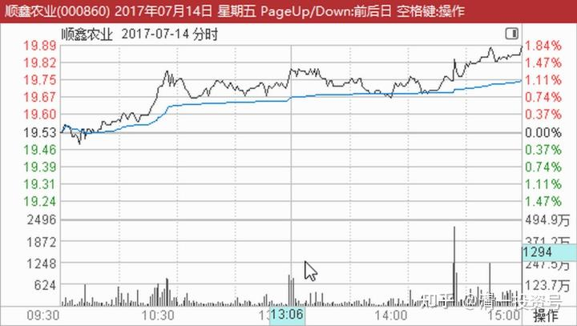
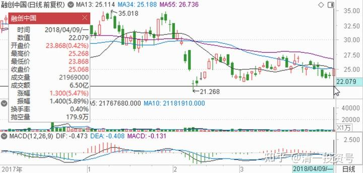
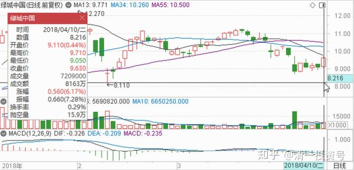
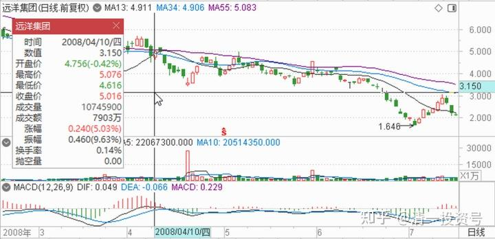
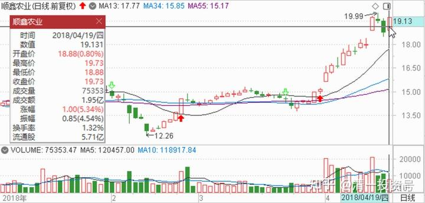

44篇.顺鑫农业记录一：开始关注买入

清一山长2022年6月7日

长庄股：大家可以参考顺鑫农业原来的走势，这就是“长庄股”的走法。我甚至有点怀疑，现在的**就是原来的顺鑫主力。当年这个顺鑫的老庄，也是恶心人恶心得要死的。把很多老手都熬垮了。很多人刚涨一点点就走了。我是中途进场的顺鑫，都被这庄傻熬了两年。幸亏后来守住了，结果还算不错。主升浪的钱赚到了，吃了鱼头和鱼身子。虽然最后的晚宴中，似乎鱼尾巴最好吃，但我们就别指望吃全了。

**顺鑫记录一《开始关注买入》**

**一、开始关注买入**

**清一山长2017-07-14 21:27:25**

我刚刚关注了股票$顺鑫农业(SZ000860)$，当前价￥19.89。

**51nxp:**

$顺鑫农业(SZ000860)$不断加仓，融资从20.3买到20.15。

因为顺鑫比去年6月的高点还有20%的空间，白酒股中大部分都创历史新高。

如果房地产的8000万亏损减去，酒类业务还是蛮好的。

[@股海摆度人](http://link.zhihu.com/?target=http%3A//xueqiu.com/n/%25E8%2582%25A1%25E6%25B5%25B7%25E6%2591%2586%25E5%25BA%25A6%25E4%25BA%25BA):回复[@51nxp](http://link.zhihu.com/?target=http%3A//xueqiu.com/n/51nxp):即使回到6月份的时点，你还是会选顺鑫，大姐你这不是固执而是偏执了吧！

**51nxp:回复@股海摆度人:**

你要说偏执也行，对没有泡沫的资产的偏执。

回到6月，18元的酒鬼和25元的水井坊，你看它们对应的市净率和白酒销售额，我只会选顺鑫。我只有这个本事，赚不到市场追捧它俩2～3季高成长的钱，因为我当时对次高端是完全不感冒的，这是我认知的缺陷，所以我赚不到这样的钱。

我常常醒来后后悔的是错过平安太保的这轮上涨，你可以翻我3月初的贴，我是多么看好保险股啊！那时我就发帖说2017和1997、2007年一样是价值股的大年，且关注到平安太保的股东数量急剧下降，太保降到上市后的最低点，然而因为4月的降杆杠，潜意识则是新黄浦和天健的捞偏门成功让我放弃了自己固守的保险股。

天道轮回，万事都有因果。

错过了，就固守自己的堡垒，只要自己买入的逻辑还在，那就不忘初心，绝不能两面挨耳光。@顺鑫农业(SZ000860)$

**清一山长2017-11-16 17:05:51 @51nxp:**

支持！[很赞]。

**只有真正看懂了自己投资的人，才会如此淡定地坚持自己的投资逻辑。**回头看自己放过了的好股，大多数人都会承认自己的“投资错误”。其实，真正看懂了股票的人买入股票后，只要基本面不变，股价的变化并不能代表“老师的正确答案”。我今年跟随买入顺鑫的逻辑很简单：**一个企业业绩正在不断快速成长的股票，有什么放弃的理由？涨不涨，是市场的事情。买不买，是我的事情。**19元多买入，坐了几次“电梯”，有人遗憾，我不遗憾，因为20元出头，我根本就不想卖。坐电梯就是我最理性的选择。

**樱桃小王纸 评论：**

$顺鑫农业(SZ000860)$

30块钱前最后一贴目标价80+；

注意：重点关注周K，日K影线 阴线可忽略；

参考对象：方大炭素当时起涨前的走势；

龙龙地产、燕京啤酒，稍微看一下当作参考；

耐心持股是唯一制胜法宝；

我的成本14元别和我比[笑][笑][大笑][大笑]

**@51nxp:回复@樱桃小王纸:**

顺鑫上30元我也换车，2016年7月买的44万的雷克萨斯换rx450h的雷克萨斯.

**清一山长2018-01-21 09:25:59回复@51nxp:**

你这新车已经够好的了，还要换？我2017年7月新买的车，是你的车的“老伙伴”，本田的URV，30多万。

顺鑫如果上30元了，我就卖掉一万股，在泰国买一辆丰田FORTUNER[大笑]。上了80元，我就卖掉2000股顺鑫（这里的数据会不会错了？），再多买一辆丰田皮卡开出去玩泰国自驾游[赚大了]。

相比二位，我的志向太小，比不上你们买G55的豪气[很赞]

（我只是想，这台G55，可能是十年后的数千万元，太贵了）

**51nxp:回复@清一山长:**

山长太谦虚了。

我买招行时也是觉得10元打的费就能买一股招行，那我干脆走路，为此还写过一篇博客。

现在想通了，总不能像巴老说的比喻，年轻时节约过性生活，老年再享受。投资的意义是自己对本人人生的满足感，换车也是对自己的奖励。我不像你还有学生，还有武术等等来得到社会的认同。

**清一山长2018-01-21 14：32：31回复@51nxp:**

其实，**如果你计划把赚到的钱，是用来做更有意义的事情，你几乎总会轻松赚到钱。**市场上似乎总有赚钱的机会在等你。顺鑫农业，如果我两三年前就看到它的价值，而不是半年前，我就会失去其他的赚钱机会。但其他股涨价后，我才看到它，就给了我卖掉涨的股，来切换买入顺鑫的机会。即使在看到它后，我也鬼使神差的，主力资金主要买了燕京，而不是顺鑫，也让我的资金效率更高。我想：**我运气这么好，估计是我的“野心”太大。**我想在清迈建设一个很有特色的“中国小镇”，让新教育的家长们，以及在国内被排斥的私立学堂们，都搬过来聚集在一起，让大家都来住在这里，家校合一，就成为了一个全世界都很有特色的“新教育小镇”。也为子孙后代建设了一个很有价值的家族基地，福佑子孙。要实现这个目标，我需要的投资额度，至少需要以亿来计算的。所以我需要多赚一点钱[赚大了]。所以，我的账户就总在涨。让我离理想越来越近（现在已经开始前期投资了）。

如果我只是想赚钱后给我买一辆好车，给老婆买个好包包，估计我的账户，就会停滞不前了。**我相信能量吸引法则**[俏皮]。

[素还真ing](http://link.zhihu.com/?target=https%3A//xueqiu.com/3720853967)：《**为什么“辛巴狮王”有走下神坛的可能？》**

[https://xueqiu.com/3720853967/99601212](http://link.zhihu.com/?target=https%3A//xueqiu.com/3720853967/99601212)

**清一山长2018-01-21 09:50:12 评论上贴**

我刚打赏了这篇帖子￥10.00，也推荐给你。立思考。也感谢作者给了我新的视角。

看完后我开始关注辛巴了！我认为：辛巴的脑子没有出问题，他的这个组合，看起来这几年错过了很多，甚至很可能2018还是继续的低迷，但我认为不会永远低迷下去的。会有一天会大放异彩！

**二、买入顺鑫的逻辑其实很简单**

**雪球球友原贴：**

“$新华医疗(SH600587)$ $顺鑫农业(SZ000860)$

1、顺鑫农业最近很猛，是基本面突然发生很大的改变了吗？是tmd什么狗屁三率突变了吗？顺鑫管理上确实不太行，但不否认前期股价被低估了，跟同行业的公司估值水平差太多了。

2、我只有在持有大比例现金的初期建仓阶段，会分散持股。等研究得差不多了，就喜欢集中搞自认为最值得搞的股票，比如新华。但我认为辛巴这两年提到的几只不涨股票，其实都是不错的，我跟他思路很相似。双鹤、千金，都还可以。

3、股票看的是未来能变好多少。理解这句话，我认为价值很大。”

**清一山长2018-04-09 12:37:27（评论上贴）**

[鼓鼓掌]股票一旦长期在下跌，总有人出来，用种种“理论”说，这种股票就应该下跌的。上涨之后也一样，比如某X，因为融创一直在涨。就宣称融创上涨有理，还要涨过珠峰高。这让持相反观点的，更理性的人，往往无话可说。因为股票在下跌，“市场”似乎在用行动说看空有理，或者上涨说明了看多有理。尽管巴菲特说：“市场先生”看起来很聪明，其实很疯狂。我们只能利用它，而不能相信它的逻辑。[大笑]**买入顺鑫的逻辑其实很简单：就是它主业这几年其实一直在增长，但股票价格并没涨。**所以，它没涨的时间越长，它的购买价值就越高。而不是它一直没涨，所以没有投资价值。这个逻辑，其实很简单，并不复杂。但有人就是不愿意简单，喜欢复杂的理论。这样就没脾气了[大笑]

**三、利用市场判断错误的机会获取更多利益**

****钱2016:回复@清一山长:**

道长的风格就是烟蒂风格，你不可能拿住高成长股票。$融创中国(01918)$

**清一山长：2018-04-09 12:55:56回复@**钱2016:**

谁说我拿不住股？我手上还有三万股融创呢[大笑]！我不认同“珠峰说”的时候，手上还有数十万股。不是因为我想要卖出就说不好，而是因为涨了这么多出来叫的大V，很可能害无知的小散。我是我看好的股，跌了会多说，但涨了，我不想卖，但一般就不多做推荐的，就是防止别人跟随买进后吃亏。

****钱2016:回复@清一山长:**

你的水平真的不适合到这里来嘲笑融创的投资者。不同风格而已，你应该去民生银行唱多。

**清一山长：2018-04-09 13:19:49回复@**钱2016:**

你的阅读能力真差，连我说的话都看不懂。[哭泣]

我并没有嘲笑融创的投资者，因为我也是融创的投资者。大小而已。居然觉得自己被嘲笑了，恐怕是你们投资融创亏了钱，导致心情不好，看什么都像是钉子！

我说话的用意，只是表达这样的观念：**在融创四五元的时候，某些重量级别大V不吭气，不推融创。但是30～40元的时候，天天唱多，这会害死人的。**我相信融创有一天会突破88.48元。因此你买了，现在跌到20元，你也并不用卖出。但你40元去买它的时候，恐怕并不是一件明智的事情，因为等它涨到88.48元的时候，你用40元的这笔钱去买其他更低估的股票（港股有大把的这种股票），可能会涨得更多。**你40元投资融创，可能也并不是错误。它的确是一家好企业，但是已经受到了热捧，因此不再可能是“低估的”。可能是正常的价格。但买它，你显然会失去了利用市场判断错误的机会获取更多利益罢了。**

**//@**钱2016:回复@孤岛上的沙砾:**

相信道长还有点胸怀容得下不同意见。我觉得像道长这样的老江湖，也应该反省一下自己。

1.不要动不动就说自己M级股票，这里有钱人多的是。

2.要尝试理解和尊重不同风格的投资者。

3.要学习尊重别人，尝试理解别人的想法。

**清一山长2018-04-09 21:13:47回复@**钱2016:**

我当然很愿意容纳不同意见，我特别喜欢看与我持仓观点相反的话，比如黑银行的、黑酒业的等等。我都很喜欢他们。但对不起了，我这里不容纳说屁话的人。这种说屁话的人，完全是浪费我的时间和精力。

您对我的教训有理，打赏一元。可惜，我很能理解不同风格的投资者，就是无法理解屁人屁话。我明明在说事实，如果您认为我说的不是事实，请指出。

我说我买了，或者卖了某股的M级仓位，你可以不相信是事实，您可以认为是谎言，这没关系。

但是，您居然来我的地盘上，要求我应该说什么，不能说什么？您就太过分了吧！还有，雪球里面，有钱人多不多，这关我屁事。**我只关心雪球里面的人，是不是有什么好思想、好想法，不关心谁有钱，谁没钱的。**因为，我还没穷到要找雪球的有钱人要钱的地步，我的钱也没多到需要找穷人到处布施的地步，所以，我根本就不关心雪球上的人谁有钱谁没钱。您说：要学习尊重别人，尝试理解别人的想法。说得好，很好。可是，您自己是这样做的吗？我是说了，某兵不该在高位的时候吹票的，这难道就是不尊重某兵，不尊重融创吗？难道后来的事实，不是证明了他吹票的后果，导致有很多相信他的粉丝被套住了吗？

你既然跑来正儿八经的教训我这些无关投资，无关事实，也无视事实的屁话，就是屁人一个，所以拉黑了。SO GO OUT OFF HERE，您请！

**barryani:回复@清一山长:[大笑]**

[赞]老师，别生气。估计融创不少人满仓，基本不能容忍其他人说半句“坏话”的

**清一山长：2018-04-09 21:47:00回复@barryani:**

我有啥好生气的。只是有人非要出头来找抽，本人就赏脸抽一把罢了[大笑]。也**让关注我的人，知道应该怎样对待垃圾信息，提升投资的能量值。**

融创是个好公司。当年融绿之争，我说：仅仅看人，就应该投融创。后来一路关注，果然也用钱来投了孙的一票。现在我也继续关注融创，假如再跌，我不排除再度出手买进更多。如果涨了，祝福所有看好融创的人。

现在我持有更多的票是绿城，不是宋的绿城，而是曹的绿城。原因无他，就是绿城现在的风格变“稳健”了，价格也相对“变低”了。我觉得它的风险最小。**我在意的是投资不要亏钱，也希望关注我的人都不要亏钱**。所以，以后牛市来了。我的账号肯定会大量涨粉的。但是一旦到了这个时候，到了**未来大牛市开启的时候，我要做的事情，就是关掉此账户，“走人”，不再上来了说话了**。就是**避免误导人高位买入。**现在我在雪球，还会多说一点话，是因为**在目前低迷的市道中，让大家多一点持股的信心和理性，才能好好地迎接未来的大牛市。**

如果大牛市来了，融创涨到88.48当然不奇怪。但是此时绿城涨到1PB，甚至2PB，更不奇怪。买入谁能够赚更多呢？天知道。反正只要大家别死在底部，未来谁都有钱赚的[眼钱钱]！

**//@悠着点吧:回复@清一山长:**

曹的绿城没看到进取心 一个好好的绿城正在变得平庸哦！

**清一山长：2018-04-10 10:36:35回复@悠着点吧:**

**我求稳健，绿城就足够稳健，满足需要就行了**。世界上没有两全的事情，企业走得很稳健，业绩又特别卓越的，也许4～5元的融创符合这个标准。但现在风险和收益都并存，看不清，就离远一点。**关键是拿了股票是否安心，不看盘也不担心。**

绿城现在连杭州的地都不敢拿，的确平庸。你们看不起绿城，就最好去买“敢拿”的远洋。

**四、融资买了不少19元左右的顺鑫**

**雪球球友原贴：**

“$顺鑫农业(SZ000860)$轻舟已过万重山！在贸易嘴炮战声轰隆声中，顺鑫终于创下2017年以来的新高。我将所有融资盘都逐步抛去，（涨到22.8元以上还抛了一些本金仓位），目前的顺鑫成本已降到10元。

为了守住底仓，我已将顺鑫从新浪的自选股中删去，我看盘习惯用新浪财金版看。我的弱点就是守不住逆势上涨的股。我总按老经验换走得弱的看好的股，我怕自己管不住手，特别是顺鑫大幅领先我换的股时。”

**清一山长2018-04-09 12:46:31（回复上贴）**

你们的手真快[大笑]。估计是这几年做电梯坐怕了。我新进入时间不长，还没有吃到顺鑫的苦头[滴汗]。所以目前还一股都没有卖出过。**其实我用融资买了不少19元左右的顺鑫，涨起来抛掉是纪律。居然守住了，这要感谢兴业。年前卖出兴业，让我融资盘都全还完了，还有多的。所以就不用抛其他股了，反而会择机多买一些。**

（标题为编者所加）

参考链接：

[清一投资号：29篇.2021年评顺鑫](https://zhuanlan.zhihu.com/p/498221415)（整理文）

[清一投资号：46篇.顺鑫农业记录二：最多输时间不输钱](https://zhuanlan.zhihu.com/p/539203562)（整理文）

[清一投资号：49篇.顺鑫农业记录三：买、卖、拿住股票的理由](https://zhuanlan.zhihu.com/p/543704521)（整理文）

[清一投资号：51篇.顺鑫农业记录四：主力还没有开始减仓](https://zhuanlan.zhihu.com/p/544147559)（整理文）

[清一投资号：53篇.顺鑫农业记录五：中国炒股最重要的技术是保本](https://zhuanlan.zhihu.com/p/544149372)（整理文）

[清一投资号：58篇.顺鑫农业记录六：最靠谱的投资方法就是不炒股](https://zhuanlan.zhihu.com/p/545612289)（整理文）

[清一投资号：61篇.顺鑫农业记录七——机构坐庄三招：养、套、杀](https://zhuanlan.zhihu.com/p/556331421)（整理文）

[清一投资号：65篇.顺鑫农业记录八：基本面的估值修复和主力技术面的空间](https://zhuanlan.zhihu.com/p/560419930)（整理文）

