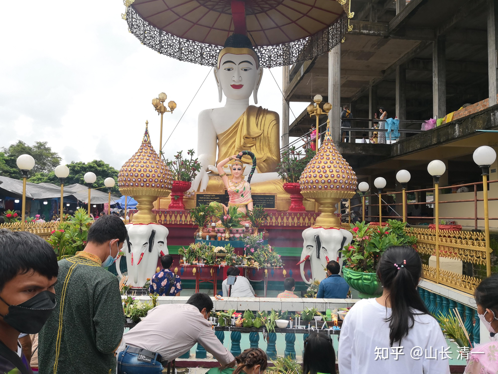
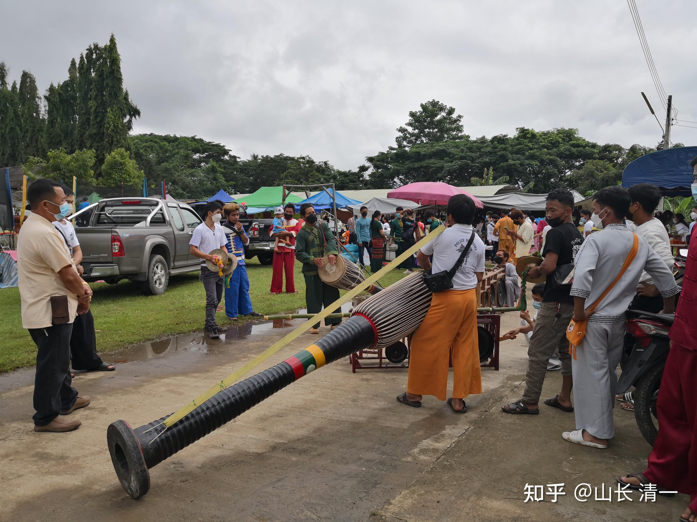
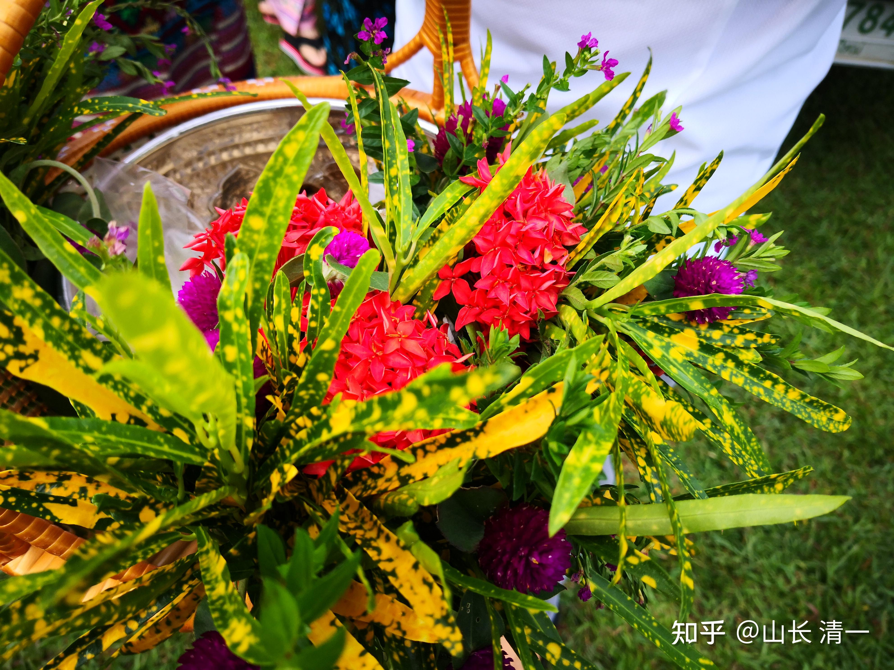
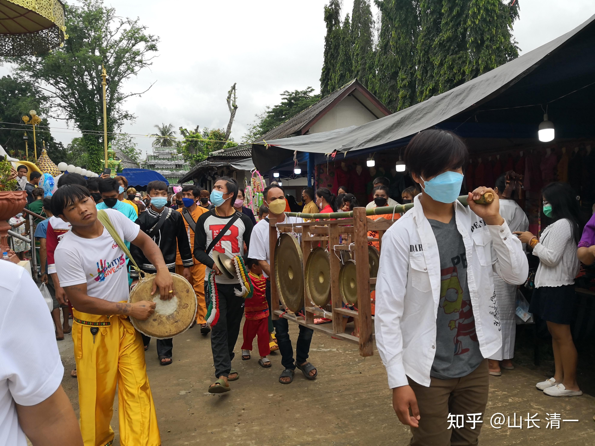
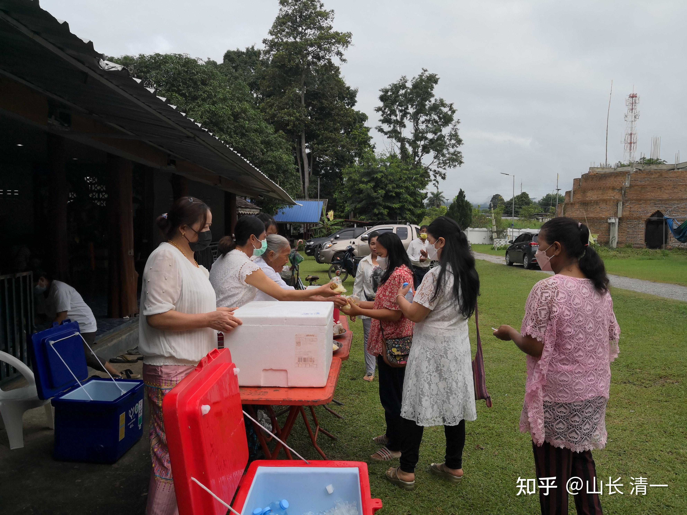
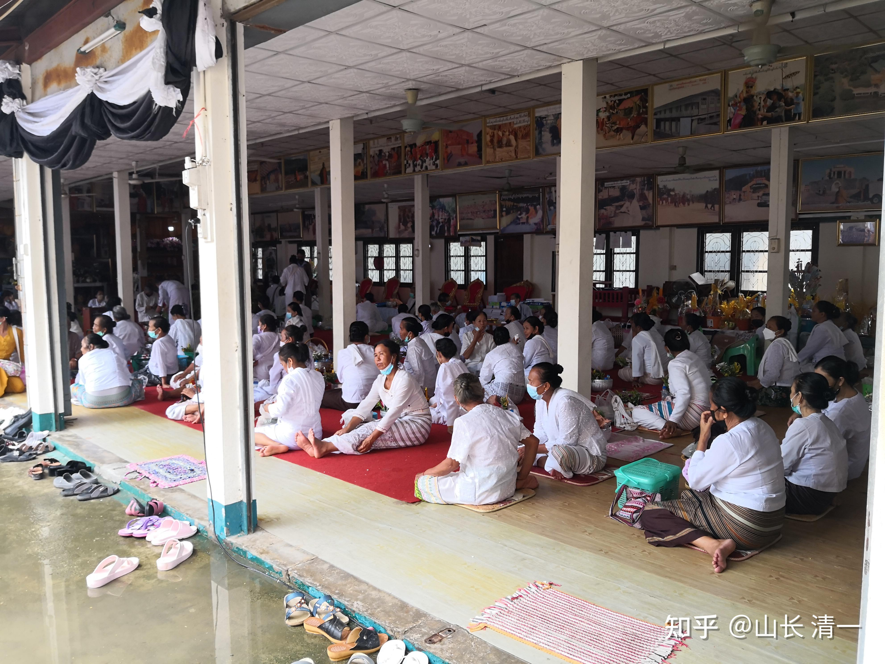
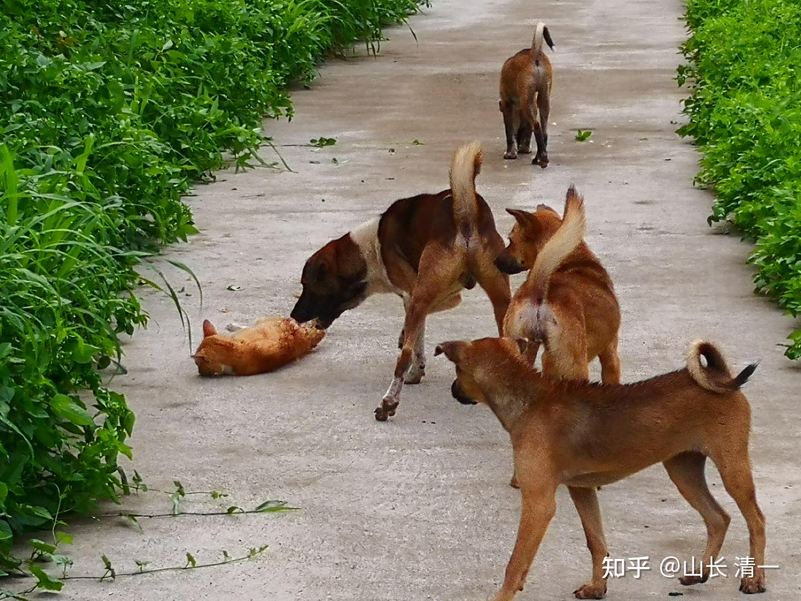
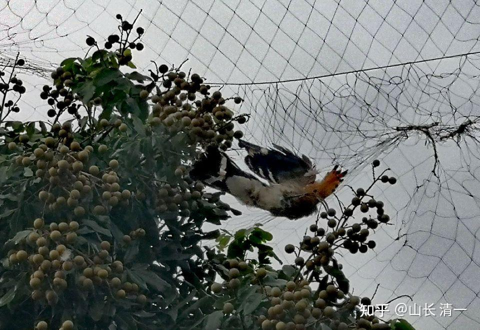

宋老师昨日分享了与泰国人一起过节的观摩，的确与当代中国的过节完全不一样。更加有“中华古风”一些。比如：今天中国的所有节日，大众的基本观念就是“今天是我好好吃一回，好好玩乐一把的机会”，把“自我享乐”，看成是节日的主要功能。但泰国人把过节，却看做是一个有机会出来做好事，与朋友分享的重要机会。我们在清迈，每年新年，都是全村的人聚会在一起，很多人都拿出自己的拿手手艺来，做很多美食，让大家一起分享。也不忘了给庙里捐钱，供佛等活动。由于是外国人，我们基本上是隔离于泰国人的世界。但宋老师因为与工人团队的关系很好，所以也有机会受到邀请，参加“纯泰”的节日庆典。而不是旅游者的走马观花。上次她去参加泰国人的家族节日聚会，是家族里面的每个人，给家族的老人请安，洗脚等礼仪。这一次是参加佛节，看到了泰国人的分析精神。这些庙会活动，释放的是互相之间满满的善意。这种文化，这种社会，个人以为比美国社会祥和很多。也的确看到泰国人的游行，都是非常友善的，表达意见就走，警察也不暴力，我又一次站在塔佩门看游行队伍，警察看看也不做啥。就是维持治安。绝对不像是香港这样，放火打砸抢的。因此，善有善报。泰国这个国家，还真的很祥和。也许古代的中国也这样，但现在：套用霍布斯的话，人对人想狼一样。整个社会充满了不信任和冷漠。真心与泰国差距太大了。

我认为：核心问题就是我们的教育出了问题。我们的教育只教功利，不教做人。我们只看重利益，不看重道义，善良的价值。这种社会，和平时期尚好。就怕将来有一天，日子难过的时候，恐怕马上就是“天下大乱”。一个不教善良，或者善良没有地位的国家，我认为就如果火山一样，虽然都可能烧起来。善良就像是水一样，可以滋润万物。是生长祥和的力量。希望未来的国人，多一点善良，少一点功利。

转发宋老师的内部报告：

老师伙伴们好，跟大家分享麦当近况：

一：参加了泰国佛节活动

本周三是泰国人的"佛教大斋节"，工人们一般的假日都不休息，这天却申请全体休息一天。因为他们要去寺庙里供佛，并为死去的亲人祈福。见工人们如此重视这个节日，就想去看看，泰国人这天去寺庙里都干些什么。

我去的是麦当庄园对面（路程一公里左右）的一座寺庙，第一次和当地人一起过佛节，感觉回到了小时候——节日的氛围很浓厚，且充满乡土气息，只不过节日不同，内容有所区别罢了。周围的村民像赶庙会一样聚集在寺庙和寺庙周围，大家身着白色上衣，或泰国传统服装，除了寺庙里有活动，民众也会自发组织一些活动，仪式感很足。

泰国民众到寺庙里，会带上贡品和鲜花，鲜花大都采摘自然界中的花草，自己动手做成花束。也有不少人做了饭菜，或采摘自家水果，在寺庙周围免费分发，善意满满。比如阿伦家提前一天买了50公斤上好大米，全家人忙了一个晚上做好了饭菜，分装好，放进有冰块的塑料保温箱内，还买了矿泉水，也放进有冰块的“冰箱”里，第二天到寺庙分给前去礼佛的邻居们。我在“庙会”上，则被人送了上好的红毛丹，个儿大味甜。由此可见，平时他们自己吃的水果米饭品质可能一般，但做善事时，会尽量拿出家里最好的食材，以此表达自己诚挚的敬意。

这次因为近距离的观察，才切实感受到了泰国人对佛教的推崇度有多高。泰国与佛有关的节日很多，到处都有寺庙，不管是平时还是节日，民众都会给僧人大量供养，不论贫富，对待供奉毫不吝啬，不仅把这些僧人养的很胖，也养胖了僧人的家人。因为民众的贡品，除了正常的泰铢、饭菜、水果外，其它全是垃圾饮料和垃圾食品，僧人和他们的家人天天吃这些东西，身体想不胖也都难。

我问工人，民众一天送来的食品足够开个小卖部了，这些食物吃不完会如何处理呢？工人说，寺庙里的僧人告诉他们，吃不完就会送到清迈城里，给那些孤苦无依的穷人。我在想，我们的工人已经是这个社会的底层了，难道有人比工人还穷吗？而且清迈城里寺庙更多更大，民众送的东西也会更丰盛，估计那边的僧人也跟民众说，多余的东西会送给乡下那些吃不起饭的穷人吧。

不过僧人给民众开示时的引导还挺正向的。一般情况下，僧人先念经，然后做开示，传递因果观念，鼓励民众信佛，教民众遇到问题看到积极的一面，如何做到心如止水，如何消除愤怒情绪等。当然，我还听不懂僧人开示，阿伦和他表妹帮我翻译，他们也教我如何礼佛，以及每个施礼环节的意义所在。

在返回的路上，我们看到一条狗死在路边，阿伦他们看到后，马上上前查看，确定狗已经死了，很快跑回家拿了锄头过来，在路边挖坑把狗埋葬，还给狗念了经。这些善举，也说明佛教教化的成功，事情虽小，却也令人感动。

二：庄园里的生态情况

由于庄园大部分区域的草两年没砍，不少动物在里面安了家，自然也成了四只狗的猎场。它们最喜欢早晚跟我一起去步道散步，它们的听觉和嗅觉超级灵敏，每次我没感受到任何异样时，它们远远的就能听到或闻到草丛里有其它动物。刚开始，它们捕获猎物的成功率很低，随着经验的增加，成功率也相应提高。

我曾目睹它们成功抓到过四只中等大小的野鸡，但只从狗嘴里救下过一只，其它三只都被它们吃掉了。还有一次，大狗在草丛里发现一只野猫，便跟对方撕咬起来，我跑过去制止，并带着几只狗离开。待到中午，发现大狗的腿部被猫咬伤，走路一瘸一拐。等到下午再去步道，发现那只野猫已经死了。我一边埋葬野猫，一边教训大狗，大狗也不离开，一直跟在旁边默默看着野猫被埋。

还有一次，早上一出门，就看见门口到处都是血迹，经查看发现中狗的爪子受伤了，晚上发生了什么，不得而知。

在我们与邻居一墙之隔的院墙上，邻居放了一张网在上面，防止虫子和鸟侵犯他的果树。只是一张小小的网上，每天都有飞行动物死在上面。工人从这张网上救下好几只受困的小鸟，有的鸟一看就是稀有品种，看着让人唏嘘。

住在一个自然的环境里，可以看到自然界的和谐，也能看到自然界的残酷，做动物（尤其是野生动物）真心不容易，每天都面临着生存挑战，一不小心就性命难保。想想还是做人幸福，不仅温饱不愁，还能在精神和灵性上得到滋养与提升。人身难得，好好珍惜！

*庄园步道，绕墙而建，总长超过一公里*

