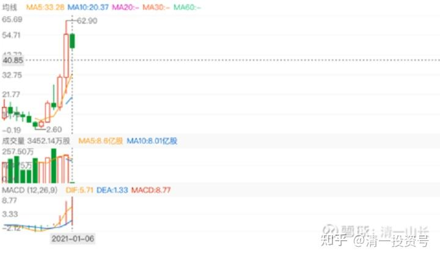
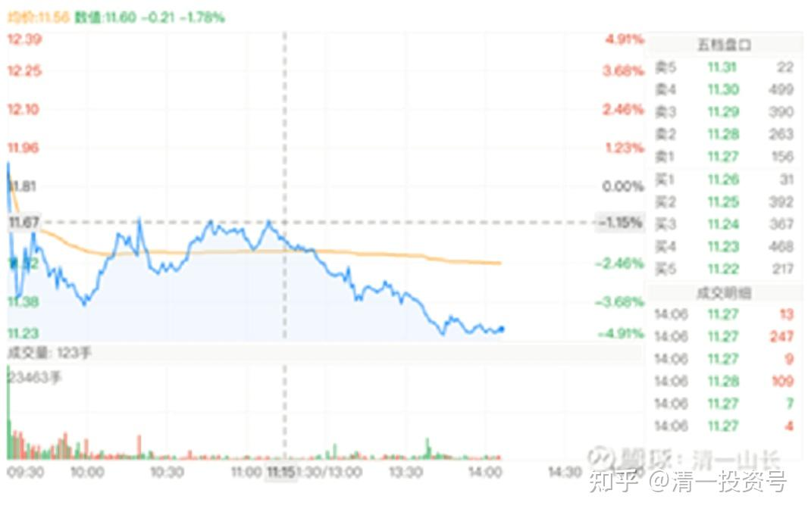

47篇.正通汽车操作后反思

清一山长2017年10月～2021年4月

**一、“英明”的操作**

清一山长2017-10-27 15:01:38

$正通汽车(01728)$突然觉得，上一次8元多开始积极出售正通，最高居然以9.49元，抛出了正通接近90%的持仓。这个卖出策略，非常的“英明”。可惜没有抛完，还留了一点坐电梯。看到今天正通下跌如此之惨，理论上应该补仓，算是做T了。但是我怎么就是不敢补？怕下跌的飞刀吗？还是因为正通转势了？我想，还是因为看不懂吧！**中建跌了20%就敢补货了，正通跌了30%也不敢补**。

清一山长2017-11-18 14:31:10

我一直不敢买汽车股。造车的不敢买，卖车的股，倒是低位买了（正通），现在也基本上卖掉了。因为我认为，十年后，现在的燃油汽车，就要开始被替换掉，甚至可能政府出台文件，不许生产新的燃料汽车了。今年我换车买本田URV的时候，就告诉老婆：这辆车，应该是我们在国内买的最后一辆传统汽车了。我相信十年之后，满大街都是“非传统车”，说不定连司机都没有了。现在的传统汽车企业积累了上百年的优势，可能转眼间就完全消失了。就像是沃尔玛面对阿里巴巴们一样，原来的历史积累越厚实，实力越强大，可能未来的新前途就越差。屌丝逆袭传统贵族的故事，将在汽车业中冒出来。数百年来，一直用资金和技术堆积自己优势的传统汽车的柏林墙，会快速地挂掉，传统汽车业不得不毫无防御地投降屈服！

未来一定属于电动车，或者燃料电池车。但谁会赢，我不知道。这里面的利润大极了。你问我：现在敢不敢投资传统汽车企业，敢投资新能源汽车吗？比如像巴菲特投比亚迪，外国人买特斯拉一样？

我真的很想这样做——投资未来会成功的新能源汽车。**如果赢了，回报率可以达到100倍。不过赢家通吃，输家连裤子都没有的。问题是：我不知道谁会赢。**特斯拉？比亚迪？我看未必！

**电动汽车，核心元素，并不是汽车，而是电池，是人工智能控制系统。**这个东西，随时出新的概念。现在无论投多少钱，都无法维持“护城河”。新东西一出来，原来的投资越大，越倒霉，转身都转不过来的。

所以，我知道这个行业会赢，但我不知道谁会赢。大概率不是现在的玩家。谁冒出来了真说不定的。

比如，宁德时代，是目前最有可能赢的电池专家。比亚迪的技术已经被它超越了。目前很多人已经投了很多钱在它身上。但它未来会赢吗？我看未必。假如下面这一家万向的新技术出来，它怎么办？恐怕未来只有“去死”了。“各领风骚数几年”，大约就是这些领袖者们的命运了。

下面这家很有可能赢。但也许明天你又会看到新的“专利突破”。所以，我永远无法弄清谁最终会赢。未来太复杂。唯一不复杂的，就是未来的世界教育方向，我觉得更容易把握一些。我觉得我会赢[笑]。

转发：近日，中国万向集团旗下、位于美国加州的电动车制造商菲斯科（Fisker）提交的专利申请文件显示，其固态电池技术将实现2.5倍于传统锂电池的能量密度，续航里程长达500英里（805公里），相当于从北京一口气开到西安或者安徽那么远。且充满电仅需1分钟！该公司计划在2023年前将该电池商业化应用。

相比之下，特斯拉Model S如果使用充电速度最快的超级充电桩，充满电目前也需要1个小时15分钟，续航为300英里（483公里）。

《万向美国子公司大突破，汽车业“变天”不远了》

[https://cj.sina.com.cn/article/detail/1651744931/487442](http://link.zhihu.com/?target=https%3A//cj.sina.com.cn/article/detail/1651744931/487442)

清一山长2017-11-23 17:15:28

$正通汽车(01728)$今年我买的正通是一个亮点，成功的投机游戏。上涨中几次抛出都是高点，可惜不敢在随后的下调中重新买进头寸做T。**因为我看不懂这股值多少钱，只能想卖掉就是赚到。重新买进后，命运如何实在难料。说不定把赚到的钱重新贴回去了。**虽然上次9月20日9元多抛出后，居然跌破了8元，是个完美的做T的机会，赚15%以上很划算。只是想想就放弃了。结果很快看到它重新回头，再次突破了10元，我感觉图形走势不对，不像正常的上涨，就在11月9日至11日，决定彻底地清仓正通。这一次，我干脆在9.89元抛出了几乎所有的持仓，彻底结束了这一次正通汽车的投机行为。所得资金大部买入了还在七元多的民生银行H，持仓已经超过1M股。以及部分3元的中国信达。这一次我改邪归正，把投机资金改为投资资金，一股正通，换1.2股民生H。当初买入的正通才2元多呢！算起来民生相当于用2元买进了。怎么算都觉得太划算了[笑]。就只留了五万股正通看戏玩，涨跌无心了。最近看到正通大跌，民生涨了一点。可惜昨天还计划要今天卖掉50%持仓的平安银行，换不涨的中国信达的。还没来得及操作就掉下去了。就继续等吧！

清一山长2017-12-22 10:07:49

$正通汽车(01728)$跟我9.9元左右的卖出价相比，正通再涨回去，需要涨30%。原来真的搞不清为何拉升，现在看是不是因为想要配股？7.6元的配股价，我很庆幸跑掉了。如果想要捡回来，应该至少低于7元，最多把原来卖掉的部分捡回来做T。就算操作失败了，也算跟大股东一起套牢。（不过，我认为这还是投机行为）。

**二、危险信号之高位放量**

清一山长2018-01-17 22:47:23

$正通汽车(01728)$危险的信号。今天偶尔看到正通的K线图，意外发现1月11日有大笔的成交，1.38亿股换手，20亿资金倒手了。关键是谁给谁了？换庄，还是抢正通反弹的小散们接了大庄的盘子？总之，**这是一个相当大的成交量、天量，而且是相当高位放出来的天量，非常危险**。如果是有人在坐庄的话，出现这种成交量，很可能原来的庄已经成功走掉了。

看周K线也是数年来最大的成交量。这种大量的成交，原来出现在低位的时候，如去年2月份突破3元、4元的时候，是洗盘成功的标志。散户交出了宝贵的筹码。现在出现在8-9元的高峰，而且10日的冲高，很快就被11日巨大成交的阴线吞没了，我看都觉得危险。回过头来看10.04元的最高点，我当时果断地在9.98元，把剩下的正通持仓都跑掉了，只留了一点“纪念股”，几乎就是完美的操作，但也走得很险的，犹豫一点就跑不掉了。假如我贪心，后来正通下跌10%又接手过来，就完全没有再度逃离的机会了。就算是等正通下跌20%再买回来，依然大概率被套（只有一次机会逃离）。所以，我很庆幸自己高位居然跑掉了。

不过，也许我是自己吓自己。某外资投行，不是说正通要涨到14元吗？现在几乎只有一半的价格，他们干嘛不使劲买呀？

清一山长2018-02-06 14:46:41

$正通汽车(01728)$老朋友，今年你咋了？涨的时候不见你跟涨，跌的时候你一点也不含糊呀？[笑]

清一山长2018-02-07 15:45:22

幸亏我早跑了。不然最近两天，就要吃掉我好几辆URV。还是当初惦记着要买URV送老婆，又不想自己掏钱，只想让汽车4S店帮我出钱，才卖掉正通的。成功锁定了这笔利润。说实话，2元多买的时候自以为看懂了，还越跌越买。但9元多卖的时候，我的确是因为看不懂才卖的。**我就不明白，2元多的时候摩根不买它，快10元的时候出来说，正通其实要值14元。我算不出来这道投资题，就跑路了。**今天6-7元的价格，摩根大通是不是跟买了一大票？他算定可以涨一倍的股。今天干吗不大买特买？

清一山长2018-04-23 21:51:09

$民生银行(01988)$今天7.27元，买了几十万民生银行。没别的想法，就是民生创新低的时候，买一点做纪念。涨不涨就不管了。

兴业银行，今天也买了五万股。16.16元，挺好玩的数字。本来应该多买一点的，离我春节前的兴业仓位还差很多。主要是觉得：兴业还是比民生贵一点，所以下不了狠心多买。但不买吧，又觉得高位卖出了，补不回有点对不起兴业[为什么]。其实现在的持仓，就是等分红持仓。稳定有余，进取不足。

扶云而上:回复清一山长:

为什么你就卖不飞[吐血]

清一山长2018-04-24 10:07:07回复扶云而上:

别泄气，我经常卖飞的[笑]。正通从4元多就开始卖了，一直卖到9.8元才卖光。如果没有卖飞，我的正通利润，至少要多一倍以上，我赚的小车队就要大一倍多了。兴业这种情况，一单子就全卖了，是运气好。有主力高价要买货，我就全出了。

清一山长2018-06-26 22:49:12

今晚回来看看我的自选股，发现正通“报警”了。跌幅超过7%。一看股价才五元多了。好吓人，几乎腰斩了。当初我看到研报说要到14元的，现在这些写报告的人在干什么？关灯吃面，还是在偷偷地数钱？

当初1月17日我留的这篇帖子，警示正通危险的走势图，但是当时的股价还在8元左右。当初如果看了我的帖子，听话照做的散户们，今天就避免了下跌如此惨重的局面了。所以，**我的发言是值钱的，跟我反着做，恐怕概率上是亏的**。虽然听说企业在回购正通，但是天知道庄家在干什么？我看图只觉得庄家最近半年一直在卖卖卖。

我真的很感谢正通，帮我赚到了20辆URV，虽然我实际上只买了一辆回家。**我回头来看，我的这笔投资虽然赚了钱，但不能说是一次理性的投资，只能说是我运气好罢了。现价的正通，我依然是不敢买入的，但我居然持有到了10元左右才彻底清仓，说明我的投机色彩的确浓厚，不是价投。**当然，我是一路减持的，逐级锁定利润的。不然，远不止赚这些利润。**虽然正通的看图操作都很成功，还是不能说明我投资是成功的，赚钱不是投资正确的标准。反而说明了我的选股和仓位的控制都不合理。正通这样的股，我居然买了超过2M仓位，虽然当时股价低，才两元多一股，但是也超过了风险控制的需要。这种风险股，不应该重仓的。**最多玩一玩就行了，跟一下看K线的感觉就行了。

**三、危险信号之券商唱多**

清一山长2020-10-29 13:09:23

正通汽车冲到10元的时候，很多券商出来说：正通的汽车金融等等很有前途，公司各种好，是新经济。股价要到14-16元等等。**我一看这些写文章的股市文豪们都出来了，赶快全卖掉了。**赚了几十辆汽车的钱。但如果我听信了这些人的忽悠，居然持仓不动到现在，就算我低价买入（成本2.55港币），到现在不但不赚钱，还要赔掉十几辆车钱。如果我在他们吹票的价格，买进我相同的持仓量（200-300万股），我现在要亏两千多万。所以，在中国，**脑子别长在媒体身上。**这种不动脑的习惯，很危险。

**[清一山长](http://link.zhihu.com/?target=https%3A//xueqiu.com/9310099567)**2021-01-06 16:26

[$中升控股(00881)$](http://link.zhihu.com/?target=http%3A//xueqiu.com/S/00881)这是我错过的大牛股。3元多买的，大概是7元多就跑了。一去不回头。错过了涨20倍的机会。买的也不多，就赚了几十万。后来看它飞了，又去买了个垃圾股正通汽车。2.55元的成本，涨到快10元也全出了。赚了700多万港币。

不过，现在要我重新来一遍，我估计还是会跑的。我买入中升，是因为我的丰田汽车在它家店里保养，觉得这公司还不错，3元多的价格很低。股息也可以，就买了。但涨了两倍还不走，我觉得太贪了，就走了。所以，我赚不了我看不懂的钱。我现在都不懂：为啥它就值60多元？为啥就值20多PE？

买正通，是当时的最低价。2.8元开始买入，跌到2.20元还补货。最终成本2.55元左右。幸运的是涨到10元前后就跑光了。**因为几家券商都出来站台。说价值14元。我一看：站台的皮条客都出来了，此时不跑，更待何时？**就溜之乎也，傻乎乎地赚了700多万HKD。

但**以我现在的心境来看，这两笔投资，我都不会做。因为，其实我不懂！其实这种公司，也没啥技术含量。要买低估，就买中国中车这种，死拿不涨也不管。**

所以，我不以赚钱论英雄。如果我总结中升没有多赚钱的原因，是跑早了，我就会在正通上死拿，今日不但没赚钱，还赔几百万。

正通我也不因为赚钱了，就去大买其他汽车股，买了，大概率也赚不到啥钱！

要买，还是买中国中车这种：龙头股。这种独一无二的股，跌到股息率都超过6%了，等于上了双重的保险，不买白不买，涨了白赚，跌了死拿股息。等于是包赚不赔的，拿了可以安心睡觉的，不比啥卖汽车的股，好多了？特别是就算财务良好，但是不是造假，天知道！**中国的很多私企，私德都很有点靠不住！**

**[互联网怪盗团](http://link.zhihu.com/?target=https%3A//xueqiu.com/8242980329)[2021-01-05 20:44](http://link.zhihu.com/?target=https%3A//xueqiu.com/8242980329/167711038)**

我不知道南极电商有没有造假，但我建议彻查A股某些机构的欺行霸市行为

[https://xueqiu.com/8242980329/167711038](http://link.zhihu.com/?target=https%3A//xueqiu.com/8242980329/167711038)

**[清一山长](http://link.zhihu.com/?target=https%3A//xueqiu.com/9310099567) 2021-01-12 13:13**

好文。各位要好好地研究学习一下本文，太有价值了。这文章中反映的，就是中国金融业的生存状况。你们就别相信券商、媒体公开的信息和推荐了。都是让你站岗的。他们的推荐，都是服务于这些“抱团”利益者的。

相反的案例：各位既然知道，发一个不看好的帖子，都会招来无穷的打击。谁敢乱发黑帖？

但是，但是，但是——**的黑帖子为啥这么多？您认为，这背后，又有什么猫腻没有？难道，是一群“正义的研究员”，怕您买入了**啤酒吃亏吗？还是跟本文的逻辑一样？发黑文，也一样是服从这些股市大鳄的意志？

实话实说。**我在中国股市生存27年了，我的保命哲学，就是“不相信这些专家”；我的赚钱哲学，就是“跟他们反着干”！**[笑]

各位忘了我正通汽车是如何2元多买，10元高位，就全部跑掉的？300万股呢。现在只有500股在手上了。**就因为当时接近10元了，多家**券**商研究报告，说它“合理价格是14元”。我想：2元多的时候，你说值五元也算良心贴了。10元的时候，出来公开宣扬要值14元，危险的信号**。所以，看到券商报道第二天，我就全跑光了。（如果没有报告，我估计还会拿一段时间的，真的等14元了）。

**[清一山长](http://link.zhihu.com/?target=https%3A//xueqiu.com/9310099567)2021-04-26 14:10**

[$珠江啤酒(SZ002461)$](http://link.zhihu.com/?target=http%3A//xueqiu.com/S/SZ002461)，这走势，非常明显的出货。消息面上，有券商出来唱多。吓得我连T都不敢做了，跌了超过10%也不敢补回[捂脸]。我胆子小，看见唱多就怕！因为老经验就是：一旦券商唱多就要跑，不跑死得快。**当年的正通汽车，就是看见券商10元区出来唱多才跑光的。一路跑，不回头。不然现在要亏死了。**

（标题为编者所加）

参考链接：

[清一投资号：41篇.正通汽车2020年操作——没赚没赔](https://zhuanlan.zhihu.com/p/534182401)（整理文）

[清一投资号：42篇.正通汽车2016年操作——2元多买入](https://zhuanlan.zhihu.com/p/537086158)（整理文）

[清一投资号：45篇.正通汽车2017年操作——最高9元多卖出](https://zhuanlan.zhihu.com/p/539970718)（整理文）

[清一投资号：30篇.投资中国中车的理由（一）](https://zhuanlan.zhihu.com/p/562828027)（整理文）

[清一投资号：31篇.投资中国中车的理由（二）](https://zhuanlan.zhihu.com/p/504483885)（整理文）

[清一投资号：32篇.中国中车：敢于融资持有](https://zhuanlan.zhihu.com/p/508326510)（整理文）

[清一投资号：33篇.关于中车的换股操作](https://zhuanlan.zhihu.com/p/514998133)（整理文）

[清一投资号：34篇.中国中车的技术分析](https://zhuanlan.zhihu.com/p/521835261)（整理文）

[清一投资号：35篇.评论几个关于中车的观点](https://zhuanlan.zhihu.com/p/524719401)（整理文）

[清一投资号：16篇.中国中车与中国中铁](https://zhuanlan.zhihu.com/p/501574841)（山长新作）

