[原雪球专栏](https://zhuanlan.zhihu.com/p/543096364/edit)60篇.网课的核心不在网上，在线下！

[清一山长](http://link.zhihu.com/?target=https%3A//xueqiu.com/9310099567/column) 2020年3月26日

转发：今日学堂家长的网课记录：微信[网页链接](http://link.zhihu.com/?target=https%3A//mp.weixin.qq.com/s%3F__biz%3DMzIzOTYyNzk0NQ%3D%3D%26mid%3D2247489282%26idx%3D1%26sn%3D22ced42e1104c6cedfb18ae60b8e50a4%26chksm%3De9266cc4de51e5d2fdd68df211cd6a016121beea6fadf7abb85f11533d2fa21bfefb5c573906%26mpshare%3D1%26scene%3D23%26srcid%3D%26sharer_sharetime%3D1585206315320%26sharer_shareid%3D0df700f53f962e2fc8cec2c3b266a690%23rd)：

[https://mp.weixin.qq.com/s/5C4WN5xaDi3lGntvbvQdjw](http://link.zhihu.com/?target=https%3A//mp.weixin.qq.com/s/5C4WN5xaDi3lGntvbvQdjw)

为什么这一次应试教育下的网课问题丛出？其实今日的学生，如果从来没有来今日面授过至少半年以上，老师也许做不了网上学习的。因为没有运行的核心基础。而学生一旦得到了这个“学习基础”，不仅能够适应网上学习，还可以适应体制教学，任何学校的课程，甚至是自学，只要他愿意学，就可以学会任何东西。因为，**信念系统和价值观，是人基本行为的底层设计。**今日新教育的核心，就是培养热爱学习的责任和荣誉感，培养至上意识。有了这个内容，做别的都很容易了。

**附录：[网课让我们对孩子的未来更有信心，对学校更满意](http://link.zhihu.com/?target=https%3A//mp.weixin.qq.com/s/5C4WN5xaDi3lGntvbvQdjw)**

原创 比欧班家长 零突破 2020-03-26 14:48

**引语**

在全国人民居家抗疫的严峻形势下，全国各大中小学校为不耽误学生学习，如火如荼地开通了各种网络课程。然而事与愿违，网上传来的是一片焦虑和抱怨声：孩子对着镜头玩游戏、看抖音，公然输入不雅文字、挑战老师、不做作业、坐不住、不运动等诸多问题不一而足。

2月16日今日学堂比欧班的孩子们（11-13岁）在老师的带领下顺利开启空中课堂，进度和效果丝毫不亚于在校学习。家长们甚至因此对自己的孩子更放心，对孩子的未来更有信心，对学校更满意。这是为什么呢？请看比欧班家长网课报道。

XRX家长的反馈：

比欧班在网上开学已一个多月了。作为家长的我却完全没有烦恼与担忧，反而很轻松，孩子在身边完全无需家长操心。

她自己每天有条不紊地按照班级制度，管理着自己的作息。

每早6:40自己在闹铃中起来运动近2小时，跑步、跳绳、单项动作等，下午2个小时的协调、平衡、力量、灵活性等动作训练，全程孩子自己完成。孩子对运动早已接纳为日常必修课，自己说很喜欢运动过程中与结束后身体里的那份通畅与舒适。有时，我会被那份活力感染，运动着的身姿带给人向上的动力，自己都感觉年轻了。

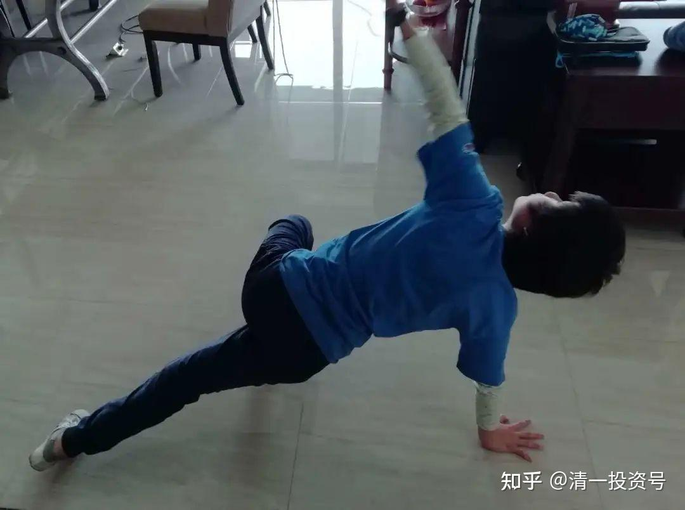

这个学期开始学习文学，上课模式与清一老师的成人课程类似，主要为人物行为、性格、心理等分析。她们小小年纪无须把时间浪费在应付无多大实际用处的考试上，而是直接接受如此高级、受益终生的课程，是很有福气的事。

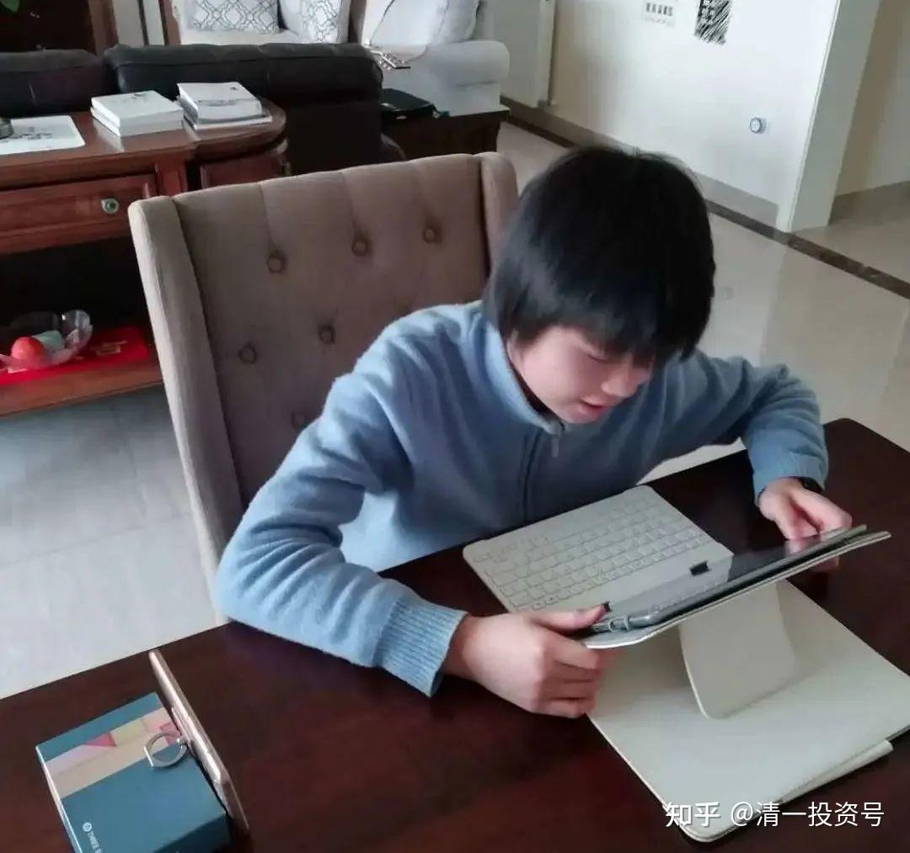

每天她很认真地遵照着班级安排的内容执行，虽然全天在家，但时间安排得满满当当的。我看她学得挺开心的。

RX能做到这样，并不是因为她很优秀、自律，相反她在班级很多方面处于追赶的位置仍需大跨步前进。原因是她所处的团队不一样，自假期回来的2个月，她们一直处于团队共同学习模式，每位同学都是这样的状态。

这期间，我发现她们班同学有几点共性：

**1个人荣誉感、目标感强**

这些看似高大上的特质，在今日学生身上不再显得遥不可及。他们会不定期进行PK,以检验各自每天的学习情况，保证不懈怠，每日打卡，成员彼此互相督促、监督。难能可贵的是孩子们做这些是**团队自动自发管理完成**，**并非老师或家长监督完成。**孩子们**完全出于自身很强的荣誉感、清晰的目标感和积极向上的意愿。**

这份动力**得益于老师背后的付出，及在校期间开设的各种主题课，其深度、广度、穿透力、趣味性，润物细无声的浸透**。加之师生之间平时的相处，无时无刻不在影响带动着孩子，从而将这份珍贵而难得的品质传递给了孩子。这也是每次今日老师的教学月总分享出来后被大量转载学习的原因。

**2团队荣誉更重要**

在今日，孩子们的转变不是个体现象，而是集体共性，是整个集体能量场的力量。即使资质普通、成长意愿弱的孩子也会在大环境带动下得到明显的改观。虽在假期，他们似乎从来没有分开过，每项内容都会小组共同参与、开会讨论、反馈、交作业，包括上床睡觉都达成协议，需要拍照提交（孩子们可爱吧）。

期间小组长会承担起较多的组织、管理工作，将每天的内容落实细化及时发布，并检查落实情况，不达标者会领到事先认同的相应惩罚。组长每天很准时的发出上课铃邀约，跟踪组员的落实情况，遇到问题能够主动及时灵活解决，如：ZYS同学网上买蓝光机刻录资料，发给每位同学，后又二手平台出售掉（孩子能干）；班级内部时常进行小组间PK，如遇某位同学有事，组内其他同学会自动补位，YJ同学为保障第二天小组PK效果，**凌晨4点起床准备材料**（集体荣誉感强）。这就是今日班级的集体现状。加入到这样的集体，孩子怎么可能不进步、不改观，想不进步都难。

**3敬畏因果，乐于服务他人**

从这些孩子身上看不到骄傲和自满，反而时常反省自己这里没做好，那里做得不够，自己还有哪个毛病一直都存在，他们**习惯挑自己的毛病，并为能给别人提供帮助与服务感到很开心**。这2个周末他们分小组给家长们做电影分享。不是强者多担当，而懂得根据各自掌握水平情况，安排均等的先后分享顺序，既照顾到了每位组员又保障了分享效果。当信号传输不顺畅时，听清的同学立刻复述一遍，便于远端的伙伴能听清楚。角色分析时，讲解完全不像12岁的孩子所为，就算是复述老师的内容，要做到讲清道明也不容易，事后他们希望得到家长的反馈，指出自己分享不足的地方，第二次分享明显能看出改变。

上周他们还安排了给家人做饭的行动，每位都拍照上传了自己做出的丰富晚餐。**这些孩子并不是学习的巨人，生活的矮子，个个下得了厨房，上得了讲堂。静如处子，网上学习一坐半天不动；动如脱兔，个个身形灵敏长跑健将。孩子们的自立、自强、自我负责的意识不是停留在道理上，而是渗透在了日常行为中。他们懂得努力付出与收获成果成正比的因果连接，他们以成为团队的贡献者为荣，拉后腿者为耻；经营者为荣，消费者为耻；付出者为荣，索取者为耻。**

这一切都因为他们接受的是今日新教育——人学的教育。背后强大的师资管理团队支持！今日老师们全然用心的投入与付出！清一老师高瞻远瞩的引领做后盾的成果！

ZYS家长的反馈：

经过近二个月在家的近距离观察，特别是开学后的网络上课，我们对孩子目前的状态和优势有了更深入的了解，总结起来主要有以下几方面：

**1懂得为自己负责**。没有执行规则，心平气和的接受惩罚；自已能做好的事家长想代劳，他就和我们沟通说他想自己做；对于自己的时间和目标都能准确安排；运动上认真不偷懒，会一次次的与老师的动作细节比较，每天有接近四个小时的运动，衣服汗湿了，但从来没说过累和放弃。

**2有良好的生活学习习惯。**比如，早睡早起，饮食清淡，吃饭和零食都很有节制，有时比家长控制得还好；学习用品和房间收拾得整齐，自已手工制作收纳盒，整理生活物品；自己给自己理发。不用的电子产品会在闲鱼上销售，这个假期他在网上取得了1300多元的收入，这个行为其实体现了他的财务管理及社会生活基本能力；学习上坐姿端正，按时做眼保健操保护视力，有疑问会及时提出，能较好理解别人的回答；自己会做饭菜，味道和量都很恰当。平时有时间就和我们聊天分享，还给我们讲老师给他们上的电影课内容。

**3对网络上课非常用心。**老师不在身边也能一丝不苟，还能通过直播来打造更加高能的团队，同学们之间相互提醒、监督，每个同学都有职责，经常在网上讨论课程总结。对于老师推荐的阅读内容会找相关的资料来学习，这种主动性、认真态度、打破砂锅问到底的劲头、对自己不了解的事物总是保持好奇和尝试的态度，我做为家长自愧不如。我想这种对待学习的态度才是教育的核心。

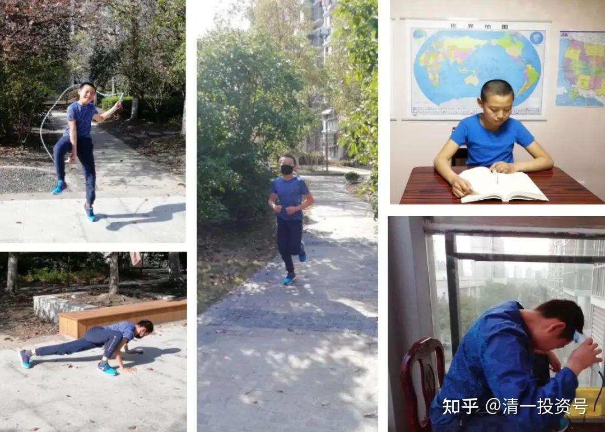

OZX家长反馈：

**1喜欢老师、喜欢同学、喜欢上网课。**虽然是通过网络链接，也能感受到孩子对老师的喜欢，对同学们的亲密链接。因为看到当她提到老师的时候，表情就会溢满着笑脸或者很认真对待老师说的话。同学之间经常有交流，后期进入了科学组学习，经常还会与伙伴分享她的学习情况。而且孩子们上网课与老师的互动性很高，孩子们遇到问题马上提出，也会一起讨论，这样的参与度不亚于面对面的讨论学习。

**2自我学习能力强。**观察Joy的学习情况，在学习过程中虽然出现一些词语不理解，但是她会通过网络查清楚。也就是说当她有一个学习目标的时候，她会想办法完成目标。这种自我学习能力和习惯已经呈现出来了。

**3每天坚持运动，孩子精气神很好。**运动情况，孩子们每天早上7:00前就会去跑步5公里，并且学习一些新的运动项目，孩子从一点都不懂的动作从生疏到熟练。每天上午和下午都有运动的安排和眼保健操，看到孩子每天都很精神的。

**4自立、自强。**课余时间做事，有时候到厨房帮厨，有时候在工厂里剪草挣工钱。因为自己想要的东西，靠自己挣钱买。这也是**新教育的理念，从小培养孩子的自强、自立。**

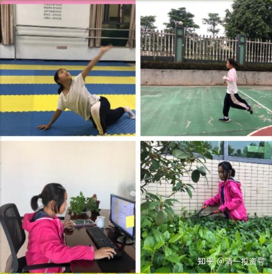

这段时间也听到身边很多应试教育家长反馈孩子利用上网课玩游戏、注意力不集中、家长需要盯着孩子、督促孩子完成作业等，家长都累坏了。相比之下我们的孩子不需要家长花时间盯着，比较省心。

JY家长反馈：

网课开始以来，不管是主题课、运动，还是自主查资料，孩子完全自理自律，时间规划很清晰，根本不需要家长操心，学习时专注投入，为了完成作业，有时自己在凌晨4点起床准备。运动时跑步5公里基本都在30分钟左右，不会偷懒或者拖拉，精神状态始终如一；普通跳绳和花式跳绳每组跳七次，每次做完就一头汗。跑步或跳绳结束后还有垫上运动，与ZXY一起搭伴坚持做好，没有一丝懈怠。

疫情之下所有的学生都开启了网上学习，但看看大部分应试教育的孩子由于对学习提不起什么兴趣，所以即使在父母的监督之下，学习状态也不好，老师们也是鞭长莫及。但今日的孩子们每天的网上学习跟学堂一样，相信即使一直通过网络学习也同样能达到学习效果。这种学习方式也是应试教育没法比的。

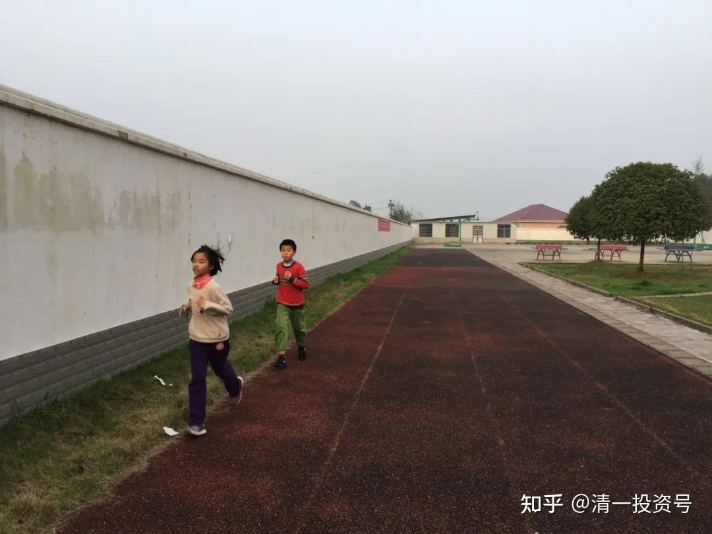

除了正常的学习运动之外，YJ和ZXY也会有创意地安排自己的闲余时间，小伙伴周末做烘焙蛋糕，巧手装饰后搬上餐桌；动手烹制菜肴；跟家长学揉面，做馒头花卷等；3个小伙伴在户外搞简易的篝火晚会。**疫情中，孩子的心很安定，没有丝毫干扰，学就一丝不苟，玩就创意不断，即使疫情导致长时间不能开学，丝毫不影响孩子的学习和进步。**

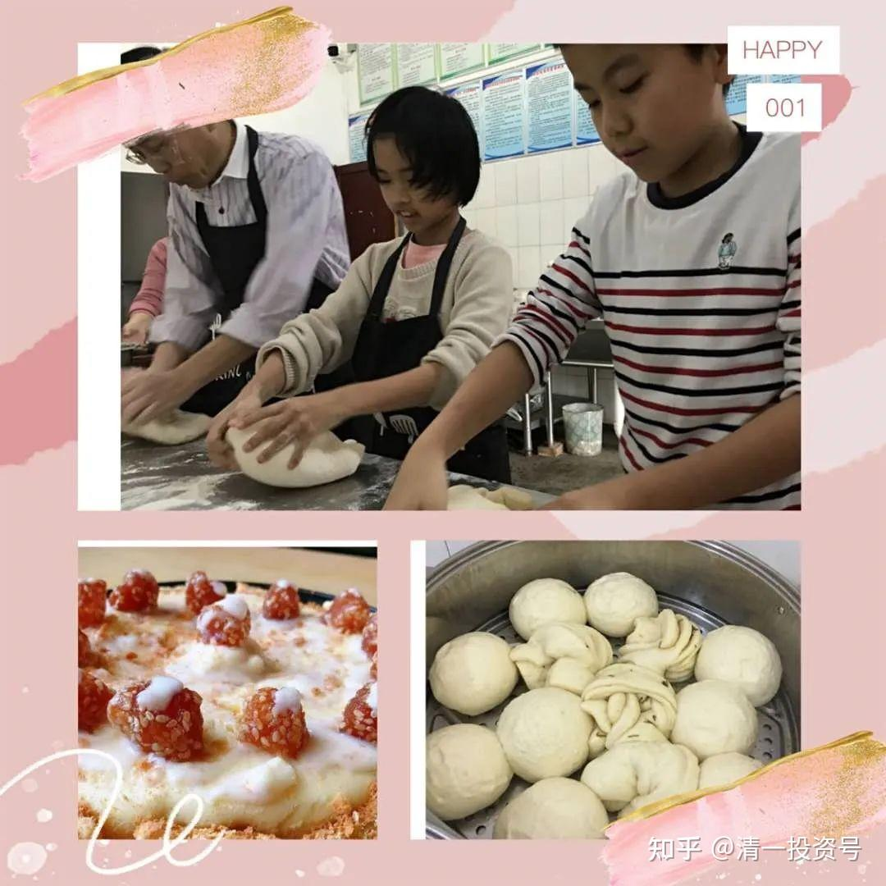

ZXY家长的反馈：

**1孩子目标感强。**具体表现为珍惜时间，时刻知道自己要做什么。孩子每天的日程安排具体到分钟，从早上6点半起床到晚上10点就寝的每一项学习或运动或做事都能主动自觉完成，从不需要家长提醒或督促。孩子怕自己错过起床时间，会设置三个闹铃，隔五分钟提醒一次；有一次妹妹希望姐姐和她一起玩会儿，XY一看还有7分钟就到了下一个项目时间，就设定了一个7分钟的闹铃提醒自己。

**生命是由时间组成的，对时间的敏感和珍惜程度可以看出一个人对自己生命价值的珍惜程度，即自尊，自尊是尊人的前提和基础。通过观察，XY班级孩子们都有类似特征，不讲废话，珍惜时间，不做无目的之事。今日的孩子们在十二、三岁的年纪就能做到如此自尊，可见今日核心价值观——尊重，已经融入孩子们的血液。**

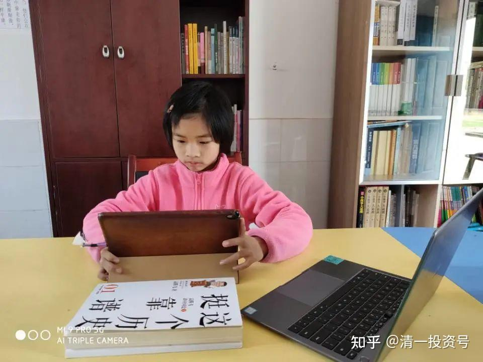

**2懂得合作，团队优势明显。**组员之间的沟通顺畅、高效，互相补位。比如：一个周末的任务是一组的同学给家长们讲《傲慢与偏见》电影课，组员之间分工合理，有人放视频，有人讲解，有人负责设备调试，收集家长反馈，出场顺序也经过精心安排，像一只训练有素的军队，没有废话，没有内耗，没有推诿，发挥出团队作战的优势。

**由此看出，今日学生的优势不仅在出色的个人素质，有很强的目标感、荣誉感，自尊尊人，更在于他们懂得团队合作，能发挥出1+1＞2的优势。此次网课，孩子们就利用团队合作来克服个人的人性弱点，比如惰性，坚持不易等，并在团队内部进行能力上的取长补短。**

**当应试教育下的家长们还在为孩子的自我管理伤透脑筋的时候，新教育的孩子们不仅做到了自律，还懂得杠杆他人和团队的力量帮助自己成长。眼前的一小点差距就是成年后经营者和消费者的差距，管理者和被管理者的差距。**

**3重输出的高效学习方式。**孩子们的学习不仅停留在吸收阶段，而是通过消化吸收再输出，这是学习最高效的方式。电影课《傲慢与偏见》是网课期间老师刚给孩子们上的，孩子们再给家长们上。孩子们讲解过程，思路清晰，角色分析到位，有问有答，颇有小老师的风范。

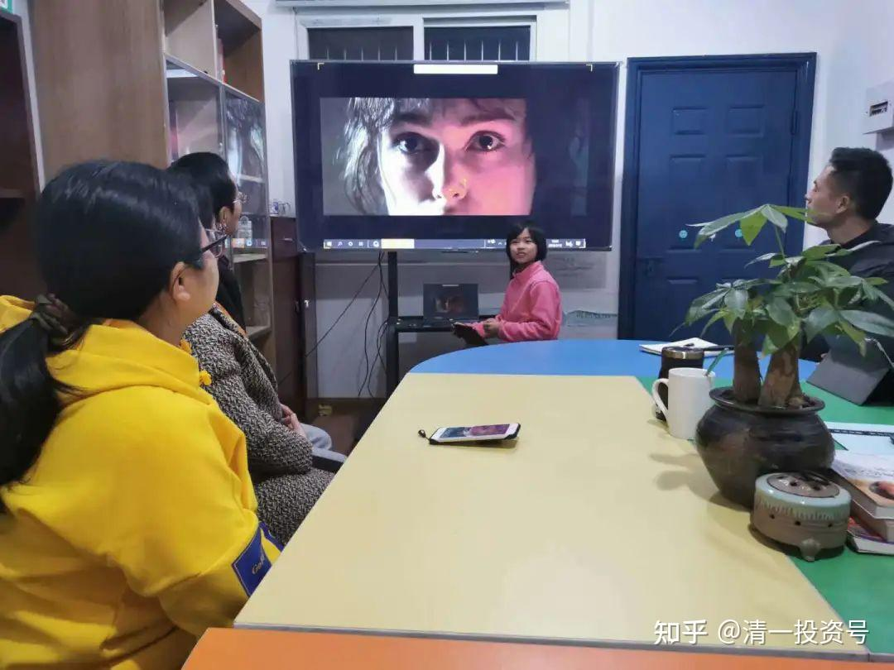

**4运动就是生活的一部分。**从寒假到网课期间，XY每天早晨跑步5公里，或做俯卧撑、跳绳等其他运动1小时45分，下午运动2小时，从没偷懒和间断。运动俨然成为孩子生活的一部分。运动给了孩子坚持的品质和强大的内心。即便外面疫情形式严峻，孩子内心很淡定，没有任何恐惧。期间有一次我重感冒，问孩子怕不怕传染，孩子回复是，我每天坚持运动，抵抗力好，不容易传染，即便传染了也很快会好。

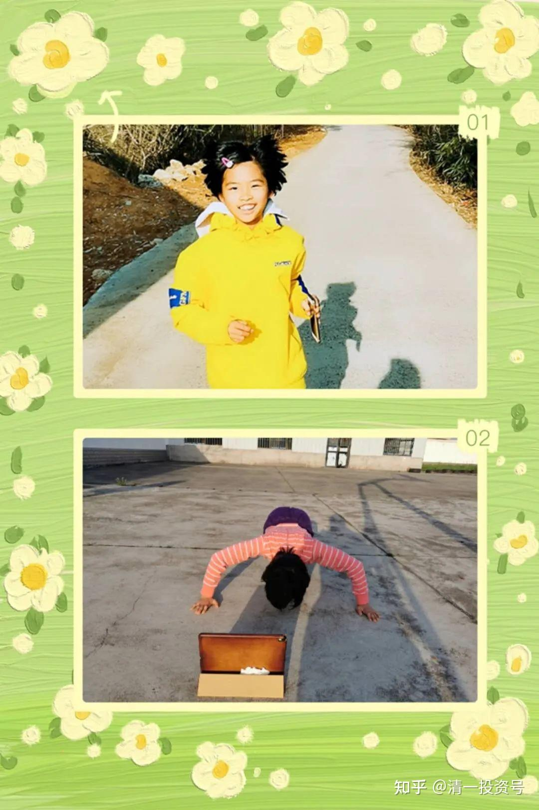

HXY家长反馈：

**1学习**

线上学习和上课，考验的是学生的自我管理，对应试教育的学生可能还是比较陌生的，但是在今日学堂在校期间和平时假期，就已经有过类似体验，比如通过沪江网课学英语语法，扇贝学词汇等。因此现在的网课，孩子很快就能适应了。

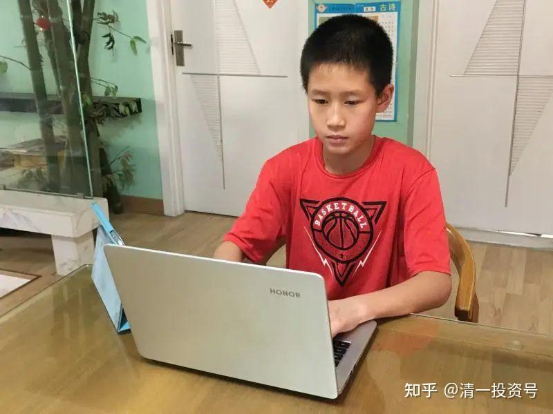

在写作业和自学的时间，有了几年的团队合作，这个时候就体现出了团队的作用，因为同学们有一致的价值观和规则意识，通过视频，大家也可以相互提醒，更利于集中精力学习。在学习上也不用家长特别提醒，时间观念挺强，都能按照老师布置的完成。

**2运动**

光会学习还不够，**运动是学堂的一大特色，它可以帮助更好地开发孩子们的头脑，让孩子们的脑子更灵活，身体的协调能力更好，并且锻炼了意志力，这也是为将来面对各种困难和挫折必须拥有的能力。**学堂精心挑选了适合本年龄段学生的各种运动，既锻炼身体又有增加趣味性。

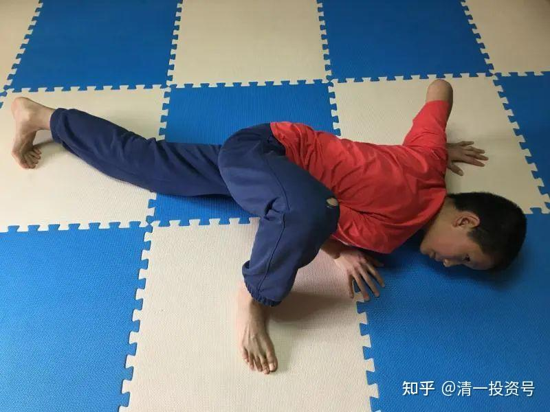

现在每天的运动时间差不多是四小时，分别早上7：00～8:45，下午2：00～4:00。孩子都是每天按时起床，视天气情况跑步5公里或者跳绳，然后再做其他的垫上运动，每隔几天就拍一次视频来大家PK一下看谁做得好，相互纠正一下做得不够到位的地方，虽然受疫情影响，有些运动要在家里做，但是孩子也能够克服场地的原因，也做得不亦乐乎。

**3做事**

会学习不如会做事，这也是学堂一直强调的。在紧凑的吃饭午休时间里，孩子也会尽量的帮家里做事情，包括煮饭菜、洗碗、扫地拖地等，虽然做得还不是很好，但也还是乐意地去做，现在家务活也慢慢做得越来越熟练了。
PJY家长反馈：

虽然疫情肆虐神州大地，各地疫情严峻导致全国学校停课，但在2020年2月16日比欧班还是按原来日程表正式开学，也同样采取国家提倡的网络教学。经过一个多月的实践，比欧班的网络教学结果出乎我们家长的预料，比预想的效果要好很多。看到各地体制学校的网课陆续下架，作为家长会有很多担心，担心孩子会不会经不起各种网络诱惑，从上网课变成了“上网客”。实际的呈现说明今日的网络教学不亚于面对面的教学，孩子们时间利用充分、目标感强、高质量地内化课程内容。**孩子在新教育成长多年，老师已通过多次的课程帮助孩子们认识各种社会陷阱，包括网络游戏、垃圾信息等，所以他们会懂得过滤这些信息，这让作为父母的我们能安心做自己的事，而且孩子的学习没有耽误。**

**1充分利用时间**

时间充分利用每天从早上的6:35到晚上22:00的课程表都被孩子自己排的满满，除了一日三餐简短的就餐时间外，没有什么空余的时间，每一刻都安排的满满的，有时候自己的学习目标完成或学习时间有空余，会偶尔从房间出来跟弟弟妹妹玩上几分钟，但没过一会又急迫地回到自己的房间继续向着自己目标前进。有时妈妈看到她这么忙碌，就会问她怎么会这么忙，她回答因为每天的时间不够用，这就是今日网络教学的效果。

**2目标感强**

老师通过电影课、主题课等调动孩子们的积极性，加上班级团队至上的高能量的推动，孩子能自觉自律地完成老师按排的学习内容。老师负责提出问题，孩子们自己分组自己讨论学习方案、学习内容和完成时间与标准，这样有效调动起孩子们的参与度和积极性，一个多月高质量的学习下来大大提高了孩子的思维能力和写作水平，写的文章的内容与深刻大大高于家长预期。

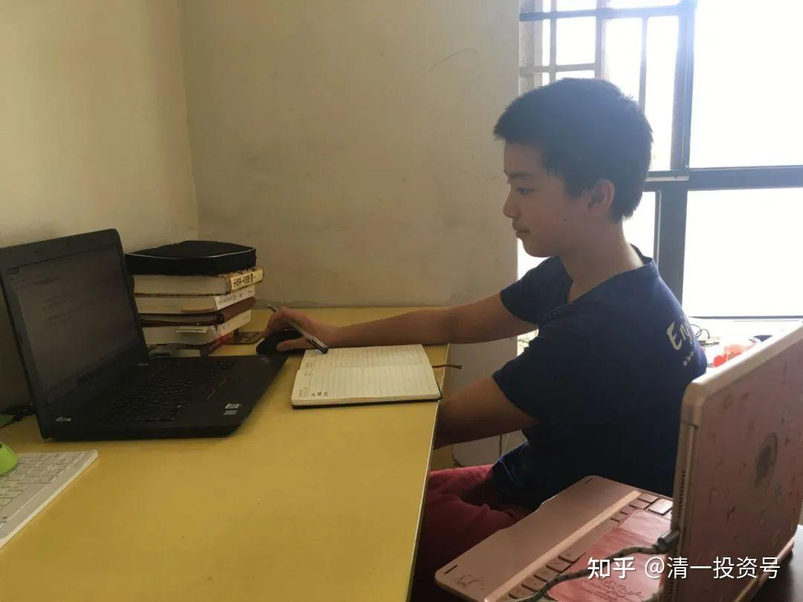

**在新教育分享会上很多人只看见今日新教育亮眼的成绩和结果，却不知今日新教育的核心基础和底层逻辑，就是心理和行为的引领培育：培养卓越者的思维习惯和行为模式。**这是需要家长和学校共同配合，才能培养出来。为什么这一次应试教育下的网课问题丛出？其实今日的学生，如果从来没有来今日面授过至少半年以上，老师也许做不了网上学习的。因为没有运行的核心基础。而学生一旦得到了这个”学习基础“，**不仅能够适应网上学习，还可以适应体制教学，任何学校的课程，甚至是自学，只要他愿意学，就可以学会任何东西**。因为：信念系统和价值观，是人基本行为的底层设计。**今日新教育的核心，就是培养热爱学习的责任和荣誉感，培养至上意识。有了这个内容，做别的都很容易了。**

我们作为今日新教育的受益者，特别感谢清一老师创立了今日新教育，感谢老师们的悉心教导！

**参考链接：**

**[这就是今日学堂](http://link.zhihu.com/?target=https%3A//space.bilibili.com/487498588/channel/series)**

**[2012年的今日学堂](http://link.zhihu.com/?target=https%3A//www.bilibili.com/video/BV193411178W)**