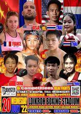

泰国拳手前几天，又打死了一个！这是几乎每年都有的，被打死在拳台上的拳手记录的最新版。泰拳的凶猛无情，可想而知。

另外，木兰们昨天从拳馆回来，告诉我一个消息：上次与佳惠一起参加比赛的清迈冠军拳手，手臂被打骨折了。估计很长时间打不了比赛。我说：他这场比赛打输了吗？答案是赢了。他还把对方KO了。但由于对方的高扫腿力量很大，他在保护自己的时候，手臂挡重扫腿，导致骨折。随后，他也用重腿KO了对方。比赛是赢了，但胜方也很艰难，半年一年的都肯定都不能参加比赛了。对于一个靠出场费过日常的职业拳手而言，是非常大的损失。拳馆里面的另外一个冠军拳手，在比赛中也用泰扫腿把对手给KO了，但他的胫骨在攻击对方的时候也受伤了，肿了一个大包。所以，泰拳的赢家，也未必比输家就更轻松。

这在现代格斗中，是很正常的比赛。你们看张伟丽和乔安娜的打一场比赛。都在笑话乔安娜被打成了寿星。其实张伟丽这场比赛也严重受伤。只是她特别耐打，没有被乔安娜打垮罢了。现代格斗，双方比拼的是互相伤害的程度，谁能输出更大的伤害力，谁能耐受更大的打击，谁就赢。

另外还有一个消息：一个很知名的泰拳冠军拳手，在三天前的周末拳赛中，被对手用肘击中头部而KO。昨天传出的消息是：去医院抢救两天后，最终没有救过来。昨天已经正式宣布死亡。拳馆的拳手们都议论了一下这事。感到很惋惜。主要是对手还是外国人，让泰拳手们感到有些物伤其类的伤感。

木兰们找到了这场比赛的视频，我把它传上来了。让大家看看泰拳的残酷：我观察出来，这个外国人好像是东欧人，会一些“身拳”，身步合一的状态，跟我们的拳派练拳的要求很像。我怀疑他学过“西斯特玛”---俄罗斯特工的格斗技术。虽然还不是很精通，但西斯特玛的训练对于”沉身“的价值很强，也就是中国武术说的所谓的桩功，但太极和西斯特玛的桩功是“活桩”，与外家拳的桩功不一样，外表看不太出来的。另外，西斯特玛训练特别强调随动反应，步态也极为灵活，这些足以让强调粗重泰拳手打不动他了。这种武术俄罗斯说是他们自己的特产，但我知道的一个版本，是八国联军进军中国的时候，俄军进占东北后就赖皮不走了，他们的一个喜欢武术的高级军官，在东北跟一个中国老人学的太极实战格斗，然后俄军把这种技术，融合进了军队，特别是谍报集团的近战训练，成为克格勃的特有训练项目。在苏联解体之后，这种格斗技术才传到社会上的。当然：俄罗斯自己是不承认的。但他们自己也说不清西斯特码的来历源泉。

另外，这个东欧人的肘膝攻击都很厉害，力量超大。直接导致泰拳手死亡的是他的一个转身肘，正好迎面击中泰拳手空虚的中线，我怀疑是击中了【檀中】穴位。这是著名的36死穴之一。肘部击中的话会让对手气血淤堵而死。但我认为这个人不是故意使用点穴术的。估计他自己也不知道。转身肘定位能力也不强。因此算是意外吧。估计当事人会很蒙的？我怎么一转身用肘，这么轻松就打死人了？

另外泰拳手虽然是知名的拳手，但这场比赛明显不在状态。前两局居然跟外国人拼自己并不擅长的拳斗。让我怀疑这是泰拳赛还是拳击赛？第三局才恢复正常，开始用泰拳的传统方式，用腿做主要攻击手段。但奇怪的是：泰拳手的硬扫腿，似乎这次用处不大。他在击中对方的时候，居然多次让自己摔倒。可以说对手特别的强硬，但也可以说泰拳手明显的不对劲，不像是知名泰拳手应该有的硬朗，甚至普通泰拳手都不应该在扫腿的时候这样脆弱地摔倒的。好像是腿脚无力的样子。我认为：有可能是前两局的拼拳，对他的体能消耗过大，甚至大脑有打击造成反应力，判断力下降，重心掌握不稳了。而泰扫腿的威力，特别依赖强大的体能支持，强调全身爆发发力的。他在体能不足的情况下，对方如果身形还特别的稳定，这种攻击的确会导致攻击方站不稳而自己倒地的。因此：这也是中国传统功夫，为啥没有发展“扫腿技术”的原因。这种打击方式太笨了----消耗大，收益小。靠的是不断积累每次打击的效果，才能造成最终的伤害。 但对手快速打击和移动的时候，泰拳手往往也没啥好办法。

另外还有一种可能，就是这个外国拳手学会的西斯特玛水平已经比较高了，接泰拳手扫腿的时候，可以身体发出一个弹劲儿，造成对方的失衡倒下。因此好几次都是这样。别忘了泰拳手练拳，每天都是打上百公斤的重沙袋，没见过这种一出腿击中对手却自己倒下的。但这种推测有点抬高了外国拳手的水平：因为只有内家拳的高手才会这种功夫。从这外国人跟泰拳手（我看起来有很多漏洞），居然打满五局，有时候还被连续攻击有点狼狈的样子，实力差距跟我们的小拳手打泰拳手相比，他没有看出压倒性的优势。但我们的拳手都做不到让泰拳手一个扫腿过来就把对方弹翻掉。所以，我要相信这个东欧人，已经学会了西斯特码的高级功夫，拥有不可思议的弹抖劲，我觉得不太像。我就只能相信是泰拳手实力差了，身体发“软”了。导致进攻无力，发挥失常，可能更符合常识一点。

[!\[image\](images/img_001.jpg)

泰拳最新的死亡决赛 https://www.zhihu.com/video/1532714346660069377](http://link.zhihu.com/?target=https%3A//www.zhihu.com/video/1532714346660069377)

擂台上的死亡当然很遗憾。不过，我认为：死在拳台上，也比平庸地活一辈子，然后老死在床上更好，起码死的很潇洒，也不受罪。拳手被打死，这在泰拳比赛中，是很正常的事情。因为泰拳的核心原则，评分标准，就是给对手造成最大的伤害。双方拳手一上台，抱的目标，就是要尽量的输出最大的力量来KO对手。而且泰拳的规则相当的开放，可以使用身体的八个部位来攻击，几乎没有啥限制。除了巴西柔术不能实用，其他技术基本上都可以使用。拳手们肯定回去拼命琢磨怎样才能给对方造成最大伤害的技术了。昨天小木兰们还很惊讶地告诉我：泰拳的冠军哥哥，再和馆长讨论：用拳头怎么都很难让对手受到最大打击，因此应该用手掌的根部来打对方脑袋，这样的效果才最好。这是我跟小木兰们谈的：太极拳不是用拳头打人，主要用掌。而真正使用的部分，是掌根。这让小木兰们讶然---认为泰国人真聪明，已经发现了我们才知道的技术。我笑说：泰国人虽然知道了掌根攻击效果更好，但他们还没有建力起一套大力发展掌根攻击的攻击方法。而太极一直在研究这样使用这种技术。因此：你们可以用出来，用于攻击头部的话，效果不用于用肘击打头部，但比用肘攻击头部的方式和变化都多得多，更容易击中对手。其实，你们看太极拳的套路演练，全都是横扫的。因此太极拳其实不能用现代格斗的方式来使用。比如用掌法来打，才是真太极。这一点，八卦掌也一样。太极称拳，其实是误传。应该叫太极武道---用掌和其他身体有效部位的格斗手段。

由于泰拳的几乎无限制的攻击手段规则，因此号称“站立格斗之王”。真正的泰拳擂台实战，其实是很残酷的，比踢拳，散打要更残酷，更容易KO人，也更容易打死人。泰拳对垒的双方，无论是输家和赢家，其实打下来都蛮惨的。有人见过现场就算是播求这样的高手，打完比赛后，还是打赢了。看上去是很光彩的离开擂台。但去休息室的时候，拳手周围没有观众了，就放松了，就明显看到走路是一瘸一拐的，甚至还坐轮椅行动。显然比赛中也受伤不轻。上次我写文章中，列出过一个比赛赢家的照片：肋部和大腿都被打肿了一大片。可见赢家也很艰难。输家，当然就更难看了。甚至要付出生命的代价。

但各位都知道：木兰们已经打了八场比赛，对手有几个还是泰国的金腰带拳手。好像打下来，也没有这么惨的。每次打完比赛，馆里的教练和泰拳手们，总问木兰们：这一次比赛哪里受伤了？让他们看看。还让她们最少休息一个星期再恢复训练。每次听说木兰们居然根本就没有受伤，都认为有点不可思议：怎么来打残酷的泰拳比赛，会有不受伤的人？认为孩子们身体太硬了，抗击打超强。却不知道孩子们的训练模式，是要尽量避免被对方重拳重腿击中的缘故。如果真的让泰拳手发力打上来，她们还是会受伤的。8场比赛中，我看唯一她们受伤的一次，就是上次佳惠跟对方拼内围的时候，对手用头来撞击她的脸部造成眼睛方附近淤伤，据小木兰们说：解说员说泰拳手用特殊武器攻击了中国人。其实伤害也不严重，就是眼部周围一块淤伤，不太好看。第二天我看到，还以为是被对方的肘击受伤的（对方拳手的头部，这次比赛中就被佳惠肘击，导致受伤后使用冰块）。结果佳惠说不是，是自己拼内围的时候，对方用头撞上来。这是明显违规的。但裁判根本不处理。而且说泰国的裁判，这次比赛拉偏架很厉害，内围战每次她刚取得优势，到了可以攻击对方的位置时候，就被裁判强行拉开了。所以造成无法KO对方的局面。虽然被判输了，身体也没有受伤。场上虽然偶尔被击中，但由于处在对方无法正常发力的状态下，因此不用担心受伤问题。

明晓打的两场比赛就更明显了。仔细看比赛过程，对手基本上连一次有效击中都没有做到，都是她在追着别人打。为啥同样是打极为残酷的泰拳，我们的选手，就可以不受伤呢？轻轻松松。像是跳舞一样就打完了比赛？（孩子们说打比赛比平时训练轻松多了）

** 原因是中西格斗思维的不同。**

西方现代格斗，是典型的西方思维模式---很简单化的攻防明显分开的模式。进攻就是进攻，防守就是防守。往往双方很有默契的分别进行轮换的攻击和防守。而且现代格斗（泰拳也是现代格斗的一种）的核心思维是进攻，不断的进攻。一切预备式，都是为了进攻而做好准备。因为只有进攻才会赢。他们还认为：进攻就是最好的防守。只要自己的攻击猛烈，让对方无法出拳，就不用担心防守问题了。泰拳的三宫步特别典型----不惜把身体的中线暴露出来。核心原因，就是跟拳击一样（拳击也几乎就是正面站立），因为只有这个几乎是正面的站立姿势，才能够容易输出最大的双拳，双腿轮流出击的的攻击方式。侧面站立，发力很困难，往往只有一侧能够发力。而且也导致双手转换打击比较不容易。可以说：三宫步就是把防守自己要害，看的不是太重要，至少认为没有预备发动进攻更重要，关注点是如何进攻。因此，泰拳和拳击练多了。我认为在街斗中使用泰拳技术会很危险。很容易被击裆。因为他们没有防守中线的意识。

但中国传武的思维模式，与现代格斗“进攻第一”的思维不同，是“防守第一”。中国武术人认为：保存自己才是第一位的。进攻必须在先保存自己的基础上，有机会，再进行有保障情况下的进攻。如果没有机会攻击，也要尽量让自己不吃亏，不受伤。因此----严密的防守，特别是守住自己的中线，是中国传武功夫的重大特征。虽然擂台上不能击裆，但胸腹部被击中，也会严重影响战斗力的。木兰的第四场比赛，就是用穿心腿，击中对方三次腹部，对方就撑不住而KO倒下了。当然，泰拳的模式穿心腿无法打出速度和力量来，因此泰拳依然不够重视防守中部。

比如中式传武的“防守式”与泰拳的区别就很大，你们看到的木兰们的格斗姿势。强侧置前，把最灵活，最强大的右手，放在最前方，作为自己最重要的保护手来使用。而且不断的转动增大防御范围。而现代格斗是把右手作为重要的进攻手来使用的。我们的站立姿势，正面暴露的面积最少，防守的力量却最强。显然就是标准的“防守第一”。另外，由于内家拳的发力方式不同，不需要转体来发力，所以也避免了外家拳采用这个姿势会导致双手变转发力比较困难的问题。而且外家拳不转动身体的前手发力，就没有力量。我们的前手发力也一样有力量，可以击倒对方。这就是不同的技术，导致了不同的姿势。外家拳采用我们的姿势，是很别扭的，往往导致不会打拳了。比如泰拳手们发现木兰的正蹬很厉害，很顾忌腹部被正蹬打中的情况下，也会把身子侧对着对手，把腹部藏起来。但这样一来，她们自己也不会出拳了。完全陷入被动防守的地步。

中国内家拳的防守，与西方现代格斗不一样：比如泰拳，防守就是防守，双拳抱住自己形成一个盾牌。等对方打累了，又赶快抓紧时间换自己进攻一轮。攻防易位。

但内家拳是不用这种方式来防守的，觉得这样做太笨了。木兰们在练习的时候，面对泰拳手们这样盾式防守的时候，就用一只手勾开对方的防守拳，另一只手从侧面打进去。然后松开勾开的防守手，马上又打上泰拳手的另外一个侧面，让他们防不胜防。这就是太极拳的双手联动，攻防合一。让对手防不胜防。

同时太极最厉害的地方，就是只一只手出击，也一样是攻防合一的。比如最典型的攻防合一就是“野马分鬃”，我教木兰们：不管对手出啥招，你都可以不管不顾的，专心发一招“野马奋鬃”直杀对方中线（头部和胸部正中）。他攻击越猛，就吃亏越大，直接打了一个迎击。木兰们多次使用这一招把对手打倒在地。

野马分鬃出手是一个云手，一个小圆圈就圈住了自己身体前的所有面积，不管正面出啥攻击，全都能防住，几乎可以说滴水不漏，而且后手也在画圈，双重的防御，对手的拳很难漏进来。你们看原来的视频中，泰拳手猛烈拼拳，只见木兰双拳云手不断画圈，轻易化解攻击，还不断上前出击，导致对方攻势完全瓦解，反而被我方捶打，就是这种技术。我们的拳手，你是见不到遇到对方攻击就抱住头防守和摇闪架势的。这是拳击的防御模式。太极是以攻对攻，毫不退让。看上去根本不防守，因为已经把防守与进攻合一了。

那么太极对攻，与外家拳互相抢攻，有何不一样？其实很不一样。太极后发先至，出手是画圈，因此肯定能够截住对手不同直接发动的攻击。外家拳出手是直线，不可能防住其他方向的错位攻击。所以赛场上，曾经出现一次双方同时KO对方的比赛，特别不可思议。就是双方都不同的路线发动攻击，几乎同时击中对方，双方同时倒下。这在太极格斗中不太可能出现这种终归于尽的局面。特别是太极格斗出手的时候，头部是位于手臂的正后方，相当于司令部跟随最强大的特种攻击部队一起行动，因此对手打不打，我们根本不关心，因为肯定打不中我们。我们的云手就是破对方攻击的动作，同时也是打开对方防守的动作。一旦撕开防守线，我们的攻击就会双手连击，在对方无法防守的情况下，击出上十次以上的进攻。大家在木兰佳惠的第三场比赛中看到了这种拳法。急如密雨，以攻对攻。所以泰拳手往往导致完全没有防守之力，节节败退。

内家拳讲求:“起手横拳”，就是这种格斗思想的体现----起手的目的，不是仅仅为了进攻，而是在“护住自己要害的情况下进攻”。这种功防合一，自然是直线攻击崇拜的外家拳，难以应对的。看起来不直不曲的拳，一点也不“正规”，完全没有拳击直拳的快速和漂亮，看起来像是没有训练好的直拳一样。但---泰拳手们就是防不住这种拳。而且发现看上去没用力气轻飘飘打出来的这种拳，力量很大，不像是外表看上去的这么轻柔。因此泰国人说我们的木兰力气大。其实这是“身拳合一”---我们的力量是出手中源源不绝的发动，不是拳击一样只有一次。所以对方防守等等我们出现出拳的空隙来反攻，结果发现没有空隙，只能步步后退。

另外：内家拳非常了解。外家拳是利用双腿支撑稳定来出拳的。因此，最好的防守就是让对方没有出手的机会。会用各种方法，让对方完全无法出招，我方就自然安全了。比如一种：近身之后，为了不让对方有攻击的机会，一旦跟对方接触，木兰们的攻击方式就是不停的换动作逼对方站不稳，让对方不得不一直去找身体平衡。由于对方在不断的找平衡，当然没有机会发动攻击了。而我们可以在转换重心的过程中轻易发力。因此---我方就处于了必胜的境地。用云手封住对方的攻击路线，用重心不断移动封杀对手的劲力输出。因此---你看到的局面，就是金腰带拳手不过如此而已。场上像是不会打拳一样。但换你上去打，你封不住对手的拳。让她们能够发挥出训练中的水平，你就知道泰拳手的厉害了。可以KO，甚至打死你的。我去泰拳馆看过泰拳的女冠军拳手，在拳馆的扫腿打靶训练，力量极为凶狠，真不亚于男生的。只是跟木兰们玩对抗游戏，木兰却说她很软。主要是力量发挥不出来。

*太极征泰第九场海报*

明天晚上，木兰明晓将参加太极征泰第九场比赛。上次比赛完，她对赛事方说：你们给我找的拳手太不经打了，随便一下就KO了（后来才发现对手是地区金腰带）。赛事方说：下次一定找个更厉害的拳手来跟她打。所以，这一次的拳手。肯定水平不低。但我们也不知道对方的细节，打完就知道了。预计后天发布第九场赛事的视频和解说。明晓发挥比较稳定，我想没有啥意外的话，明天她将在第三局KO对手。前面两局继续放水，出工不出力，给泰国人一点面子。第三局再出力干活。由于泰方裁判太偏心，所以我们的拳手不KO就判负，我们就只能立足于每场都KO对手了。只有实力超人，才敢说我前两局放过大量机会，不收拾你。但你可以火力全开。我们接得住最强悍的泰拳。