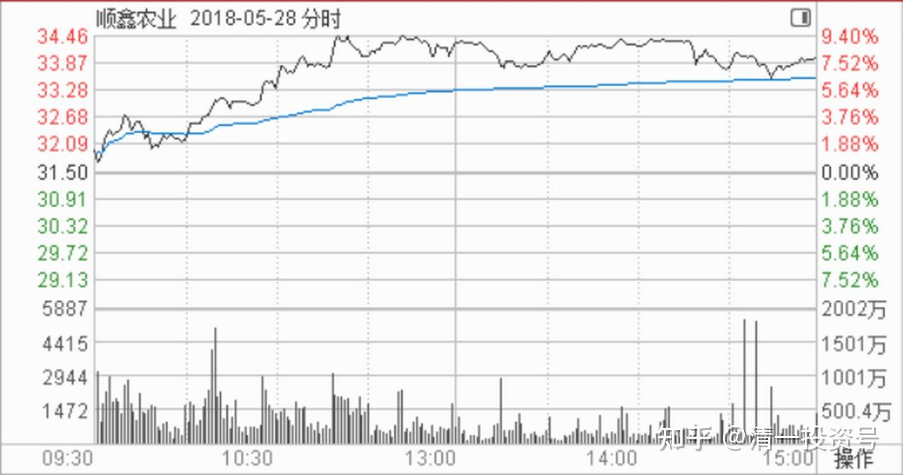
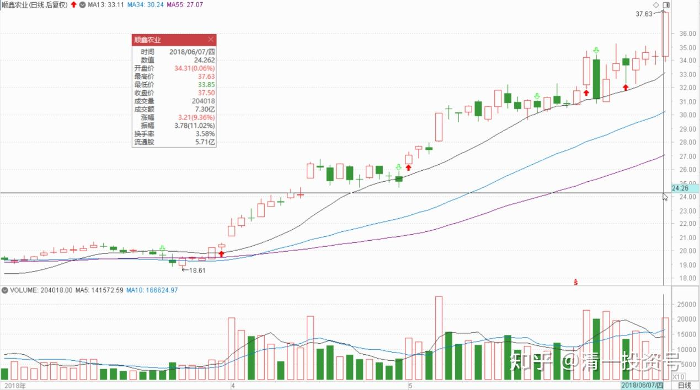
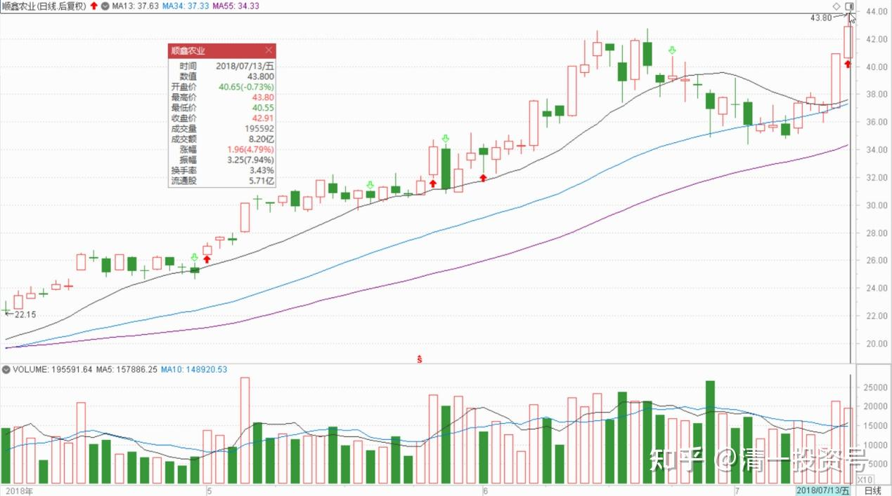

49篇.顺鑫农业记录三：买、卖、拿住股票的理由

清一山长2018年4～5月

题记：清一山长2022年6月7日“大家可以参考顺鑫农业原来的走势，这就是“长庄股”的走法。我甚至有点怀疑，现在的**就是原来的顺鑫主力。当年这个顺鑫的老庄，也是恶心人恶心得要死的，把很多老手都熬垮了。很多人刚涨一点点就走了。顺鑫我是中途进场的，都被这庄傻熬了两年。幸亏后来守住了，结果还算不错。主升浪的钱赚到了，吃了鱼头和鱼身子。虽然最后的晚宴中，似乎鱼尾巴最好吃，但我们就别指望吃全了。”

**顺鑫农业记录三《买、卖、拿住股票的理由》**

一、**买股票唯一正确的理由**

小小辛巴2018-04-15：

《小小辛巴的辨股析图57（顺鑫农业之一）》[https://xueqiu.com/5964068708/105204165](http://link.zhihu.com/?target=https%3A//xueqiu.com/5964068708/105204165)

//@小小辛巴:回复@吃面焉能无韭菜:

[错即是错]是的，错买了，如果买对了其他白酒股年初再反抄回来才是正解。可惜无法以事后诸葛亮的上帝视角赚曾经失去的钱。公开操作越来越难，特别是在可能扰动市场的情况下。有些失误与自己的人性有关，很难改变。可能最终才发现，赚多赚少都是命。[好失望]

清一山长2018-04-19 10:15:19@小小辛巴：

这种就喜欢吃面的人，你居然还理他？看他发言，满嘴的自以为是，胡说八道。顺鑫这两年表现不佳是事实，要早知道这一点，大家全都去买恒大、融创了。没有买这些热股的，投资就都是错的？都要认错吗？跟谁认？跟吃面的你认？你以为你是谁呀？

要辛巴认错的逻辑：“因为我认为，买顺鑫，是有犯错的，是要有反思在的，君子坦荡荡，辛巴应该有一篇文章来向市场认错。这句话的意思，就是市场是对的。顺鑫没有涨，就证明你的选择错了。”

下一句话：不要低估市场的力量：“顺鑫后面大涨甚至追上白酒的涨幅，也不应该忘记，我们当初买顺鑫，并不算是高明的选择”。顺鑫涨了，你也是错的。

这不是鬼扯吗？两句话的核心逻辑，就是相反的。前一句话，没涨就是错。后一句话，涨了也是错。他怎么说都有理。这种人，脑子就是不管用，还理他干啥？

**买股票唯一正确的理由，判断正误的标准，不是价格的涨跌，而是企业的发展。**就是要判断清楚：**这家企业值不值得买？是不是好企业？价格好不好？**判断错了，当然要认错。但是对错的标准，跟市场的涨跌根本就没关系！涨了是幸运，没涨也正常。**市场就是疯子，我们只能利用市场，而不是相信市场。**

小小辛巴2018-05-01 16:54：

《小小辛巴的辨股析图57（顺鑫农业之二）》

[https://xueqiu.com/5964068708/106310901](http://link.zhihu.com/?target=https%3A//xueqiu.com/5964068708/106310901)

清一山长2018-05-04 23:37:28评论上贴：

我刚打赏了这篇帖子￥66.00，也推荐给你。看财报就要像辛巴这样，拿出福尔摩斯探案的精神。找各种线索，才能看到企业的真实经营情况[鼓鼓掌]。

**二、拿住不放的三个问题**

雪球球友原贴

$顺鑫农业(SZ000860)$顺鑫的仓位越来越轻，遥想报着它坐电梯若干次，原来是抱着金娃娃。

换的兴业套着，换的健康元也套着，唯有顺鑫，根本不调整屡创新高。

25～30元我守住了大部分，因为预期突破25就会到30，但是30元以上我一点点地换到了健康元上，今天顺鑫再飞，我真的需要反思自己的策略了——同患难不能共富贵！

@51nxp:回复@boolen1216:（上贴跟帖）

要怎样摆脱这个命呢？2015年5月底27元买的五粮液，股灾前30抛了。

我复星是2016年3月底19.5买的，20.3抛的。23.6再买入，24抛的。

平安36买的，37元抛了。顺鑫算赚得多的，也做得不好。

清一山长2018-05-28 14:14:12回复@51nxp:

我们买入的时候是冒了很大的下跌风险去买入的。起码**我买入后都预期再跌30%以上都可以接受才敢买入的**。如果像您这样，**每次都是只赚了一点小钱就跑了，是不是白白浪费了买入之前花费的心血和功课？**

今天顺鑫的盘面研读：**今天如早盘涨停，我就计划再丢20%出去。但是居然就是涨到9%都不碰涨停，这盘面，我就不卖了。因为显然主力不是没能力拉涨停，就是故意不拉的，让散户们着急后赶快抛出锁定利润的。**因此，我本来想卖的，看这样子就先不卖了，继续观望一段时间。既然我们散户没能力给市场定价格，只能跟随主力沉浮，就一定要有看懂主力意图的能力。不然就太划不来了，**低位的时候，白白帮主力锁仓，刚刚开涨一点点，赚一点小钱就把股权放水给了主力，真划不来。**

@见好就收决不可贪:回复@51nxp:

赶紧换回来吧！顺鑫又要创新高了

清一山长2018-05-28 14:17:24回复@见好就收决不可贪:

我也判断顺鑫还要创新高的。但是我绝对不追涨买入，只找机会卖出。原因就是我的**保命法则：绝不高位追涨。宁肯错过，不要做错。**

其实，现在低位的好东西不少，有啥好急的。目前我正在慢慢买入价格还在10年没涨的一些潜在的消费股。

@Dior2013:回复@清一山长:

太赞同山长这个观点了！但是如何把握合适的度，不让这种坚守变成贪婪呢？最近一直在反思自己到底是否贪婪，很困惑！

清一山长2018-05-28 16:03:56回复@Dior2013:

我拿住不放，跟贪婪没有关系，跟我回答持股不放的问题有关：

**1.企业的基本面支持目前的价格吗？**

**2.主力的意图是出货还是进货？**

**3.是否有更有潜力的股票可以买？**

如果你能回答这三个问题，就能拿住。如果回答不了，就拿不住。**赚钱拼的不是谁没脑子死拿，或者见利就换。而是拿有拿的理由,不拿有不拿的理由。**

**三、市场内是个疯子，无道理可讲**

//@51nxp:回复@清一山长:

我最早用顺鑫换兴业，连红斌都反对。

清一山长2018-05-28 16:45:43回复@51nxp:

我也委婉地反对[笑]。我表示理解你被坐电梯做怕了，其实是提醒你可能中了主力的心理圈套。我也坐了几轮电梯，每次低于20元就买货,一股不卖。但25元之前，顺鑫根本就没走的理由，25元以上会调整一下，做点波段也正常。35元左右，应该也有波段可以做的。但心态稳定的人，可以不做，死拿就行。

**等出货信号出来——到处都有各种“公众号”，大V等，在吹嘘顺鑫多牛的消息，这时候才该走[大笑]**。

//@51nxp:回复@清一山长:

谢谢！我一直坚持独立思考，同时也注重更新自己的知识，但是做为散户，面对市场总有无力的感觉，比如说兴业，历史最低估值就是再跌新低，比如说健康元，医药股这样强，它能创下新低，18倍PE,2PB,还有丽珠单抗这样响当当的创新研发团队，你说兴业跌，金融去杆杠银行股下行还能理解，健康元这么无厘头大跌，我只能感慨命运无常啊！

清一山长清一山长2018-05-31 12:56:17回复@51nxp:

忍不住想要批评你一下了[大笑]：你总认为股票涨跌都应该有道理，这就不符合巴菲特老人家的教导了。**他认为市场就是个疯子，没有道理可以讲的。我们只需要学会利用疯子就够了。**你的发言，就是想要去理解疯子，或者希望疯子讲道理一些。这样下去，自己非疯不可[大笑] 。**别说散户面对市场无力，就是主力，庄家也一样无力的。他们也不能控制市场。**不然就不会有这么多庄家主力破产了，如德隆系。许家印买了万科，不是也认亏几十个亿出局吗？裘国根进了燕京之后，不是一样很“无力”吗？他比你赚得还少（比例上），看你这段时间赚了燕京之后又赚了顺鑫的，现在要赚健康元了。他好像还是死守燕京，起码比你有耐心[大笑]。

另外，你觉得“你的”兴业跌惨了，但是你看其他银行，近期的跌幅都比兴业更大。兴业其实算很稳了（也说明持有兴业的人不愿意卖出了，未来可期）。兴业最高离现在也就跌了三元多，但你去看工商银行，从7.77元跌到现在5.67元，每股跌了两元多，换成兴业的股价，差不多等于每股兴业要跌五元多快六元了，跟谁说理去？浦发原来也是“招浦兴民”四大之一，去年就一直就没涨，但也从14元多跌到现在10元多了，跌幅远远超过兴业。您持有兴业，还在埋怨兴业，也太怨妇了一点[大笑]。用这种心态来玩投资，也太累了[哭泣] 。

我在浦发上赚到的钱，远远多过兴业，但我也没有去埋怨啥（当然也没持仓了，2015年高点走掉了浦发，进了兴业一直守，持有没赚多少，你看到我走掉的）。虽然兴业一直没涨，但我很感谢兴业，起码帮助我维持了资金的相对稳定[大笑]。

**四、不做主力的对手盘**

清一山长2018-06-07 15:51:33

$顺鑫农业(SZ000860)$今天开始卖出操作，卖出了大约20万股。顺鑫目前已创我的酒股赚钱最多的记录（可惜当年最低价买入了五粮液和泸州老窖，却因为看不懂酒，没有重仓介入，还过早跑掉。这么好的酒股，这么好的进入时机，但这两只股我只赚了几百万[哭泣]。否则哪有顺鑫创纪录的机会）。不过，如果顺鑫顺利实现“民酒”和品牌上行计划，或者压制对手进行市场扩张计划成功，这就是一个前途无限的企业。我手上持有的白酒股大多数都获利后退出了，让我有点怀念“国粹”。所以，我没有打算卖光现在手上的顺鑫，想要多持有几年。计划成本降到零就停手了。

51nxp:回复@清一山长:

唯有深谙《道德经》的人做投资才会这么游刃有余！

清一山长2018-06-07 18:26:51回复@51nxp:

我是准备好被打脸的。顺鑫太强势了，一切做空的人都会被踢的[哭泣]。前几天买入燕京、珠江，今天已经打脸了[哭泣]。还好，我忍功不错，脸皮也厚一些，不怕[大笑].

明达野老2018-06-07 12:24

《顺鑫主力之“做规律”》[https://xueqiu.com/2029742712/108482863](http://link.zhihu.com/?target=https%3A//xueqiu.com/2029742712/108482863)

明达野老:回复上贴专栏文

$顺鑫农业(SZ000860)$今天执行卖出，第一笔挂单刚看到已经成交，成交价37.37元，第二笔挂单占总持仓比较多，放在上面一点，只要盘口试着封涨停，这笔单肯定就出掉了，目前没成交。总计减持量大概25%-30%（含上次减掉的2成左右），今天卖出仓位一部分换入了$会稽山(SH601579)$。

你越着急上攻，我就使劲卖，你不着急，我就卖缓一点。

清一山长2018-06-07 15:55:10回复@明达野老:

明达君卖得比我好[很赞]。超过37元，我就着急卖出了，最高的才卖了37.25元。后面还有大笔筹码等它冲涨停大卖的，结果它居然没冲涨停，我也就停手不卖了。再等等看了。

//@明达野老:回复@清一山长:

我这挂的单只是运气好一点，也没死盯着盘口。

PS：今天的盘口，主力处理得真好，跟风盘成功被带起来了，好戏要正式开始了。

清一山长2018-06-07 17:31:57回复@明达野老:

[赞成]这主力，手法实在太老道了，绝非一般人，厉害[合十]。**我跟你一样，不敢去做主力的对手盘，不去猜测主力会怎样做，怎样想，只敢保住最傻的逻辑——见利就走**。想要与狼共舞，当心被狼吃了。还不如去找个主力还没有发现的股，冷清地守住自己的寂寞！起码这样做，安全度高一些[大笑]。参与主力共舞，热闹是热闹了，不小心就被吃一口[滴汗]。

清一山长：2018-06-20 16:55:12回复明达野老之

6月7日专栏文《顺鑫主力之“做规律”》

这上升趋势线，10日线稳稳托住股价，20日线一碰就大幅反弹。阴线调整两日，就来一根大阳线。画得真漂亮！每天用上亿资金画出来的线[很赞]。会让急切获得回报的小散心理暖洋洋的，特别受用，操心焦虑没两天就又高兴了。追涨买入套牢没两天就解套了，真爽！！

顺鑫今年开始业绩释放，估计跌也不会急跌，这货一路创新高，看样子是没有悬念的了。

明达野老:回复6月7日专栏文《顺鑫主力之“做规律”》

$顺鑫农业(SZ000860)$

今日操作：42.5元上方清除所有剩余仓位。祝福接我盘的资金继续大赚[献花花]。看今天的盘口，主力是故意做出来的，方向就是让收盘价能够创新高，做出“即将突破加速”的势态，这也是我尾盘才走的原因之一。因此，如果后势稳的话，这股还会涨的。我只是认为这么短的时间，还是市场不好的情况下，这只票居然让我赚了一倍多，我已经很知足了，就提前落袋为安了。就像扬农一样，50元卖出后持续打脸。所以本人脸常肿，千万别跟着我操作。卖出的另外一个小心思是，就是我认为个人目前酒类仓位太重了，腾出点资金看看医疗股，目前看到一支从最高价跌掉75%+的“烂国企”，正琢磨进入。健康元我是暂时不买了，如果跌回去，我也会考虑加仓的，不跌就算了。

PS：主力也真够拼的，遇到这段时间市场不好，每天用那么多资金用来画线，希望主力的力气没白费，祝福他大赚离场[献花花]！

清一山长：2018-07-13 22:32:05回复明达野老

[很赞]逻辑清晰。今天42元我也减仓了，已经接近清仓，还留了几万股。理由就是：涨太快了，而且我很满意了。涨慢点，我也不用这么快出掉货。

支持买医疗股的逻辑，如果酒喝多了出问题，就一定要找医院的[大笑]

（标题为编者所加）

参考链接：

[清一投资号：29篇.2021年评顺鑫](https://zhuanlan.zhihu.com/p/498221415)（整理文）

[清一投资号：44篇.顺鑫农业记录一：开始关注买入](https://zhuanlan.zhihu.com/p/539035593)（整理文）

[清一投资号：46篇.顺鑫农业记录二：最多输时间不输钱](https://zhuanlan.zhihu.com/p/539203562)（整理文）

[清一投资号：51篇.顺鑫农业记录四：主力还没有开始减仓](https://zhuanlan.zhihu.com/p/544147559)（整理文）

[清一投资号：53篇.顺鑫农业记录五：中国炒股最重要的技术是保本](https://zhuanlan.zhihu.com/p/544149372)（整理文）

[清一投资号：58篇.顺鑫农业记录六：最靠谱的投资方法就是不炒股](https://zhuanlan.zhihu.com/p/545612289)（整理文）

[清一投资号：61篇.顺鑫农业记录七——机构坐庄三招：养、套、杀](https://zhuanlan.zhihu.com/p/556331421)（整理文）

[清一投资号：65篇.顺鑫农业记录八：基本面的估值修复和主力技术面的空间](https://zhuanlan.zhihu.com/p/560419930)（整理文）

