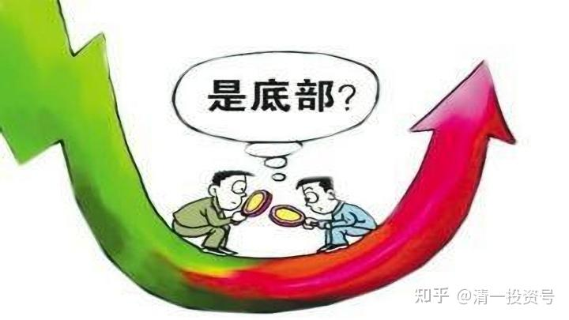
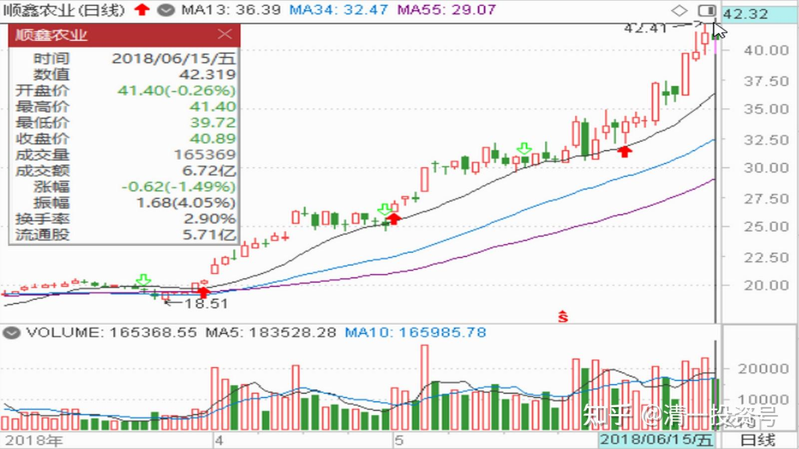
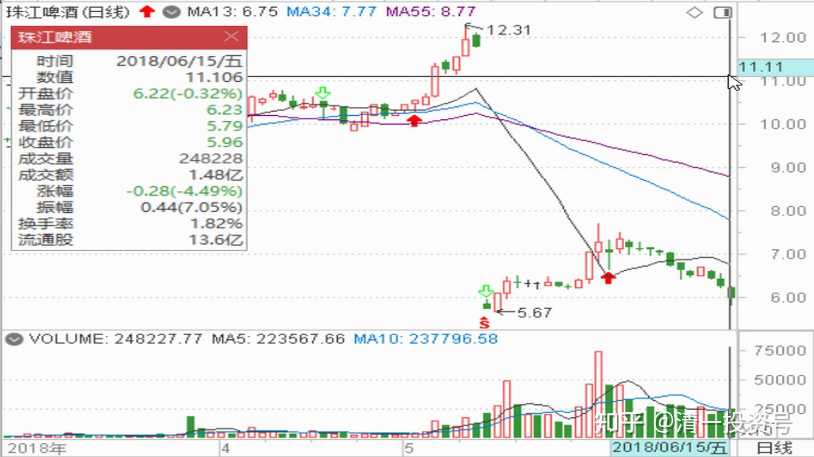
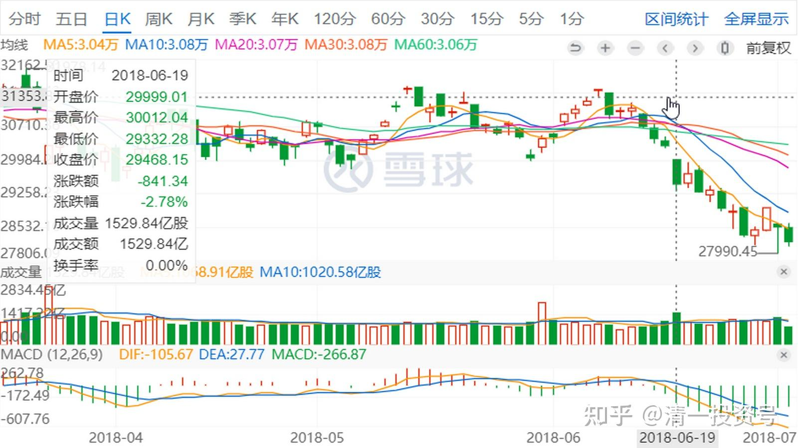
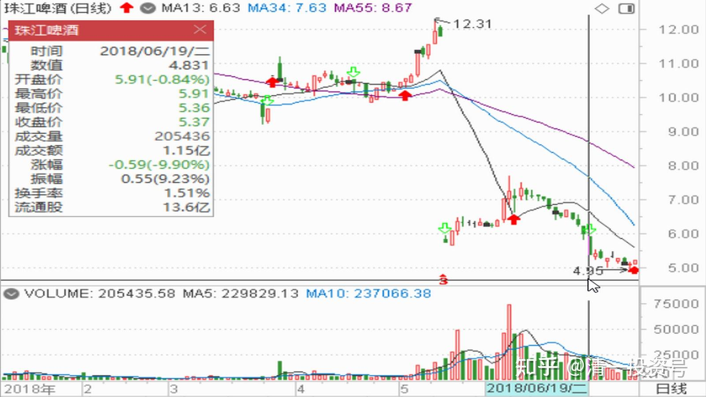

51篇.顺鑫农业记录四：主力还没有开始减仓

清一山长 2020年5月-12月

题记：清一山长2022年6月7日“大家可以参考顺鑫农业原来的走势，这就是“长庄股”的走法。我甚至有点怀疑，现在的**就是原来的顺鑫主力。当年这个顺鑫的老庄，也是恶心人恶心得要死的。把很多老手都熬垮了。很多人刚涨一点点就走了。我是中途进场的顺鑫，都被这庄傻熬了两年。幸亏后来守住了，结果还算不错。主升浪的钱赚到了，吃了鱼头和鱼身子。虽然最后的晚宴中，似乎鱼尾巴最好吃，但我们就别指望吃全了。”

**顺鑫记录四《主力还没有开始减仓》**

**一、主力还在慢慢派，没有开始减仓**

清一山长：2018-06-15 11:08:55

$珠江啤酒(SZ002461)$40.55元卖出一部分顺鑫农业，现在持股成本已经降到0.22元一股了[大笑]。今天大量买入珠江啤酒，理由就是：顺鑫很可能涨到80元,但顺鑫涨到80元的难度，估计比珠江涨到12元的难度高，所以用顺鑫换珠江，只留下顺鑫的利润继续奔跑。其中一单是以5.79元挂进去十万股买入珠江，查看已经成交。现在在继续买入中,不知道下午会不会破位下跌,今天豁出去了[加油]。珠江本来都快到一千万的利润了，现在跌到只剩200多万，惭愧。应该7.71元出光的，锁定利润[大笑]。不过，我本来就是买入就套牢，卖掉就上涨的命。还是认命吧！我不入地狱谁入呢？我就在珠江的地狱里慢慢做吧！没钱了就去清迈山里面玩去，有钱就看看盘。

//@shmily-cc:回复@清一山长:

一千万！我感觉山长才是所谓主力了！

清一山长：2018-06-15 11:32:12回复@shmily-cc:

你搞错了，我不是主力，我比主力强[加油]。因为主力今天的账面上，绝对是亏本的。不信你去找他看账户（不过他肯定不给你看的[大笑]），但我可以通过“特异功能”看到主力的账户，是绿色的[大笑]！！主力是我的好朋友，他特别有钱，特别慷慨，我7.71元卖珠江的单子，就是他们吃的；我五元以下买进的单子，也是他们给的。正因为主力如此大方，所以账面才是绿色的。我沾了主力的光，所以才变红了。主力估计太有钱，太任性了，现在还没吃够，还要洗盘，大大的力度来洗盘。等洗完了，就该拉了，就变红了。也许还要多等几个月。

顺鑫主力早就吃够了，所以拉起很顺利。**我相信你们大多数人手上都没有顺鑫了，因为都交到主力的手里了。但主力正在慢慢派，边拉边派，但还没有开始减仓。等主力减完仓，这票就该慢慢地跌很长时间了。**珠江目前的主要筹码，应该还在散户手里，所以要使劲砸。砸到你怕就丢掉筹码。我是个怪物，下跌的时候，我一害怕，就去买股。越怕越买，结果主力骂我没眼力，不识好歹！

51nxp:回复@清一山长:

山长的操作我非常佩服。

珠啤越跌越买正是持有资产的态度。

我从来不止损就是基于这种态度。我记得刚买兴业时，谷子地老和草帽干架，我一句话就说服了谷子地——我说我买的兴业股权的股息是我1996年底进股市本金的4倍，夫复何求呢？

30元以上抛顺鑫换的健康元虽然也换亏了，但是是我投资生物医药的实践，坚于初心，砥砺前行，不问西东，水到渠成。$健康元(SH600380)$$XD兴业银(SH601166)$

清一山长：2018-06-15 12:07:43回复@51nxp:

[献花花]兴业股息是当年入市资金的四倍，好成绩！！！[大笑]。怪不得谷子地没话说了，你要是去买招商，股息就只有两倍当年的资产了。

我今天也收到了兴业给的股息，的确挺多的。虽然只买入了原来持仓的一半股份，但股息依然比大多数人的工资高不少，也比我当某银行分行行长的表妹的工资都高一点。算起来，今年仅兴业给的股息，就是我1993年首次入市总资金的20倍以上（主要是当年太穷了，能够拿来入市的钱太少了[滴汗]）。中国股市对我们实在太好了，没理由不感激！

**二、金融市场是考验心态和修为的地方**

//@51nxp:回复@清一山长:

你比我更强，你投资是副业，教育是主业。我投资是主业。

清一山长：2018-06-15 12:53:36回复@51nxp:

不是更强，我只是更幸运罢了！在中国有金融市场这20多年，还能够活到现在的投资人中，有很多人的复合回报率，都比巴菲特的28%要高。但我们谁都不能说比巴菲特更强，而是我们比巴菲特更幸运，机会更好罢了。因为过去的20多年，中国企业的成长速度，是全世界第一快速的。只要是我们认真地投资了好的企业，愿意耐心等待，就会成功。我相信你就是这样做的。（但是未来的20年，中国的投资机会，就没有我们这么好的了）

在中国，还有另外一项额外的收益：普通股民缴纳的“智商税”。由于**中国股民大多数都是很不理性的，甚至是不学习，不成长的。但是又肯积极入市，典型的赌徒人格特征**。**与西方数百年培养出来的蓝色商业思维很不一样**。所以，这些股民造成中国股市的狂涨狂跌，提供了比美国和其他成熟市场更多的获取额外收益的机会。只要跟随了股民进退的节奏，就可以取得甚至超过索罗斯的成绩。这一切，都是中国股市的赐予，不是我们个人的能力。

至于主业副业，不是收益大小的主要原因，甚至不是重要的原因：有时候，我们把投资当业余爱好来玩，比每天坚持看盘，每天复盘的勤奋的“投资专业人士“，更有可能获得成功。**因为金融市场不是考我们的勤奋度，而是考验我们的心态和修为的地方。**不是认真和勤奋，就能够解决投资收益问题的[大笑]。我不肯发私募，就是不肯当专业人士。当上了很累，而且回报可能会变差。似乎云蒙自从当上专业人员后，收益就比自己做的时候差多了[大笑]。会不会就是专业的影响？我认为专业做投资，有时候反而限制了自己的自由发挥，会束手束脚的。自己玩自己的账户，不考虑客户会怎么想，会怎样评价自己的操作结果，操作就自由很多了。

//@mengxiang188:回复@清一山长:

我在西北，还要靠工资维持生计。本想在股市实现一点小梦想，发现根本就是幻想[哭泣]。

清一山长：2018-06-15 13:32:20回复@mengxiang188:

**所想即所得！**您**是什么心智模式，股市就呈现给您什么样的结果！**[大笑]在我的心智模式下，股市就是提款机。她真的变成了我的提款机！

对于另外的心智模式来说，比如牺牲者，股市就是自己去做奉献牺牲的天台！她也真的成为了很多人的献祭台！

所以，我开办的清一商学院，教学生只教心智模式，不教金融知识和技术！这些**传统商学院、金融学院教的东西，对是否赚钱没帮助，对假装专业人士有帮助。**

混乱成魔:回复@mengxiang188:

运气很重要，找对方向很重要，自己的努力也很重要，想当提款机就提款机啦！你想多了。

清一山长：2018-06-15 13:53:15回复@混乱成魔:

**心智模式不是想出来，不是努力出来的，而是培养出来的**。巴菲特20岁就已经形成了自己的“股神心智模式”，这种模式，让他以后在现实中成为了股神。如此而已。

用“赔钱心智模式”进入市场，真的就是来赔钱的！所以，**好的心智模式，万金难买！**

**三、与强大的骗人精站在一起，不跟傻瓜消费者站在一起**

清一山长：2018-06-19 21:06:45

今天刚回家，回来看居然股市全跌惨了，恒指跌了800多点，珠江居然还跌停了，真了不起。无论涨跌，珠江都一再打破我的预期，比我想的更糟糕，比我以为的更高调。证明我们真的脑子不够用的，永远别去猜主力会拉到多少价，以及打到多低。我估计大家全都怕了珠江了，等以后珠江回升一点之后，我估计很多人都想跑路了[哭泣]。

我现在才来得及花点时间来“哭”股市，是因为今天我忙死了，没时间看盘。因为我今天去签一个重要的买入合同，跟律师和卖家谈了很久，刚刚买下了一个老板经营了7年的度假山庄，总面积一百二十多亩地，依山傍水，地内有两个小湖，老板多年来种了不少树，花了不少钱弄绿化，园子内像个公园一样漂亮。周边的围墙，是竹林打造的，美景无限。外面数百米远的地方，还有一个美丽的大湖，坐落在清迈有名的温泉风景区内，附近一公里的地方，就是一个很大的高尔夫球场。地理位置优越极了。

不知道国内这样的地方会不会很受追捧，但这个度假村，经营的老板一直在赔钱，赔得受不了，就低价卖出来的。多低的价？我做老板的公司——绿城中国在上海卖的房子，或者我的融创在北京卖的房子，只要一套100多平方的价格，就可以买下这里的整个大园子了，连房子带土地，永久产权。不知道您认为我买贵了还是买划算了。反正，我如果有上海的房子，绝对卖掉来泰国买个度假山庄。然后看上海房子连续涨价，从十几万一平方，涨到一百多万一平方。然后坐等我的园子跌价，跌到没人买。反正再跌我就是不卖，留给孩子们去处理后事[大笑]。

今天我买园子高兴，忘记了股市的惨痛——今天我是满仓大跌，市值大大降低了。如果要算账，都不知道我已丢几个度假村了——所以俺还是不看账户好了。记住今天念一个经文，晚上就能睡觉了——今天要念：“阿弥陀佛。一股不少。一股没赔。大吉大利。明天继续努力！”。

大家别着急，我计划明天就去救市，用我能够找到的所有资金去救市，能救多少就帮助多少。尽心吧！比不了国家队，但股市有难，匹夫有责。我虽然身为海外游子，依然心系祖国，有难就要出手帮忙。计划就算是要借鬼子的钱，也要用来为国接盘。帮助今天跌停的好兄弟！一起共度艰难[加油][加油][加油]！！！

//@51nxp:回复@清一山长:

我也有疑惑，球友发的进度表中复星，恒瑞、海正、华兰、沃森都进度比丽珠快，而我在公开报道中看丽珠单抗是国内领军，跟公司沟通，他们也说不出道理，直到找到傅道田的专访文章心里才有了谱。

顺鑫去年买入的逻辑是全国化布局的大众酒被市场低估为农业综合类公司，而健康元是忍辱负重培养丽珠单抗的公司，我用这个词，是因为2010～2017年公司的扣非业绩在0.1～0.3徘徊，就是一只原料药+丽珠的寄生虫。然而朱保国先生对他起家公司深深地爱就体现在丽珠单抗的股权设计上，健康元占比71%多点。山长你再看看我转化的马曼然的生物医药文，单抗是近三年风口企业（2018年起单抗药专利逐年到期），丽珠单抗也是自2018年底开始出产品，健康元到时候就是大盈家了。

山长，你夸我选股的长处，这是因为你做组合我老是一个股，所以选股一定得多方思量，要想透摸透再下重手，我选的公司都是从自己做生意的角度出发。

**清一山长2018-06-18 16:20:47**回复@51nxp:

受你的影响，我也买了药，还买了不少。我越研究，越觉得这是一单不太可能亏本的投资。看上去保证性很大，是相对保险的投资。当然，涨不涨，啥时候涨，就不知道了。**我只管买入后静静等待就好。**我记得似乎你买入一些好企业后总要等好久。顺鑫就让辛巴两年都没脾气。所以我也做好长期抗战的准备[加油]。单抗朱老总已经等了它6年，我也拿上个6年试试看。起码赢了时间——比朱总少等6年[笑]

其实，我把酒和药物，都当成“害人精公司”，自己不喝白酒，也不吃西药的。**但我发现，企业越会害人，越会哄人，就越值钱，就越应该投资。比如茅台是装富贵，最会害富人，骗富人买，所以最值得买入；顺鑫是最会害穷人，骗穷人买酒喝，酒的销量最大，所以也非常值得投资。**黄酒不太会害人，所以买入黄酒十年也不赚钱。正好我偶尔会喝点黄酒，我消费的对象，都是不值钱的对象。所以不是很值得投资（当然，以后就难说了，也许黄酒也涨了）。

相比之下，卖酒比卖药的就差多了，卖药的比如健康元等等，哄人的技术含量就高多了，国际级别的大哄人精。酒要消费者自己骗自己喝，自己害自己。药是在医典、医院，以及医生的强迫下，你不吃还不行的，具有强迫消费的倾向。而且药物的价格比酒还贵，利润更是高多了，所以——肯定比酒更值得投入。所以，我理解了你卖掉顺鑫买健康元的逻辑。我觉得我也应该这么做，跟你一起买药好了[大笑[，跟世界上最会骗人的集团在一起，大概率会赚钱的。

当然，好处是：我们不需要去骗人。比如我们不用买了健康元就推荐消费者用生物制药高大上。就像我原来买酒股却从来不推荐人去买酒。原来持有泸州老窖、五粮液，现在持有顺鑫，我自己一口不喝，一瓶不买。懂酒的行家只能当酒徒，我不懂酒，就只投资酒就行了。还到处劝人别买酒喝，想买就把酒钱用来买酒股。所以，好心有好报，回报还好。（虽然我的劝说他们觉得很有理，但身边的朋友从来没有人听我的建议，他们都是光喝酒去了，不买酒股[滴汗]，而且他们都吃药，我劝人不吃也没用，正因为看到如此现象，我决定一定要多买卖酒、卖药的公司。与“强大”的骗人精站在一起，不跟傻瓜消费者站在一起）

51nxp:回复@清一山长:

盼着到你的渡假村一游。

清一山长：2018-06-19 21:22:04回复@51nxp:

非常欢迎你来，这个庄园，只用顺鑫的盈利买就够了，还没用完额度。估计顺鑫会继续为我贡献一些房屋建造费[加油]。

阴阳两面杀手:回复@清一山长:

佩服山长的老江湖，看问题很准，一眼就能识破市场行情。昨天我忍不住用顺鑫换珠江，就是受山长您的投资逻辑的引导，谢谢山长的财富思维，山长的新教育理念更好，谢谢山长的传统道佛两家思想的解读。祝愿中国能多出像山长这样的人！祝福山长幸福安康，家庭美满，事业发达！

清一山长：2018-06-20 09:43:59

回复@阴阳两面杀手:顺鑫继续涨，珠江继续跌，你就该骂我了[哭泣]。

恒生指数

（标题为编者所加）

参考链接：

[清一投资号：29篇.2021年评顺鑫](https://zhuanlan.zhihu.com/p/498221415)（整理文）

[清一投资号：44篇.顺鑫农业记录一：开始关注买入](https://zhuanlan.zhihu.com/p/539035593)（整理文）

[清一投资号：46篇.顺鑫农业记录二：最多输时间不输钱](https://zhuanlan.zhihu.com/p/539203562)（整理文）

[清一投资号：49篇.顺鑫农业记录三：买、卖、拿住股票的理由](https://zhuanlan.zhihu.com/p/543704521)（整理文）

[清一投资号：53篇.顺鑫农业记录五：中国炒股最重要的技术是保本](https://zhuanlan.zhihu.com/p/544149372)（整理文）

[清一投资号：58篇.顺鑫农业记录六：最靠谱的投资方法就是不炒股](https://zhuanlan.zhihu.com/p/545612289)（整理文）

[清一投资号：61篇.顺鑫农业记录七——机构坐庄三招：养、套、杀](https://zhuanlan.zhihu.com/p/556331421)（整理文）

[清一投资号：65篇.顺鑫农业记录八：基本面的估值修复和主力技术面的空间](https://zhuanlan.zhihu.com/p/560419930)（整理文）

