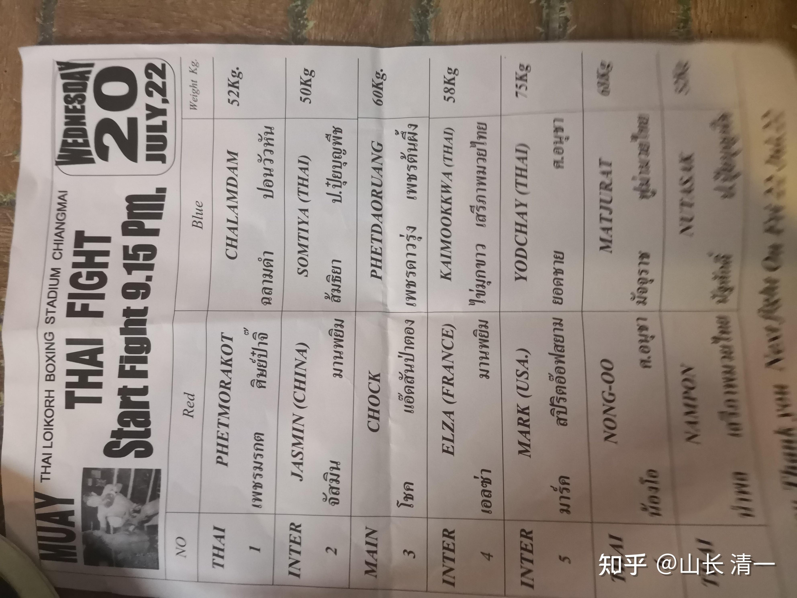
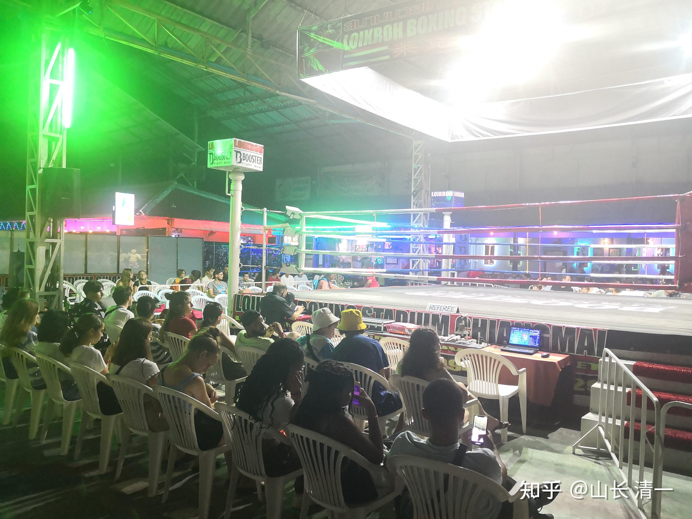
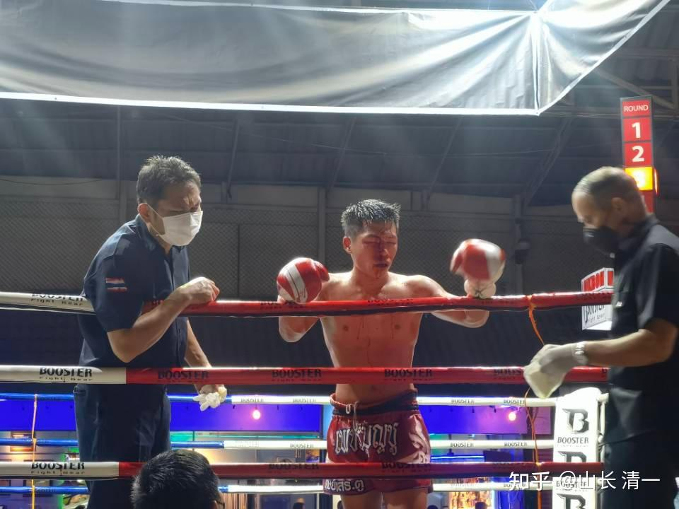

2022年7月20日的比赛，主办方给明晓安排的对手，是50公斤级的对手SOMTIYA。这是比赛的级别体重，正常的体重，应该至少多个两公斤的样子。而明晓的“自重”仅41公斤，因此今天的比赛，是要和比她重差不多10公斤的对手决斗。肯定有一些难度。上次她打的第一场，对手是42公斤级的对手，相当于她自己体重级别的正常对手，该级别的金腰带泰拳手，结果被明晓轻易KO。她打的第二场，是另外一个48公斤级的对手，被裁判意外提前终止比赛，被判平局。这一次，泰方中途就换了两次的比赛安排（原安排的比赛是15日，换到了18日，又换到20日才正式安排上比赛）。由于是明晓上次给主办方说：对手太差了，希望找个厉害一点的人过来。泰方保证会找一个厉害的对手来。这次泰方找来的是50公斤级的对手，我们不了解泰方的内情。所以我估计此人应该也是金腰带级别。明晓登记的泰拳馆的馆长，要求明晓第一二局最好不要KO对手，不好看。因此前面两局，会尽量压制自己的攻击手段。这种对参赛者的要求，比击败对方更难。要控制住自己有优势的时候不出手，还要防止对方以为她软弱，乘机毫无顾忌的全力袭击。因此我还是有一点担心的。播求对付一龙的二番战，就是要求不能KO一龙。结果播求打得束手束脚的，完全不在状况，开局还被一龙猛攻。差点吃亏。

由于我知道泰方找来的选手一定是厉害角色，出发前，我让明晓此战的第一局，一定要特别小心对待，起码要让对手知道她不好惹，对方强硬，她也要强硬回击。各位看过【霍元甲】电影，刚开始一场戏，是他爹与人打擂台，自己得机得势的时候，一掌拍下去，但又怕把人打坏了，赶快收手的时候，被对方反袭击，导致落败。 武功在差不多的时候，是没法让人的。特别这里是泰国的主场，周围的伙伴都特别多，泰国人的声音都在大叫，都是要拳手“快打中国人，使劲，打倒她”的加油声。身边都是泰过来为她加油助阵的亲朋友好。因此这个泰国对手，是必然全力以赴的。加上裁判也会偏心和鼓励她，甚至上一场比赛，裁判居然就在场上不断的教泰拳手，怎样去打我们的小木兰，却忘了小木兰懂泰语了。这种客场环境，对小木兰们是非常不友好的。但为了中华武术的荣誉，我们必须在海外孤独地奋战，把一切对我们不利的因素，都用我们无可非议的优势来转化掉。相信老祖宗留下的东西足够优秀，够我们弥补自己的不利之处了。 这是我的赛前判断。

*比赛赛程表*

*赛前半小时的赛场实况*

不过，昨晚的情况，还是让我意外了。昨天晚上我没去现场，明晓父母陪战，我们内部的沟通信息：

山长 清一 21:17:19

明晓打的对手是50公斤级。她升级作战了。泰国主办方，倒是一点都不含糊[表情]。的确想找个厉害的人击败明晓。第一局，明晓可以不追着猛打，但每次的出拳，出腿都要重一点。要让她害怕。不能一开局就容忍。因为她肯定抱了要痛打明晓的心。因为她的身体重这么多，如果打不赢就太丢人了。所以一定会死战的，明晓不要放松警惕。要认真对待。也不需要紧张，毕竟拳馆比她重得多的男拳手都一样打。我的提示是不要轻敌。请及时把信息转告明晓。你们要学会一看开赛表格，就知道后面心思。跑江湖，别太小白了。

全红 22:05:24

明晓刚刚打完，经过五场比赛，最终获得胜利。[表情]

山长 清一 22:06:17

没KO对手？看来这个对手还蛮强的

全红 22:09:00

山长，没有KO对手，五局打满，点数取胜。

山长 清一 22:10:54

是一路追着打的结果？对手避战严重？泰国裁判居然不偏心了？只能是这样吧？互有攻防，恐怕就不是这结果了。

今天早上起来，我看到了上传过来的实战视频。果然跟我昨晚得知打满五局后的判断一样：确实是明晓追着打的，多次明显击中，击倒对方。而对方一直在竭力防守，没有发起真正有效的攻击。所以才让裁判无法偏心。不然判此场比赛泰方获胜就太丢人现眼了。我看对手，第五回合倒是有几个看起来很厉害的后手重拳，想要拼拳获胜。估计她原来用这种重拳KO过对手，力量很大的。可在明晓面前根本就没用。不仅仅被轻松化解，反而招致攻击。视频已经传上来了，链接如下。

[https://www.zhihu.com/zvideo/1533384045949460480](https://www.zhihu.com/zvideo/1533384045949460480)

首先一点意外，就是本场的泰拳手，居然不跳拳舞了。 我交代木兰们：泰人跳，你们可以自己乱跳，总比傻傻的看泰拳手跳要好一些。但泰人不跳，你们就不要乱跳太极舞了。泰拳手肯定是资深拳手，不跳拳舞，说明她心态上处于保守的心态，不想招摇，不是她不会跳舞。果然开场泰拳手就回避攻击，采取防守策略，尽量拉开距离，不断退让。而不是硬出腿攻击，来“检验外国人的拳腿硬度”。我猜木兰们腿硬，跟中国人拼腿很吃亏的传言，这些面对泰拳手们肯定都知道了。她肯定是做过功课的。所以泰拳的标牌动作：硬派泰扫，居然没有祭出来攻击。这个泰拳手擅长的后手重拳，也只在第五局才用出来。这是泰方明显采取防守策略的标志---不求有功，但求无过。希望抓到我方的漏洞，防守反击获胜。另外还有裁判帮忙，所以泰拳手只要不被打倒，最后一局竭力反攻，就是胜利。

泰方不主动进攻，尽量打防守反击。但进入内围，也知道木兰们善于近战，所以她采取了一种拳场老手才善于找到的特别战术：就是面对近战威胁，背靠围栏作为支撑，不断的高高提膝，阻止对手的膝击或者其他内围攻击。的确，在正常的泰拳体位下，她在内围战中会遭遇木兰们很有威胁的膝肘联合攻击的。或者进入内围就利用自己力气大的优势，紧紧箍住对手消耗体力，至少让自己不吃亏。

4分45秒，明晓有一个正蹬打退对方两步。但我看出是明显收了劲的，攻击速度明显比明晓的正常速度低。击中后对方有些发蒙，站住不动，完全暴露自己的中线。但明晓反而退开来，没有借机进攻。因为她记住了开场两局不KO对手，生怕打重了拳。

第二局很有意思，就是泰式正蹬和中式太极正蹬的互拼较量。你们可以多比较一下技术的不同。泰方为了防止木兰近身，一直采用正蹬攻击和防守，来面对木兰的正蹬腿法和拳法，但泰方拳手的动作，明显笨拙得多，而且也没啥威胁力。因为泰拳的发力技术和方式，不可能支持发出类似木兰正蹬的速度和力量。木兰的正蹬相比就高明得多。两者对比之下，就像流水一样快速流动，难以防守。进攻的速度力量都很强。一旦被击中就是连退几步。泰方为了防止腹部被正蹬攻击，常常高提膝，背靠围栏支撑。木兰一时也找不到好的破局手段。而且开始也没想积极攻击，所以双方打的有点沉闷。

第三局：双方的节奏快了一点。明晓也开始发力攻击。11分14秒，内围战中明晓占了上风，压制住对方准备攻击，但裁判拉开了，显然有点偏向泰拳手。其实明晓由于体重差异，跟对方拼内围战是划不来的。对方的本力肯定更大，质量更重。拼内围对自己的消耗太大，不如远攻拳腿技术更有效。明晓显然经验不够，拿原来跟低体重对手拼体力的方式来使用，效果不太好。虽然也不吃亏，常常见到对方拳手更吃亏一些。经常被明晓压制。因为太极的近战功夫比较强， 以弱胜强问题不大。但毕竟这种互拼，非常的耗费体能，划不来的。遇到泰拳裁判拉偏架，就更不划算了。11分25秒，内围战中明晓取得优势地位，她通过太极移位，化解了对方的缠抱防守，让对方处于马上就要被KO的，极度被动的姿势，完全没有防守和反击的空间。这个很像第五局中她KO对手的局面。但明晓很奇怪的没有下狠手，随便打了几下就停手了，裁判也赶快过来拉开。不然这一局对手就被KO了。

在高清版中，双方互拼正蹬腿的优劣，就看的更清楚了：木兰的穿心腿具有压制性的打击效果，经常看到威胁对手头面部的攻击高度，一闪即收。而泰拳的正蹬，相比起来就是慢吞吞的，也没啥力量。多数情况下，就是起到防止对方前进的障碍物。

[https://www.zhihu.com/zvideo/1533431860193767425](https://www.zhihu.com/zvideo/1533431860193767425)

第四局开局，明晓就犯了佳惠原来犯过的错误：不去拼自己有明显优势的腿法和拳法，而是去拼体能，玩内围纠缠，让自己体重轻的弱点去拼对手的强项。我认为可能是前三局打完后，她的体能下降，导致脑子有些迷糊了，开始不动脑子的乱打。但幸亏对方的体能也一样下降，而且也很怕明晓的内围战。所以采取了更加明显的躲避战术，开始拼命逃跑，尽量躲得远远的。这让明晓也一时没啥好办法，只能不断追击。14分31秒，对方扫腿被明晓提膝防守后，一个野马分鬃直接把对手击倒在地。估计对手绝对想不到轻轻提膝防守的腿，居然可以向前落下，而且身体同时就能发拳攻击。两下发力的转换极为快速。非常脆快的被击倒了。接下来明晓又犯了错误：此时对手刚被打击，有些不在状态。如果马上用拳腿急攻的话，她马上就被KO了。但明晓居然又犯傻，给了对方喘息的机会，居然傻乎乎的跟对方缠抱在一起乱打，给了对方难得的恢复机会，再次完美错过KO良机。接下来明晓又用了一次野马分鬃，是很容易看到的正面的突击画面，再次把对手击倒在地。但明晓也因跟进过快，攻击距离过远，导致滑到。对手爬起来的速度，相比明晓慢很多。可见她体能消耗也很大。明晓接下来再次错误地缠抱在一起。但双方都没啥动作，估计双方打到现在都没体力了，急需休息。裁判拉开后不久，双方又继续无效缠抱，然后本局结束铃声响起。终于双方都可以调整一下，决胜局就要开始了。

最后一局是决胜局，对方也是拼了。对手难得的，开始了采用重拳重手的积极主动的进攻。开局就不断地打出有威胁的后手重拳。台下泰方伙伴一片的“俄呀”的呼呵声，显然特别兴奋。说明泰方拳手受到了教练的指导，要在这一局打得像样一样，不然前面四局都输了。 这一局再像前面几局一样打，自己都不主动攻击，裁判拉偏架都不好啦的，起码她必须有主动的攻击意识才行。不过明晓轻松防御住了她的几次后手重拳的攻击，采用的就是我上次文中说的“攻防合一”的姿势，左手一抬，消解对方后手拳的同时还往前打上来，连续三次化解并反击泰拳手。17分11秒的这第三次攻击特别明显，对手在进攻的几乎同时，明晓也在进攻中防守，并右手用非常明显的太极动作缠住了对方的攻击手，后手（左手）同时发动攻击。泰拳手如果不是躲得快，已经中招了，差了几厘米，头部就会被击中。但这拳落空后几乎被打倒头部，显然吓坏了她：发现木兰不只是“会正蹬”而已。互拼重拳，也让她毫无胜算。所以显得很畏惧的样子，赶快退开来，还连续躲闪，躲到距离超远的地方，明显是怕了。但她能躲过明晓的这几次反击，说明对手实力还是很不错的，反应和防守，躲闪的能力很强。

这一回合的拼拳，其实非常的危险。对方的后手重拳的速度力量都很猛，木兰如果放松了警惕，没有防住的话，会被KO的。各位从高清版的视频中，可以看到这几下对攻时，场上双方人员的凶险，以及泰拳手表情中明显是拼尽全力的凶猛发力的出拳，想一下砸死对方的感觉。但由于木兰应对很好，泰拳手的这几下凶猛攻击都化于无形。泰拳手自己估计都非常的吃惊，算计已久，志在必得的后手重拳，居然被轻易化解。我看高清版的时候也吓了一跳：比台下远距离拍看到的情况要凶险得多。幸亏木兰应对得当。发挥了日常训练的水平。

接着明晓继续犯错，不去用对方已经很害怕的拳腿进行有力的攻击，居然傻乎乎的，继续冲上去，双方抱在一起，无效战斗。此时只要用左右野马分鬃连续重拳攻击的话，对方早就被击垮了。对方由于恐惧，采用的方式就是使劲箍住明晓，也没有啥技术可言。但在她体重优势下，明晓摆脱她的紧箍战术却很难。裁判分开后，接下来泰拳手顽强出后手重拳攻击，第一下被明晓轻松防住，再出第二下重拳攻击，又被明晓野马分鬃上步攻击直接击倒在地。因为太极就是对方进攻越凶狠，我方的反击就更有效。泰拳手是到了第五局，才开始大力攻击木兰。如果泰拳手早这样“积极进攻”开打，早就输掉了。明晓也挺奇怪的，对方主动攻击，她防守反击很不错，几次把对手击倒。一旦她主动发动攻击，就去直接抱对方，用自己最没威胁的技术。真是傻的没边。

我认为：这场比赛，是泰拳方教练特别为木兰挖的坑。刚开始就是示弱，尽量防守，很少主动出击。 装得很没用的样子，让明晓放松警惕。前面几个回合，竭力用体重优势消耗明晓的体力，自己接住围栏降低体能消耗。然后最后一局，在明晓轻视她，急于求战的情况下，突然施展重手重拳进攻。比如第五回合都很少用的后手重拳来KO明晓。就算不能实现KO，由于她有最后有攻击的成果，裁判就会忘记前面四局明晓的战绩，判泰拳手赢了比赛。这在总体的战略上，是很高明的安排。也说明前面泰拳的团队认真研究了明晓，对于明晓一直连胜的“自大骄傲”有意加以利用的结果。也抓住他们看来的木兰们拳攻击技术不太好的“弱点”。但没想到失算了。这一次击倒（高清版17分19秒），她应该受伤了，摔得很狼狈，爬起来也有点费劲。各位用慢动作看，在高清版的这个角度，可以非常清晰的看到“野马奋鬃”的“奋”击的特点，高高跃起。然后借用体重优势，一下就把对手的后手重拳化解，并同时击倒对手。第一个外围视觉版的看起来并不明显。此时裁判赶快跑过来，拉住明晓，怕她冲上去补枪。泰拳手爬起来勉强做了一个扫腿攻击动作，特别的无力，只是虚张声势，设法扰乱对手的进攻节奏，获得喘息恢复的时候，不在意真打。接下来赶快抱缠住明晓，防止被KO。的确是经验丰富的老拳手。木兰们相比的确很缺乏擂台经验。

高清版17.46分，泰拳手蓄力再次发动的后手重拳，再次被明晓野马分鬃迎击化解同时攻击。泰拳手又被打退几步，这次幸运没有倒下。普清版的 18.11分，明晓用了一个左右连膝攻击，成功击退对方。高清版的角度这里看不清连膝的使用。这也是泰拳手不善长的技术。泰方拳手此时已经精疲力竭。但明晓出手也变软了，攻击没有力量。此后一次明晓的出击，后手拳直击对方的头部，虽然导致对手头部移位，但力量并不大。如果明晓此时发出抖劲，对方就KO了。但估计此时明晓也是手软没力气了，手到位，但劲没有到。没有给对方造成更大打击。但防守还是没问题的，对方的各种攻击策略都无法得手。对手最后一次右手摆拳被防住后，进身缠抱，脸上是一脸的绝望，拼命支撑。只是明晓没啥经验，没有狂轰滥炸。因为对方的防守和反应都已经不行了。此时终局铃声响起，泰拳手一下子放松了，高兴地走向对手教练席，完成拳手的最后礼仪。由于此场比赛，泰拳手从头到尾，一直没有输出有效的攻击，明晓相反是多次非常明晰的重拳重腿击中对方，多次击倒对方（而非摔倒对方，泰拳摔倒对手不计分）。此战虽然没有KO，但最终裁判，还是不得不判明晓赢了这场比赛。双方的实力悬殊太大了。

今早小女过来，我正在写文章，没有去看孩子们，我就问了明晓昨晚比赛，有被击中受伤的地方吗？（我怕视频上没看清），小女说她根本就没受伤，只是下来后，看起来很累。后来我找明晓落实，她说只是头部被拳套侧面擦过，一次都没有挨上对手的有效攻击。其实学过格斗的人，就知道实战中要打中人是很难的。除非对手太业余。这是明晓第一次打完五回合的比赛。前面她打过的四局，两场都是第二回合就KO了对手，另外两场只打了三回合就结束比赛。加上又是和体重超过自己很多的资深拳手对拼，肯定很累。不过幸运的是：即使体能消耗大，发挥也没有太好，远没有达到正常水平。但平时的练习基本发挥出来本能防守，最终也没有给经验丰富的泰拳手提供反杀的机会。一拳未中。说明太极格斗的防守技术，的确是非常突出。但明晓显然必须继续深度发展自己的攻击力，不然对拼的时候太软了。轻易地放过了很多可以漂亮KO对手的机会。

小女回来跟我说：这个泰拳手特别耐打。她们在现场，多次看到泰拳手头部被明晓击中后，产生的雾气喷出来。居然她还一直撑到最好，真的很厉害。泰拳手的顽强，也超过了她们的预期。不过明晓之后的男生下一场比赛，就更明显了。下面这场比赛，男拳手被击中头面部门，估计是肘过如刀。导致面部流血不止。但泰拳手坚持打完五回合。虽然最后还是判输了。但精神可嘉！顽强至极。

明晓打的是当日的第二场比赛。下面这场图片的比赛，是紧接着的第三场比赛。泰国拳手的头面部被打伤，流了很多血。他还继续打下去吗？答案是：没打死就继续比赛。泰拳手在拳场上的顽强精神，真的非常突出。像是打不死的小强，打成这样子，都不下场。中间多次裁判叫停处理伤口。

