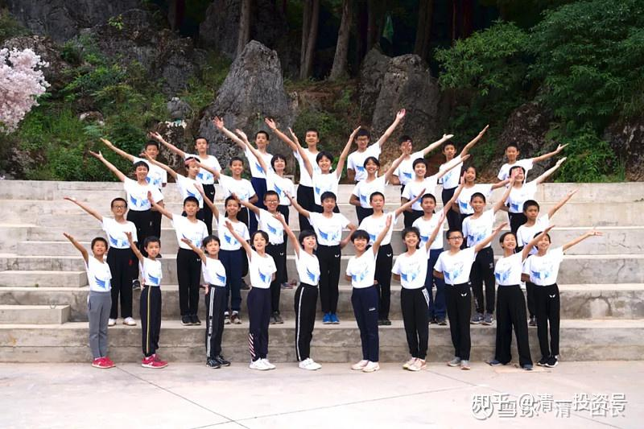

原雪球专栏73篇.判断一所企业，以及学堂好坏的标准！

[清一山长](http://link.zhihu.com/?target=https%3A//xueqiu.com/9310099567/column) 2020年7月16日

**标准一：不要去看广告和中介怎么说的**。说的很好，也是广告和中介的水平高，能力强，不是企业和学堂的水平高，能力强。要真的了解企业和学堂，**首要的标准**，是要去**看他们的用户满意度如何**。**对于学堂**，就是去**看家长的评价指标如何**。别当糊涂妈妈。

**标准二：**用户有可能有偏好，你自己也**需要真正了解企业的产品是否有竞争力**。**对于学校，**就是去**看学生的表现怎么样**。**如果这所学堂的学生状态，都是你很喜欢的样子，你孩子报名入学，今后也不会差的**。这段时间，我想让14岁的Ella去上泰国的大学，去见了好几家大学的副校长、招生官。老师们都很喜欢她，认为她的水平完全可以直接入大学。但小姑娘不想去上这些大学。因为她发现：校方带来交流的大三，甚至大四的泰语专业的大学生，语言交流能力不如她，精气神就更差了。她就想：“干嘛要来上这样的大学？干嘛要浪费时间？”我只好告诉她：这些大学，至少可以发文凭给她。跟我学，虽然学了本事，但没文凭，需要去外面上大学拿一个去。“注：这说明**连小孩子都知道要去看学生的状态，而不是看校方提供的招生资料和宣传品**”。

**标准三：看产品的技巧**，不是要去看企业的“旗舰产品”如何，而是看“低端品”的成色如何。有些企业，会亏本打造旗舰产品。但用于提供大众使用的产品，却乏善可陈。**看一个学校的学生，不仅仅要看顶尖的学生状态（当然，如果连顶尖的学生都很烂，其他就更没看头的了），更要看中等生，甚至差生的表现。**

我这一次，意外地看到国际今日一年制的突破班的40个学生，最差的一名学生家长的感言。最差的一个孩子，都可以在20天内，就完成一整部电影的英文台词熟练背诵加上表演。最后一名，都很喜欢学校。我就放心了：这所学堂，大概率会是一所还比较优秀的学校。不用担心老师们没教好学生。

**标准四：看员工是否愿意使用自己的产品**。员工都只用竞品的，你让客户怎么买你的？学堂也一样。老师是否愿意让自己的孩子，也去自己工作的学校上学？ELLA的父母，是一所有点名气的大学的老师。她父母的观点，就是宁肯她不上学，也不想她来上自己工作的大学。说上这个大学比不上学更糟糕。体制老师，都在谋划让自己的孩子去留学，不想留在国内。越是大学老师，越认为孩子可以不上国内的大学。你想过这为什么吗？

私塾也一样：十几年前，我认识一个号称是南师的弟子的人，上过电视台，是个海外博士，抱着文化追求的理想，回国开办了一所“传统文化学校”，说是只有中国的传统文化才值得学习。一时风云无两，很多相信上传统文化学校比上体制教育学校更好的南师的粉丝，都把孩子送到她的学校去了。不过，这个校长，她自己的孩子，却12岁就早早送去加拿大留学了。您说：这校长是真的喜欢“中国传统文化”，还是用这种口号来忽悠粉丝捞钱的？

我创办的学堂，到底怎么样？是骡子还是马？我说了不算，去看看家长们的反馈吧！我不认识这些家长，可能他们认识我。这些都是一年制的短期英语培训班的学生家长，对于一年后的结业总结反馈。这个班，现在已经结业了。家长们没必要故意讨好带班的老师。

微信[网页链接](http://link.zhihu.com/?target=https%3A//mp.weixin.qq.com/s%3F__biz%3DMzAxNzk5NjIzOA%3D%3D%26mid%3D2247489124%26idx%3D1%26sn%3Dd55a993e45facf79cd3d1ee4628e80a7%26chksm%3D9bdc56c5acabdfd3bda024df1ca4ec66f0ff4fd1744c29f0431b10b2b4d47fc428163f370d91%26mpshare%3D1%26scene%3D23%26srcid%3D0716pKTsLwFm88Y2fRJAAKjg%26sharer_sharetime%3D1594869498755%26sharer_shareid%3D050db6f1e8c336df4297f98986c95659%2523rd)：

[https://mp.weixin.qq.com/s/YMGaL5vQ9e01nobDhTXf_Q](http://link.zhihu.com/?target=https%3A//mp.weixin.qq.com/s/YMGaL5vQ9e01nobDhTXf_Q)

[【天才如何批量制造】——家长们眼中的新教育](http://link.zhihu.com/?target=https%3A//mp.weixin.qq.com/s/YMGaL5vQ9e01nobDhTXf_Q)

转——睿徽曾跟妈妈分享：之前梦想着能考上今日，现在一睡醒，发现自己已经在今日了！他说：“现在的学习生活实在是太美好了。在这里每一天都会给我带来动力，我会好好珍惜每一天。”

虽说是英语突破班，除了英语学习之外，睿徽这一年在阅读、独立思考、思维等能力上的提升也是很大的，更加可贵的是对至上的追求、心理行为、自我觉察、情绪管理方面的提升。还有剑道、邹家拳、五行拳、乒乓球、足球、篮球、垫上运动（他说他是3.0级别的）等运动，收获了更加健康的身心。有同学对他的评价是：天真、活泼。

**参考链接：**

**[这就是今日学堂](http://link.zhihu.com/?target=https%3A//space.bilibili.com/487498588/channel/series)**

**[2012年今日学堂](http://link.zhihu.com/?target=https%3A//www.bilibili.com/video/BV193411178W)**

[这就是今日学堂的明师荟](http://link.zhihu.com/?target=https%3A//space.bilibili.com/487498588/channel/collectiondetail%3Fsid%3D55359)