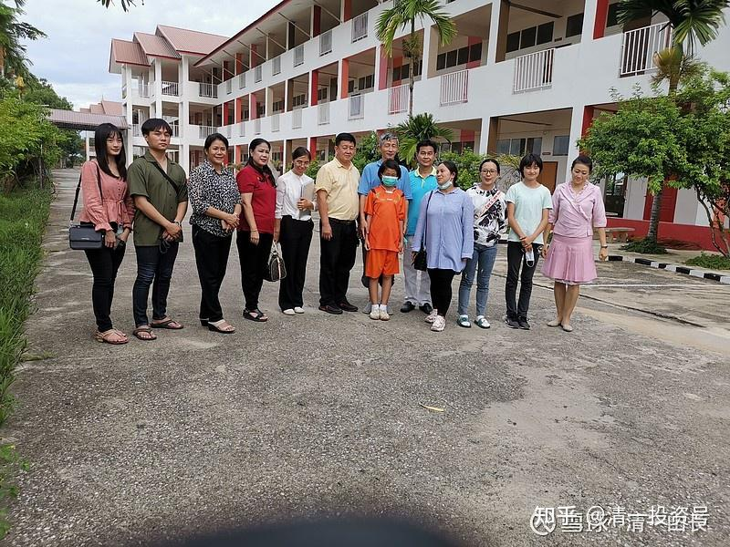

原雪球专栏75篇.[亲历者自述：两种教育模式下的教师与学生的区别](http://link.zhihu.com/?target=https%3A//xueqiu.com/9310099567/156480625)

[清一山长](http://link.zhihu.com/?target=https%3A//xueqiu.com/9310099567/column) 2020年8月12日

想了解体制教育，最好的方式，是从一个体制外，做教育的人的观察角度来看。体制内的学生和教师，时间长了，就是“身在庐山，不识庐山真面目”。所以，这是一个难得的观察角度，可以让更多的家长和教师们，反思和了解到底教育是什么？学校是什么？

推荐语“一个从小（5岁开始）就在新教育长大，从未去过体制的人，现在长大了，到了泰国的体制学校当老师。面对体制教育和新教育完全不同的教育模式，会擦出什么样的火花？她是否能适应体制的教学模式？是否能被学生接受？是否能成为一个受学生喜欢的老师？也许很多人充满了好奇，您想知道答案吗？”查看链接

微信[网页链接](file:///C:/%5CUsers%5Clenovo%5CDocuments%5C%E5%B1%B1%E9%95%BF%E4%B8%93%E6%A0%8F%E6%96%87%E7%AB%A0%5C%E7%BD%91%E9%A1%B5%E9%93%BE%E6%8E%A5)

[https://mp.weixin.qq.com/s/a-4u2FHxqAfaEjYh1zLCLA](http://link.zhihu.com/?target=https%3A//mp.weixin.qq.com/s/a-4u2FHxqAfaEjYh1zLCLA)

[体制教育下的人间失格——从未去过体制的今日学生去泰国学校当教师的体验](http://link.zhihu.com/?target=https%3A//mp.weixin.qq.com/s/a-4u2FHxqAfaEjYh1zLCLA)

事情的缘起，是今年，泰国一所中文学校缺老师，我们正好有学生在清迈，我就推荐了三个学生去义务救急，当当老师。她们都是从小在今日学堂学习的，都通三语（中英泰）。现在去当当教师，真涨了见识，原来别的学校是这样教，学生这样学的。也更珍惜自己的学习机会了。由于他们认为留在这个学校继续教没有意义，基本上无法真正的帮助学生。所以，剩下的两个学生，我最近也让她们回来了。虽然这个学校的校长，老师和学生都很欢迎她们。

家长好奇：原来今日还有5岁就入学的学生吗？这学生今年18岁，已经在学堂学习了13年了。现在的今日，早已不招5岁入学的学生了。现在只招收11岁以上的孩子申请入学，也不再办这种“不淘汰学生的长期班”。原因？很可笑，就是**没有经过体制学校洗礼的家长和孩子，其实不懂珍惜学习机会的**，我们觉得太浪费学习资源了。甚至还**有些消费者意识强的家长，会百般挑剔，有各种要求，甚至还会黑我们，他们真以为自己是上帝**。所以，我们后来就干脆停止了招收低龄儿童入学。虽然5岁入学，是教育的最佳时机。但现在11岁才有机会转学来新教育学习的学生，最大的好处就是：家长和学生都特别珍惜机会，来学习都表现特别良好，对老师和学校都很感恩。因为来学校一比较，就知道与原来的体制学校相比，差距实在太大了。所谓的“不怕不识货，就是货比货”。所以，**从小就在新教育成长的家长和孩子，不少属于“不识货”的，根本没在体制学校里面吃过亏，受过罪。我们把心都掏出来了，家长还不满意**，这这那那的。所以，从小招进来，好好教学生，也不是啥好事。起码对我们来说，不是好事。不如等学生和家长们，都知道吃了大亏之后，我们再接手“挽救教育”更好。

不过危险在于——这个是有时间窗口的。**根据经验，再晚两三年，到了14岁以后，基本上就废掉了。15岁以后再来新教育的学生，就是问题学生了。**要转变起来特别的难。我们也不收了。但偏偏15岁以上的家长，才是最想进入新教育的。为啥不早一点布局呢？非要见了棺材才落泪吗？

**评论回复：**

@礼敬回复清一山长：照片里三个最瘦的是自己人[笑]很好认。

清一山长[2020-08-12 19:07](http://link.zhihu.com/?target=https%3A//xueqiu.com/9310099567/156480625%3Fpage%3D1)回复@礼敬：在泰国生活的最大危险，就是容易变胖。因为泰国的食材很好，物产丰富。可惜泰国人的吃法，往往都是伤害身体的，味道可以做得很好。泰国人吃肉很厉害，肉食很便宜。一只烧鸡、卤鸡、烤鸡，大约120B泰铢；一份肉食，30B泰铢；一大块卤牛肉，大约相当与国内牛排量的两倍吧！60B泰铢。光这些就算了，国内也差不多。但泰国人甜食很好吃，加上天气热，吃冰；泰国人还喜欢烧烤。这四个东西（肉食、糖、冰、烧烤），全都是肥胖的诱因。所以泰国人比中国人胖得多。**中国人到泰国，如果采用泰国的生活方式，也一样的结果：必胖、必三高、必糖尿病！**其实，只要避免了这四条，在泰国随便吃，都不会胖。我们家就是，不限量的，但限制品种。**烧烤不能吃，冰水不能喝，糖尽量少吃，肉食基本不吃。**所以体型维持很不错，体力也很不错。这几天在泰国旅行，每天开一整天的车也没事。算是老天赐福。把**这些生活经验分享给大家，希望大家幸福长寿，还省钱！你把买肥胖的钱，减肥的钱，治病的钱，都用来买价值股票，长期持有，你就财务自由了。**

@空有无回复清一山长：我女儿6岁的时候，山长在青岛进行全国的巡讲！孩子听了山长的课，很是兴奋，也在心里种下了一颗新教育的种子！现在她已经进入了突破班的试读营！短短两周的时间，通过国际今日老师设计的运动课程、电影课程、财富游戏等！孩子了解到了人生各层次的生存状况！体会到了团队合作共赢高于个人优秀！意识到尽量减少为别人打工时间，想方设法增加自己的非工资收入，才能更快进入人生的快车道！她感觉自己的脑容量不断在扩容！孩子和我们分享学习内容，让我们一起体验，学习、总结！真的是感觉一人上学，全家受益！感恩山长！

清一山长2020-08-19 16:36回复@空有无：我就五年前去过一次青岛[笑]。孩子很喜欢，就说明孩子并不都是厌学的，是我们的体制学校教错了内容。这些大人都不知道的课程，要从小教给孩子。不过，这样教出来的孩子有个毛病——她就不想当打工仔了，这个不符合某些人设立学校的教育目标[笑]祝福你们一家吉祥如意[赞成]

@大股爱好者2回复清一山长：182CM？

清一山长2020-08-17 09:27回复@大股爱好者2：还算匹配[很赞]。我65KG，1.75CM。这个体重，心脏的负担不重[笑]

@大股爱好者2回复清一山长：[很赞]学习了！随着年龄增长加上遗传因素，国内一样容易长胖。去年5月体检93公斤，经过一年多“迈开腿，管住嘴”，降到了81公斤，还有几年60岁，除股市目标外，还有一个目标就是60岁前没有“三高”。

清一山长2020-08-17 09:04回复@大股爱好者2：80～90公斤，不知身高几何？正常看，这个重量超重了，建议**天天喝稀饭，自动清理体内垃圾**。

**参考链接：**

[这就是今日学堂](http://link.zhihu.com/?target=https%3A//space.bilibili.com/487498588/channel/series)

[2012年今日学堂](http://link.zhihu.com/?target=https%3A//www.bilibili.com/video/BV193411178W)

[这就是今日学堂的明师荟](http://link.zhihu.com/?target=https%3A//space.bilibili.com/487498588/channel/collectiondetail%3Fsid%3D55359)