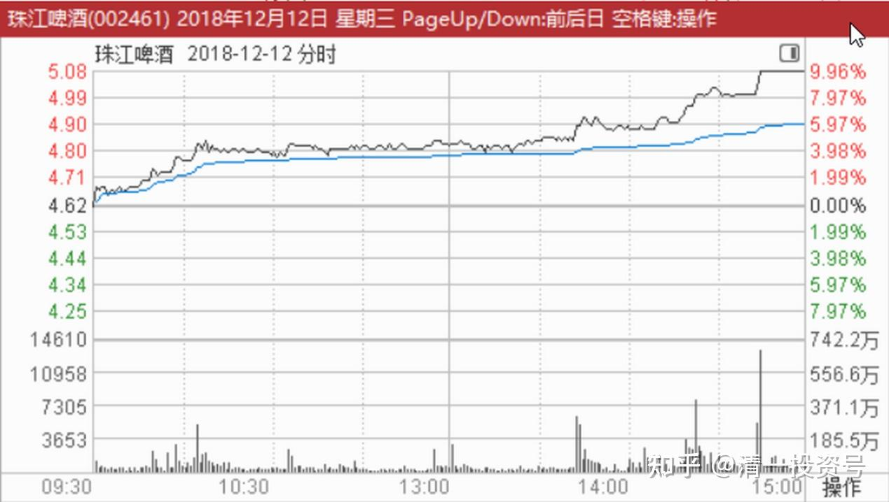
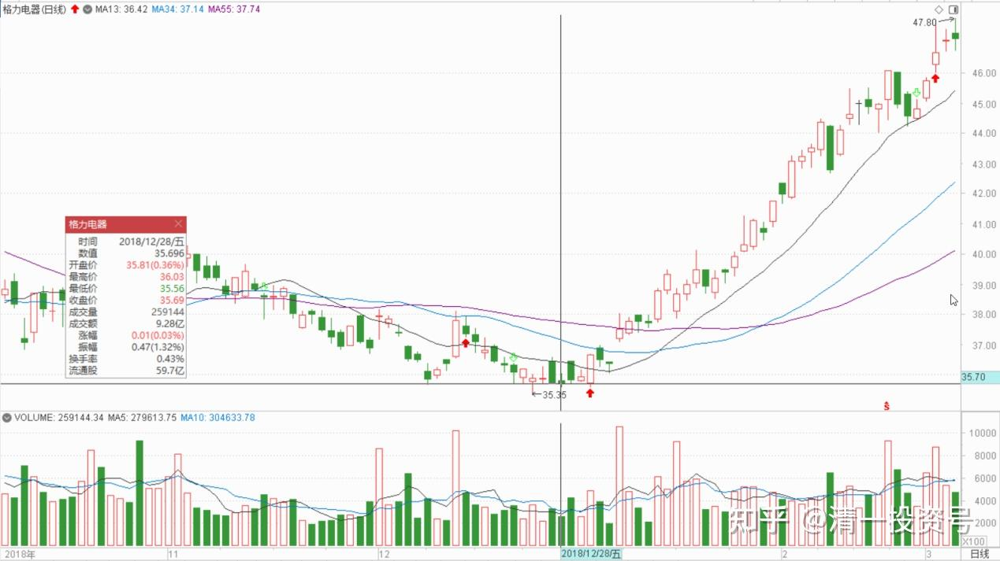
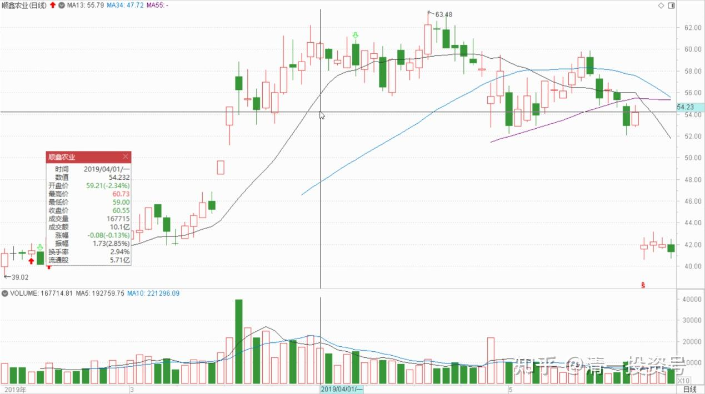
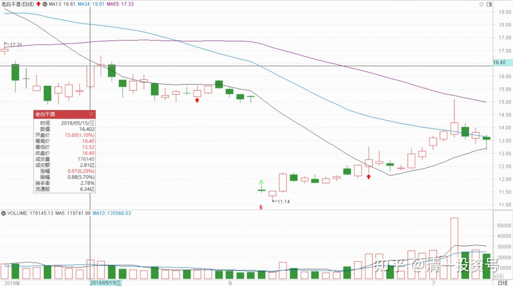
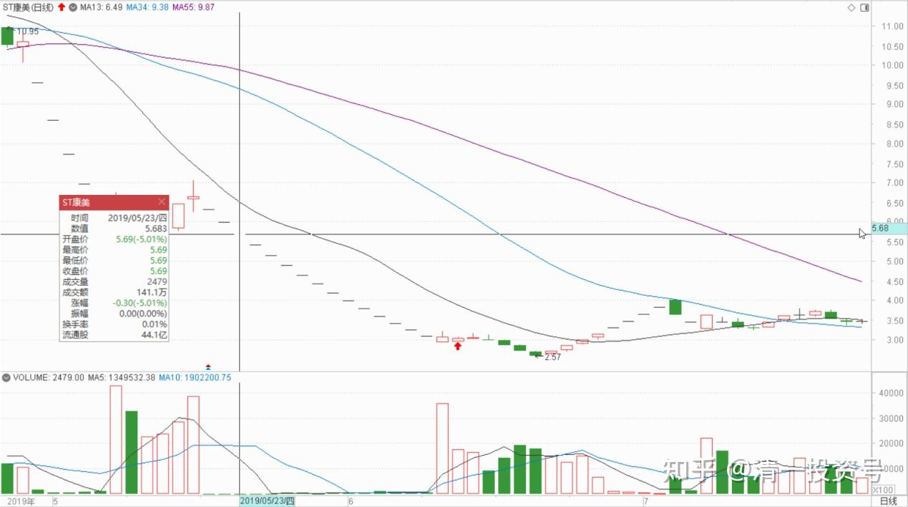

**

**

58篇.顺鑫农业记录六：最靠谱的投资方法就是不炒股

清一山长2018年12月～2019年5月

题记：清一山长2022年6月7日“大家可以参考顺鑫农业原来的走势，这就是“长庄股”的走法。我甚至有点怀疑，现在的**就是原来的顺鑫主力。当年这个顺鑫的老庄，也是恶心人恶心得要死的。把很多老手都熬垮了。很多人刚涨一点点就走了。我是中途进场的顺鑫，都被这庄傻熬了两年。幸亏后来守住了，结果还算不错。主升浪的钱赚到了，吃了鱼头和鱼身子。虽然最后的晚宴中，似乎鱼尾巴最好吃，但我们就别指望吃全了。”

**一、第二次卖出，第三次买入**

清一山长2018-12-12 22:37:01

$珠江啤酒(SZ002461)$刚刚才知道珠江涨停了。说实话，我很意外。珠江是我今年投资的一只黑天鹅，40元左右卖出的顺鑫等白酒资金，以及一路卖出的银行股，统统加到了珠江等啤酒股上了。却没想到一路加一路跌，弄得我后来都不看啤酒行情了。看着仓位我都吓了一跳——我今年怎么就变“酒鬼”了。怎么都想不到它会跌到四元，当然，也怎么都想不到今天它涨停。不过，跌也好，涨也好，都是资本市场的游戏。**我只记住一件事情：低价很难看，可我就是不卖股，只买。高价很好看，大家都心情好，可我就是不买票，只考虑如何卖票。**我承认庄家手段高，我就一笨猫，死脑子，看不懂涨跌。但我就认这个死理，我看主力再厉害，怎么才能弄死我？[大笑] [大笑]

清一山长2018-12-12 23:32:35

提醒大家一下：今天虽然涨停了，**但目前股价，依然低于主力的平均买入价。**大致上，至少还需要一个涨停，主力才会“回本”，但主力的意图，显然不是回本。是多少我也不知道。我只知道，再拉一个涨停，我也不想卖股的。除非比价效应导致我认为珠江高估。目前看没有这种情况。今天的成交其实量并不大，所以盘口并不重，拉升的空间，全看主力的愿望了。

清一山长2018-12-28 15:29:39

$中国人保(SH601319)$今天是A股本年度最后一天。为了表达对A股市场20多年来对我的关照的谢意，我准备今天主动买套，主动买入年末不断下跌的股票。原计划买上几十万股中国人保H，至少把从人保上赚的利润部分用掉，用实际行动来支持人保。主要是因为我在人保冲7元时候提醒大家小心人保高位风险的发言，惹来了某大神一群粉丝的不高兴，一群人集体跑过来谩骂一气。我今天看这些人，虽然嘴巴上赢了（我承认吵不赢这群人），但显然他们的账户输掉了。我担心他们过于生气影响健康，怪我看空人保不好。所以今天打算用实际行动来看多人保，是否能够挽回跌势，就不知道了[大笑]。所以挂单买进几十万股人保H，可是居然港股通今天不通，只好算了。人保A嘛，虽然跌得也很惨，但我还没有胆子去下手买。结果只好用这笔资金买了几万股格力电器，35元多的价格（这是我首次买入格力）。**另外再买了几万股顺鑫农业，31元多的价格买入（不久前刚刚第二次卖出顺鑫，现在是第三次买入）。**

2019，我将悔过自新，把2018年卖卖卖的净卖出坏习惯改过来，改为买买买的净买入。买完后就装死，死也不割肉！就等解放军来解救的一天[大笑]！

**二、敬畏市场防范黑天鹅**

(本段内容与[59篇.分散投资与防守投资策略——永远做好自己错了的准备](https://zhuanlan.zhihu.com/p/549611102)，标题三重复，为保持顺鑫系列完整性，仍保留于此文稿中，介意者可自行跳过）

[云蒙](http://link.zhihu.com/?target=https%3A//xueqiu.com/3037882447)[2018-12-29 10:37](http://link.zhihu.com/?target=https%3A//xueqiu.com/3037882447/119057166)

[https://xueqiu.com/3037882447/119057166](http://link.zhihu.com/?target=https%3A//xueqiu.com/3037882447/119057166)

2018年压力确实很大，很多时候都睡不太好，辞职创业前财务自由的300万美元已缩水只有100来万，盈透证券推广业务也大幅下滑，各方面都低迷到了冰点。

2019年也确实值得期待，不少银行股的估值比历史最低估值还要低20%多，一些银行的市净率跌破0.5倍，市盈率低于4倍，股息率超过6%，这从实业角度看是无法理解的，只要熬下去一定会有美好的未来。

清一山长2019-01-01 15:19:53评论上贴：

账面涨跌，只是金融市场的波动和噪音，不必过于在意。关键要通过一些失败的投资，看清自己的投资逻辑。赚钱不一定是我们的投资逻辑是正确的，可能只是因为运气更好罢了。如果不正常的赔钱，一定是自己做错了什么，需要修改自己的投资模式。在心态上，我们可以为失去的200万心痛，也可以为留下的100万而庆幸！可以永远看到积极的一面。

**金融市场，最需要防范的就是黑天鹅，我们认为“不可能，不应该，市场怎么能这样估值”的事情，总会出现的。**如果连巴菲特都无法避免看错股票，我们看错的可能性就更多了。所以，我们需要做的，并不是让自己成为不犯错误的股神（我认为这是不可能的），而是让自己的错误，不会遭受过大的打击，不会让自己站不起来。**如果随时抱有“黑天鹅”的心态，对每一笔“我相信结果很好”的投资，都抱有‘万一我错了怎么办”的“不自信”，所以我一定会分散投资，防止错误吞灭了我25年的成果。**这种模式，会让我“失去”很多机会，比如明明看多3元的恒大，4元的融创，但收获并不很多，因为我没有全仓介入。2018年的顺鑫，我也没有全仓，否则2018年账面会很漂亮。但是，也正因为我的分散，所以一些地雷的引爆，也不可能让我“伤重不起”。**投资之路，不是看某一年的大赚或者大亏，而是要比谁活得长。**这就是我股市生存25年最重要的经验。**短期大赚的人其实很多，一年十倍的人也不稀奇。但活得长的人很少，我希望是后者。用巴菲特的话说，就是慢慢的变富。**

一旦做好了安全措施，我们就不会为某些股票“就是该涨不涨"而叹息，也不会为自己的持仓安排而忧虑得睡不着觉。2015年股灾，我持仓仅仅一天的“损失”，就超过千万。但因早已卸掉杠杆，照样睡得很好，因为一股也没少。我没觉得有啥不正常的。原来赚了钱，现在回撤一些也很正常。庆幸当时重仓的是银行股，所以股灾中最先恢复，而且跌势中用融资额度买进，赚了30%就走掉，不贪心想多赚。所以2015年的整体计算，不但与5000点的高位相比没损失，反而多赚了一些。但当年周围很多惊慌失措，乱操作的朋友，造成了永久的损失。甚至一些人失去了东山再起的机会。

云蒙是一个非常专注和认真，对自己的投资品“感情很深”的投资者。这是优点，可能也是缺点，所谓的祸福同源。原来七年对招商的专注和热情，收来了大赚的结果。2018年对民生和华融的专情，带来了亏损。所以，专注很好，相信自己的投资品也很好。**但永远要敬畏市场，要随时防范市场的黑天鹅。巴菲特的不上杠杠，本质上就是无论是企业的黑天鹅还是市场的发疯，都无法击垮他。是防守的投资策略。**进取很好，但进取错了，也会遭遇难以预计的损失。我虽然用杠杆，但用的时候很小心，最怕被意外影响。一旦有风吹草动就赶快卸掉杠杠。

前瞻2019，我并不乐观，我不想说“新年大家都多多赚钱”这种虚话。我目前依然拥有很多仓位，准备陪市场浮动。但我总觉得2019，可能出现更多的黑天鹅。**所以，我也会留一些子弹，等待“大象出现的时候”才开枪射击。因为我无法预测市场，所以我要留下足够的安全通道。我在等待市场最悲观的时刻，也在等待“意外的惊喜”。**希望以我这些入市25年的“投资老马”的经验之谈，帮助到一些入市时间不长的朋友。如果你们不嫌弃我的老经验“过时”的话，就拿去不谢[笑]。

**三、涨多的卖一点，没涨的买一点，让安全度高一点**

清一山长2019-04-01 10:14:15

$上证指数(SH000001)$春节后，我只打开过两次账户。节后资产浮盈的大量增加，没有让我很兴奋。就像是节前的半年，账户总资产额度的慢慢下滑，也没有影响我心情一样。因为我账上资产，按照我的算法，是一股没多，也一股没少。没啥好高兴和不高兴的。

如我所料：现在白酒起来了。我今天准备卖掉一些。顺鑫创新高，超过60元了，挺好的，感谢顺鑫，为我创造了白酒业第一个赚8位数利润的股票。酒业的第二个记录，应该就是珠江啤酒了，这个八位数利润，来得有点慢。不过目前来看，显然是一笔不算太成功的投资。如果把这笔资金，继续留在顺鑫上面，31元的时候继续买入全部的顺鑫，赚到的钱会更多一些。我重新买回的数量，看来还是太小了。当然，我就这个命了。胆小的人，发不了大财，也亏不了大本。

这两天的大盘，让我很不安。因为涨太快了，应该不符合正常的走势。快牛会让中央政府不愉快的，会被金融利益集团收割的。所以——我还是小心一点。本周我正好有空，我就来打理一下账户吧！该收的庄稼，就收一点；该种的种子，就种一点。现在当然不宜空仓，但似乎也不敢满仓满融的干。我胆小！**把涨多了的卖掉一点，把没涨的买一点进来。这样安全度高一点，股票也可以多一点。**

我觉得：也许我想要的“中国资本利润”，会比我原来预想的快一点到来。但如果真的来了，我也该比较长期一点的时段，要远离中国金融市场了。我预期这个暂时分别的时间，是明年，最好是后年。我可不希望今年一年就把行情走完了。真的走完了，就很多年就没得玩了。

清一山长2019-05-15 16:02:37

$老白干酒(SH600559)$昨天都还在努力加仓中，今天就失去机会了。15元多真心不贵。丰联的并购很成功，难得。最近几年的复合成长也很稳。**在别人不看好，坏消息连天的时候，正是买入的时候。补回我卖掉老窖和顺鑫的白酒股仓位。**在中国做投资，家里没点白酒总觉得不踏实[大笑]。

老白干技术分析：从20元的平台跌下来颇不寻常。太刻意了。加上季报我认为有隐藏利润的痕迹，所以跌到15元多的平台，我就开始建仓并不断买入了，目前是白酒仓位前三名了。感谢本次下跌给我的补仓机会。

**四、只买价格在庄家成本线附近，甚至以下的股票**

清一山长2019-05-23 21:05:18

$ST康美(SH600518)$这个公司的300亿到何处去了——居然是去用来坐庄，偷偷炒自己的股炒炒亏掉了。这故事真好玩。——说实话：一年多前有朋友告诉我该股多么有潜力，未来前景如何好之类的，还告诉我身边的一些老板，都集体“悄悄潜伏”进去了，特别看好它的未来。我打开K线，看了一眼之后就直接放弃掉了，我连多研究一下的兴趣都没有——一只已经从2014年涨了三倍的股票，你还告诉我多么有潜力？我把基本面抛开不谈，我想的担忧就是：万一这个股是有托儿的，是忽悠人的（因为一看就知道，这个股肯定有庄的，我相信我还是看得出这点来的）。它当然有可能继续涨。但是，万一庄家想用这个价卖给市场（当时它已经账面上赚死了），可我这种新买入者咋办？结论是没办法。现在事实说明。当时来忽悠好朋友买股的人，就是已经被庄家“绝密内幕消息”忽悠的人。相信内幕消息，不如相信盘面语言。

**所以，我的投资原则，是绝对不追高，绝对不要成为庄家的牺牲品，我只买价格在庄家成本线附近，甚至以下的股票，（比如顺鑫，这个庄其实是很恶心的庄，德行很不好。它是很有耐心的，花了两年多时间来做盘，整人手法一流。**我19元买入都吃套，拿了一年多也只能坐电梯，摆出一副完全与白酒股涨跌无关的样子，甚至还打到16元去，吓走了很多散户。**但我相信我拿货的价格，跟庄家的成本是差不多的，所以我就不怕，稳稳地坐在车上不动，最后的一点顺鑫，是60元卖掉的。**这时候，已经涨了三倍的顺鑫，无论是谁来吹它未来多么有潜力，我都是死也不再进场的——我宁肯错过，也不愿做错。它涨到100元，也跟我无关了。账上留上几手，做做纪念既可以了。我宁肯去买十年也不涨的黄酒，愿意再等十年，也不要去买这些高大上的名酒了。起码我知道现在的价格，庄家也是不赚钱的。我就敢买了。

其实坐庄真的很可怜，很不容易的，并不是大家想象的，坐庄就一定赚——很多庄，操盘手法不好，常常不小心就被老鼠仓吃了（我相信康美的老鼠，一定超级多，300亿的集体大餐喔！很多老鼠一起吃才吃的完的），被散户吃了**。跟庄有技巧的，只能跟悄悄低位入场的庄，别去跟高位起舞作秀的庄。**20多元的康美，几乎是路人皆知的“好股”,很多大V在推的好股，你居然还用真金白银去跟庄，你就太傻了。

看不懂K线，看不懂庄怎么办？一句话，价值投资去。买个靠谱的股票，睡觉去，就行了。其实最简单。**巴菲特、段永平的炒股方法，是最靠谱的投资方法，就是不炒股！**

（标题为编者所加）

参考链接：

[清一投资号：29篇.2021年评顺鑫](https://zhuanlan.zhihu.com/p/498221415)（整理文）

[清一投资号：44篇.顺鑫农业记录一：开始关注买入](https://zhuanlan.zhihu.com/p/539035593)（整理文）

[清一投资号：46篇.顺鑫农业记录二：最多输时间不输钱](https://zhuanlan.zhihu.com/p/539203562)（整理文）

[清一投资号：49篇.顺鑫农业记录三：买、卖、拿住股票的理由](https://zhuanlan.zhihu.com/p/543704521)（整理文）

[清一投资号：51篇.顺鑫农业记录四：主力还没有开始减仓](https://zhuanlan.zhihu.com/p/544147559)（整理文）

[清一投资号：53篇.顺鑫农业记录五：中国炒股最重要的技术是保本](https://zhuanlan.zhihu.com/p/544149372)（整理文）

[清一投资号：61篇.顺鑫农业记录七——机构坐庄三招：养、套、杀](https://zhuanlan.zhihu.com/p/556331421)（整理文）

[清一投资号：65篇.顺鑫农业记录八：基本面的估值修复和主力技术面的空间](https://zhuanlan.zhihu.com/p/560419930)（整理文）

