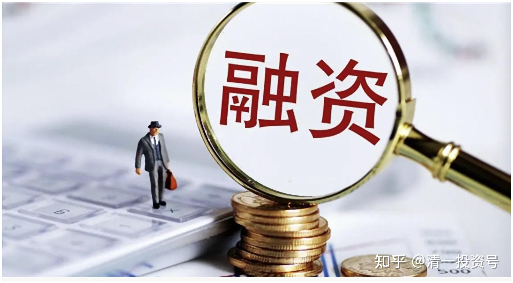

5篇.融资买股真的是禁区吗？经济变局中的投资策略

清一山长 2014年7月24日

今天中午上课回来，打开证劵行情，发现大盘没涨多少，但是我的市值却获得了“爆发式增长”，录得我入市20余年来的最大单日增幅（账面盈利）。原因主要是我买的十来个个股居然都在普涨，基本上涨幅都明显大于大盘。另外，也由于我大幅度融资买股，融资比例一度超过原始资金（因为证劵公司给了我比我的总资产更多的额度）。因此可用资金总额相对增大了很多，一旦上涨，自然录得相对较为可观的利润（当然，只是浮盈）。

**正常情况下，借钱炒股是很危险的。巴菲特的一再告诫就是：千万不要借钱买股。我不但借了，而且还借得这么多，实在是疯了。**

**我敢借这么多，是有底的。**

**第一是：我用了保证金——购入了廉价的一些跌不动的可转债，以及分散不同的行业（不死看好一个行业，防止单边行情），作为“防爆仓的防火墙”，避免股市意外下跌后被“爆仓”。这是绝对要防止出现的事情。**

**另外，我融资买入的股票，全都是“地板价”，而且在安全边际范围内。也就是说，每年这些个股的分红，都在6%～7%左右。而且，这些股都有稳定可靠的业绩，十年来分红很稳定。**我相信今后的十年，他们也一样可以稳定经营。因此，我的如意算盘是：如果继续下跌，我就死也不卖出。死心眼拿着等分红，等十年也可以。这样每年8.6%的融资利息，我最多每年亏2～3%。这个是我能够轻松承受的风险范围。而且，这些股最大的好处，就是不可能跌50%让我爆仓——因为一旦实现了这个跌幅，我选择的个股，就将有12%～15%的分红了——别人不要这些股，连银行自己都要进来抢这种股票了。另外很多企业大股东，自己都要大举回购股票了（实际上我有多只类似股票的买入价格，都低于大股东回购或增发的价格。我认为这是“足够的安全边际”）

连证劵公司的老总，看了我的融资标的后，都说：你这种玩法保险系数超高，不可能亏本的。因此，我申请“扩容”的时候，两次他们都给了我超过我资产值一定比例的融资额度。使得前段时间下跌趋势中，我拥有较大的资金“放手去买地板价股”，这也是这段时间账户上涨较佳的原因。经过短暂的盘面“绿色期”之后，目前我的账户一大片红色，的确很好看。

经过谨慎选择标的，锁定风险以后，剩下的就是“赚多赚少”的问题了——只要一年个股有一次上涨15%的机会，就算最终跌下来，我也一定会赚钱。因为我会**在上涨的过程中，选择机会，分批卖出融资的仓位部分**（主仓位我是长期投资的标的，不到过分高估的情况下是坚决不卖的）。因此，一旦上涨后就逐步卖出融资部分的标的。之后，如果持续上涨，我就不管他，留下不卖出的“底仓”部分跟涨。或者选择其他低估在地板的其他低风险个股买入。如果上涨后居然又跌回来了，我就重新买入该股，正好做差价，摊低持股成本。

另外，**绝对禁止自己在股市上涨之后用融资额度追涨。**我严格限制融资额度，**仅限于下跌出价值坑的时候介入，且在上涨过程中逐步释放融资**。**简单一点：融资就是预备队，绝不轻易使用，是最后弹尽粮绝的时候出奇兵用的。**

**更简单一点说：我用融资额度部分来“投机”，用本金部分来投资。**这样，一旦出现大牛市，个股连续上涨，我绝对不会踏空。就算不幸遇到大熊市，我也能轻松承受。一旦出现目前这样的“牛皮市”，我这一招就特别管用了。事实上，这半年来在2000点不断浮动的牛皮市，让很多股民以及价值投资者都感到恼火，我却利用证劵公司提供的额度赚了不少钱。特别是在前段时间，兴业银行起伏很大，我就利用融资额度“上下其手”，使得持仓成本不断下降，加上分红带来的好处，虽然该股的持仓量较大，但持仓成本最后弄到只有8元多一点点。因此，今天的兴业等，突破10元的价格，自然录得良好的业绩。如果该股死死地持有不动，很多人应该至今都赚不到钱的。这就是死认巴菲特道理的“价值投资者”，有时候会令人“很受伤”的原因——上上下下的电梯做了很多次，结果账面依然是绿色的。

**最终的结论：规则不是死的，而是活的。特别是在中国这样的不正常的市场，需要更灵活的投资思维来应对。**也许，在下一期的【新财富课程】中，可以把“融资投资心理和战略策略”也给学员讲一讲，让学员们有机会利用中国金融市场提供的绝佳机会，获得最大的财富效应。

附注：本文所提的标的，是本人实际操作心得，不够成投资建议。据此操作，风险自负。

另外，上文中所说的【华电国际】，我已经在获利31%后，在3.81元上方成功撤出，只留下成本是负数的十几万股底仓（怎么都爆不了仓啦），其他的都换入某低估的能源电力类股票。这是我的“跨品种套利”锁定利润的思维模式。因为我认为华电的非正常上涨，是因为集团公司想要增发H股人为拉升的结果，未必是正常的估值恢复行情，不排除后期增发成功后可能的下跌。（比如，光大银行增发港股成功后，主力不再护盘，下跌幅度颇深，早期进入者吃亏不少）

因此，特别提醒想要跟风买进【华电国际】的人，不要以为乱听消息、高位跟风就能成功炒股。我不支持追涨，也不支持杀跌。本文写作的目的，是提供给大家思考的。希望通过我的实证操作，提高各位面对金融市场风险的能力（而不是提供炒股消息）。

参考链接：

[清一投资号：32篇.中国中车：敢于融资持有](https://zhuanlan.zhihu.com/p/508326510)（整理文）

[清一投资号：51篇.使用融资先要确保不爆仓](https://zhuanlan.zhihu.com/p/541118486)（整理文）

[清一投资号：10篇.非高手不要玩融资——山长对话HIS1963](https://zhuanlan.zhihu.com/p/544384751)（整理文）

