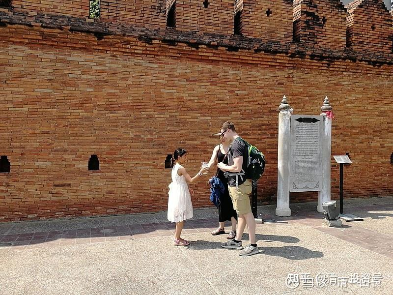

[原雪球专栏](https://zhuanlan.zhihu.com/p/547312901/edit)[83篇.小女和伙伴自己制作MTV，剧透了我家的内景！](http://link.zhihu.com/?target=https%3A//xueqiu.com/9310099567/162732288)

[清一山长](http://link.zhihu.com/?target=https%3A//xueqiu.com/9310099567/column) 2020年11月7日

MTV 哔哩哔哩[网页链接](http://link.zhihu.com/?target=https%3A//www.bilibili.com/video/BV13K411P7vf/)：

[https://www.bilibili.com/video/BV13K411P7vf/](http://link.zhihu.com/?target=https%3A//www.bilibili.com/video/BV13K411P7vf/)

我认为：**最好的教育，就是陪孩子慢慢地成长！别把孩子当知识流水线上的机器。**小女这两年都没去学校上学，即使是我认为中国最好的学校——我自办的今日学堂也没上。两年多前，为了让她补上汉语课程，我把她从学校接回家，就一直呆到现在，每天跟小伙伴一起上“家塾”。小女每天乐不思蜀的，一点也不想去学校。但不是在家跟我玩，而是每天都有学习、锻炼的任务，还要与正在学校的同龄学生比赛学习成果。所以，还是有压力的。我对她的威胁是：在家如果不好好学习锻炼，就要把她送到学校去寄宿生活。

她在我身边，并不需要按照课程表来学，甚至不需要老师。她**只要把每天的时间都充满就行了，不许偷懒混日子。学习社会和生活课，是最重要的。**原来没有疫情的时候，周末会送她去古城，与外国人交流、聊天。这几天，为了让她强化泰语学习，我让她看了中文书《富人是怎么想的》(How Rich People Think)，然后自己翻译成泰语，当故事讲给泰国人听，锻炼她的翻译和词汇表达能力。不懂的，就查双语字典去。让她在用中学，学中用，双语同时提高。她已经让泰国人以为她就是本国人了。最近两天，她和小伙伴拍了一个MTV，唱泰语歌曲。我说可以放到网上去，让正在学三语的同学们跟着一起学学唱歌玩。这都是两女孩自己制作，自己编排剧情，自己配音的，当做锻炼了。没人当她们的导演和编辑，都自己整的，前天晚上还申请了晚睡（因为我的规则是不许熬夜）。

哔哩哔哩[网页链接](http://link.zhihu.com/?target=https%3A//www.bilibili.com/video/BV13K411P7vf/)：

[【泰语班】Mlog#1-Ella&Moana首次唱泰语歌“月亮的愿望”](http://link.zhihu.com/?target=https%3A//www.bilibili.com/video/BV13K411P7vf/)

[https://www.bilibili.com/video/BV13K411P7vf/](http://link.zhihu.com/?target=https%3A//www.bilibili.com/video/BV13K411P7vf/)

上面这个链接，剧透了我家的内景。孩子们每天大门不出，二门不迈。为啥？院子里面足够她们玩了，总占地有20多亩，里面啥设施都有。散步都不需要外出（MTV最后镜头中，两女孩远去的镜头，就是我们晚饭后，喜欢去走走的环形车道。院子的大门，就在你们能够看到的尽头处）。

小女很享受现在这种学习方式，跟学校里面规划好课程，像机器一样学习比要好得多。这就是**真正的教育——陪伴式成长**。她在我身边，会参与社交、做事、读书，在自己安排的学习中，自自然然就长大了。给她的未来计划，是18岁要去上大学，要求必须去四个国家的四所顶级大学学习，四年内，拿回四个大学的毕业文凭（最多可以延期一年），必须当学霸。这有得她忙的了。也许她可以在大学里找到她的另一半。但她上大学显然不是为了去找工作的。**她是从小就财务自由的一代，不需要为了生活而去学习和工作，她只需要为了自己的理想和爱好去学习和工作。她的理想，是将来要去当一个好教师**。现在就在实习中——她和小伙伴，每周都去一家中国上市公司的海外分部，教项目经理们学泰语。想想就觉得有趣——她的学生，都是985大学的优等生，都是海外的中方项目经理！成年人。是这家公司的总经理邀请她们去的。对方的反馈很好，说她们教学比泰国教师教的好多了，很实用。连帮他们做饭的泰国阿姨都说：孩子们教得很好，因为这群经理原来来吃饭时，都不跟她说话的，现在会用泰语跟她打招呼，简单交流一下。因为我们的孩子，直接教他们使用泰语，不是学泰语语法词汇啥的。玩泰语语言学，那是学究搞的事情。

**评论回复：**

[@求知路上70](http://link.zhihu.com/?target=https%3A//xueqiu.com/8779600056)回复清一山长：看了视频，小明慧又长大了，有了小公主的模样了。视频能根据歌曲歌词设计场景和故事，也知道了摄影的构图和运镜的技术，知道运用空镜头转场，知道运用故事和场景来渲染气氛。有当导演的潜质。这是山长思维训练的成果啊！

清一山长2020-11-07 20:36回复[@求知路上70](http://link.zhihu.com/?target=https%3A//xueqiu.com/8779600056)：你说的的技术，我都不知道[笑]。所以不是我教的。但视频剪辑、故事编排，的确是孩子们自己去玩的。估计是孩子们上我们学校的电影表演课，上多了，自己去模仿的导演手法吧？我想她们自己也不知道你说的这些概念（空镜头、转场等）。有时候，带他们的**老师不需要懂太多知识，只是提供一个良好的生活和环境，就自动学会了。**

**参考链接：**

[清一投资号：7篇.为何要让孩子在12岁前就深度掌握四国语言？](https://zhuanlan.zhihu.com/p/535444843)

[清一投资号：15篇.九岁才开始学中文，来得及吗？](https://zhuanlan.zhihu.com/p/537104507)

[清一投资号：30篇.四年读完四所大学，四个专业？我女儿的新教育规划](https://zhuanlan.zhihu.com/p/541457282)

[清一投资号：33篇.家长为啥每天都要给孩子吃](https://zhuanlan.zhihu.com/p/543096364)

[清一投资号：35篇.在泰国送口罩和中药给当地人](https://zhuanlan.zhihu.com/p/543135963)

[清一投资号：39篇.值得所有家长看的纪录片：反省吧，家长们！](https://zhuanlan.zhihu.com/p/545526875)

[清一投资号：43篇.祝你生日快乐！这碗世界最毒的鸡汤！](https://zhuanlan.zhihu.com/p/546933251)

[清一投资号：45篇.小女开始赚泰国人钱了：收天价学费！](https://zhuanlan.zhihu.com/p/546934508)