**以下这篇1万多评论的热文，正好是我上一文的对比版。说明我不想重复这个家长的教育道路极为明智**：花16年的时间。只学到了考试的功夫，以及一张不值钱的嘴皮子。去读完一个根本就本来不需要费力的大学，没有去发展更重要的能力。你大学毕业后，你得到就是一个连普通人都比不过的“废物”，“害虫”，当代孔乙己。也许：只有家长自己早早死了，这孩子还有可能走出来，独自自强之路。否则，如我的一个叔叔辈的人一样，坚持顽强地顶着自己「不死之身」，拼命照顾自己“长不大的儿子”，现在他这儿子，快50了。这对老夫妻，也快80了。一对老人现在到处“托孤”---找能干的子侄辈“接手照顾他儿子”。可是谁会傻到去接一个爹回来养着呀？这世界人虽然多，但除父母之外，没人会这么愚昧致死的。这儿子，除了父母也没有任何人缘了，也算一个奇葩！这就是中国父母养出来的灾难！我总想: 他们家的孩子20岁的时候，这对老人就被车撞死了。说不定这孩子也被逼着成器了。现在50岁，突然没有照顾了，他怎样自强？还是流浪街头？恐怕他连有点骨气，跟随父母一起自杀的勇气都没有。所以，害这孩子一生成为无用废物的人，就是这对无限付出的父母。

[今日头条](http://link.zhihu.com/?target=https%3A//www.toutiao.com/article/7125233095707558433/%3Fapp%3Dnews_article%26timestamp%3D1659275441%26use_new_style%3D1%26req_id%3D2022073121504101021005413506891C8D%26group_id%3D7125233095707558433%26share_token%3D59E326A2-967C-4D55-8B64-2796F1EA91C0%26tt_from%3Dweixin_moments%26utm_source%3Dweixin_moments%26utm_medium%3Dtoutiao_ios%26utm_campaign%3Dclient_share%26wxshare_count%3D6%26source%3Dm_redirect%26wid%3D1659340471985)

这篇文章，评论就有1.1万。可见反馈了家长们的”心声“。家长如果真的以为【考大学】就是自家孩子旅程的终点，出现这样的局面，也毫不为怪。如果你同意新教育的基本原则，你会把更多的时间和精力。用于”会做事，会做人“的行为教育上。这样，就算考不上大学，也起码不是没用的废物。起码可以自食其力。也许，更多的家长，要吃了大亏之后，才知道悔改，才知道学习新教育，是拯救自己家庭的未来。

山长 清一 15:45:49

今年的试读营，今天刚刚开启。本年度特别开启了开营前的【网络面试】过程。通知面试，大约20%的报名者被拒绝了入营要求。居然还有一些小白，根本不知道父母为他们抱这个名是啥用意？以为就是来旅游玩新鲜呢。真有这种愚昧的家长，自己在家做好人，让我们来做坏人。把他家的孩子自动训练好？我们才不背锅呢。所以：经过面试，超过20%的申请者被拒绝入营。我们不缺你的营费，但你缺心眼[表情]。浪费宝贵的机会，家长居然一点都不作为。

山长 清一 15:50:51

试读营，没有设置【打屁股】环节。因为：一个月试读之后，超过一半的人都留不下来。没被选上的学生，肯定就是最大的“打脸”。我们是有意设置的放弃家长的严厉手段管教。因为我们要通过更自然的环境，在看起来没有“打屁股”这种很现实的压力下，哪一些孩子，会关注更长远的目标----一个月之后的考评结果来行动，因为会表现更良好。这些“更有心”的学生，就会被我们选进来。而没有现实的打屁股压力就划水的孩子，自然就被淘汰掉了。这就是精英教育的目标——由于学位有限，我们只提供给少数有内在控制力的学生获得机会。当然——入校之后，我们会应家长的请求，开启家长来校跟踪孩子状况的【打屁股工程】。因为：如果你现在不打孩子的屁股，孩子将来会无情地打你的脸，伤你的心！不如家长们在孩子还小的时候“先打为敬”！

我在泰国，带四个公主们干啥呢？最重要的任务就是运动，训练。以及做事，做人。我认为生活就是教育。昨天，带孩子们去跟一个泰国的森林管理人员，原来打过泰拳职业赛的老人做做社交。同时几个人一起去森林里面去捡蘑菇。孩子们学到的就是：这些泰国人的生存能力好强。会自己做很多工具，简单有效。还有很多考验人的玩法，很动脑子的。这就是教育---生活教育。比读书重要多了！危急时刻，动乱世界中，这些普通人的生存能力显然比什么大学生研究生更强。读书人，也就是在和平时代的美好环境中，可以做一个符合工业化社会要求的打工仔罢了。

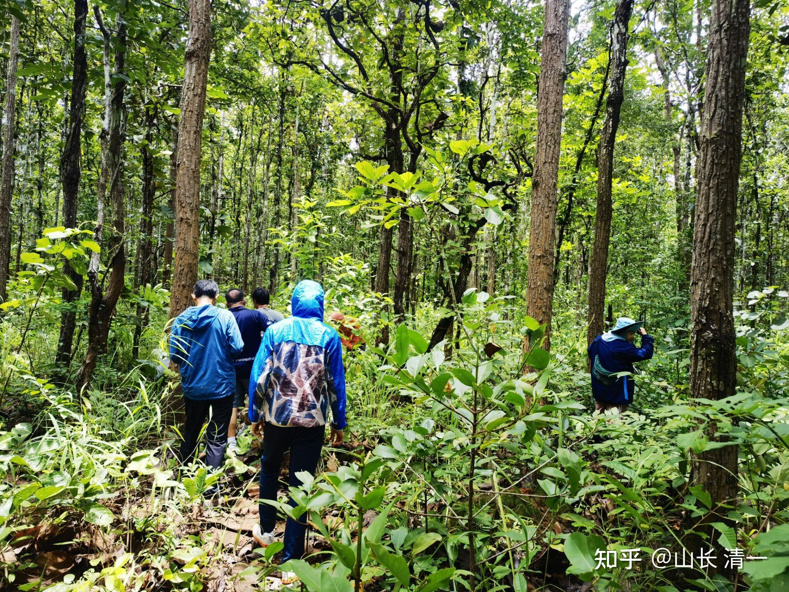

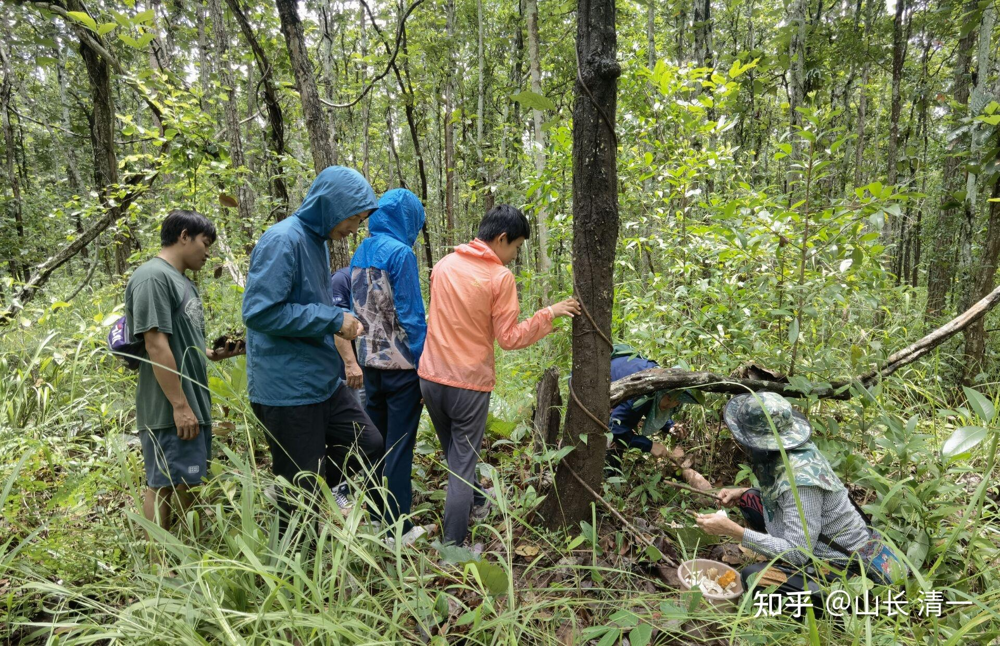

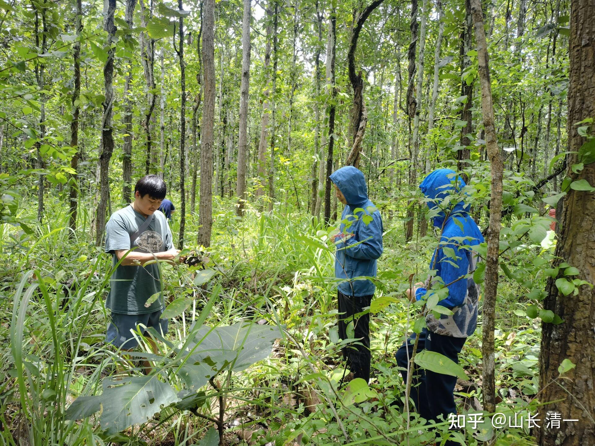

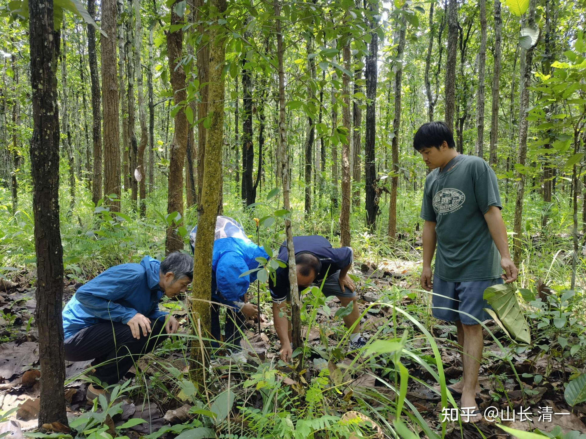

我们在研究一群白蚁的“集体震动”。很有节奏感的集体振动。艾拉小公主，认为是蚂蚁走在叶子上发出的声音。我说是蚂蚁发“整体力”出现的声音。还告诉她们：这种方式，非常消耗力量，所以它们会逐渐减弱。果然，刚开始非常整齐，威猛的声音，在我们的挑逗下，越来越小声。最后蚂蚁累惨了，就不管我们了，不再发出“威胁声音”了。我让孩子们：如果学会这种发力的方式，去打拳没有人是对手的。因为力量太强了！所谓的内家拳，就是练这这种力量出来。想象蚂蚁如果长得有人这么大，发出的力量是很惊人的。

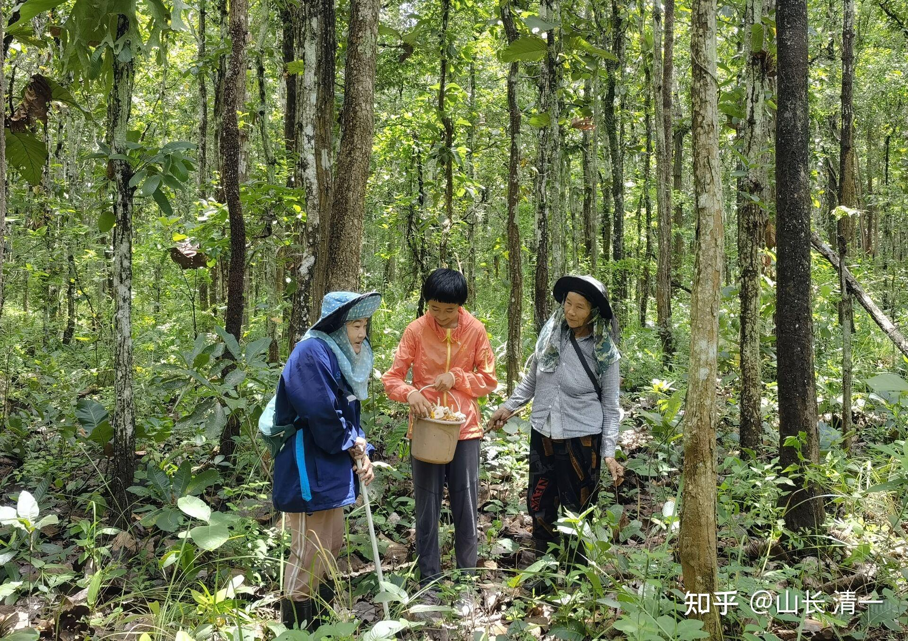

*小女在看捡满了一篮子的野生蘑菇*

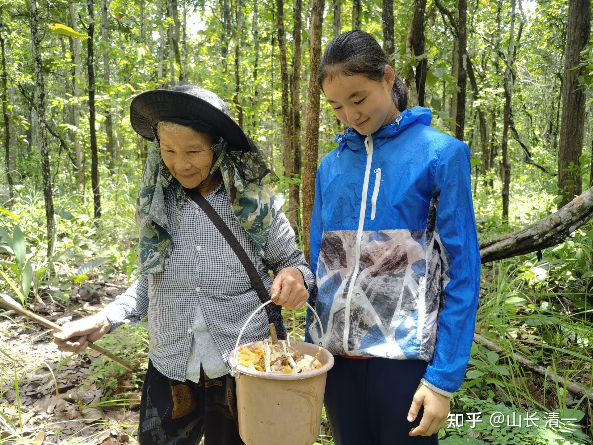

*艾拉小公主是不是馋了？*

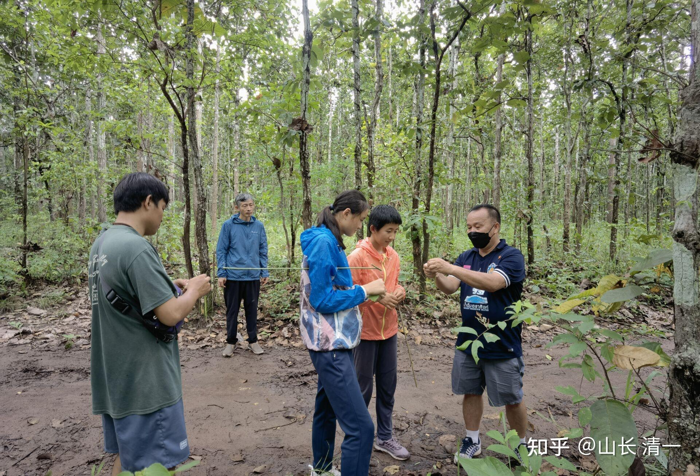

*泰国大叔教孩子们自制玩具*

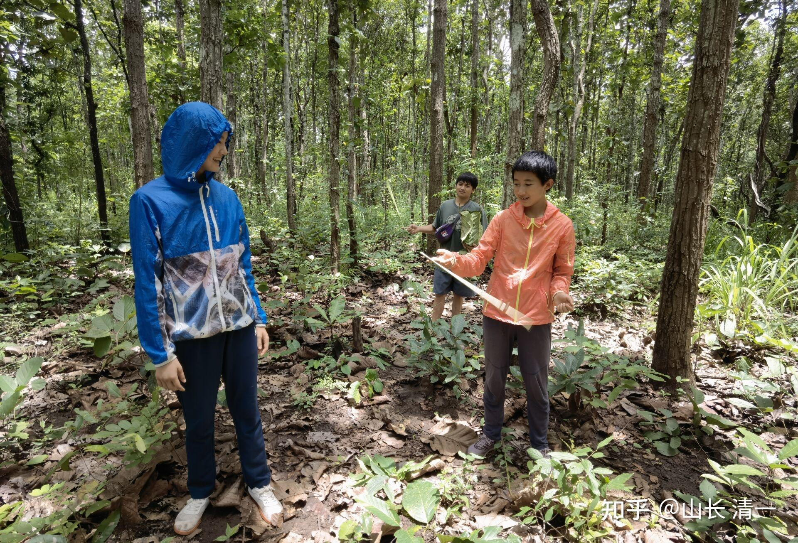

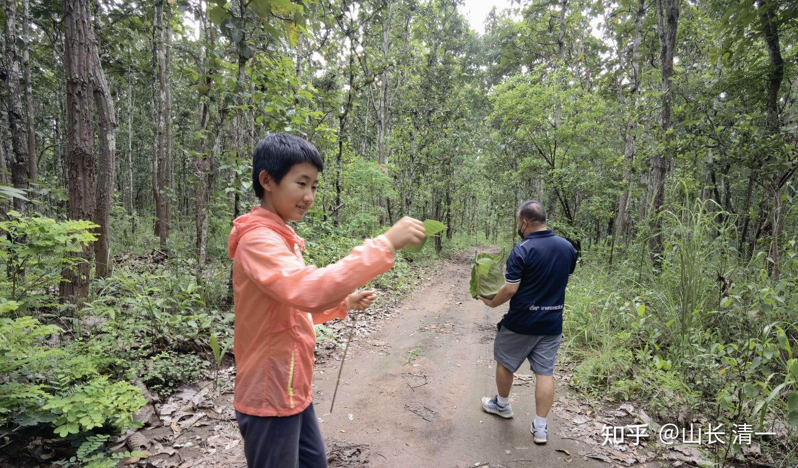

*树叶做的风车*

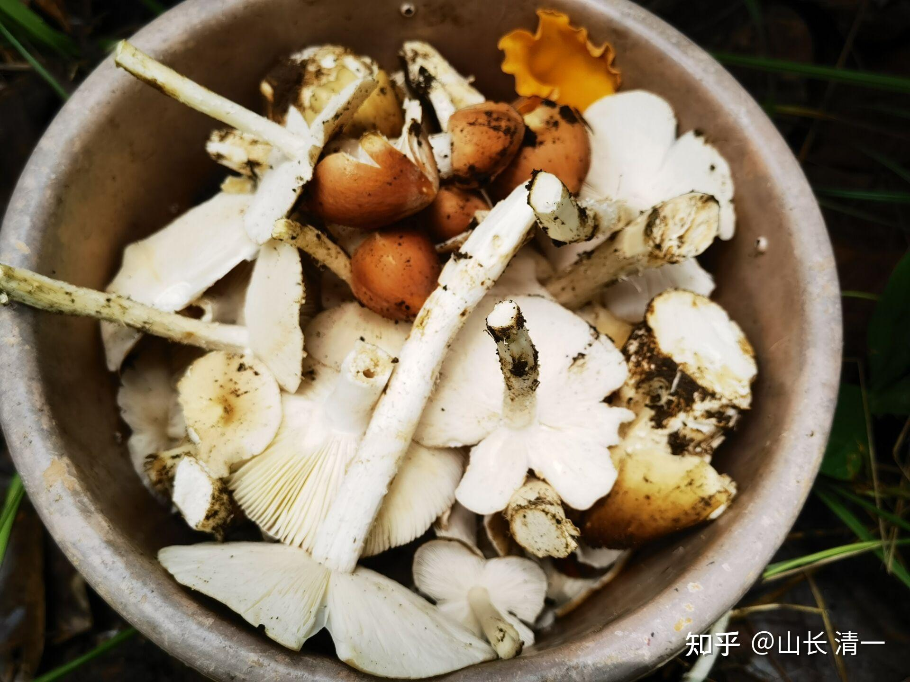

*捡回来的野生蘑菇*

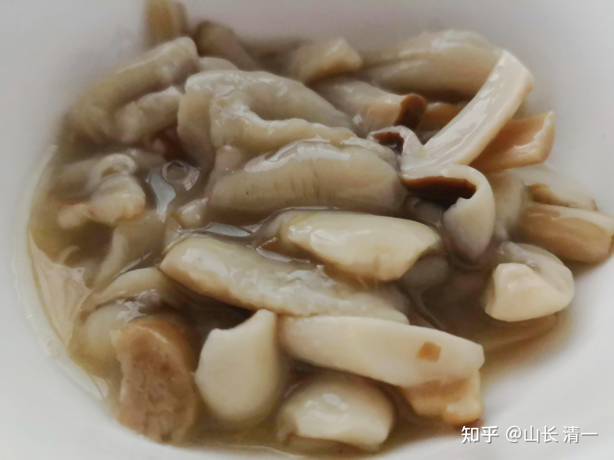

*做熟了是这个样子的。*

说明：去森林里面捡蘑菇，算金钱账，是划不来的。因为花上几十元，可以在市场上买到一大堆野生蘑菇。但自己去捡，是一种生活的体验。这些体验，是花多少钱也得不到的。也是去风景区旅游得不到的体验。对于孩子来说，这些体验真的很重要。可惜国人都把孩子关在屋里写作业了。培养一堆毫无生活能力的废人出来。