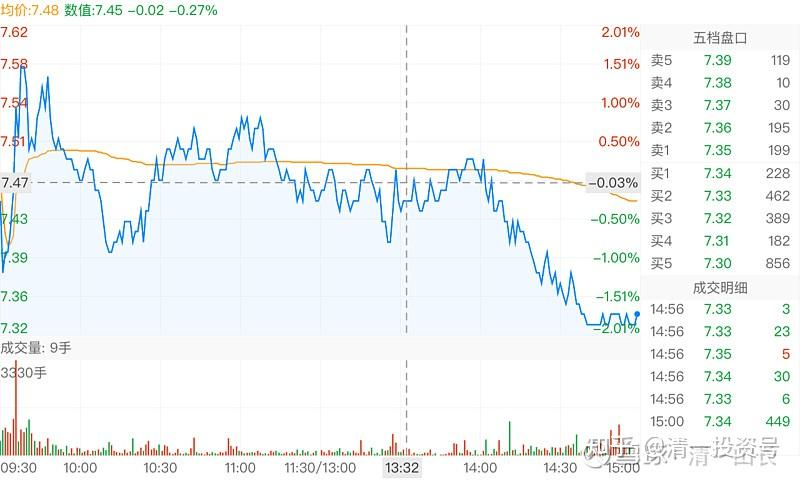
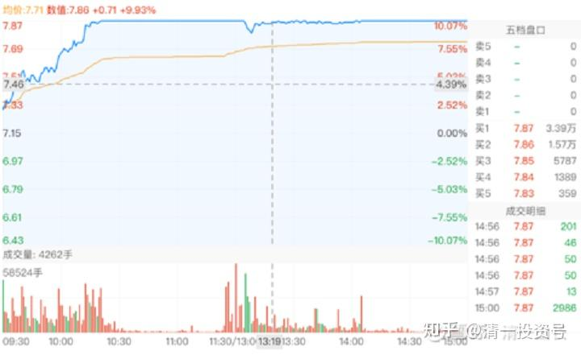
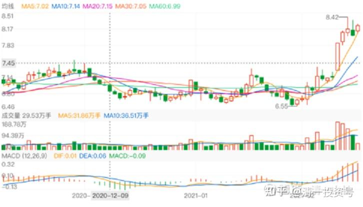
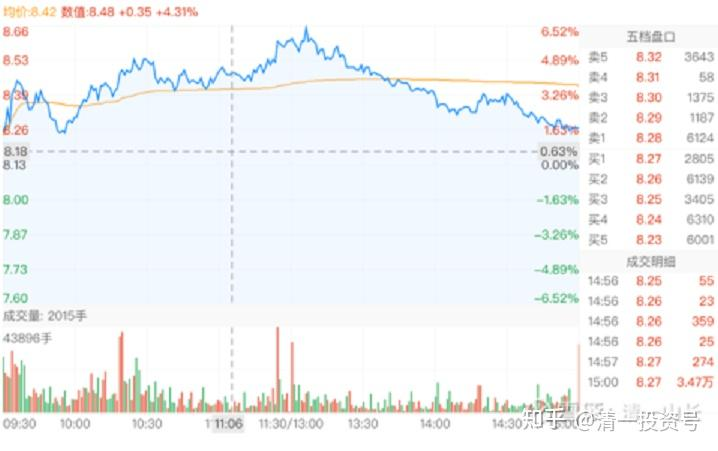
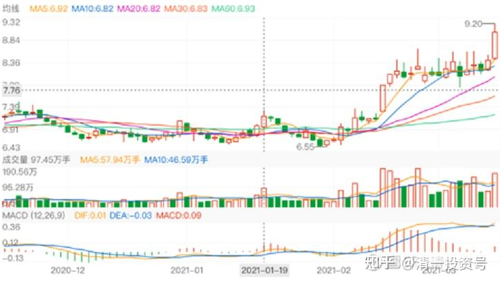
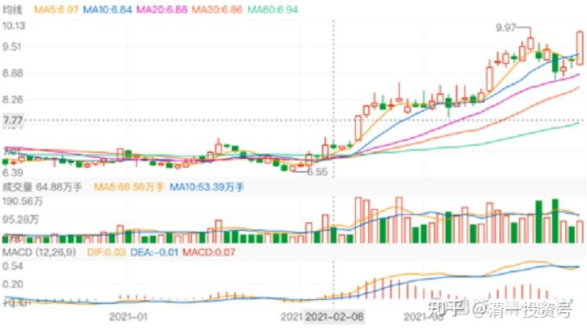

52篇. 华侨城A的建仓和启动

清一山长 2021年1月～2021年4月

**1.开始考察**

**[清一山长](http://link.zhihu.com/?target=https%3A//xueqiu.com/9310099567)** 2021-01-08 18:05

悬赏¥200.00

[$华侨城A(SZ000069)$](http://link.zhihu.com/?target=http%3A//xueqiu.com/S/SZ000069) 如果现在卖掉涨了三倍的万华，我想买一个未来也会涨三倍的股，我就可以赚九倍了。单压万华，也许也能赚九倍。换股，会不会更快一些呢？

我认为：有两家公司，未来应该有这个潜力。一家是华侨城，我认为中国人喜欢吃喝玩乐，以后钱多了，就要到处玩乐的。华侨城模式，似乎很有潜力。涨三倍，也就涨到20元，不吓人的。历史最好，它还到过70多元呢！（未除权）

另一只，是华夏幸福。它也是产业城模式。这两只都比单纯的房地产公司要靠谱一些，未来房地产萎缩的话，这两只大约可以躲过去。

看上华夏幸福，原因是平安拿它的价格，比现在几乎高50%。似乎我可以捡一个便宜。而且，华夏幸福，只要有机会恢复前高，就差不多可以赚三倍了。似乎不是梦！

但，华夏的融资利率把我吓住了。太高了！这说明——银行认为它不太靠谱。不像万华这种，我买下来。不担心它不靠谱，赚多赚少而已。所以觉得便宜就买了！中海的融资利息，才4%左右，华夏高一倍多！这点有点恐怖！

还有，它的产业园模式，到底真有特色，还是假的？从股价的走势来看，今年的对赌是完不成了。似乎正在被资金抛弃。这些资金，是聪明钱？还是恐慌钱？

这两家公司，谁值得用万华来换呢？

我开个悬赏贴吧！想说啥都可以。只要是点赞最多的，就可以拿到赏金。当然，我认为说的最有道理的，得到最多的打赏！

**[清一山长](http://link.zhihu.com/?target=https%3A//xueqiu.com/9310099567) 2021-01-12 12:32**

奖金分配完毕，我是按照跟帖的“精彩评论”十个人分配的打赏。前两名33，后面是22，最后的三名8元。正好。

谢谢大家给我的建议。我的选择是什么呢？

其实，我原来内心，自己认为比较靠得住的，我觉得最有潜力的，是华侨城。但是看了回帖之后，我就晕了。这十个最佳答案，都是一边倒，全是支持华侨城的，看好华侨城的。不仅仅是这十个人支持华侨城，他们得到的点赞数是最多的，其实就代表雪球上的风向标，是“极度看好华侨城”的。但我知道股市中的“**反身性理论**”，如果大家都看好，就应该扶摇直上的。但为啥一直不涨？长期低迷？看好的能量，如果都无法把他推高，就一定有“不看好的能量”在把他打低，谁在打低它？而股价低迷，说明不看好的能量占优势。这是什么原因？有什么我们忽略了的地方？

所以，几乎全体一致的支持买华侨城，反而让我有些担忧了。下手有点困难了。

那么，华夏幸福怎样呢？从左侧思维来看，似乎选华夏幸福更值得博弈。因为，既然所有人都不看好，而**金融市场上，高手就要与大多数人的想法反着干，才能得到最大收益。**所以，用博弈学的眼光来看，似乎要买入华夏幸福，才更有前途！可是，万一大家的判断是对的呢？华夏幸福破10元怎么办？

到底该买谁？我弄不清楚了。还好，现在拿不定主意，我就继续坐在万华化学的车上，慢慢等想清楚再说。实在想不清楚，就一样买一点！[笑]

谢谢大家！[献花花] [干杯]

[全****](http://link.zhihu.com/?target=http%3A//xueqiu.com/n/%25C3%25A5%25C2%2585%25C2%25A8%25C3%25A7%25C2%2590%25C2%2583%25C3%25A5%25C2%258C%25C2%2596%25C3%25A8%25C2%25A7%25C2%2586%25C3%25A9%25C2%2587%25C2%258E):回复清一山长:

山长太厉害了，精通中医、武术、教育、投资，山长看好华侨城3倍并且买了几百万股，牛逼啊！从几万做到几十亿，山长不为钱而办教育，完全是为了实现他对教育研究探索实践的成功而推广正确的符合人的发展规律的教育方法而为人类做出贡献，实现人生的最高价值（马斯洛需求金字塔中最高境界，自我价值实现）[牛]

**[清一山长](http://link.zhihu.com/?target=https%3A//xueqiu.com/9310099567)** 2021-01-13 11:23 回复[全****](http://link.zhihu.com/?target=http%3A//xueqiu.com/n/%25C3%25A5%25C2%2585%25C2%25A8%25C3%25A7%25C2%2590%25C2%2583%25C3%25A5%25C2%258C%25C2%2596%25C3%25A8%25C2%25A7%25C2%2586%25C3%25A9%25C2%2587%25C2%258E):

你胡说八道！我什么时候买了几百万股华侨城? 我都不知道的事情，你出来公开乱说，谁让你当代言人的？你是高级黑吗？这样乱说你有啥目的？

做股票，真实是第一位的，不知道的就不要乱说。不然，你的账户会给你真实答案的[俏皮]

**2.开始建仓**

**[清一山长](http://link.zhihu.com/?target=https%3A//xueqiu.com/9310099567)** 2021-02-02 11:24

[$上海机场(SH600009)$](http://link.zhihu.com/?target=http%3A//xueqiu.com/S/SH600009)一大堆吹股手，吹了一年的好票票，好不容易才合力抬到了80元，每天20～30亿的成交，其乐融融。现在才两天，就把一年的涨幅全跌掉了。估计还有第三个跌停。要不就必须找到50亿的资金来翘板。不过，我认为基金没这么傻的，估计这一年，原来的主力已经撤退了。小散以及准备滚地雷的新基金来接盘了。我认为真正套住的不是主力，应该是这一年通过各种媒体、自媒体、各路大V们吹嘘忽悠进来的小散户们。因为这一年时间太长了，足够运作的了。这群金融大鳄，绝对不会比我更傻的。

我喜欢上海机场，是个好股，但为什么不买？因为，好股票涨多了，就不是好股票了。如果低位持有的股，还可以装傻，继续持有，看它能有多傻。但如果没有持股的话，用现金买入，我要算的就是：如果跌了我是否受得了？如果股息有5%以上，成长率有10%以上，跌多少我都不在意。但是上机才1个多点的股息率，我受不了，所以我不会买的。

**昨天买了一点华侨城A，第一次开仓。买了20多万股，持仓价6.59元。理由就是：再跌我也不怕，股息率，成长速度放在这里。我估计这家公司是不会垮的。如果再跌，我就装死算了，反正我就是不卖股。**

这笔钱，是卖掉一部分万华化学买入的。我认为：**华侨城A涨到13元的概率，应该比万华涨到240元的概率高。**万华化学现在的股息率不如，ROE也是华侨城占优，更别说PB、PE了。万华是我卖掉56元的格力，40元买入的。可惜买少了。现在，万华似乎已经“走上赛道”了。 [献花花]，恭喜，我就不贪，逐步下车吧！**好股，我也愿意在欢呼中慢慢离场。**

**[清一山长](http://link.zhihu.com/?target=https%3A//xueqiu.com/9310099567)** 2021-02-05 15:28

[$惠泉啤酒(SH600573)$](http://link.zhihu.com/?target=http%3A//xueqiu.com/S/SH600573) 今天尾盘，继续买了一点惠泉。挂了几次单子分别买入的，成交价7.34元。看了成交回报单，全都是小单。多数都是几手，最多的几十手。连一单百手的成交都没有。说明主力真的是走了。估计要跌到6元去了，[捂脸]。继续熬吧！已经习惯了喝冷酒了。大家随意。

唯一的亮点是：**前几天买的华侨城A，已经涨了9个点。**但跟这几天燕京等下滑带来的亏损相比，实在不足为道。继续忍住。[加油]

**3.刚启动，不卖**

[清一山长](http://link.zhihu.com/?target=https%3A//xueqiu.com/9310099567) 2021-02-18 17:00

[$华侨城A(SZ000069)$](http://link.zhihu.com/?target=http%3A//xueqiu.com/S/SZ000069) 这个样子，是真的启动了[很赞]。千万别卖。**别以为我见涨停就走。我是高位见到涨停就走。华侨城刚起步呢！大家伙慢慢的坐等吧！一年内，我的华侨城仓位均锁仓不动，一股也不卖。**

上午就有人告诉我涨停了，我都懒得看盘，账户都没打开。华侨城涨停没啥稀奇的，跌停才稀奇呢！[俏皮]

**[清一山长](http://link.zhihu.com/?target=https%3A//xueqiu.com/9310099567)** 2021-02-24 10:58

[$华侨城A(SZ000069)$](http://link.zhihu.com/?target=http%3A//xueqiu.com/S/SZ000069) 我认为：华侨城的这个走势，很可能将来也是中国建筑未来的走势。放量突破长期整理震荡的平台，让长期持有，一直煎熬不己的散户，高兴地放手。然后，就没有然后了。

**有时散户很可怜，坚持拿了很久，几年，但一个小拉升，赚了点小钱就赶快跑了，还希望以后接回来。然后眼睁睁的看着上涨到自己其实早已期待的位置，却与自己无缘。**华侨城，以及中国建筑，我看五年后，都有达到15～20元的可能性。看谁先兑现了。

**[清一山长](http://link.zhihu.com/?target=https%3A//xueqiu.com/9310099567) 2021-02-25 21:34**

[$华侨城A(SZ000069)$](http://link.zhihu.com/?target=http%3A//xueqiu.com/S/SZ000069) 今天这走势不正常，不是洗盘，就是啥的，反正今天是出货的图。成交量跟上次涨停差不多。出现这种图形，理论上，要调整一段时间了。但我不想动，就看看算了。**如果高位出现这种图，我铁定跑。**

**[清一山长](http://link.zhihu.com/?target=https%3A//xueqiu.com/9310099567)** 2021-03-05 10:55

[$华侨城A(SZ000069)$](http://link.zhihu.com/?target=http%3A//xueqiu.com/S/SZ000069) 股份回购彰显公司长期发展信心。2020 年 3 月 20 日，公司计划于此后 12 个月内回购 1.23-2.46 亿股公众股份用于股权激励，回购价格不超过 8 元/股。截至 2021 年 1 月 31 日，公司以集中竞价方式累计回购 1.64 亿股（占总股本的 2%和计划回购上限的 67%），总对价 10.41 亿元（不含交易费用），对应成交均价 6.35 元/股（成交价区间为 5.84-7.04 元/股）

华侨城真会买。均价才6.35元。比我的持仓价都低！超过8元就不买，是不是说明管理层认为过了8元就不值了？所以现在又跌破了8元？[为什么]

**[清一山长](http://link.zhihu.com/?target=https%3A//xueqiu.com/9310099567)** 2021-03-13 07:01

[$华侨城A(SZ000069)$](http://link.zhihu.com/?target=http%3A//xueqiu.com/S/SZ000069) 上一轮，冲破8元区以后，明显的震荡洗盘局面。我也及时告诉大家不要卖。**相对我6元多的买入价，已经涨了2元多了，为啥还是不卖？因为刚启动，怎么能卖的？**不过今天已经到了2017年的高点位置，会不会又跌下来，跌到2013年的位置呢？其实我也不知道。但我就是不想卖。**跟2017年相比，华侨城已经多赚了不少钱。这三年没白过，净资产已经增加了接近50%，干嘛要用17年的价格就是顶？所以，继续等。跌就继续坐电梯，就当没涨过。**

从最近的成交换手来说，是大资金已经看上了华侨城。换手很充分。如果起来，不是一个小行情。不会小打小闹的。虽然说华侨城主要还是地产股，但我买股，喜欢买有特点的，有题材的。地产股如果要炒作，华侨城最有题材可以玩，跟别的公司不一样。文旅项目是不是赚钱不重要，别人没他玩得好，有题材就可以炒。这就是中国股市。

茅台酒真的好吗？未必，只是它的题材好，红一代最喜欢的酒。代表上层。就这原因。所以涨破天。

**4.突破10元，不动**

**[清一山长](http://link.zhihu.com/?target=https%3A//xueqiu.com/9310099567)** 2021-03-29 13:30

[$华侨城A(SZ000069)$](http://link.zhihu.com/?target=http%3A//xueqiu.com/S/SZ000069) 今天一根没有放量的大阳线，说明9元区的洗盘结束了，10元应该本周就会有效突破的。从走势看，这是六元多启动后，唯一一次下杀洗盘的。前几次都是平台盘整，短的四天，长一点的两三个星期。上冲9.97元回调也只有四天，今天就快速拉涨，说明主力不愿意失去太多筹码。不过我估计大量的散户筹码已经丢掉了。特别是上周两根大阴线，下跌中成交量大增，上涨却没多少量。说明：很多聪明的散户以为股票破位，趋势走坏，就全跑掉了。**只有我这样的笨人依然一股没卖，傻傻地坐电梯。当然，这个价格，我也不敢高买。就只是坐看涨跌。无心算账户增减，只算一股不少就算赢。**

我会坐等华侨城创新高的。

[姜达kkb](http://link.zhihu.com/?target=http%3A//xueqiu.com/n/%25C3%25A5%25C2%25A7%25C2%259C%25C3%25A8%25C2%25BE%25C2%25BEkkb)回复[清一山长](http://link.zhihu.com/?target=http%3A//xueqiu.com/n/%25C3%25A6%25C2%25B8%25C2%2585%25C3%25A4%25C2%25B8%25C2%2580%25C3%25A5%25C2%25B1%25C2%25B1%25C3%25A9%25C2%2595%25C2%25BF):

我相信您，实战燕京，清仓珠江，加仓燕京，个人预测20年后，燕京29元左右或以上每股。个人跟您学习总结的个人投资原则①重内轻外(即重价值轻价格)，②重长轻短(即重终生买股轻短期投机，最短20年以上。)

**[清一山长](http://link.zhihu.com/?target=https%3A//xueqiu.com/9310099567)** 2021-04-02 19:27 回复[姜达kkb](http://link.zhihu.com/?target=http%3A//xueqiu.com/n/%25C3%25A5%25C2%25A7%25C2%259C%25C3%25A8%25C2%25BE%25C2%25BEkkb):

20年后，燕京每股才29元，这笔投资就太失败了。不如买中国建筑。20年后，中国建筑至少50元吧？

如果五年内，燕京都上不了20元，我这次投资，就算是很失败的决策了。华侨城6元多，我没有换股，如果我把燕京全数换成华侨城A，真赚翻了。我就坚持认为燕京更有机会，虽然现在证明我看错了。当初一样的价格，现在华侨城过了10元，再拿来换燕京多好。**现在我的华侨城持仓并不是特别多，不到1M，就不想换了。动都不想动。**

（标题为编者所加）

参考链接：

[清一投资号：56篇.华侨城的后续与补充](https://zhuanlan.zhihu.com/p/551034874)（整理文）

