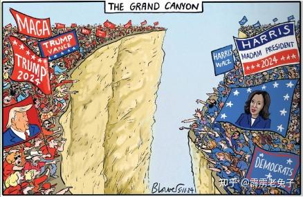

2022年，拜登政府发布新版国家安全战略文件，称「 未来十年是美国与中国竞争的决定性十年」。

这个判断基本上是对的：如果美国什么都不做，十年之后，美国就将被中国全方面超越。这对美国来说，是不可接受的。因此，美国两党，现在无论谁上台，都注定要打压中国。只是两党打压的方式不一样。造成的影响不一样，但结果不会变-----美国就是中国的敌人，会尽力来打击中国的！

所以：未来十年，无论是中国和美国，谁的日子都不好过。都在苦苦支撑！

如果中国赢了的话，美国的后果很严重----不仅仅全球霸权衰落，很可能会面临国家解体的问题。美国联邦，重新成为“邦联”，因为美国各地的发展空间不一样，巨大的内部矛盾没有消解的空间。富裕的洲，不会带穷洲一起玩。只能各玩各的，美国将会分裂，以及边缘化。

而相反的是：美欧主持世界的时代落幕，亚洲引领世界的时代开启。过去几十年，西方智库们一直预言东方就崛起，令他们恐惧的“亚洲时代”就开启了！

而中国注定是东方时代，亚洲时代的世界领头羊。世界格局将彻底改变！

说实话：40多年前，池田大作和汤因比博士对话【展望21 世纪】。就提到了未来的世界属于亚洲，改变世界的希望在东方。西方物质主义已经走到尽头了。

这本书发行后就风行全世界，当年我还是一个大学生，时置刚刚改革开放，我们对美国的现代化是“遥遥领先"的感觉，中国全方位落后于世界上绝大多数国家，甚至远远比不上泰国！当年的我们，根本不能想象----居然能看到中国超越美国的这一天。

我自己也根本想不到当年的一个穷学生---能够40年后，会在泰国，从英国人的手中，把创建了30多年的上百亩地英式花园买下来作为【中国书院】，在英国人的壁炉旁边教导学生学习中华文化。还正在训练一批年轻学生在这里出发，去击败现代格斗专业格斗手，成为世界冠军。

即使是十年前，我也不敢相信----我国敢于和美国正面对拼。我们在教育上居然领先世界！

现在来看，美国已经输掉了未来！衰落迹象一览无遗！哪里还像一个令人仰望的神之国？

*美国群体分裂很严重*

无论是民主党，共和党，都绝对不甘心出现这种结果，无法接受美国的衰落。都拼命想要挽回这种失败的命运。

特朗普说出来的MAGA精神很好----让美国再次伟大。但理想很丰满，但现实很骨感：已经被过去的辉煌成功，被轻松掠夺全世界的资本家豢养了几十年的，慵懒无能没脑子的美国国民，已经不再是几十年前自信，努力，强大，进取心十足的国民了。现在美国人的吸毒率，已经远远超过了大清末年的时候。美国人已经习惯了各种放纵和堕落的生活方式，不再愿意勤奋努力的劳动和工作。这种国民，已经无法支撑特朗普让美国民族再次强大的理想了。特朗普是一个当代的爱国者，真爱美国。但他注定是悲剧人物---因为他面对的是无法挽回的命运！

现在的美国，在我看，就是一个大清帝国的当代复制版。这个曾经辉煌，现在看起来也依然保持繁荣的美国，骨子里面已经百孔千苍。就像习惯了富裕生活，习惯了飞扬跋扈，自高自大的八旗子弟一样，面对现在世界“百年未有之巨变”，已经没有真实，甚至踏实面对的可能了。

但我最担心的就是：美国为了维护自己的霸权，会不会拉上几个附庸国，与中国拼死一战？现在，只有热战才能把中国拖下马，防止中国崛起了！我身边不少高人，一直在警告我：战争很快就会开启。2024-2025转换的念头，最有可能发生战争，年底最危险。

可是我一直怀疑----中美都不至于蠢到主动发动战争吧？ 最多发动代理人战争。因为中美对抗的结局，其实是双输-----中美直接战争，美国的霸权注定会完蛋。但中国陷入战争，也就失去了问鼎世界当第一的可能。就像当年一战二战，最强大的工业国德国，以及老牌的法国，都不服气老牌帝国英国，都相当老大，都想挑战英国的日不落地位。最终两场世界大战，英国和德国都把自己打烂了，欧洲都全打烂了。才让远在天边的美国趁机崛起，英国从此成老二老三老五，节节败退。手中大量的殖民地，也在美国的支持下纷纷独立。成为美国的跟班小弟。法国也一样，均无力应对世界霸权的转移，只能坐视美国崛起。如果没有这一场欧洲争夺霸权的内战，美国只是一个边缘发展的国家，现在也根本不会有印度这个国家。东南亚这些国家，也只能继续当英国和法国的殖民地。当然也没有非洲法国殖民地国家的啥事。假如今天英法两国手上，依然拥有印度，东南亚，非洲的资源和基地，他们力量连在一起，美国有啥本事来当第一？打起来美国也根本就没啥胜算的！所以、一战二战的最大赢家其实是美国！

战后的德国，更是凄惨，完全被肢解分割，从此失去了问鼎世界的可能！虽然这个民族真的很优秀，我认为比美国人强多了！思想，文化，哲学，理性，头脑。都不是粗鄙的美国人能够比的！

所以---如果这几年，中国美国打起来，最终结果，我认为只是给了第三方崛起的机会！也许是印度，也许是其他国家！比如俄罗斯，伊朗（古波斯帝国），土耳其（古奥斯曼帝国）乘机做大！也许还有阿拉伯帝国重新崛起。

所以，我最怕某个美国的疯子总统，非要跟中国打一场自杀性的热战，非要跟中国纠缠到死。也怕我们国家的网民，傻乎乎的非要去登陆台湾，主动跳进美国人的陷阱！台湾问题其实根本就不是问题。只要美国败了，台湾人就会乖乖的来申请入籍，态度绝对非常的友好和诚恳。就像缅甸的果敢族等人，都殷切想要“回归祖国”一样。但我们现在的条件还不成熟，没有打败美国之前，就强行用战争去收复台湾，付出特别巨大不说，弄回来的也只是一座被打废的，没有实际价值的小岛，根本就是馊主意。上兵伐谋，最下才是攻城。天天想怎么打台湾的人，我看就是喊打喊杀的街头小混混级别，完全没有战略思维！

我判断最危险的战争可能发动时期，就是最近三年！2027年是最后的节点！一旦提前打起来，我认为就大势已去！中华回复汉唐雄风，大崛起的势头被打断。

最近，我看到一些迹象：说明战争风险最大的时刻已经过去了。中美肯定打不起来了。中国和平崛起有望，世界和平有望！

特朗普胜选，是一个很重要的信号，战争阴云消退。代表一直在利用战争捞取好处的好战分子民主党退潮，未来四年，不再有机会煽动武力用军事来对付中国！

特朗普本质上是个商人，不是一个善于谋求全球战略和全球霸权的政治家！他不喜欢战争，因为他知道战争只会削弱美国，让美国的潜在敌人崛起。他知道战争肯定会削弱中国，但---他不会为了削弱中国，而去冒险削弱美国的！这种事情他不干。他不是泽连斯基这种装爱国的演员。他只会拼命捍卫美国人的一切利益。因此他会尽量避免与中国热战-----只会和中国打经济战。但---经济战中国其实并不怕！作为世界上最大的制造国，怎么会怕金融国来跟我们打经济战？只要过几年苦日子，就熬过来了。玩金融的美国铁定玩不过做实业的中国。中国就怕热战，真会死人的！几十年的工业设施，真会被打烂的（比如乌克兰的工业前途已经毁掉了）。真打起来，我们的国运也完了！

美国其实阴险可怕的政客是民主党。他们这群人，不太在乎美国本土民族的利益。因为民主党的利益集团是分布全球的，算是“全球投资派”。他们在全世界（甚至包括中国的一些关键企业都有投资，只是比例最小）都有很大的利益联系。所以---民主党更喜欢联合全世界的盟友们一起对抗中国。联盟对抗中国，就是民主党的共识。为了实现这种联盟，民主党甚至会牺牲美国人民的利益去帮助一些国家，去“拯救世界”（其实是拯救民主党的核心利益）----比如大量拨款支持乌克兰。客观上，这种联合世界一大群来对抗中国的方式，会让中国更难受！

特朗普就不一样，他只管美国人的利益。什么乌克兰，欧洲，民主世界联盟，他根本就没兴趣。他当然会更加严厉的对待中国，死死封锁中国。但由于特朗普只管自己国家，因此他只能封锁美国对中国的贸易。但他反而会把其他世界各国都推给中国，成就中国与世界的关系！

实际上这种事情正在发生！

我看到近期日韩正在向中国示好，印度也居然正在从边境大规模撤兵，越南也在跟中国强化友好关系。原来与拜登们拉在一起的“敌对势力国家”，最近居然都集体向中国表达友好！完全不顾美国的脸色难看。美国也“无可奈何花落去”，只能看着原来的铁杆小弟们纷纷离开美国，去取悦中国，和中国合作。美国正在成为孤家寡人！因为这些盟友已经看穿了------美国不会和中国大战了！

各国敢于这样做，肯定就是得到了实锤---美国决心避免和中国的战争的真实消息，因此：原来想看热闹不嫌事儿大的“吃瓜群众”，一看没有瓜吃了。就放弃了原来假装中立，甚至表面上站队美国的看客立场，纷纷出来主动与中国交好。这些都是投机客---原来站队美国，只是想要跟着美国后面捞捞偏门。现在美国缩头回去了，看到中国要赢了，这些人自然出来打圆场----表示要跟中国合作了！谁强就跟谁，这就是国际政治！

所以---特朗普上任，其实对中国已经没啥牌了。他只会拿关税说事儿。他说中国如果打台湾，他就涨关税。完全放弃了拜登的“战争盟友”关系。台湾一看，大哥都怂了，还会傻乎乎的自己跳出来，单独跟大陆打一架吗？估计未来讲兄弟一家亲的时代就要来了。偏独的民进党，估计未来也会被偏“统一”的国民党取代！因为台湾人可不傻！如果跟着美国人要倒霉的话。他们会立马转身的！

所以---不再需要10年以后，才知道中国，美国谁会赢---中国一定赢。只是---目前还有几年苦日子过。大家尽量不要犯错。等就行了---等美国崩盘！10年后，就是中国人的时代！

实话说：我认为特朗普是一个悲情人物---他上台的未来四年，肯定是美国加速衰落的四年，也是中国快速崛起的四年！虽然造成美国衰落的原因，肯定不是特朗普，而是过去10-20年坐视中国强大却无所作为的“无能美国政客”，但在他任上，美国金融崩溃，物价腾飞，内乱加剧。甚至因为利益分账不均而闹分裂的美国，这些事情注定在未来4年内成为“现实”。无知的国民们，肯定会认为这些结果，都是特朗普无能造成的。是特朗普执政的水平不行。所以---特朗普一腔热血，拼命上台来拯救美国人也没有用，他是注定在最悲惨的时候，美国最顶峰，也是开启下披路时候上任的，见证美国衰落的总统！注定被美国人民怨恨和抛弃---他在历史上，会成为一个“让美国失败的总统”。