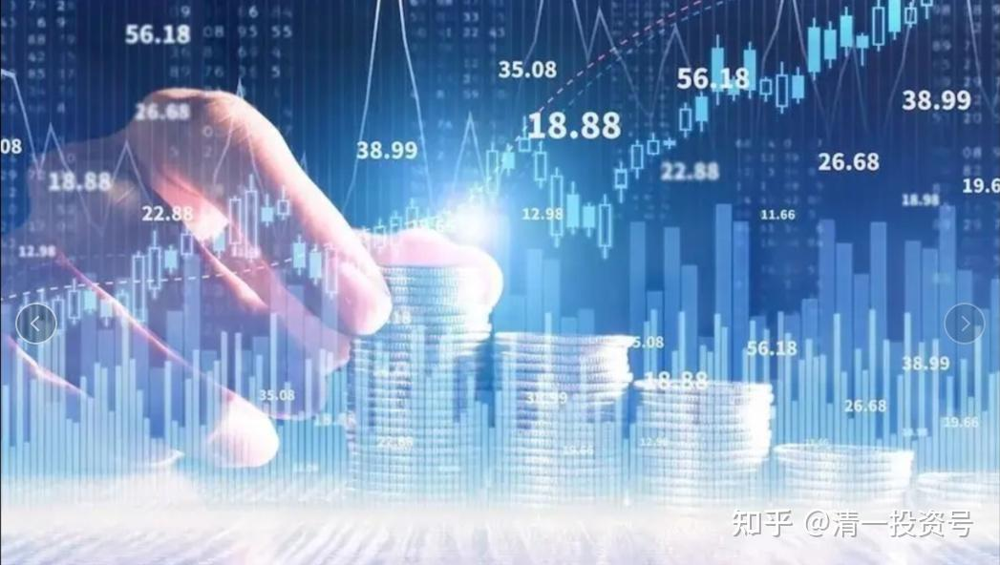
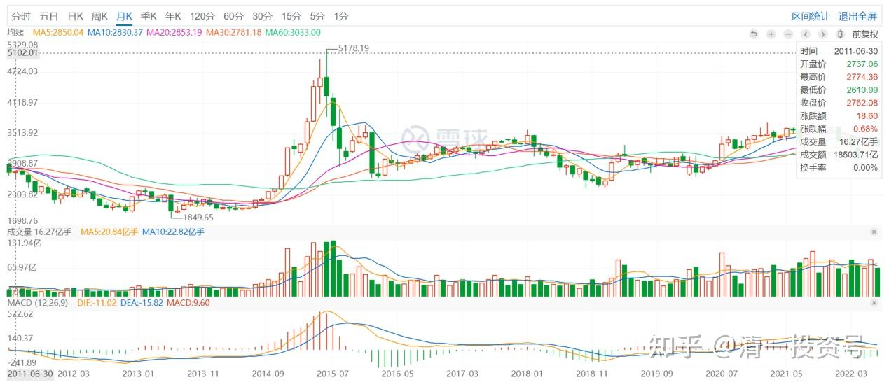

55篇.2015年公开融资操作历史

清一山长2015年7月9日～2020年3月2日

**一、2015年股灾，最黑暗的第一个低点，公开发文融资买入**

清一山长2015-07-09 07:27

今天融资1000万：为国接盘

这段时间，因老父亲去世，没有看盘。突然发现身边人都遭遇股灾，被迫平仓的人越来越多了。财猫们也惶惶不可终日，希望我说说话。怎么说呢？我早就说过了：这一次牛市，是中国与美国争夺金融话语权的金融战争。

显然，美国的金融利益集团，是绝对不会轻易让出金融控制权的。因此，发生大幅度争夺震荡的可能性很大，一定要防止“误伤”。

最忌讳的是：

**第一：不要贪心。如果高位满仓满融，就容易爆仓**。这就是我为何警告去年赚得满满的财猫，今年贪心的人，就会出现爆仓的可能性。因此我高点是一定减仓的，不要想把所有的钱都赚到手。比如昨天，因为招商银行创新高，就一大早挂牌20.79元出售三分之一的仓位，居然成交了，只比昨天的最高价低了一分钱。农行、工行也创了新高，因此也是我昨天的平仓对象，收回部分融资以保安全。

**第二：要与国家队站在一起，为国接盘。**国家要救助股市，只会救助国家绝对不能输掉的关键部门，因此银行、保险（不含券商）的大金融，是国家一定会保护的。买这些股，就与国家队站在一起，维护中国的大金融，就是维护中国未来的发展，这一点是绝对不能输掉的。去炒垃圾股，专门帮庄家接盘的，我只好说：死了活该。

**第三：不要投机。**狂跌的时候，低点一定要进仓。高点可以减掉融资，防范风险，本金可以不动，继续待涨。我相信中国一定会赢的。

*（上证指数2011-2022月K线）*

今天，我准备开1000万元的融资仓位，买入北京银行、兴业银行，以及浦发（这几个已经明显低估了）。坚决与国家队站在一起，为国接盘。也希望大家不要惊慌，不要在黎明前倒下。要相信中国人不是笨蛋，不是美国金融资本家能够轻易击垮的。我们一定会用金钱以及各种保护性政策来保卫中国的金融权利的。事关存亡，我们不可能不全力以赴。因此，我们最后一定会胜利的！决战将在最近一周内见分晓。今天和明天，是最关键的日子，大震荡是不可避免的。大家注意安全。

本来今年不想在公开场合多评论金融市场的，大家都赚钱的时候，我没有什么好告诉大家的。现在很多人都赔钱了、都很惊慌，关键时刻，还是出来说说话，并用实际行动来支持中国的金融力量。

祝福大家！

**二、2015年股灾，在更惨烈的第二次探底中，再次融资买入**

清一山长2015-08-24 22:15

**忘记价格关注价值**

$招商银行(03968)$今天对投资者来说是一个非常难过的日子，我的账户也录得了7月8日来最大的跌幅。市值损失惨重吗？但是一股未少，我心依然安定，但估计很多人今天睡不着。因此，**今天站出来说说话，希望大家厘清思路，不要在恐慌下乱做事，好好睡觉。**

我今天买入了部分兴业，12.88元。北京，7.23-7.25元。这些资金是我前期在18-20.79元抛出招商银行换来的资金。而这些招商，是我在前期兴业冲20元，而招商此次不涨的时候卖掉兴业买的招商，我当时还以为错过兴业了，没想到今天全买回来了。我买入股票，并非预测市场到底了，也许兴业还会跌倒10元去（相当于去年的8元的极端价格），我不能肯定，我只是肯定这个价格（13元左右的兴业）是我很愿意拥有的价格。我会抓紧这些股份过冬的，就算是跌到8元我也不会卖掉的。测算了一下，兴业跌到8元，我才会爆仓。不过我可以卖出港股（没有融资）来补充，因此安全边际还比较大。

以下是我在内部学员群的发言，供大家参考。**不要恐惧，而要寻找市场的机会（我发现这段时间是“好主意比钱多的时候”），所以，现在有子弹，就是伏击的最好时机。**我今天还关注了复星国际(HK:00656)，这个郭广昌说20元并不贵的股票，也许现在11元的投资机会，是很有诱惑力的，观察中。

内部发言：今天大家应该知道我的：**“忘记价格，关注价值”**格言有多重要了？**只要你的心是关注价格的，今天想死的心都有。假如你是关注内在价值的，你不会在乎什么的，反正你持有的股份没有想卖掉的。你居住的住房你绝对不会因为邻居卖价很低就认为你破产了。因为你持有的公司还在继续盈利，你没有理由相信这些泡泡的起伏，会影响公司的经营。**最起码，你会知道，兴业、招商，以及浦发，这些企业最大的老板，他们不会预期还会跌就“减持”，他们要的是权利，最终赚钱的一定是他们。

当你认为你能够预测市场的时候，你就是神！**我买入的时候，并不预测未来会涨，只是我觉的便宜。当我卖出部分股份的时候，并不是我知道未来会跌，只是我希望安全边际足够高一些，另外我总是希望手上有备用的资金而已**。比如前期我18-20元期间卖出超过百万股招商的理由很简单：招商相对浦发和兴业来说太高了，我不愿继续持有高价资产。但是卖出后我并未立即买进兴业等，而是等等看看是否有机会买入更低的价格（当时想法很简单，就算是A股继续涨，不给我机会，港股还有便宜货可以捡的），因此现在我还有钱买入（今天兴业最低12.88元买进）。我准备好了，他就算继续跌倒10元我也接受，留一批子弹等它到十元（我永远不会把钱用完）。然后，就只能装死了。

其实，**投资是一场马拉松，我们不要用短跑的态度来看。因此，借钱炒股是一个坏习惯，就算你赢十次，但输一次就光了。千万要注意风控。**

重新回顾我的财富课，今天面临的问题，我课上早就讲过的。牛市来得太快，你们都忘掉了投资的要诀，不自主的去“炒股”去了。**天天关注自己账面资产涨跌的人，注定是很苦的。而且，这些人绝对不是投资者。**

清一山长2019-12-03 14:47

今天回过头来看，2015年的这篇文章，当时写出来，是很宝贵的。但是看的人数，居然只有2000多人。回复的评论，居然是一大堆的“黑”鬼。证明国人是多么的经不起风浪，理智和判断力，是多么的差。我写这篇小文的时候，我的账户当日损失是超过千万的。我估计雪球上的人，比我损失金额更多的人应该很少，不会超过1%。但我并未因为账户的惨烈损失而寻求他人的同情，也没有自伤自怜，而是想出来说几句，尽量鼓励他人，不要在低位抛出宝贵的筹码。在千股跌停的日子里，我示范是反向投资，越跌越买。我动用了大量融资，尽可能地买进跌得面目全非的股。这些融资额度，是我在4500点就减掉融资，保留主仓，一直被周围人笑话我“太胆小，不如新股民”，现在有钱都不敢赚的情况下，留下的宝贵子弹。当年的兴业，最低没有到我说的10元或8元，而是只到了11.90元就停止下跌的步子，很快就冲到了17元以上，之后一年不到，又冲过了18元、19元。当天7元多买入的北京银行，年度的最低价是7元整。这只银行也很快就冲过了10元，最高过了11元。当然，每次冲高后，赚了30%，我就再次的减掉了融资，只保留了主仓，下跌之后，又再度买入。我是这样用融资来“投机”的。这样玩了好几次电梯，结果是在股灾惨烈的2015年，我不仅把原来股灾跌掉的钱又赚了回来，股灾后，账户还创造了新高。开始大规模转战港股，我记得2016年年初居然以12.88元港币的价格，买到了招商银行（当年的最低价是12.66元），我觉得简直就是送钱给我。我在银行间的不断轮动，创造了比单持一只股更高的利润。兴业、招商、浦发、华夏、北京等银行股，每只银行股，都帮我赚到了8位数。农行是我最后阶段因为它最低估，2015年才开始进入的，也赚了500多万。

2015年，幸亏坚持投资银行，并且跟国家队共进退，所以保住了胜利果实。即使当年不动，持有到现在，也是获利很好的。而2015年嘲笑我保守的清黑，他们重仓持有券商，且一直满仓满融，笑我胆小的清黑，直到现在，恐怕都没有恢复元气。谁对谁错？一目了然。可惜，中国人还有一个毛病，就是死不认错。这不就是跟自己的钱过不去吗[俏皮]！

[证券之星](http://link.zhihu.com/?target=https%3A//author.baidu.com/home%3Ffrom%3Dbjh_article%26app_id%3D1568979149392039)[2021-06-15 21:29](http://link.zhihu.com/?target=https%3A//baijiahao.baidu.com/s%3Fid%3D1702645430361163645%26wfr%3Dspider%26for%3Dpc)

[疯狂造富的大时代，一去不返](http://link.zhihu.com/?target=https%3A//baijiahao.baidu.com/s%3Fid%3D1702645430361163645%26wfr)

[https://baijiahao.baidu.com/s?id=1702645430361163645&wfr](http://link.zhihu.com/?target=https%3A//baijiahao.baidu.com/s%3Fid%3D1702645430361163645%26wfr)

清一山长2021-06-16 22:26评论上帖：

【2013年，杨百万年过6旬，逐渐淡出股市，在接受采访时，他坦言“比起当年的2万块本钱，今天我股市的2000万，资产增加了1千倍，钱够用就好，养老也可以不靠国家、靠自己了，除了抽根烟、喝个茶，没有什么奢侈的爱好。】

我还以为他股市资产早就过亿了，一个资产很高的起点，最终才这点钱。说明他一路的追涨杀跌，其实收益不是太高。不如保守持仓的收益更大。很多比他晚很多入市的人，现在都比他更有收益吧？比如燕京的牛散唐建华。各位算算，如果以杨百万的资产量，他进入股市之初，就保守投资，稳拿头部的几只股票不放，到了2013年都不止这数字。如果跟上大波段，做一点逃顶抄底的事情，就更多了。

当年我就是这样做的，我在几个人声顶沸，人人买股的时刻取钱离场，那时候是券商现场取钱的。记得一次，是别人存钱，我把我所有的股票卖掉，然后拿钱走人，结果券商居然在大厅给我一整包的钱（我只好出来打滴往相反的方向走，然后中途换乘的回家，防止人追踪）。更有几次，我是券商大厅都无人的时候，冷清至极的时候进场的，而且进场只买绩优股，防止再跌。所以，300点的底，以及2005年1000点的底，我都是抄到了的。2005年，我还借了几百万去抄底，结果弄到家都散了。但这是我赚钱最多的一次抄底行动。2005年，我买的重仓是武钢股份。当时价格2.41元～2.42元，每天织布，后来居然涨了快十倍（可惜涨了三倍我就跑掉了，买了别的也涨了）。第二次大规模入市，就是**2014年借钱炒股，我告诉周围朋友，这是一次可能一生都难遇的机会，请大家珍惜。带了数百人入市买银行股。**这一次，已经可以动用融资了，不用向私人借钱了。结果我就动用了上千万的融资额度来买银行（当时的逻辑——银行股的分红，已经可以基本覆盖融资利息），这一回的大赌，彻底反转人生。现在看，我就是这一次抄底行动，才超过了杨百万的资产值。

现在正在抄底十年不涨的股票，中国建筑也6年不涨了。也许，它们将带给我再上一个数量级。我相信价值投机——只在有价值的股票上进行投机行为，高卖低买。高价股、投机股，一概不碰。这个逻辑让我穿越了过去的28年，超过了这些过去的股神。我相信也可以让您的未来稳定，甚至高速获益。

剧透一下：现在的中国建筑、中国中车H股，分红都已经可以覆盖融资利息了。这种股票，我是敢于融资持有的。至于其他说不清的股——就算了。我相信这两家公司，未来10年、20年，是倒不了的。至于说国企啥的？我相信这两家公司，未来都必须和国际市场竞争，他们的国企病，会在国际竞争中治疗的。不用太担心这一点。（中车已经从底部涨了30%多了，不推荐保守投资者此时进场，右侧投资者才可以入场。也许中国建筑更稳一点，我看跌不去了）

[@莉莉酱牛肉丸](http://link.zhihu.com/?target=http%3A//xueqiu.com/n/%25E8%258E%2589%25E8%258E%2589%25E9%2585%25B1%25E7%2589%259B%25E8%2582%2589%25E4%25B8%25B8)回复[@守拙待象](http://link.zhihu.com/?target=http%3A//xueqiu.com/n/%25E5%25AE%2588%25E6%258B%2599%25E5%25BE%2585%25E8%25B1%25A1):

买房子了……两把刀。

[清一山长](http://link.zhihu.com/?target=https%3A//xueqiu.com/9310099567)2021-06-16 23:00回复[@莉莉酱牛肉丸](http://link.zhihu.com/?target=http%3A//xueqiu.com/n/%25E8%258E%2589%25E8%258E%2589%25E9%2585%25B1%25E7%2589%259B%25E8%2582%2589%25E4%25B8%25B8):

是的[笑]。差不多这个时期离场不玩，在武汉低价买了20多套房产。六七年后，2014年重新卖掉房子，全仓杀回来。运气刚刚好。

离开赌场的原因，是2008年我居然发现了轮回是真的，所以就完全丢掉了股市，去研究轮回去了。然后就彻底地退出商界，不再想做生意了。如果继续坚持玩股票，估计也挺倒霉的。2008年之后一路从6000多点跌到2000点，很多人都玩残了。我在2013～-2014年的最低点，大量杀入购买大量绩优股、银行股。别人2014年是**“满仓踏空”**，我是满仓满融赚钱（主要是银行股）。

所以，我认为估计有佛祖保佑我[笑]。运气超好。

**三、贸易战伊始，反常的上涨中果断减仓**

对不起兴业，我承认软弱，今天先走一步！

清一山长2018-02-06 15:20:31

$兴业银行(SH601166)$今天以19.12元，卖出了几乎全部的兴业银行，有些是持有较长时间的老仓，成本很低。其中还有相当部分的头寸，是最近在18元用融资高价买入的。看到已经赚钱了，就应该走了。

理由一：这个价格，已经差不多是数年来的新高了，我很满足了。

理由二：兴业如果不调整，我可以买入其他港股银行来补充银行股的头寸，不用担心踏空。比如，我不认为民生H就比兴业A更不值钱。用19元多的兴业A，换7元左右的民生H，我觉得是一笔很划算的买卖。

理由三：如果兴业调整，我会在18元下方，考虑再度买入。

理由四：“君子不立危墙之下”，如果全球金融震荡，A股产生波动也难免。国家队继续拉已经到了前期高位的银行股护盘，兴业继续创新高，似乎不太理智。所以我这种小游击队，今天就先走一步，让强大的国家队来断后。等国际局面稳定一些后，主力部队重新杀回来的时候，我再跟上大队继续打仗[大笑]。就算是因为我现在离队，在A股实在找不到让我效力的地方，我就去香港市场，跟外国鬼子打游击去[加油]。

所以，综合各种因素，今天我走了。谢谢兴业，也谢谢各位长久陪伴我的朋友。不是不看好兴业，只是投机本性，导致我难以面对软弱[哭泣]。希望今天买了我卖掉股票的人会赚钱。我有一笔卖单，是尾盘用一单就打了1M的货出去，我一回车，发送卖出指令，半秒钟就被收走了，1M的兴业就消失得无影无踪，不知谁买走了。这可是我收集了很久的货呀？谁这么大的实力，吓死我了[捂脸]。

**四、疫情伊始，在雪球一众大V认为是反转的反弹中果断减仓**

清一山长2020-02-20 15:29

$华泰证券(SH601688)$总算知道了：“牛市来了”的口号，原来是券商拉出来的。吼这一声，华泰就花了38个亿。真金白银呀！！怎么都想不到，2月3日最应该去抢的，是券商股！20%以上的收益率！泰国就不一样了，疫情开始以后，认为经济下行危险增加，结果股市全面下跌，它的最大的银行，价格从210元跌到了今天是144元。而疫情却发生在中国！您说：牛市真的来了吗？我不知道。不过，我正在布局买泰国股票。反正谁跌，我就买谁。涨了就卖掉[赚大了]。

清一山长2020-02-28 15:26

其实我对A股的警惕，跟这一波卷商股的普涨有关。本来我也觉得一个病毒有啥可怕的，人类和病毒相处已经多少万年了。但我看到A股不正常的上涨，以及券商普涨20%，我就觉得是一个大大的坑。这种局势下，正常人怎么都不能当做牛市来做的，居然网上到处叫“牛来了”。所以，能溜的就先溜走一些了。当日看懂这个帖子的有福了[俏皮]！

泰国股票前几天太太说买一些，我说观察一下再进。虽然已经很便宜了。现在泰国人也怕病毒怕得要死，估计这些因素，也会让泰国股票进一步下跌的。很幸运我的泰国资产基本空置，正等待入市，寻找最靠得住的民生商品公司进入驻守。

[朴拙投资](http://link.zhihu.com/?target=https%3A//xueqiu.com/7219112952) [2020-02-25 15:08](http://link.zhihu.com/?target=https%3A//xueqiu.com/7219112952/142107034)

[对不起A股，我承认退缩了，先走一步！](http://link.zhihu.com/?target=https%3A//xueqiu.com/7219112952/142107034)

[https://xueqiu.com/7219112952/142107034](http://link.zhihu.com/?target=https%3A//xueqiu.com/7219112952/142107034)

清一山长2020-03-02 16:41:49评论上帖：

**多事之秋，退掉融资以保安全很重要。未来一定要做多中国，目前的风波只是暂时的。但万一目前的风波弄到自己的本金都没了，就没法做多中国了，只能当烈士去了。**燕京是让我投资很没成就感的股票，目前亏损中，还不敢丢下它。你比我更勇敢！我就用本金陪它熬吧！反正都是酒上赚来的本钱。

参考链接：

[清一投资号：32篇.中国中车：敢于融资持有](https://zhuanlan.zhihu.com/p/508326510)（整理文）

[清一投资号：48篇.使用融资先要确保不爆仓](https://zhuanlan.zhihu.com/p/562868527)（整理文）

[清一投资号：9篇.非高手不要玩融资——山长对话HIS1963](https://zhuanlan.zhihu.com/p/544384751)（整理文）

[清一投资号：5篇.融资买股真的是禁区吗？经济变局中的投资策略](https://zhuanlan.zhihu.com/p/546050403)（整理文）

