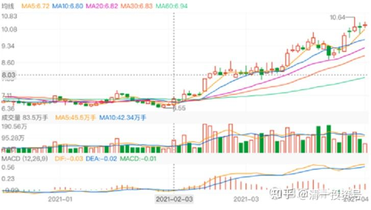
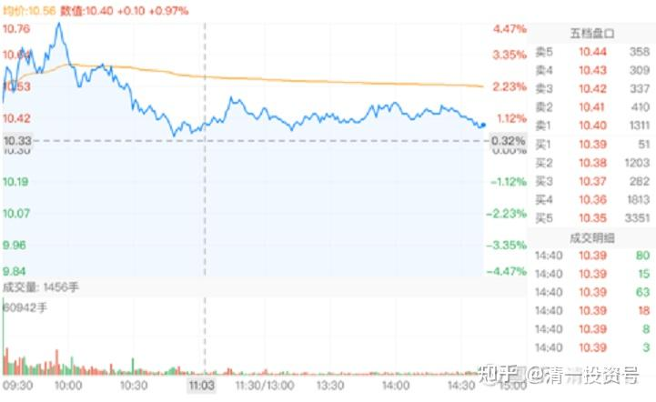
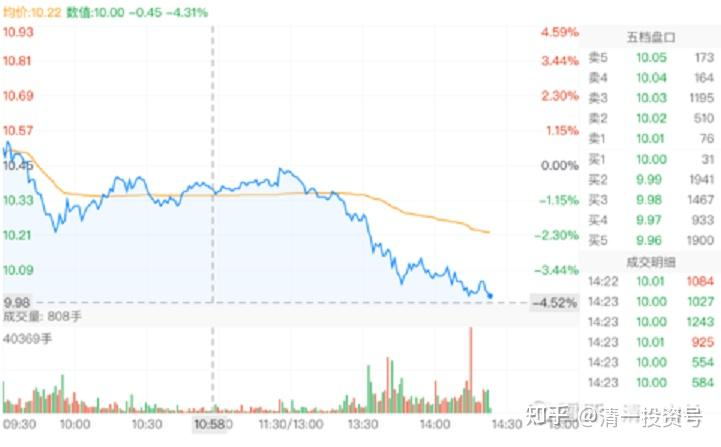
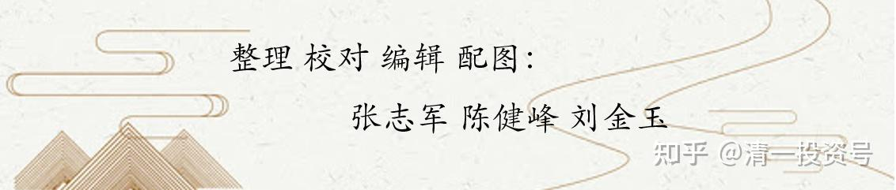

56篇. 华侨城的后续与补充

清一山长 2018年4月~2021年4月

**1.调整，准备坐电梯**

**[清一山长](http://link.zhihu.com/?target=https%3A//xueqiu.com/9310099567)** 2021-04-03 19:45

[$华侨城A(SZ000069)$](http://link.zhihu.com/?target=http%3A//xueqiu.com/S/SZ000069) 估计跟我进华侨城A的人，都清仓跑掉了。我一股未少。从日线图上，没看出主力有出货的迹象。2月份的6.55是挖坑，之后一路抢夺筹码，没给做T的补仓机会。3月24日是主力卖出，非常像要调整。很多人这一天跑了。但三天后，就以更大涨幅拉回。以为要调整的人，这一天主动卖出后，再无上车机会。上一周是用缓步上攻的机会，消化获利筹码。但只让人追高，不让人获利做T，喝主力的血。上周三冲高回落，放量。老手会都跑掉的。长上影线。但周四周五的走势，表示只是日内调整震仓。这个走势，跟惠泉的主力完全不一样，显得很珍惜筹码。我判断主力的走势现阶段依然是掠取筹码，所以我一直不动。**估计有某天大家都狂喜，认为华侨城就绝对不会调整的时候，它才会开始调整。一旦调整，必然放大量。会吸引很多急不可耐的人跟进的。如果发生在大涨之后，就要走，如果没有大涨，应该不会调整。**

惠泉的主力，对高价的筹码是不太想要的，他们手法是持有的主仓不动。拉升时候吃了多少，回调就吐多少。资金保持活力状态。所以，我能看到有明显的机会做T，只要跟上主力的步调就能赚到更多的钱。华侨城一路上是没有机会做T的（对我来说，我认为几毛钱的小T，因小失大，不值得做）。我就老老实实的拿着好了。而且拿华侨城的心态，比拿啤酒坐电梯更好。起码分红多呀[大笑]

**[清一山长](http://link.zhihu.com/?target=https%3A//xueqiu.com/9310099567)** **2021-04-06 14:42**

[$华侨城A(SZ000069)$](http://link.zhihu.com/?target=http%3A//xueqiu.com/S/SZ000069) 这个是日内调整的图形。只有新手才会走。老手会知道：未来还会上涨的。

当然，**高位出这种图，就要小心了。高位就是出货了。**

华侨城，现在算是高位吗？如果您认为是，就要走了[大笑]

**[清一山长](http://link.zhihu.com/?target=https%3A//xueqiu.com/9310099567)** 2021-04-13 14:27

[$华侨城A(SZ000069)$](http://link.zhihu.com/?target=http%3A//xueqiu.com/S/SZ000069) 看样子，真正的调整来了。华侨城本周，下破10元支撑看来是必然的了。图中下跌放量，这种走势不吉祥！**下跌量缩。看好。下跌放量，看跌。**不知道是不是主力对倒，制造恐慌的！

**我是万事不管。华侨城上涨以来，一直都没动。没高卖，也没追买！准备继续坐电梯。**

**[返璞归真ptv](http://link.zhihu.com/?target=https%3A//xueqiu.com/6703363832) 2021-04-23 [15:08向清一山长提问\[¥200.00\]](http://link.zhihu.com/?target=http%3A//xueqiu.com/n/%25C3%25A6%25C2%25B8%25C2%2585%25C3%25A4%25C2%25B8%25C2%2580%25C3%25A5%25C2%25B1%25C2%25B1%25C3%25A9%25C2%2595%25C2%25BF%3Fpaid_mention%3D1)**

尊敬的清一山长，有缘关注到您，受益多多。今想请教：现在价位（9.36元/股)投资华侨城，按3年看风险大吗？请山长指教，谢谢！

**[清一山长](http://link.zhihu.com/?target=https%3A//xueqiu.com/9310099567) 2021-04-23 15:51 回复** **[返璞归真ptv](http://link.zhihu.com/?target=https%3A//xueqiu.com/6703363832)：**

你倒是很会问！。假如你问我：现在能不能买华侨城A，我就直接退回红包了[笑]。或者不理，让你的问题自己过期。

如果要说你是在计划三年期的一笔投资，你干嘛不买现在才四倍多市盈率的中国建筑，而买6倍的华侨城A呢？

所以，我认为，你真实的目标，不是真心想投资华侨城。而是想问：你看华侨城走势有异，是不是可以投机一把？就算暂时套住了，我能忍三年，应该可以解套，不至于亏本吧？

您就是这意思吧？[笑]。

您心中就是想：现在我很眼热，就想投机一把，赚了我的运气好，赚不到，就守三年。保住本金没问题就行！

好吧，如果这样，就很清楚了，我也能回答了。

**从投资的角度来看：**

**华侨城A每股收益是1.55，三年就是五元左右吧。最近从底部涨了三元，用三年来消化，也是没问题的。也就是说：三年后，华侨城A的现价，就如同今年用6元买他一样了。甚至更便宜。所以，从估值这个道理来说，来拿三年的话，是套不住的。**

从投机的角度来看：

华侨城的量价配合还比较好，没有明显的主力出货迹象。现在也刚脱离主力成本区不多，不会直接砸下去的。会用时间来消化浮动筹码。最坏的情况，打压一下，会跌到下一个支撑位8.4元左右。不一定跌到这位置。如果跌到了，应该就会结束调整了。现价买入，风险并不大。往下一元钱空间。往上么？就是你自己想象的华侨城值多少了。这个是价值判断，没有啥真理可言的。有人还认为值50元呢[大笑]。

所以，你要赌，可以赌一把。**我有持仓，反正现价我是不卖的。因为上下都有道理。只是现价我要买的话，作为投资的标的，觉得买中建更安全。**赌的话，怎样都无所谓。你用守三年来赌，这心态应该守得住！[献花花]

**2.与其他公司比较**

**[闷声发大财吧](http://link.zhihu.com/?target=http%3A//xueqiu.com/n/%25C3%25A9%25C2%2597%25C2%25B7%25C3%25A5%25C2%25A3%25C2%25B0%25C3%25A5%25C2%258F%25C2%2591%25C3%25A5%25C2%25A4%25C2%25A7%25C3%25A8%25C2%25B4%25C2%25A2%25C3%25A5%25C2%2590%25C2%25A7)** **回复** **[清一山长](http://link.zhihu.com/?target=http%3A//xueqiu.com/n/%25C3%25A6%25C2%25B8%25C2%2585%25C3%25A4%25C2%25B8%25C2%2580%25C3%25A5%25C2%25B1%25C2%25B1%25C3%25A9%25C2%2595%25C2%25BF):**

大哥，绿地控股利润一直不错，分红也不错，股息都7点多了，不知道这个价格还有人卖呢，这个价位买的话应该很安全，我觉得比华侨城便宜，您怎么看？

**[清一山长](http://link.zhihu.com/?target=https%3A//xueqiu.com/9310099567)** **2021-03-13 14:10 回复[闷声发大财吧](http://link.zhihu.com/?target=http%3A//xueqiu.com/n/%25C3%25A9%25C2%2597%25C2%25B7%25C3%25A5%25C2%25A3%25C2%25B0%25C3%25A5%25C2%258F%25C2%2591%25C3%25A5%25C2%25A4%25C2%25A7%25C3%25A8%25C2%25B4%25C2%25A2%25C3%25A5%25C2%2590%25C2%25A7): **

**员工工资都拖欠的公司，您真敢买吗？**华夏幸福的分红也很高呢[俏皮]

**[niecoqla](http://link.zhihu.com/?target=http%3A//xueqiu.com/n/niecoqla):回复** **[清一山长](http://link.zhihu.com/?target=http%3A//xueqiu.com/n/%25C3%25A6%25C2%25B8%25C2%2585%25C3%25A4%25C2%25B8%25C2%2580%25C3%25A5%25C2%25B1%25C2%25B1%25C3%25A9%25C2%2595%25C2%25BF):**

今天用惠泉换华侨城，不知道是对还是错[哭泣]

**[清一山长](http://link.zhihu.com/?target=https%3A//xueqiu.com/9310099567)2021-03-05 15:10 回复[niecoqla](http://link.zhihu.com/?target=http%3A//xueqiu.com/n/niecoqla): **

这账都算不来？小学白上了。

**用涨了5%的，换跌了5%的股。**

**假如你两个股都持有，相对你不换，与昨天的账户数值相比，你今天赚了10%。**

至于以后咋样？就是以后的事了。只有天知道[俏皮]。万一明天惠泉狂涨，华侨城继续跌，你只能假想:就当你昨天持有的就是华侨城，今天还白赚了10%。**至于惠泉，只是你看热闹的“别人的股”，别惦记别人的股**，就像别惦记别人的老婆一样。这是美德！[笑]

**[神山宁水佑投资](http://link.zhihu.com/?target=http%3A//xueqiu.com/n/%25C3%25A7%25C2%25A5%25C2%259E%25C3%25A5%25C2%25B1%25C2%25B1%25C3%25A5%25C2%25AE%25C2%2581%25C3%25A6%25C2%25B0%25C2%25B4%25C3%25A4%25C2%25BD%25C2%2591%25C3%25A6%25C2%258A%25C2%2595%25C3%25A8%25C2%25B5%25C2%2584)** **回复** **[清一山长](http://link.zhihu.com/?target=http%3A//xueqiu.com/n/%25C3%25A6%25C2%25B8%25C2%2585%25C3%25A4%25C2%25B8%25C2%2580%25C3%25A5%25C2%25B1%25C2%25B1%25C3%25A9%25C2%2595%25C2%25BF):**

再怎么样，买上机赚钱的人也比买华侨城赚钱的人多。

**[清一山长](http://link.zhihu.com/?target=https%3A//xueqiu.com/9310099567)** **2021-02-01 18:38回复** **[神山宁水佑投资](http://link.zhihu.com/?target=http%3A//xueqiu.com/n/%25C3%25A7%25C2%25A5%25C2%259E%25C3%25A5%25C2%25B1%25C2%25B1%25C3%25A5%25C2%25AE%25C2%2581%25C3%25A6%25C2%25B0%25C2%25B4%25C3%25A4%25C2%25BD%25C2%2591%25C3%25A6%25C2%258A%25C2%2595%25C3%25A8%25C2%25B5%25C2%2584): **

再怎么样，70元以上买上机的人，肯定比6-7元买华侨城的人赔得多的多！**买了华侨城、，中国建筑，最惨无非是不赚钱。但这个价格买机场？恐怕不是赚钱的问题，也不是不赚钱这么简单的！**[笑]

**[愿您开心](http://link.zhihu.com/?target=http%3A//xueqiu.com/n/%25C3%25A6%25C2%2584%25C2%25BF%25C3%25A6%25C2%2582%25C2%25A8%25C3%25A5%25C2%25BC%25C2%2580%25C3%25A5%25C2%25BF%25C2%2583)回复[清一山长](http://link.zhihu.com/?target=http%3A//xueqiu.com/n/%25C3%25A6%25C2%25B8%25C2%2585%25C3%25A4%25C2%25B8%25C2%2580%25C3%25A5%25C2%25B1%25C2%25B1%25C3%25A9%25C2%2595%25C2%25BF):**

山长牛B，plus，不忘踩下荣盛发展！

**[清一山长](http://link.zhihu.com/?target=https%3A//xueqiu.com/9310099567)** **2021-04-16 11:28 回复愿您开心: **

我踩荣盛发展干嘛？跟钱过不去吗？**他价格的确太便宜了，我得看便宜的后面，有没有钩子等我。**别一口咬上去却是个钩子，你可以告诉大家: 荣盛是大肉，不是大钩。我研究华侨城A，当时也是超级便宜，让人怀疑是假的。看很久，不假，才买了华侨城的。有本事，就证明荣盛跟华侨城一样没有坑？

（标题为编者所加）

参考链接：

[清一投资号：52篇.华侨城A的建仓和启动](https://zhuanlan.zhihu.com/p/548762542)（整理文）

