国人认为：所谓的学习，就是要去学和记住一些知识。所谓的教育，就是编课本，讲课和考试。

这是一种极为浅薄的概念，远远没搞懂：到底什么是人生真正的学习，什么是真正的教育。

比如：教学知识的学校，其实是最没用的教育。每天都有大量的知识正在过时，失效，被证明是错误。而且知识之间，互相矛盾非常的明显。

最有价值的教育，是心智模式塑造的教育。也就是今日学堂长期强调，但多数家长就是怎么也弄不懂的【心理和行为教育】。由于家长不懂，我们也不敢多做。更不敢放弃知识教育。如果家长要知识教育，我们就只能尽量给知识教育，做得比别人好，家长才会支持。否则你做的心理行为再好，家长也视而不见。不就白做了？甚至还怪你。

对于有明确学习目标，心理行为良好的学生来说，学习效率很高，甚至自己学习也没问题。但对于明显有心理行为问题的学生，直接要求他学习，几乎就没用了。你必须“好好收拾他”，让他彻底改掉身上不利于学习的心理行为，才会改正学习的效率和结果。但:作为私校的教师，哪敢去随便收拾学生？违背家长的心意？我们只能开除行为上影响别人学习的学生，开除掉心态上混日子的学生，免得浪费家长的投资。但我们不能去收拾学生，不能强行要求学生改变原有的心理和行为。这是家长的事情。家长都认为没问题，为啥我们就认为有问题？

今年暑假。家长们面临一批学生没有考上挑战班，要面临分流的局面，才开始着急了。要我出主意，改变这批慵懒，有很好的的机会也不上进的学生心智模式。于是，办学19年来，我们第一次做了一个完全不读书，不用电脑学习的【纯心理行为教育夏令营】---勇武之心夏令营。目标就是修正学生的信念系统，改变他们的心智模式，下学期能够好好学习。因此，我让家长们全程协同，家校联合，一起收拾这群不上进的孩子，改变他们的学习状况。最终的效果很明显，我说至少要六周才有效。结果：第五周学生就全面改变了。即使是最后一名，也改变了很多。变得心态积极向上了。家长们都很感叹：如果一年前，就这样做，这一年孩子的进步不知道有多大。希望未来坚持下去。不过：这种「行为调整」效果这么好的夏令营，我们是不对外的。只有珍惜今日学习资源的家长，只有今日的学生，才能得到这种机会。因为换了别人来参加，可能认为我们全程都在“整人”。而且没有学习功课，没有做作业，考试。

但这才是最重要的教育：心智模式的塑造。这种教育的价值超高，调整完孩子的学习心智模式之后，他们再去学习任何知识，都非常的容易。可惜的就是：全中国没多少人知道这种教育。无论家长还是教师，因为无知，所以都把重点关注在学习课本知识上，导致学习效率的极其低下。都不知道：一旦学生的学习心智模式改变之后，三年学完十二年的课程很轻松。一旦你没有调整孩子的学习心智模式，他越学，效果越差。直接把家长都气死。调整孩子的心智模式，比去买学区房重要100倍。效果好100倍。

所以，只会关注知识和课本，关注成绩的家长，绝对很愚昧。

下面是住校协同观察的家长第五周夏令营的反馈，供大家了解一点情况：

【第五周过去了，孩子们的变化还是很明显的。记得夏令营刚开营时候，很多孩子在训练中有东张西望，话多，小动作等，为此我还特别的不理解和不接受。现在也明白了，让孩子改掉一个毛病不能操之过急，先给孩子树立规则，让他有觉知；孩子触犯规则，给予惩罚；几次下来，孩子就慢慢有了规则的意识并遵守了。如果是要求孩子立即改变，有点痴心妄想；想一想也很容易理解，孩子现在的小毛病，被家长培养了十几年，想要一下子就改掉，那不是白培养了吗？作为家长要反思，要承认孩子的这些小毛病，并给予他们一点时间，也让子弹飞一会吧。

另外从孩子们每日的排名积分表也能看出孩子的状态，虽然积分表包括的都是小事情，比如日记、物品、床铺、卫生、训练中的态度等等，但是却反映出孩子做事的心态，能不能静下心来把小事做好。就比如日记，有的孩子能够经常加分，有的不仅不加分还要扣分；虽然夏令营第一周就明确了写日记的4个思考问题，但是仍然有孩子瞎写，乱写，一看就是没动脑，没反思，当然不会得分，更重要的是也失去了一次反省当天进步和做的不好的机会。

再比如训练中的态度，只要是扣分就基本判定孩子划水，要么是松松垮垮，要么是动作不到位或者是错误，更甚者就是完全偷懒。

其实这些小事的从第一周到第五周，孩子们改进的很明显，每天的积分表名次分值差距越来越小，甚至并列第一名的就能出现5、6个人；而周排名从第一名到第十名相差14分，到第五周相差7分；差距的变小说明孩子们在小事情上都有明显提高了很多。】

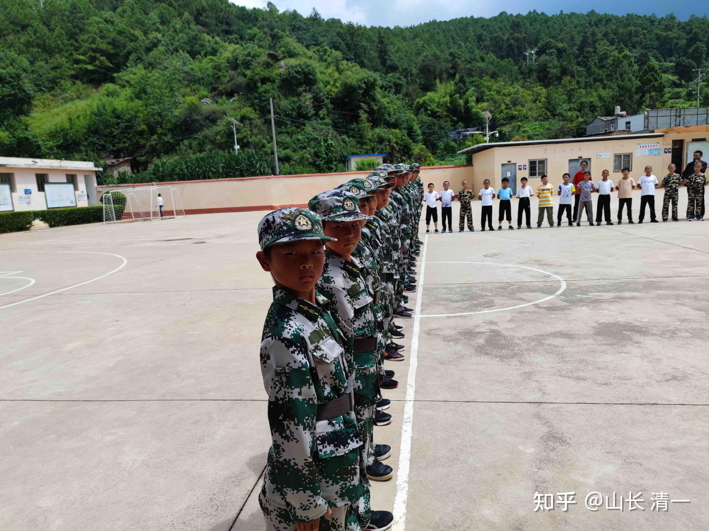

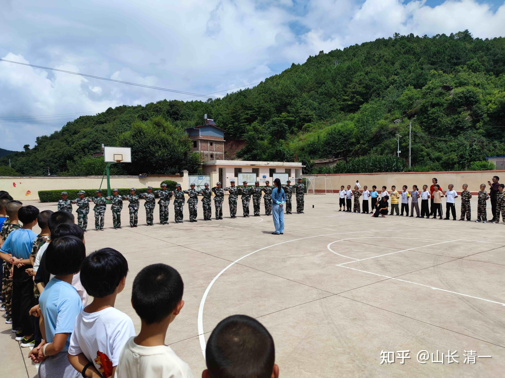

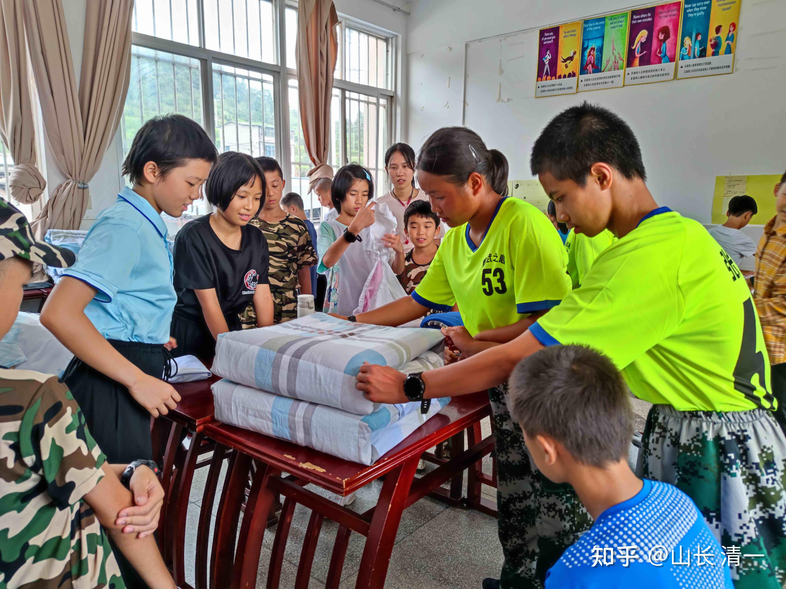

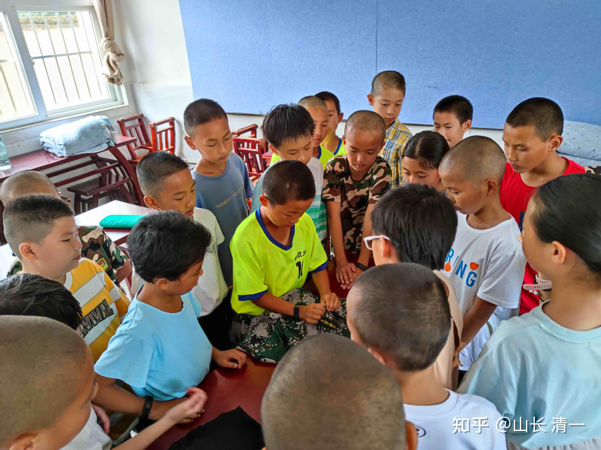

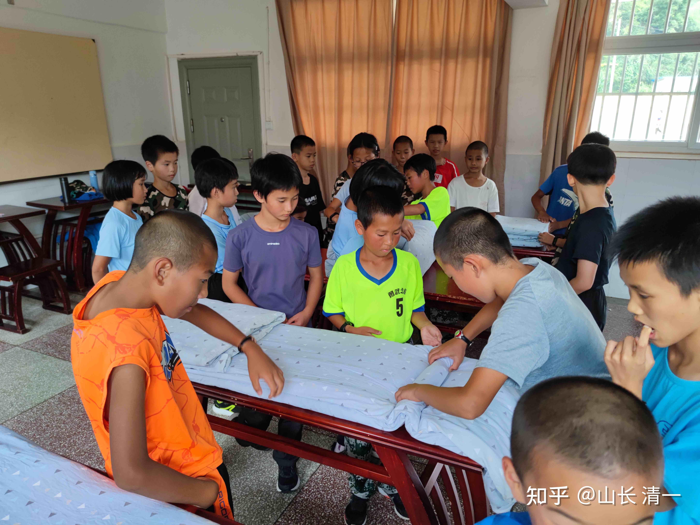

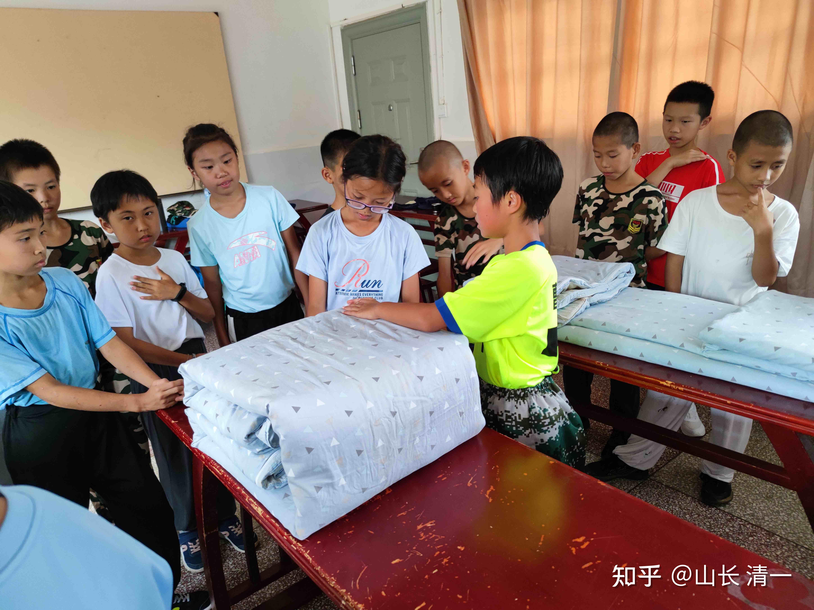

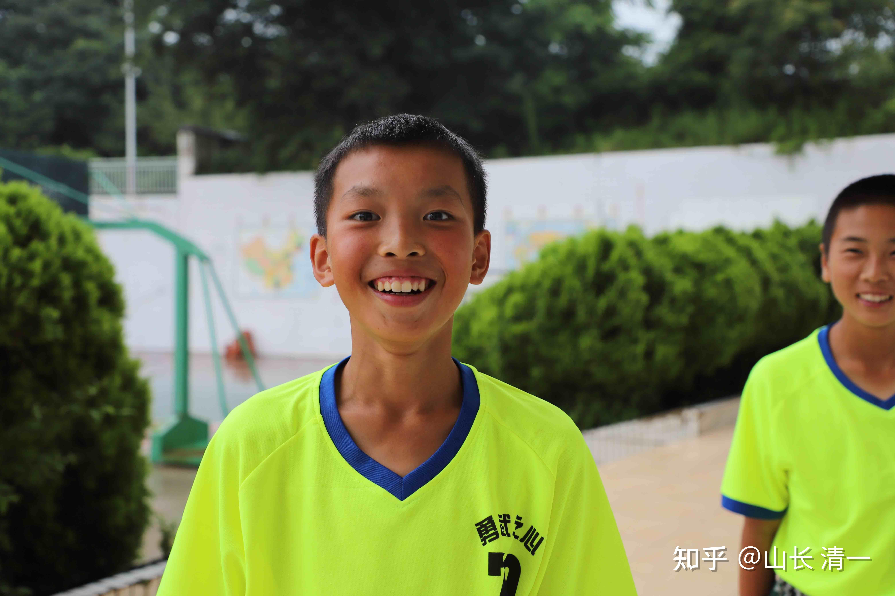

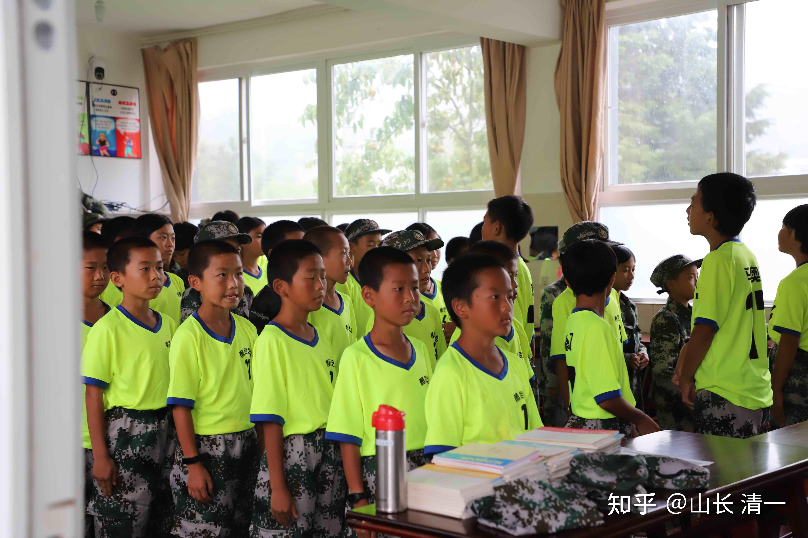

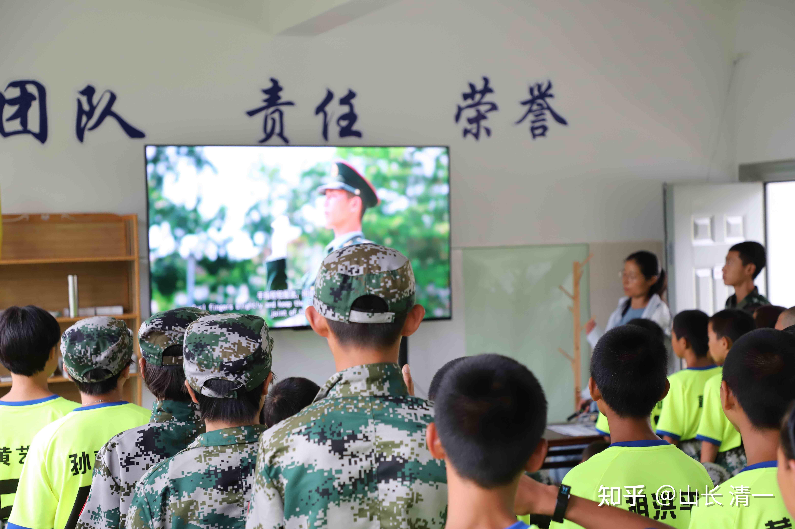

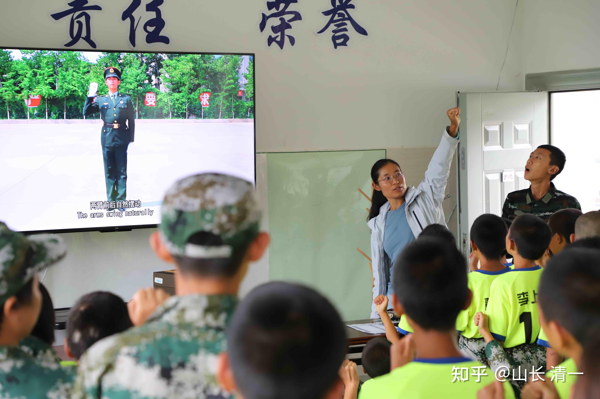

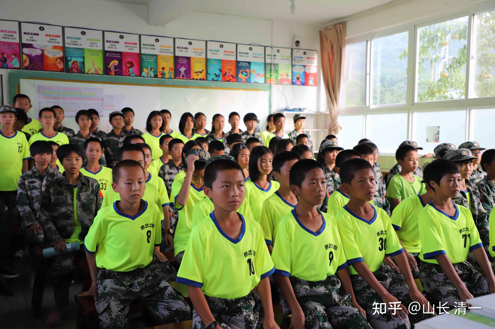

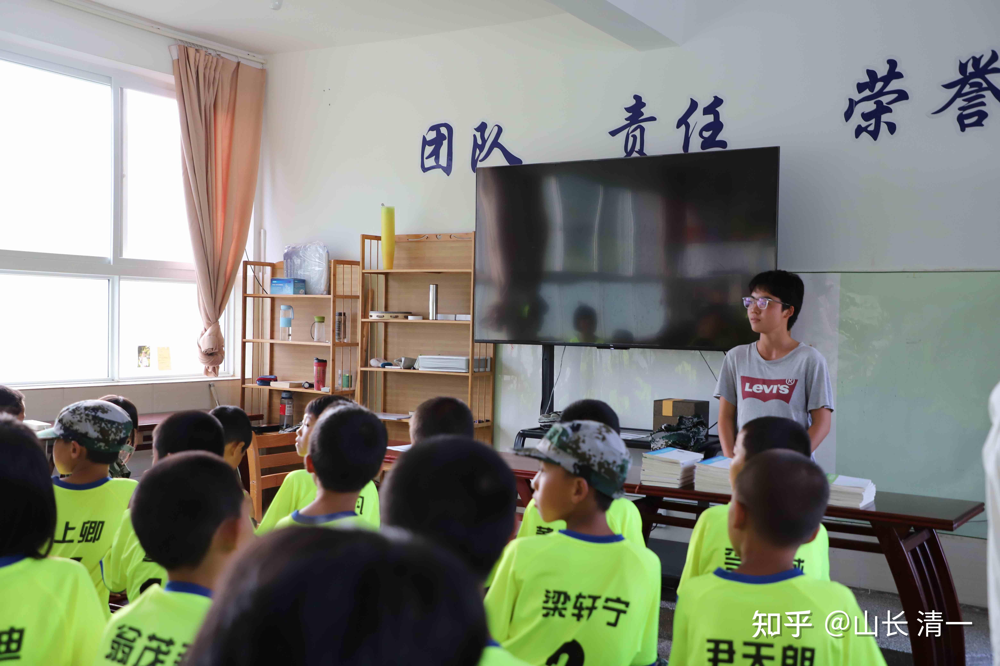

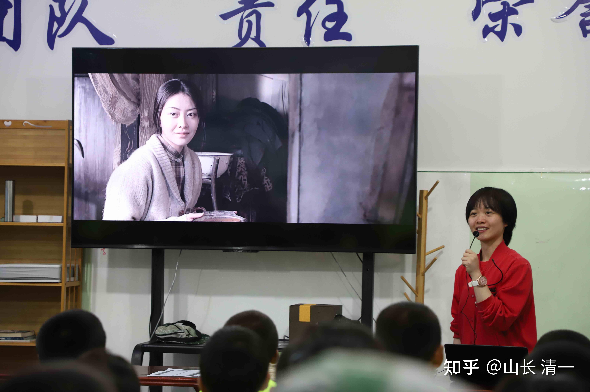

以下，附录一篇文章，是我讲解人生成长三大要素的【愿景，心智模式，知识体系】。这是NLP心理学的内容。很多人不知道。下文用通俗的方式讲解，希望你们了解：对一个孩子来说，最重要的教育，是什么？家长们设法去补上这一课。不然您的孩子读不好书的。

要我说：你如果把[罗振宇](https://www.zhihu.com/search?q=%E7%BD%97%E6%8C%AF%E5%AE%87&search_source=Entity&hybrid_search_source=Entity&hybrid_search_extra=%7B%22sourceType%22%3A%22answer%22%2C%22sourceId%22%3A2615876747%7D)的【知识付费分享】，作为一个骗局来看；还不如你把自己当做傻子，更接近事实一点。罗胖并没骗人，是你自己骗了自己。你眼力太差，看不请真相。

这个世界上，很多人都错误地把“知识”的积累，当做“能力”的提升。其实---知识并不必然带来能力提升。因为：世界上还有两种东西，三者一起合作，才能决定你人生综合的能力表现，才能带来结果。知识系统在其中，只是相对最不重要的组成部分，虽然也“不可缺少”。

**比知识更重要的两种东西是什么？**

**统御和管理知识，应用知识的能力，比拥有知识本身更重要！**

要“统御”知识，最核心的要素，“总统”，就是“人生目标系统---价值观系统”。

我们用“盖房子”来说明这一点。

“知识”相当于“建筑材料”。如果没有“设计图纸”，没有“施工能力”，你拥有的建筑材料再多，也永远不会自动变成漂亮的房子！-----虽然，只有图纸和工程队，而没有建筑材料，你也不可能得到一栋房子。三个要素，都必须密切结合，房子才有希望。

如果一个傻瓜，以为到处收集足够的建筑材料，他愿意花钱去买全世界各种各样丰富的建筑材料，就以为他可以拥有世界上最好的建筑。因为他看到：全世界所有的房子，都是依赖这些建筑材料的。他以为花钱买到了建筑材料，就是花钱买到了各种房子。他花费一生的财富，去收集各种材料，结果----他只是让自己的土地，成为了一个垃圾场：没有建筑目的，把各种建筑材料胡乱堆砌在一起的地方，只能是垃圾场。

只是“拥有书本知识”，不会“运用”知识的人，基本上是知识的奴隶。基本上等同于废物。很多情况下，这种书呆子，还不如没有知识的普通人更有价值。更像是一个笑话。比如---孔乙己！

对于建筑这件事情来说，建筑材料不是最重要的。更重要的，是“如何使用这些建筑材料”。以及最终要用这些材料来实现什么目的？要做学校？还是会所？要做游乐场？大商场，还是体育馆？这是设计目的。

知识，就相当于一个人综合能力的“建筑材料”。如果一个人，只是杂乱无章地收集各种知识，却忘记了自己要如何去处理知识，安排知识，运用知识，让知识变得有序的话，他就是一个知识大垃圾场。知识懂得再多，也毫无用处。因此：很多人跟着学习了很久的【[罗辑思维](https://www.zhihu.com/search?q=%E7%BD%97%E8%BE%91%E6%80%9D%E7%BB%B4&search_source=Entity&hybrid_search_source=Entity&hybrid_search_extra=%7B%22sourceType%22%3A%22answer%22%2C%22sourceId%22%3A2615876747%7D)】，发现自己依然是傻瓜，因为他本来就是傻瓜，现在无非是读过一些二手书的，有知识的傻瓜罢了。却因为发现自己依然很傻，就出来说别人是“骗子”，真是冤枉了别人。罗胖，他只是一个负责“贩卖知识”的商人，不负责教你“应用知识”。他就像是一个卖“建筑材料”的公司，你买回来这些材料，却不会自己盖房子。你心中雄伟的大厦，依然无法在你家院子里面树立起来。你怪谁？只能怪你自己无能！

盖房子，缺了材料固然不行。但比材料更重要的，是你盖房子的目的，你要用来做什么？这就是【房屋设计规划和用途】。你没有目标和用途，有多少材料都是无用的。

目标和用途，根据每一个人的“志趣”而不同。大大小小，都可以。目标越大，你需要的各种辅助材料就越多。如果你收集建筑材料，目标不高，只是为了盖一个猪圈，你有对猪圈的要求和使用的概念，不需要专业的建筑学，工程学的学习，你就可以设计出一个基本上符合你要求的猪圈，需要的建筑材料并不多。一些土，木，砖块就足够了。

但如果你要盖一个“六星级的帆船酒店”，成为[阿拉伯世界](https://www.zhihu.com/search?q=%E9%98%BF%E6%8B%89%E4%BC%AF%E4%B8%96%E7%95%8C&search_source=Entity&hybrid_search_source=Entity&hybrid_search_extra=%7B%22sourceType%22%3A%22answer%22%2C%22sourceId%22%3A2615876747%7D)的地标建筑，炫耀一把你的超级身份。如果你只拥有猪圈设计的小本事，显然是远远不够的。你需要有大量的建筑知识和技术，来决定你如何设计，如何安排各种高精尖建筑材料的使用，以及构造技术。你还需要很多帮手，从全世界招收顶尖的设计队伍和建筑队伍才能实现这个目标。不像自己一个人也可以弄个猪圈。当然，你还需要很多的钱，要给设计师，要给建筑师，要给技术工人等等。不能只有买建筑材料的钱，以为就够用了。你要盖的房子档次越高，越有特色，在建筑材料之外的支出比例就越大。这一切，显然不是盖一个猪圈能够比的了。

因此，一个人，如果想要取得足够高的人生成就（像是盖一个有特色，有吸引力的豪华大房），就必须设定自己高远的人生目标，确定这一生要干什么大事？这是比一个人的知识体系更重要的设定。**这就是：愿景，价值观塑造。**相当于：你喜欢，希望，怎样度过自己的一生？你人生目标是什么？你想用来实现什么样的追求和理想？目标越高，就越难。但人生成就往往越大。

所有的其他的一切，包括你需要去学习和掌握的相关知识，都必须服务于你的人生目标。否则你掌握的知识，就是对你根本就没有用的知识，就是垃圾知识。没有目标的人生，你拥有的所有的知识，都成为你前进道路上的障碍物，都无法让你自然获得成功。对于有目标的人生来说，不符合目标需要的各种知识，都是垃圾！需要清除掉，轻装上阵。所以----知道为啥价值观，愿景，目标体系，对于一个人很重要了？没有它，你的人生就没有指南针。你做什么，学习什么，再多知识，都是无用的。

比如:你的人生目标，假如是“要当格斗世界冠军”，你要做一个与李小龙一样的，影响世界的[武术家](https://www.zhihu.com/search?q=%E6%AD%A6%E6%9C%AF%E5%AE%B6&search_source=Entity&hybrid_search_source=Entity&hybrid_search_extra=%7B%22sourceType%22%3A%22answer%22%2C%22sourceId%22%3A2615876747%7D)。你就必须去掌握「格斗世界】相关的所有知识技能。并放弃与格斗世界无关的所有知识和技能。比如：你显然没有必要去学习【罗马帝国兴亡史】。也没必要去学【[资治通鉴](https://www.zhihu.com/search?q=%E8%B5%84%E6%B2%BB%E9%80%9A%E9%89%B4&search_source=Entity&hybrid_search_source=Entity&hybrid_search_extra=%7B%22sourceType%22%3A%22answer%22%2C%22sourceId%22%3A2615876747%7D)】，更没必要去学微积分，[化学分子式](https://www.zhihu.com/search?q=%E5%8C%96%E5%AD%A6%E5%88%86%E5%AD%90%E5%BC%8F&search_source=Entity&hybrid_search_source=Entity&hybrid_search_extra=%7B%22sourceType%22%3A%22answer%22%2C%22sourceId%22%3A2615876747%7D)，以及[量子力学](https://www.zhihu.com/search?q=%E9%87%8F%E5%AD%90%E5%8A%9B%E5%AD%A6&search_source=Entity&hybrid_search_source=Entity&hybrid_search_extra=%7B%22sourceType%22%3A%22answer%22%2C%22sourceId%22%3A2615876747%7D)，天文学等等。各种再高大上的知识，也跟你没关系。相反，可能全世界的武学体系，以及[运动学](https://www.zhihu.com/search?q=%E8%BF%90%E5%8A%A8%E5%AD%A6&search_source=Entity&hybrid_search_source=Entity&hybrid_search_extra=%7B%22sourceType%22%3A%22answer%22%2C%22sourceId%22%3A2615876747%7D)，身体健康，饮食方式，甚至格斗心理学，各种格斗战术，格斗战略等等，别人不想学的冷门知识，都是你必须学习的，能帮助你实现目标的知识。你要花时间去了解这些内容，显然比你跟着去学罗胖的【罗辑思维】更等“得道”，对你的人生目标实现更有帮助。别以为你出了不少钱给罗胖，因为你“付费”了，你就更接近你的世界冠军目标了（其实罗胖收的钱很少少，几百元包年。你春节去庙里烧一炷香，求个前程，还要几千，几万元呢，你咋不说佛祖骗人？）。恐怕罗胖的付费知识，跟你的世界冠军梦想一点关系都没有。甚至很可能是反向的关系。你如果学多了罗胖，你更书生气了，可能反而更当不上冠军了。你学了几年之后，“突然醒悟”，说你给罗胖付费了，发现你的武力值并没有增加，你回头就骂他是骗子吗？这个----显然不能怪罗胖是骗子，只能怪你自己是傻子！你真有钱的话，付钱给[帕奎奥](https://www.zhihu.com/search?q=%E5%B8%95%E5%A5%8E%E5%A5%A5&search_source=Entity&hybrid_search_source=Entity&hybrid_search_extra=%7B%22sourceType%22%3A%22answer%22%2C%22sourceId%22%3A2615876747%7D)，买他拿到8个级别世界冠军的拳击知识，也比付钱给罗胖，更能帮助你实现世界冠军的目标吧？你不愿意付钱，只是自己去图书馆研究各种世界武术典籍，或者网上认真观摩，研习世界冠军们的格斗技术，也比付钱学罗胖更有成功可能吧？

所以----仅仅是知识，其实根本就不重要。关键是你要用这些知识来干什么？这个---没有任何人能教你，只能你自己去发现，你到底这一生想要做什么！

庄子早就说了：只会追求知识，会给人生带来各种麻烦和危险 **【吾生有涯而知无涯，以有涯随无涯，殆矣】。所以，弱水三千，我只取一瓢饮，别对着一条河，就把自己淹死了，因为你贪心想喝下一条河。我们人生只需要掌握我们需要的知识，不去勉强去追求我们不需要的知识。甚至要学会把无用的知识丢弃掉---这比你学会这些知识更难。**

要盖房子，特别是要盖[帆船酒店](https://www.zhihu.com/search?q=%E5%B8%86%E8%88%B9%E9%85%92%E5%BA%97&search_source=Entity&hybrid_search_source=Entity&hybrid_search_extra=%7B%22sourceType%22%3A%22answer%22%2C%22sourceId%22%3A2615876747%7D)这样的大房子，光有建筑材料显然不行。但仅仅有设计图，外加建筑材料，也不行。还需要有能力，把目标---设计图，以及内容---建筑材料，变成实际真正的漂亮建筑的能力。这就是“工程建造技术运用能力”。这个，不是建筑材料（知识），也不是设计图（目标系统）。而是实实在在的应用能力。只有经过大量的实践和磨练，有成功的建筑历史的建筑单位，才有本领拿下这种高端建筑项目，比如中国的【基建狂魔】。这种“能落地”的实力，叠加了「高级的设计」和“良好的基础材料”，就成为世界的一霸。可以完成全世界其他单位无法完成的建筑任务。

对人来说也一样：仅仅拥有美好的理想 **1：【愿景系统】---伟大的目标，**以及一堆知识 **3：知识结构**，依然不足够让人获取成功。他还需要一种特别的技术和训练，就是**2：“有行动力的心智模式，心理和行为方式”。**良好的心智模式，对于一个人的成功来说，是不可或缺的组成部分。可惜---全世界懂得这一点的人很少。很多人无师自通，自我掌握了良好的心智模式，良好的思维方式。这些人是天才，自我成就者。还有一些人拥有“自毁心智模式”，他善于把一切最好的东西都毁掉，包括自己。一些人拥有“小人物心智模式”，永远都是底层人。西方的精英学校，有些会教一点高级的思维方式。但：中国的体制教育，根本就不教思维方式。因此：大多数人，只能当打工仔，无法去实现自己的目标。**缺乏思维方式的人生，等于没有大脑的动物，只能当机器人！**

我依然用【格斗世界冠军】的案例来说明这一点：

很多人，其实都拥有世界冠军的梦想。每一个参与训练的拳手，基本上都有冠军梦。他们也都有教练，甚至是教出了世界冠军的教练。教练们，都会教给所有的训练者格斗的知识和技能。基本上，这些格斗知识都是公开的，没有啥秘密。但为啥，大多数拳手， 还是无法实现世界冠军的梦想呢？

因为这些无法成为冠军的拳手，还缺一个非常重要的东西：就是他们没有**【世界冠军的心智模式】**。可惜，冠军思维方式，是一种看不见，摸不着的东西。就算是冠军本人，也未必能够把【冠军的思维方式】教给徒弟。只是：他提供了最佳的模仿样本。有时候，有人可以采取完全的模仿和复制，可以提高获得世界冠军的机会。比如你可以通过完全的模仿帕奎奥的行为，反过来得到他的心智模式。但多数人更喜欢“做自己”，于是，做成了平庸的自己。

其实说穿了，心智模式，也不是啥神秘的东西。冠军的思维方式，行为心理，一定与普通拳手，有一些不同之处。比如：

做什么都要比别人多做一点，多想一点，多研究一点。

简单地说，就是“不甘平庸”的心，一定比别人多做一些。

还有：不在意失败，只关注目标等等。

或者不走寻常路。总是找到对手的缺陷来加以利用。

因此：只会傻傻的每天刻苦练功的拳手，可以比一般的拳手强，但他们是拿不到世界冠军的。她们缺乏世界冠军的心智模式。

所以，人生要成功，需要三个东西良好的组合起来，才有机会：**第一是【目标，价值观】，第二是【思维方式，心智模式，心理行为】。第三才是【知识结构】。**

大多数人，都把学习更多的课程，「掌握更多的知识」，看成学习提高的「唯一要素」。这样的一厢情愿，当然你的人生，只能是平庸，注定不会有啥成功可言了。你学了再多，也白学。付费再多，也只是【帮助别人成功】罢了。

除非：你学会正确的帮助自己！这个是心智模式的内容---比知识重要得多！

拿罗胖来举例：他就完美地把三者合一了，所以他成功了。

首先是：愿景和目标系统。他的人生设计目标，职业追求，就是【要用嘴巴来吃饭，让嘴巴变得比一座工厂还值钱】。看起来很不现实，但他做到了。

光有伟大的目标不行呀?还得有实现目标的手段---得有相应的心智模式。这种就是罗胖的思维方式-----

1：必须为顾客提供服务，才有赚钱的机会。

2：必须为最多的顾客，提供他们需要的服务，才能赚大钱。（要有最大的影响力，最多的粉丝）

3：只有创新服务，才能机会插入去赚钱，跟别人对拼，是很难成功的。（有个性特色，创新领先）

因此，他就必须找到一个，现在社会相对潜在的需求，现在还没有人来满足的内在的愿望。是什么？他真的找到了，并辞职离开中央台，自己去开创这一个新的不依赖大众媒体的小众自媒体领域。罗胖发现，并瞄准了一个很多上过大学的普通人的痛点：这些人只是上过学，拿过文凭。但大多数人，其实都没真正的读过书。只是读了一大堆教材罢了。他们需要读一些书来装点自己读书人的体面，而且，这些人也发现了教科书的知识，在工作和生活中实在不够用，有“本领恐慌”。可是，现在的人，都很浮躁，都不会踏实地慢慢去看一本一本的书。他就想：如果有人，能够把一本厚厚的，学术方面的冷门书籍，用轻松简单的方式，让人就能够理解其中的主要思想。让这群人，只需要花上很短的时间，用看和听的方式，就“读完一本书”，肯定能够满足这群懒鬼的需求。他们可以借罗胖的“帮助”，快速地吸取一些看起来很有档次的“快餐知识”，就可以假装很有学问的样子，至少获得谈资，让人佩服一把。当然，也有更多急功近利的人，已经不会阅读了。他可以用短平快的，普罗大众更习惯和适应的视频和音频的方式。来代替直接读书的痛苦。他还可以用通俗化的语言，来代替书籍作者们使用的深奥的学术词汇，满足读不懂学术著作的“底层人群”的知识需求。这样子，他肯定比普通写学术书籍的人，以及卖书的出版社会更受欢迎。更成功。这肯定比当个作家，写一辈子冷门书，以及开个文化出版社，印刷厂更赚钱。这就是罗胖的创业的“技术路径”，他不走寻常路的【心智模式】，选择了一条让人耳目一新的创业方式。

前面两项最重要的东西都有了，第三项，就是【知识内容的获得】了。你认为：为了实现罗胖的伟大理想，他需要非常认真地，一本一本的去看书，去到处去找这些知识和内容来吗?真这样，就不可能成功了。一个人的局限性太大了，无法满足顾客的需要。

其实，罗胖根本就不需要去读书，他甚至不需要学习这些知识，也不用“记住”这些知识，更不需要“会用”这些知识。他只需要会“表演”这些知识，装得好像自己“都懂”的样子，就够了。因此，最佳的方式，就是花一点小钱，去大量的“买重构的书本知识”，就是去雇佣一批比他更会读书的人，来“帮他读书”。并要求他们写出读书的纲要，素材，内容，提供给他做播音的材料就够了。他本人，只需要发挥他在中央台当播音员的能耐，把这些提炼出来的知识内容，假装是自己知道的知识，公开地重复说一次，就完成任务了。他可以尊重版权，公开表明这些什么书，作者是谁，出版社是谁（还可以通过这种推荐，拿一笔推广费），但他没必要尊重帮他"读书提炼的人"，写缩略介绍书籍内容的人。因为他通过付费，买下了这些人的“阅读劳动成果”，帮助他们知识变现---阅读能力变现了。他才没必要去公开宣扬这些读书人呢，他们都是隐身人。你看不见这个环节，但必须明白：这个环节，才是他成功的重要基础，不可或缺的。但：并不是最重要的环节。如果你真的天真地以为：每天罗胖都在成天读书，思考，学习。你就错了，他只是成天在“背稿子”，然后他一定会“忘掉稿子”。这是[播音员](https://www.zhihu.com/search?q=%E6%92%AD%E9%9F%B3%E5%91%98&search_source=Entity&hybrid_search_source=Entity&hybrid_search_extra=%7B%22sourceType%22%3A%22answer%22%2C%22sourceId%22%3A2615876747%7D)的本能。因为这些杂七杂八的“知识内容”，甚至互相矛盾的内容，五花八门的知识，对播音员们基本上没用。如果真有用，中央台的播音员就都是学者了。但你居然以为，这些丰富的知识，居然会对你有用？看你有啥目的了。我认为起码吃饭的时候搬弄一点知识，贩卖（免费）给周围的朋友，他们可能会佩服你知识渊博一把。这个用处能让你满足，是否能让你成功?就不好说了。

罗辑思维的成功，最关键的能力，并不是读书，不是思考，不是总结和应用书中的知识。而是他成功地创造了一个“阅读界的自媒体配平台”，让自己成为“粉红”。比他更有知识的人，秀知识，是不可能赢过他的。他并不需要读书，只需要装得很会读书，而且读书很重要的样子就行了。看起来，他像是读了很多人的书的样子，就够了。假装让你认为：只要懂得很多的知识，刻苦学习，你就能像他一样成功。所以，本质上，他是一个文化演员，书籍阅读的演员。是满足你开心的要求。就像吴京演【战狼】。看起来他的水平，比资深的外国雇佣军水平都高。但你千万别拿吴京去带特种部队，当教官，教特种战术去。罗胖也一样，他只是在建筑一个媒体平台，当个播音员，而不是教你如何读书，如何思考的学者教授。但你看到的结果，好像是：他通过读很多的书，赚了很多的钱！还特别受尊重，赢得了很多的粉丝。你以为：你可能模仿他的成功，通过去听他的播音，把他读过的书，你全都读一遍，你就能跟罗胖一样成功了。你这样想，就是典型的愚蠢----你完全看错了他的成功法门。你真跟他去比读书量，比到处找知识？你就输惨了。光把要他播出的东西吃透（这些内容是一个很多人的团队集体弄出来的），你一个人肯定就忙不过来了。就算忙过来了，你也最多学成了一个播音员，还是一个不值钱的【罗胖模仿秀演员】。他可以拿去每个人卖298元，你拿来一模一样的卖？恐怕9元都卖不出去，你还不如弄好了，卖给罗胖，他至少会给你两千元。所以---你靠这些知识，拿不到罗胖的成功，更拿不到罗胖赚的钱。因为有罗胖的平台了，就没人会来听你的“知识重播”。他的竞争力，根本就不是【罗胖读了多少本书】，而在于他是训练有素的中央台播音员。但他采用了其他播音员不一样的思维和手段，构建了一套新的“帮人读书”的方法，创造了自己的平台和粉丝，以及信誉度。因此，别人愿意付费给他来帮读书。你一样“帮读书”，甚至你比他更会读书，也没人给你钱的。因此：虽然他干的是播音员的活，但他已经不再是播音员，而成了“老板”---自媒体创新平台的创始人。他利用积累下来的众多粉丝，实现了财富的聚集，以及知识界人脉圈的汇聚。

这才是他成功的全部奥秘，不是啥知识和学问，读书的多少。他周围一大群【只是拥有知识】的人，一群会读书的人，正在以两千元一本书的代价，给他写每次的演播的稿子，热心做他的读书工厂流水线的打工仔呢！这是这群读书人难得的“知识变现”机会，比他们去写正经的论文好多了。这些人发表论文，他们还得倒贴钱给杂志。中国真不缺读书人，却会做事的人。会读书，更还会做事，这种人才是人才。当然，会管人，会管事，就更是人才了。

所以：罗胖的案例，充分说明了：知识真的不值钱。会读书，也谈不上是啥了不起的本事。善于运用知识的能力，才更值钱！会做事，比会读书更有价值！

更厉害的是：**会做人，比会做事更有价值。**比如---罗胖会用一堆读书人，来给他打工（会做人，会用人），比他仅仅会做事（当播音员）更有价值。所以，他虽然在前台，装成一个普通员工（播音员）的样子，其实他是这个阅读平台的老板，他会用人。至于他会读书吗？----就别太认真了。他会读书，还是不会读书。他是装着在读书，还是真热爱读书，这些，真的都不是重点。