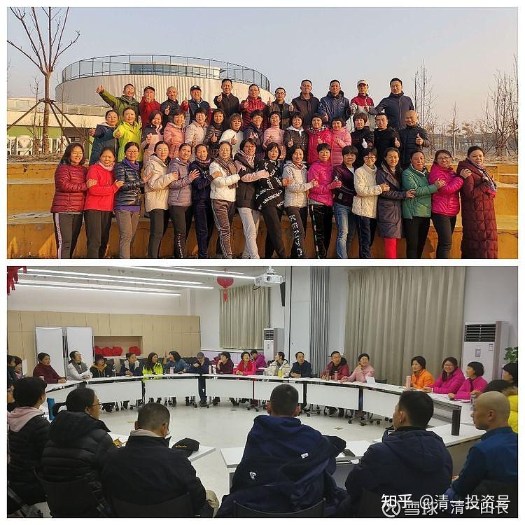
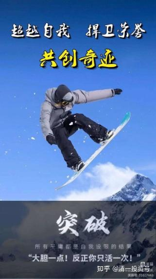
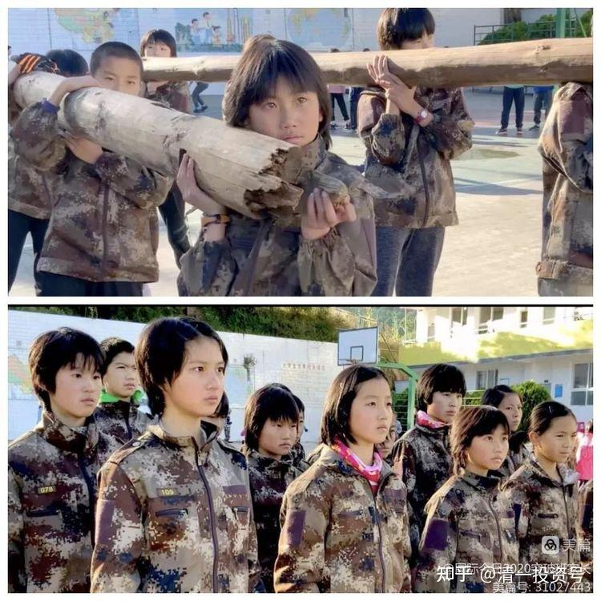
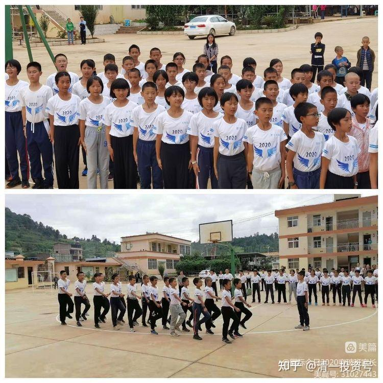
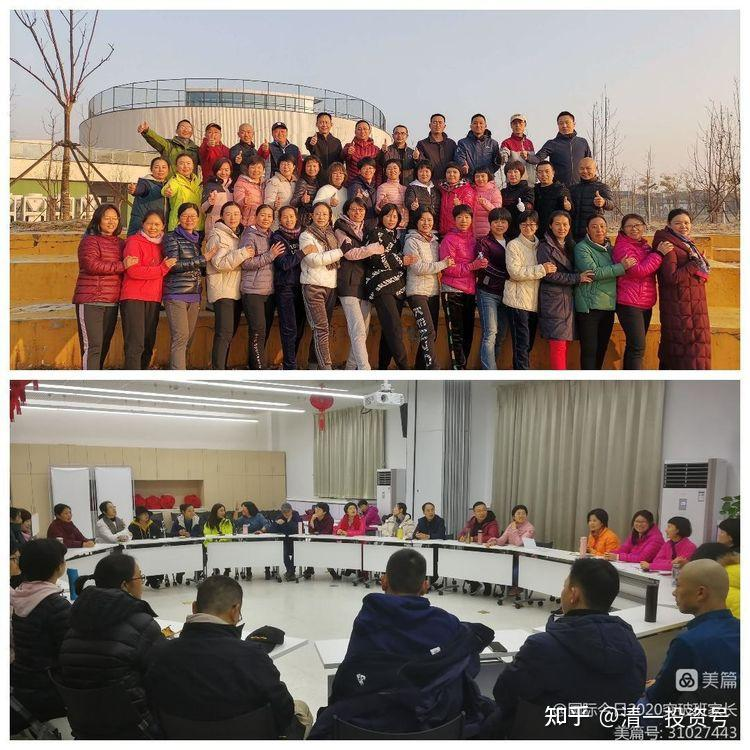
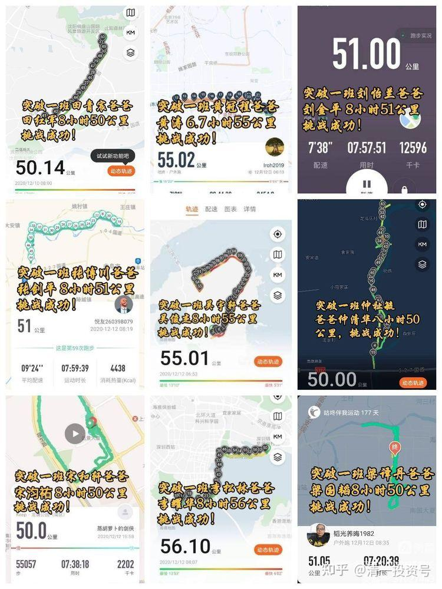

原雪球专栏94篇.新教育家长是一群喜欢自讨苦吃的人吗？

清一山长 2020年12月20日

今日家长们在玩什么？[网页链接](http://link.zhihu.com/?target=https%3A//www.meipian8.cn/3bhxtity)

美篇网页链接：[https://www.meipian8.cn/3bhxtity](http://link.zhihu.com/?target=https%3A//www.meipian8.cn/3bhxtity%3Fshare_depth)

今日家长一直以自己的孩子和学校为荣。最近两校PK中。国际今日的学生输了多场，家长们坐不住了，开始自发用行动来“挺”自己的孩子，跟孩子一样去挑战极限。在投票活动了，两校家长均表现出了超强的竞争力，动员朋友圈投自己的孩子一票！大家都玩得挺开心的[笑]。

由于我在国外，都不知道家长自己业余时间在忙什么。带班教师把家长自己办的班级公众号链接转给我，才知道：原来家长们也跟孩子一样拼。**精英阶层，不是花钱买来的头衔，而是用生命拼出来的荣誉。当家长们这样努力示范的时候，孩子就得到了最大的力量和支持**。目前这种家长的凝聚程度，有点像国外的名校中小学的家长状态了，很多家长积极参与和支持学校的活动，让学校和学生，都获得了完全不同的发展机会。海外名校举办校级运动和文艺比赛，家长们的热情往往比学生更高、更投入。

其他方面也一样，**精英家长们，会为学校提供最顶尖的教学条件支持，帮助自己的孩子取得社会竞争的优势。**比如，比尔·盖茨的中学，当时的学费比哈佛大学还高三倍。出了高价学费的家长，还觉得不够。家长对学校的支持，是难以想象的高。当年的计算机刚刚出现，特别的昂贵，普通的大学都买不起。但这些精英家长们认为计算机的价值很高，就自发筹资，买了一台当时的高级计算机送给学校。大约就是我上大学的时候的计算机房这种超大的计算器系统，要用一栋房子来专门装机器，还有装空调冷却，是纸带上打孔输入输出的。价格可以买当时的几百套房子。

送给学校了，还帮学校建设起了专业的机房。但学校的教师都不会用，这些精英家长们就自己请专业人员来教孩子“玩计算机”，比尔·盖茨就是这个时候玩上瘾的，这才有机会成为了后来的IT精英。如果比尔·盖茨在普通的公立学校上学，是绝对不可能知道啥是计算机的。甚至我当年虽然上过计算机课程，但总觉得计算机就是神秘的东西，不可能拿来玩（当时的管理监控极其严密）。所以，我当然不可能成为第一批了解和加入IT业发展的人了。其实，比尔·盖茨从哈佛大学退学，也和他少年时候的教育有关。他喜欢计算机，虽然大学也有计算机，甚至比他中学的计算机还好，但是他发现：大学的老师还没他懂计算机，所以他很看不起哈佛大学，觉得学不到什么东西，干脆自己退学了。最近他的两个女儿上大学，就没有上哈佛，而是去了斯坦福大学。显然现在西方精英阶层的眼里，哈佛、耶鲁这些老牌大学，已经落后于时代了（耶鲁最新世界排名掉得很厉害，好像跌出前20名了）

今日的家长们也不差，也想一样去做，只要能够支持学堂的事情，家长们都愿意出来做。他们不知道该买什么东西来支持学校发展，就追着我要捐款，让我自己去安排使用。有家长一次就想要捐款一千万元给我。我说：“现在还不需要，我们是文科学校，不用这么多钱买高新设备，建实验室等。”家长就说：“建校总要捐款吧？”我说现在还够用，不够用的时候，我再找家长们支持。我很高兴家长们有这个意识——**支持学校，帮助孩子的学校成为最强竞争力的学校，也就帮忙自己的孩子获得了将来最有利的优势竞争地位！**这种**参与型、经营者类型的家长**，与早期的今日家长偏于消费者模式，已经有了很大的不同。当然，我们的生源质量，也有了本质性的提高。

我记得当年我教家长们精英概念和信念系统时，说：“我们教孩子们要做经营者。”几个亿万资产的家长，居然大大咧咧的说：“你们做经营者就好了，我们可以做消费者。没有消费者，经营者就没法当了[吐血]。”还说：“我们孩子不需要会挣钱，她学会生活，有情调就行了。”并要求我们学堂开设琴棋书画，还要推荐老师给我们。这个境界，跟海外精英家长差距甚大。我拒绝家长的友情提议后，家长很不满意，把孩子转走了，去了一个我称为“养老院”的私立贵族学校读书。学费很高，但不教啥有价值的东西。这所学校，真的是只要学生开心就行。教艺术、茶道、琴棋书画的。以“国学”的名义来办学，让孩子们舒舒服服地玩。这种富二代，我看都要变“负二代”的！

所以，总结就是：精英阶层，真的是“拼爹”的。**不仅仅是拼家长的钱，更要拼家长的意识。家长的意识是强者哲学，孩子自然是强者；家长弱，孩子要强都很难**。今日免费班学生的竞争力表现，好几年了，一直是远远不如正规班的学生。我猜就是家长弱了。十年后，这些孩子进入职场，谁会赢？光靠孩子去拼，难度真的太大了！

**[这就是今日学堂](http://link.zhihu.com/?target=https%3A//space.bilibili.com/487498588/channel/series)**

**附录：[超越自我、捍卫荣誉、共创奇迹](http://link.zhihu.com/?target=https%3A//www.meipian8.cn/3bhxtity)**

国际今日2020突破班家长 2020-12-19

——**记国际今日2020级突破班家长挑战“双十二”50公里、8个小时、一个馒头、一瓶水。**

2020年11月10日——公主预备班“凤凰涅槃活动”中极限体能、意志力、团队精神突破，国际今日溃败清一塾；

**2020年11月26日**——国际今日突破班挑战体能极限50公里山路8小时一个馒头一瓶水；

**2020年11月29日——青春营八期**

国际今日突破班43名家长经过7天学习，空杯、接纳、互送礼物并照见内心，完成了空前的默契度磨合，心与心紧紧的连在一起，期间达成两点共识：

**一**、家长为自己完全的负责，把孩子的责任交还给孩子，理解、信任、接纳、放下、拒绝共生、尊重、内省、知行合一；

**二**、坚强、勇敢都是磨练出来的，少说话，多做事，身教大于言传，以能量传递能量，用生命影响生命！！！

突破班所有家长一致决定2020年12月12日将是我们国际今日突破班第一个突破日，我们以国际今日家长身份为荣，誓言做国际今日的经营者、共建者、奉献者，我们将以行动和责任荣耀团队，捍卫今日荣誉，突破自己，我们行，我们能，我们可以！

同步设立每个月一次国际今日家长突破日，用决心和毅力践行团队第一、坚韧卓越。

2020年12月12日——72名勇士在所有家人的鼓励下，用团队第一、坚韧卓越来激励自己，用决心和信念武装自己，用行动和责任鼓舞自己，用收获和胜利来荣耀自己！

我们开始行动了.......

[https://video.ivwen.com/users/31027443/1608298642362.mp4](http://link.zhihu.com/?target=https%3A//video.ivwen.com/users/31027443/1608298642362.mp4)

“双十二”突破日参加人数72人，

突破50公里的有39人，

突破40公里的16人，

突破30公里14人，

突破半马2人，

突破站桩5小时1人，

共计跑步里程3150.92公里。

平均里程达到45公里，成功超越全马！

平均用时7.6小时，我们成功战胜了自己，过程即是奖励，我们用突破荣耀自己，我们用行动证明我们无愧今日人的身份！

我们成功超越了自我！我们共同捍卫了国际今日的荣誉！我们将用全新的自己创造一个又一个奇迹！

　　勇士们用心谱写的突破体验将会给我们带来心灵的能量共振，让我们传承并发扬国际今日精神，立志做最好的中国人。

[https://video.ivwen.com/users/31027443/1608300775114.mp4](http://link.zhihu.com/?target=https%3A//video.ivwen.com/users/31027443/1608300775114.mp4)

**感恩篇**

**一班王乐仁妈妈何彩霞50公里突破感怀**

“你怎么不坚持？你真让我失望”，这是上一周得知孩子挑战8小时50公里，但却在截止时间时只完成了42公里之后的第一句话。而仅仅一周之后，在自己参与到家长们8小时50公里突破活动后，我的第一个想法是要真诚地对孩子说“对不起”。这并不是说我不希望孩子去突破，而是通过亲身经历，我知道了“坚持”的不易。在这次徒步中，我感受到身体越来越沉重，双腿越来越麻木，只有心还扑通扑通地在跳，在告诉我“不能放弃，要配得上今日家长这个身份”，就是凭着这个信念，我在最后一步一挪的状态下，走完了计划中的全程，但时间已经是9个多小时，超过计划1个多小时。

没有多么荣耀，也没有多么激动人心，有的是宁静和感恩。感恩孩子带给我这样的机缘，感恩自己也可以挑战这种从来没有的突破。我也可以做到，我的孩子也会做到，当我对孩子说出真心话时，我感受到孩子内心的欢喜和接纳。而且我相信，孩子被真正地理解和接纳，他内在的动力将会更强。人生不止一次突破，每个人的人生都会有无数的危机，如何把“危”变成“机”，考验的是个人的内动力，不只是单纯的意志。感恩国际今日！让我们一起来荣耀自己的生命。

**二班黄思茗妈妈杨臣美**

我是先跑后走，围着同沙公园走了三圈，一圈大概14公里的样子，用时9小时53分，走完第一圈我感觉体能已经用的差不多了，左腿膝盖开始隐隐作痛，喝了点米汤继续走第二圈，第二圈还没走完，我就开始打心里佩服我妈了，想起小时候我妈为了给我上学凑学费，除了干农活，还要一早用肩膀挑两大箩筐米豆腐出去卖，鞋子走烂了不知多少双，两箩筐加起来有100多斤重，衣服上的肩膀位置都被扁担压烂了多少件…边走边想哭，我妈为我吃了太多的苦，我这辈子做牛做马都还不清。可我之前却是那么的自以为是，以为自己比妈妈厉害，比妈妈赚钱多，觉得在生活上跟妈妈有代沟，言语上经常冲撞妈妈，原来我是那么无能和不懂事，觉得自己之前真的连畜生都不如。回到家，抱着我妈哭了好久，请教了我妈当年她是如何坚持下来的，还跟妈妈道了歉，说自己之前不懂事，不孝顺，感谢妈妈的养育之恩，以后一定好好报达好好孝顺妈妈。以前上慧心课也觉得自己应该跟妈妈道歉，可是回到家就是做不出来，通过这次体验我是彻底臣服了。

感谢这次挑战打掉了我的傲慢打掉了我的自以为是，让我体验了原来走路走多了，是那么的难受，那么的痛不欲生，而妈妈比我坚强和伟大太多太多!

团结篇

**吴宇轩爸爸吴俊杰：**

团队的力量：一是班级团队，大家虽然在全国各地，但是通过网络的形式，大家互相鼓励激励，能量完全不一样；二是夫妻伙伴团队，夫妻是最亲密的伙伴团队，互相鼓励扶持，是最终能完成突破的关键。

目标的力量：这次定的目标是8小时55公里，孩子在学堂突破50公里，也给了我们很多建议，在突破之前，为了这个目标，做了很多的准备和策划。比如开始前长时间的热身，比如刚开始运用跑的策略，后面运用边跑边走的方法，最后5公里，将目标细化到每公里用时少于12分钟，所有都是为了一个大目标，就是8小时55公里。

**一班张博川妈妈王翠兰：**

8小时突破50公里，这对我来说是几乎不可能，连先生也难以相信，我平生跑最多的就是上个月月底跑了一次10公里，更何况几乎很少有户外运动的经历，唯有的就是在家打坐，最多也就2个小时，但在新教育这个高能量圈，奇迹就是发生了。

12.12日，这真的是个有纪念意义的日子，如果问我2020年对我意义重大的时间，那么一是8.28号，收到儿子入读今日学堂的通知，再有就是12.12号了。

双12日2020级所有突破班家长一起突破，早6点微信群就能量满满，全国各地的伙伴开始行动了，我们山东小团队是两个家庭一起跑，当天天气雾霾较重，8点多雾霾稍减轻些我们就开始了，5-6米之外几乎就看不到人影，跑的过程中伙伴们互相激励、鼓励。

我的体会：

一是伙伴的力量强大，没有伙伴我可能就突破不了。联想到孩子在学堂有这么多优秀的伙伴陪伴，真的是非常幸福。

二、目标：为了维护今日家长的荣誉，一定要突破，尽管我跑步的最远记录仅上月跑了一次10公里，但我心笃定，心中只有目标。

三、方法：跑的时候，一定用腹式呼吸，关注呼吸，另外关注点不要放在身体上。全程自我激励，可以背诵一句激励自己的话，比如《王子经》、《公主经》里面的话。

四、信念:身体几乎要达到极限的时候，能够坚持下来的不是体能而是永不放弃的毅力和信心。

感恩新教育教师团队！

感恩伙伴们！

感恩山长开创新教育！

**突破篇**

**二班周星宇爸爸周河川：**

喊口号容易，踏踏实实落地做事有多难！

从听说学堂进行了50公里极限挑战，内心第一反应就是，我也可以完成，头脑一热给自己接龙了51公里的目标。12日济南大雾并且重度雾霾，能见度很差，，一早我就信心满满的跑步出发了，等接近完成半马时，不知是发力过早过猛还是怎的，体力竟然开始不支，两腿沉重，跑不起来了，尝试几次都难以坚持，只好开始快走，并开始尝试跑走结合，心想毕竟才耗时3小时左右，时间还有，即使走也能顺利完成的。但是半程后双脚双腿越来越不听使唤，踉踉跄跄使劲儿拽着两条腿往前挪动，速度越来越慢，大小腿和膝盖也越来越酸疼僵硬，几次短暂休息和补充水分，一瓶500毫升左右的水早早喝完，一直到剩下最后5公里时，双腿好像渐渐恢复点儿力量，开始快起来，无奈后半程耽误时间过多，最后超时9分钟勉强完成50公里。

几点体会：深深的体会到说易做难，觉悟到自己的自大、攀比、欲证明自己的那颗心，也感同身受孩子们在极限挑战中的努力，与孩子的互动中以后也尽量不随意发表评判，多去感受孩子的心，只要孩子态度端正、尽力去做了，暂时的没有达成目标，也许只是暂时实力还不够，信任孩子，给他更多的时间！目标与愿心很重要：有目标、有愿心就会排除万难，想尽一切办法客服困难创造条件去实现，反之，则会找各种理由借口去逃避，由此更加理解学堂对于孩子目标感培养的良苦用心和对于教育要点的把握之精准，新教育强调有愿心，只要有这颗心，没有做不好的事、完成不了的目标！

**一班宋和轩爸爸宋汮佑：**

人生第一次50公里8小时突破，真实感受到了整个过程如此艰难，体验到了什么样的忍受程度才是极限，在跑步的过程中，无数次想到放弃，最后5公里时难受到极点，眼泪都流出来了。也正是这次的50公里挑战，可以说，一定会给我以后的人生带来很多启发和改变,明白了只要努力去做，万事都皆有可能。同时体验到团队就是力量，目标就是动力。坚持，努力不放弃就能成功。

人生如跑步，不是等你万事都准备好了，才去做,而是一旦目标确定，立即行动。不去理会别人的目光和言语，做自己的该做事情。孤独也好，失败也罢，坚持再坚持，就能笑到最后。

**卓越篇**

**二班袁子钦妈妈袁传连**

突破60km我和先生选在12月10日周四早上8:27分开始进行徒步，我計划也是一直跑到50公里，剩下時間就徒步10公里，時間为8小時。誰知道跑到16公里開始小腹疝气，疼痛不已。馬上我改成跑一会兒走一会兒來調整我的腹痛，这一调就到了42.50公里了，运动手环也沒有电，而時間已经过了5个半小時有多，一算時間就明白我接下來一定要跑才能8小時完成60公里。這个时候我只有逼自己一把，腹痛也要扛著，因為也只是两个小時的事情。就是這樣我用时两小時完成了18公里，余了一、二十分钟慢走，直到8小時就結束。整个过程我的身心合一，专注着这一件事，虽然过程中身体的疼痛会使我感到疲憊。当自己专注一定要完成时，腹部疼痛都不能影响我前进的步伐。因為胜利的曙光一直向我招手。在此感謝大家的感召与支持！让我收获如此之多。

**董子萱爸爸董文俊：**

我三天进行了两次，第一次前半程的速度不够，只完成了49公里，后段已经没有足够的力气，来追回这一公里了。有了第一次失败的经验，第二次前面逼迫自己多跑一些，后面咬牙坚持，终于完成目标。理解了想要成为卓越的人并非只是喊喊口号，而是要不断的承受别人承受不了的挑战。

有了这次突破，才体会到平时说的“加油、你要努力、你可以的”，这些都没用，当腿脚疼痛难忍、时间不多时，不止一次想要放弃。唯有必须完成目标的信念，支撑着自己一步一步坚持到最后。

　　感恩所有家人真情意切的分享，每一次阅读都能让我们内心激动澎湃，感受到了一种力量的召唤，期待下一次的突破日，我们再创奇迹！

更多家人们的精彩分享，请点击下面链接。

[2020年12月19日国际今日2020突破班家长50公里突破感悟](http://link.zhihu.com/?target=https%3A//www.meipian.cn/3bhy2i4l)

**参考链接：**

[这就是今日学堂](http://link.zhihu.com/?target=https%3A//space.bilibili.com/487498588/channel/series)（视频）

[2012年的今日学堂](http://link.zhihu.com/?target=https%3A//www.bilibili.com/video/BV193411178W)（视频）

[2013年今日学堂基本功解析](http://link.zhihu.com/?target=https%3A//www.bilibili.com/video/BV1534y1R7wZ)（视频）

[2014年的今日学堂](http://link.zhihu.com/?target=https%3A//www.bilibili.com/video/BV14h411p7yd)（视频）

[2015年5月明德女塾武汉游学](http://link.zhihu.com/?target=https%3A//www.bilibili.com/video/BV19U4y1t7Js)（视频）

[2017年9月一份特殊的教师节礼单](http://link.zhihu.com/?target=https%3A//www.bilibili.com/video/BV1Kq4y1r7u7)（视频）

[2019 年国际今日](http://link.zhihu.com/?target=https%3A//www.bilibili.com/video/BV1BN4y1g7vX)（视频）